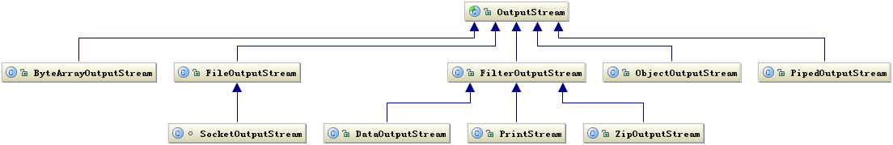
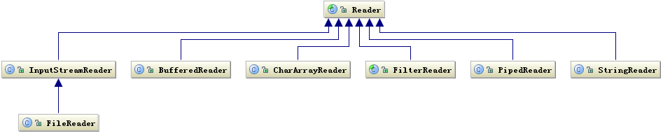
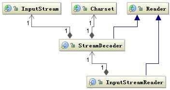
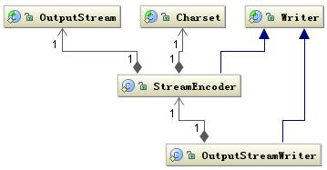
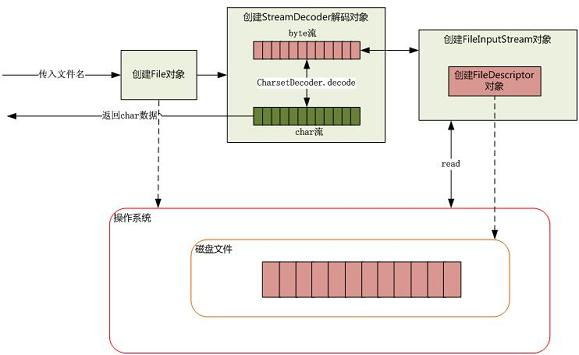

## [原文](https://www.ibm.com/developerworks/cn/java/j-lo-javaio/index.html)

# 深入分析 Java I/O 的工作机制

## Java 的 I/O 类库的基本架构
I/O 问题是任何编程语言都无法回避的问题，可以说 I/O 问题是整个人机交互的核心问题，
因为 I/O 是机器获取和交换信息的主要渠道。
在当今这个数据大爆炸时代，I/O 问题尤其突出，很容易成为一个性能瓶颈。

正因如此，所以 Java 在 I/O 上也一直在做持续的优化，
如从 1.4 开始引入了 NIO，提升了 I/O 的性能。关于 NIO 我们将在后面详细介绍。

Java 的 I/O 操作类在包 java.io 下，大概有将近 80 个类，但是这些类大概可以分成四组，分别是：

1. 基于字节操作的 I/O 接口：InputStream 和 OutputStream

2. 基于字符操作的 I/O 接口：Writer 和 Reader

3. 基于磁盘操作的 I/O 接口：File

4. 基于网络操作的 I/O 接口：Socket

前两组主要是根据传输数据的数据格式，后两组主要是根据传输数据的方式，
虽然 Socket 类并不在 java.io 包下，但是我仍然把它们划分在一起，

因为我个人认为 I/O 的核心问题要么是数据格式影响 I/O 操作，
要么是传输方式影响 I/O 操作，也就是将什么样的数据写到什么地方的问题，
I/O 只是人与机器或者机器与机器交互的手段，

除了在它们能够完成这个交互功能外，
我们关注的就是如何提高它的运行效率了，而数据格式和传输方式是影响效率最关键的因素了。
我们后面的分析也是基于这两个因素来展开的。

## 基于字节的 I/O 操作接口
基于字节的 I/O 操作接口输入和输出分别是：InputStream 和 OutputStream，InputStream 输入流的类继承层次如下图所示：

图 1. InputStream 相关类层次结构

 
输入流根据数据类型和操作方式又被划分成若干个子类，每个子类分别处理不同操作类型，
OutputStream 输出流的类层次结构也是类似，如下图所示：

图 2. OutputStream 相关类层次结构

 
这里就不详细解释每个子类如何使用了，如果不清楚的话可以参考一下 JDK 的 API 说明文档，
这里只想说明两点，一个是操作数据的方式是可以组合使用的，如这样组合使用
```java

OutputStream out = new BufferedOutputStream(new ObjectOutputStream(new FileOutputStream("fileName"))；
```
还有一点是流最终写到什么地方必须要指定，要么是写到磁盘要么是写到网络中，
其实从上面的类图中我们发现，写网络实际上也是写文件，
只不过写网络还有一步需要处理就是底层操作系统再将数据传送到其它地方而不是本地磁盘。

关于网络 I/O 和磁盘 I/O 我们将在后面详细介绍。

## 基于字符的 I/O 操作接口
不管是磁盘还是网络传输，最小的存储单元都是字节，而不是字符，所以 I/O 操作的都是字节而不是字符，
但是为啥有操作字符的 I/O 接口呢？   
这是因为我们的程序中通常操作的数据都是以字符形式，
为了操作方便当然要提供一个直接写字符的 I/O 接口，如此而已。

我们知道字符到字节必须要经过编码转换，而这个编码又非常耗时，而且还会经常出现乱码问题，
所以 I/O 的编码问题经常是让人头疼的问题。
关于 I/O 编码问题请参考另一篇文章 [《深入分析Java中的中文编码问题》](http://www.ibm.com/developerworks/cn/java/j-lo-chinesecoding/)。

下图是写字符的 I/O 操作接口涉及到的类，Writer 类提供了一个抽象方法 write(char cbuf[], int off, int len) 由子类去实现。

图 3. Writer 相关类层次结构 

 
读字符的操作接口也有类似的类结构，如下图所示：

图 4.Reader 类层次结构


读字符的操作接口中也是 int read(char cbuf[], int off, int len)，
返回读到的 n 个字节数，不管是 Writer 还是 Reader 类它们都只定义了读取或写入的数据字符的方式，
也就是怎么写或读，但是并没有规定数据要写到哪去，写到哪去就是我们后面要讨论的基于磁盘和网络的工作机制。

## 字节与字符的转化接口
另外数据持久化或网络传输都是以字节进行的，所以必须要有字符到字节或字节到字符的转化。
字符到字节需要转化，其中读的转化过程如下图所示：

图 5. 字符解码相关类结构


InputStreamReader 类是字节到字符的转化桥梁，InputStream 到 Reader 的过程要指定编码字符集，
否则将采用操作系统默认字符集，很可能会出现乱码问题。

StreamDecoder 正是完成字节到字符的解码的实现类。也就是当你用如下方式读取一个文件时：

清单 1.读取文件
```java

try { 
           StringBuffer str = new StringBuffer(); 
           char[] buf = new char[1024]; 
           FileReader f = new FileReader("file"); 
           while(f.read(buf)>0){ 
               str.append(buf); 
           } 
           str.toString(); 
} catch (IOException e) {}
```
FileReader 类就是按照上面的工作方式读取文件的，
FileReader 是继承了 InputStreamReader 类，实际上是读取文件流，
然后通过 StreamDecoder 解码成 char，只不过这里的解码字符集是默认字符集。

写入也是类似的过程如下图所示：

图 6. 字符编码相关类结构


通过 OutputStreamWriter 类完成，字符到字节的编码过程，由 StreamEncoder 完成编码过程。

## 磁盘 I/O 工作机制
前面介绍了基本的 Java I/O 的操作接口，这些接口主要定义了如何操作数据，
以及介绍了操作两种数据结构：字节和字符的方式。

还有一个关键问题就是数据写到何处，其中一个主要方式就是将数据持久化到物理磁盘，
下面将介绍如何将数据持久化到物理磁盘的过程。

我们知道数据在磁盘的唯一最小描述就是文件，也就是说上层应用程序只能通过文件来操作磁盘上的数据，
文件也是操作系统和磁盘驱动器交互的一个最小单元。

值得注意的是 Java 中通常的 File 并不代表一个真实存在的文件对象，当你通过指定一个路径描述符时，
它就会返回一个代表这个路径相关联的一个虚拟对象，
这个可能是一个真实存在的文件或者是一个包含多个文件的目录。   

为何要这样设计？   
因为大部分情况下，我们并不关心这个文件是否真的存在，而是关心这个文件到底如何操作。
例如我们手机里通常存了几百个朋友的电话号码，但是我们通常关心的是我有没有这个朋友的电话号码，
或者这个电话号码是什么，但是这个电话号码到底能不能打通，我们并不是时时刻刻都去检查，
而只有在真正要给他打电话时才会看这个电话能不能用。也就是使用这个电话记录要比打这个电话的次数多很多。

何时真正会要检查一个文件存不存？就是在真正要读取这个文件时，例如 FileInputStream 类都是操作一个文件的接口，
注意到在创建一个 FileInputStream 对象时，会创建一个 FileDescriptor 对象，其实这个对象就是真正代表一个存在的文件对象的描述，
当我们在操作一个文件对象时可以通过 getFD() 方法获取真正操作的与底层操作系统关联的文件描述。
例如可以调用 FileDescriptor.sync() 方法将操作系统缓存中的数据强制刷新到物理磁盘中。

下面以清单 1 的程序为例，介绍下如何从磁盘读取一段文本字符。如下图所示：

图 7. 从磁盘读取文件


当传入一个文件路径，将会根据这个路径创建一个 File 对象来标识这个文件，
然后将会根据这个 File 对象创建真正读取文件的操作对象，
这时将会真正创建一个关联真实存在的磁盘文件的文件描述符 FileDescriptor，
通过这个对象可以直接控制这个磁盘文件。

由于我们需要读取的是字符格式，
所以需要 StreamDecoder 类将 byte 解码为 char 格式，至于如何从磁盘驱动器上读取一段数据，
由操作系统帮我们完成。至于操作系统是如何将数据持久化到磁盘以及如何建立数据结构需要根据当前操作系统使用何种文件系统来回答，
至于文件系统的相关细节可以参考另外的文章。

