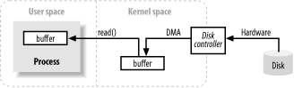
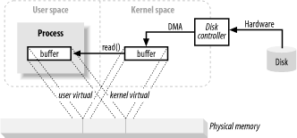

## [原文](http://www.importnew.com/14111.html)

# Java I/O底层是如何工作的？

本博文主要讨论I/O在底层是如何工作的。本文服务的读者，
迫切希望了解Java I/O操作是在机器层面如何进行映射，以及应用运行时硬件都做了什么。
假定你熟悉基本的I/O操作，比如通过Java I/O API读写文件。这些内容不在本文的讨论范围。

## 目录
- 缓存处理和内核vs用户空间
- 虚拟内存
- 内存分页
- 面向文件、块的I/O
- 文件锁定
- 面向流的I/O

## 缓存处理和内核vs用户空间

缓冲与缓冲的处理方式,是所有I/O操作的基础。
术语“输入、输出”只对数据移入和移出缓存有意义。任何时候都要把它记在心中。
通常，进程执行操作系统的I/O请求包括数据从缓冲区排出（写操作）和数据填充缓冲区（读操作）。
这就是I/O的整体概念。

在操作系统内部执行这些传输操作的机制可以非常复杂，但从概念上讲非常简单。我们将在文中用一小部分来讨论它。

上图显示了一个简化的“逻辑”图，它表示块数据如何从外部源，   
例如一个磁盘，移动到进程的存储区域（例如RAM）中。

首先，进程要求其缓冲通过read()系统调用填满。
这个系统调用导致内核向磁盘控 制硬件发出一条命令要从磁盘获取数据。
磁盘控制器通过DMA直接将数据写入内核的内存缓冲区，不需要主CPU进一步帮助。
当请求read()操作时，一旦磁盘控制器完成了缓存的填写，
内核从内核空间的临时缓存拷贝数据到进程指定的缓存中。

有一点需要注意，在内核试图缓存及预取数据时，内核空间中进程请求的数据可能已经就绪了。
如果这样，进程请求的数据会被拷贝出来。如果数据不可用，则进程被挂起。内核将把数据读入内存。

## 虚拟内存
你可能已经多次听说过虚拟内存了。让我再介绍一下。

所有现代操作系统都使用虚拟内存。虚拟内存意味着人工或者虚拟地址代替物理（硬件RAM）内存地址。

虚拟地址有两个重要优势：

1. 多个虚拟地址可以映射到相同的物理地址。
2. 一个虚拟地址空间可以大于实际可用硬件内存。

在上面介绍中，从内核空间拷贝到最终用户缓存看起来增加了额外的工作。
为什么不告诉磁盘控制器直接发送数据到用户空间的缓存呢？  
好吧，这是由虚拟内存实现的。用到了上面的优势1。

通过将内核空间地址映射到相同的物理地址作为一个用户空间的虚拟地址，
DMA硬件（只能访问物理内存地址）可以填充缓存。这个缓存同时对内核和用户空间进程可见。

这就消除了内核和用户空间之间的拷贝，但是需要内核和用户缓冲区使用相同的页面对齐方式。
缓冲区必须使用的块大小的倍数磁盘控制器（通常是512字节的磁盘扇区）。
操作系统将其内存地址空间划分为页面，这是固定大小的字节组。
这些内存页总是磁盘块大小的倍数和通常为2倍（简化寻址）。典型的内存页面大小是1024、2048和4096字节。
虚拟和物理内存页面大小总是相同的。

## 内存分页
为了支持虚拟内存的第2个优势（拥有大于物理内 存的可寻址空间）需要进行虚拟内存分页（通常称为页交换）。
这种机制凭借虚拟内存空间的页可以持久保存在外部磁盘存储，从而为其他虚拟页放入物理内存提供了空间。

本质上讲，物理内存担当了分页区域的缓存。
分页区是磁盘上的空间，内存页的内容被强迫交换出物理内存时会保存到这里。

调整内存页面大小为磁盘块大小的倍数，让内核可以直接发送指令到磁盘控制器硬件，
将内存页写到磁盘或者在需要时重新加载。事实证明，所有的磁盘I/O操作都是在页面级别上完成的。
这是数据在现代分页操作系统上在磁盘与物理内存之间移动的唯一方式。

现代CPU包含一个名为内存管理单元（MMU）的子系统。这个设备逻辑上位于CPU与物理内存之间。
它包含从虚拟地址向物理内存地址转化的映射信息。当CPU引用一个内存位置时，
MMU决定哪些页需要驻留（通常通过移位或屏蔽地址的某些位）以及转化虚拟页号到物理页号（由硬件实现，速度奇快）。

## 面向文件、块I/O
文件I/O总是发生在文件系统的上下文切换中。文件系统跟磁盘是完全不同的事物。
磁盘按段存储数据，每段512字节。它是硬件设备，对保存的文件语义一无所知。
它们只是提供了一定数量的可以保存数据的插槽。从这方面来说，一个磁盘的段与 内存分页类似。
它们都有统一的大小并且是个可寻址的大数组。

另一方面，文件系统是更高层抽象。文件系统是安排和翻译保存磁盘（或其它可随机访问，面向块的设备）数据的一种特殊方法。
你写的代码几乎总是与文件系统交互，而不与磁盘直接交互。文件系统定义了文件名、路径、文件、文件属性等抽象。

一个文件系统组织（在硬盘中）了一系列均匀大小的数据块。有些块保存元信息，如空闲块的映射、目录、索引等。
其它块包含实际的文件数据。单个文件的元信息描述哪些块包含文件数据、数据结束位置、最后更新时间等。
当用户进程发送请求来读取文件数据时，文件系统实现准确定位数据在磁盘上的位置。
然后采取行动将这些磁盘扇区放入内存中。

文件系统也有页的概念，它的大小可能与一个基本内存页面大小相同或者是它的倍数。
典型的文件系统页面大小范围从2048到8192字节，并且总是一个基本内存页面大小的倍数。

分页文件系统执行I/O可以归结为以下逻辑步骤：

1. 确定请求跨越了哪些文件系统分页（磁盘段的集合）。
磁盘上的文件内容及元数据可能分布在多个文件系统页面上，这些页面可能是不连续的。

2. 分配足够多的内核空间内存页面来保存相同的文件系统页面。

3. 建立这些内存分页与磁盘上文件系统分页的映射。

4. 对每一个内存分页产生分页错误。

5. 虚拟内存系统陷入分页错误并且调度pagins（页面调入），通过从磁盘读取内容来验证这些页面。

6. 一旦pageins完成，文件系统分解原始数据来提取请求的文件内容或属性信息。

需要注意的是，这个文件系统数据将像其它内存页一样被缓存起来。
在随后的I/O请求中，一些数据或所有文件数据仍然保存在物理内存中，可以直接重用不需要从磁盘重读。

## 文件锁定
文件加锁是一种机制，一个进程可以阻止其它进程访问一个文件或限制其它进程访问该文件。
虽然名为“文件锁定”，意味着锁定整个文件（经常做的）。
锁定通常可以在一个更细粒度的水平。随着粒度下降到字节级，文件的区域通常会被锁定。
锁与特定文件相关联，起始于文件的指定字节位置并运行到指定的字节范围。
这一点很重要，因为它允许多个进程协作访问文件的特定区域而不妨碍别的进程在文件其它位置操作。

文件锁有两种形式：共享和独占。多个共享锁可以同时在相同的文件区域有效。
另一方面，独占锁要求没有其它锁对请求的区域有效。

## 流I/O
并非所有的I/O是面向块的。还有流I/O，它是管道的原型，必须顺序访问I/O数据流的字节。
常见的数据流有TTY（控制台）设备、打印端口和网络连接。

数据流通常但不一定比块设备慢，提供间歇性输入。大多数操作系统允许在非阻塞模式下工作。
允许一个进程检查数据流的输入是否可用，不必在不可用时发生阻塞。
这种管理允许进程在输入到达时进行处理，在输入流空闲时可以执行其他功能。

比非阻塞模式更进一步的是有条件的选择（readiness selection）。
它类似于非阻塞模式（并且通常建立在非阻塞模式基础上），但是减轻了操作系统检查流是否就绪准的负担。
操作系统可以被告知观察流集合，并向进程返回哪个流准备好的指令。
这种能力允许进程通过利用操作系统返回 的准备信息，使用通用代码和单个线程复用多个活动流。
这种方式被广泛用于网络服务器，以便处理大量的网络连接。准备选择对于大容量扩展是至关重要的。

到此为止，对这个非常复杂的话题有一大堆技术术语。

