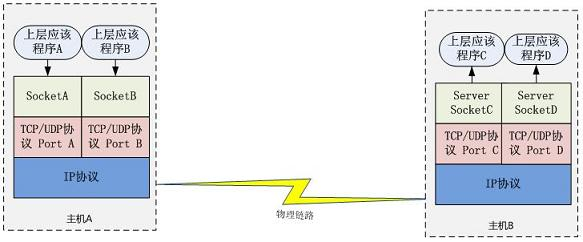

# Java Socket 的工作机制

Socket 这个概念没有对应到一个具体的实体，它是描述计算机之间完成相互通信一种抽象功能。

打个比方，可以把 Socket 比作为两个城市之间的交通工具，有了它，就可以在城市之间来回穿梭了。
交通工具有多种，每种交通工具也有相应的交通规则。

Socket 也一样，也有多种。大部分情况下我们使用的都是基于 TCP/IP 的流套接字，它是一种稳定的通信协议。

下图是典型的基于 Socket 的通信的场景：

图 8.Socket 通信示例

主机 A 的应用程序要能和主机 B 的应用程序通信，必须通过 Socket 建立连接，
而建立 Socket 连接必须需要底层 TCP/IP 协议来建立 TCP 连接。

建立 TCP 连接需要底层 IP 协议来寻址网络中的主机。

我们知道网络层使用的 IP 协议可以帮助我们根据 IP 地址来找到目标主机，
但是一台主机上可能运行着多个应用程序，
如何才能与指定的应用程序通信就要通过 TCP 或 UPD 的地址也就是端口号来指定。
这样就可以通过一个 Socket 实例唯一代表一个主机上的一个应用程序的通信链路了。

## 建立通信链路
当客户端要与服务端通信，客户端首先要创建一个 Socket 实例，
操作系统将为这个 Socket 实例分配一个没有被使用的本地端口号，
并创建一个包含本地和远程地址和端口号的套接字数据结构，
这个数据结构将一直保存在系统中直到这个连接关闭。

在创建 Socket 实例的构造函数正确返回之前，将要进行 TCP 的三次握手协议，
TCP 握手协议完成后，Socket 实例对象将创建完成，否则将抛出 IOException 错误。

与之对应的服务端将创建一个 ServerSocket 实例，ServerSocket 创建比较简单只要指定的端口号没有被占用，
一般实例创建都会成功，同时操作系统也会为 ServerSocket 实例创建一个底层数据结构，
这个数据结构中包含指定监听的端口号和包含监听地址的通配符，通常情况下都是“*”即监听所有地址。
之后当调用 accept() 方法时，将进入阻塞状态，等待客户端的请求。

当一个新的请求到来时，将为这个连接创建一个新的套接字数据结构，
该套接字数据的信息包含的地址和端口信息正是请求源地址和端口。
这个新创建的数据结构将会关联到 ServerSocket 实例的一个未完成的连接数据结构列表中，
注意这时服务端与之对应的 Socket 实例并没有完成创建，而要等到与客户端的三次握手完成后，
这个服务端的 Socket 实例才会返回，并将这个 Socket 实例对应的数据结构从未完成列表中移到已完成列表中。
所以 ServerSocket 所关联的列表中每个数据结构，都代表与一个客户端的建立的 TCP 连接。

## 数据传输
传输数据是我们建立连接的主要目的，如何通过 Socket 传输数据，下面将详细介绍。

当连接已经建立成功，服务端和客户端都会拥有一个 Socket 实例，
每个 Socket 实例都有一个 InputStream 和 OutputStream，正是通过这两个对象来交换数据。
同时我们也知道网络 I/O 都是以字节流传输的。
当 Socket 对象创建时，操作系统将会为 InputStream 和 OutputStream 分别分配一定大小的缓冲区，
数据的写入和读取都是通过这个缓存区完成的。写入端将数据写到 OutputStream 对应的 SendQ 队列中，

当队列填满时，数据将被发送到另一端 InputStream 的 RecvQ 队列中，
如果这时 RecvQ 已经满了，那么 OutputStream 的 write 方法将会阻塞直到 RecvQ 队列有足够的空间容纳 SendQ 发送的数据。

值得特别注意的是，这个缓存区的大小以及写入端的速度和读取端的速度非常影响这个连接的数据传输效率，
由于可能会发生阻塞，所以网络 I/O 与磁盘 I/O 在数据的写入和读取还要有一个协调的过程，
如果两边同时传送数据时可能会产生死锁，在后面 NIO 部分将介绍避免这种情况。