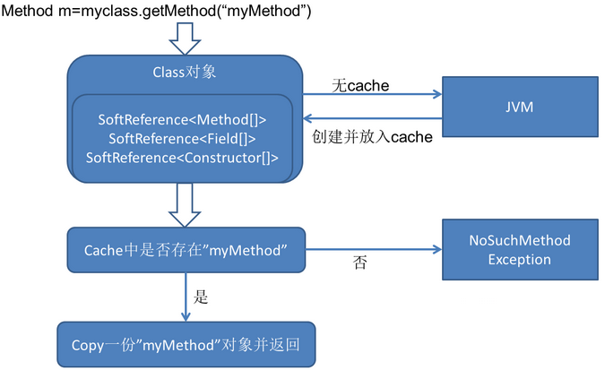
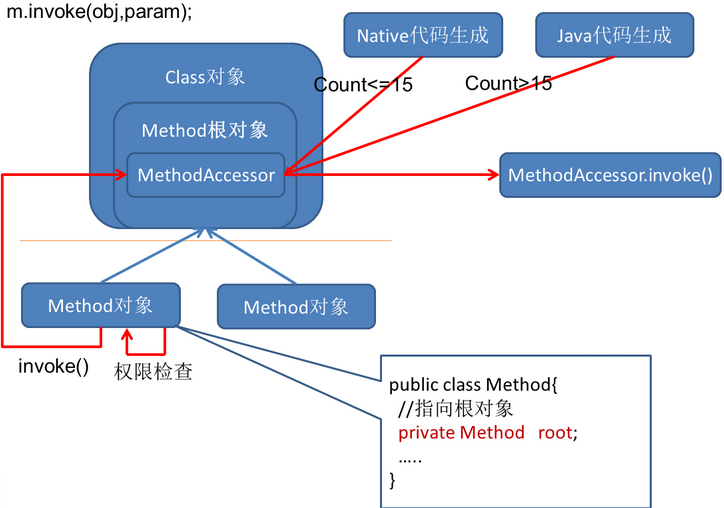
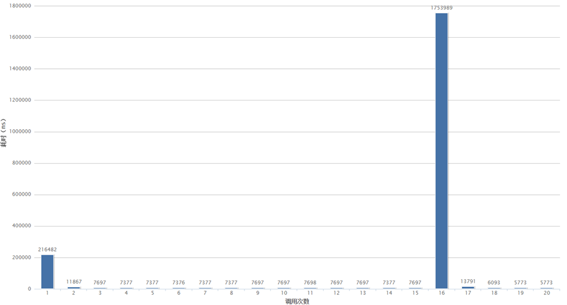

## [原文](http://www.fanyilun.me/2015/10/29/Java%E5%8F%8D%E5%B0%84%E5%8E%9F%E7%90%86/)

# Java反射原理简析

Java的反射机制允许我们动态的调用某个对象的方法/构造函数、获取某个对象的属性等，而无需在编码时确定调用的对象。
这种机制在我们常用的框架中也非常常见。

## 1.原理简介
```java

Class actionClass=Class.forName(“MyClass”);
Object action=actionClass.newInstance();
Method method = actionClass.getMethod(“myMethod”,null);
method.invoke(action,null);

```
上面就是最常见的反射使用的例子，前两行实现了类的装载、链接和初始化（newInstance方法实际上也是使用反射调用了<init>方法），
后两行实现了从class对象中获取到method对象然后执行反射调用。下面简单分析一下后两行的原理。

其实我们设想，上面的代码中，如果想要实现method.invoke(action,null)调用action对象的myMethod方法，
只需要实现这样一个Method类即可：

```java

Class Method{

     public Object invoke(Object obj,Object[] param){

        MyClass myClass=(MyClass)obj;

        return myClass.myMethod();

     }

}

```

反射的原理之一其实就是动态的生成类似于上述的字节码，加载到jvm中运行。

## 2.获取Method对象
首先来看一下Method对象是如何生成的：



上面的Class对象是在加载类时由JVM构造的，JVM为每个类管理一个独一无二的Class对象，
这份Class对象里维护着该类的所有Method，Field，Constructor的cache，这份cache也可以被称作根对象。
每次getMethod获取到的Method对象都持有对根对象的引用，因为一些重量级的Method的成员变量（主要是MethodAccessor），
我们不希望每次创建Method对象都要重新初始化，于是所有代表同一个方法的Method对象都共享着根对象的MethodAccessor，
每一次创建都会调用根对象的copy方法复制一份：

//在JDK11 中查看已经不再 copy 每一份
```java

    Method copy() { 

        Method res = new Method(clazz, name, parameterTypes, returnType,

                                exceptionTypes, modifiers, slot, signature,

                                annotations, parameterAnnotations, annotationDefault);

        res.root = this;

        res.methodAccessor = methodAccessor;

        return res;

    }

```
## 3.调用invoke()方法

获取到Method对象之后，调用invoke方法的流程如下：




可以看到，调用Method.invoke之后，会直接去调MethodAccessor.invoke。
MethodAccessor就是上面提到的所有同名method共享的一个实例，由ReflectionFactory创建。
创建机制采用了一种名为inflation的方式（JDK1.4之后）：如果该方法的累计调用次数<=15，会创建出NativeMethodAccessorImpl，
它的实现就是直接调用native方法实现反射；如果该方法的累计调用次数>15，
会由java代码创建出字节码组装而成的MethodAccessorImpl。（是否采用inflation和15这个数字都可以在jvm参数中调整）
以调用MyClass.myMethod(String s)为例，生成出的MethodAccessorImpl字节码翻译成Java代码大致如下：
```java

public class GeneratedMethodAccessor1 extends MethodAccessorImpl {    
    public Object invoke(Object obj, Object[] args)  throws Exception {
        try {
            MyClass target = (MyClass) obj;
            String arg0 = (String) args[0];
            target.myMethod(arg0);
        } catch (Throwable t) {
            throw new InvocationTargetException(t);
        }
    }
}

```
至于native方法的实现，由于比较深入本文就不探讨了，欢迎有兴趣的同学来补充。

4.性能
下面分析一下反射的性能相关的问题，以及为什么要有inflation这个机制。下图是我本地循环使用反射二十次的耗时（单位ns）：



从变化趋势上看，第1次和第16次调用是最耗时的（初始化NativeMethodAccessorImpl和字节码拼装MethodAccessorImpl）。
毕竟初始化是不可避免的，而native方式的初始化会更快，因此前几次的调用会采用native方法。

随着调用次数的增加，每次反射都使用JNI跨越native边界会对优化有阻碍作用，
相对来说使用拼装出的字节码可以直接以Java调用的形式实现反射，
发挥了JIT优化的作用，避免了JNI为了维护OopMap（HotSpot用来实现准确式GC的数据结构）进行封装/解封装的性能损耗。
因此在已经创建了MethodAccessor的情况下，使用Java版本的实现会比native版本更快。所以当调用次数到达一定次数（15次）后，
会切换成Java实现的版本，来优化未来可能的更频繁的反射调用。


以上就是本次对反射的分享学习，推荐一篇R大的博文 http://rednaxelafx.iteye.com/blog/548536 ，
和代码相关的细节在这篇文章里写得比较多，笔者也是在这篇文章基础上进行学习探究的。