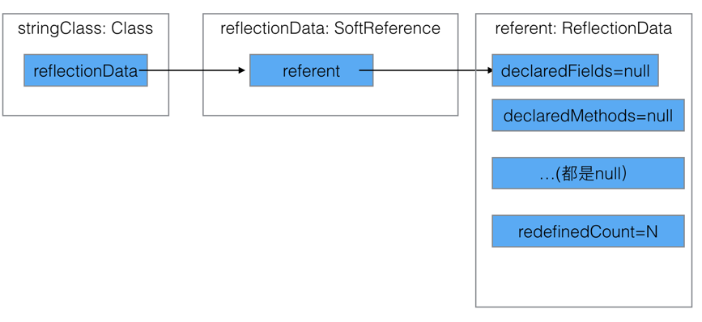
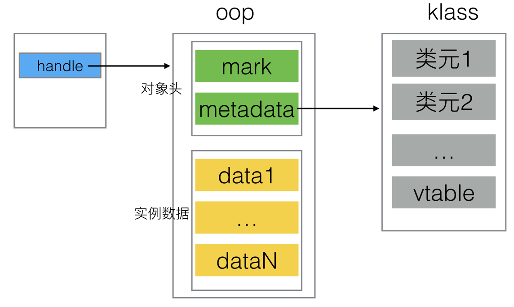
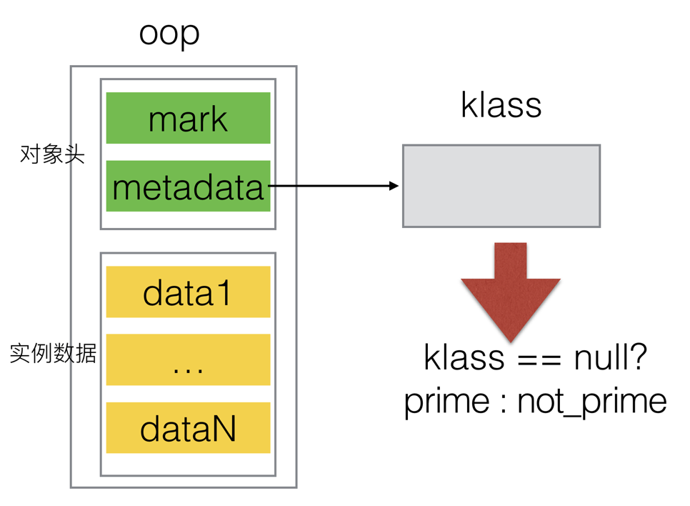
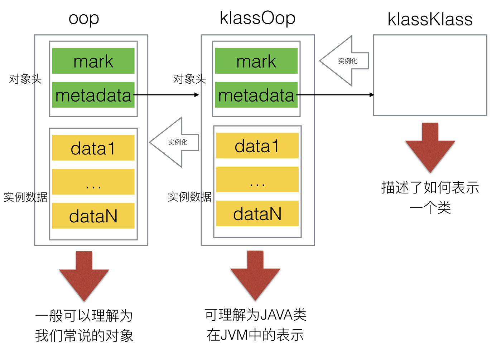
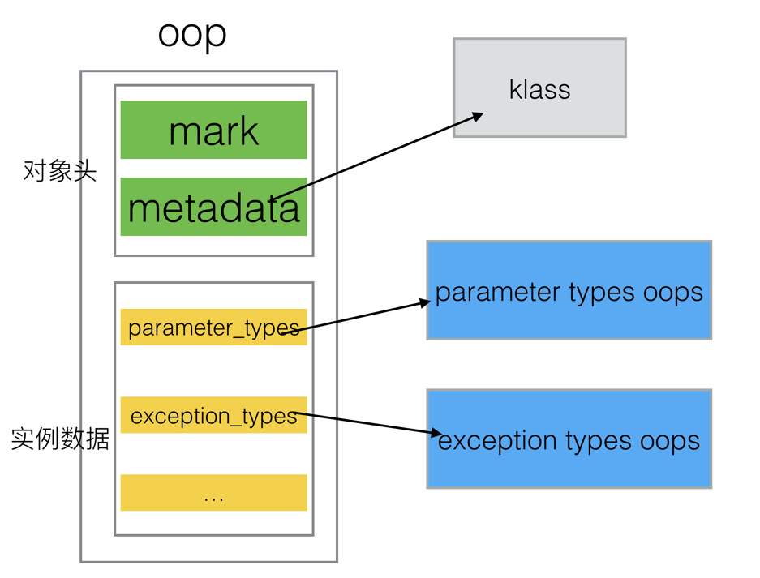
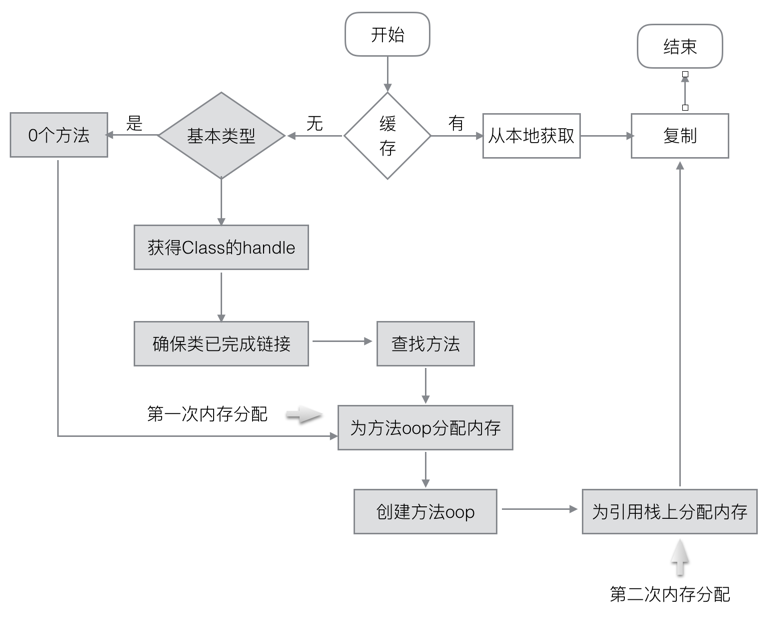

## [原文](https://www.jianshu.com/p/b6cb4c694951)

# Java反射: 从JDK到JVM全链路详解


该篇文章，将从我们熟悉的Java反射API出发，一直到JVM源码对Java反射的支持。本文分析用的是JDK1.7。
首先看使用的示例代码：
```java

    public static void main(String[] args) throws Exception {

        Class<String> stringClass = String.class;

        Method hashCodeMethod = stringClass.getDeclaredMethod("hashCode");

        String str= "hello, world";
        Object hashCode= hashCodeMethod.invoke(str);
        System.out.println( hashCode);

    }

```
这段代码的逻辑十分简单，就是利用反射来获取一个字符串的哈希值。
该示例毫无实际利用的价值，但是拿来举例子是足够的了。

这篇文章我们要弄明白的问题是：

- getDeclaredMethod方法是如何正确查找到方法的；

- invoke方法是如何被执行的；

- 这两个方法的调用，在虚拟机的层面上究竟发生了什么；

## JDK分析
反射的源码在JDK层面上是比较简单的，getDeclaredMethod方法的源码是：
```java

    @CallerSensitive
    public Method getDeclaredMethod(String name, Class<?>... parameterTypes)
        throws NoSuchMethodException, SecurityException {
    
        Objects.requireNonNull(name);
        SecurityManager sm = System.getSecurityManager();
        if (sm != null) {
            checkMemberAccess(sm, Member.DECLARED, Reflection.getCallerClass(), true);
        }
        Method method = searchMethods(privateGetDeclaredMethods(false), name, parameterTypes);
        if (method == null) {
            throw new NoSuchMethodException(methodToString(name, parameterTypes));
        }
        return getReflectionFactory().copyMethod(method);
    }

```
其中最重要的就是
//name -- 方法名字, parameterTypes -- 方法参数
Method method = searchMethods(privateGetDeclaredMethods(false), name, parameterTypes);

searchMethods是依据传入的方法名字和方法参数，从privateGetDeclaredMethods返回的Method[]中找到对应的方法，返回该方法的副本。
所以重要的逻辑是在privateGetDeclaredMethods中，该方法的源码是：
```java

    private Method[] privateGetDeclaredMethods(boolean publicOnly) {
        Method[] res;
        ReflectionData<T> rd = reflectionData();
        if (rd != null) {
            res = publicOnly ? rd.declaredPublicMethods : rd.declaredMethods;
            if (res != null) return res;
        }
        // 没有缓存，从JVM中获取
        // No cached value available; request value from VM
        res = Reflection.filterMethods(this, getDeclaredMethods0(publicOnly));
        if (rd != null) {
            if (publicOnly) {
                rd.declaredPublicMethods = res;
            } else {
                rd.declaredMethods = res;
            }
        }
        return res;
    }

```
该方法大体上可以分成两个部分：

从本地缓存中获取Method[]；

如果本地没有缓存，则从虚拟机中获取；

## 本地缓存
先考察从本地缓存获取，其中关键的一句话是：
```java

        ReflectionData<T> rd = reflectionData();

```

这一句话就是访问本地缓存。
ReflectionData是Class的一个内部类，它里面存储了一个Class所含有的各色信息，包括字段、方法，并且进行了一定的分类，源码是：
```java

    private static class ReflectionData<T> {
        //...其余字段
        volatile Method[] declaredMethods;
        volatile Method[] publicMethods;
        
        // Value of classRedefinedCount when we created this ReflectionData instance
        final int redefinedCount;

        ReflectionData(int redefinedCount) {
            this.redefinedCount = redefinedCount;
        }
    }

```

这个源码要注意的是其构造函数，在这个构造函数中，只设置了redefinedCount，其余字段都会是Null。

reflectionData()方法源码是：
```java

    private ReflectionData<T> reflectionData() {
        SoftReference<ReflectionData<T>> reflectionData = this.reflectionData;
        int classRedefinedCount = this.classRedefinedCount;
        ReflectionData<T> rd;
        if (useCaches &&
            reflectionData != null &&
            (rd = reflectionData.get()) != null &&
            rd.redefinedCount == classRedefinedCount) {
            return rd;
        }
        // else no SoftReference or cleared SoftReference or stale ReflectionData
        // -> create and replace new instance
        return newReflectionData(reflectionData, classRedefinedCount);
    }

```    

这段代码有一个很关键的点：本地缓存的ReflectionData是使用SoftReference的，这意味着，在内存紧张的时候会被回收掉。

如果在回收掉之后再次请求获得Method[]，那么就会新建一个SoftReference，作为缓存。也就是其中newReflectionData的逻辑：
```java

    private ReflectionData<T> newReflectionData(SoftReference<ReflectionData<T>> oldReflectionData,
                                                int classRedefinedCount) {
        if (!useCaches) return null;

        while (true) {
            ReflectionData<T> rd = new ReflectionData<>(classRedefinedCount);
            // try to CAS it...
            if (Atomic.casReflectionData(this, oldReflectionData, new SoftReference<>(rd))) {
                return rd;
            }
            // ...其余代码
        }
    }
```
这段逻辑看上去很简单，但是其中有一些很容易遗漏的点。首先要注意的是，当走到
```java
ReflectionData<T> rd = new ReflectionData<>(classRedefinedCount);
```
这一句的时候，rd里面只有一个redefinedCount字段被设置，其余字段都还是null。该方法的核心是：
```java
Atomic.casReflectionData(this, oldReflectionData, new SoftReference<>(rd))
```
该方法的底层是使用Unsafe的compareAndSwapObject方法来实现的：
```java
        static <T> boolean casReflectionData(Class<?> clazz,
                                             SoftReference<ReflectionData<T>> oldData,
                                             SoftReference<ReflectionData<T>> newData) {
            return unsafe.compareAndSwapObject(clazz, reflectionDataOffset, oldData, newData);
        }
```

这个方法的含义就是：如果clazz内存分布中，在reflectionDataOffset位置的地方，如果期望的值是oldData，
那么就会使用newData来替换掉oldData。而在clazz内存的reflectionDataOffset的地方，
恰好就是Class类中reflectionData域引用的地方。所以这个方法的真实含义，借助CAS原子操作，
将老的reflectionData替换为新的reflectionData。

但是，这里要注意的一点是，此时的newData，也就是
```java
new SoftReference<>(rd)
```
它是一个新建的ReflectionData的实例的soft reference。而新建的ReflectionData，也就是rd，
前面已经提到了，它只有redefinedCount字段是被设置好了的，其余字段都还是null。
所以如果没有本地缓存，在方法返回了之后，一直到privateGetDeclaredMethods方法的
```java
ReflectionData<T> rd = reflectionData();
```
此刻的rd就是方才新建的ReflectionData，只有redefinedCount字段是设置的。所以判断：
```java
if (res != null) return res;
```
是必然不成立的，因此最终会走到从JVM中获取Method[]的代码处。我们总结一下，在这种情况下，Class的实例类似于：


 
 
## 从JVM获取

前面已经提到，在本地缓存失效，或者被回收了之后，需要从JVM当中获得Method[]：
```java
        // No cached value available; request value from VM
        res = Reflection.filterMethods(this, getDeclaredMethods0(publicOnly));
```

所以最后是通过调用native方法
```java

    private native Method[]      getDeclaredMethods0(boolean publicOnly);
```

从JVM中取到了Method[]。
该方法在JVM中的头文件声明是：
```
// src/share/vm/prims/jvm.h
//JNIEnv: java本地方法调用的上下文，
//ofClas: 在java中的Class实例
// publicOnly: 是否是public,对应于java中native方法中的publicOnly参数
JNIEXPORT jobjectArray JNICALL
JVM_GetClassDeclaredMethods(JNIEnv *env, jclass ofClass, jboolean publicOnly);
```
该方法的实现是：
```cpp
// src/share/vm/prims/jvm.cpp

JVM_ENTRY(jobjectArray, JVM_GetClassDeclaredMethods(JNIEnv *env, jclass ofClass, jboolean publicOnly))
{
  //省略一部分不重要的代码...
  // Exclude primitive types and array types -- 对基本类型和数组类型进行特殊处理
  if (java_lang_Class::is_primitive(JNIHandles::resolve_non_null(ofClass))
      || Klass::cast(java_lang_Class::as_klassOop(JNIHandles::resolve_non_null(ofClass)))->oop_is_javaArray()) {
    // Return empty array
    oop res = oopFactory::new_objArray(SystemDictionary::reflect_Method_klass(), 0, CHECK_NULL);
    return (jobjectArray) JNIHandles::make_local(env, res);
  }
  // 取得了ofClass所对应的instanceKlassHandle
  instanceKlassHandle k(THREAD, java_lang_Class::as_klassOop(JNIHandles::resolve_non_null(ofClass)));

  // Ensure class is linked ---确保类已经完成了链接
  k->link_class(CHECK_NULL);

  objArrayHandle methods (THREAD, k->methods());
  int methods_length = methods->length();
  int num_methods = 0;

  //统计有多少方法符合要求，而后为结果分配内存
  int i;
  for (i = 0; i < methods_length; i++) {
    methodHandle method(THREAD, (methodOop) methods->obj_at(i));
    if (!method->is_initializer()) {
      if (!publicOnly || method->is_public()) {
        ++num_methods;
      }
    }
  }

  // Allocate result
  objArrayOop r = oopFactory::new_objArray(SystemDictionary::reflect_Method_klass(), num_methods, CHECK_NULL);
  objArrayHandle result (THREAD, r);

  int out_idx = 0;
  for (i = 0; i < methods_length; i++) {
    methodHandle method(THREAD, (methodOop) methods->obj_at(i));
    if (!method->is_initializer()) {
      if (!publicOnly || method->is_public()) {
        oop m = Reflection::new_method(method, UseNewReflection, false, CHECK_NULL);
        result->obj_at_put(out_idx, m);
        ++out_idx;
      }
    }
  }
  assert(out_idx == num_methods, "just checking");
  return (jobjectArray) JNIHandles::make_local(env, result());
}
JVM_END
```

如我在其中注释的一样，整个过程可以分成几步：

1. 先处理基本类型和数组类型；

2. 确保类已经完成链接，在此处就是确保String已经完成了链接

3. 统计符合要求的方法，并根据方法个数为结果分配内存

4. 创建Method[]数组

下面我们将对2和4进行详细的分析。   
在这之前先对JVM的oop-klass做一个简单的介绍：

- oop: ordinary object pointer，普通对象指针，用于描述对象的实例信息

- klass：Java类在JVM中的表示，是对Java类的描述
对于我们日常说的一个对象来说，它们的oop-klass模型如图：



JVM就是用这种方式，将一个对象的数据和对象模型进行分离。普遍意义上来说，我们说持有一个对象的引用，
指的是图中的handle，它是oop的一个封装。

处理基本类型和数组类型
```cpp

  if (java_lang_Class::is_primitive(JNIHandles::resolve_non_null(ofClass))
      || Klass::cast(java_lang_Class::as_klassOop(JNIHandles::resolve_non_null(ofClass)))->oop_is_javaArray()) {
    // Return empty array
    oop res = oopFactory::new_objArray(SystemDictionary::reflect_Method_klass(), 0, CHECK_NULL);
    return (jobjectArray) JNIHandles::make_local(env, res);
  }
  
```

JNIHandles::resolve_non_null方法将ofClass转化为JVM内部的一个oop，因为JVM只会直接操作oop实例。
顾名思义，is_primitive是判断是否属于基本类型，其源码实现是：

```cpp
//src/share/vm/classfile/javaClasses.cpp
bool java_lang_Class::is_primitive(oop java_class) {
  // should assert:
  //assert(java_lang_Class::is_instance(java_class), "must be a Class object");
  klassOop k = klassOop(java_class->obj_field(_klass_offset));
  return k == NULL;
}
```

这一段的逻辑十分简单，取到java_class这个oop中在klass字段上的值，如果是Null则被认为是基本类型。
因为对于任何一个非基本类型的对象来说，oop中必然包含着一个指向其klass实例的指针。




另外一个判断条件：
```cpp
Klass::cast(java_lang_Class::as_klassOop(JNIHandles::resolve_non_null(ofClass)))->oop_is_javaArray()

java_lang_Class::as_klassOop方法将一个klass包装成一个oop，逻辑和前面的is_primitive十分相像：
//src/share/vm/classfile/javaClasses.cpp
klassOop java_lang_Class::as_klassOop(oop java_class) {
  assert(java_lang_Class::is_instance(java_class), "must be a Class object");
  klassOop k = klassOop(java_class->obj_field(_klass_offset));
  assert(k == NULL || k->is_klass(), "type check");
  return k;
}
```

这里额外讨论一点“将一个klass包装成一个oop”是什么意思。在JVM中，对象在内存中的基本存在形式就是oop，
正如前面的图所描述的那样。那么，对象所属的类，在JVM中也是一种对象，
因此它们实际上也会被组织成一种oop，即klassOop。同样的，对于klassOop，也有对应的一个klass来描述，
它就是klassKlass，也是klass的一个子类。在这种设计下，JVM对内存的分配和回收，都可以采用统一的方式来管理。
oop-klass-klassKlass关系如图：



我们接下来看Klass::cast将klassOop转化为一个klass，而后调用oop_is_javaArray判断该klass是不是对java数组的描述。
在if判断为真的情况下， 会执行
```cpp
oop res = oopFactory::new_objArray(SystemDictionary::reflect_Method_klass(), 0, CHECK_NULL);
```
其中：
```cpp
 SystemDictionary::reflect_Method_klass()
```
是取得了Java类java.lang.reflect.Method类在JVM中对应的klass实例。
确切说，这个klass是java.lang.reflect.Method在JVM中的镜像类。
（注：它和JVM运行时刻真正用的java.lang.reflect.Method的klass是不一样的，本篇博客将不关注这其中的区别，但是读者应该知道这是镜像类。

new_objArray方法的源码是：
```cpp

// src/share/vm/memory/oopFactory.cpp
//length--数组长度，也就是要为多少个对象分配空间
//klass -- 类的描述，它自身知道应该为每一个java对象分配多大的空间
objArrayOop oopFactory::new_objArray(klassOop klass, int length, TRAPS) {
  assert(klass->is_klass(), "must be instance class");
  if (klass->klass_part()->oop_is_array()) {
    return ((arrayKlass*)klass->klass_part())->allocate_arrayArray(1, length, THREAD);
  } else {
    assert (klass->klass_part()->oop_is_instance(), "new object array with klass not an instanceKlass");
    return ((instanceKlass*)klass->klass_part())->allocate_objArray(1, length, THREAD);
  }
}

```

很显然关键的部分就是：

```cpp
allocate_arrayArray(1, length, THREAD)
```
前面提到过，一个klass是对java类的描述，因此在分配内存的时候，klass必然知道应该给该java类的实例分配多大的内存空间。
前面应该知道，此处传入的length是0。但是这并不意味着不分配内存空间。
从我们前面对oop的描述来看，即便是没有任何数据——也就是数组不包含任何元素，但是它依然占据一些空间，用于存放mark,metadata等数据。这与

```cpp
Method[] methods =null;
```
是全然不同的。

让我们暂时忽略后面跟着的

```cpp
(jobjectArray) JNIHandles::make_local(env, res)

```
后面会对这个方法进行深入分析。  

## 创建method[]

这个部分，将在前面分配的内存的基础上，创建Method[]数组。我们应该知道，在JVM里面，是没有Method这个类的，
因此，创建Method[]数组，其实质是创建一个methodOop数组。不过我们现在也还没看到，
JVM是如何获得一个Class所具有的方法。答案就隐藏在：

```cpp
instanceKlassHandle k(THREAD, java_lang_Class::as_klassOop(JNIHandles::resolve_non_null(ofClass)));

```
前面我们已经解释过as_klassOop和resolve_non_null的含义了。
所以这一句的关键就是创建了一个instanceKlassHandle的实例k。
我们可以先来看看这个instanceKlassHandle的定义，它是由一个宏定义的：
```cpp

//  src/share/vm/runtime/handles.hpp

#define DEF_KLASS_HANDLE(type, is_a)             \
  class type##Handle : public KlassHandle {      \
   public:                                       \
    /* Constructors */                           \
    type##Handle ()                              : KlassHandle()           {} \
    type##Handle (klassOop obj) : KlassHandle(obj) {                          \
      assert(SharedSkipVerify || is_null() || obj->klass_part()->is_a(),      \
             "illegal type");                                                 \
    }                                                                         \
    type##Handle (Thread* thread, klassOop obj) : KlassHandle(thread, obj) {  \
      assert(SharedSkipVerify || is_null() || obj->klass_part()->is_a(),      \
             "illegal type");                                                 \
    }                                                                         \
                                                 \
    /* Access to klass part */                   \
    type*        operator -> () const            { return (type*)obj()->klass_part(); } \
                                                 \
    static type##Handle cast(KlassHandle h)      { return type##Handle(h()); } \
                                                 \
  };

DEF_KLASS_HANDLE(instanceKlass         , oop_is_instance_slow )
```

这段宏在编译的时候会被翻译为：
```cpp
  class instanceKlassHandle : public KlassHandle {     
   public:                                       
    /* Constructors */                           
    instanceKlassHandle () : KlassHandle()  {} 
    instanceKlassHandle (klassOop obj) : KlassHandle(obj) {                          
      assert(SharedSkipVerify || is_null() || obj->klass_part()->oop_is_instance_slow(),      
             "illegal type");                                                 
    }                                                                         
    instanceKlassHandle (Thread* thread, klassOop obj) : KlassHandle(thread, obj) {  
      assert(SharedSkipVerify || is_null() || obj->klass_part()->oop_is_instance_slow(),      
             "illegal type");                                                 
    }                                                                         
                                                 
    /* Access to klass part */                   
    instanceKlass* operator -> () const { return (instanceKlass*)obj()->klass_part(); } 
                                                 
    static instanceKlassHandle cast(KlassHandle h) { return instanceKlassHandle(h()); }                                   
  }
```
这里调用的构造函数最终将会调用基类Handle的构造函数。现在我们将注意力转回：

k->methods()

如果直接去找instanceKlassHandle里面的methods()方法，那么找到吐血都找不到。
因为在宏里面，instanceKlassHandle已经重载了操作符->，所以这个调用实际上调用的是：
```cpp
// src/share/vm/oops/instanceKlass.hpp
objArrayOop methods() const              { return _methods; }
```

所以这个部分，直接返回的就是_methods属性。给属性的值，会在String类加载的时候，
被赋予值（该部分，本篇文章将不会讨论，实际上，类的加载，创建对应的JVM表示，是一个很复杂的过程）。
在获取到了这个代表类方法的objArrayOop，会把它包装成对应的objArrayHandle，同样的，objArrayHandle也是由宏定义的。
现在只剩下最后一个步骤，真正创建Method[]数组。首先来看for循环：
```java

  for (i = 0; i < methods_length; i++) {
    methodHandle method(THREAD, (methodOop) methods->obj_at(i));
    if (!method->is_initializer()) {
      if (!publicOnly || method->is_public()) {
        oop m = Reflection::new_method(method, UseNewReflection, false, CHECK_NULL);
        result->obj_at_put(out_idx, m);
        ++out_idx;
      }
    }
  }
  
```

根据前面的解析，读者大概都能够理解methodHandle和methods->obj_at(i)是什么作用。我们将注意力放在关键的：

```cpp
oop m = Reflection::new_method(method, UseNewReflection, false, CHECK_NULL);

```

这个调用的返回值就是oop，我们知道，所有的对象，在JVM的存在形式就是一个oop。所以，到这一步基本上就可以认为已经创建了一个Method的对象。
Reflection::new_method是一个十分长的方法，它的源码是：

```cpp
// src/share/vm/runtime/reflection.cpp
oop Reflection::new_method(methodHandle method, bool intern_name, bool for_constant_pool_access, TRAPS) {
  // ...一些断言
  instanceKlassHandle holder (THREAD, method->method_holder());
  int slot = method->method_idnum();

  Symbol*  signature  = method->signature();
  int parameter_count = ArgumentCount(signature).size();
  oop return_type_oop = NULL;
  objArrayHandle parameter_types = get_parameter_types(method, parameter_count, &return_type_oop, CHECK_NULL);
  if (parameter_types.is_null() || return_type_oop == NULL) return NULL;

  Handle return_type(THREAD, return_type_oop);

  objArrayHandle exception_types = get_exception_types(method, CHECK_NULL);

  if (exception_types.is_null()) return NULL;

  Symbol*  method_name = method->name();
  Handle name;
  if (intern_name) {
    // intern_name is only true with UseNewReflection
    oop name_oop = StringTable::intern(method_name, CHECK_NULL);
    name = Handle(THREAD, name_oop);
  } else {
    name = java_lang_String::create_from_symbol(method_name, CHECK_NULL);
  }
  if (name == NULL) return NULL;

  int modifiers = method->access_flags().as_int() & JVM_RECOGNIZED_METHOD_MODIFIERS;

  Handle mh = java_lang_reflect_Method::create(CHECK_NULL);

//设置oop的各个属性 -------第二部分--------------------------
  java_lang_reflect_Method::set_clazz(mh(), holder->java_mirror());
  java_lang_reflect_Method::set_slot(mh(), slot);
  java_lang_reflect_Method::set_name(mh(), name());
  java_lang_reflect_Method::set_return_type(mh(), return_type());
  java_lang_reflect_Method::set_parameter_types(mh(), parameter_types());
  java_lang_reflect_Method::set_exception_types(mh(), exception_types());
  java_lang_reflect_Method::set_modifiers(mh(), modifiers);
  java_lang_reflect_Method::set_override(mh(), false);
  if (java_lang_reflect_Method::has_signature_field() &&
      method->generic_signature() != NULL) {
    Symbol*  gs = method->generic_signature();
    Handle sig = java_lang_String::create_from_symbol(gs, CHECK_NULL);
    java_lang_reflect_Method::set_signature(mh(), sig());
  }
  if (java_lang_reflect_Method::has_annotations_field()) {
    java_lang_reflect_Method::set_annotations(mh(), method->annotations());
  }
  if (java_lang_reflect_Method::has_parameter_annotations_field()) {
    java_lang_reflect_Method::set_parameter_annotations(mh(), method->parameter_annotations());
  }
  if (java_lang_reflect_Method::has_annotation_default_field()) {
    java_lang_reflect_Method::set_annotation_default(mh(), method->annotation_default());
  }
  return mh();
}

```
整个方法可以看成两个部分：

1. 取得oop属性对应的handle

2. 设置oop属性
在一个Method实例里面，它有很多的属性，比如说参数类型。那么很显然的是，这些属性在JVM的存在也是oop的形式。所以一个Method的oop形如：




这里还要提醒一下读者的是，parameter types oop是一个数组类型的oop，其元素，每一个都是klassOop，
因为每一个parameter type在Java语言中，就是Class的一个实例，因而正好是一个klassOop。
到了这一步，我们已经完成了大部分的工作，只剩下最后一步了：
```cpp

JNIHandles::make_local(env, result())

```
该方法的源码是：
```cpp

jobject JNIHandles::make_local(JNIEnv* env, oop obj) {
  if (obj == NULL) {
    return NULL;                // ignore null handles
  } else {
    JavaThread* thread = JavaThread::thread_from_jni_environment(env);
    assert(Universe::heap()->is_in_reserved(obj), "sanity check");
    return thread->active_handles()->allocate_handle(obj);
  }
}

```
这段代码的含义，十分简单，就是获得当前执行反射代码的线程，然后为引用分配内存，
最后返回一个已经装配好了的，能够被java代码所访问的jobject。
现在我们从内存的分配角度来一下整个过程。整个过程，实际上只涉及两次内存分配，一次是为oop分配，
这个一次的分配是根据要返回的结果来决定；第二次分配是将oop包装成jobject的时候，也就是allocate_handle方法的调用。
前面一次分配很好理解，那么最后一次分配是什么意思呢？我的个人理解是这一次是为Java引用所指向的handle分配内存，
它的大小就是一个handle指针的大小，在32位上，是4个字节，在64位上是8个字节。简单粗暴的说，就是在栈上分配一个引用。

## 最后
到这里，我们已经分析完了整个流程。但是因为涉及了一大堆的代码，不容易对流程有个整体的把握。整个过程可以看成是：




实际上，如果理解oop-klass模型，那么很容易就明白这一段的源码。不过这篇文章其实忽略了很多的细节，
比如说内存分配的分配，就没有深入探究调用链，有兴趣的读者可以自己去看看。或者等待我以后的博客，

 

