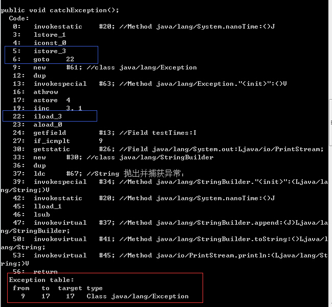

## [原文](https://my.oschina.net/suemi/blog/852542)

# Java异常的实现原理

## 异常的捕获原理
首先介绍下java的异常表（Exception table），异常表是JVM处理异常的关键点，
在java类中的每个方法中，会为所有的try-catch语句，生成一张异常表，
存放在字节码的最后，该表记录了该方法内每个异常发生的起止指令和处理指令。

接下来看一个例子：
```java

public void catchException() {  
    long l = System.nanoTime();  
    for (int i = 0; i < testTimes; i++) { 
        try {  
            throw new Exception();  
        } catch (Exception e) { 
            //nothing to do
        }  
    }
    System.out.println("抛出并捕获异常：" + (System.nanoTime() - l));  
}

```
字节码如下

 

面请结合java代码和生成的字节码来看下面的指令分析：
 0-4号： 执行try前面的语句 5号： 执行try语句前保存现场 6号： 执行try语句后跳转指令行，
 图中表示跳转到22 9-17号： try-catch代码生成指令，结合红色框图异常表，
 表示9-17号指令若有Exception异常抛出就执行17行指令. 16号： athrow 表示抛出异常 17号： 
 astore 表示jvm将该异常实例存储到局部变量表中方便一旦出方法栈调用方可以找到 22号： 
 恢复try语句执行前保存的现场 对比指令分析，再结合使用try-catch代码分析：

- 若try没有抛出异常，则继续执行完try语句，跳过catch语句，此时就是从指令6跳转到指令22.

- 若try语句抛出异常则执行指令17，将异常保存起来，若异常被方法抛出，调用方拿到异常可用于异常层次索引。

通过以上的分析，可以知道JVM是怎么捕获并处理异常，其实就是使用goto指令来做上下文切换。