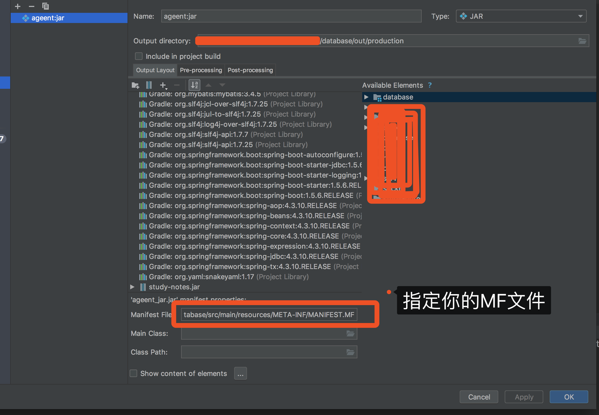
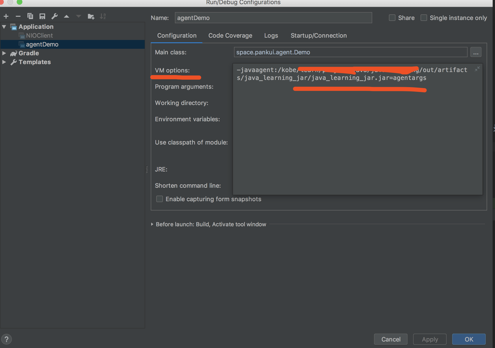

## [例子](https://blog.csdn.net/mn_forever/article/details/53701303)

# javaAgent说明和例子

## 1. javaagent详细的说明已经在另外一篇文章中有详细说明：

http://blog.csdn.net/kangojian/article/details/8782575


## 2.javaagent简单例子

```java

package com.google.agent;
 
import java.lang.instrument.Instrumentation;
 
/**
 * Created by dell on 2016/12/17.
 */
public class Agent {
    //premain 方法有两种可能的签名。
 
    /**
     * JVM 首先尝试在代理类上调用以下方法
     * @param agentArgs agentArgs
     * @param inst inst
     */
    public static void premain(String agentArgs, Instrumentation inst)
    {
        System.out.println("Im 1st premain,My agentAges = [" + agentArgs + "].");
    }
 
    /**
     * 如果代理类没有实现上面的方法，那么 JVM 将尝试调用该方法
     * @param agentArgs agentArgs
     */
    public static void premain(String agentArgs)
    {
        System.out.println("Im 2ed premain,My agentAges = [" + agentArgs + "].");
    }
}
```

javaagent只能使用jar包运行，所以需要将该javaagent类导出生成jar包。以IDEA为例：
        》在src目录下创建 META-INF/MANIFEST.MF 文件，内容按如下定义（注意为4行，第4行为空行）：

           
```java

Manifest-Version: 1.0
Premain-Class: com.google.agent.Agent
Can-Redefine-Classes: true
```
》File--Project Structure...--Project Setting--Artifacts,使用+号新加一个Artifacts,如图：




注意：Manifest Files使用上方设置的配置文件。

          》保存成一个新的Artifact。

 》回到IDEA，菜单Build > Build Artifacts.. 选择刚才创建的Artifact，点ok 生成了。Output directory目录查看你的jar文件。



VM 参数：
> -javaagent:/jar绝对路径/out/production/ageent_jar.jar=agentargs

3. 简单应用

```java

package com.google.demo;
 
/**
 * Created by dell on 2016/12/17.
 */
public class Demo {
    public static void main(String[] args) {
        System.out.println("This is main.");
    }
}

```
运行该测试Demo：


运行结果：

``` 
Im 1st premain,My agentAges = [agentargs].
This is main.
```

ps：JDK9 这种方法有问题，待解决.