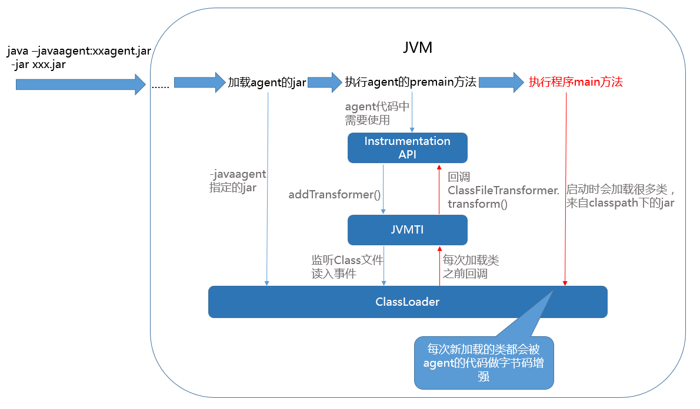
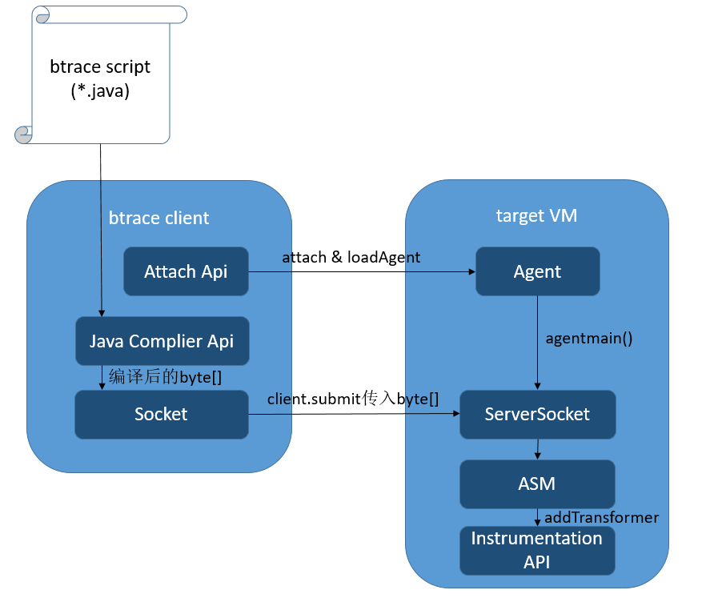
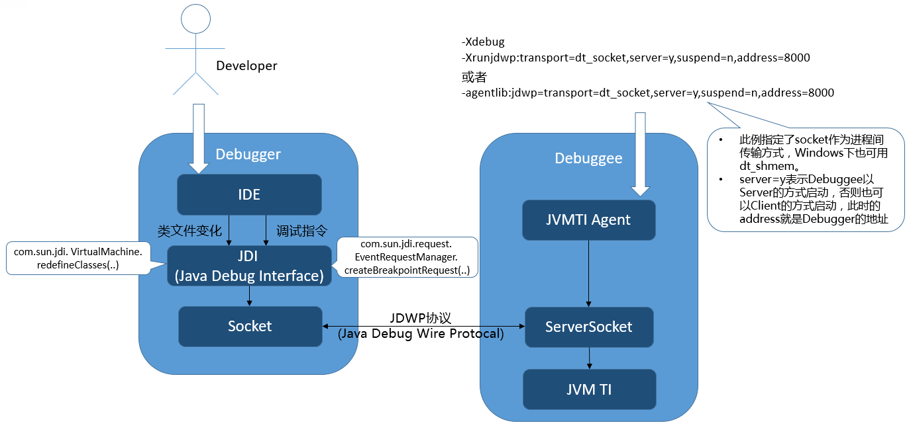

## [原文](http://www.fanyilun.me/2017/07/18/%E8%B0%88%E8%B0%88Java%20Intrumentation%E5%92%8C%E7%9B%B8%E5%85%B3%E5%BA%94%E7%94%A8/)

# 谈谈Java Intrumentation和相关应用

## 1 Overview
  对于Java 程序员来说，Java Intrumentation、Java agent这些技术可能平时接触的很少，
听上去陌生但又好像在哪里见到过。
实际上，我们日常应用的各种工具中，有很多都是基于他们实现的，例如常见的热部署（JRebel, spring-loaded）、
各种线上诊断工具（btrace, Greys）、代码覆盖率工具（JaCoCo）等等。

  本文会介绍 Java Instrumentation及其相关概念，会涉及到的名词包括：

- Java Intrumentation API
- Java agent
- Attach API
- JVMTI
- ……

  简单的来看，如果需要通过Intrumentation操作或监控一个Java程序，相关的工具和流程如下：


  下文会依次介绍图中的相关概念，并谈谈原理和具体的应用场景。

## 2 Java Instrumentation
  Instrumentation是Java提供的一个来自JVM的接口，该接口提供了一系列查看和操作Java类定义的方法，例如修改类的字节码、
向classLoader的classpath下加入jar文件等。使得开发者可以通过Java语言来操作和监控JVM内部的一些状态，
进而实现Java程序的监控分析，甚至实现一些特殊功能（如AOP、热部署）。

  Instrumentation的一些主要方法如下：
```mysql

public interface Instrumentation {
    /**
     * 注册一个Transformer，从此之后的类加载都会被Transformer拦截。
     * Transformer可以直接对类的字节码byte[]进行修改
     */
    void addTransformer(ClassFileTransformer transformer);
    
    /**
     * 对JVM已经加载的类重新触发类加载。使用的就是上面注册的Transformer。
     * retransformation可以修改方法体，但是不能变更方法签名、增加和删除方法/类的成员属性
     */
    void retransformClasses(Class<?>... classes) throws UnmodifiableClassException;
    
    /**
     * 获取一个对象的大小
     */
    long getObjectSize(Object objectToSize);
    
    /**
     * 将一个jar加入到bootstrap classloader的 classpath里
     */
    void appendToBootstrapClassLoaderSearch(JarFile jarfile);
    
    /**
     * 获取当前被JVM加载的所有类对象
     */
    Class[] getAllLoadedClasses();
}

```
  其中最常用的方法就是addTransformer(ClassFileTransformer transformer)了，
这个方法可以在类加载时做拦截，对输入的类的字节码进行修改，
其参数是一个ClassFileTransformer接口，定义如下：

```java
/**
 * 传入参数表示一个即将被加载的类，包括了classloader，classname和字节码byte[]
 * 返回值为需要被修改后的字节码byte[]
 */
byte[]
transform(  ClassLoader         loader,
            String              className,
            Class<?>            classBeingRedefined,
            ProtectionDomain    protectionDomain,
            byte[]              classfileBuffer)  throws IllegalClassFormatException;
  addTransformer方法配置之后，后续的类加载都会被Transformer拦截。对于已经加载过的类，
可以执行retransformClasses来重新触发这个Transformer的拦截。类加载的字节码被修改后，除非再次被retransform，否则不会恢复。

```
  主流的JVM都提供了Instrumentation的实现，但是鉴于Instrumentation的特殊功能，
并不适合直接提供在JDK的runtime里，而更适合出现在Java程序的外层，以上帝视角在合适的时机出现。
因此如果想使用Instrumentation功能，拿到Instrumentation实例，我们必须通过Java agent。

## 3 Java agent
  Java agent是一种特殊的Java程序（Jar文件），它是Instrumentation的客户端。
与普通Java程序通过main方法启动不同，agent并不是一个可以单独启动的程序，
而必须依附在一个Java应用程序（JVM）上，与它运行在同一个进程中，
通过Instrumentation API与虚拟机交互。

  Java agent与Instrumentation密不可分，二者也需要在一起使用。
因为Instrumentation的实例会作为参数注入到Java agent的启动方法中。

### 3.1 Java agent 的格式

  Java agent以jar包的形式部署在JVM中，jar文件的manifest需要指定agent的类名。根据不同的启动时机，agent类需要实现不同的方法（二选一）。
```java

/**
 * 以vm参数的形式载入，在程序main方法执行之前执行
 * 其jar包的manifest需要配置属性Premain-Class
 */
public static void premain(String agentArgs, Instrumentation inst);
/**
 * 以Attach的方式载入，在Java程序启动后执行
 * 其jar包的manifest需要配置属性Agent-Class
 */
public static void agentmain(String agentArgs, Instrumentation inst);

```
  因此，如果想自己写一个java agent程序，只需定义一个包含premain或者agentmain的类，
在方法中实现你的逻辑，然后在打包jar时配置一下manifest即可。可以参考如下的maven plugin配置：


```java
<plugin>
    <artifactId>maven-assembly-plugin</artifactId>
    <configuration>
        <archive>
            <manifestEntries>
                <Premain-Class>**.**.InstrumentTest</Premain-Class>
                <Agent-Class>**.**..InstrumentTest</Agent-Class>
                <Can-Redefine-Classes>true</Can-Redefine-Classes>
                <Can-Retransform-Classes>true</Can-Retransform-Classes>
            </manifestEntries>
        </archive>
    </configuration>
</plugin>

```
### 3.2 Java agent 的加载
  一个Java agent既可以在VM启动时加载，也可以在VM启动后加载：

- 启动时加载：通过vm的启动参数-javaagent:**.jar来启动

- 启动后加载：在vm启动后的任何时间点，通过attach api，动态地启动agent

如何通过attach api动态加载agent，请见下一小节

  agent加载时，Java agent的jar包先会被加入到system class path中，
然后agent的类会被system class loader加载。
没错，这个system class loader就是所在的Java程序的class loader，
这样agent就可以很容易的获取到想要的class。

  对于VM启动时加载的Java agent，其premain方法会在程序main方法执行之前被调用，
此时大部分Java类都没有被加载（“大部分”是因为，agent类本身和它依赖的类还是无法避免的会先加载的），
是一个对类加载埋点做手脚（addTransformer）的好机会。如果此时premain方法执行失败或抛出异常，那么JVM的启动会被终止。

  对于VM启动后加载的Java agent，其agentmain方法会在加载之时立即执行。
如果agentmain执行失败或抛出异常，JVM会忽略掉错误，不会影响到正在running的Java程序。

### 3.3 举个例子
  一个最简单的Java agent程序如下，该程序通过-javaagent参数附着在目标程序上启动，
实现了在类加载时做拦截，修改字节码的功能。
```java

public class InstrumentationExample {
    // Java agent指定的premain方法，会在main方法之前被调用
    public static void premain(String args, Instrumentation inst) {
        // Instrumentation提供的addTransformer方法，在类加载时会回调ClassFileTransformer接口
        inst.addTransformer(new ClassFileTransformer() {
            @Override
            public byte[] transform(ClassLoader loader, String className, Class<?> classBeingRedefined,
                                    ProtectionDomain protectionDomain, byte[] classfileBuffer)
                                    throws IllegalClassFormatException {
                // 开发者在此自定义做字节码操作，将传入的字节码修改后返回
                // 通常这里需要字节码操作框架
                // ......
                return transformResult;
            }
        });
    }
    
}

```
  以上面的代码文件，根据前一小节的要求打好jar包，就可以跟随宿主Java应用一起启动了。从执行的流程上来看，效果如下图所示：


  可以看出，通过Java agent我们可以注册类加载的回调方法，来实现通用的类加载拦截。

  不过上述代码并没有给出transform方法的具体实现，我们举一个具体场景细化一下这个方法的实现：
例如，我想要监听某个类，并对这个类的每个方法都做一层AOP，打印出方法调用的耗时。
那么使用Instrumentation的解决方式，就是修改这个类的字节码，对每个方法作如下改动：
```java

// 原方法
public void method1(){
    dosomething();
}
    ↓ ↓ ↓ ↓ ↓
// 修改后的方法
public void method1(){
    long stime = System.currentTimeMillis();
    dosomething();
    System.out.println("method1 cost:" + (System.currentTimeMillis() - stime) + " ms");
}

```
  要想实现这种效果，我们需要在transform方法的实现中，对指定的类，做指定的字节码增强。
通常来说，做字节码增强都需要使用到框架，比如ASM,CGLIB,Byte Buddy,Javassist。
不过如果你喜欢，你可以直接用位运算操作byte[]，不需要任何框架，
例如JDK反射(method.invoke())的实现，就真的是用位操作拼装了一个类。
  言归正传，操作字节码的高手可能更喜欢ASM，因为它提供的方法更底层，功能更强大更直白。
对于字节码不熟悉的开发者，更适合javassist，它可以直接以Java代码方式直接修改方法体。
我们以javassist为例，看看怎么实现上述的功能，完整代码如下：
```java

public class InstrumentationExample {
    // Java agent指定的premain方法，会在main方法之前被调用
    public static void premain(String args, Instrumentation inst) {
        // Instrumentation提供的addTransformer方法，在类加载时会回调ClassFileTransformer接口
        inst.addTransformer(new ClassFileTransformer() {
            @Override
            public byte[] transform(ClassLoader loader, String className, Class<?> classBeingRedefined,
                                    ProtectionDomain protectionDomain, byte[] classfileBuffer)
                                    throws IllegalClassFormatException {
                if (!"com/test/TestClass".equals(className)) {
                    // 只修改指定的Class
                    return classfileBuffer;
                }
        
                byte[] transformed = null;
                CtClass cl = null;
                try {
                    // CtClass、ClassPool、CtMethod、ExprEditor都是javassist提供的字节码操作的类
                    ClassPool pool = ClassPool.getDefault();
                    cl = pool.makeClass(new ByteArrayInputStream(classfileBuffer));
                    CtMethod[] methods = cl.getDeclaredMethods();
                    for (int i = 0; i < methods.length; i++) {
                        methods[i].instrument(new ExprEditor() {
        
                            @Override
                            public void edit(MethodCall m) throws CannotCompileException {
                                // 把方法体直接替换掉，其中 $proceed($$);是javassist的语法，用来表示原方法体的调用
                                m.replace("{ long stime = System.currentTimeMillis();" + " $_ = $proceed($$);"
                                          + "System.out.println(\"" + m.getClassName() + "." + m.getMethodName()
                                          + " cost:\" + (System.currentTimeMillis() - stime) + \" ms\"); }");
                            }
                        });
                    }
                    // javassist会把输入的Java代码再编译成字节码byte[]
                    transformed = cl.toBytecode();
                } catch (Exception e) {
                    e.printStackTrace();
                } finally {
                    if (cl != null) {
                        cl.detach();// ClassPool默认不会回收，需要手动清理
                    }                           
                }
                return transformed;
            }
        });
    }
    
}

```
## 4 Attach API
  上面提到，Java agent可以在JVM启动后再加载，就是通过Attach API实现的。
当然，Attach API可不仅仅是为了实现动态加载agent，Attach API其实是跨JVM进程通讯的工具，
能够将某种指令从一个JVM进程发送给另一个JVM进程。
  加载agent只是Attach API发送的各种指令中的一种， 诸如jstack打印线程栈、
jps列出Java进程、jmap做内存dump等功能，都属于Attach API可以发送的指令。

### 4.1 Attach API 用法
  由于是进程间通讯，那代表着使用Attach API的程序需要是一个独立的Java程序，
通过attach目标进程，与其进行通讯。下面的代码表示了向进程pid为1234的JVM发起通讯，加载一个名为agent.jar的Java agent。
```java

// VirtualMachine等相关Class位于JDK的tools.jar
VirtualMachine vm = VirtualMachine.attach("1234");  // 1234表示目标JVM进程pid
try {
    vm.loadAgent(".../agent.jar");    // 指定agent的jar包路径，发送给目标进程
} finally {
    vm.detach();
}
```
  vm.loadAgent之后，相应的agent就会被目标JVM进程加载，并执行agentmain方法。


### 4.2 Attach API 原理
  按惯例，以Hotspot虚拟机，Linux系统为例。
当external process执行VirtualMachine.attach时，需要通过操作系统提供的进程通信方法，
例如信号、socket，进行握手和通信。其具体内部实现流程如下所示：

external process（attach发起的进程）	| target VM（目标JVM进程，假设pid为XXX）
|---|---
1. 创建文件：.attach_pidXXX	|
2. 检查.java_pidXXX 文件是否存在，如果存在则跳过4	|
3. 向目标JVM发送SIGQUIT信号 →	|
4. 轮询等待.java_pidXXX 文件的创建（5秒超时）	| 1. JVM的Signal Dispatcher线程收到SIGQUIT信号
4. 轮询等待 …………	| 2. 检查.attach_pidXXX 文件是否存在，若不存在则继续，否则忽略信号
4. 轮询等待 …………	| 2. 创建一个新线程Attach Listener，专门负责接收各种attach请求指令
4. 轮询等待 …………	| 3. 创建.java_pidXXX文件
4. 轮询等待 …………	| 4. 开始监听socket(. java_pidXXX)
5. 尝试连接socket (.java_pidXXX )	 |

上面提到了两个文件：

- .attach_pidXXX 后面的XXX代表pid，例如pid为1234则文件名为.attach_pid1234。
该文件目的是给目标JVM一个标记，表示触发SIGQUIT信号的是attach请求。
这样目标JVM才可以把SIGQUIT信号当做attach连接请求，再来做初始化。
其默认全路径为/proc/XXX/cwd/.attach_pidXXX，若创建失败则使用/tmp/attach_pidXXX

- .java_pidXXX 后面的XXX代表pid，例如pid为1234则文件名为.java_pid1234。
由于Unix domain socket通讯是基于文件的，该文件就是表示external process与target VM进行socket通信所使用的文件，
如果存在说明目标JVM已经做好连接准备。其默认全路径为/proc/XXX/cwd/.java_pidXXX，若创建失败则使用/tmp/java_pidXXX
  VirtualMachine.attach动作类似TCP创建连接的三次握手，目的就是搭建attach通信的连接。
而后面执行的操作，例如vm.loadAgent，其实就是向这个socket写入数据流，接收方target VM会针对不同的传入数据来做不同的处理。

## 5 JVM Tool Interface(JVMTI)

  JVM Tool Interface(JVMTI)是JVM提供的native编程接口，开发者可以通过JVMTI向JVM监控状态、
执行指令，其目的是开放出一套JVM接口用于 profile、debug、监控、线程分析、代码覆盖分析等工具。
  JVMTI和Instumentation API的作用很相似，都是一套JVM操作和监控的接口，且都需要通过agent来启动：

- Instumentation API需要打包成jar，并通过Java agent加载（-javaagent）

- JVMTI需要打包成动态链接库（随操作系统，如.dll/.so文件），并通过JVMTI agent加载（-agentlib/-agentpath）

  既然都是agent，那么加载时机也同样有两种：启动时（Agent_OnLoad）和运行时Attach（Agent_OnAttach）。
  不过相比于Instumentation API，JVMTI的功能强大的多，不知道高到哪里去了。
它是实现Java调试器，以及其它Java运行态测试与分析工具的基础。JVMTI能做的事情包括：

- 获取所有线程、查看线程状态、线程调用栈、查看线程组、中断线程、查看线程持有和等待的锁、获取线程的CPU时间、甚至将一个运行中的方法强制返回值……

- 获取Class、Method、Field的各种信息，类的详细信息、方法体的字节码和行号、向Bootstrap/System Class Loader添加jar、修改System Property……

- 堆内存的遍历和对象获取、获取局部变量的值、监测成员变量的值……

- 各种事件的callback函数，事件包括：类文件加载、异常产生与捕获、线程启动和结束、进入和退出临界区、成员变量修改、gc开始和结束、
方法调用进入和退出、临界区竞争与等待、VM启动与退出……

- 设置与取消断点、监听断点进入事件、单步执行事件……

  前面说的Instumentation API也是基于JVMTI来实现的，具体以addTransformer来说，通过Instrumentation注册的ClassFileTransformer，
实际上是注册了JVMTI针对类文件加载事件（ClassFileLoadHook）的callback函数。这个callback函数长这个样子：
```java

void JNICALL
ClassFileLoadHook(jvmtiEnv *jvmti_env,
            JNIEnv* jni_env,
            jclass class_being_redefined,
            jobject loader,
            const char* name,
            jobject protection_domain,
            jint class_data_len,
            const unsigned char* class_data,
            jint* new_class_data_len,
            unsigned char** new_class_data)
            
```
  注意到参数class_data和new_class_data分别对应了读入的原字节码数组，和提供的修改后的字节码数组的指针。
这样，我们在方法的实现中就可以把修改后的类的字节码写回，实现 bytecode instrumentation。
  InstumentationImpl的实现中，在这个callback函数里，对ClassFileTransformer的transform方法再进行一次回调。
这样的一次封装，就做到了通过Java语言实现字节码拦截修改的能力。

## 6 相关技术的实际应用
### 6.1 btrace等诊断工具
### 6.1.1 btrace

  btrace是一个安全的，动态追踪Java程序的工具。btrace可以跟踪到一个运行中的Java程序，监控到类和方法级别的状态信息。
由于其api的限制，对目标程序源码无侵入性，不会影响到程序原有逻辑。

  btrace的使用方式和内部原理如下图，使用者首先需要准备一份btrace脚本（btrace script），
用来定义使用者想要追踪的位置和信息。接下来启动btrace client，启动参数包括目标JVM的pid用于attach、以及写好的btrace脚本文件。
目标JVM会通过attach（或者启动时参数指定-javaagent）加载上Java agent，并通过socket与brace client建立连接。
btrace脚本会被编译成字节码然后发送给目标JVM的agent，通过解析其语义，转换为对程序源码的改写，此处也是基于Instrumentation api完成的。



  一份btrace脚本示例如下（来自官方文档），这份脚本会跟踪到javax.swing.*包下的所有class下的所有method，并在进入方法体时通过标准输出打印出类名和方法名。

```java

package samples;
import com.sun.btrace.annotations.*;
import static com.sun.btrace.BTraceUtils.*;
/**
 * This script traces method entry into every method of 
 * every class in javax.swing package! Think before using 
 * this script -- this will slow down your app significantly!!
 */
@BTrace public class AllMethods {
    @OnMethod(
        clazz="/javax\\.swing\\..*/",
        method="/.*/"
    )
    public static void m(@ProbeClassName String probeClass, @ProbeMethodName String probeMethod) {
        print(Strings.strcat("entered ", probeClass));
        println(Strings.strcat(".", probeMethod));
    }
}

```
  这份例子仅仅是一个简单的例子，btrace追踪点的时机（对应例子里的@OnMethod）可以有很多，包括方法体进入/退出、
方法调用与返回、行号、异常抛出、临界区进入和退出等等，追踪的内容（对应例子里的@ProbeClassName、@ProbeMethodName）
除了提到的类名和方法名，还有对象的实例、入参和返回值、方法耗时等都可以作为参数注入到脚本方法的入参中。
看得出，btrace脚本的语法强大且复杂，但是为了安全（不能修改程序自身逻辑）做了诸多的限制，
例如不能新建对象、不能调用实例方法以及静态方法（BTraceUtils等特有方法除外）、不能使用循环、不能抛出和捕获异常等等。

6.1.2 Greys
  从功能设计的角度上看，btrace在保证“安全”的前提下给予了用户尽可能多的功能，这也因此导致了其api和使用起来的复杂性。
在实际生产环境的实践中，我更倾向于使用简单易用的工具，毕竟一些常用的功能基本可以覆盖绝大多数使用场景。
例如Greys也是一个Java程序诊断工具（阿里内部叫Arthas，对其做了二次开发）其原理与btrace类似，
区别在于用户不需要编写btrace脚本，直接通过命令行指令交互。因此它更像一个产品而不仅仅是工具，
它提供了包括方法的出入参监控、类加载信息查看、调用堆栈查看、方法调用轨迹和耗时查看的功能。
在实际线上问题诊断中，尤其是在无法debug的环境中定位问题，还是非常实用的。

  举个例子，Greys可以以下面这种使用方式来监控某个方法的调用轨迹和内部耗时,参数包括了监控的类名表达式、方法名、追踪的路径表达式等。
```java

ga?>ptrace -t *alibaba*Test printAddress --path=*alibaba*
Press Ctrl+D to abort.
Affect(class-cnt:10 , method-cnt:36) cost in 148 ms.
`---+pTracing for : thread_name="agent-test-address-printer" thread_id=0xb;is_daemon=false;priority=5;process=1004;
`---+[2,2ms]com.alibaba.AgentTest:printAddress(); index=1021;
    +---+[1,1ms]com.alibaba.manager.DefaultAddressManager:newAddress(); index=1014;
    |   +---[1,1ms]com.alibaba.CountObject:<init>(); index=1012;
    |   `---[1,0ms]com.alibaba.Address:<init>(); index=1013;
    +---+[2,1ms]com.alibaba.manager.DefaultAddressManager:toString(); index=1020;
    |   +---+[2,1ms]com.alibaba.manager.DefaultAddressManager:toStringPass1(); index=1019;
    |   |   +---+[2,1ms]com.alibaba.manager.DefaultAddressManager:toStringPass2(); index=1017;
    |   |   |   +---[1,0ms]com.alibaba.Address:getAddressId(); index=1015;
    |   |   |   +---+[1,0ms]com.alibaba.manager.DefaultAddressManager:throwRuntimeException(); index=1016;
    |   |   |   |   `---[1,0ms]throw:java.lang.RuntimeException
    |   |   |   `---[1,0ms]throw:java.lang.RuntimeException
    |   |   +---[2,0ms]com.alibaba.AddressException:<init>(); index=1018;
    |   |   `---[2,0ms]throw:com.alibaba.AddressException
    |   `---[2,0ms]throw:com.alibaba.AddressException
    `---[2,0ms]throw:com.alibaba.AddressException
    
```
  从Greys的原理来看，除了去掉了btrace脚本和Java Complier的部分以外，和btrace基本一样，
毕竟都是Instrumentation的实际应用。在一些细节上，例如类加载的隔离还是值得研究学习的，可以直接从开源项目里拉到源码来看。

### 6.2 热部署
  说到热部署，大家日常工作中可能都会用的到。市面上关于Java热部署的解决方案也不少，下面简单的来探讨一下。
  JVM本身其实并没有提供动态修改一个已经被加载的Class的功能，比较靠谱的Instrumentation方案也只能够修改方法体，
而不能增加和删除方法/成员（之所以这么限制，是因为新增成员和方法，会对对象的内存大小、JIT带来很大很复杂的影响）。

另一方面，Classloader也不允许重复加载一个同名的类。不过这些困难并没有阻挡住开发者对热部署工具的追求和热爱，现有的热部署解决方案通常有以下几种：

#### 6.2.1 IDE提供的HotSwap
  使用eclipse或IntelliJ IDEA通过debug模式启动时，默认会开启一项HotSwap功能。
用户可以在IDE里修改代码时，直接替换到目标程序的类里。不过这个功能只允许修改方法体，而不允许对方法进行增删改。

  该功能的实现与debug有关。debug其实也是通过JVMTI agent来实现的，JVITI agent会在debug连接时加载到debugee的JVM中。
debuger（IDE）通过JDI（Java debug interface）与debugee（目标Java程序）通过进程通讯来设置断点、获取调试信息。
除了这些debug的功能之外，JDI还有一项redefineClass的方法，可以直接修改一个类的字节码。
没错，它其实就是暴露了JVMTI的bytecode instrument功能，而IDE作为debugger，也顺带实现了这种HotSwap功能。

  原理示意图如下，顺带着也把Java debug的原理也画了出来，毕竟知识都是相通的：）


  由于是直接使用的JVM的原生的功能，其效果当然也一样：只能修改方法体，否则会弹出警告。
例如eclipse会弹出””Hot Code Replace Failed”。不过优点在于简单实用，无需安装。

  对了，如果你经常在生产环境debug的话，请在debug连接时不要修改本地代码，因为如果你只修改了方法体，那么你的本地代码修改能够直接被hotswap到线上去 ：）

#### 6.2.2 Tomcat的自动reload
  Tomcat在配置Context（对应一个web应用，一个host下可以有多个context）时，有一个属性reloadable，
当设置为true时，会监听其classpath下的类文件变动情况，当它有变动时，会自动重启所在的web应用（context）。
  这里的重启，会先停止掉当前的Context，然后重新解析一遍xml，重新创建Webappclassloader，重新加载类。
Tomcat的类加载机制分配给每个Context一个独立的类加载器，这样一来类的重新加载就成为了可能————直接使用新的类加载器重新加载一遍，
避免了同一个类加载器不能重复加载一个类的限制。
  把Tomcat的reload机制分类到热部署里的确有些牵强，我认为应该算作增量部署吧。不过这也算是热部署的实现思路之一，
通过新的classloader重新全部加载一遍。缺陷也很明显：程序的状态可能丢失，
耗时可能很长，而且如果应用只配置了一个Context那就和重启整个Tomcat没有太大差别了。

#### 6.2.3 JRebel,spring-loaded,hotcode2等热部署工具
  说到热部署，这些工具应该算得上最适合使用的了，这些热部署工具“突破”了只能修改方法体的JVM客观限制，
实现了很多额外的功能例如增删改方法签名、增删改成员变量等等，尽最大可能让代码能够自由自在的热部署。目前了解到比较常见的有以下几种：

JRebel：目前最常用的热部署工具，是一款收费的商业软件，因此在稳定性和兼容性上做的都比较好。
Spring-Loaded：Spring旗下的子项目，也是一款开源的热部署工具。
Hotcode2：阿里内部开发和使用的热部署工具，功能和上面基本一样，同时针对各种框架做了很多适配。
  这类热部署工具的原理惊人的相似：首先都是通过Java agent，使用Instumentation API来修改已加载的类。
既然Instumentation只能修改方法体，为什么这些工具突破了这个限制呢？实际上，这些工具在每个method call和field access的地方都做了一层代理，
对于每次修改类，并不是直接retransformClasses，而是直接加载一个全新的类，由于方法调用和成员变量读写都被动态代理过，新修改的类自然能够成功“篡位”了。

  举一个JRebel的简化版的例子，假设一个类一开始长这样：
```java

public class C extends X {
 int y = 5;
 int method1(int x) {
   return x + y;
 }
 void method2(String s) {
   System.out.println(s);
 }
}

```
  那么这个类在加载时，就会被JRebel的agent转换掉：每个方法的方法体都变成了代理，其内容变成了调用某个具体实现类的同名方法。

```java

public class C extends X {
 int y = 5;
 int method1(int x) {// 什么也不做，只把参数和方法名传递给名叫Runtime的代理
   Object[] o = new Object[1];
   o[0] = x;
   return Runtime.redirect(this, o, "C", "method1", "(I)I");
 }
 void method2(String s) {
   Object[] o = new Object[1];
   o[0] = s;
   return Runtime.redirect(this, o, "C", "method2", "(Ljava/lang/String;)V");
 }
}

```
  原代码的实现逻辑当然也不会丢掉，而是通过加载一个名叫C0的新类作为实现类。刚才通过Runtime.redirect的调用，
会被路由到这个实现类的对应方法里。如果此时用户再次更新了类C的代码，那么会再重新加载一个C1类，然后C2,C3,C4,C5…
```java

public abstract class C0 {
 public static int method1(C c, int x) {
   int tmp1 = Runtime.getFieldValue(c, "C", "y", "I");
   return x + tmp1;
 }
 public static void method2(C c, String s) {
   PrintStream tmp1 =
     Runtime.getFieldValue(
       null, "java/lang/System", "out", "Ljava/io/PrintStream;");
   Object[] o = new Object[1];
   o[0] = s;
   Runtime.redirect(tmp1, o, "java/io/PrintStream;", "println","(Ljava/lang/String;)V");
 }
}

```
  通过这种方式，就可以在JVM既定的限制下，完成更自由的热部署。当然这种热部署行为，
是需要做很多细节的兼容的，例如反射的各个方法都要做一些特殊的兼容处理，还有异常栈的获取不能真的把这些代理类透传出去……另外，
由于很多类的行为是通过框架初始化的时候进行的，这些热部署工具还要对一些框架深度加工，
来完成xml和注解的自动初始化，比如spring的配置xml、mybatis的sqlmap等。

#### 6.2.4 Dynamic Code Evolution VM (DCE VM)
  DCEVM是一款基于Java HotSpot(TM) VM修改的JVM，其目的就是允许对加载过的类无限制的修改（redefinition）。
从技术的角度来讲，通过VM的修改实现热部署是最合理也是性能最好的方案。不过由于使用成本比较高，加之这个项目的推广程度不高，这种热部署方案并不常见。

## 7 参考资料

<https://docs.oracle.com/javase/7/docs/api/java/lang/instrument/package-summary.html>
<https://docs.oracle.com/javase/7/docs/platform/jvmti/jvmti.html>
<http://www.infoq.com/cn/articles/javaagent-illustrated>
<http://lovestblog.cn/blog/2014/06/18/jvm-attach/>
<http://www.jianshu.com/p/b034f5bb6283>
<http://grepcode.com/file/repository.grepcode.com/java/root/jdk/openjdk/6-b27/sun/tools/attach/LinuxVirtualMachine.java>
<https://zeroturnaround.com/rebellabs/why-hotswap-wasnt-good-enough-in-2001-and-still-isnt-today/>

 