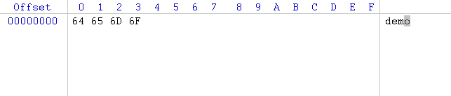

## [原文](https://www.cnblogs.com/absfree/p/5415092.html)

# 理解Java中字符流与字节流的区别

## 1. 什么是流
Java中的流是对字节序列的抽象，我们可以想象有一个水管，只不过现在流动在水管中的不再是水，而是字节序列。
和水流一样，Java中的流也具有一个“流动的方向”，通常可以从中读入一个字节序列的对象被称为输入流；
能够向其写入一个字节序列的对象被称为输出流。

 

## 2. 字节流
Java中的字节流处理的最基本单位为单个字节，它通常用来处理二进制数据。
Java中最基本的两个字节流类是InputStream和OutputStream，它们分别代表了组基本的输入字节流和输出字节流。
InputStream类与OutputStream类均为抽象类，我们在实际使用中通常使用Java类库中提供的它们的一系列子类。
下面我们以InputStream类为例，来介绍下Java中的字节流。

InputStream类中定义了一个基本的用于从字节流中读取字节的方法read，这个方法的定义如下：
```java

public abstract int read() throws IOException;

```
这是一个抽象方法，也就是说任何派生自InputStream的输入字节流类都需要实现这一方法，
这一方法的功能是从字节流中读取一个字节，若到了末尾则返回-1，否则返回读入的字节。
关于这个方法我们需要注意的是，它会一直阻塞知道返回一个读取到的字节或是-1。
另外，字节流在默认情况下是不支持缓存的，这意味着每调用一次read方法都会请求操作系统来读取一个字节，
这往往会伴随着一次磁盘IO，因此效率会比较低。有的小伙伴可能认为InputStream类中read的以字节数组为参数的重载方法，
能够一次读入多个字节而不用频繁的进行磁盘IO。那么究竟是不是这样呢？我们来看一下这个方法的源码：

```java

public int read(byte b[]) throws IOException {
    return read(b, 0, b.length);
}

```
它调用了另一个版本的read重载方法，那我们就接着往下追：


```java
     public int read(byte b[], int off, int len) throws IOException {
        if (b == null) {
            throw new NullPointerException();
        } else if (off < 0 || len < 0 || len > b.length - off) {
            throw new IndexOutOfBoundsException();
        } else if (len == 0) {
            return 0;
        }

        int c = read();
        if (c == -1) {
            return -1;
        }
        b[off] = (byte)c;

        int i = 1;
        try {
            for (; i < len ; i++) {
                c = read();
                if (c == -1) {
                    break;
                }
                b[off + i] = (byte)c;
            }
        } catch (IOException ee) {
        }
        return i;
    }
    
```

 从以上的代码我们可以看到，实际上read(byte[])方法内部也是通过循环调用read()方法来实现“一次”读入一个字节数组的，
 因此本质来说这个方法也未使用内存缓冲区。
 要使用内存缓冲区以提高读取的效率，我们应该使用BufferedInputStream。


## 3. 字符流

Java中的字符流处理的最基本的单元是Unicode码元（大小2字节），它通常用来处理文本数据。
所谓Unicode码元，也就是一个Unicode代码单元，范围是0x0000~0xFFFF。
在以上范围内的每个数字都与一个字符相对应，Java中的String类型默认就把字符以Unicode规则编码而后存储在内存中。
然而与存储在内存中不同，存储在磁盘上的数据通常有着各种各样的编码方式。
使用不同的编码方式，相同的字符会有不同的二进制表示。实际上字符流是这样工作的：

- 输出字符流：把要写入文件的字符序列（实际上是Unicode码元序列）转为指定编码方式下的字节序列，然后再写入到文件中；

- 输入字符流：把要读取的字节序列按指定编码方式解码为相应字符序列（实际上是Unicode码元序列从）从而可以存在内存中。
    
我们通过一个demo来加深对这一过程的理解，示例代码如下：

```java

import java.io.FileWriter;
import java.io.IOException;


public class FileWriterDemo {
    public static void main(String[] args) {
        FileWriter fileWriter = null;
        try {
            try {
                fileWriter = new FileWriter("demo.txt");
                fileWriter.write("demo");
            } finally {
                fileWriter.close();
            }
        } catch (IOException e) {
            e.printStackTrace();
        }
    }
}

```
 

以上代码中，我们使用FileWriter向demo.txt中写入了“demo”这四个字符，
我们用十六进制编辑器WinHex查看下demo.txt的内容：




从上图可以看出，我们写入的“demo”被编码为了“64 65 6D 6F”，
但是我们并没有在上面的代码中显式指定编码方式，
实际上，在我们没有指定时使用的是操作系统的默认字符编码方式来对我们要写入的字符进行编码。

由于字符流在输出前实际上是要完成Unicode码元序列到相应编码方式的字节序列的转换，
所以它会使用内存缓冲区来存放转换后得到的字节序列，等待都转换完毕再一同写入磁盘文件中。

## 4. 字符流与字节流的区别

经过以上的描述，我们可以知道字节流与字符流之间主要的区别体现在以下几个方面：

- 字节流操作的基本单元为字节；字符流操作的基本单元为Unicode码元。

- 字节流默认不使用缓冲区；字符流使用缓冲区。

- 字节流通常用于处理二进制数据，实际上它可以处理任意类型的数据，但它不支持直接写入或读取Unicode码元；
字符流通常处理文本数据，它支持写入及读取Unicode码元。
    

以上是我对Java中字符流与字节流的一些认识，如有叙述不清晰或是不准确的地方希望大家可以指正，谢谢大家：）

 
## 5. 参考资料

《Java核心技术 卷二》

