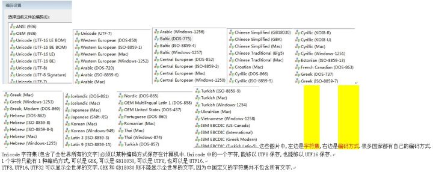

## [原文](https://www.zhihu.com/question/23374078)

# Unicode 和 UTF-8 有什么区别？

- Unicode只是一个字表，理论上可以不断往上堆
UTF系列是传输实现，受到编码格式限制，所能变现的字表范围有一定限制

utf8是对unicode字符集进行编码的一种编码方式

unicode 是标准是规范，utf8,utf16, utf32是规范的实现。
就像Web Service是规范, axis, jax-ws, http://asp.net web service 等是其实现一样。

Unicode是字符,字符必须编码后才能保存在计算机中,UTF8,UTF16等都是编码方式.

