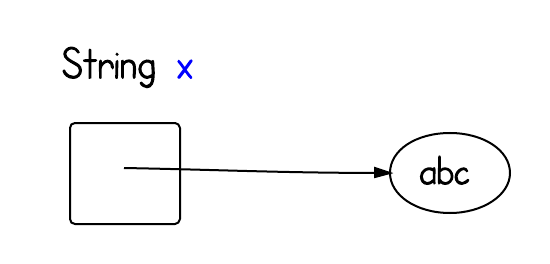

# [原文](https://li-yu.gitbooks.io/simple-java/content/Strings%20and%20Arrays/what-exactly-is-null-in-java.html)

# [英文原文](https://www.programcreek.com/2013/12/what-exactly-is-null-in-java/)

- 让我们从以下声明开始

> String x = null;

## 1.这个陈述究竟是做什么的？

回想一下什么是变量，什么是值。
一个常见的比喻是变量类似于一个盒子。
正如您可以使用框来存储某些内容一样，您可以使用变量来存储值。
声明变量时，我们需要设置其类型。

Java中有两种主要的类型：原始类型和引用类型。
声明为基本类型的变量存储值;声明引用类型的变量存储引用。

在这种情况下，初始化语句声明变量“x”。 “x”存储字符串引用。它在这里是空的。

以下可视化对此概念有了更好的理解。

如果x =“abc”，则如下所示

## 2.null 在 内存中到底是什么？

内存中的 null 到底是什么？ 或者说 Java 中 null 的值是多少？

首先，null 不是有效的对象实例，因此没有为其分配内存。 
它只是一个值，表示该对象当前未引用任何对象。

JVM 中是这样定义的：
> Java 虚拟机规范并不要求具体的值为 null。

我认为这就像C语言中，类似东西的全部为零。

## 3. 内存中的 x 到底是什么？

现在我们已经知道 null 是什么了，
同时我们也知道一个变量是一个存储位置和一个包含某些值的关联的符号名称（一个标识符）。 

但内存中的 x 到底是什么？
从 [JVM 运行时数据区图](https://www.programcreek.com/2013/04/jvm-run-time-data-areas/)，
我们知道，由于每个方法在线程堆栈内都有一个私有堆栈帧，
所以局部变量位于该帧上。

References:

1. [Variables, Operators, and Expressions](https://www.cs.cmu.edu/~pattis/15-1XX/15-200/lectures/voe/lecture.html)
2. [Variable](https://en.wikipedia.org/wiki/Variable_(computer_science))
3. [JVM Specifications](https://docs.oracle.com/javase/specs/jvms/se7/html/jvms-2.html#jvms-2.4)

