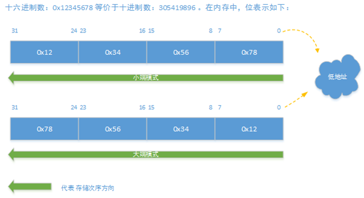

## [原文](https://www.bysocket.com/?p=615)

# 深入浅出： 大小端模式

## 一、什么大小端？

大小端在计算机业界，Endian表示数据在存储器中的存放顺序。
百度百科如下叙述之：

> 大端模式，是指数据的高字节保存在内存的低地址中，而数据的低字节保存在内存的高地址中，
这样的存储模式有点儿类似于把数据当作字符串顺序处理：地址由小向大增加，而数据从高位往低位放；
> 
> 小端模式，是指数据的高字节保存在内存的高地址中，而数据的低字节保存在内存的低地址中，
这种存储模式将地址的高低和数据位权有效地结合起来，高地址部分权值高，低地址部分权值低，和我们的逻辑方法一致。
这两种模式，泥瓦匠记忆宫殿：“小端低低”。这样就知道小端的模式，反之大端的模式。

> 大端模式（Big Endian）：数据的高字节，保存在内存的低地址中；数据的低字节，保存在内存的高地址中。

> 小端模式（Little Endian）：数据的高字节，保存在内存的高地址中；数据的低字节，保存在内存的低地址中

比如整形十进制数字：305419896 ，转化为十六进制表示 : 0x12345678 。其中按着十六进制的话，每两位占8个位，及一个字节。如图



## 二、为什么有大小端模式之分呢？

如果统一使用大端或者小端，那么何来三国演义，何来一战二战呢？还有大小端也来源于战争。所以存在即是合理。
在操作系统中，x86和一般的OS（如windows，FreeBSD,Linux）使用的是小端模式。但比如Mac OS是大端模式。

在计算机系统中，我们是以字节为单位的，每个地址单元都对应着一个字节，一个字节为8bit。
但是在C语言中除了8bit的char之外，还有16bit的short型，32bit的long型（要看具体的编译器）。
另外，对于位数大于8位的处理器，例如16位或者32位的处理器，由于寄存器宽度大于一个字节，
那么必然存在着一个如果将多个字节安排的问题。因此就导致了大端存储模式和小端存储模式。

 

知道为什么有模式的存在，下面需要了解下具有有什么应用场景：

1、不同端模式的处理器进行数据传递时必须要考虑端模式的不同

2、在网络上传输数据时，由于数据传输的两端对应不同的硬件平台，采用的存储字节顺序可能不一致。
所以在TCP/IP协议规定了在网络上必须采用网络字节顺序，也就是大端模式。
对于char型数据只占一个字节，无所谓大端和小端。而对于非char类型数据，
必须在数据发送到网络上之前将其转换成大端模式。接收网络数据时按符合接受主机的环境接收。
 

## 三、java中的大小端
存储量大于1字节，非char类型，如int，float等，要考虑字节的顺序问题了。
java由于虚拟机的关系,屏蔽了大小端问题,需要知道的话可用 ByteOrder.nativeOrder() 查询。
在操作ByteBuffer中，也可以使用 ByteBuffer.order() 进行设置：
```java

/**
 * @author Jeff Lee
 * @since 2015-10-13 20:40:00
 * ByteBuffer中字节存储次序
 */
public class Endians {
    public static void main(String[] args) {
        // 创建12个字节的字节缓冲区
        ByteBuffer bb = ByteBuffer.wrap(new byte[12]);
        // 存入字符串
        bb.asCharBuffer().put("abdcef");
        System.out.println(Arrays.toString(bb.array()));
 
        // 反转缓冲区
        bb.rewind();
        // 设置字节存储次序
        bb.order(ByteOrder.BIG_ENDIAN);
        bb.asCharBuffer().put("abcdef");
        System.out.println(Arrays.toString(bb.array()));
 
        // 反转缓冲区
        bb.rewind();
        // 设置字节存储次序
        bb.order(ByteOrder.LITTLE_ENDIAN);
        bb.asCharBuffer().put("abcdef");
        System.out.println(Arrays.toString(bb.array()));
    }
}

```
run下结果所示：
```java
[0, 97, 0, 98, 0, 100, 0, 99, 0, 101, 0, 102]
[0, 97, 0, 98, 0, 99, 0, 100, 0, 101, 0, 102]
[97, 0, 98, 0, 99, 0, 100, 0, 101, 0, 102, 0]
```
 
前两句打印说明了，ByteBuffer存储字节次序默认为大端模式。
最后一段设置了字节存储次序，然后会输出，可以看出存储次序为小端模式。


## [其他](https://rangaofei.github.io/2018/04/16/java%E4%B8%AD%E5%A4%A7%E5%B0%8F%E7%AB%AF%E9%97%AE%E9%A2%98%E7%A0%94%E7%A9%B6/#more)

## 扩展阅读

### [其他大小端问题](https://juejin.im/entry/5ad49fb1f265da23945ff57f)

### [大小端问题](https://www.cnblogs.com/skywang12345/p/3360348.html)


### [Understanding Big and Little Endian Byte Order](https://betterexplained.com/articles/understanding-big-and-little-endian-byte-order/)
