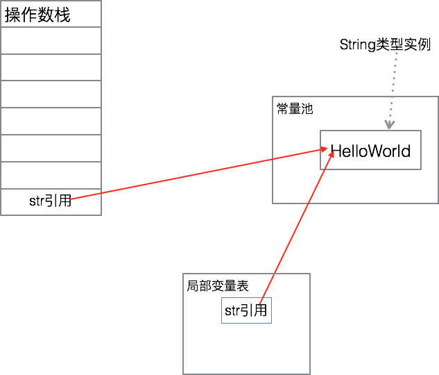

## [原文](https://www.jianshu.com/p/5528cfc461bc)

# new String与=的区别——从字节码上的解释


前几日的时候，有朋友问我这么一个问题：
```java

String str= "Hello"
String str=new String("Hello")

```

这两句究竟有什么分别。原本关于这个东西的博客和文章已经不胜枚举，不过我朋友一直觉得比较难理解，
我便从字节码的角度再解释了一遍。现在记录下来，或许也会有人存在同样的困惑。
```java

String str= "Hello"

```
首先，为了看清楚这两者的区别，先准备一点例子：

```java
public class StrTest {
    public void test(){
        String str = "HelloWorld";

        char h = str.charAt(0);

        System.out.println(h);
    }
}

```
编译之后的字节码是：

```java
  minor version: 0
  major version: 49
  flags: ACC_PUBLIC, ACC_SUPER
Constant pool:
   #1 = Methodref          #7.#22         // java/lang/Object."<init>":()V
   #2 = String             #23            // HelloWorld
   #3 = Methodref          #24.#25        // java/lang/String.charAt:(I)C
   #4 = Fieldref           #26.#27        // java/lang/System.out:Ljava/io/PrintStream;
   #5 = Methodref          #28.#29        // java/io/PrintStream.println:(C)V
   #6 = Class              #30            // com/agpalace/article/java/bytecode/chapter3/StrTest
   #7 = Class              #31            // java/lang/Object
   #8 = Utf8               <init>
   #9 = Utf8               ()V
  #10 = Utf8               Code
  #11 = Utf8               LineNumberTable
  #12 = Utf8               LocalVariableTable
  #13 = Utf8               this
  #14 = Utf8               Lcom/agpalace/article/java/bytecode/chapter3/StrTest;
  #15 = Utf8               test
  #16 = Utf8               str
  #17 = Utf8               Ljava/lang/String;
  #18 = Utf8               h
  #19 = Utf8               C
  #20 = Utf8               SourceFile
  #21 = Utf8               StrTest.java
  #22 = NameAndType        #8:#9          // "<init>":()V
  #23 = Utf8               HelloWorld
  #24 = Class              #32            // java/lang/String
  #25 = NameAndType        #33:#34        // charAt:(I)C
  #26 = Class              #35            // java/lang/System
  #27 = NameAndType        #36:#37        // out:Ljava/io/PrintStream;
  #28 = Class              #38            // java/io/PrintStream
  #29 = NameAndType        #39:#40        // println:(C)V
  #30 = Utf8               com/agpalace/article/java/bytecode/chapter3/StrTest
  #31 = Utf8               java/lang/Object
  #32 = Utf8               java/lang/String
  #33 = Utf8               charAt
  #34 = Utf8               (I)C
  #35 = Utf8               java/lang/System
  #36 = Utf8               out
  #37 = Utf8               Ljava/io/PrintStream;
  #38 = Utf8               java/io/PrintStream
  #39 = Utf8               println
  #40 = Utf8               (C)V
{
  public com.agpalace.article.java.bytecode.chapter3.StrTest();
    descriptor: ()V
    flags: ACC_PUBLIC
    Code:
      stack=1, locals=1, args_size=1
         0: aload_0
         1: invokespecial #1                  // Method java/lang/Object."<init>":()V
         4: return
      LineNumberTable:
        line 7: 0
      LocalVariableTable:
        Start  Length  Slot  Name   Signature
            0       5     0  this   Lcom/agpalace/article/java/bytecode/chapter3/StrTest;

  public void test();
    descriptor: ()V
    flags: ACC_PUBLIC
    Code:
      stack=2, locals=3, args_size=1
         0: ldc           #2                  // String HelloWorld
         2: astore_1
         3: aload_1
         4: iconst_0
         5: invokevirtual #3                  // Method java/lang/String.charAt:(I)C
         8: istore_2
         9: getstatic     #4                  // Field java/lang/System.out:Ljava/io/PrintStream;
        12: iload_2
        13: invokevirtual #5                  // Method java/io/PrintStream.println:(C)V
        16: return
      LineNumberTable:
        line 9: 0
        line 11: 3
        line 13: 9
        line 14: 16
      LocalVariableTable:
        Start  Length  Slot  Name   Signature
            0      17     0  this   Lcom/agpalace/article/java/bytecode/chapter3/StrTest;
            3      14     1   str   Ljava/lang/String;
            9       8     2     h   C
}
SourceFile: "StrTest.java"

```

我们可以只看其中test()部分的代码，其核心内容是：

```java
         0: ldc           #2                  // String HelloWorld
         2: astore_1
         3: aload_1
         4: iconst_0
         5: invokevirtual #3                  // Method java/lang/String.charAt:(I)C

```
这五条指令的解释是：

```java
ldc : ldc是从常量池里面加载一个变量到操作数栈。这个变量就是#2所代表的东西。在常量池里面可以找到：

#2 = String             #23            // HelloWorld
...
#23 = Utf8               HelloWorld

```
实际上也就是说，ldc #2这一条指令，
从常量池里面把内容是"HelloWorld"的String类型的引用加载到了操作数栈上:


 
到这一步，我们可以看到，整个JVM里面只有一个String的HelloWorld实例。
这个实例是被放在常量池中的。在test()方法里面，不过是加载了这个对象的引用而已。

而这个HelloWorld的String实例，是在什么时候创建的呢？
答案就是在常量池初始化的时候，实际上也就是在JVM类加载的过程中。

astore_1的意思是把位置1——也就是str引用放到局部变量表里：


 

到了这一步，就完成了String str = "HelloWorld";

aload_1就是把上一句的astore_1放到局部变量表的str引用再次加载回来：




注意的是，此时局部变量表中还有这个str引用。
因此现在实际上在操作数栈和局部变量表里面各有一个引用引向了HelloWorld这个String类型的实例。
实际上到了这一步，大家就应该明白了，在String str = "HelloWorld";这种情况下，str会如何被使用。

iconst_0和invokevirtual两条指令分别就是在操作数上加载常数0，
以及调用String的chatAt方法，读者可以自己去了解这两条指令的细节。
```java

String str=new String("Hello")
示例代码：
    public void test(){
        String str = new String("HelloWorld");

        char h = str.charAt(0);

        System.out.println(h);
    }
```

字节码是：
```java

  minor version: 0
  major version: 49
  flags: ACC_PUBLIC, ACC_SUPER
Constant pool:
   #1 = Methodref          #9.#24         // java/lang/Object."<init>":()V
   #2 = Class              #25            // java/lang/String
   #3 = String             #26            // HelloWorld
   #4 = Methodref          #2.#27         // java/lang/String."<init>":(Ljava/lang/String;)V
   #5 = Methodref          #2.#28         // java/lang/String.charAt:(I)C
   #6 = Fieldref           #29.#30        // java/lang/System.out:Ljava/io/PrintStream;
   #7 = Methodref          #31.#32        // java/io/PrintStream.println:(C)V
   #8 = Class              #33            // com/agpalace/article/java/bytecode/chapter3/StrTest
   #9 = Class              #34            // java/lang/Object
  #10 = Utf8               <init>
  #11 = Utf8               ()V
  #12 = Utf8               Code
  #13 = Utf8               LineNumberTable
  #14 = Utf8               LocalVariableTable
  #15 = Utf8               this
  #16 = Utf8               Lcom/agpalace/article/java/bytecode/chapter3/StrTest;
  #17 = Utf8               test
  #18 = Utf8               str
  #19 = Utf8               Ljava/lang/String;
  #20 = Utf8               h
  #21 = Utf8               C
  #22 = Utf8               SourceFile
  #23 = Utf8               StrTest.java
  #24 = NameAndType        #10:#11        // "<init>":()V
  #25 = Utf8               java/lang/String
  #26 = Utf8               HelloWorld
  #27 = NameAndType        #10:#35        // "<init>":(Ljava/lang/String;)V
  #28 = NameAndType        #36:#37        // charAt:(I)C
  #29 = Class              #38            // java/lang/System
  #30 = NameAndType        #39:#40        // out:Ljava/io/PrintStream;
  #31 = Class              #41            // java/io/PrintStream
  #32 = NameAndType        #42:#43        // println:(C)V
  #33 = Utf8               com/agpalace/article/java/bytecode/chapter3/StrTest
  #34 = Utf8               java/lang/Object
  #35 = Utf8               (Ljava/lang/String;)V
  #36 = Utf8               charAt
  #37 = Utf8               (I)C
  #38 = Utf8               java/lang/System
  #39 = Utf8               out
  #40 = Utf8               Ljava/io/PrintStream;
  #41 = Utf8               java/io/PrintStream
  #42 = Utf8               println
  #43 = Utf8               (C)V
{
  public com.agpalace.article.java.bytecode.chapter3.StrTest();
    descriptor: ()V
    flags: ACC_PUBLIC
    Code:
      stack=1, locals=1, args_size=1
         0: aload_0
         1: invokespecial #1                  // Method java/lang/Object."<init>":()V
         4: return
      LineNumberTable:
        line 7: 0
      LocalVariableTable:
        Start  Length  Slot  Name   Signature
            0       5     0  this   Lcom/agpalace/article/java/bytecode/chapter3/StrTest;

  public void test();
    descriptor: ()V
    flags: ACC_PUBLIC
    Code:
      stack=3, locals=3, args_size=1
         0: new           #2                  // class java/lang/String
         3: dup
         4: ldc           #3                  // String HelloWorld
         6: invokespecial #4                  // Method java/lang/String."<init>":(Ljava/lang/String;)V
         9: astore_1
        10: aload_1
        11: iconst_0
        12: invokevirtual #5                  // Method java/lang/String.charAt:(I)C
        15: istore_2
        16: getstatic     #6                  // Field java/lang/System.out:Ljava/io/PrintStream;
        19: iload_2
        20: invokevirtual #7                  // Method java/io/PrintStream.println:(C)V
        23: return
      LineNumberTable:
        line 9: 0
        line 11: 10
        line 13: 16
        line 14: 23
      LocalVariableTable:
        Start  Length  Slot  Name   Signature
            0      24     0  this   Lcom/agpalace/article/java/bytecode/chapter3/StrTest;
           10      14     1   str   Ljava/lang/String;
           16       8     2     h   C
}
SourceFile: "StrTest.java"
```
和之前的比起来，不同的地方就在于String str = "HelloWorld"; 
变成了new String("HelloWorld")。在test()方法里面，指令却有了很大的不同：
```java

         0: new           #2                  // class java/lang/String
         3: dup
         4: ldc           #3                  // String HelloWorld
         6: invokespecial #4                  // Method java/lang/String."<init>":(Ljava/lang/String;)V
         9: astore_1
        10: aload_1
        11: iconst_0
        12: invokevirtual #5
```
可以看到的是9，10，11，12四条指令和之前的2，3，4，5是一样的，这里就不多做解释了。
唯一不同的就是前面的0，3，4，6：


new：这是一个创建对象的指令。但是它和我们理解的new关键字不太一样，
我们可以这样说：new关键字= new指令+&ltinit>方法调用。
new指令主要完成两方面的工作：根据类型（也就是#2指向的String）在堆中开辟一块空间，
并且赋予字段默认值。这个字段默认值是指，int类型会被赋值成0，boolean类型会被赋值成false，
这种字段默认值。new指令执行之后，堆中就有了一块空间，可以用来放String类型对象：


同时,new指令还导致操作数栈有一个引用，指向这一块刚刚开辟出来的空间


dup：该指令是复制操作数栈栈顶。我们知道，刚刚执行完new指令之后，
操作数栈只有一个变量，就是str引用。所以这个时候执行dup指令之后，实际上就是复制了一个str引用：


ldc：前面我们已经解释过了ldc指令，在这里它的含义也是一样的：
从常量池里面把HelloWorld的String实例引用加载到操作数栈上。于是有：


invokespecial: 这是调用String的初筛化方法，对应到Java语言上，
就是执行构造函数里面的初始化代码。这个初始化方法有一个String类型的参数，
所以它会用到前面ldc加载的常量池的引用，用常量池中的String实例来实例化在堆中分配的内存空间，
于是得到：


执行到这一步，和前面直接使用=号初始化String类型的内存布局比起来，
不同的就是在堆中也创建了一个String对象，内容是"HelloWorld"。
而且，操作数栈上的引用改为了引用这个堆中创建的对象，而不是引用常量池中的对象。

于是可以看出来String str = "HelloWorld"; 和new String("HelloWorld")比起来，
最大的不同就在于是否在堆上创建了对象。后续对于str的使用，无不体现这种内存布局上的差异。
使用new关键字创建对象，而后使用的便一直都是堆中的对象。可以想到的是，
采用new关键字创建的对象，会因为在堆中创建了新的对象，而导致堆可用内存减少，
并且也会被垃圾回收所管理，这是比较影响性能的一方面；
而在另外一方面，new关键字还导致了字节码指令更加多，更加复杂，这也是性能损耗的地方。

## 附：intern()方法
其实理解了前面的内容，就很容易理解intern()方法的机制了。
intern()是一个本地方法，所以并不能从字节码上得到什么启发。
我简要描述一下Intern()方法的机制。它实际上就是检测一下常量池有没有相应的String实例，
如果有的话，就直接返回常量池的实例，否则的话，会在常量池里面创建一个实例，
而后把实例返回，我把这个过程称为“下沉”。下面这个例子看不出来“下沉”，
但是大略能够看出来一点intern()方法的奥妙：
```java

    public void test(){
        String str = new String("HelloWorld");

        String otherStr = str.intern();

        char h = otherStr.charAt(0);

        System.out.println(h);
    }
```
其字节码是，省略了部分内容：
```java

  public void test();
    Code:
       0: new           #2                  // class java/lang/String
       3: dup
       4: ldc           #3                  // String HelloWorld
       6: invokespecial #4                  // Method java/lang/String."<init>":(Ljava/lang/String;)V
       9: astore_1
      10: aload_1
      11: invokevirtual #5                  // Method java/lang/String.intern:()Ljava/lang/String;
      14: astore_2
      15: aload_2
      16: iconst_0
      17: invokevirtual #6                  // Method java/lang/String.charAt:(I)C
      20: istore_3
      21: getstatic     #7                  // Field java/lang/System.out:Ljava/io/PrintStream;
      24: iload_3
      25: invokevirtual #8                  // Method java/io/PrintStream.println:(C)V
      28: return
```
0，3，4，6，9，10执行之后的内存布局是：


而后它执行11，14之后变成了：


这里要注意的是，otherStr引用的是常量池里面的实例，
而不是str在堆里面创建的实例，在这个例子中它的实际效果和String otherStr = "HelloWorld";是一致的。

## 后记
其实我这里只是描述了最为简单的情况，还有一些额外的情况，读者要是有兴趣，
就自己写简单的示例，而后看看其字节码，大概就都能够明白过来。

举例来说：
```java

String str1 = "a" + "b";
String str2 = str1 + "c";

```
在字节码上会有什么区别呢？？这些内容就留给读者自己去思考了。
若是有问题，可以留言，不定时回答（假装这篇博客很受欢迎=.=）。
 