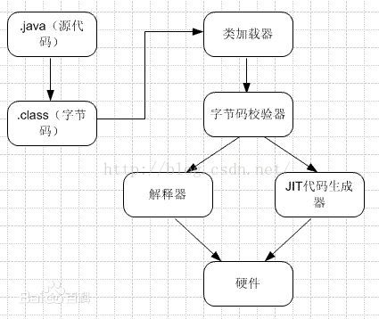
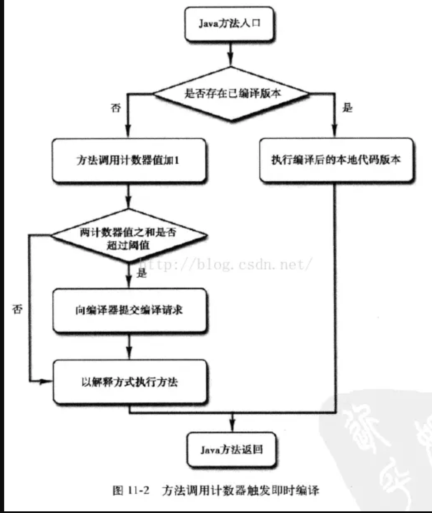

## [原文](https://www.jianshu.com/p/eea12f3bf490)

# 14、Java JIT 知识

## java编译器，java解释器
1. java程序是一种可跨平台执行的语言，之所以可以跨平台，
是因为jvm的存在，JVM屏蔽了与具体操作系统平台相关的信息，
使java文件只需要生成为jvm可识别的字节码(*.class)文件，jvm会将字节码文件交给解释器，
翻译成机器码，由解释器执行，JVM解释执行字节码文件就是JVM操作Java解释器进行解释执行字节码文件的过程。
这样保证了在任何平台上，都可以成功的执行java程序，jvm的存在就是java可跨平台的核心。

2. 解释器是把高级语言一行一行直接翻译再运行，它不会一次性把整个文件都翻译过来，
而是翻译一句，执行一句，再翻译，再执行，所以解释器的程序运行起来会比较慢，每次都要解释之后再执行。

3. 动态编译（dynamic compilation）指的是“在运行时进行编译”；
与之相对的是事前编译（ahead-of-time compilation，简称AOT），也叫静态编译（static compilation）。

## 什么是JIT
1.JIT编译（just-in-time compilation）狭义来说是当某段代码即将第一次被执行时进行编译，
因而叫“即时编译”。JIT编译是动态编译的一种特例。
JIT编译一词后来被泛华，时常与动态编译等价；但要注意广义与狭义的JIT编译所指的区别。
JIT(即时编译)是用来提高java程序运行效率的，原本字节码由解释器需要经过解释再运行，
现在有了JIT技术，将字节码编译成平台相关的原生机器码，并进行各个层次的优化，这些机器码会被缓存起来，
以备下次使用，如果JIT对每条字节码都进行编译，缓存(缓存的指令是有限的)，
会增加开销，因此JIT只对热点代码进行即时编译，如循环，高频度使用的方法，会将整个方法编译成本地机器码，然后直接运行机器码。

java虚拟机并没有规定一定要有JIT，但是，即时编译器编译性能的好坏、
代码优化程度的高低却是衡量一款商用虚拟机优秀与否的最关键的指标之一，
它也是虚拟机中最核心且最能体现虚拟机技术水平的部分。

由于Java虚拟机规范并没有具体的约束规则去限制即使编译器应该如何实现，
所以这部分功能完全是与虚拟机具体实现相关的内容，如无特殊说明，我们提到的编译器、
即时编译器都是指Hotspot虚拟机内的即时编译器，虚拟机也是特指HotSpot虚拟机。




## 为什么HotSpot要使用编译器和解释器并存的模式

1. 尽管并不是所有的Java虚拟机都采用解释器与编译器并存的架构，
但许多主流的商用虚拟机（如HotSpot），都同时包含解释器和编译器。解释器与编译器两者各有优势：
当程序需要迅速启动和执行的时候，解释器可以首先发挥作用，省去编译的时间，立即执行。
在程序运行后，随着时间的推移，编译器逐渐发挥作用，把越来越多的代码编译成本地代码之后，
可以获取更高的执行效率。当程序运行环境中内存资源限制较大（如部分嵌入式系统中），
可以使用解释器执行节约内存，反之可以使用编译执行来提升效率。
此外，如果编译后出现“罕见陷阱”，可以通过逆优化退回到解释执行。

2. 编译器的时间开销和空间开销：

解释器的执行，抽象的看是这样的：

> 字节码 -> [ 解释器 解释执行机器码 ] -> 执行结果

而要JIT编译然后再执行的话，抽象的看则是：

> 字节码 -> [ 编译器 编译 ] -> 与机器相关的机器码-> [ 执行 ] -> 执行结果

说JIT比解释快，其实说的是“执行编译后的代码”比“解释器解释执行”要快，并不是说“编译”这个动作比“解释”这个动作快。

JIT编译再怎么快，至少也比解释执行一次略慢一些，而要得到最后的执行结果还得再经过一个“执行编译后的代码”的过程。
所以，对“只执行一次”的代码而言，解释执行其实总是比JIT编译执行要快。
怎么算是“只执行一次的代码”呢？粗略说，下面两个条件同时满足时就是严格的“只执行一次”

1、只被调用一次，例如类的构造器（class initializer，()）

2、没有循环

对只执行一次的代码做JIT编译再执行，可以说是得不偿失。
对只执行少量次数的代码，JIT编译带来的执行速度的提升也未必能抵消掉最初编译带来的开销。
只有对频繁执行的代码，JIT编译才能保证有正面的收益。

对一般的Java方法而言，编译后代码的大小相对于字节码的大小，膨胀比达到10x是很正常的。
同上面说的时间开销一样，这里的空间开销也是，只有对执行频繁的代码才值得编译，
如果把所有代码都编译则会显著增加代码所占空间，导致“代码爆炸”。
这也就解释了为什么有些JVM会选择不总是做JIT编译，而是选择用解释器+JIT编译器的混合执行引擎。

## 哪些程序代码会被编译为本地代码？如何编译为本地代码？
程序中的代码只有是热点代码时，才会编译为本地代码，那么什么是热点代码呢？运行过程中会被即时编译器编译的“热点代码”有两类：

1、被多次调用的方法。
2、被多次执行的循环体。

两种情况，编译器都是以整个方法作为编译对象。 
这种编译方法因为编译发生在方法执行过程之中，因此形象的称之为栈上替换（On Stack Replacement，OSR），
即方法栈帧还在栈上，方法就被替换了。

## 如何判断方法或一段代码或是不是热点代码呢？

在HotSpot虚拟机中使用的基于计数器的热点探测方法，因此它为每个方法准备了两个计数器：方法调用计数器和回边计数器。
在确定虚拟机运行参数的前提下，这两个计数器都有一个确定的阈值，当计数器超过阈值溢出了，就会触发JIT编译。

方法调用计数器：顾名思义，这个计数器用于统计方法被调用的次数。

当一个方法被调用时，会先检查该方法是否存在被JIT编译过的版本，如果存在，则优先使用编译后的本地代码来执行。
如果不存在已被编译过的版本，则将此方法的调用计数器值加1，
然后判断方法调用计数器与回边计数器值之和是否超过方法调用计数器的阈值。
如果超过阈值，那么将会向即时编译器提交一个该方法的代码编译请求。

如果不做任何设置，执行引擎并不会同步等待编译请求完成，而是继续进行解释器按照解释方式执行字节码，
直到提交的请求被编译器编译完成。当编译工作完成之后，
这个方法的调用入口地址就会系统自动改写成新的，下一次调用该方法时就会使用已编译的版本。



回变计数器：它的作用就是统计一个方法中循环体代码执行的次数，在字节码中遇到控制流向后跳转的指令称为“回边”。


## 如何编译为本地代码

Server Compiler和Client Compiler两个编译器的编译过程是不一样的。

对Client Compiler来说，它是一个简单快速的编译器，主要关注点在于局部优化，而放弃许多耗时较长的全局优化手段。

而Server Compiler则是专门面向服务器端的，并为服务端的性能配置特别调整过的编译器，是一个充分优化过的高级编译器。

- 1、Client Compiler

简称C1编译器；

(A)应用特点

较为轻量，只做少量性能开销比较高的优化，它占用内存较少，适合于桌面交互式应用。

(B)优化技术

它是一个简单快速的三段式编译器，主要关注点在于局部性的优化，而放弃了许多耗时较长的全局优化；
在寄存器分配策略上，JDK6以后采用的为线性扫描寄存器分配算法，其他方面的优化，主要有方法内联、去虚拟化、冗余消除等；

(C)设置参数
可以使用"-client"参数强制选择运行在Client模式（Client VM）

- 2、Server Compiler

简称C2编译器，也叫Opto编译器；

(A)应用特点

较为重量，采用了大量传统编译优化的技巧来进行优化，占用内存相对多一些，适合服务器端的应用。

(B)优化技术

它会执行所有经典的优化动作，如无用代码消除、循环展开、循环表达式外提、消除公表达式、
常量传播、基本块重排序等；还会一些与Java语言特性密切相关的优化技术，如范围检查消除、空值检查消除等；
另外，还进行一些不稳定的激进优化，如守护内联、分支频率预测等。

(C)收集性能信息

由于C2会收集程序运行信息，因此其优化范围更多在于全局优化，不仅仅是一个方块的优化；
收集的信息主要有：分支的跳转/不跳转的频率、某条指令上出现过的类型、是否出现过空值、是否出现过异常等。

(D)与C1的不同点

和C1的不同主要在于寄存器分配策略及优化范围，寄存器分配策略上C2采用传统的全局图着色寄存器分配算法；
C2编译速度较为缓慢，但远远超过传统的静态优化编译器；而且编译输出的代码质量高，可以减少本地代码的执行时间。

(E)设置参数

可以使用"-server"参数强制选择运行在Server模式（Server VM）

## HotSpot 虚拟机的优化技术
1.HotSpot 虚拟机使用了很多种优化技术，这里只简单介绍其中的几种，完整的优化技术介绍可以参考官网内容。

(1)公共子表达式消除：

如果一个表达式已经进行过计算，并且在下次用到之前依赖的变量没有变化，
即表达式的计算结果不会发生变化，则在下次使用这个表达式时直接使用计算的结果。

(2)数组边界检查消除：

在 Java 中访问数组时，会自动进行边界检查来防止数组下标越界。
但是对于某些情况并不需要每次访问都去检查，如在一个循环中遍历数组元素，
如果虚拟机能够确定下标不会发生越界并且优化确实能够提高运行速度，则虚拟机会去除每次访问的下标检查。

(3)方法内联：

对于可以内联的方法，直接复制到调用者代码中，减少方法调用次数和性能消耗。

(4)逃逸分析：

方法中定义的一个对象，如果会被其他方法访问则称为方法逃逸，如果会被其他线程访问则称为线程逃逸。
对于不能逃逸的对象，HotSpot 虚拟机采用了栈上分配、同步消除、标量替换等方法进行优化。

## JIT编译阈值
即时编译JIT只在代码段执行足够次数才会进行优化，在执行过程中不断收集各种数据，作为优化的决策，
所以在优化完成之前，例子中的User对象还是在堆上进行分配。

那么一段代码需要执行多少次才会触发JIT优化呢？通常这个值由-XX:CompileThreshold参数进行设置：

1、使用client编译器时，默认为1500；

2、使用server编译器时，默认为10000；

意味着如果方法调用次数或循环次数达到这个阈值就会触发标准编译，更改CompileThreshold标志的值，将使编译器提早（或延迟）编译。

除了标准编译，还有一个叫做OSR（On Stack Replacement）栈上替换的编译，如上述例子中的main方法，
只执行一次，远远达不到阈值，但是方法体中执行了多次循环，OSR编译就是只编译该循环代码，
然后将其替换，下次循环时就执行编译好的代码，不过触发OSR编译也需要一个阈值，可以通过以下公式得到。

```
-XX:CompileThreshold = 10000
-XX:OnStackReplacePercentage = 140
-XX:InterpreterProfilePercentage = 33
OSR trigger = (CompileThreshold * (OnStackReplacePercentage - InterpreterProfilePercentage)) / 100 = 10700
```
其中trigger即为OSR编译的阈值。

更多关于编译阈值信息请参考

<http://www.jianshu.com/p/20bd2e9b1f03>
 

[Java10来了，来看看它一同发布的全新JIT编译器](https://mp.weixin.qq.com/s/fNDBX6pxw2Xa5afZpVaBEg) 


