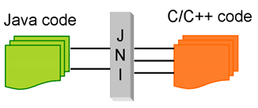

## [原文](https://www.cnblogs.com/Alandre/p/4456719.html)

# 认识&理解关键字 native 实战篇

初次遇见 native 是在 java.lang.Object 源码中的一个hashCode方法：
```java

public native int hashCode();

```

为什么有个native呢？这是我所要学习的地方。所以今天泥瓦匠想要总结下native。

## 一、认识 native 即 JNI,Java Native Interface
凡是一种语言，都希望是纯。比如解决某一个方案都喜欢就单单这个语言来写即可。
Java平台有个用户和本地C代码进行互操作的API，
称为Java Native Interface (Java本地接口)。



## 二、用 Java 调用 C 的“Hello，JNI”
我们需要按照下班方便的步骤进行：

### 1、创建一个Java类，里面包含着一个 native 的方法和加载库的方法 loadLibrary。

HelloNative.java 代码如下：

```java

public class HelloNative
{
    static
    {
        System.loadLibrary("HelloNative");
    }
     
    public static native void sayHello();
     
    @SuppressWarnings("static-access")
    public static void main(String[] args)
    {
        new HelloNative().sayHello();
    }
}

```
首先让大家注意的是native方法，那个加载库的到后面也起作用。
native 关键字告诉编译器（其实是JVM）调用的是该方法在外部定义，这里指的是C。
如果大家直接运行这个代码，  JVM会告之：“A Java Exception has occurred.”控制台输出如下：

```java

Exception in thread "main" java.lang.UnsatisfiedLinkError: no HelloNative in java.library.path
    at java.lang.ClassLoader.loadLibrary(Unknown Source)
    at java.lang.Runtime.loadLibrary0(Unknown Source)
    at java.lang.System.loadLibrary(Unknown Source)
    at HelloNative.<clinit>(HelloNative.java:5)

```
这是程序使用它的时候，虚拟机说不知道如何找到sayHello。下面既可以手动写，自然泥瓦匠是用

### 2、运行javah，得到包含该方法的C声明头文件.h

泥瓦匠将HelloNative.java ，简单地 javac javah，如图


就得到了下面的 HelloNative.h文件 ：
> 在MAC jdk11 执行 javah HelloNative 提示找不到这个类文件
```c

/* DO NOT EDIT THIS FILE - it is machine generated */
#include <jni.h>
/* Header for class HelloNative */
 
#ifndef _Included_HelloNative
#define _Included_HelloNative
#ifdef __cplusplus
extern "C" {
#endif
/*
 * Class:     HelloNative
 * Method:    sayHello
 * Signature: ()V
 */
JNIEXPORT void JNICALL Java_HelloNative_sayHello
  (JNIEnv *, jclass);
 
#ifdef __cplusplus
}
#endif
#endif
```
jni.h 这个文件，在/%JAVA_HOME%include

### 3、根据头文件，写C实现本地方法。

这里我们简单地实现这个sayHello方法如下：

```c
#include "HelloNative.h"
#include <stdio.h>
 
JNIEXPORT void JNICALL Java_HelloNative_sayHello
{
    printf("Hello，JNI");   
}
```
### 4、生成dll共享库，然后Java程序load库，调用即可。

在Windows上，MinGW GCC 运行如下

> gcc -m64  -Wl,--add-stdcall-alias -I"C:\Program Files\Java\jdk1.7.0_71\include" -I"C:\Program Files\Java\jdk1.7.0_71\include\include\win32" -shared -o HelloNative.dll HelloNative.c

-m64表示生成dll库是64位的。然后运行 HelloNative：
```java

java HelloNative

```  

终于成功地可以看到控制台打印如下：

Hello，JNI

## 三、JNI 调用 C 流程图


