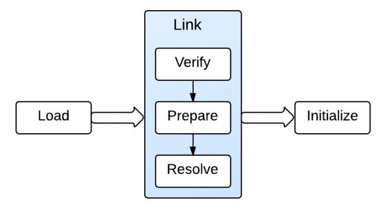

# [原文](https://li-yu.gitbooks.io/simple-java/content/CompilerAndJvm/what-can-you-learn-from-a-java-helloworld-program.html)

# [英文原文](https://www.programcreek.com/2013/04/what-can-you-learn-from-a-java-helloworld-program/)

# 从 “Hello World” 中可以学到什么？


这是每个 Java 程序员都知道的程序。
它非常简单，但是一个简单的开始可以深入了解更复杂的概念。 
在这篇文章中，我将探讨从这个简单的程序可以学到什么。

```java
public class HelloWorld {
    /**
     * @param args
     */
    public static void main(String[] args) {
        // TODO Auto-generated method stub
        System.out.println("Hello World");
    }
}
```

## 1. 为什么一切都是从类开始？
Java 程序都是由类构建的，每个方法和字段都必须在一个类中。 
这是由于其面向对象的特性：一切都是类的实例对象。 
面向对象编程语言比函数式编程语言有很多优点，如更好的模块化，可扩展性等。

## 2. 为什么总是有个 "main" 方法？
main 方法是程序入口，它是静态的。 
static 表示该方法是其类的一部分，而不是对象的一部分。

这是为什么？ 为什么不把非静态方法作为程序入口？

如果方法不是静态的，那么需要先创建一个对象来使用该方法。 
因为必须在对象上调用该方法。 为了实现程序入口，这是不现实的。 
我们不能得到没有鸡的鸡蛋。 
因此，程序入口方法是静态的。

参数 String [] args 表示可以将一个字符串数组发送到程序来帮助程序初始化。


## 3.为什么main方法是静态的（static）

（1）正因为main方法是静态的，JVM调用这个方法就不需要创建任何包含这个main方法的实例。

（2）因为C和C++同样有类似的main方法作为程序执行的入口。

（3）如果main方法不声明为静态的，JVM就必须创建main类的实例，因为构造器可以被重载，JVM就没法确定调用哪个main方法。

（4）静态方法和静态数据加载到内存就可以直接调用而不需要像实例方法一样创建实例后才能调用，
如果main方法是静态的，那么它就会被加载到JVM上下文中成为可执行的方法。


## 4、为什么main方法是公有的（public）
Java指定了一些可访问的修饰符如：private、protected、public，任何方法或变量都可以声明为public，
Java可以从该类之外的地方访问。
因为main方法是公共的，JVM就可以轻松的访问执行它。

 

## 5、为什么main方法没有返回值（void）
因为main返回任何值对程序都没任何意义，所以设计成void，意味着main不会有任何值返回


## 6. HelloWorld 的字节码

要执行程序，Java 文件首先被编译为存储在 .class 文件中的 Java 字节码。
字节代码是什么样的？ 字节码本身不可读。
如果我们使用十六进制编辑器打开它，将会显示如下：

```java
cafe babe 0000 0034 0022 0a00 0600 1409
0015 0016 0800 170a 0018 0019 0700 1a07
001b 0100 063c 696e 6974 3e01 0003 2829
5601 0004 436f 6465 0100 0f4c 696e 654e
756d 6265 7254 6162 6c65 0100 124c 6f63
616c 5661 7269 6162 6c65 5461 626c 6501
0004 7468 6973 0100 1f4c 7370 6163 652f
7061 6e6b 7569 2f62 6173 6963 2f48 656c
6c6f 576f 726c 643b 0100 046d 6169 6e01
0016 285b 4c6a 6176 612f 6c61 6e67 2f53
7472 696e 673b 2956 0100 0461 7267 7301
0013 5b4c 6a61 7661 2f6c 616e 672f 5374
7269 6e67 3b01 000a 536f 7572 6365 4669
6c65 0100 0f48 656c 6c6f 576f 726c 642e
6a61 7661 0c00 0700 0807 001c 0c00 1d00
1e01 000b 4865 6c6c 6f20 576f 726c 6407
001f 0c00 2000 2101 001d 7370 6163 652f
7061 6e6b 7569 2f62 6173 6963 2f48 656c
6c6f 576f 726c 6401 0010 6a61 7661 2f6c
616e 672f 4f62 6a65 6374 0100 106a 6176
612f 6c61 6e67 2f53 7973 7465 6d01 0003
6f75 7401 0015 4c6a 6176 612f 696f 2f50
7269 6e74 5374 7265 616d 3b01 0013 6a61
7661 2f69 6f2f 5072 696e 7453 7472 6561
6d01 0007 7072 696e 746c 6e01 0015 284c
6a61 7661 2f6c 616e 672f 5374 7269 6e67
3b29 5600 2100 0500 0600 0000 0000 0200
0100 0700 0800 0100 0900 0000 2f00 0100
0100 0000 052a b700 01b1 0000 0002 000a
0000 0006 0001 0000 000a 000b 0000 000c
0001 0000 0005 000c 000d 0000 0009 000e
000f 0001 0009 0000 0037 0002 0001 0000
0009 b200 0212 03b6 0004 b100 0000 0200
0a00 0000 0a00 0200 0000 1000 0800 1100
0b00 0000 0c00 0100 0000 0900 1000 1100
0000 0100 1200 0000 0200 13
```
我们可以在上面的字节码中看到很多操作码（例如 CA，4C 等），
每个操作码都具有相应的记忆码（例如下面的例子中的 aload_0）。
 操作码不可读，但我们可以使用 javap 查看 .class 文件的记忆码形式。
 
 javap -c 打印出类中每个方法的反汇编代码。 反汇编的代码就是构成 Java 字节码的指令。
 
> javap -classpath .  -c HelloWorld

```java
Compiled from "HelloWorld.java"
public class space.pankui.basic.HelloWorld {
  public space.pankui.basic.HelloWorld();
    Code:
       0: aload_0
       1: invokespecial #1                  // Method java/lang/Object."<init>":()V
       4: return

  public static void main(java.lang.String[]);
    Code:
       0: getstatic     #2                  // Field java/lang/System.out:Ljava/io/PrintStream;
       3: ldc           #3                  // String Hello World
       5: invokevirtual #4                  // Method java/io/PrintStream.println:(Ljava/lang/String;)V
       8: return
}
```

使用IDEA  show bytecode(注意一定先编译代码了，这个功能才起作用)
 
```java
// class version 52.0 (52)
// access flags 0x21
public class space/pankui/basic/HelloWorld {

  // compiled from: HelloWorld.java

  // access flags 0x1
  public <init>()V
   L0
    LINENUMBER 10 L0
    ALOAD 0
    INVOKESPECIAL java/lang/Object.<init> ()V
    RETURN
   L1
    LOCALVARIABLE this Lspace/pankui/basic/HelloWorld; L0 L1 0
    MAXSTACK = 1
    MAXLOCALS = 1

  // access flags 0x9
  public static main([Ljava/lang/String;)V
   L0
    LINENUMBER 16 L0
    GETSTATIC java/lang/System.out : Ljava/io/PrintStream;
    LDC "Hello World"
    INVOKEVIRTUAL java/io/PrintStream.println (Ljava/lang/String;)V
   L1
    LINENUMBER 17 L1
    RETURN
   L2
    LOCALVARIABLE args [Ljava/lang/String; L0 L2 0
    MAXSTACK = 2
    MAXLOCALS = 1
}

```


上面的代码包含两个方法：一个是默认的构造函数，由编译器推断；另一个是主要的方法。

在每个方法下，都有一系列指令，例如 aload_0，invocationpecial＃1 等。

每个指令可以在 Java 字节码指令列表 中查找。

例如，aload_0 就是将本地变量 0 的引用加载到堆栈中，getstatic 获取类的静态字段值。

请注意，getstatic 指令后的 ＃2 指向运行时的常量池。常量池是 JVM 运行时数据区之一。

如果我们想看一下常量池，可以使用 javap -verbose 命令。

另外，每个指令都以一个数字开头，如 0，1，4 等。在 .class 文件中，每个方法都有一个对应的字节码数组。

这些数字对应于存储每个操作码及其参数的数组的索引。每个操作码长度为 1 个字节，指令可以有 0 个或多个参数。这就是为什么这些数字不是连续的。

现在我们可以使用 javap -verbose 来进一步了解该类。


- 现在我们可以使用 javap -verbose 来进一步了解该类。

> javap -classpath . -verbose HelloWorld


```java
  Compiled from "HelloWorld.java"
public class space.pankui.basic.HelloWorld
  minor version: 0
  major version: 52
  flags: ACC_PUBLIC, ACC_SUPER
Constant pool:
   #1 = Methodref          #6.#20         // java/lang/Object."<init>":()V
   #2 = Fieldref           #21.#22        // java/lang/System.out:Ljava/io/PrintStream;
   #3 = String             #23            // Hello World
   #4 = Methodref          #24.#25        // java/io/PrintStream.println:(Ljava/lang/String;)V
   #5 = Class              #26            // space/pankui/basic/HelloWorld
   #6 = Class              #27            // java/lang/Object
   #7 = Utf8               <init>
   #8 = Utf8               ()V
   #9 = Utf8               Code
  #10 = Utf8               LineNumberTable
  #11 = Utf8               LocalVariableTable
  #12 = Utf8               this
  #13 = Utf8               Lspace/pankui/basic/HelloWorld;
  #14 = Utf8               main
  #15 = Utf8               ([Ljava/lang/String;)V
  #16 = Utf8               args
  #17 = Utf8               [Ljava/lang/String;
  #18 = Utf8               SourceFile
  #19 = Utf8               HelloWorld.java
  #20 = NameAndType        #7:#8          // "<init>":()V
  #21 = Class              #28            // java/lang/System
  #22 = NameAndType        #29:#30        // out:Ljava/io/PrintStream;
  #23 = Utf8               Hello World
  #24 = Class              #31            // java/io/PrintStream
  #25 = NameAndType        #32:#33        // println:(Ljava/lang/String;)V
  #26 = Utf8               space/pankui/basic/HelloWorld
  #27 = Utf8               java/lang/Object
  #28 = Utf8               java/lang/System
  #29 = Utf8               out
  #30 = Utf8               Ljava/io/PrintStream;
  #31 = Utf8               java/io/PrintStream
  #32 = Utf8               println
  #33 = Utf8               (Ljava/lang/String;)V
{
  public space.pankui.basic.HelloWorld();
    descriptor: ()V
    flags: ACC_PUBLIC
    Code:
      stack=1, locals=1, args_size=1
         0: aload_0
         1: invokespecial #1                  // Method java/lang/Object."<init>":()V
         4: return
      LineNumberTable:
        line 10: 0
      LocalVariableTable:
        Start  Length  Slot  Name   Signature
            0       5     0  this   Lspace/pankui/basic/HelloWorld;

  public static void main(java.lang.String[]);
    descriptor: ([Ljava/lang/String;)V
    flags: ACC_PUBLIC, ACC_STATIC
    Code:
      stack=2, locals=1, args_size=1
         0: getstatic     #2                  // Field java/lang/System.out:Ljava/io/PrintStream;
         3: ldc           #3                  // String Hello World
         5: invokevirtual #4                  // Method java/io/PrintStream.println:(Ljava/lang/String;)V
         8: return
      LineNumberTable:
        line 16: 0
        line 17: 8
      LocalVariableTable:
        Start  Length  Slot  Name   Signature
            0       9     0  args   [Ljava/lang/String;
}
SourceFile: "HelloWorld.java"
```

JVM 文档：运行时常量池为常规编程语言提供类似于符号表的函数，尽管它包含比典型符号表更宽的数据范围。

invocationspecial＃1 指令中的 ＃1 指向常量池中的 ＃1 常数。常数是 Method #6.#15;。
从数字，我们可以通过递归得到最终的常数。

LineNumberTable 向调试器提供信息，以指示 Java 源代码行号对应的那个字节代码指令。 

例如，Java 源代码中的第 9 行对应于主方法中的字节代码 0，第 10 行对应于字节代码 8。
如果你想更多地了解字节码，你可以创建和编译一个更复杂的类来看看。 HelloWorld 只是一个初步的认识。


## 7. 它是如何在 JVM 中执行的？

现在的问题是 JVM 如何加载类并调用 main 方法？

- 在执行 main 方法之前，JVM 需要 -> 加载 -> 链接 -> 初始化类。

- 加载将类/接口的二进制形式带入 JVM。 

- 链接将二进制类型数据并入 JVM 的运行时状态。 

链接包括三个步骤：验证，准备和可选解决方案。 

 - 验证确保类/接口在结构上是正确的; 
 - 准备涉及分配类/接口所需的内存; 
 - 决议解决了符号引用。 

最后初始化使用适当的初始值分配类变量。





这个加载工作由 Java 类加载器（Java Classloaders）完成。 

当 JVM 启动时，使用三个类加载器：

- Bootstrap class loader：加载位于 /jre/lib 目录中的核心 Java 库。 
它是核心 JVM 的一部分，并以本地代码编写。

- Extensions class loader：在扩展目录中加载代码（例如 /jar/lib/ext）。

- System class loader：加载 CLASSPATH 上的代码。

所以 HelloWorld 类是由系统类加载器加载的。 
当 main 方法被执行时，它会触发其他依赖类的加载，链接和初始化（如果它们存在）。
最后，将 main() 框架推入 JVM 堆栈，并相应地设置程序计数器（PC）。 
PC 然后指示将 println() 帧推送到 JVM 堆栈。 
当 main() 方法完成时，它将从堆栈弹出并执行完成。

 
 
 
### Related Posts:  

- 为什么main方法是public static void


