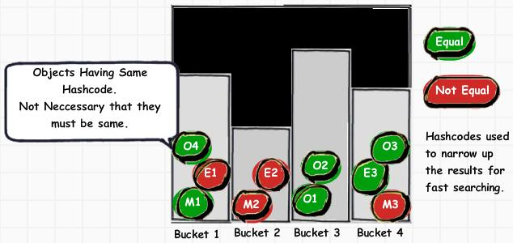

## [原文](https://www.bysocket.com/?p=263)

# Java 基础：hashCode方法


## 一、前言

　　泥瓦匠最近被项目搞的天昏地暗。
发现有些要给自己一些目标，关于技术的目标：

> 专注很重要。专注Java 基础 + H5（学习）

　　其他操作系统，算法，数据结构当成课外书博览。
有时候，就是那样你越是专注方面越多对自己打击越大学啥啥都不好。
今天带来Java基础：hashCode方法

## 二、hashCode方法

　　hash code(散列码，也可以叫哈希码值)是对象产生的一个整型值。
其生成没有规律的。
二者散列码可以获取对象中的信息，转成那个对象的“相对唯一”的整型值。
所有对象都有一个散列码，hashCode()是根类 Object 的一个方法。
[散列表的工作原理](../../algorithm/note/散列表的工作原理.md)在Java基础不展开讲，只要知道它是一种快速的“字典”即可。
下面引用老外一张图：




## 三、两个小例子

首先泥瓦匠引用一段来自 Object规范 【JavaSE6】:

```
hashCode的常规协定是：
1、在 Java 应用程序执行期间，在对同一对象多次调用 hashCode 方法时，
必须一致地返回相同的整数，前提是将对象进行 equals 比较时所用的信息没有被修改。
从某一应用程序的一次执行到同一应用程序的另一次执行，该整数无需保持一致。

2、如果根据 equals(Object) 方法，两个对象是相等的，
那么对这两个对象中的每个对象调用 hashCode 方法都必须生成相同的整数结果。

3、如果根据equals方法，两个对象不相等，
那么对这两个对象中的任一对象上调用 hashCode 方法不 要求一定生成不同的整数结果。
但是，程序员应该意识到，为不相等的对象生成不同整数结果可以提高哈希表的性能。
```

由于hashCode定义在根类Object，所以每个对象都是Object，
都具有一个默认的散列值，即是对象的存储地址。泥瓦匠请大家看一下这个例子：
?

```java
public class HashCodeTest
{
    public static void main(String[] args)
    {
        String s = "hashCode";
        StringBuilder sb = new StringBuilder(s);
        System.out.println("hashCode1: " + s.hashCode() + " " + sb.hashCode());
         
        String s1 = new String("hashCode");
        StringBuilder sb1 = new StringBuilder(s1);
        System.out.println("hashCode2: " + s1.hashCode() + " " + sb1.hashCode());
         
        // are they equals?
        System.out.println("s  s1 : " + s.equals(s1));
        System.out.println("sb sb1: " + sb.equals(sb1));
    }
}
``` 
run 一下，可以在控制台看到：
```java
hashCode1: 147696667 1385112968
hashCode2: 147696667 870919696
s  s1 : true
sb sb1: false
```  
-  泥瓦匠小结：

1、s 与 s1相等，且hashCode一样。验证了【hashCode的常规协定】的第二条。
原因是字符串的散列码由内容导出的。（这个第二个例子我们会验证）

2、StringBuilder 里面没有定义hashCode方法，所以导出的是Object默认的对对象存储的地址。
（注意到Object的hashCode方法前面有个native的修饰符，
这表示hashCode方法是由非java语言实现的，具体的方法实现在外部，
返回内存对象的地址。）详情请看认识&理解关键字 native 实战篇。


泥瓦匠刚刚提到字符串散列码是由内容导出的。下面看看String的hashCode的实现。
```java
 /** The value is used for character storage */
private char value[];
 
private int hash;// Default to 0
 
/**
 * Returns a hash code for this string. The hash code for a
 * String object is computed as
 * s[0]*31^(n-1) + s[1]*31^(n-2) + ... + s[n-1]
 */
public int hashCode()
{
    int h = hash;
    if (h == 0 && value.length > 0)
    {
        char val[] = value;
         
        for (int i = 0; i < value.length; i++)
        {
            h = 31 * h + val[i];
        }
        hash = h;
    }
    return h;
}
```
  
- 泥瓦匠小结：

1、s[0]*31^(n-1) + s[1]*31^(n-2) + ... + s[n-1]  数学公式代表什么？

s[i]是string的第i个字符，n是String的长度。31为啥呢？下面引用《Effective Java》的原话：

> 之所以选择31，是因为它是个奇素数，如果乘数是偶数，并且乘法溢出的话，信息就会丢失，
因为与2相乘等价于移位运算。使用素数的好处并不是很明显，
但是习惯上都使用素数来计算散列结果。
31有个很好的特性，就是用移位和减法来代替乘法，
可以得到更好的性能：31*i==(i<<5)-i。现在的VM可以自动完成这种优化。

## 四、结论和忠告

确实hashCode有点晦涩，有可能是因为那个数学散列函数。下面是《Effective Java》中的结论点：

> 1、如果对象有相同的散列码，被映射到同一个散列桶，这样散列表退化称为 链表 ，这样性能降低。 
>
> 2、相等的对象必须具有相等的散列码 
>
> 3、为不相等的对象产生不相等的散列码 
>
> 4、不要试图从散列码计算中排除掉一个对象关键部分来提高性能