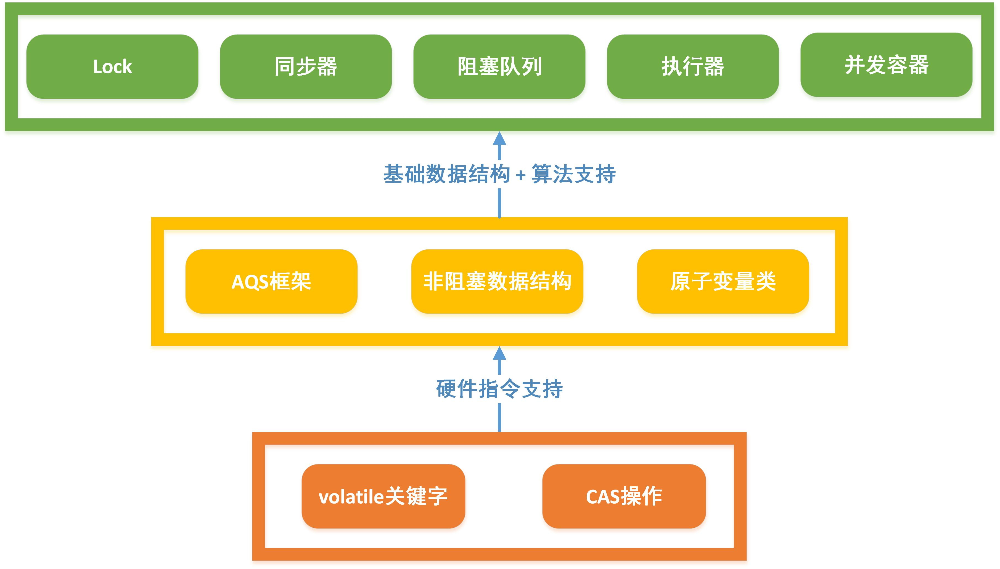
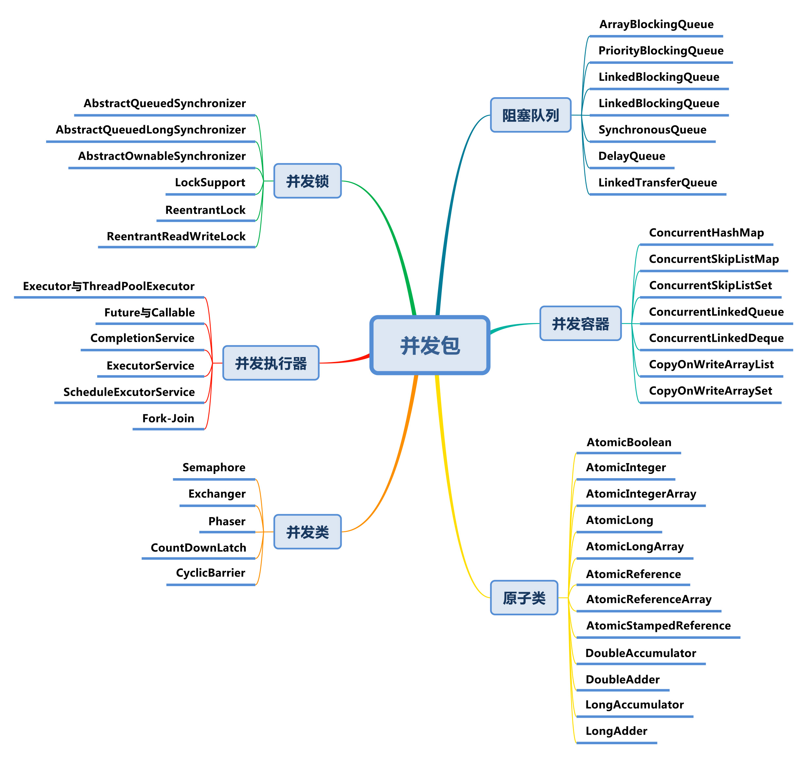

## [原文](https://www.zybuluo.com/kiraSally/note/862389)

# 3. Concurrent并发包

## 3.1 Concurrent并发包

## 3.2 Concurrent包整体类图

##  3.3 Concurrent包实现机制

> - 综述： 在整个并发包设计上，Doug Lea大师采用了3.1 Concurrent包整体架构的三层结构
> - 补充： 并发包所涉及的内容笔者会陆续推出对应番进行阐述，敬请期待（进度视笔者的忙碌程度而定）

### 3.3.1 底层-硬件指令支持

> - 综述： 并发包最底层是依赖于硬件级别的Volatile和CAS的支持
> - Volatile：借用Volatile的内存读写语义和阻止重排序保证数据可见性
> - CAS： 借用CAS的高效机器级别原子指令保证内存执行的 读-改-写 操作的原子性
> - 组合： 借用Volatile变量的读/写和CAS实现线程之间的有效通信，保证了原子性、可见性、有序性

### 3.3.2 中间层-基础数据结构+算法支持

> - 综述： 在数据结构和算法的设计使用上，Doug Lea大师专门设计了AQS框架作为所有并发类库的并发基础，同时引入非阻塞算法和原子变量类增强了并发特性
> - AQS框架： AQS中提供了最基本、有效的并发API， Doug Lea大师期望其作为所有并发操作的基础解决方案，
并发包中的绝大部分实现都是依赖于AQS（AbstractQueuedSynchronizer），
同时AQS的基础是CAS和Volatile的底层支持
> - 非阻塞数据结构: 非阻塞数据结构是非阻塞队列的设计基础，同时也是阻塞队列的参考对比的重要依据
> - 原子变量类： Doug Lea大师专门为所有的原子变量设计了专门的类库，
甚至在后期还对齐做了增强，比如LongAdder、LongAccumulator等，
从侧面可以反映出数值操作对于编程的重要性

### 3.3.3 高层-并发类库支持

> - 综述： Doug Lea大师在并发包中已经提供了丰富的并发类库极大方便了快速、安全的使用并发操作
> - Lock： Lock接口定义了一系列并发操作标准，详情参见 [并发番@Lock接口一文通（1.8版）](https://www.zybuluo.com/kiraSally/note/868759)
> - 同步器： 每个并发类的同步器的实现依赖于AQS(继承)，比如ReentrantLock中的Sync；同时笔者也将 并发类 同属于同步器的范围内
> - 阻塞队列: 顾名思义，支持阻塞的队列，主要是以Queue结尾的类
> - 执行器： 所谓执行器，指的是任务的执行者，比如线程池和Fork-Join
> - 并发容器： 即支持并发的容器，主要包含COW和以Concurrent开头的类，通常并发容器是非阻塞的
