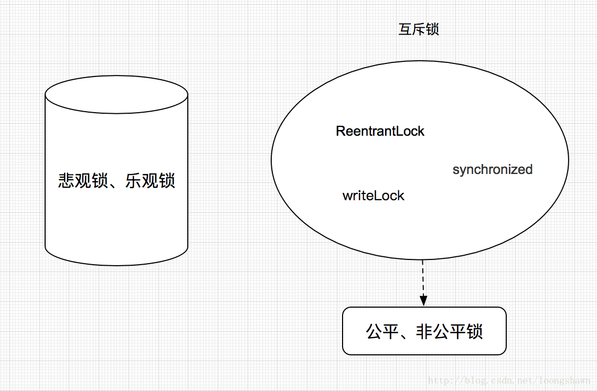

# java中常见的锁

## Java中常见的锁，互斥锁，读写锁，信号量

### java 中常见的锁



#### 1、自旋锁

自旋锁是采用让当前线程不停地的在循环体内执行实现的，当循环的条件被其他线程改变时 才能进入临界区。如下

```
public class SpinLock {
  private AtomicReference<Thread> sign =new AtomicReference<>();
  public void lock(){
    Thread current = Thread.currentThread();
    while(!sign .compareAndSet(null, current)){
    }
  }
  public void unlock (){
    Thread current = Thread.currentThread();
    sign .compareAndSet(current, null);
  }
}
```
使用了CAS原子操作，lock函数将owner设置为当前线程，并且预测原来的值为空。unlock函数将owner设置为null，并且预测值为当前线程。

当有第二个线程调用lock操作时由于owner值不为空，导致循环一直被执行，直至第一个线程调用unlock函数将owner设置为null，
第二个线程才能进入临界区。

由于自旋锁只是将当前线程不停地执行循环体，不进行线程状态的改变，所以响应速度更快。但当线程数不停增加时，
性能下降明显，因为每个线程都需要执行，占用CPU时间。如果线程竞争不激烈，并且保持锁的时间段。适合使用自旋锁。

注：该例子为非公平锁，获得锁的先后顺序，不会按照进入lock的先后顺序进行。

--- 

自旋锁可以使线程在没有取得锁的时候，不被挂起，而转去执行一个空循环，（即所谓的自旋，就是自己执行空循环），
若在若干个空循环后，线程如果可以获得锁，则继续执行。若线程依然不能获得锁，才会被挂起。

使用自旋锁后，线程被挂起的几率相对减少，线程执行的连贯性相对加强。因此，对于那些锁竞争不是很激烈，
锁占用时间很短的并发线程，具有一定的积极意义，但对于锁竞争激烈，单线程锁占用很长时间的并发程序，
自旋锁在自旋等待后，往往毅然无法获得对应的锁，不仅仅白白浪费了CPU时间，最终还是免不了被挂起的操作 ，反而浪费了系统的资源。

在JDK1.6中，Java虚拟机提供-XX:+UseSpinning参数来开启自旋锁，使用-XX:PreBlockSpin参数来设置自旋锁等待的次数。

在JDK1.7开始，自旋锁的参数被取消，虚拟机不再支持由用户配置自旋锁，自旋锁总是会执行，自旋锁次数也由虚拟机自动调整。


#### 2、自旋锁的其他种类

在自旋锁中 另有三种常见的锁形式:TicketLock ，CLHLock 和MCSLock

Ticket锁主要解决的是访问顺序的问题，主要的问题是在多核cpu上

CLHLock 和MCSLock 则是两种类型相似的公平锁，采用链表的形式进行排序，

CLHLock是不停的查询前驱变量， 导致不适合在NUMA 架构下使用（在这种结构下，每个线程分布在不同的物理内存区域）

MCSLock则是对本地变量的节点进行循环。不存在CLHLock 的问题。

CLH 要比 MCS 更简单，

CLH 的队列是隐式的队列，没有真实的后继结点属性。

MCS 的队列是显式的队列，有真实的后继结点属性。

JUC ReentrantLock 默认内部使用的锁 即是 CLH锁（有很多改进的地方，将自旋锁换成了阻塞锁等等）。


#### 3、阻塞锁

阻塞锁，与自旋锁不同，改变了线程的运行状态。
在JAVA环境中，线程Thread有如下几个状态：

1，新建状态

2，就绪状态

3，运行状态

4，阻塞状态

5，死亡状态

阻塞锁，可以说是让线程进入阻塞状态进行等待，当获得相应的信号（唤醒，时间） 时，
才可以进入线程的准备就绪状态，准备就绪状态的所有线程，通过竞争，进入运行状态。
JAVA中，能够进入\退出、阻塞状态或包含阻塞锁的方法有 ，synchronized 关键字（其中的重量锁），
ReentrantLock，Object.wait()\notify(),LockSupport.park()/unpart()(j.u.c经常使用)

阻塞锁的优势在于，阻塞的线程不会占用cpu时间， 不会导致 CPu占用率过高，但进入时间以及恢复时间都要比自旋锁略慢。

在竞争激烈的情况下 阻塞锁的性能要明显高于 自旋锁。

理想的情况则是; 在线程竞争不激烈的情况下，使用自旋锁，竞争激烈的情况下使用，阻塞锁。


#### 4、可重入锁

本文里面讲的是广义上的可重入锁，而不是单指JAVA下的ReentrantLock。

可重入锁，也叫做递归锁，指的是同一线程 外层函数获得锁之后 ，内层递归函数仍然有获取该锁的代码，但不受影响。
在JAVA环境下 ReentrantLock 和synchronized 都是 可重入锁

可重入锁最大的作用是避免死锁


#### 5、读写锁

linux内核的rwlock是读写锁的最简单的参考实现。它用一个整数counter代表一个rwlock。
0代表没有人占有锁，-1代表有一个线程持有着写锁， 正整数n代表有n个线程持有读锁。要拿读锁时，如果counter小于0， 
则继续循环测试，直到counter非负。然后给counter加1，拿锁成功。(当然，得保证“在counter非负的情况下加1”这个操作的原子性，
一般通过spinlock或者bit spinlock实现)。可见，如果已经有一个线程拿着读锁还未释放，另一个线程获取读锁会立即成功。

这个实现很简单，但是存在公平性的问题：写者可能会被饿死。 如果有很多线程相续拿到读锁然后释放读锁，
保持counter的值始终大于0，那写者就一直拿不到写锁。 

一个办法是在rwlock元数据中增加一个标记，代表是否有写者在等待读者。读者要拿读锁时，
先要等待这个标记的清除。笔者曾经在嵌入式环境中，使用和修改过这样的读写锁。更加先进的方法，
是让等待者排一个FIFO队列，比较著名的是MCS lock和CLH lock。

Java的ReentrantReadWriteLock，就是基于CLH算法。
正是由于这个排队算法，由于Thread2在Thread3之前，因此Thread2必须等Thread3拿到锁，做完事情，并且释放，才能获得读锁

--- 

读写锁的主要特性：

公平性：支持公平性和非公平性。
重入性：支持重入。读写锁最多支持65535个递归写入锁和65535个递归读取锁。
锁降级：遵循获取写锁、获取读锁在释放写锁的次序，写锁能够降级成为读锁
读写锁ReentrantReadWriteLock实现接口ReadWriteLock，该接口维护了一对相关的锁，一个用于只读操作，
另一个用于写入操作。只要没有 writer，读取锁可以由多个 reader 线程同时保持。写入锁是独占的。

---- 

ReentrantLock虽然具有完全互斥排他的效果（即同一时间只有一个线程正在执行lock后面的任务），
但是效率非常低。所以在JDK中提供了一种读写锁ReentrantReadWriteLock，使用它可以加快运行效率。

读写锁表示两个锁，一个是读操作相关的锁，称为共享锁；另一个是写操作相关的锁，称为排他锁。我把这两个操作理解为三句话：

1、读和读之间不互斥，因为读操作不会有线程安全问题

2、写和写之间互斥，避免一个写操作影响另外一个写操作，引发线程安全问题

3、读和写之间互斥，避免读操作的时候写操作修改了内容，引发线程安全问题

总结起来就是，多个Thread可以同时进行读取操作，但是同一时刻只允许一个Thread进行写入操作。


 
#### 6、互斥锁

ReentrantLock是一个可重入的互斥锁，又被称为“独占锁”。
也就是说ReentrantLock在同一个时间点只能被一个线程获取。

Java的synchronized块并不保证尝试进入它们的线程的顺序。因此，如果多个线程不断竞争访问相同的synchronized同步块，
就存在一种风险，其中一个或多个线程永远也得不到访问权 —— 也就是说访问权总是分配给了其它线程。这种情况被称作线程饥饿。
为了避免这种问题，锁需要实现公平性。

ReentrantLock分为“公平锁”和“非公平锁”。它们的区别体现在获取锁的机制上是否公平。
ReentrantLock是通过一个FIFO的等待队列来管理获取该锁所有线程的。

在“公平锁”的机制下，线程依次排队获取锁；
“非公平锁”在锁是可获取状态时，不管自己是不是在队列的开头都会获取锁。


-互斥锁 和 读写锁 

互斥锁：指的是一次最多只能有一个线程持有的锁。在jdk1.5之前, 我们通常使用synchronized机制控制多个线程对共享资源的访问。 
而现在, Lock提供了比synchronized机制更广泛的锁定操作, Lock和synchronized机制的主要区别: 
synchronized机制提供了对与每个对象相关的隐式监视器锁的访问，并强制所有锁获取和释放均要出现在一个块结构中，
当获取了多个锁时, 它们必须以相反的顺序释放。synchronized机制对锁的释放是隐式的，
只要线程运行的代码超出了synchronized语句块范围，锁就会被释放。
而Lock机制必须显式的调用Lock对象的unlock()方法才能释放锁，这为获取锁和释放锁不出现在同一个块结构中，
以及以更自由的顺序释放锁提供了可能。

读写锁：ReadWriteLock接口及其实现类ReentrantReadWriteLock，默认情况下也是非公平锁。

ReentrantReadWriteLock中定义了2个内部类，ReentrantReadWriteLock.ReadLock和ReentrantReadWriteLock.WriteLock，
分别用来代表读取锁和写入锁，ReentrantReadWriteLock对象提供了readLock()和writeLock()方法，用于获取读取锁和写入锁。

java.util.concurrent.locks.ReadWriteLock接口允许一次读取多个线程，但一次只能写入一个线程：

读锁 - 如果没有线程锁定ReadWriteLock进行写入，则多线程可以访问读锁。

写锁 - 如果没有线程正在读或写，那么一个线程可以访问写锁。

其中：

读取锁允许多个reader线程同时持有，而写入锁最多只能有一个writer线程持有。
读写锁的使用场合是：读取数据的频率远大于修改共享数据的频率。在上述场合下使用读写锁控制共享资源的访问，可以提高并发性能。
如果一个线程已经持有了写入锁，则可以再持有读锁。相反，如果一个线程已经持有了读取锁，则在释放该读取锁之前，不能再持有写入锁。
可以调用写入锁的newCondition()方法获取与该写入锁绑定的Condition对象，此时与普通的互斥锁并没有什么区别，但是调用读取锁的newCondition()方法将抛出异常。


#### 7、悲观锁 8、乐观锁

悲观锁、乐观锁使用场景是针对数据库操作来说的，是一种锁机制。

悲观锁(Pessimistic Lock)：顾名思义，就是很悲观，每次去拿数据的时候都认为别人会修改，所以每次在拿数据的时候都会上锁，
这样别人想拿这个数据就会block直到它拿到锁。传统的关系型数据库里边就用到了很多这种锁机制，
比如行锁，表锁等，读锁，写锁等，都是在做操作之前先上锁。

乐观锁(Optimistic Lock)：顾名思义，就是很乐观，每次去拿数据的时候都认为别人不会修改，所以不会上锁，
但是在更新的时候会判断一下在此期间别人有没有去更新这个数据，可以使用版本号等机制，即对数据做版本控制。
乐观锁适用于多读的应用类型，这样可以提高吞吐量，像数据库如果提供类似于write_condition机制的其实都是提供的乐观锁


#### 9、公平锁  10、非公平锁

公平锁(Fair)：加锁前检查是否有排队等待的线程，优先排队等待的线程，先来先得。

非公平锁(NonFair)：加锁时不考虑排队等待问题，直接尝试获取锁，获取不到自动到队尾等待。

ReentrantLock锁内部提供了公平锁与分公平锁内部类之分，默认是非公平锁，如：

```
public ReentrantLock() {
    sync = new NonfairSync();
}
public ReentrantLock(boolean fair) {
    sync = fair ? new FairSync() : new NonfairSync();
}
```    

#### 11、偏向锁

偏向锁是JDK1.6提出来的一种锁优化的机制。其核心的思想是，如果程序没有竞争，则取消之前已经取得锁的线程同步操作。
也就是说，若某一锁被线程获取后，便进入偏向模式，当线程再次请求这个锁时，就无需再进行相关的同步操作了，
从而节约了操作时间，如果在此之间有其他的线程进行了锁请求，则锁退出偏向模式。在JVM中使用-XX:+UseBiasedLocking


大多数情况下锁不仅不存在多线程竞争，而且总是由同一线程多次获得。偏向锁的目的是在某个线程获得锁之后，
消除这个线程锁重入（CAS）的开销，看起来让这个线程得到了偏护。
另外，JVM对那种会有多线程加锁，但不存在锁竞争的情况也做了优化，听起来比较拗口，但在现实应用中确实是可能出现这种情况，
因为线程之前除了互斥之外也可能发生同步关系，被同步的两个线程（一前一后）对共享对象锁的竞争很可能是没有冲突的。
对这种情况，JVM用一个epoch表示一个偏向锁的时间戳（真实地生成一个时间戳代价还是蛮大的，因此这里应当理解为一种类似时间戳的identifier）


#### 12、对象锁


1. 类锁：在代码中的方法上加了static和synchronized的锁，或者synchronized(xxx.class）的代码段，如下文中的increament()；

2.对象锁：在代码中的方法上加了synchronized的锁，或者synchronized(this）的代码段，如下文中的synOnMethod()和synInMethod()；

3.私有锁：在类内部声明一个私有属性如private Object lock，在需要加锁的代码段synchronized(lock），如下文中的synMethodWithObj()。


synchronized直接加在方法上和synchronized(this)都是对当前对象加锁，二者的加锁方法够成了竞争关系，同一时刻只能有一个方法能执行。


上面的几个实验都是为了引出两个概念，类锁/对象锁。
对象锁：JVM 在创建对象的时候，默认会给每个对象一把唯一的对象锁，一把钥匙
类锁：每一个类都是一个对象，每个对象都拥有一个对象锁。

总结：
1.对象锁钥匙只能有一把才能互斥，才能保证共享变量的唯一性
2.在静态方法上的锁，和实例方法上的锁，默认不是同样的，如果同步需要制定两把锁一样。
3.关于同一个类的方法上的锁，来自于调用该方法的对象，如果调用该方法的对象是相同的，那么锁必然相同，否则就不相同。比如 new A().x() 和 new A().x(),对象不同，锁不同，如果A的单利的，就能互斥。
4.静态方法加锁，能和所有其他静态方法加锁的进行互斥
5.静态方法加锁，和xxx.class 锁效果一样，直接属于类的

延伸一下：既然有了synchronized修饰方法的同步方式，为什么还需要synchronized修饰同步代码块的方式呢？
当某个线程进入同步方法获得对象锁，那么其他线程访问这里对象的同步方法时，必须等待或者阻塞，这对高并发的系统是致命的。
如果某个线程在同步方法里面发生了死循环，那么它就永远不会释放这个对象锁，那么其他线程就要永远的等待。当然同步方法和同步代码块都会有这样的缺陷，只要用了synchronized关键字就会有这样的风险和缺陷。既然避免不了这种缺陷，那么就应该将风险降到最低。这也是同步代码块在某种情况下要优于同步方法的方面。

 
<http://ifeve.com/java-locks/>

#### 13、线程锁

#### 14、锁粗化

大部分情况下我们是要让锁的粒度最小化，锁的粗化则是要增大锁的粒度; 
在以下场景下需要粗化锁的粒度： 
假如有一个循环，循环内的操作需要加锁，我们应该把锁放到循环外面，否则每次进出循环，都进出一次临界区，效率是非常差的


<https://blog.csdn.net/zqz_zqz/article/details/70233767>

#### 15、轻量级锁 、重量级锁

- 重量级锁

Synchronized是通过对象内部的一个叫做监视器锁（monitor）来实现的。
但是监视器锁本质又是依赖于底层的操作系统的Mutex Lock来实现的。
而操作系统实现线程之间的切换这就需要从用户态转换到核心态，这个成本非常高，
状态之间的转换需要相对比较长的时间，这就是为什么Synchronized效率低的原因。
因此，这种依赖于操作系统Mutex Lock所实现的锁我们称之为“重量级锁”。
JDK中对Synchronized做的种种优化，其核心都是为了减少这种重量级锁的使用。
JDK1.6以后，为了减少获得锁和释放锁所带来的性能消耗，提高性能，引入了“轻量级锁”和“偏向锁”。


重量锁在JVM中又叫对象监视器（Monitor），它很像C中的Mutex，除了具备Mutex(0|1)互斥的功能，它还负责实现了Semaphore(信号量)的功能，
也就是说它至少包含一个竞争锁的队列，和一个信号阻塞队列（wait队列），前者负责做互斥，后一个用于做线程同步

- 轻量级锁

加锁

线程在执行同步块之前，JVM会先在当前线程的栈桢中创建用于存储锁记录的空间，并将对象头中的Mark Word复制到锁记录中，
官方称为Displaced Mark Word。然后线程尝试使用CAS将对象头中的Mark Word替换为指向锁记录的指针。
如果成功，当前线程获得锁，如果失败，则自旋获取锁，当自旋获取锁仍然失败时，
表示存在其他线程竞争锁(两条或两条以上的线程竞争同一个锁)，则轻量级锁会膨胀成重量级锁。

解锁

轻量级解锁时，会使用原子的CAS操作来将Displaced Mark Word替换回到对象头，如果成功，
则表示同步过程已完成。如果失败，表示有其他线程尝试过获取该锁，则要在释放锁的同时唤醒被挂起的线程。


#### 16、锁消除

锁消除是Java虚拟机在JIT编译是，通过对运行上下文的扫描，去除不可能存在共享资源竞争的锁，通过锁消除，可以节省毫无意义的请求锁时间。

<https://blog.csdn.net/winwill2012/article/details/46376679>

#### 17、锁膨胀

如果一系列的连续操作都对同一个对象反复加锁和解锁，甚至加锁操作是出现在循环体中的，那即使没有线程竞争，
频繁地进行互斥同步操作也会导致不必要的性能损耗。 如果虚拟机探测到有这样一串零碎的操作都对同一个对象加锁，
将会把加锁同步的范围扩展（膨胀）到整个操作序列的外部（由多次加锁编程只加锁一次）。


<https://yq.aliyun.com/articles/49051#3>


#### 18、信号量


Semaphore（信号量） 是一个线程同步结构，用于在线程间传递信号，以避免出现信号丢失（译者注：下文会具体介绍），
或者像锁一样用于保护一个关键区域。自从5.0开始，jdk在java.util.concurrent包里提供了Semaphore 的官方实现，
因此大家不需要自己去实现Semaphore。但是还是很有必要去熟悉如何使用Semaphore及其背后的原理

本文的涉及的主题如下：

简单的Semaphore实现
使用Semaphore来发出信号
可计数的Semaphore
有上限的Semaphore
把Semaphore当锁来使用


<http://ifeve.com/semaphore/>

--- 


公平锁(Fair)：加锁前检查是否有排队等待的线程，优先排队等待的线程，先来先得。

非公平锁(NonFair)：加锁时不考虑排队等待问题，直接尝试获取锁，获取不到自动到队尾等待。

ReentrantLock锁内部提供了公平锁与分公平锁内部类之分，默认是非公平锁，如：


锁的优缺点对比

锁	| 优点 | 缺点	 | 适用场景 
---|---|---|---
偏向锁	| 加锁和解锁不需要额外的消耗，和执行非同步方法比仅存在纳秒级的差距  |	如果线程间存在锁竞争，会带来额外的锁撤销的消耗	| 适用于只有一个线程访问同步块场景 
轻量级锁	| 竞争的线程不会阻塞，提高了程序的响应速度	| 如果始终得不到锁竞争的线程使用自旋会消耗CPU |	追求响应时间,锁占用时间很短 
重量级锁	| 线程竞争不使用自旋，不会消耗CPU	| 线程阻塞，响应时间缓慢	| 追求吞吐量,锁占用时间较长 


<http://ifeve.com/java_lock_see1/>

<https://blog.csdn.net/mazhimazh/article/details/19161593>


--- 
