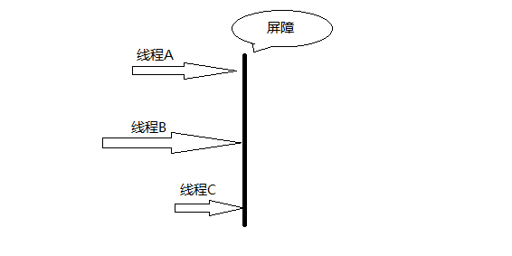

# CyclicBarrier简介及其原理
 

## CyclicBarrier是什么？

CyclicBarrier也叫同步屏障，在JDK1.5被引入，可以让一组线程达到一个屏障时被阻塞，
直到最后一个线程达到屏障时，所以被阻塞的线程才能继续执行。
CyclicBarrier好比一扇门，默认情况下关闭状态，堵住了线程执行的道路，
直到所有线程都就位，门才打开，让所有线程一起通过。


简介： CyclicBarrier是一个同步辅助类，允许一组线程互相等待，直到到达某个公共屏障点 (common barrier point)。
因为该 barrier 在释放等待线程后可以重用，所以称它为循环 的 barrier。



### 应用场景
1. 想象一个场景，运动会男子100米决赛，8名选手。
每个运动员都就位后才开始。

2. 想实现所有的线程一起等待某个事件的发生，当某个事件发生时，所有线程一起开始往下执行。

## CyclicBarrier 原理

CyclicBarrier是通过ReentrantLock(独占锁)和Condition来实现的

- 构造函数

CyclicBarrier的构造函数共2个：CyclicBarrier 和 CyclicBarrier(int parties, Runnable barrierAction)。
第1个构造函数是调用第2个构造函数来实现的，下面第2个构造函数的源码。

```
public CyclicBarrier(int parties, Runnable barrierAction) {
    if (parties <= 0) throw new IllegalArgumentException();
    // parties表示“必须同时到达barrier的线程个数”。
    this.parties = parties;
    // count表示“处在等待状态的线程个数”。
    this.count = parties;
    // barrierCommand表示“parties个线程到达barrier时，会执行的动作”。
    this.barrierCommand = barrierAction;
}
```
- 等待函数

CyclicBarrier.java中await()方法如下：

```
public int await() throws InterruptedException, BrokenBarrierException {
    try {
        return dowait(false, 0L);
    } catch (TimeoutException toe) {
        throw new Error(toe); // cannot happen;
    }
}

```
说明：await()是通过dowait()实现的。

```
private int dowait(boolean timed, long nanos)
    throws InterruptedException, BrokenBarrierException,
           TimeoutException {
    final ReentrantLock lock = this.lock;
    // 获取“独占锁(lock)”
    lock.lock();
    try {
        // 保存“当前的generation”
        final Generation g = generation;

        // 若“当前generation已损坏”，则抛出异常。
        if (g.broken)
            throw new BrokenBarrierException();

        // 如果当前线程被中断，则通过breakBarrier()终止CyclicBarrier，唤醒CyclicBarrier中所有等待线程。
        if (Thread.interrupted()) {
            breakBarrier();
            throw new InterruptedException();
        }

       // 将“count计数器”-1
       int index = --count;
       // 如果index=0，则意味着“有parties个线程到达barrier”。
       if (index == 0) {  // tripped
           boolean ranAction = false;
           try {
               // 如果barrierCommand不为null，则执行该动作。
               final Runnable command = barrierCommand;
               if (command != null)
                   command.run();
               ranAction = true;
               // 唤醒所有等待线程，并更新generation。
               nextGeneration();
               return 0;
           } finally {
               if (!ranAction)
                   breakBarrier();
           }
       }

        // 当前线程一直阻塞，直到“有parties个线程到达barrier” 或 “当前线程被中断” 或 “超时”这3者之一发生，
        // 当前线程才继续执行。
        for (;;) {
            try {
                // 如果不是“超时等待”，则调用awati()进行等待；否则，调用awaitNanos()进行等待。
                if (!timed)
                    trip.await();
                else if (nanos > 0L)
                    nanos = trip.awaitNanos(nanos);
            } catch (InterruptedException ie) {
                // 如果等待过程中，线程被中断，则执行下面的函数。
                if (g == generation && ! g.broken) {
                    breakBarrier();
                    throw ie;
                } else {
                    Thread.currentThread().interrupt();
                }
            }

            // 如果“当前generation已经损坏”，则抛出异常。
            if (g.broken)
                throw new BrokenBarrierException();

            // 如果“generation已经换代”，则返回index。
            if (g != generation)
                return index;

            // 如果是“超时等待”，并且时间已到，则通过breakBarrier()终止CyclicBarrier，
            // 唤醒CyclicBarrier中所有等待线程。
            if (timed && nanos <= 0L) {
                breakBarrier();
                throw new TimeoutException();
            }
        }
    } finally {
        // 释放“独占锁(lock)”
        lock.unlock();
    }
}
```
dowait()的作用就是让当前线程阻塞，直到“有parties个线程到达barrier” 或 “当前线程被中断” 
或 “超时”这3者之一发生，当前线程才继续执行。 

1. 每当线程执行await，内部变量count减1，如果count！= 0，说明有线程还未到屏障处，则在锁条件变量trip上等待。
2. 当count == 0时，说明所有线程都已经到屏障处，执行条件变量的signalAll方法唤醒等待的线程。
其中 nextGeneration方法可以实现屏障的循环使用：

- 重新生成Generation对象
- 恢复count值

 
(01) generation是CyclicBarrier的一个成员遍历，它的定义如下：
```
public class CyclicBarrier {

  //  在CyclicBarrier中，同一批的线程属于同一代，即同一个Generation；
  //  CyclicBarrier中通过generation对象，记录属于哪一代。
  //  当有parties个线程到达barrier，generation就会被更新换代。
  
    private static class Generation {
        boolean broken = false;
    }
    /** The lock for guarding barrier entry */
    private final ReentrantLock lock = new ReentrantLock();
    /** Condition to wait on until tripped */
    private final Condition trip = lock.newCondition();
    /** The number of parties */
    private final int parties;
    /* The command to run when tripped */
    private final Runnable barrierCommand;
    /** The current generation */
    private Generation generation = new Generation();
    ...省略后面代码
}
```
其中Generation用来控制屏障的循环使用，如果generation.broken为true的话，
说明这个屏障已经损坏，当某个线程await的时候，直接抛出异常


(02) 如果当前线程被中断，即Thread.interrupted()为true；
则通过breakBarrier()终止CyclicBarrier。breakBarrier()的源码如下：
``` 
private void breakBarrier() {
    generation.broken = true;
    count = parties;
    trip.signalAll();
}
```
breakBarrier()会设置当前中断标记broken为true，意味着“将该Generation中断”；
同时，设置count=parties，即重新初始化count；最后，通过signalAll()唤醒CyclicBarrier上所有的等待线程。

(03) 将“count计数器”-1，即 --count；然后判断是不是“有parties个线程到达barrier”，即index是不是为0。
当index=0时，如果barrierCommand不为null，则执行该barrierCommand，
barrierCommand就是我们创建CyclicBarrier时，传入的Runnable对象。
然后，调用nextGeneration()进行换代工作，nextGeneration()的源码如下

``` 
/**
 * Updates state on barrier trip and wakes up everyone.
 * Called only while holding lock.
 */
private void nextGeneration() {
    // signal completion of last generation
    trip.signalAll();
    // set up next generation
    count = parties;
    generation = new Generation();
}
``` 

首先，它会调用signalAll()唤醒CyclicBarrier上所有的等待线程；接着，重新初始化count；最后，更新generation的值。

(04) 在for(;;)循环中。timed是用来表示当前是不是“超时等待”线程。

如果不是，则通过trip.await()进行等待；否则，调用awaitNanos()进行超时等待。

 
注意比较CountDownLatch和CyclicBarrier：

(01) CountDownLatch的作用是允许1或N个线程等待其他线程完成执行；而CyclicBarrier则是允许N个线程相互等待。\

(02) CountDownLatch的计数器无法被重置；CyclicBarrier的计数器可以被重置后使用，因此它被称为是循环的barrier。
