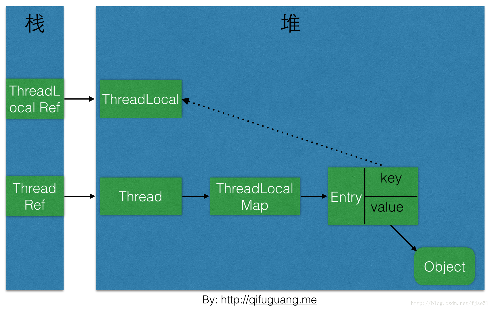

# ThreadLocal的作用与实现

spring默认bean的注册形式是单例模式。那spring是如何解决并发安全问题的呢？就是通过ThreadLocal。
到底ThreadLocal有和“魔力”能让普通类变成线程安全的类呢？

这个类提供线程局部变量。这种在多线程环境下访问（通过get或set方法）时，
能保证各个线程里的变量相对独立于其他线程内的变量。
ThreadLocal实例通常是private static类型的，用于管理线程上下文。


也就是说，ThreadLocal提供了作用范围为线程的局部变量，这种变量只在线程生命周期内起作用。

减少了线程内多个方法之间公共变量传递的复杂度。
 
 这里关于线程安全的类有一个普遍适用的原则：如果一个类没有实例私有属性，或者实例私有属性也是无状态的类，
 那么这个类就是无状态的类。而一个无状态的类肯定是线程安全的类。

 而用ThreadLocal包装类的所有实例私有属性后，这个类就没有实例私有属性了，那么这个类就是一个无状态类，
 因此也是一个线程安全的类。这也是spring使用ThreadLocal处理bean的默认方式。
 
 ## ThreadLocal基本使用

 先来看看ThreadLocal几个常用方法。
 
 构造函数
 
 ```java
 /**
  * Creates a thread local variable.
  * @see #withInitial(java.util.function.Supplier)
  */
 public ThreadLocal() {
 }
 ```
 内部没有任何实现。
 ```java
 initialValue方法
 protected T initialValue() {
     return null;
 }
 ```
 initialValue()用来设置ThreadLocal的初始值。方法是protected的，建议在子类中被重载，以指定初始值。
 通常使用匿名内部类的形式。例如以下代码所示：
 
 ```java
 /**
     * ThreadLocal测试类
     *
     * @author zacard
     * @since 2016-05-23 16:36
     */
    public class ThreadLocalTest {
    
        private static final AtomicInteger nextId = new AtomicInteger(0);
    
        ThreadLocal<Integer> threadLocal = new ThreadLocal<Integer>() {
            @Override
            protected Integer initialValue() {
                return nextId.getAndIncrement();
            }
        };
    }
```    
 withInitial
 withInitial（）也是用来初始化的，但是是lamda风格的初始化方法。构造方法中也是推荐使用此方法。例如以下代码所示：
 
 ```java
 /**
 	 * ThreadLocal测试类
 	 *
 	 * @author zacard
 	 * @since 2016-05-23 16:36
 	 */
 public class ThreadLocalTest {
    	private static final AtomicInteger nextId = new AtomicInteger(0);
    	ThreadLocal<Integer> threadLocal = ThreadLocal.withInitial(nextId::getAndIncrement);
 }
 ```
 
 使用测试代码
 ```java
 /**
  * ThreadLocal测试类
  *
  * @author zacard
  * @since 2016-05-23 16:36
  */
 public class ThreadLocalTest {
     private static final AtomicInteger nextId = new AtomicInteger(0);
     private static final ThreadLocal<Integer> threadLocal = ThreadLocal.withInitial(nextId::getAndIncrement);
     public static void main(String[] args) {
         for (int i = 0; i < 3; i++) {
             new Thread(new Runnable() {
                 @Override
                 public void run() {
                     System.out.println("线程{" + Thread.currentThread().getId() + "}的初始值为:" + threadLocal.get());
                     threadLocal.set(threadLocal.get() + 100);
                     System.out.println("线程{" + Thread.currentThread().getId() + "}的累加值为:" + threadLocal.get());
                 }
             }).start();
         }
     }
 }
 
 ```
 测试结果
 ```
 线程{10}的初始值为:0
 线程{12}的初始值为:2
 线程{11}的初始值为:1
 线程{11}的累加值为:101
 线程{12}的累加值为:102
 线程{10}的累加值为:100
 
 ```
 
 由此可以看到，各个线程的ThreadLocal值是独立的。本线程对ThreadLocal中值的改动并没有影响到其他线程。
 
 
 ### ThreadLocal的实现原理
 
 先查看ThreadLocal的源码：
 
 set函数:
 
 ```java
 /**
      *设置此线程局部变量的当前线程的副本
       *到指定值。 大多数子类将不需要
       *覆盖此方法，只依靠initialValue
       *方法设置线程局部变量的值。
 **/ 
  public void set(T value) {
         Thread t = Thread.currentThread();
 
         ThreadLocalMap map = getMap(t);
 
         if (map != null)
             map.set(this, value);
         else
             createMap(t, value);
     }
```
 通过set函数可以发现，先获取当前线程，然后调用一个getMap函数，得到一个ThreadLocalMap对象，
 判断该对象是否为null，如果不为null，则直接赋值，如果为null，则调用createMap。


getMap()函数是获取当前线程的相关连的ThreadLocalMap对象
 
 ```java
 ThreadLocalMap getMap(Thread t) {
     return t.threadLocals;
 }
 ```

 Thread类里的threadLocals 变量：
 
 //与当前线程有关的ThreadLocal值，由ThreadLocal类维护。
>  ThreadLocal.ThreadLocalMap threadLocals = null


createMap 函数：

```java
//创建与ThreadLoca关联的ThreadLocalMap
void createMap(Thread t, T firstValue) {
    t.threadLocals = new ThreadLocalMap(this, firstValue);
}
```
通过上面的源码可以知道，每个Thread维护一个ThreadLocalMap映射表，
这个映射表的key是ThreadLocal实例本身，value是真正需要存储的Object


 get() 方法
 
 1.首先获取当前线程
 
 2.获取当前线程中的一个类型为ThreadLocalMap 的成员变量：threadLocals
 
 3.如果threadLocalMap不为null，这通过当前ThreadLocal的引用作为key获取对应的value e。同时如果e不为null，返回e.value
 
 4.如果threadLocalMap为null或者e为null，通过``setInitialValue``方法返回初始值。
 并且使用当前ThreadLocal的引用和value作为初始key与value创建一个新的threadLocalMap

 ```java
 public T get() {
     Thread t = Thread.currentThread();
     ThreadLocalMap map = getMap(t);
     if (map != null) {
         ThreadLocalMap.Entry e = map.getEntry(this);
         if (e != null) {
             @SuppressWarnings("unchecked")
             T result = (T)e.value;
             return result;
         }
     }
     return setInitialValue();
 }
 ```
 
 setInitialValue的源码： 方法返回初始值 
 ```java
 private T setInitialValue() {
     T value = initialValue();
     Thread t = Thread.currentThread();
     ThreadLocalMap map = getMap(t);
     if (map != null)
         map.set(this, value);
     else
         createMap(t, value);
     return value;
 }
 ```
  
 
 总体设计思路：Thread维护了一个Map，key为ThreadLocal实例本身，value为真正需要存储的Object。
 
 这样设计的好处：Map的Entry数量变小，性能提升。并且会随Thread一起销毁。
 
 ThreadLocalMap解析
 先查看源码：
 
 ```java
 /**
  * ThreadLocalMap is a customized hash map suitable only for
  * maintaining thread local values. No operations are exported
  * outside of the ThreadLocal class. The class is package private to
  * allow declaration of fields in class Thread.  To help deal with
  * very large and long-lived usages, the hash table entries use
  * WeakReferences for keys. However, since reference queues are not
  * used, stale entries are guaranteed to be removed only when
  * the table starts running out of space.
  */
 static class ThreadLocalMap {
     /**
      * The entries in this hash map extend WeakReference, using
      * its main ref field as the key (which is always a
      * ThreadLocal object).  Note that null keys (i.e. entry.get()
      * == null) mean that the key is no longer referenced, so the
      * entry can be expunged from table.  Such entries are referred to
      * as "stale entries" in the code that follows.
      */
     static class Entry extends WeakReference<ThreadLocal<?>> {
         /** The value associated with this ThreadLocal. */
         Object value;
         Entry(ThreadLocal<?> k, Object v) {
             super(k);
             value = v;
         }
     }
 }
 ```
 
 ThreadLocalMap的Entry继承了WeakReference，使用ThreadLocal对象作为key。 
 注意，null键（即entry.get（）  == null）意味着该键不再被引用，所以entry可以从表中删除。 
 这些entries在随后的代码中被称为“陈旧entry”。
      
下图是本文介绍到的一些对象之间的引用关系图，实线表示强引用，虚线表示弱引用：           
 
 
 
 
 ThreadLocalMap是ThreadLocal的一个静态内部类。类上注释也解释了其基本实现方式：
 
 ThreadLocalMap是一个自定义的hash map，只适合用来维护现场局部变量。并且是包级私有。
 hash表中的key是一个ThreadLocal的弱引用。当没有对ThreadLocal的强引用，并且发生GC时，该Entry必然会被回收。
 
 这里的弱引用也保证了不会因为线程迟迟没有结束，而ThreadLocal的强引用不存在了，
 保存在ThreadLocalMap中的Entry却还依然存在。
 
 
既然ThreadLocalMap使用ThreadLocal的弱引用作为key，如果一个ThreadLocal没有外部强引用引用他，
那么系统gc的时候，这个ThreadLocal势必会被回收，这样一来，ThreadLocalMap中就会出现key为null的Entry，
就没有办法访问这些key为null的Entry的value，如果当前线程再迟迟不结束的话，这
些key为null的Entry的value就会一直存在一条强引用链： 

> Thread Ref -> Thread -> ThreadLocalMap -> Entry -> value 

永远无法回收，造成内存泄露。 
我们来看看到底会不会出现这种情况。 
其实，在JDK的ThreadLocalMap的设计中已经考虑到这种情况，也加上了一些防护措施. 
下面是ThreadLocalMap的getEntry方法的源码：

```java
 /**
  *获取与key相关联的entry。 这个方法
  *本身只处理快速路径：直接命中现有的
  *键。 否则它将继承getEntryAfterMiss。 这是
  *旨在最大程度地提高直接命中的性能
  *通过使此方法容易内联。
  **/
private Entry getEntry(ThreadLocal<?> key) {
    int i = key.threadLocalHashCode & (table.length - 1);
    Entry e = table[i];
    if (e != null && e.get() == key)
        return e;
    else
        return getEntryAfterMiss(key, i, e);
}

```

当getEntry在其直接哈希槽中找不到键时，则要调用getEntryAfterMiss函数。
遍历entry，获取entry的key，判断当前key是否等于参数ThreadLocal，
如果相等则直接返回，如果key为null，则直接调用expungeStaleEntry，清除掉这个entry其实现如下：

```java
        / **
          * 
          * @param key是ThreadLocal
          * @param i是key在hash表中的索引，table[i]
          * @param e 哈希表中的entry，通过table[i]
          * @返回与键相关联的条目，如果没有则返回null
          * /
        private Entry getEntryAfterMiss(ThreadLocal<?> key, int i, Entry e) {
            Entry[] tab = table;
            int len = tab.length;

            while (e != null) {
                ThreadLocal<?> k = e.get();
                if (k == key)
                    return e;
                if (k == null)
                    expungeStaleEntry(i);
                else
                    i = nextIndex(i, len);
                e = tab[i];
            }
            return null;
        }
```

expungeStaleEntry函数在staleSlot和下一个空槽之间，通过rehash任何可能的冲突条目来清除失效的条目。
这也避免了在尾随null之前遇到的任何其他旧的entry。 
expungeStaleEntry函数的源码：

```java
 private int expungeStaleEntry(int staleSlot) {
            Entry[] tab = table;
            int len = tab.length;

            // 在staleSlot删除条目
            tab[staleSlot].value = null;
            tab[staleSlot] = null;
            size--;

            // rehash直到返回null
            Entry e;
            int i;
            for (i = nextIndex(staleSlot, len);
                 (e = tab[i]) != null;
                 i = nextIndex(i, len)) {
                ThreadLocal<?> k = e.get();
                if (k == null) {
                    e.value = null;
                    tab[i] = null;
                    size--;
                } else {
                    int h = k.threadLocalHashCode & (len - 1);
                    if (h != i) {
                        tab[i] = null;

                        // 与Knuth 6.4算法R不同，我们必须扫描到null，因为多个条目可能已失效。
                        while (tab[h] != null)
                            h = nextIndex(h, len);
                        tab[h] = e;
                    }
                }
            }
            return i;
        }
```
整理一下ThreadLocalMap的getEntry函数的流程： 

> 首先从ThreadLocal的直接索引位置(通过ThreadLocal.threadLocalHashCode & (len-1)运算得到)获取Entry e，
如果e不为null并且key相同则返回e；

如果e为null或者key不一致则向下一个位置查询，如果下一个位置的key和当前需要查询的key相等，则返回对应的Entry，
否则，如果key值为null，则擦除该位置的Entry，否则继续向下一个位置查询

在这个过程中遇到的key为null的Entry都会被擦除，那么Entry内的value也就没有强引用链，自然会被回收。
仔细研究代码可以发现，set操作也有类似的思想，将key为null的这些Entry都删除，防止内存泄露。 
但是光这样还是不够的，上面的设计思路依赖一个前提条件：要调用ThreadLocalMap的getEntry函数或者set函数。
这当然是不可能任何情况都成立的，所以很多情况下需要使用者手动调用ThreadLocal的remove函数，
手动删除不再需要的ThreadLocal，防止内存泄露。所以JDK建议将ThreadLocal变量定义成private static的，
这样的话ThreadLocal的生命周期就更长，由于一直存在ThreadLocal的强引用，所以ThreadLocal也就不会被回收，
也就能保证任何时候都能根据ThreadLocal的弱引用访问到Entry的value值，然后remove它，防止内存泄露


 <https://zacard.net/2016/05/23/java-threadlocal/>
 
 <https://blog.csdn.net/fjse51/article/details/54632999>
 


