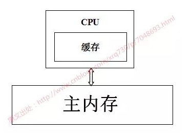
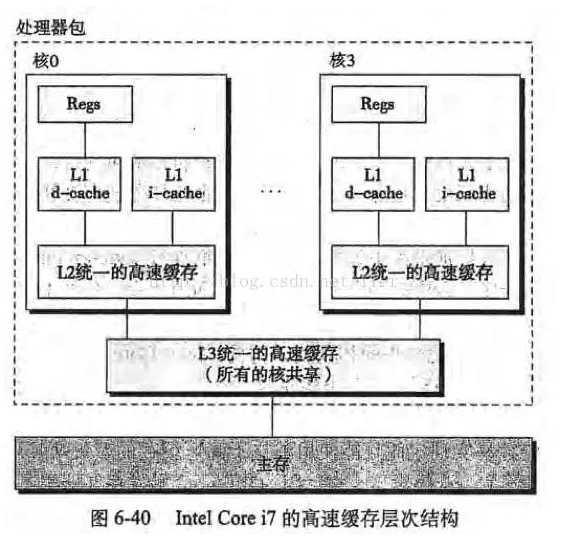
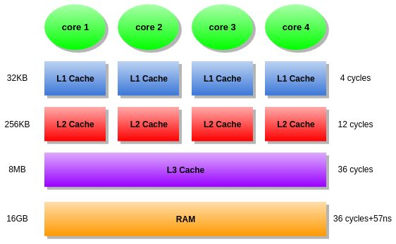

## [原文1](https://crowhawk.github.io/2018/02/10/volatile/)

## [原文2](https://www.cnblogs.com/dolphin0520/p/3920373.html)

# Volatile 原理

在Java多线程并发编程中，volatile关键词扮演着重要角色，
它是轻量级的synchronized，在多处理器开发中保证了共享变量的“可见性”。
**“可见性”的意思是当一个线程修改一个共享变量时，另外一个线程能读到这个修改的值。**
如果一个字段被声明为volatile，Java线程内存模型确保所有线程看到这个变量的值是一致的。
与synchronized不同，volatile变量不会引起线程上下文的切换和调度，
在适合的场景下拥有更低的执行成本和更高的效率。

本文将从硬件层面详细解读volatile关键字如何保证变量在多线程之间的可见性，
在此之前，有必要讲解一下CPU缓存的相关知识。


## CPU缓存

CPU缓存的出现主要是为了解决CPU运算速度与内存读写速度不匹配的矛盾，
因为CPU运算速度要比内存读写速度快得多，举个例子：
   
- 一次主内存的访问通常在几十到几百个时钟周期
- 一次L1高速缓存的读写只需要1~2个时钟周期
- 一次L2高速缓存的读写也只需要数十个时钟周期

这种访问速度的显著差异，导致CPU可能会花费很长时间等待数据到来或把数据写入内存。

基于此，现在CPU大多数情况下读写都不会直接访问内存（CPU都没有连接到内存的管脚），
取而代之的是CPU缓存，CPU缓存是位于CPU与内存之间的临时存储器，
它的容量比内存小得多但是交换速度却比内存快得多。
而缓存中的数据是内存中的一小部分数据，但这一小部分是短时间内CPU即将访问的，
当CPU调用大量数据时，就可先从缓存中读取，从而加快读取速度。

按照读取顺序与CPU结合的紧密程度，CPU缓存可分为：

- 一级缓存：简称L1 Cache，位于CPU内核的旁边，是与CPU结合最为紧密的CPU缓存。

- 二级缓存：简称L2 Cache，分内部和外部两种芯片，内部芯片二级缓存运行速度与主频相同，
外部芯片二级缓存运行速度则只有主频的一半。

- 三级缓存：简称L3 Cache，部分高端CPU才有。

每一级缓存中所存储的数据全部都是下一级缓存中的一部分，
这三种缓存的技术难度和制造成本是相对递减的，所以其容量也相对递增。

当CPU要读取一个数据时，首先从一级缓存中查找，如果没有再从二级缓存中查找，
如果还是没有再从三级缓存中或内存中查找。一般来说每级缓存的命中率大概都有80%左右，
也就是说全部数据量的80%都可以在一级缓存中找到，只剩下20%的总数据量才需要从二级缓存、
三级缓存或内存中读取。


## 使用CPU缓存带来的问题

用一张图表示一下 CPU –> CPU缓存 –> 主内存 数据读取之间的关系：




当系统运行时，CPU执行计算的过程如下：

- 1.程序以及数据被加载到主内存

- 2.指令和数据被加载到CPU缓存

- 3.CPU执行指令，把结果写到高速缓存

- 4.高速缓存中的数据写回主内存

如果服务器是单核CPU，那么这些步骤不会有任何的问题，
但是如果服务器是多核CPU，那么问题来了，
以Intel Core i7处理器的高速缓存概念模型为例（图片来自《深入理解计算机系统》）：



试想下面一种情况：

- 核0读取了一个字节，根据局部性原理，它相邻的字节同样被被读入核0的缓存

- 核3做了上面同样的工作，这样核0与核3的缓存拥有同样的数据

- 核0修改了那个字节，被修改后，那个字节被写回核0的缓存，但是该信息并没有写回主存

- 核3访问该字节，由于核0并未将数据写回主存，数据不同步

- 为了解决这一问题，CPU制造商规定了一个缓存一致性协议。


## 缓存一致性协议

> 所以就出现了缓存一致性协议。最出名的就是Intel 的MESI协议，

每个CPU都有一级缓存，但是，我们却无法保证每个CPU的一级缓存数据都是一样的。 
所以同一个程序，CPU进行切换的时候，切换前和切换后的数据可能会有不一致的情况。
那么这个就是一个很大的问题了。 
如何保证各个CPU缓存中的数据是一致的。就是CPU的缓存一致性问题。

为了解决缓存不一致性问题，通常来说有以下2种解决方法：

　　1）通过在总线加LOCK 锁的方式

　　2）通过缓存一致性协议


### 总线锁

一种处理一致性问题的办法是使用Bus Locking（总线锁）。
当一个CPU对其缓存中的数据进行操作的时候，往总线中发送一个Lock信号。 
这个时候，所有CPU收到这个信号之后就不操作自己缓存中的对应数据了，
当操作结束，释放锁以后，所有的CPU就去内存中获取最新数据更新。

但是用锁的方式总是避不开性能问题。总线锁总是会导致CPU的性能下降。
所以出现另外一种维护CPU缓存一致性的方式，MESI。


### MESI

MESI是保持一致性的协议。它的方法是在CPU缓存中保存一个标记位，这个标记位有四种状态:

- M: Modify，修改缓存，当前CPU的缓存已经被修改了，即与内存中数据已经不一致了；

- E: Exclusive，独占缓存，当前CPU的缓存和内存中数据保持一致，
而且其他处理器并没有可使用的缓存数据；

- S: Share，共享缓存，和内存保持一致的一份拷贝，
多组缓存可以同时拥有针对同一内存地址的共享缓存段；

- I: Invalid，失效缓存，这个说明CPU中的缓存已经不能使用了。

CPU的读取遵循下面几点：

- 如果缓存状态是I，那么就从内存中读取，否则就从缓存中直接读取。

- 如果缓存处于M或E的CPU读取到其他CPU有读操作，就把自己的缓存写入到内存中，
并将自己的状态设置为S。

- 只有缓存状态是M或E的时候，CPU才可以修改缓存中的数据，修改后，缓存状态变为M。

这样，每个CPU都遵循上面的方式则CPU的效率就提高上来了。


## volatile保证可见性的底层原理
在X86处理器下通过工具获取JIT编译器生成的汇编指令来查看对volatile进行写操作，
CPU会做什么事情。

Java代码如下：
```java
instance = new Singleton(); //instance是volatile变量
```
转变成汇编代码如下：

``` 
0x01a3de1d: movb $0X0,0X1104800(%esi); 
0x01a3de24: lock addl $0X0,(%esp);
```

有volatile修饰的共享变量进行写操作时会多出第二行汇编代码，该句代码的意思是对原值加零，
其中相加指令addl前有lock修饰。通过查IA-32架构软件开发者手册可知，
lock前缀的指令在多核处理器下会引发两件事情：

### 1、将当前处理器缓存行的数据写回到系统内存。

Lock前缀指令导致在执行指令期间，声言处理器的LOCK 信号。
在多处理器环境中，LOCK 信号确保在声言该信号期间，
处理器可以独占任何共享内存（因为它会锁住总线，导致其他CPU不能访问总线，
也就不能访问系统内存，在Intel486和Pentium处理器中都是这种策略）。
但是，在最近的处理器里，LOCK 信号一般不锁总线，而是锁缓存，
因为锁总线开销的比较大。
在P6和目前的处理器中，如果访问的内存区域已经缓存在处理器内部，
则不会声言LOCK 信号。相反，它会锁定这块区域的缓存并回写到内存，
并使用缓存一致性机制来确保修改的原子性，此操作被称为“缓存锁定”，
缓存一致性机制会阻止同时修改由两个以上的处理器缓存的内存区域数据。

### 2、这个写回内存的操作会使在其他CPU里缓存了该内存地址的数据无效。

IA-32处理器和Intel 64处理器使用MESI控制协议去维护内部缓存和其他处理器缓存的一致性。
在多核处理器系统中进行操作的时候，
IA-32和Intel 64处理器能嗅探其他处理器访问系统内存和它们的内部缓存。
处理器使用嗅探技术保证它的内部缓存、系统内存和其他处理器的缓存的数据在总线上保持一致。
例如，在Pentium和P6 family处理器中，
如果通过嗅探一个处理器来检测其他处理器打算写内存地址，
而这个地址当前处于共享状态，那么正在嗅探的处理器将使它的缓存行无效，
在下次访问相同内存地址时，强行执行缓存行填充。


## volatile，可见性问题的原因，硬件架构，L3 Cache，QPI，乐观锁

### volatile关键字的作用

保证内存的可见性

防止指令重排

注意：volatile 并不保证原子性

### volatile 可见性原理

　　“观察加入volatile关键字和没有加入volatile关键字时所生成的汇编代码发现，
加入volatile关键字时，会多出一个lock前缀指令”

　　lock前缀指令实际上相当于一个内存屏障（也成内存栅栏），内存屏障会提供3个功能：

　　1）它确保指令重排序时不会把其后面的指令排到内存屏障之前的位置，也不会把前面的指令排到内存屏障的后面；
即在执行到内存屏障这句指令时，在它前面的操作已经全部完成；

　　2）它会强制将对缓存的修改操作立即写入主存；

　　3）如果是写操作，它会导致其他CPU中对应的缓存行无效


volatile可以保证线程可见性且提供了一定的有序性，但是无法保证原子性。
在JVM底层volatile是采用“内存屏障”来实现的。

上面那段话，有两层语义

- 保证可见性、不保证原子性
- 禁止指令重排序


### L3 Cache 

L2 Cache可以看做是更大但是慢一些的L1 Cache，但是L3 Cache和L1，L2 Cache有着本质的区别。
如图所示，L1和L2 Cache都是每个CPU core独立拥有一个，
而L3 Cache是几个Cores共享的，可以认为是一个更小但是更快的内存。
这样的话，如果几个Cores频繁的写同一个cache line(CPU cache - Wikipedia)里的数据，
有L3 Cache之后，数据就不用每次回到内存了，每次写就节省了57ns，读的时候又节省了57ns。
当然，并行编程的时候要尽量避免出现这种情况，不让多个Cores写同一个cache line




#### CPU缓存

　　缓存大小也是CPU的重要指标之一，而且缓存的结构和大小对CPU速度的影响非常大，
CPU内缓存的运行频率极高，一般是和处理器同频运作，工作效率远远大于系统内存和硬盘。
实际工作时，CPU往往需要重复读取同样的数据块，而缓存容量的增大，可以大幅度提升CPU内部读取数据的命中率，
而不用再到内存或者硬盘上寻找，以此提高系统性能。
但是由于CPU芯片面积和成本的因素来考虑，缓存都很小。


级别越小的缓存，越接近CPU， 意味着速度越快且容量越少。

L1是最接近CPU的，它容量最小，速度最快，每个核上都有一个L1 Cache(准确地说每个核上有两个L1 Cache， 
一个存数据 L1d Cache， 一个存指令 L1i Cache)；

L2 Cache 更大一些，例如256K，速度要慢一些，一般情况下每个核上都有一个独立的L2 Cache；

L3 Cache是三级缓存中最大的一级，例如12MB，同时也是最慢的一级，在同一个CPU插槽之间的核共享一个L3 Cache。

当CPU运作时，它首先去L1寻找它所需要的数据，然后去L2，然后去L3。
如果三级缓存都没找到它需要的数据，则从内存里获取数据。寻找的路径越长，耗时越长。
所以如果要非常频繁的获取某些数据，保证这些数据在L1缓存里。这样速度将非常快。
下表表示了CPU到各缓存和内存之间的大概速度：
 

从CPU到    | 　　大约需要的CPU周期   | 大约需要的时间(单位ns) 
----|----  |---
寄存器     | 　　  1 cycle	
L1 Cache  | 　　 ~3-4 cycles      |   ~0.5-1 ns
L2 Cache  |	　　　~10-20 cycles	　|　 ~3-7 ns
L3 Cache  |	　　　~40-45 cycles	　|　 ~15 ns
跨槽传输　  |　　　　　　　　　　　　  |  ~20 ns
内存	　　　 |　  ~120-240 cycles    |  ~60-120ns


使用缓存时，并不是一个一个字节使用，而是一行缓存行、一行缓存行这样使用；
换句话说，CPU存取缓存都是按照一行，为最小单位操作的。

<http://www.cnblogs.com/techyc/p/3607085.html>

### CPU的一级缓存为什么不能做得大一点？

- 一级缓存和二级缓存是用什么材料制成的？

材料当然还是mos管了。


- 若果一级缓存足够大，二级缓存还有存在的必要吗?

1. 做大了后其实还有面积和成本的考量，至于做大后延迟开销/命中时间增加的原因就是因为电信号的传播时间增加。

2. 正因为做不大才有l2来维持全局的缺失嘛，退一步讲即使做的足够大了也会缺失，有个l2也可以以防万一。

3. 延迟开销/命中时间的影响。l1致力于更快的速度，l2才是致力于命中率。
的确，把Cache做大后缺失率自然就低了——然而最终的标准是整个存储器对程序执行时间影响，
这其中还有延迟开销和命中时间以及影响。

主要原因就是做的大就变慢了，而如果又大又快的话，成本会增加很多并且有物理极限。


--- 
L1,L2,L3 指的都是CPU的缓存，他们比内存快，但是很昂贵，所以用作缓存，CPU查找数据的时候首先在L1，
然后看L2，如果还没有，就到内存查找
一些服务器还有L3 Cache，目的也是提高速度。
高速缓冲存储器Cache是位于CPU与内存之间的临时存储器，它的容量比内存小但交换速度快。
在Cache中的数据是内存中的一小部分，但这一小部分是短时间内CPU即将访问的，当CPU调用大量数据时，
就可避开内存直接从Cache中调用，从而加快读取速度。由此可见，在CPU中加入Cache是一种高效的解决方案，
这样整个内存储器（Cache+内存）就变成了既有Cache的高速度，又有内存的大容量的存储系统了。
Cache对CPU的性能影响很大，主要是因为CPU的数据交换顺序和CPU与Cache间的带宽引起的。


### 高速缓存的工作原理


1． 读取顺序

CPU要读取一个数据时，首先从Cache中查找，如果找到就立即读取并送给CPU处理；如果没有找到，
就用相对慢的速度从内存中读取并送给CPU处理，同时把这个数据所在的数据块调入Cache中，
可以使得以后对整块数据的读取都从Cache中进行，不必再调用内存。

正是这样的读取机制使CPU读取Cache的命中率非常高（大多数CPU可达90%左右），
也就是说CPU下一次要读取的数据90%都在Cache中，只有大约10%需要从内存读取。
这大大节省了CPU直接读取内存的时间，也使CPU读取数据时基本无需等待。总的来说，CPU读取数据的顺序是先Cache后内存。

2． 缓存分类

前面是把Cache作为一个整体来考虑的，现在要分类分析了。Intel从Pentium开始将Cache分开，通常分为一级高速缓存L1和二级高速缓存L2。

在以往的观念中，L1 Cache是集成在CPU中的，被称为片内Cache。在L1中还分数据Cache（I-Cache）和指令Cache（D-Cache）。
它们分别用来存放数据和执行这些数据的指令，而且两个Cache可以同时被CPU访问，减少了争用Cache所造成的冲突，提高了处理器效能。

在P4处理器中使用了一种先进的一级指令Cache——动态跟踪缓存。它直接和执行单元及动态跟踪引擎相连，
通过动态跟踪引擎可以很快地找到所执行的指令，并且将指令的顺序存储在追踪缓存里，这样就减少了主执行循环的解码周期，
提高了处理器的运算效率。

以前的L2 Cache没集成在CPU中，而在主板上或与CPU集成在同一块电路板上，因此也被称为片外Cache。
但从PⅢ开始，由于工艺的提高L2 Cache被集成在CPU内核中，以相同于主频的速度工作，结束了L2 Cache与CPU大差距分频的历史，
使L2 Cache与L1 Cache在性能上平等，得到更高的传输速度。L2Cache只存储数据，因此不分数据Cache和指令Cache。
在CPU核心不变化的情况下，增加L2 Cache的容量能使性能提升，同一核心的CPU高低端之分往往也是在L2 Cache上做手脚，
可见L2 Cache的重要性。现在CPU的L1 Cache与L2 Cache惟一区别在于读取顺序。

3． 读取命中率

CPU在Cache中找到有用的数据被称为命中，当Cache中没有CPU所需的数据时（这时称为未命中），CPU才访问内存。
从理论上讲，在一颗拥有2级Cache的CPU中，读取L1 Cache的命中率为80%。也就是说CPU从L1 Cache中找到的有用数据占数据总量的80%，
剩下的20%从L2 Cache读取。由于不能准确预测将要执行的数据，读取L2的命中率也在80%左右（从L2读到有用的数据占总数据的16%）。
那么还有的数据就不得不从内存调用，但这已经是一个相当小的比例了。
在一些高端领域的CPU（像Intel的Itanium）中，我们常听到L3 Cache，
它是为读取L2 Cache后未命中的数据设计的—种Cache，在拥有L3 Cache的CPU中，只有约5%的数据需要从内存中调用，
这进一步提高了CPU的效率。

为了保证CPU访问时有较高的命中率，Cache中的内容应该按一定的算法替换。一种较常用的算法是“最近最少使用算法”（LRU算法），
它是将最近一段时间内最少被访问过的行淘汰出局。因此需要为每行设置一个计数器，LRU算法是把命中行的计数器清零，
其他各行计数器加1。当需要替换时淘汰行计数器计数值最大的数据行出局。这是一种高效、科学的算法，
其计数器清零过程可以把一些频繁调用后再不需要的数据淘汰出Cache，提高Cache的利用率


### OPI 
QPI <Quick Path Interconnect>，又名CSI，Common System Interface公共系统接口，是一种可以实现芯片间直接互联的架构。

QPI是一种基于包传输的串行式高速点对点连接协议，采用差分信号与专门的时钟进行传输。
在延迟方面，QPI与 FSB几乎相同，却可以提升更高的访问带宽。
一组QPI具有20条数据传输线，以及发送（TX）和接收方（RX）的时钟信号。


效率更高

此外，QPI另一个亮点就是支持多条系统总线连接，Intel称之为multi-FSB。系统总线将会被分成多条连接，
并且频率不再是单一固定的，也无须如以前那样还要再经过FSB进行连接。根据系统各个子系统对数据吞吐量的需求，
每条系统总线连接的速度也可不同，这种特性无疑要比AMD目前的Hypertransport总线更具弹性。


<https://www.zhihu.com/question/21132822> \
<https://www.zhihu.com/question/52966195>
