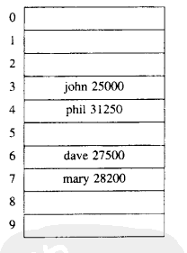
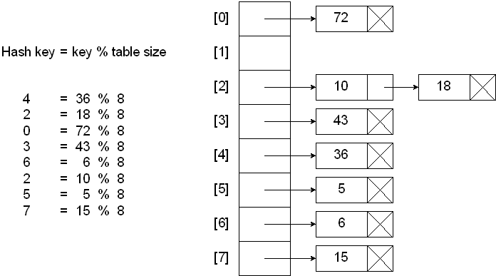
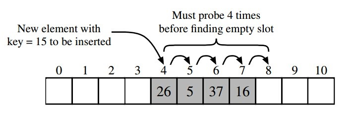

# [原文1](https://www.cnblogs.com/luxiaoxun/p/8744826.html)
# [原文2](https://juejin.im/post/5aeeb22e6fb9a07aa213404a)

## 1. ThreadLocal的简介
在多线程编程中通常解决线程安全的问题我们会利用synchronized或者lock控制线程对临界区资源的同步顺序从而解决线程安全的问题，
但是这种加锁的方式会让未获取到锁的线程进行阻塞等待，很显然这种方式的时间效率并不是很好。

线程安全问题的核心在于多个线程会对同一个临界区共享资源进行操作，
那么，如果每个线程都使用自己的“共享资源”，各自使用各自的，又互相不影响到彼此即让多个线程间达到隔离的状态，
这样就不会出现线程安全的问题。

事实上，这就是一种“空间换时间”的方案，每个线程都会都拥有自己的“共享资源”无疑内存会大很多，
但是由于不需要同步也就减少了线程可能存在的阻塞等待的情况从而提高的时间效率。
虽然ThreadLocal并不在java.util.concurrent包中而在java.lang包中，
但我更倾向于把它当作是一种并发容器（虽然真正存放数据的是ThreadLocalMap）进行归类。
从ThreadLocal这个类名可以顾名思义的进行理解，表示线程的“本地变量”，
即每个线程都拥有该变量副本，达到人手一份的效果，各用各的这样就可以避免共享资源的竞争。


### 什么是ThreadLocal变量

ThreadLocal 变量，线程局部变量，同一个 ThreadLocal 所包含的对象，在不同的 Thread 中有不同的副本。

这里有几点需要注意：

- 因为每个 Thread 内有自己的实例副本，且该副本只能由当前 Thread 使用。这是也是 ThreadLocal 命名的由来。

- 既然每个 Thread 有自己的实例副本，且其它 Thread 不可访问，那就不存在多线程间共享的问题。

ThreadLocal 提供了线程本地的实例。它与普通变量的区别在于，每个使用该变量的线程都会初始化一个完全独立的实例副本。

ThreadLocal 变量通常被private static修饰。

当一个线程结束时，它所使用的所有 ThreadLocal 相对的实例副本都可被回收。

总的来说，ThreadLocal 适用于每个线程需要自己独立的实例且该实例需要在多个方法中被使用，
也即变量在线程间隔离而在方法或类间共享的场景。

## 2 源码分析ThreadLocal实现原理

首先 ThreadLocal 是一个泛型类，保证可以接受任何类型的对象。

因为一个线程内可以存在多个 ThreadLocal 对象，所以其实是 ThreadLocal 内部维护了一个 Map ，
这个 Map 不是直接使用的 HashMap ，
而是 ThreadLocal 实现的一个叫做 ThreadLocalMap 的静态内部类。
而我们使用的 get()、set() 方法其实都是调用了这个ThreadLocalMap类对应的 get()、set() 方法。

例如下面的 

#### set 方法：

```java
public void set(T value) {
	//1. 获取当前线程实例对象
    Thread t = Thread.currentThread();
	//2. 通过当前线程实例获取到ThreadLocalMap对象
    ThreadLocalMap map = getMap(t);
    if (map != null)
		//3. 如果Map不为null,则以当前threadLocl实例为key,值为value进行存入
        map.set(this, value);
    else
		//4.map为null,则新建ThreadLocalMap并存入value
        createMap(t, value);
}

```
方法的逻辑很清晰，具体请看上面的注释。
通过源码我们知道value是存放在了ThreadLocalMap里了，当前先把它理解为一个普普通通的map即可，
也就是说，数据value是真正的存放在了ThreadLocalMap这个容器中了，并且是以当前threadLocal实例为key。
先简单的看下ThreadLocalMap是什么，有个简单的认识就好，下面会具体说的。


- 首先ThreadLocalMap是怎样来的？源码很清楚，是通过getMap(t)进行获取：
```java
ThreadLocalMap getMap(Thread t) {
    return t.threadLocals;
}
```
该方法直接返回的就是当前线程对象t的一个成员变量threadLocals：

```java
    /* ThreadLocal values pertaining to this thread. This map is maintained
     * by the ThreadLocal class. */
    ThreadLocal.ThreadLocalMap threadLocals = null;
```

也就是说ThreadLocalMap的引用是作为Thread的一个成员变量，被Thread进行维护的。
回过头再来看看set方法，当map为Null的时候会通过createMap(t，value)方法：

```java
void createMap(Thread t, T firstValue) {
    t.threadLocals = new ThreadLocalMap(this, firstValue);
}
```

该方法就是new一个ThreadLocalMap实例对象，
然后同样以当前threadLocal实例作为key,值为value存放到threadLocalMap中，
然后将当前线程对象的threadLocals赋值为threadLocalMap。

- 现在来对set方法进行总结一下：
通过当前线程对象thread获取该thread所维护的threadLocalMap,
若threadLocalMap不为null,则以threadLocal实例为key,
值为value的键值对存入threadLocalMap,若threadLocalMap为null的话，
就新建threadLocalMap然后在以threadLocal为键，值为value的键值对存入即可。


- get方法是获取当前线程中threadLocal变量的值，同样的还是来看看源码：

#### get方法：
```java
    public T get() {
    	//1. 获取当前线程的实例对象
        Thread t = Thread.currentThread();
    	//2. 获取当前线程的threadLocalMap
        ThreadLocalMap map = getMap(t);
        if (map != null) {
    		//3. 获取map中当前threadLocal实例为key的值的entry
            ThreadLocalMap.Entry e = map.getEntry(this);
            if (e != null) {
                @SuppressWarnings("unchecked")
    			//4. 当前entity不为null的话，就返回相应的值value
                T result = (T)e.value;
                return result;
            }
        }
    	//5. 若map为null或者entry为null的话通过该方法初始化，并返回该方法返回的value
        return setInitialValue();
    }
```

弄懂了set方法的逻辑，看get方法只需要带着逆向思维去看就好，如果是那样存的，反过来去拿就好。
代码逻辑请看注释，

另外，看下setInitialValue主要做了些什么事情？

#### setInitialValue 方法
```java
private T setInitialValue() {
    T value = initialValue();
    Thread t = Thread.currentThread();
    ThreadLocalMap map = getMap(t);
    if (map != null)
        map.set(this, value);
    else
        createMap(t, value);
    return value;
}

```
这段方法的逻辑和set方法几乎一致，另外值得关注的是initialValue方法:

#### initialValue 方法

```java
  protected T initialValue() {
        return null;
    }
```

这个方法是protected修饰的也就是说继承ThreadLocal的子类可重写该方法，实现赋值为其他的初始值。

比如ThreadLocal 内部类 SuppliedThreadLocal 继承ThreadLocal,重新该方法
```java
static final class SuppliedThreadLocal<T> extends ThreadLocal<T> {

        private final Supplier<? extends T> supplier;

        SuppliedThreadLocal(Supplier<? extends T> supplier) {
            this.supplier = Objects.requireNonNull(supplier);
        }

        @Override
        protected T initialValue() {
            return supplier.get();
        }
    }

```
关于get方法来总结一下：

通过当前线程thread实例获取到它所维护的threadLocalMap，
然后以当前threadLocal实例为key获取该map中的键值对（Entry），
若Entry不为null则返回Entry的value。
如果获取threadLocalMap为null或者Entry为null的话，就以当前threadLocal为Key，
value为null存入map后，并返回null。
 
#### remove 方法 

```java
public void remove() {
	//1. 获取当前线程的threadLocalMap
	ThreadLocalMap m = getMap(Thread.currentThread());
 	if (m != null)
		//2. 从map中删除以当前threadLocal实例为key的键值对
		m.remove(this);
}

```
get,set方法实现了存数据和读数据，我们当然还得学会如何删数据。
删除数据当然是从map中删除数据，
先获取与当前线程相关联的threadLocalMap然后从map中删除该threadLocal实例为key的键值对即可。


## 3 ThreadLocal 内部类 ThreadLocalMap 详解

从上面的分析我们已经知道，数据其实都放在了threadLocalMap中，
threadLocal的get，set和remove方法实际上具体是通过threadLocalMap的getEntry,set和remove方法实现的。
如果想真正全方位的弄懂threadLocal，势必得在对threadLocalMap做一番理解。

### 3.1 Entry数据结构
ThreadLocalMap是threadLocal一个静态内部类，
和大多数容器一样内部维护了一个数组，同样的threadLocalMap内部维护了一个Entry类型的table数组。
 
```java
/**
 * The table, resized as necessary.
 * table.length MUST always be a power of two.
 */
private Entry[] table;
```

通过注释可以看出，table数组的长度为2的幂次方。

接下来看下Entry是什么：
```java
static class Entry extends WeakReference<ThreadLocal<?>> {
    /** The value associated with this ThreadLocal. */
    Object value;

    Entry(ThreadLocal<?> k, Object v) {
        super(k);
        value = v;
    }
}
```

Entry是一个以ThreadLocal为key,Object为value的键值对，
另外需要注意的是这里的 **threadLocal是弱引用，因为Entry继承了WeakReference，
在Entry的构造方法中，调用了super(k)方法就会将threadLocal实例包装成一个WeakReference。** 
到这里我们可以用一个图来理解下thread,
threadLocal,threadLocalMap，Entry之间的关系


注意上图中的实线表示强引用，虚线表示弱引用。
如图所示，每个线程实例中可以通过threadLocals获取到threadLocalMap，
而threadLocalMap实际上就是一个以threadLocal实例为key，任意对象为value的Entry数组。

当我们为threadLocal变量赋值，实际上就是以当前threadLocal实例为key，值为value的Entry往这个threadLocalMap中存放。
需要注意的是 **Entry中的key是弱引用，当threadLocal外部强引用被置为null(threadLocalInstance=null),
那么系统 GC 的时候，根据可达性分析，这个threadLocal实例就没有任何一条链路能够引用到它，
这个ThreadLocal势必会被回收，
这样一来，ThreadLocalMap中就会出现key为null的Entry，就没有办法访问这些key为null的Entry的value，
如果当前线程再迟迟不结束的话，这些key为null的Entry的value就会一直存在一条强引用链：
Thread Ref -> Thread -> ThreadLocalMap -> Entry -> value 
永远无法回收，造成内存泄漏。** 
当然，如果当前thread运行结束，threadLocal，threadLocalMap,Entry没有引用链可达，
在垃圾回收的时候都会被系统进行回收。
在实际开发中，会使用线程池去维护线程的创建和复用，比如固定大小的线程池，
线程为了复用是不会主动结束的，
所以，threadLocal的内存泄漏问题，是应该值得我们思考和注意的问题


### 3.2 set方法

与concurrentHashMap，hashMap等容器一样，threadLocalMap也是采用散列表进行实现的。

在了解set方法前，我们先来回顾下关于散列表相关的知识
[threadLocalMap的讲解部分以及这篇文章的hash](https://www.cnblogs.com/zhangjk1993/archive/2017/03/29/6641745.html)。

#### 散列表

理想状态下，散列表就是一个包含关键字的固定大小的数组，通过使用散列函数，将关键字映射到数组的不同位置。
下面是理想散列表的一个示意图：



在理想状态下，哈希函数可以将关键字均匀的分散到数组的不同位置，
不会出现两个关键字散列值相同（假设关键字数量小于数组的大小）的情况。
但是在实际使用中，经常会出现多个关键字散列值相同的情况（被映射到数组的同一个位置），
我们将这种情况称为散列冲突。为了解决散列冲突，主要采用下面两种方式：

- 分离链表法（separate chaining）
- 开放定址法（open addressing）

##### 分离链表法
分散链表法使用链表解决冲突，将散列值相同的元素都保存到一个链表中。
当查询的时候，首先找到元素所在的链表，然后遍历链表查找对应的元素。
下面是一个示意图



##### 开放定址法
开放定址法不会创建链表，当关键字散列到的数组单元已经被另外一个关键字占用的时候，
就会尝试在数组中寻找其他的单元，直到找到一个空的单元。
探测数组空单元的方式有很多，这里介绍一种最简单的 

- - 线性探测法。

线性探测法就是从冲突的数组单元开始，依次往后搜索空单元，如果到数组尾部，再从头开始搜索（环形查找）。

如下图所示：


关于两种方式的比较，可以参考 [这篇文章](http://www.nowamagic.net/academy/detail/3008060)。
ThreadLocalMap 中使用开放地址法来处理散列冲突，
而 HashMap 中使用的分离链表法。
之所以采用不同的方式主要是因为：在 ThreadLocalMap 中的散列值分散的十分均匀，很少会出现冲突。
并且 ThreadLocalMap 经常需要清除无用的对象，使用纯数组更加方便。


set方法的源码为：

```java
 private void set(ThreadLocal<?> key, Object value) {
 
     // We don't use a fast path as with get() because it is at
     // least as common to use set() to create new entries as
     // it is to replace existing ones, in which case, a fast
     // path would fail more often than not.
 
     Entry[] tab = table;
     int len = tab.length;
 	//根据threadLocal的hashCode确定Entry应该存放的位置
     int i = key.threadLocalHashCode & (len-1);
 
 	//采用开放地址法，hash冲突的时候使用线性探测
     for (Entry e = tab[i];
          e != null;
          e = tab[i = nextIndex(i, len)]) {
         ThreadLocal<?> k = e.get();
 		//覆盖旧Entry
         if (k == key) {
             e.value = value;
             return;
         }
 		//当key为null时，说明threadLocal强引用已经被释放掉，那么就无法
 		//再通过这个key获取threadLocalMap中对应的entry，这里就存在内存泄漏的可能性
         if (k == null) {
 			//用当前插入的值替换掉这个key为null的“脏”entry
             replaceStaleEntry(key, value, i);
             return;
         }
     }
 	//新建entry并插入table中i处
     tab[i] = new Entry(key, value);
     int sz = ++size;
 	//插入后再次清除一些key为null的“脏”entry,如果大于阈值就需要扩容
     if (!cleanSomeSlots(i, sz) && sz >= threshold)
         rehash();
 }
```

set方法的关键部分请看上面的注释，主要有这样几点需要注意：
 
#### threadLocal的hashcode? 
```java
 
  private final int threadLocalHashCode = nextHashCode();
  private static final int HASH_INCREMENT = 0x61c88647;
  private static AtomicInteger nextHashCode =new AtomicInteger();
  /**
   * Returns the next hash code.
   */
  private static int nextHashCode() {
      return nextHashCode.getAndAdd(HASH_INCREMENT);
  }
```

从源码中我们可以清楚的看到threadLocal实例的hashCode是通过nextHashCode()方法实现的，
该方法实际上总是用一个AtomicInteger加上0x61c88647来实现的。
0x61c88647这个数是有特殊意义的，它能够保证hash表的每个散列桶能够均匀的分布，这是Fibonacci Hashing，
关于更多介绍可以看这篇文章的threadLocal散列值部分。
也正是能够均匀分布，所以threadLocal选择使用开放地址法来解决hash冲突的问题。


#### 怎样确定新值插入到哈希表中的位置？
该操作源码为：key.threadLocalHashCode & (len-1)，同hashMap和ConcurrentHashMap等容器的方式一样，
利用当前key(即threadLocal实例)的hashcode与哈希表大小相与，
因为哈希表大小总是为2的幂次方，所以相与等同于一个取模的过程，
这样就可以通过Key分配到具体的哈希桶中去。
而至于为什么取模要通过位与运算的原因就是位运算的执行效率远远高于了取模运算。


#### 怎样解决hash冲突？
源码中通过nextIndex(i, len)方法解决hash冲突的问题，
该方法为((i + 1 < len) ? i + 1 : 0);
也就是不断往后线性探测，当到哈希表末尾的时候再从0开始，成环形。


#### 怎样解决“脏”Entry？
在分析threadLocal,threadLocalMap以及Entry的关系的时候，
我们已经知道使用threadLocal有可能存在内存泄漏（对象创建出来后，在之后的逻辑一直没有使用该对象，
但是垃圾回收器无法回收这个部分的内存），在源码中针对这种key为null的Entry称之为“stale entry”，
直译为不新鲜的entry，我把它理解为“脏entry”，自然而然，
Josh Bloch and Doug Lea大师考虑到了这种情况,
在set方法的for循环中寻找和当前Key相同的可覆盖entry的过程中通过replaceStaleEntry方法解决脏entry的问题。
如果当前table[i]为null的话，直接插入新entry后也会通过cleanSomeSlots来解决脏entry的问题，
关于cleanSomeSlots和replaceStaleEntry方法，
会在详解threadLocal内存泄漏中讲到，具体可看那篇文章


#### 如何进行扩容？
 
> threshold的确定
 
也几乎和大多数容器一样，threadLocalMap会有扩容机制，那么它的threshold又是怎样确定的了？

```java
 	private int threshold; // Default to 0
 	/**
      * The initial capacity -- MUST be a power of two.
      */
     private static final int INITIAL_CAPACITY = 16;
 	
     ThreadLocalMap(ThreadLocal<?> firstKey, Object firstValue) {
         table = new Entry[INITIAL_CAPACITY];
         int i = firstKey.threadLocalHashCode & (INITIAL_CAPACITY - 1);
         table[i] = new Entry(firstKey, firstValue);
         size = 1;
         setThreshold(INITIAL_CAPACITY);
     }
 	
 	/**
      * Set the resize threshold to maintain at worst a 2/3 load factor.
      */
     private void setThreshold(int len) {
         threshold = len * 2 / 3;
     }
``` 
 
根据源码可知，在第一次为threadLocal进行赋值的时候会创建初始大小为16的threadLocalMap,
并且通过setThreshold方法设置threshold，其值为当前哈希数组长度乘以（2/3），
也就是说加载因子为2/3(加载因子是衡量哈希表密集程度的一个参数，
如果加载因子越大的话，说明哈希表被装载的越多，出现hash冲突的可能性越大，
反之，则被装载的越少，出现hash冲突的可能性越小。
同时如果过小，很显然内存使用率不高，该值取值应该考虑到内存使用率和hash冲突概率的一个平衡，
如hashMap,concurrentHashMap的加载因子都为0.75)。
这里threadLocalMap初始大小为16，加载因子为2/3，
所以哈希表可用大小为：16*2/3=10，即哈希表可用容量为10。
 
#### 扩容resize
 
 从set方法中可以看出当hash表的size大于threshold的时候，会通过resize方法进行扩容。

```java
 /**
  * Double the capacity of the table.
  */
 private void resize() {
     Entry[] oldTab = table;
     int oldLen = oldTab.length;
 	//新数组为原数组的2倍
     int newLen = oldLen * 2;
     Entry[] newTab = new Entry[newLen];
     int count = 0;
 
     for (int j = 0; j < oldLen; ++j) {
         Entry e = oldTab[j];
         if (e != null) {
             ThreadLocal<?> k = e.get();
 			//遍历过程中如果遇到脏entry的话直接另value为null,有助于value能够被回收
             if (k == null) {
                 e.value = null; // Help the GC
             } else {
 				//重新确定entry在新数组的位置，然后进行插入
                 int h = k.threadLocalHashCode & (newLen - 1);
                 while (newTab[h] != null)
                     h = nextIndex(h, newLen);
                 newTab[h] = e;
                 count++;
             }
         }
     }
 	//设置新哈希表的threshHold和size属性
     setThreshold(newLen);
     size = count;
     table = newTab;
 }
``` 
	
方法逻辑请看注释，新建一个大小为原来数组长度的两倍的数组，
然后遍历旧数组中的entry并将其插入到新的hash数组中，
主要注意的是，在扩容的过程中针对脏entry的话会令value为null，
以便能够被垃圾回收器能够回收，解决隐藏的内存泄漏的问题。


### 3.3 getEntry方法

getEntry方法源码为：
 
```java
 private Entry getEntry(ThreadLocal<?> key) {
 	//1. 确定在散列数组中的位置
     int i = key.threadLocalHashCode & (table.length - 1);
 	//2. 根据索引i获取entry
     Entry e = table[i];
 	//3. 满足条件则返回该entry
     if (e != null && e.get() == key)
         return e;
     else
 		//4. 未查找到满足条件的entry，额外在做的处理
         return getEntryAfterMiss(key, i, e);
 }
```
方法逻辑很简单，若能当前定位的entry的key和查找的key相同的话就直接返回这个entry，
否则的话就是在set的时候存在hash冲突的情况，需要通过getEntryAfterMiss做进一步处理。
 
getEntryAfterMiss方法为：

```java
private Entry getEntryAfterMiss(ThreadLocal<?> key, int i, Entry e) {
 Entry[] tab = table;
 int len = tab.length;

 while (e != null) {
     ThreadLocal<?> k = e.get();
     if (k == key)
        //找到和查询的key相同的entry则返回
         return e;
     if (k == null)
        //解决脏entry的问题
         expungeStaleEntry(i);
     else
        //继续向后环形查找
         i = nextIndex(i, len);
     e = tab[i];
 }
 return null;
}
``` 

这个方法同样很好理解，通过nextIndex往后环形查找，
如果找到和查询的key相同的entry的话就直接返回，
如果在查找过程中遇到脏entry的话使用expungeStaleEntry方法进行处理。
到目前为止 **，为了解决潜在的内存泄漏的问题，在set，resize,getEntry这些地方都会对这些脏entry进行处理，
可见为了尽可能解决这个问题几乎无时无刻都在做出努力。**
 

### 3.4 remove

```java
/**
 * Remove the entry for key.
 */
private void remove(ThreadLocal<?> key) {
    Entry[] tab = table;
    int len = tab.length;
    int i = key.threadLocalHashCode & (len-1);
    for (Entry e = tab[i];
         e != null;
         e = tab[i = nextIndex(i, len)]) {
        if (e.get() == key) {
			//将entry的key置为null
            e.clear();
			//将该entry的value也置为null
            expungeStaleEntry(i);
            return;
        }
    }
}

 
```
该方法逻辑很简单，通过往后环形查找到与指定key相同的entry后，
先通过clear方法将key置为null后，使其转换为一个脏entry，
然后调用expungeStaleEntry方法将其value置为null，
以便垃圾回收时能够清理，同时将table[i]置为null。

 

## 4 内存泄漏问题

实际上 ThreadLocalMap 中使用的 key 为 ThreadLocal 的弱引用，
弱引用的特点是，如果这个对象只存在弱引用，那么在下一次垃圾回收的时候必然会被清理掉。

所以如果 ThreadLocal 没有被外部强引用的情况下，在垃圾回收的时候会被清理掉的，
这样一来 ThreadLocalMap中使用这个 ThreadLocal 的 key 也会被清理掉。
但是，value 是强引用，不会被清理，这样一来就会出现 key 为 null 的 value。

ThreadLocalMap实现中已经考虑了这种情况，在调用 set()、get()、remove() 方法的时候，会清理掉 key 为 null 的记录。
如果说会出现内存泄漏，那只有在出现了 key 为 null 的记录后，没有手动调用 remove() 方法，
并且之后也不再调用 get()、set()、remove() 方法的情况下。

## 5 使用场景

如上文所述，ThreadLocal 适用于如下两种场景

- 每个线程需要有自己单独的实例
- 实例需要在多个方法中共享，但不希望被多线程共享

对于第一点，每个线程拥有自己实例，实现它的方式很多。
例如可以在线程内部构建一个单独的实例。ThreadLoca 可以以非常方便的形式满足该需求。

对于第二点，可以在满足第一点（每个线程有自己的实例）的条件下，通过方法间引用传递的形式实现。
ThreadLocal 使得代码耦合度更低，且实现更优雅。

 应用太多了。。。各大框架都有应用，比如Spring。
 
 Spring对一些Bean中的成员变量采用ThreadLocal进行处理，让它们可以成为线程安全的。
 举个例子：
 
### 1）Spring对一些Bean中的成员变量


package org.springframework.web.context.request;


public abstract class RequestContextHolder {
    private static final boolean jsfPresent = 
        ClassUtils.isPresent("javax.faces.context.FacesContext", RequestContextHolder.class.getClassLoader());
    private static final ThreadLocal<RequestAttributes> requestAttributesHolder = 
        new NamedThreadLocal("Request attributes");
    private static final ThreadLocal<RequestAttributes> inheritableRequestAttributesHolder = 
        new NamedInheritableThreadLocal("Request context");

     //......下面省略
}

再比如Spring MVC中的Controller默认是singleton的，
因此如果Controller或其对应的Service里存在非静态成员变量的话，
并发访问就会出现race condition问题，这也可以通过ThreadLocal解决。


### 2）存储用户Session

一个简单的用ThreadLocal来存储Session的例子：


```java
 private static final ThreadLocal threadSession = new ThreadLocal();

    public static Session getSession() throws InfrastructureException {
        Session s = (Session) threadSession.get();
        try {
            if (s == null) {
                s = getSessionFactory().openSession();
                threadSession.set(s);
            }
        } catch (HibernateException ex) {
            throw new InfrastructureException(ex);
        }
        return s;
    }
```

### 3）解决线程安全的问题

比如Java7中的SimpleDateFormat不是线程安全的，可以用ThreadLocal来解决这个问题：

```java

public class DateUtil {
    private static ThreadLocal<SimpleDateFormat> format1 = new ThreadLocal<SimpleDateFormat>() {
        @Override
        protected SimpleDateFormat initialValue() {
            return new SimpleDateFormat("yyyy-MM-dd HH:mm:ss");
        }
    };

    public static String formatDate(Date date) {
        return format1.get().format(date);
    }
}
```


这里的DateUtil.formatDate()就是线程安全的了。
(Java8里的 java.time.format.DateTimeFormatter是线程安全的，Joda time里的DateTimeFormat也是线程安全的）。


