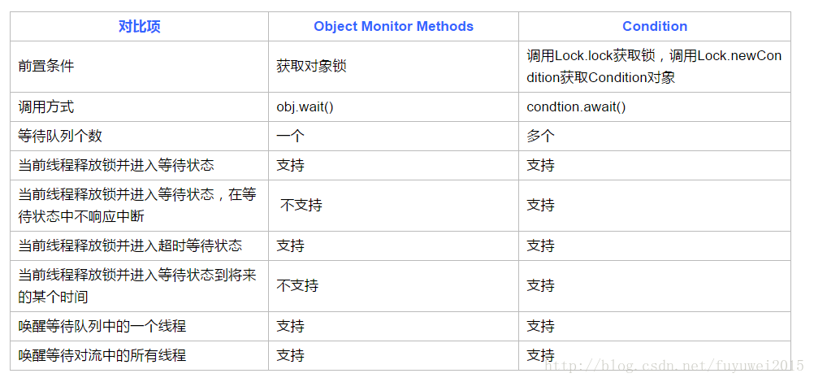
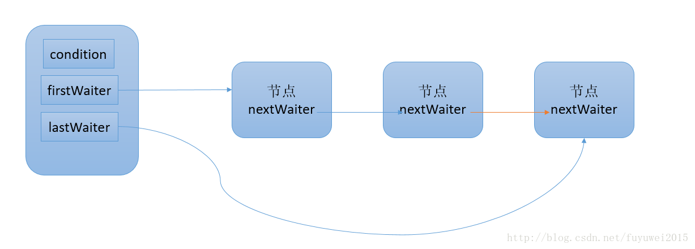

## [原文1](https://blog.csdn.net/yanyan19880509/article/details/52502882)

## [原文2](https://blog.csdn.net/fuyuwei2015/article/details/72602182)

# Condition接口原理详解

Condition接口提供了类似Object的监视器方法，与Lock配合可以实现等待/通知模式，
但是这两者在使用方式以及功能特性上还是有差别的 



## Condition接口详解

Condition定义了等待/通知两种类型的方法，当前线程调用这些方法时，
需要提前获取到Condition对象关联的锁。
Condition对象是由Lock对象（调用Lock对象的newCondition()方法）创建出来的，
换句话说，Condition是依赖Lock对象的。

```java
Lock lock = new ReentrantLock();
    Condition condition = lock.newCondition();
    public void conditionWait() throws InterruptedException {
        lock.lock();
        try {
            condition.await();
        } finally {
            lock.unlock();
        }
    }
    public void conditionSignal() throws InterruptedException {
        lock.lock();
        try {
            condition.signal();
        } finally {
            lock.unlock();
        }
    }
```


一般都会将Condition对象作为成员变量。
当调用await()方法后，当前线程会释放锁并在此等待，
而其他线程调用Condition对象的signal()方法，
通知当前线程后，当前线程才从await()方法返回，并且在返回前已经获取了锁。

```java
 /**
     * 当前线程进入等待状态直到被通知(signal)或中断，当前线程进入后台运行状态且从await()方法返回
     * 其他线程调用该Condition的signal或者signalAll方法，而当前线程被选中唤醒
     * 1、其他线程（interrupt）中断当前线程
     * 2、如果当前等待线程从await方法返回，那么表明当前线程已经获取了Condition对象的锁
     */
    void await() throws InterruptedException;

    /**
     * 当前线程进入等待状态直到被通知，对中断不响应
     */
    void awaitUninterruptibly();

    /**
     *  <pre> {@code
     * boolean aMethod(long timeout, TimeUnit unit) {
     *   long nanos = unit.toNanos(timeout);
     *   lock.lock();
     *   try {
     *     while (!conditionBeingWaitedFor()) {
     *       if (nanos <= 0L)
     *         return false;
     *       nanos = theCondition.awaitNanos(nanos);
     *     }
     *     // ...
     *   } finally {
     *     lock.unlock();
     *   }
     * }}</pre>
     * 当前线程进入等待状态直到被通知、中断或超时。返回值表示剩余时间，如果在nanosTimeout纳秒之前被唤醒，那么返回值就是nanosTimeout-实际耗时
     * 返回值<=0说明超时
     * 
     */
    long awaitNanos(long nanosTimeout) throws InterruptedException;

    /**
     * 当前线程进入等待状态直到被通知、中断或超时，如果没有到指定时间被通知返回true，否则返回false
     */
    boolean await(long time, TimeUnit unit) throws InterruptedException;

    /**
     * 唤醒一个等待在Condition上的线程，该线程从等待方法返回之前必须获得与Condition相关联的锁
     */
    void signal();
```

获取一个Condition必须通过Lock的newCondition()方法。
下面通过一个有界队列的示例来深入了解Condition的使用方式。
有界队列是一种特殊的队列，当队列为空时，队列的获取操作将会阻塞获取线程，
直到队列中有新增元素，当队列已满时，队列的插入操作将会阻塞插入线程，直到队列出现“空位”

```java
public class BoundedQueue<T> {
    /**
     * 锁对象
     */
    final Lock lock = new ReentrantLock();
    /**
     * 写线程条件
     */
    final Condition notFull = lock.newCondition();
    /**
     * 读线程条件
     */
    final Condition notEmpty = lock.newCondition();

    /**
     * 缓存队列
     */
    final Object[] items = new Object[100];

    /**
     * 写索引
     */
    int putptr;

    /**
     * 读索引
     */
    int takeptr;

    /**
     * 队列中存在的数据个数
     */
    int count;

    public void put(Object x) throws InterruptedException {
        lock.lock();
        try {
            //如果队列满了
            while (count == items.length) {
                notFull.await();//阻塞写线程
            }
            //赋值
            items[putptr] = x;
            //如果写索引写到队列的最后一个位置了，那么置为0
            if (++putptr == items.length) {
                putptr = 0;
            }
            //个数++
            ++count;
            //唤醒读线程
            notEmpty.signal();
        } finally {
            lock.unlock();
        }
    }

    public Object take() throws InterruptedException {
        lock.lock();
        try {
            //如果队列为空
            while (count == 0) {
                //阻塞读线程
                notEmpty.await();
            }
            //取值
            Object x = items[takeptr];
            if (++takeptr == items.length) {
                //如果读索引读到队列的最后一个位置了，那么置为0
                takeptr = 0;
            }
            //个数--
            --count;
            //唤醒写线程
            notFull.signal();
            return x;
        } finally {
            lock.unlock();
        }
    }
}
```
首先需要获得锁，目的是确保数组修改的可见性和排他性。
当数组数量等于数组长度时，表示数组已满，则调用notFull.await()，
当前线程随之释放锁并进入等待状态。
如果数组数量不等于数组长度，表示数组未满，则添加元素到数组中，
同时通知等待在notEmpty上的线程，数组中已经有新元素可以获取。
在添加和删除方法中使用while循环而非if判断，目的是防止过早或意外的通知，
只有条件符合才能够退出循环。回想之前提到的等待/通知的经典范式，二者是非常类似的


## Condition原理分析

ConditionObject是同步器AbstractQueuedSynchronizer的内部类，
因为Condition的操作需要获取相关联的锁，所以作为同步器的内部类也较为合理。
每个Condition对象都包含着一个队列，该队列是Condition对象实现等待/通知功能的关键。
下面将分析Condition的实现，主要包括：等待队列、等待和通知

### 等待队列

等待队列是一个FIFO的队列，在队列中的每个节点都包含了一个线程引用，
该线程就是在Condition对象上等待的线程，如果一个线程调用了Condition.await()方法，
那么该线程将会释放锁、构造成节点加入等待队列并进入等待状态 
一个Condition包含一个等待队列，Condition拥有首节点（firstWaiter）和尾节点（lastWaiter）。
当前线程调用Condition.await()方法，将会以当前线程构造节点，
并将节点从尾部加入等待队列，等待队列的基本结构如下图所示 




如图所示，Condition拥有首尾节点的引用，
而新增节点只需要将原有的尾节点nextWaiter指向它，并且更新尾节点即可。
上述节点引用更新的过程并没有使用CAS保证，
原因在于调用await()方法的线程必定是获取了锁的线程，
也就是说该过程是由锁来保证线程安全的。
在Object的监视器模型上，一个对象拥有一个同步队列和等待队列，
而并发包中的Lock（更确切地说是同步器）拥有一个同步队列和多个等待队列，
其对应关系如下图所示 


### 等待

调用Condition的await()方法（或者以await开头的方法），
会使当前线程进入等待队列并释放锁，同时线程状态变为等待状态。
当从await()方法返回时，当前线程一定获取了Condition相关联的锁。
如果从队列（同步队列和等待队列）的角度看await()方法，当调用await()方法时，
相当于同步队列的首节点（获取了锁的节点）移动到Condition的等待队列中
    
```java
public final void await() throws InterruptedException {
        if (Thread.interrupted())
            throw new InterruptedException();
        // 当前线程加入等待队列
        Node node = addConditionWaiter();
        // 释放同步状态，也就是释放锁
        int savedState = fullyRelease(node);
        int interruptMode = 0;
        while (!isOnSyncQueue(node)) {
            LockSupport.park(this);
            if ((interruptMode = checkInterruptWhileWaiting(node)) != 0)
                break;
        }
        if (acquireQueued(node, savedState) && interruptMode != THROW_IE)
            interruptMode = REINTERRUPT;
        if (node.nextWaiter != null)
            unlinkCancelledWaiters();
        if (interruptMode != 0)
            reportInterruptAfterWait(interruptMode);
    }
```

调用该方法的线程成功获取了锁的线程，也就是同步队列中的首节点，
该方法会将当前线程构造成节点并加入等待队列中，然后释放同步状态，
唤醒同步队列中的后继节点，然后当前线程会进入等待状态。
当等待队列中的节点被唤醒，则唤醒节点的线程开始尝试获取同步状态。
如果不是通过其他线程调用Condition.signal()方法唤醒，
而是对等待线程进行中断，则会抛出InterruptedException

### 通知

调用Condition的signal()方法，
将会唤醒在等待队列中等待时间最长的节点（首节点），
在唤醒节点之前，会将节点移到同步队列中


```java
public final void signal() {
        if (!isHeldExclusively())
            throw new IllegalMonitorStateException();
        Node first = firstWaiter;
        if (first != null)
            doSignal(first);
    }
```


调用该方法的前置条件是当前线程必须获取了锁，
可以看到signal()方法进行了isHeldExclusively()检查，
也就是当前线程必须是获取了锁的线程。接着获取等待队列的首节点，
将其移动到同步队列并使用LockSupport唤醒节点中的线程 
节点从等待队列移动到同步队列的过程如下图所示 


通过调用同步器的enq(Node node)方法，
等待队列中的头节点线程安全地移动到同步队列。
当节点移动到同步队列后，当前线程再使用LockSupport唤醒该节点的线程。
被唤醒后的线程，将从await()方法中的while循环中退出（isOnSyncQueue(Node node)方法返回true，
节点已经在同步队列中），进而调用同步器的acquireQueued()方法加入到获取同步状态的竞争中。
成功获取同步状态（或者说锁）之后，被唤醒的线程将从先前调用的await()方法返回，此时该线程已经成功地获取了锁。
Condition的signalAll()方法，相当于对等待队列中的每个节点均执行一次signal()方法，效果就是将等待队列中所有节点全部移动到同步队列中，
并唤醒每个节点的线程。


    