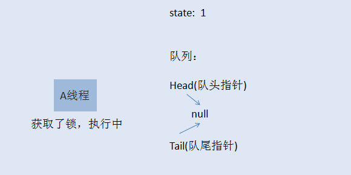

## [原文1](https://www.cnblogs.com/wanly3643/p/3835839.html)

## [原文2](https://blog.csdn.net/yanyan19880509/article/details/52345422)

## [原文3](https://blog.csdn.net/L_BestCoder/article/details/79311648)


# 可重入锁(ReentrantLock)的实现原理


## 前言

相信学过java的人都知道 synchronized 这个关键词，也知道它用于控制多线程对并发资源的安全访问，
兴许，你还用过Lock相关的功能，但你可能从来没有想过java中的锁底层的机制是怎么实现的。
如果真是这样，而且你有兴趣了解，今天我将带领你轻松的学习下java中非常重要，
也非常基础的可重入锁-ReentrantLock的实现机制。


## ReentrantLock是什么？
ReentrantLock是Lock接口的默认实现，是一种独占锁。
相对synchronized而言，ReentrantLock提供了更多的操作方式以及更细粒度的加锁方式。

主要特性：

（1）可重入。ReentrantLock是可重入锁，因为它会记录之前获得锁线程对象，
保存在exclusiveOwenerThread变量中，当一个线程要获取锁时，
会先判断当前线程是不是已经获取锁的线程。synchronized也是可重入锁。

（2）可中断。ReentrantLock是可中断锁，它提供了lockInterruptibly这种可中断的加锁方式，
可以有效的避免线程之间因为互相持续占有资源而导致阻塞。synchronized无法实现可中断。

（3）公平锁与非公平锁可选。ReentrantLock默认是非公平锁，
但是也可以通过构造方法选择非公平锁。
公平锁是指当多个线程尝试获取同一个锁时，
获取锁的顺序按照到达的时间顺序排序

## ReentrantLock的底层原理

ReentrantLock是继承了队列同步器AQS，关于AQS的原理，
我之前写过博客，[链接](https://blog.csdn.net/l_bestcoder/article/details/79306039)为点击打开链接。

我们先要了解一下ReentrantLock的两个构造方法。

```java
    public ReentrantLock() {
        sync = new NonfairSync();//默认为不公平锁
    }
 
    public ReentrantLock(boolean fair) {
        sync = fair ? new FairSync() : new NonfairSync();//若为true，则是公平锁

```
ReentrantLock通过构造器参数选择到底是公平模式还是非公平模式。

再通过一张类关系图看一下NonfairSync和FairSync这两个内部类的来头。


可以看到NonfairSync和FairSync都是继承了Sync这个抽象类，
而Sync则继承了AQS。
Sync、NonfairSync、FairSync都是ReentrantLock的静态内部类，
ReentrantLock的许多方法都是Sync类代为实现。

再看一下关键的最为关键的lock方法。

```java
public void lock() {
    sync.lock();//sync可能是NonfairSync或者FairSync
}
```

很简单的一个方法实现，sync代为实现lock的逻辑，而sync是Sync的实例，
对于ReentrantLock来说，
它的代码不需要知道Sync到底是NonfariSync还是FairSync，
在运行时才会知道。这就是设计模式中的策略模式。

1、接下来先来看NonfairSync的lock方法。

```java
final void lock() {
    if (compareAndSetState(0, 1)) //先通过CAS操作尝试获取锁，即把state从0变为1
        setExclusiveOwnerThread(Thread.currentThread()); //若获取锁成功，则设置独占的线程为当前线程
    else
        acquire(1); //若无法通过上述操作获得锁，则要通过AQS的acquire操作来再次获取锁，若还未成功则进入等待队列
}
```

acquire方法在AQS中已经提供实现不需要重写。关于AQS的讲解在这个[链接](https://blog.csdn.net/l_bestcoder/article/details/79306039)的博客。

```java
public final void acquire(int arg) {
        if (!tryAcquire(arg) &&
            acquireQueued(addWaiter(Node.EXCLUSIVE), arg))
            selfInterrupt();
}
```

关键是需要NonfairSync自己实现的tryAcquire。

```java

protected final boolean tryAcquire(int acquires) {
            return nonfairTryAcquire(acquires);//调用了父类的方法

}
```

```java
final boolean nonfairTryAcquire(int acquires) {
            final Thread current = Thread.currentThread();//先获取当前线程对象
            int c = getState(); //获取state的值
            if (c == 0) { //若state为0，则可以通过cas方式获取锁
                if (compareAndSetState(0, acquires)) {
                    setExclusiveOwnerThread(current); //将当前线程设置为独占线程
                    return true;
                }
            }
            else if (current == getExclusiveOwnerThread()) { //若state=1，则先看当前线程是否和已经独占的线程相等
                int nextc = c + acquires; //如果是已经获取锁的线程，则修改state
                if (nextc < 0) // overflow 判断state的合法性
                    throw new Error("Maximum lock count exceeded");
                setState(nextc);
                return true;
            }
            return false;
}

```

2、现在我们来看一下公平锁下的acquire方法。

很简单，不会先尝试抢占锁，直接调用acquire方法，这就是公平锁的公平之处。
acquire方法就不说了，在AQS中已经写好了，Sync也没有重写这个方法，
直接看acquire中的tryAcquire方法。


```java
protected final boolean tryAcquire(int acquires) {
            final Thread current = Thread.currentThread();
            int c = getState();
            if (c == 0) {
                if (!hasQueuedPredecessors() &&//在这里要判断队列中是否有等待线程，若有就不能尝试获得锁，因为是公平锁，必须排队
                    compareAndSetState(0, acquires)) {
                    setExclusiveOwnerThread(current);
                    return true;
                }
            }
            else if (current == getExclusiveOwnerThread()) {
                int nextc = c + acquires;
                if (nextc < 0)
                    throw new Error("Maximum lock count exceeded");
                setState(nextc);
                return true;
            }
            return false;

}
```

这个公平锁的tryAcquire方法与非公平锁的tryAcquire方法只差了一点点，
那就是当没有线程占有锁时，不会在队列中有等待线程存在的情况下去尝试抢占锁，
这也是保证公平的必要条件，就是乖乖排队。

3、释放锁的方法unlock。
```java

public void unlock() {
        sync.release(1);
}
```

也只是简单的调用了一下Sync的release方法，释放方法不存在公平与非公平的区别，
这个方法就是AQS中已经实现的方法。

```java

public final boolean release(int arg) {
        if (tryRelease(arg)) {
            Node h = head;
            if (h != null && h.waitStatus != 0)
                unparkSuccessor(h);
            return true;
        }
        return false;
}
```

主要说一下tryRelease方法，该方法也不存在公平与非公平的区别。

```java

protected final boolean tryRelease(int releases) {
            int c = getState() - releases;//state值变化
            if (Thread.currentThread() != getExclusiveOwnerThread())//若当前的线程与独占线程不是同一个，则抛出异常
                throw new IllegalMonitorStateException();
            boolean free = false;
            if (c == 0) {//若释放锁后，没有线程占用锁了
                free = true;
                setExclusiveOwnerThread(null);
            }
            setState(c);
}
```


## 听故事把知识掌握了
在一个村子里面，有一口井水，水质非常的好，村民们都想打井里的水。
这井只有一口，村里的人那么多，所以得出个打水的规则才行。
村长绞尽脑汁，最终想出了一个比较合理的方案，咱们来仔细的看看聪明的村长大人的智慧。

井边安排一个看井人，维护打水的秩序。

打水时，以家庭为单位，哪个家庭任何人先到井边，就可以先打水，
而且如果一个家庭占到了打水权，其家人这时候过来打水不用排队。
而那些没有抢占到打水权的人，一个一个挨着在井边排成一队，先到的排在前面。
打水示意图如下 ：


是不是感觉很和谐，如果打水的人打完了，他会跟看井人报告，看井人会让第二个人接着打水。
这样大家总都能够打到水。是不是看起来挺公平的，先到的人先打水，
当然不是绝对公平的，自己看看下面这个场景 :


看着，一个有娃的父亲正在打水，他的娃也到井边了，所以女凭父贵直接排到最前面打水，羡煞旁人了。 
以上这个故事模型就是所谓的公平锁模型，当一个人想到井边打水，
而现在打水的人又不是自家人，这时候就得乖乖在队列后面排队。

事情总不是那么一帆风顺的，总会有些人想走捷径，话说看井人年纪大了，有时候，眼力不是很好，
这时候，人们开始打起了新主意。新来打水的人，
他们看到有人排队打水的时候，他们不会那么乖巧的就排到最后面去排队，
反之，他们会看看现在有没有人正在打水，如果有人在打水，没辄了，
只好排到队列最后面，但如果这时候前面打水的人刚刚打完水，正在交接中，
排在队头的人还没有完成交接工作，这时候，新来的人可以尝试抢打水权，
如果抢到了，呵呵，其他人也只能睁一只眼闭一只眼，因为大家都默认这个规则了。
这就是所谓的非公平锁模型。新来的人不一定总得乖乖排队，
这也就造成了原来队列中排队的人可能要等很久很久。


## java可重入锁-ReentrantLock实现细节

ReentrantLock支持两种获取锁的方式，一种是公平模型，一种是非公平模型。
在继续之前，咱们先把故事元素转换为程序元素


### 咱们先来说说公平锁模型：

初始化时， state=0，表示无人抢占了打水权。这时候，村民A来打水(A线程请求锁)，
占了打水权，把state+1，如下所示





线程A取得了锁，把 state原子性+1,这时候state被改为1，
A线程继续执行其他任务，然后来了村民B也想打水（线程B请求锁），
线程B无法获取锁，生成节点进行排队，如下图所示：


初始化的时候，会生成一个空的头节点，然后才是B线程节点，
这时候，如果线程A又请求锁，是否需要排队？
答案当然是否定的，否则就直接死锁了。当A再次请求锁，
就相当于是打水期间，同一家人也来打水了，是有特权的，
这时候的状态如下图所示


到了这里，相信大家应该明白了什么是可重入锁了吧。
就是一个线程在获取了锁之后，再次去获取了同一个锁，
这时候仅仅是把状态值进行累加。如果线程A释放了一次锁，就成这样了：


仅仅是把状态值减了，只有线程A把此锁全部释放了，状态值减到0了，
其他线程才有机会获取锁。
当A把锁完全释放后，state恢复为0，然后会通知队列唤醒B线程节点，
使B可以再次竞争锁。当然，如果B线程后面还有C线程，C线程继续休眠，
除非B执行完了，通知了C线程。注意，当一个线程节点被唤醒然后取得了锁，
对应节点会从队列中删除。


#### 非公平锁模型
    
如果你已经明白了前面讲的公平锁模型，那么非公平锁模型也就非常容易理解了。
当线程A执行完之后，要唤醒线程B是需要时间的，
而且线程B醒来后还要再次竞争锁，所以如果在切换过程当中，
来了一个线程C，那么线程C是有可能获取到锁的，如果C获取到了锁，
B就只能继续乖乖休眠了。这里就不再画图说明了。


### 其它知识点
java5中添加了一个并发包， java.util.concurrent，
里面提供了各种并发的工具类，通过此工具包，
可以在java当中实现功能非常强大的多线程并发操作。
对于每个java攻城狮，我觉得非常有必要了解这个包的功能。
虽然做不到一步到位，但慢慢虚心学习，沉下心来，总能慢慢领悟到java多线程编程的精华。 


### 结束语
可重入锁的实现会涉及到CAS，AQS，java内存可见性(volatile)等知识，
为了避免大家直接被代码搞晕，故而想以最简单的方式把可重入锁进行抽象，
讲明白其中的实现原理，这样看起源码也有个借鉴的思路，
希望本篇能够帮助到你们


 
所谓可重入锁，就是当一个thread已经获得一个lock的时候，
再次请求该锁的时候，会立即返回不需要等待获取锁。

使用AbstractQueuedSynchronizer的子类（Sync, NonfairSync, FairSync）进行锁获取释放的管理。
 
state等于0表示当前没有线程占用锁，下面两个获取锁的过程基本类似，共同的过程是
首先检查有没有线程使用该锁，没有的话就占用该并且setState，
否则就检查那个占用锁的线程是不是当前线程，
如果是的话，仅仅setState，否则就返回false。

ReentrantLock 内部抽象类 Sync 

```java
  /**
    * Performs non-fair tryLock.  tryAcquire is implemented in
    * subclasses, but both need nonfair try for trylock method.
    */
    final boolean nonfairTryAcquire(int acquires) {
        final Thread current = Thread.currentThread();
        int c = getState();
        if (c == 0) {
            if (compareAndSetState(0, acquires)) {
                setExclusiveOwnerThread(current);
                return true;
            }
        }
        else if (current == getExclusiveOwnerThread()) {
            int nextc = c + acquires;
            if (nextc < 0) // overflow
                throw new Error("Maximum lock count exceeded");
            setState(nextc);
            return true;
        }
        return false;
    }

```

ReentrantLock 内部抽象类 FairSync

对于FairSync，唯一的不同在于isFirst的调用，而UnfairSync则完全不会检查，谁抢到就是谁的。

```java
 /**
 * Fair version of tryAcquire.  Don't grant access unless
 * recursive call or no waiters or is first.
 */
protected final boolean tryAcquire(int acquires) {
    final Thread current = Thread.currentThread();
    int c = getState();
    if (c == 0) {
        if (!hasQueuedPredecessors() &&
            compareAndSetState(0, acquires)) {
            setExclusiveOwnerThread(current);
            return true;
        }
    }
    else if (current == getExclusiveOwnerThread()) {
        int nextc = c + acquires;
        if (nextc < 0)
            throw new Error("Maximum lock count exceeded");
        setState(nextc);
        return true;
    }
    return false;
}
```


isFirst会检查有没有线程排队，如果没有，当前线程就可以获得锁，如果有队列，就看当前线程是不是排第一个。

```java
 final boolean isFirst(Thread current) {
        Node h, s;
        return ((h = head) == null ||
                ((s = h.next) != null && s.thread == current) ||
                fullIsFirst(current));
    }
``` 


ReentrantLock 内部抽象类 Sync tryRelease

tryRelease会检查当前线程有没有占有锁，如果不是回抛出异常。
接着会从state中减去计数得到新的state，如果state为0表示所有的锁都被释放了。

```java
 protected final boolean tryRelease(int releases) {
        int c = getState() - releases;
        if (Thread.currentThread() != getExclusiveOwnerThread())
            throw new IllegalMonitorStateException();
        boolean free = false;
        if (c == 0) {
            free = true;
            setExclusiveOwnerThread(null);
        }
        setState(c);
        return free;
    }

```


