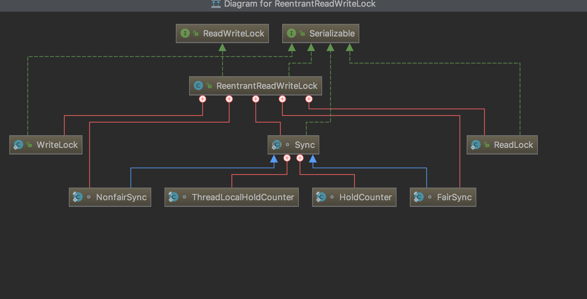
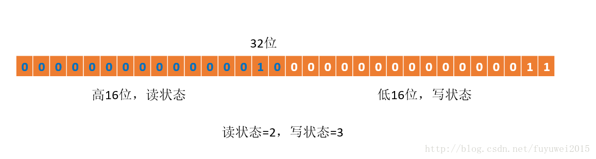

## [原文](https://blog.csdn.net/patrickyoung6625/article/details/44960371)


## [原文2](https://blog.csdn.net/fuyuwei2015/article/details/72597192)


## [原文3](http://caoxyemail.iteye.com/blog/2129840)


# ReentrantReadWriteLock原理分析 


ReentrantReadWriteLock顾名思义是可重入的读写锁，允许多个读线程获得ReadLock，
但只允许一个写线程获得WriteLock。

ReentrantReadWriteLock(简称RRWL)的实现也是通过AQS来实现的，它的内部也与一个Sync类，
继承自AQS，读写锁都是依赖它来实现。
在RRWL内部有两个类来分别实现读锁和写锁，ReadLock和WriteLock。


- 1.ReentrantReadWriteLock类图



- 2.ReentrantReadWriteLock内部定义了static abstract Sync类，它继承自AQS。


- 3.ReentrantReadWriteLock提供的ReadLock是共享的，而WriteLock是独占的。
于是Sync类同时实现了AQS中独占和共享模式的抽象方法(tryAcquire/tryAcquireShared等)，
用同一个等待队列来维护读/写排队线程，
而用一个32位int state标示和记录读/写锁重入次数--这里要实现读锁和写锁，
只有一个状态怎么办？
Doug Lea是这么做的，它把状态的高16位用作读锁，记录所有读锁重入次数之和，
低16位用作写锁，记录写锁重入次数。所以无论是读锁还是写锁最多只能被持有65535次。


- 4.FairSync和NonfairSync继承自Sync类，实现了公平/非公平策略。


## 读写锁的实现原理分析

- 读写状态的设计
读写锁同样依赖自定义同步器来实现同步功能，而读写状态就是其同步器的同步状态。
回想ReentrantLock中自定义同步器的实现，同步状态表示锁被一个线程重复获取的次数，
而读写锁的自定义同步器需要在同步状态（一个整型变量）上维护多个读线程和一个写线程的状 
态，使得该状态的设计成为读写锁实现的关键。
如果在一个整型变量上维护多种状态，就一定需要“按位切割使用”这个变量，
读写锁将变量切分成了两个部分，高16位表示读，低16位表示写，划分方式如下图所示 




当前同步状态表示一个线程已经获取了写锁，且重进入了两次，同时也连续获取了两次读锁。
读写锁是如何迅速确定读和写各自的状态呢？答案是通过位运算。
假设当前同步状态值为S，写状态等于S&0x0000FFFF（将高16位全部抹去），
读状态等于S>>>16（无符号补0右移16位）。
当写状态增加1时，等于S+1，当读状态增加1时，等于S+(1<<16)，也就是S+0x00010000。
根据状态的划分能得出一个推论：S不等于0时，
当写状态（S&0x0000FFFF）等于0时，则读状态（S>>>16）大于0，即读锁已被获取。


### Sync类
    
在读写锁中最重要的就是Sync类，它继承自AQS，
还记得吗，AQS使用一个int型来保存状态，状态在这里就代表锁，
它提供了获取和修改状态的方法。可是，这里要实现读锁和写锁，只有一个状态怎么办？
Doug Lea是这么做的，它把状态的高16位用作读锁，低16位用作写锁，
所以无论是读锁还是写锁最多只能被持有65535次。所以在判断读锁和写锁的时候，需要进行位运算：

（1）由于读写锁共享状态，所以状态不为0，只能说明是有锁，可能是读锁，也可能是写锁；

（2）读锁是高16为表示的，所以读锁加1，就是状态的高16位加1，
低16位不变，所以要加的不是1，而是2^16，减一同样是这样。

（3）写锁用低16位表示，要获得写锁的次数，要用状态&2^16-1，结果的高16位全为0，
低16位就是写锁被持有的次数。

在Sync中还有几个属性，会在后面的代码中用到。

```java
** 实现ReentrantReadWriteLock的同步器，分别用子类来实现公平和非公平策略 */  
   abstract static class Sync extends AbstractQueuedSynchronizer {  
       private static final long serialVersionUID = 6317671515068378041L;  
  
       //最多支持65535个写锁和65535个读锁；低16位表示写锁计数，高16位表示持有读锁的线程数  
       static final int SHARED_SHIFT   = 16;  
       //由于读锁用高位部分，读锁个数加1，其实是状态值加 2^16  
       static final int SHARED_UNIT    = (1 << SHARED_SHIFT);  
       static final int MAX_COUNT      = (1 << SHARED_SHIFT) - 1;  
       /**写锁的掩码，用于状态的低16位有效值 */  
       static final int EXCLUSIVE_MASK = (1 << SHARED_SHIFT) - 1;  
  
       /** 读锁计数，当前持有读锁的线程数，c的高16位 */  
       static int sharedCount(int c)    { return c >>> SHARED_SHIFT; }  
       /** 写锁的计数，也就是它的重入次数,c的低16位*/  
       static int exclusiveCount(int c) { return c & EXCLUSIVE_MASK; }  
  
       /** 
        * 每个线程持有读锁的计数 
        */  
       static final class HoldCounter {  
           int count = 0;  
           //使用id而不是引用是为了避免保留垃圾。注意这是个常量。  
           final long tid = Thread.currentThread().getId();  
       }  
  
       /** 
        * 采用继承是为了重写 initialValue 方法，这样就不用进行这样的处理： 
        * 如果ThreadLocal没有当前线程的计数，则new一个，再放进ThreadLocal里。 
        * 可以直接调用 get。 
        * */  
       static final class ThreadLocalHoldCounter  
           extends ThreadLocal<HoldCounter> {  
           public HoldCounter initialValue() {  
               return new HoldCounter();  
           }  
       }  
  
       /** 
        * 当前线程持有的可重入读锁的数量，仅在构造方法和readObject(反序列化) 
        * 时被初始化，当持有锁的数量为0时，移除此对象。 
        */  
       private transient ThreadLocalHoldCounter readHolds;  
  
       /** 
        * 最近一个成功获取读锁的线程的计数。这省却了ThreadLocal查找， 
        * 通常情况下，下一个释放线程是最后一个获取线程。这不是 volatile 的， 
        * 因为它仅用于试探的，线程进行缓存也是可以的 
        * （因为判断是否是当前线程是通过线程id来比较的）。 
        */  
       private transient HoldCounter cachedHoldCounter;  
      
       /**firstReader是第一个获得读锁的线程； 
        * firstReaderHoldCount是firstReader的重入计数； 
        * 更准确的说，firstReader是最后一个把共享计数从0改为1，并且还没有释放锁。 
        * 如果没有这样的线程，firstReader为null; 
        * firstReader不会导致垃圾堆积，因为在tryReleaseShared中将它置空了，除非 
        * 线程异常终止，没有释放读锁。 
        *  
        * 跟踪无竞争的读锁计数时，代价很低 
        */  
       private transient Thread firstReader = null;  
       private transient int firstReaderHoldCount;  
  
       Sync() {  
           readHolds = new ThreadLocalHoldCounter();  
           setState(getState()); // ensures visibility of readHolds  
       }  
```

它的两个子类，FairSync和NonFairSync比较简单，
它们就是决定在某些情况下读锁或者写锁是否需要阻塞，通过两个方法的返回值决定：

```java
final boolean writerShouldBlock()；//写锁是否需要阻塞
```

```java
final boolean readerShouldBlock()；//读锁是否需要阻塞
```


### 获取读锁

读锁是共享锁，同一时刻可以被多个线程获得，下面是获得读锁的代码：
```java
/** 
 * 获取读锁，如果写锁不是由其他线程持有，则获取并立即返回； 
 * 如果写锁被其他线程持有，阻塞，直到读锁被获得。 
 */  
public void lock() {  
    sync.acquireShared(1);  
}  
//ASQ的acquireShared  
/** 
 * 以共享模式获取对象，忽略中断。通过至少先调用一次 tryAcquireShared(int)  
 * 来实现此方法，并在成功时返回。否则在成功之前，一直调用 tryAcquireShared(int) 
 *  将线程加入队列，线程可能重复被阻塞或不被阻塞。 
 */  
public final void acquireShared(int arg) {  
    if (tryAcquireShared(arg) < 0)  
        doAcquireShared(arg);  
}  
//Sync中的tryAcquireShared  
protected final int tryAcquireShared(int unused) {  
            Thread current = Thread.currentThread();  
            int c = getState();  
            //持有写锁的线程可以获得读锁  
            if (exclusiveCount(c) != 0 &&  
                getExclusiveOwnerThread() != current)  
                return -1;//写锁被占用，且不是由当前线程持有，返回-1  
            //执行到这里表明：写锁可用，或者写锁由当前线程持有  
            //获得读锁的数量  
            int r = sharedCount(c);  
              
            /** 如果不用阻塞，且没有溢出，则使用CAS修改状态，并且修改成功 */  
            if (!readerShouldBlock() &&  
                r < MAX_COUNT &&  
                compareAndSetState(c, c + SHARED_UNIT)) {//修改高16位的状态，所以要加上2^16  
                //这是第一个占有读锁的线程，设置firstReader  
                if (r == 0) {  
                    firstReader = current;  
                    firstReaderHoldCount = 1;  
                } else if (firstReader == current) {//重入计数加1  
                    firstReaderHoldCount++;  
                } else {  
                    // 非 firstReader 读锁重入计数更新  
                    //将cachedHoldCounter设置为当前线程  
                    HoldCounter rh = cachedHoldCounter;  
                    if (rh == null || rh.tid != current.getId())  
                        cachedHoldCounter = rh = readHolds.get();  
                    else if (rh.count == 0)  
                        readHolds.set(rh);  
                    rh.count++;  
                }  
                return 1;  
            }  
            //获取读锁失败，放到循环里重试  
            return fullTryAcquireShared(current);  
        }  
```

重点关注Sync中的tryAcquireShared(int)，注意，在所有的读写锁中，
获取锁和释放锁每次都是一个计数行为，锁其计数都说是1，
而在获得读锁的过程中，参数根本就没有意义。上面的代码包含的逻辑：

（1）如果当前写锁被其他线程持有，则获取读锁失败；

（2）写锁空闲，或者写锁被当前线程持有（写锁可降级为读锁），
在公平策略下，它可能需要阻塞，那么tryAcquireShared()就可能失败，则需要进入队列等待；
如果是非公平策略，会尝试获取锁，使用CAS修改状态，修改成功，
则获得读锁，否则也会进入同步队列等待；

（3）进入同步队列后，就是由AQS来完成唤醒。

### 释放读锁

一般来说，释放锁比获取锁要容易一些，看一下释放读锁的代码：

```java
protected final boolean tryReleaseShared(int unused) {  
        //将当前线程的读锁计数器的值减1  
           Thread current = Thread.currentThread();  
           /** 
            * 当前线程是第一个获取到锁的，如果此线程要释放锁了，则firstReader置空 
            * 否则，将线程持有的锁计数减1 
            */  
           if (firstReader == current) {  
               // assert firstReaderHoldCount > 0;  
               if (firstReaderHoldCount == 1)  
                   firstReader = null;  
               else  
                   firstReaderHoldCount--;  
           } else {  
               HoldCounter rh = cachedHoldCounter;  
               //如果cachedHoldCounter为空，或者不等于当前线程  
               if (rh == null || rh.tid != current.getId())  
                   rh = readHolds.get();  
               int count = rh.count;  
               if (count <= 1) {  
                   readHolds.remove();  
                   if (count <= 0)//如果没有持有读锁，释放是非法的  
                       throw unmatchedUnlockException();  
               }  
               --rh.count;  
           }  
           //有可能其他线程也在释放读锁，所以要确保释放成功  
           for (;;) {  
               int c = getState();  
               int nextc = c - SHARED_UNIT;//高16位-1  
               if (compareAndSetState(c, nextc))  
                // 释放读锁对其他读线程没有任何影响，  
                   // 但可以允许等待的写线程继续，如果读锁、写锁都空闲。  
                   return nextc == 0;  
           }  
       }  

```

释放读锁很简单，就是把状态的高16位减1，同时把当前线程持有锁的计数减1。
在释放的过程中，其他线程可能也在释放读锁，所以修改状态有可能失败，
把修改状态放到循环里做，直到成功为止。
写锁的获取


```java
protected final boolean tryAcquire(int acquires) {  
           Thread current = Thread.currentThread();  
           //获取状态，是读写锁共有的  
           int c = getState();  
           //写锁被持有的次数，通过与低16位做与操作得到  
           int w = exclusiveCount(c);  
           //c!=0，说明存在锁，可能是读锁，也可能是写锁  
           if (c != 0) {  
               // c!=0,w==0,说明读锁存在  
            //w != 0 && current != getExclusiveOwnerThread() 表示其他线程获取了写锁。  
               if (w == 0 || current != getExclusiveOwnerThread())  
                   return false;  
               //如果超过了最大限制，则抛出异常  
               if (w + exclusiveCount(acquires) > MAX_COUNT)  
                   throw new Error("Maximum lock count exceeded");  
                 
               //执行到这里，说明存在写锁，且由当前线程持有  
               // 重入计数  
               setState(c + acquires);  
               return true;  
           }  
           //执行到这里，说明不存在任何锁  
           //WriterShouldBlock留给子类实现公平策略  
           //使用CAS修改状态  
           if (writerShouldBlock() ||  
               !compareAndSetState(c, c + acquires))  
               return false;  
             
           setExclusiveOwnerThread(current);  
           return true;  
       }  
```


其包含的逻辑：
（1）首先获得状态，保存到c中，获得写锁的计数保存到w中；
这个时候需要根据c的值来判断是否存在锁

（2）如果c!=0，说明存在锁，如果w==0，说明存在读锁，获取写锁不能成功；
如果w!=0，但是写锁是由其他线程持有的，那么当前线程获取写锁也不能成功；
在这种情况下（存在写锁），只有写锁是由当前线程持有的，才能获得成功；

（3）如果c==0，说明不存在锁，如果是公平策略，还需要进入同步队列；
如果是非公平策略，会尝试获得写锁。

### 释放写锁

```java
protected final boolean tryRelease(int releases) {  
            if (!isHeldExclusively())  
                throw new IllegalMonitorStateException();  
            int nextc = getState() - releases;  
            boolean free = exclusiveCount(nextc) == 0;  
            //如果锁是可用的  
            if (free)  
                setExclusiveOwnerThread(null);  
            setState(nextc);  
            return free;  
        } 
```

释放写锁很简答，就是状态的低16为减1，如果为0，说明写锁可用，返回true，如果不为0，
说明当前线程仍然持有写锁，返回false;


## ReentrantReadWriteLock特性


### 公平性

非公平锁（默认）,为了防止写线程饿死，
规则是：当等待队列头部结点是独占模式（即要获取写锁的线程）时，
只有获取独占锁线程可以抢占，而试图获取共享锁的线程必须进入队列阻塞；
当队列头部结点是共享模式（即要获取读锁的线程）时，试图获取独占和共享锁的线程都可以抢占。

公平锁，利用AQS的等待队列，线程按照FIFO的顺序获取锁，因此不存在写线程一直等待的问题。

### 重入性
读写锁均是可重入的，读/写锁重入次数保存在了32位int state的高/低16位中。
而单个读线程的重入次数，则记录在ThreadLocalHoldCounter类型的readHolds里。

### 锁降级

写线程获取写入锁后可以获取读取锁，然后释放写入锁，这样就从写入锁变成了读取锁，从而实现锁降级。

### 锁获取中断

读取锁和写入锁都支持获取锁期间被中断。

### 条件变量

写锁提供了条件变量(Condition)的支持，这个和独占锁ReentrantLock一致，
但是读锁却不允许，
调用readLock().newCondition()会抛出UnsupportedOperationException异常。


