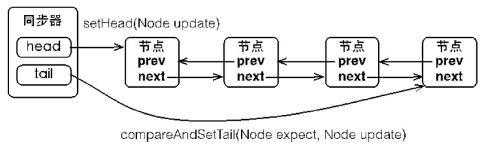
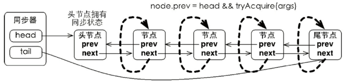

[原文1](https://www.cnblogs.com/noahsark/p/sbstract_queued_synchronizer.html)
[原文2](https://www.jianshu.com/p/dbe18cea28e7)
[原文3]()


# AbstractQueuedSynchronizer 详解

## 什么是AQS？

AQS的全称是AbstractQueuedSynchronizer，即抽象队列同步器，其底层是volatile与CAS，
而其上层则是基于该抽象类构建的许多并发组件，
如ReentrantLock、Semaphore等。
AQS自身实现了一些基本方法，还剩余一些面向上层的方法，这些方法需要继承该抽象类的同步组件去实现。


其它同步器实现，如ReentrantLock类，ReentrantReadWriteLock类，Semaphore类（计数信号量），
CountDownLatch类，FutureTask类和SynchronousQueues类都是基于它来实现的
（各个实现类在内部持有了一个实现AQS的内部类，然后通过代理对外提供同步器的功能）。
AQS会维护一个同步状态（state），在互斥和共享语义下有不同的含义，
在AQS内部，采用CAS技术实现同步状态原子性的管理，
而对同步状态的更改逻辑（什么情况下进行更改）则由子类来实现，
正是由于这点，产生了不同语义的同步器；
另外，AQS根据同步状态的值将对调用线程进行阻塞和解除阻塞的操作；
最后，AQS提供了一个FIFO队列，将阻塞的线程压入队列，进行排队管理，然后再按照顺序出队列。
总之，AQS框架为同步状态的原子性管理、线程的阻塞和解除阻塞以及排队提供了一种通用机制。


### [Volatile原理]()

### [CAS原理]()


AQS最核心的数据结构是一个volatile int state 和 一个FIFO线程等待对列。
state代表共享资源的数量，如果是互斥访问，一般设置为1，
而如果是共享访问，可以设置为N（N为可共享线程的个数）；
而线程等待队列是一个双向链表，无法立即获得锁而进入阻塞状态的线程会加入队列的尾部。
当然对state以及队列的操作都是采用了volatile + CAS + 自旋的操作方式，
采用的是乐观锁的概念。

AQS有两种实现方式，一种是独占方式，另一种是共享方式（shared），取决于用户实现什么方法。

## 概述

Java的内置锁一直都是备受争议的，在JDK 1.6之前，
synchronized这个重量级锁其性能一直都是较为低下，
虽然在1.6后，进行大量的锁优化策略,但是与Lock相比synchronized还是存在一些缺陷的：
虽然synchronized提供了便捷性的隐式获取锁释放锁机制（基于JVM机制），
但是它却缺少了获取锁与释放锁的可操作性，可中断、超时获取锁，
且它为独占式在高并发场景下性能大打折扣。

AQS，AbstractQueuedSynchronizer，即队列同步器。
它是构建锁或者其他同步组件的基础框架（如ReentrantLock、ReentrantReadWriteLock、Semaphore等），
JUC并发包的作者（Doug Lea）期望它能够成为实现大部分同步需求的基础。
它是JUC并发包中的核心基础组件
 

AQS解决了子类实现同步器时涉及当的大量细节问题，
例如获取同步状态、FIFO同步队列。基于AQS来构建同步器可以带来很多好处。
它不仅能够极大地减少实现工作，而且也不必处理在多个位置上发生的竞争问题。

AQS的主要使用方式是继承，子类通过继承同步器并实现它的抽象方法来管理同步状态。

AQS使用一个int类型的成员变量state来表示同步状态，当state>0时表示已经获取了锁，
当state = 0时表示释放了锁。它提供了三个方法（getState()、setState(int newState)、
compareAndSetState(int expect,int update)）来对同步状态state进行操作，
当然AQS可以确保对state的操作是安全的。

AQS通过内置的FIFO同步队列来完成资源获取线程的排队工作，
如果当前线程获取同步状态失败（锁）时，
AQS则会将当前线程以及等待状态等信息构造成一个节点（Node）并将其加入同步队列，
同时会阻塞当前线程，当同步状态释放时，则会把节点中的线程唤醒，使其再次尝试获取同步状态。


AQS可以实现独占锁和共享锁，RenntrantLock实现的是独占锁，
ReentrantReadWriteLock实现的是独占锁和共享锁，CountDownLatch实现的是共享锁。

- 独占式exclusive。保证一次只有一个线程可以经过阻塞点，只有一个线程可以获取到锁。

- 共享式shared。可以允许多个线程阻塞点，可以多个线程同时获取到锁。

下面我们通过源码来分析下AQS的实现原理

## AbstractQueuedSynchronizer类结构

```java
public abstract class AbstractQueuedSynchronizer
    extends AbstractOwnableSynchronizer
    implements java.io.Serializable {
    protected AbstractQueuedSynchronizer() { }
    //同步器队列头结点
    private transient volatile Node head;
    //同步器队列尾结点
    private transient volatile Node tail;
    //同步状态（打的那个state为0时，无锁，当state>0时说明有锁。）
    private volatile int state;
    //获取锁状态
    protected final int getState() {
        return state;
    }
    //设置锁状态
    protected final void setState(int newState) {
        state = newState;
    }
    ......

``` 


通过AQS的类结构我们可以看到它内部有一个队列和一个state的int变量。
队列：通过一个双向链表实现的队列来存储等待获取锁的线程。
state：锁的状态。
head、tail和state 都是volatile类型的变量，volatile可以保证多线程的内存可见性。

同步队列的基本结构如下：



同步队列

### 同步器队列Node元素的类结构如下：

```java
static final class Node {
    static final Node SHARED = new Node();
    static final Node EXCLUSIVE = null;
    //表示当前的线程被取消；
    static final int CANCELLED =  1;
    //表示当前节点的后继节点包含的线程需要运行，也就是unpark；
    static final int SIGNAL    = -1;
    //表示当前节点在等待condition，也就是在condition队列中；
    static final int CONDITION = -2;
    //表示当前场景下后续的acquireShared能够得以执行；
    static final int PROPAGATE = -3;
    //表示节点的状态。默认为0，表示当前节点在sync队列中，等待着获取锁。
    //其它几个状态为：CANCELLED、SIGNAL、CONDITION、PROPAGATE
    volatile int waitStatus;
    //前驱节点
    volatile Node prev;
    //后继节点
    volatile Node next;
    //获取锁的线程
    volatile Thread thread;
    //存储condition队列中的后继节点。
    Node nextWaiter;
    ......
}

```

从Node结构prev和next节点可以看出它是一个双向链表，waitStatus存储了当前线程的状态信息

waitStatus

- CANCELLED，值为1，表示当前的线程被取消；

- SIGNAL，值为-1，表示当前节点的后继节点包含的线程需要运行，也就是unpark；

- CONDITION，值为-2，表示当前节点在等待condition，也就是在condition队列中；

- PROPAGATE，值为-3，表示当前场景下后续的acquireShared能够得以执行；

- 值为0，表示当前节点在sync队列中，等待着获取锁。

下面我们通过以下五个方面来介绍AQS是怎么实现的锁的获取和释放的

- 1.独占式获得锁
- 2.独占式释放锁
- 3.共享式获得锁
- 4.共享式释放锁
- 5.独占超时获得锁

### 1.独占式获得锁
acquire方法代码如下：
```java
public final void acquire(int arg) {
        //尝试获得锁，获取不到则加入到队列中等待获取
        if (!tryAcquire(arg) &&
            acquireQueued(addWaiter(Node.EXCLUSIVE), arg))
            selfInterrupt();
    }

```

- 首先执行tryAcquire方法，尝试获得锁。

- 如果获取失败则进入addWaiter方法，构造同步节点（独占式Node.EXCLUSIVE），
将该节点添加到同步队列尾部，并返回此节点，进入acquireQueued方法。

- acquireQueued方法，这个新节点死是循环的方式获取同步状态，
如果获取不到则阻塞节点中的线程，阻塞后的节点等待前驱节点来唤醒或阻塞线程被中断。


addWaiter方法代码如下：

```java
private Node addWaiter(Node mode) {
    Node node = new Node(Thread.currentThread(), mode);
    // Try the fast path of enq; backup to full enq on failure
    Node pred = tail;
    if (pred != null) {
        node.prev = pred;
        //将该节点添加到队列尾部
        if (compareAndSetTail(pred, node)) {
            pred.next = node;
            return node;
        }
    }
    //如果前驱节点为null，则进入enq方法通过自旋方式入队列
    enq(node);
    return node;
}
```
将构造的同步节点加入到同步队列中

- 使用链表的方式把该Node节点添加到队列尾部，如果tail的前驱节点不为空（队列不为空），
则进行CAS添加到队列尾部。

- 如果更新失败（存在并发竞争更新），则进入enq方法进行添加

enq方法代码如下：
```java
    private Node enq(final Node node) {
        for (;;) {
            Node t = tail;
            if (t == null) { // Must initialize
                //如果队列为空，则通过CAS把当前Node设置成头节点
                if (compareAndSetHead(new Node()))
                    tail = head;
            } else {
                node.prev = t;
                //如果队列不为空，则向队列尾部添加Node
                if (compareAndSetTail(t, node)) {
                    t.next = node;
                    return t;
                }
            }
        }
    }
```
该方法使用CAS自旋的方式来保证向队列中添加Node（同步节点简写Node）

- 如果队列为空，则把当前Node设置成头节点
- 如果队列不为空，则向队列尾部添加Node

acquireQueued方法代码如下：

```java
final boolean acquireQueued(final Node node, int arg) {  
    boolean failed = true;  
    try {  
        boolean interrupted = false;  
        for (;;) {  
            //找到当前节点的前驱节点
            final Node p = node.predecessor();  
            //检测p是否为头节点，如果是，再次调用tryAcquire方法 
            if (p == head && tryAcquire(arg)) {  
                //如果p节点是头节点且tryAcquire方法返回true。那么将当前节点设置为头节点。
                setHead(node);  
                p.next = null; // help GC  
                failed = false;  
                return interrupted;  
            }  
            //如果p节点不是头节点，或者tryAcquire返回false，说明请求失败。  
            //那么首先需要判断请求失败后node节点是否应该被阻塞，如果应该  
            //被阻塞，那么阻塞node节点，并检测中断状态。  
            if (shouldParkAfterFailedAcquire(p, node) &&  
                parkAndCheckInterrupt())  
                //如果有中断，设置中断状态。  
                interrupted = true;  
        }  
    } finally {  
        if (failed) //最后检测一下如果请求失败(异常退出)，取消请求。  
            cancelAcquire(node);  
    }  
}
```
在acquireQueued方法中，当前线程通过自旋的方式来尝试获取同步状态，

- 如果当前节点的前驱节点头节点才能尝试获得锁，如果获得成功，
则把当前线程设置成头结点，把之前的头结点从队列中移除，等待垃圾回收（没有对象引用）

- 如果获取锁失败则进入shouldParkAfterFailedAcquire方法中检测当前节点是否可以被安全的挂起（阻塞），
如果可以安全挂起则进入parkAndCheckInterrupt方法，把当前线程挂起,并检查刚线程是否执行了interrupted方法。
通过上面的代码我们可以发现AQS内部的同步队列是FIFO的方式存取的。节点自旋获取同步状态的行为如下图所示



节点自旋获取同步状态


shouldParkAfterFailedAcquire方法代码如下：
```java
private static boolean shouldParkAfterFailedAcquire(Node pred, Node node) {
        //获得前驱节点状态
        int ws = pred.waitStatus;
        if (ws == Node.SIGNAL)
           //如果前驱节点状态为SIGNAL，当前线程则可以阻塞。
           return true;
        if (ws > 0) {
            do {
                //判断如果前驱节点状态为CANCELLED，那就一直往前找，直到找到最近一个正常等待的状态
                node.prev = pred = pred.prev;
            } while (pred.waitStatus > 0);
            //并将当前Node排在它的后边。
            pred.next = node;
        } else {
            //如果前驱节点正常，则修改前驱节点状态为SIGNAL
            compareAndSetWaitStatus(pred, ws, Node.SIGNAL);
        }
        return false;
    }
```

#### 节点的状态如下表：
状态	| 值	| 说明
|---|---|---
CANCELLED |	1 |	等待超时或者中断，需要从同步队列中取消
SIGNAL	  |-1 |	后继节点出于等待状态，当前节点释放锁后将会唤醒后继节点
CONDITION |-2 |	节点在等待队列中，节点线程等待在Condition上，<br> 其它线程对Condition调用signal()方法后，<br> 该节点将会从等待同步队列中移到同步队列中，然后等待获取锁。
PROPAGATE |-3 |	表示下一次共享式同步状态获取将会无条件地传播下去
INITIAL   |	0 |	初始状态

- 首先获取前驱节点的状态ws

- 如果ws为SIGNAL则表示可以被前驱节点唤醒，当前线程就可以挂起，
等待前驱节点唤醒，返回true（可以挂起）

- 如果ws>0说明，前驱节点取消了，并循环查找此前驱节点之前所有连续取消的节点。

- 并返回false（不能挂起）。

- 尝试将当前节点的前驱节点的等待状态设为SIGNAL

parkAndCheckInterrupt方法代码如下：
```java
private final boolean parkAndCheckInterrupt() {
    //阻塞当前线程
    LockSupport.park(this);
    //判断是否中断来唤醒的
    return Thread.interrupted();
}
```
调用LockSupport.park(this);进行阻塞当前线程
如果被唤醒判断是不是被中断的（唤醒有两种可能性，一种是unpark，一种是interrupter）

### 2. 独占式释放锁
```java
release方法代码如下：
    public final boolean release(int arg) {
        //尝试释放锁
        if (tryRelease(arg)) {
            Node h = head;
            if (h != null && h.waitStatus != 0)
                //唤醒后继节点
                unparkSuccessor(h);
            return true;
        }
        return false;
    }
```
tryRelease(int arg) 方法应该由实现AQS的子类来实现具体的逻辑。

首先通过tryRelease方法释放锁如果释放锁成功，执行第2步。
通过调用unparkSuccessor() 方法来唤醒头结点的后继节点。
该方法内部是通过LockSupport.unpark(s.thread);来唤醒后继节点的。

### 3. 共享式获得锁
acquireShared方法代码如下：
```java
public final void acquireShared(int arg) {
    //尝试获取的锁，如果获取失败执行doAcquireShared方法。
    if (tryAcquireShared(arg) < 0)
        doAcquireShared(arg);
}
```
tryAcquireShared()尝试获取锁，如果获取失败则通过doAcquireShared()进入等待队列，
直到获取到资源为止才返回。

这里tryAcquireShared()需要自定义同步器去实现。
AQS中规定：负值代表获取失败，非负数标识获取成功。

doAcquireShared方法代码如下：
```java
private void doAcquireShared(int arg) {
    //构建共享Node
    final Node node = addWaiter(Node.SHARED);
    boolean failed = true;
    try {
        boolean interrupted = false;
        for (;;) {
            //获取前驱节点
            final Node p = node.predecessor();
            //如果是头节点进行尝试获得锁
            if (p == head) {
                //如果返回值大于等于0，则说明获得锁
                int r = tryAcquireShared(arg);
                if (r >= 0) {
                    //当前节点设置为队列头，并
                    setHeadAndPropagate(node, r);
                    p.next = null; // help GC
                    if (interrupted)
                        selfInterrupt();
                    failed = false;
                    return;
                }
            }
            if (shouldParkAfterFailedAcquire(p, node) &&
                parkAndCheckInterrupt())
                interrupted = true;
        }
    } finally {
        if (failed)
            cancelAcquire(node);
    }
}
```
在acquireQueued方法中，当前线程也通过自旋的方式来尝试获取同步状态，同独享式获得锁一样

如果当前节点的前驱节点头节点才能尝试获得锁，如果获得成功，
则把当前线程设置成头结点，把之前的头结点从队列中移除，等待垃圾回收（没有对象引用）
如果获取锁失败则进入shouldParkAfterFailedAcquire方法中检测当前节点是否可以被安全的挂起（阻塞），
如果可以安全挂起则进入parkAndCheckInterrupt方法，
把当前线程挂起,并检查刚线程是否执行了interrupted方法。
setHeadAndPropagate方法代码如下：
```java
private void setHeadAndPropagate(Node node, int propagate) {
        Node h = head; // Record old head for check below
        setHead(node);
        //如果propagate >0,说明共享锁还有可以进行获得锁，继续唤醒下一个节点
        if (propagate > 0 || h == null || h.waitStatus < 0 ||
            (h = head) == null || h.waitStatus < 0) {
            Node s = node.next;
            if (s == null || s.isShared())
                doReleaseShared();
        }
    }
```
设置当前节点为头结点，并调用了doReleaseShared()方法，
acquireShared方法最终调用了release方法，得看下为什么。
原因其实也很简单，shared模式下是允许多个线程持有一把锁的，
其中tryAcquire的返回值标志了是否允许其他线程继续进入。
如果允许的话，需要唤醒队列中等待的线程。
其中doReleaseShared方法的逻辑很简单，就是唤醒后继线程。

因此acquireShared的主要逻辑就是尝试加锁，如果允许其他线程继续加锁，
那么唤醒后继线程，如果失败，那么入队阻塞等待。

### 4. 共享式释放锁
```java
releaseShared方法代码如下：
public final boolean releaseShared(int arg) {
    if (tryReleaseShared(arg)) {
        doReleaseShared();
        return true;
    }
    return false;
}
```
tryReleaseShared(int arg) 方法应该由实现AQS的子类来实现具体的逻辑。

首先通过tryReleaseShared方法释放锁如果释放锁成功，执行第2步。
通过调用unparkSuccessor() 方法来唤醒头结点的后继节点。
该方法内部是通过LockSupport.unpark(s.thread);来唤醒后继节点的。

doReleaseShared方法代码如下：

```java
private void doReleaseShared() {
    for (;;) {
        // 获取队列的头节点
        Node h = head;
        // 如果头节点不为null，并且头节点不等于tail节点。
        if (h != null && h != tail) {
            // 获取头节点对应的线程的状态
            int ws = h.waitStatus;
            // 如果头节点对应的线程是SIGNAL状态，则意味着“头节点的下一个节点所对应的线程”需要被unpark唤醒。
            if (ws == Node.SIGNAL) {
                // 设置“头节点对应的线程状态”为空状态。失败的话，则继续循环。
                if (!compareAndSetWaitStatus(h, Node.SIGNAL, 0))
                    continue;
                // 唤醒“头节点的下一个节点所对应的线程”。
                unparkSuccessor(h);
            }
            // 如果头节点对应的线程是空状态，则设置“尾节点对应的线程所拥有的共享锁”为其它线程获取锁的空状态。
            else if (ws == 0 &&
                     !compareAndSetWaitStatus(h, 0, Node.PROPAGATE))
                continue;                // loop on failed CAS
        }
        // 如果头节点发生变化，则继续循环。否则，退出循环。
        if (h == head)                   // loop if head changed
            break;
    }
}
```

该方法主要是唤醒后继节点。对于能够支持多个线程同时访问的并发组件（比如Semaphore），
它和独占式主要区别在于tryReleaseShared(int arg)方法必须确保同步状态（或者资源数）
线程安全释放，一般是通过循环和CAS来保证的，因为释放同步状态的操作会同时来自多个线程。

### 5. 独占超时获得锁
doAcquireNanos方法代码如下：
```java
private boolean doAcquireNanos(int arg, long nanosTimeout)
        throws InterruptedException {
    if (nanosTimeout <= 0L)
        return false;
    //计算出超时时间点
    final long deadline = System.nanoTime() + nanosTimeout;
    final Node node = addWaiter(Node.EXCLUSIVE);
    boolean failed = true;
    try {
        for (;;) {
            final Node p = node.predecessor();
            if (p == head && tryAcquire(arg)) {
                setHead(node);
                p.next = null; // help GC
                failed = false;
                return true;
            }
            //计算剩余超时时间，超时时间点deadline减去当前时间点System.nanoTime()得到还应该睡眠的时间
            nanosTimeout = deadline - System.nanoTime();
            //如果超时，返回false，获取锁失败
            if (nanosTimeout <= 0L)
                return false;
            //判断是否需要阻塞当前线程
            //如果需要，在判断当前剩余纳秒数是否大于1000
            if (shouldParkAfterFailedAcquire(p, node) &&
                nanosTimeout > spinForTimeoutThreshold)
                //阻塞 nanosTimeout纳秒数
                LockSupport.parkNanos(this, nanosTimeout);
            if (Thread.interrupted())
                throw new InterruptedException();
        }
    } finally {
        if (failed)
            cancelAcquire(node);
    }
}
```

该方法在自旋过程中，当节点的前驱节点为头节点时尝试获取同步状态，
如果获取成功则从该方法返回，这个过程和独占式同步获取的过程类似，
但是在同步状态获取失败的处理上有所不同。如果当前线程获取同步状态失败，
则首先重新计算超时间隔nanosTimeout，
则判断是否超时（nanosTimeout小于等于0表示已经超时），
如果没有超时，则使当前线程等待nanosTimeout纳秒（当已到设置的超时时间，
该线程会从LockSupport.parkNanos(Object blocker,long nanos)方法返回）。

如果nanosTimeout小于等于spinForTimeoutThreshold（1000纳秒）时，将不会使该线程进行
超时等待，而是进入快速的自旋过程。原因在于，非常短的超时等待无法做到十分精确，如果
这时再进行超时等待，相反会让nanosTimeout的超时从整体上表现得反而不精确。因此，在超
时非常短的场景下，同步器会进入无条件的快速自旋。


