## [原文](https://www.jianshu.com/p/23b84ba9a498)

# ConcurrentHashMap的红黑树实现分析

知止而后有定，定而后能静，静而后能安，安而后能虑，虑而后能得

## 红黑树
红黑树是一种特殊的二叉树，主要用它存储有序的数据，提供高效的数据检索，时间复杂度为O(lgn)，
每个节点都有一个标识位表示颜色，红色或黑色，有如下5种特性：

- 1、每个节点要么红色，要么是黑色；
- 2、根节点一定是黑色的；
- 3、每个空叶子节点必须是黑色的；
- 4、如果一个节点是红色的，那么它的子节点必须是黑色的；
- 5、从一个节点到该节点的子孙节点的所有路径包含相同个数的黑色节点；

### 结构示意图

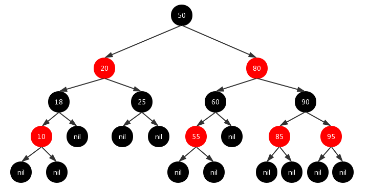

只要满足以上5个特性的二叉树都是红黑树，当有新的节点加入时，有可能会破坏其中一些特性，
需要通过左旋或右旋操作调整树结构，重新着色，使之重新满足所有特性。

## ConcurrentHashMap红黑树实现
《谈谈ConcurrentHashMap1.7和1.8的不同实现》一文中已经提到，在1.8的实现中，当一个链表中的元素达到8个时，
会调用treeifyBin()方法把链表结构转化成红黑树结构，实现如下：

```java
/**
 * Replaces all linked nodes in bin at given index unless table is
 * too small, in which case resizes instead.
 */
private final void treeifyBin(Node<K,V>[] tab, int index) {
    Node<K,V> b; int n, sc;
    if (tab != null) {
        if ((n = tab.length) < MIN_TREEIFY_CAPACITY)
            tryPresize(n << 1);
        else if ((b = tabAt(tab, index)) != null && b.hash >= 0) {
            synchronized (b) {
                if (tabAt(tab, index) == b) {
                    TreeNode<K,V> hd = null, tl = null;
                    for (Node<K,V> e = b; e != null; e = e.next) {
                        TreeNode<K,V> p =
                            new TreeNode<K,V>(e.hash, e.key, e.val,
                                              null, null);
                        if ((p.prev = tl) == null)
                            hd = p;
                        else
                            tl.next = p;
                        tl = p;
                    }
                    setTabAt(tab, index, new TreeBin<K,V>(hd));
                }
            }
        }
    }
}
```

从上述实现可以看出：并非一开始就创建红黑树结构，如果当前Node数组长度小于阈值MIN_TREEIFY_CAPACITY，
默认为64，先通过扩大数组容量为原来的两倍以缓解单个链表元素过大的性能问题。

## 红黑树构造过程

下面对红黑树的构造过程进行分析：
1、通过遍历Node链表，生成对应的TreeNode链表，其中TreeNode在实现上继承了Node类；
```java

class TreeNode<K,V> extends Node<K,V> {
    TreeNode<K,V> parent;  // red-black tree links
    TreeNode<K,V> left;
    TreeNode<K,V> right;
    TreeNode<K,V> prev;    
    // needed to unlink next upon deletion
    boolean red;
}

```
假设TreeNode链表如下，其中节点中的数值代表hash值：


2、根据TreeNode链表初始化TreeBin类对象，TreeBin在实现上同样继承了Node类，
所以初始化完成的TreeBin类对象可以保持在Node数组中；

```java
class TreeBin<K,V> extends Node<K,V> {
    TreeNode<K,V> root;
    volatile TreeNode<K,V> first;
    volatile Thread waiter;
    volatile int lockState;
    // values for lockState
    // set while holding write lock
    static final int WRITER = 1;
    // set when waiting for write lock
    static final int WAITER = 2; 
    // increment value for setting read lock
    static final int READER = 4; 
}

```

3、遍历TreeNode链表生成红黑树，一开始二叉树的根节点root为空，则设置链表中的第一个节点80为root，
并设置其red属性为false，因为在红黑树的特性1中，明确规定根节点必须是黑色的；

```java

for (TreeNode<K,V> x = b, next; x != null; x = next) {
    next = (TreeNode<K,V>)x.next;
    x.left = x.right = null;
    if (r == null) {
        x.parent = null;
        x.red = false;
        r = x;
    }
    ...
    
```
二叉树结构：


4、加入节点60，如果root不为空，则通过比较节点hash值的大小将新节点插入到指定位置，实现如下：
```java

K k = x.key;
int h = x.hash;
Class<?> kc = null;
for (TreeNode<K,V> p = r;;) {
    int dir, ph;
    K pk = p.key;
    if ((ph = p.hash) > h)
        dir = -1;
    else if (ph < h)
        dir = 1;
    else if ((kc == null &&
              (kc = comparableClassFor(k)) == null) ||
             (dir = compareComparables(kc, k, pk)) == 0)
        dir = tieBreakOrder(k, pk);
        TreeNode<K,V> xp = p;
    if ((p = (dir <= 0) ? p.left : p.right) == null) {
        x.parent = xp;
        if (dir <= 0)
            xp.left = x;
        else
            xp.right = x;
        r = balanceInsertion(r, x);
        break;
    }
}

```

其中x代表即将插入到红黑树的节点，p指向红黑树中当前遍历到的节点，从根节点开始递归遍历，x的插入过程如下：

1)、如果x的hash值小于p的hash值，则判断p的左节点是否为空，如果不为空，则把p指向其左节点，
并继续和p进行比较，如果p的左节点为空，则把x指向的节点插入到该位置；

2)、如果x的hash值大于p的hash值，则判断p的右节点是否为空，如果不为空，则把p指向其右节点，
并继续和p进行比较，如果p的右节点为空，则把x指向的节点插入到该位置；

3)、如果x的hash值和p的hash值相等，怎么办？
解决：首先判断节点中的key对象的类是否实现了Comparable接口，如果实现Comparable接口，
则调用compareTo方法比较两者key的大小，但是如果key对象没有实现Comparable接口，
或则compareTo方法返回了0，则继续调用tieBreakOrder方法计算dir值，tieBreakOrder方法实现如下：

```java
static int tieBreakOrder(Object a, Object b) {
    int d;
    if (a == null || b == null ||
        (d = a.getClass().getName().
         compareTo(b.getClass().getName())) == 0)
        d = (System.identityHashCode(a) <= System.identityHashCode(b) ?
             -1 : 1);
    return d;
}

```
最终比较key对象的默认hashCode()方法的返回值，因为System.identityHashCode(a)调用的是对象a默认的hashCode()；

插入节点60之后的二叉树：

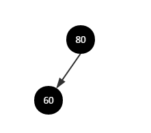

5、当有新节点加入时，可能会破坏红黑树的特性，需要执行balanceInsertion()方法调整二叉树，使之重新满足特性，
方法中的变量xp指向x的父节点，xpp指向xp父节点，xppl和xppr分别指向xpp的左右子节点，
balanceInsertion()方法首先会把新加入的节点设置成红色。

①、加入节点60之后，此时xp指向节点80，其父节点为空，直接返回。

```java
if ((xp = x.parent) == null) {
    x.red = false;
    return x;
}
else if (!xp.red || (xpp = xp.parent) == null)
    return root;

```
调整之后的二叉树：

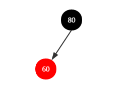


②、加入节点50，二叉树如下：


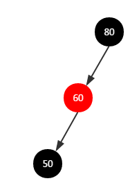

继续执行balanceInsertion()方法调整二叉树，此时节点50的父节点60是左儿子，走如下逻辑：

```java

if (xp == (xppl = xpp.left)) {
    if ((xppr = xpp.right) != null && xppr.red) {
        xppr.red = false;
        xp.red = false;
        xpp.red = true;
        x = xpp;
    }
    else {
        if (x == xp.right) {
            root = rotateLeft(root, x = xp);
            xpp = (xp = x.parent) == null ? null : xp.parent;
        }
        if (xp != null) {
            xp.red = false;
            if (xpp != null) {
                xpp.red = true;
                root = rotateRight(root, xpp);
            }
        }
    }
}

```
根据上述逻辑，把节点60设置成黑色，把节点80设置成红色，并对节点80执行右旋操作，右旋实现如下：


```java
static <K,V> TreeNode<K,V> rotateRight(TreeNode<K,V> root,
                                       TreeNode<K,V> p) {
    TreeNode<K,V> l, pp, lr;
    if (p != null && (l = p.left) != null) {
        if ((lr = p.left = l.right) != null)
            lr.parent = p;
        if ((pp = l.parent = p.parent) == null)
            (root = l).red = false;
        else if (pp.right == p)
            pp.right = l;
        else
            pp.left = l;
        l.right = p;
        p.parent = l;
    }
    return root;
}

```
右旋之后的红黑树如下：


③、加入节点70，二叉树如下：
 
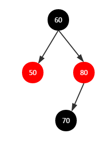

继续执行balanceInsertion()方法调整二叉树，此时父节点80是个右儿子，
节点70是左儿子，且叔节点50不为空，且是红色的，则执行如下逻辑：

```java

if (xppl != null && xppl.red) {
    xppl.red = false;
    xp.red = false;
    xpp.red = true;
    x = xpp;
}

```
此时二叉树如下

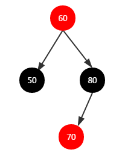

此时x指向xpp，即节点60，继续循环处理x，设置其颜色为黑色，最终二叉树如下：


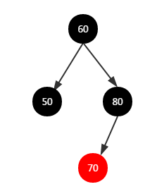

④、加入节点20，二叉树变化如下：

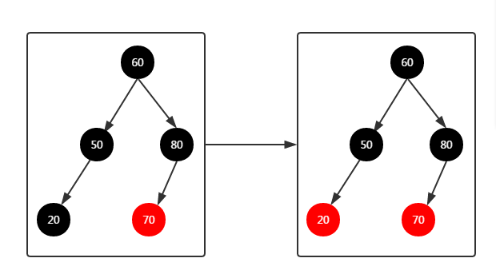

因为节点20的父节点50是一个黑色的节点，不需要进行调整；

⑤、加入节点65，二叉树变化如下：


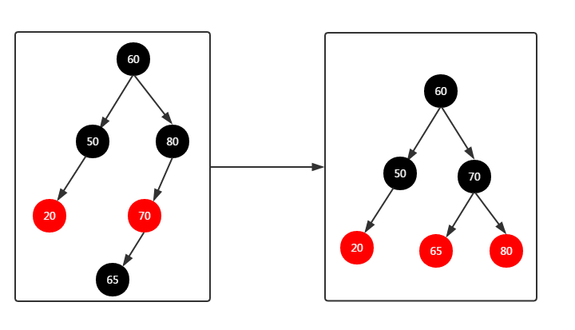

对节点80进行右旋操作。

⑥、加入节点40，二叉树变化如下：

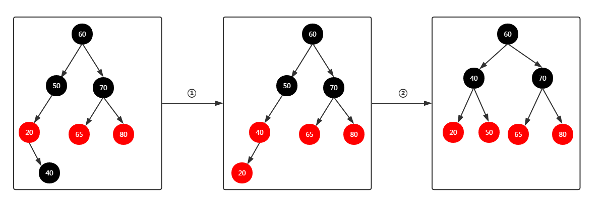

- 1、对节点20执行左旋操作；
- 2、对节点50执行右旋操作；

最后加入节点10，二叉树变化如下：

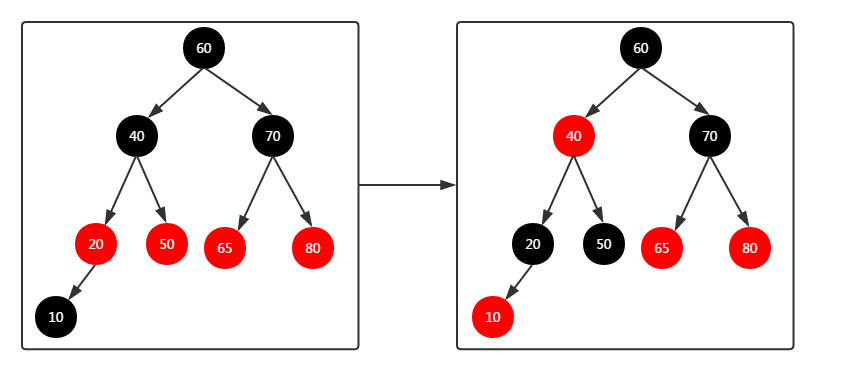

重新对节点进行着色，到此为止，红黑树已经构造完成；


 


 


 

 