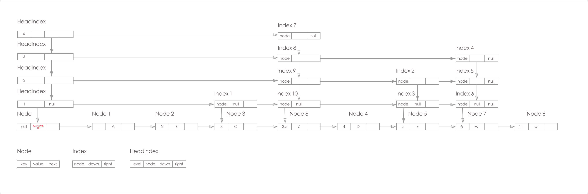
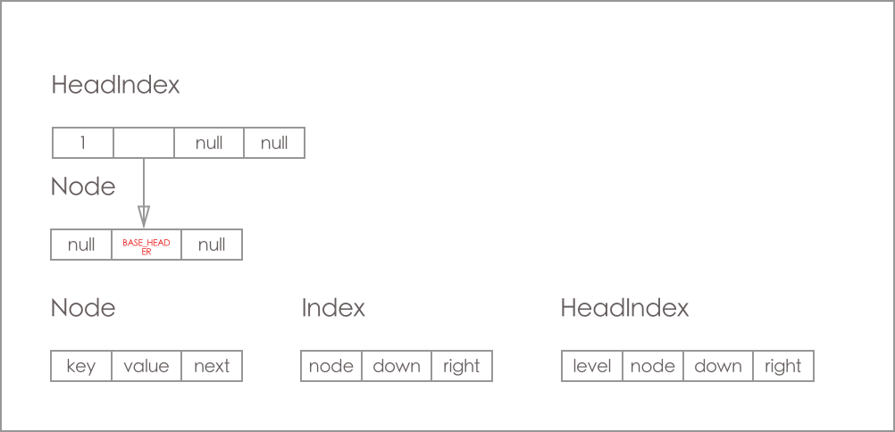
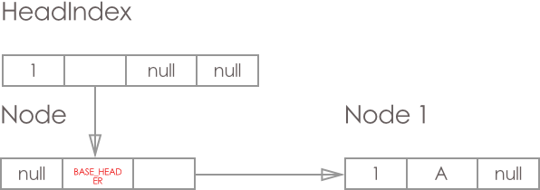
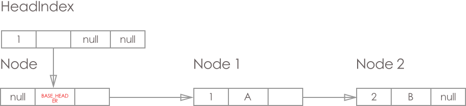
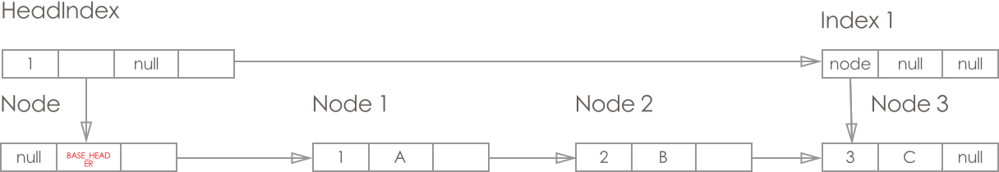
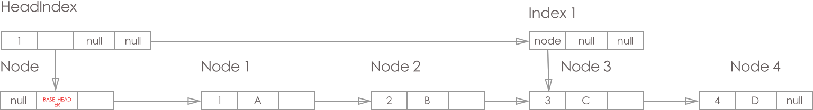
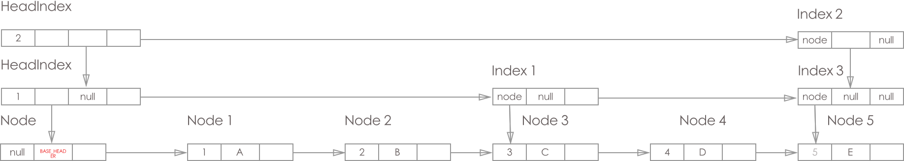
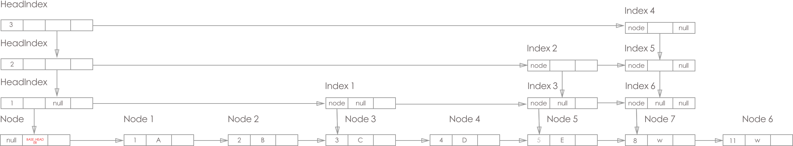
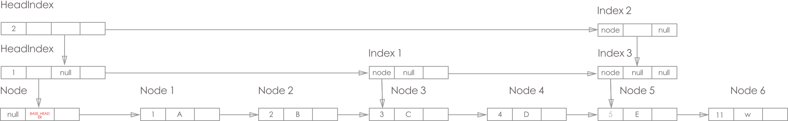

## [原文1](https://www.jianshu.com/p/edc2fd149255)

## [原文2](http://www.cnblogs.com/skywang12345/p/3498556.html)

# ConcurrentSkipListMap 源码分析 (基于Java 8)


## 1. ConcurrentSkipListMap 简介
ConcurrentSkipListMap 一个并发安全, 基于 skip list 实现有序存储的Map. 
OK 我们回忆一下 Java 中常用 的Map HashMap, TreeMap, ConcurrentHashMap, 
还有就是我们今天的主角 ConcurrentSkipListMap.

ConcurrentSkipListMap 与 ConcurrentHashMap 同在 concurrent 包下,
虽然 ConcurrentSkipListMap 比 ConcurrentHashMap 多用存储空间(用空间换时间), 
但它有着ConcurrentHashMap不能比拟的优点: 有序数据存储, 基于的就是 skip list.

## 2. 跳表(skip list)

- ConcurrentSkipListMap是线程安全的有序的哈希表，适用于高并发的场景。

- ConcurrentSkipListMap和TreeMap，它们虽然都是有序的哈希表。
但是，第一，它们的线程安全机制不同，TreeMap是非线程安全的，而ConcurrentSkipListMap是线程安全的。
第二，ConcurrentSkipListMap是通过跳表实现的，而TreeMap是通过红黑树实现的。

- 关于跳表(Skip List)，它是平衡树的一种替代的数据结构，但是和红黑树不相同的是，
跳表对于树的平衡的实现是基于一种随机化的算法的，这样也就是说跳表的插入和删除的工作是比较简单的。
 
  
### 说明：
    
先以数据“7,14,21,32,37,71,85”序列为例，来对跳表进行简单说明。

跳表分为许多层(level)，每一层都可以看作是数据的索引，这些索引的意义就是加快跳表查找数据速度。
每一层的数据都是有序的，上一层数据是下一层数据的子集，并且第一层(level 1)包含了全部的数据；
层次越高，跳跃性越大，包含的数据越少。
跳表包含一个表头，它查找数据时，是从上往下，从左往右进行查找。

现在“需要找出值为32的节点”为例，来对比说明跳表和普遍的链表。

- 情况1：链表中查找“32”节点
路径如下图1-02所示：


需要4步(红色部分表示路径)。

#### 下面说说Java中ConcurrentSkipListMap的数据结构。
- (01) ConcurrentSkipListMap继承于AbstractMap类，也就意味着它是一个哈希表。

- (02) Index是ConcurrentSkipListMap的内部类，它与“跳表中的索引相对应”。
HeadIndex继承于Index，ConcurrentSkipListMap中含有一个HeadIndex的对象head，head是“跳表的表头”。

- (03) Index是跳表中的索引，它包含“右索引的指针(right)”，“下索引的指针(down)”和“哈希表节点node”。
node是Node的对象，Node也是ConcurrentSkipListMap中的内部类。
 

- 情况2：跳表中查找“32”节点
路径如下图1-03所示：

忽略索引垂直线路上路径的情况下，只需要2步(红色部分表示路径)。

##### 跳跃列表
 
跳跃列表(skip list) 是一种随机话的数据结构, 基于上下左右都是链表的数据结构,
  其效率可以比拟 二叉查找树; 
  基本上 skip list 是在链表的上层增加多层索引链表(增加是随机的)实现的, 
  所以查找中根据索引层进行跳跃快速查找, 因此得名;
  
如图:


 

上面这张图来自 wiki, 图中有添加的过程, 但是结构没有细节, 我结合自己的理解, 
也画了一张:



从这张图中我们可以得出 ConcurrentSkipListMap 的几个特点:

- ConcurrentSkipListMap 的节点主要由 Node, Index, HeadIndex 构成;

- ConcurrentSkipListMap 的数据结构横向纵向都是链表

- 最下面那层链表是Node层(数据节点层), 上面几层都是Index层(索引)

- 从纵向链表来看, 最左边的是 HeadIndex 层, 右边的都是Index 层, 且每层的最底端都是对应Node, 
纵向上的索引都是指向最底端的Node(这一点图片为了美观就没体现)

了解了数据结构, 我们直接来看源码

## 2. 内部节点类 Node
```java

static final class Node<K, V>{
    final K key;  // key 是 final 的, 说明节点一旦定下来, 除了删除, 不然不会改动 key 了
    volatile Object value; // 对应的 value
    volatile Node<K, V> next; // 下一个节点
    
    // 构造函数
    public Node(K key, Object value, Node<K, V> next) {
        this.key = key;
        this.value = value;
        this.next = next;
    }
    
    /**
     * 创建一个标记节点(通过 this.value = this 来标记)
     * 这个标记节点非常重要: 有了它, 就能对链表中间节点进行同时删除了插入
     * ps: ConcurrentLinkedQueue 只能在头上, 尾端进行插入, 中间进行删除 
     */
    public Node(Node<K, V> next) {
        this.key = null;
        this.value = this;
        this.next = next;
    }

    /**
     * CAS 操作设置 Value
     */
    boolean casValue(Object cmp, Object val){
        return unsafe.compareAndSwapObject(this, valueOffset, cmp, val);
    }

    /**
     * CAS 操作设置 next
     */
    boolean casNext(Node<K, V> cmp, Node<K, V> val){
        return unsafe.compareAndSwapObject(this, nextOffset, cmp, val);
    }

    /**
     * 检测是否为标记节点
     */
    boolean isMarker(){
        return value == this;
    }

    /**
     * 检测是否为 链表最左下角的 BASE_HEADER 节点
     */
    boolean isBaseHeader(){
        return value == BASE_HEADER;
    }

    /**
     * 对节点追加一个标记节点, 为最终的删除做准备
     */
    boolean appendMarker(Node<K, V> f){
        return casNext(f, new Node<K, V>(f));
    }

    /**
     * Help out a deletion by appending marker or unlinking from
     * predecessor. This called during traversals when value
     * field seen to be null
     * 
     * helpDelete 方法, 这个方法要么追加一个标记节点, 要么进行删除操作
     */
    void helpDelete(Node<K, V> b, Node<K, V> f){
        /**
         * Rechecking links and then doing only one of the
         * help-out stages per call tends to minimize CAS
         * interference among helping threads
         */
        if(f == next && this == b.next){
            if(f == null || f.value != f){ // 还没有对删除的节点进行节点 marker
                casNext(f, new Node<K, V>(f));
            }else{
                b.casNext(this, f.next); // 删除 节点 b 与 f.next 之间的节点
            }
        }
    }

    /**
     * 校验数据
     */
    V getValidValue(){
        Object v = value;
        if(v == this || v == BASE_HEADER){
            return null;
        }
        V vv = (V)v;
        return vv;
    }

    /**
     * Creates and returns a new SimpleImmutableEntry holding current
     * mapping if this node holds a valid value, else null.
     *
     * @return new entry or null
     */
    AbstractMap.SimpleImmutableEntry<K, V> createSnapshot(){
        Object v = value;
        if(v == null || v == this || v == BASE_HEADER){
            return null;
        }
        V vv = (V) v;
        return new AbstractMap.SimpleImmutableEntry<K, V>(key, vv);
    }

    // UNSAFE mechanics
    private static final Unsafe unsafe;
    private static final long valueOffset;
    private static final long nextOffset;

    static {
        try {
            unsafe = UnSafeClass.getInstance();
            Class<?> k = Node.class;
            valueOffset = unsafe.objectFieldOffset(k.getDeclaredField("value"));
            nextOffset = unsafe.objectFieldOffset(k.getDeclaredField("next"));
        }catch (Exception e){
            throw new Error(e);
        }
    }

}

```

从上面的代码中我们大体知道 Node 有以下几个特点:

- this.value = this 的标记节点

- 删除分为2步, 把 non-null 变成 null, 在进行添加标记节点 (helpDelete方法中)

## 3. 索引节点 Index
```java

static class Index<K, V>{

    final Node<K, V> node; // 索引指向的节点, 纵向上所有索引指向链表最下面的节点
    final Index<K, V> down; // 下边level层的 Index
    volatile Index<K, V> right; // 右边的  Index

    /**
     * Creates index node with given values
     * @param node
     * @param down
     * @param right
     */
    public Index(Node<K, V> node, Index<K, V> down, Index<K, V> right) {
        this.node = node;
        this.down = down;
        this.right = right;
    }

    /**
     * compareAndSet right field
     * @param cmp
     * @param val
     * @return
     */
    final boolean casRight(Index<K, V> cmp, Index<K, V> val){
        return unsafe.compareAndSwapObject(this, rightOffset, cmp, val);
    }

    /**
     * Returns true if the node this indexes has been deleted.
     * @return true if indexed node is known to be deleted
     */
    final boolean indexesDeletedNode(){
        return node.value == null;
    }

    /**
     * Tries to CAS newSucc as successor. To minimize races with
     * unlink that may lose this index node, if the node being
     * indexed is known to be deleted, it doesn't try to link in
     *
     * @param succ the expecteccurrent successor
     * @param newSucc the new successor
     * @return true if successful
     */
    /**
     * 在 index 本身 和 succ 之间插入一个新的节点 newSucc
     * @param succ
     * @param newSucc
     * @return
     */
    final boolean link(Index<K, V> succ, Index<K, V> newSucc){
        Node<K, V> n = node;
        newSucc.right = succ;
        return n.value != null  && casRight(succ, newSucc);
    }

    /**
     * Tries to CAS field to skip over apparent successor
     * succ. Fails (forcing a retravesal by caller) if this node
     * is known to be deleted
     * @param succ the expected current successor
     * @return true if successful
     */
    /**
     * 将当前的节点 index 设置其的 right 为 succ.right 等于删除 succ 节点
     * @param succ
     * @return
     */
    final boolean unlink(Index<K, V> succ){
        return node.value != null && casRight(succ, succ.right);
    }

    // Unsafe mechanics
    private static final Unsafe unsafe;
    private static final long rightOffset;

    static {
        try{
            unsafe = UnSafeClass.getInstance();
            Class<?> k = Index.class;
            rightOffset = unsafe.objectFieldOffset(k.getDeclaredField("right"));
        }catch (Exception e){
            throw new Error(e);
        }

```    
Index 特点:

- 纵向链表都指向同个 Node

- Index 有两个表 常用的方法 link, unlink 方法, 后边会提及到的

## 4. 头索引节点 HeadIndex

```java

/**
 * Nodes heading each level keep track of their level.
 */
static final class HeadIndex<K,V> extends Index<K,V> {
    final int level;
    HeadIndex(Node<K,V> node, Index<K,V> down, Index<K,V> right, int level) {
        super(node, down, right);
        this.level = level;
    }
}

```
HeadIndex 没什么特别, 只是增加一个 level 属性用来标示索引层级; 
注意所有的 HeadIndex 都指向同一个 Base_header 节点;

OK, 下面我们来看看 ConcurrentSkipListMap 的主要方法 doPut, doGet, doRemove

## 5. 数据增加方法 doPut()

```java

/**
 * Main insetion method. Adds element if not present, or
 * replaces value if present and onlyIfAbsent is false.
 *
 * @param key the key
 * @param value the values that must be associated with key
 * @param onlyIfAbstsent if should not insert if already present
 * @return the old value, or null if newly inserted
 */
private V doPut(K key, V value, boolean onlyIfAbstsent){
    Node<K, V> z; // adde node
    if(key == null){
        throw new NullPointerException();
    }
    Comparator<? super K> cmp = comparator;
    outer:
    for(;;){
        // 0.
        for(Node<K, V> b = findPredecessor(key, cmp), n = b.next;;){ // 1. 将 key 对应的前继节点找到, b 为前继节点, n是前继节点的next, 若没发生 条件竞争, 最终 key在 b 与 n 之间 (找到的b在 base_level 上)
            if(n != null){ // 2. n = null时 b 是链表的最后一个节点, key 直接插到 b 之后 (调用 b.casNext(n, z))
                Object v; int c;
                Node<K, V> f = n.next; // 3 获取 n 的右节点
                if(n != b.next){ // 4. 条件竞争(另外一个线程在b之后插入节点, 或直接删除节点n), 则 break 到位置 0, 重新
                    break ;
                }
                if((v = n.value) == null){ // 4. 若 节点n已经删除, 则 调用 helpDelete 进行帮助删除 (详情见 helpDelete), 则 break 到位置 0, 重新来
                    n.helpDelete(b, f);
                    break ;
                }

                if(b.value == null || v == n){ // 5. 节点b被删除中 ,则 break 到位置 0, 调用 findPredecessor 帮助删除 index 层的数据, 至于 node 层的数据 会通过 helpDelete 方法进行删除
                    break ;
                }
                if((c = cpr(cmp, key, n.key)) > 0){ // 6. 若 key 真的 > n.key (在调用 findPredecessor 时是成立的), 则进行 向后走
                    b = n;
                    n = f;
                    continue ;
                }
                if(c == 0){ // 7. 直接进行赋值
                    if(onlyIfAbstsent || n.casValue(v, value)){
                        V vv = (V) v;
                        return vv;
                    }
                    break ; // 8. cas 竞争条件失败 重来
                }
                // else c < 0; fall through
            }
            // 9. 到这边时 n.key > key > b.key
            z = new Node<K, V> (key, value, n);
            if(!b.casNext(n, z)){
                break ; // 10. cas竞争条件失败 重来
            }
            break outer; // 11. 注意 这里 break outer 后, 上面的 for循环不会再执行, 而后执行下面的代码, 这里是break 不是 continue outer, 这两者的效果是不一样的
        }
    }

    int rnd = KThreadLocalRandom.nextSecondarySeed();
    if((rnd & 0x80000001) == 0){ // 12. 判断是否需要添加level
        int level = 1, max;
        while(((rnd >>>= 1) & 1) != 0){
            ++level;
        }
        // 13. 上面这段代码是获取 level 的, 我们这里只需要知道获取 level 就可以 (50%的几率返回0，25%的几率返回1，12.5%的几率返回2...最大返回31。)
        Index<K, V> idx = null;
        HeadIndex<K, V> h = head;
        if(level <= (max = h.level)){ // 14. 初始化 max 的值, 若 level 小于 max , 则进入这段代码 (level 是 1-31 之间的随机数)
            for(int i = 1; i <= level; ++i){
                idx = new Index<K, V>(z, idx, null); // 15 添加 z 对应的 index 数据, 并将它们组成一个上下的链表(index层是上下左右都是链表)
            }
        }
        else{ // 16. 若 level > max 则只增加一层 index 索引层
            level = max + 1; // 17. 跳表新的 level 产生
            Index<K, V>[] idxs = (Index<K, V>[])new Index<?, ?>[level + 1];
            for(int i = 1; i <= level; ++i){
                idxs[i] = idx = new Index<K, V>(z, idx, null);
            }
            for(;;){
                h = head;
                int oldLevel = h.level; // 18. 获取老的 level 层
                if(level <= oldLevel){ // 19. 另外的线程进行了index 层增加操作, 所以 不需要增加 HeadIndex 层数
                    break;
                }
                HeadIndex<K, V> newh = h;
                Node<K, V> oldbase = h.node; // 20. 这里的 oldbase 就是BASE_HEADER
                for(int j = oldLevel+1; j <= level; ++j){ // 21. 这里其实就是增加一层的 HeadIndex (level = max + 1)
                    newh = new HeadIndex<K, V>(oldbase, newh, idxs[j], j); // 22. idxs[j] 就是上面的 idxs中的最高层的索引
                }
                if(casHead(h, newh)){ // 23. 这只新的 headIndex
                    h = newh;  // 24. 这里的 h 变成了 new HeadIndex
                    idx = idxs[level = oldLevel];  // 25. 这里的 idx 上从上往下第二层的 index 节点 level 也变成的 第二
                    break;
                }
            }
        }

        // find insertion points and splice in
        splice:
        for(int insertionLevel = level;;){ // 26. 这时的 level 已经是 第二高的 level(若上面 步骤19 条件竞争失败, 则多出的 index 层其实是无用的, 因为 那是 调用 Index.right 是找不到它的)
            int j = h.level;
            for(Index<K, V> q = h, r = q.right, t = idx;;){ // 27. 初始化对应的数据
                if(q == null || t == null){ // 28. 节点都被删除 直接 break出去
                    break splice;
                }
                if(r != null){
                    Node<K, V> n = r.node;
                    // compare before deletion check avoids needing recheck
                    int c = cpr(cmp, key, n.key);
                    if(n.value == null){ // 29. 老步骤, 帮助index 的删除
                        if(!q.unlink(r)){
                            break ;
                        }
                        r = q.right; // 30. 向右进行遍历
                        continue ;
                    }

                    if(c > 0){ // 31. 向右进行遍历
                        q = r;
                        r = r.right;
                        continue ;
                    }
                }

                // 32.
                // 代码运行到这里, 说明 key < n.key
                // 第一次运行到这边时, j 是最新的 HeadIndex 的level j > insertionLevel 非常用可能, 而下面又有 --j, 所以终会到 j == insertionLevel
                if(j == insertionLevel){
                    if(!q.link(r, t)){ // 33. 将 index t 加到 q 与 r 中间, 若条件竞争失败的话就重试
                        break ; // restrt
                    }
                    if(t.node.value == null){ // 34. 若这时 node 被删除, 则开始通过 findPredecessor 清理 index 层, findNode 清理 node 层, 之后直接 break 出去, doPut调用结束
                        findNode(key);
                        break splice;
                    }
                    if(--insertionLevel == 0){ // 35. index 层添加OK， --1 为下层插入 index 做准备
                        break splice;
                    }
                }

                /**
                 * 下面这行代码其实是最重要的, 理解这行代码, 那 doPut 就差不多了
                 * 1). --j 要知道 j 是 newhead 的level， 一开始一定 > insertionLevel的, 通过 --1 来为下层操作做准备 (j 是 headIndex 的level)
                 * 2). 通过 19. 21, 22 步骤, 个人认为 --j >= insertionLevel 是横成立, 而 --j 是必须要做的
                 * 3) j 经过几次--1， 当出现 j < level 时说明 (j+1) 层的 index已经添加成功, 所以处理下层的 index
                 */
                if(--j >= insertionLevel && j < level){
                    t = t.down;
                }
                /** 到这里时, 其实有两种情况
                 *  1) 还没有一次index 层的数据插入
                 *  2) 已经进行 index 层的数据插入, 现在为下一层的插入做准备
                 */
                q = q.down; // 从 index 层向下进行查找
                r = q.right;

            }
        }
    }
    return null;
}
```

doPut方法分析:
整个doPut方法看起来有点吓人, 但没事,我们将这个方法进行分割:

- 获取前继节点(步骤1 findPredecessor), 进行节点的插入 (步骤 10 b.casNext(n, z))

- 准备 Index 层的数据 (idxs[i] = idx = new Index<K, V>(z, idx, null)), 准备 HeadIndex的数据, 进行插入(步骤 23)

- 循环遍历Index层, 进行索引层的插入(步骤 33 q.link(r, t))
还迷糊, 没事, 我们继续细分拆解讲:

## 6. doPut() 增加数据过程

### 6.1. ConcurrentSkipListMap在新建时的初始状态如图:



初始时, 只存在 HeadIndex 和 Base_Header 节点

### 6.2. 进行节点添加

#### 6.2.1. 添加 key=1, value = A 节点, 结果如图:



涉及doPut操作：

- 1.doPut步骤1 寻找前继节点, 这时返回的 b = BaseHeader, n = null, 所以直接到 doPut 步骤 9

- 2.doPut步骤9, 直接 CAS操作设置next节点 

- 3.这里假设 步骤 12 中获取的 level 是0(要知道获得0的概率是很大的, 这个函数返回的最大值也就31, 也就是说, 最多有31层的索引)

- 4.所以这时 idx = null, 直接到步骤 28 break 出去，操作结束

这里为了理解上的便利, 我们再添加一个节点, 最终效果图如下:



#### 6.2.2. 再次添加 key=3, value = C 节点, 结果如图:



这次增加了索引层 index 1
涉及doPut操作：

- 1.doPut步骤1 寻找前继节点, 这时返回的 b = node2, n = null, 所以直接到 doPut 步骤 9

- 2.doPut步骤9, 直接 CAS操作设置next节点

- 3.进入步骤 12, 假设我们获取到 level = 1, 则步骤14 中 level <= max(max = 1)成立, 初始化一个 idx

- 4.最终找到要插入index位置, 进行link操作, 步骤 33

ps: 这时再put节点 key=4 value = D (情形和 Node1, Node2 一样), 最终结果:



#### 6.2.3. 再次添加 key=5, value = E 节点, 结果如图:



这时发现索引层增加了一层
我们来看 doPut 操作:

1. doPut步骤1 寻找前继节点, 这时返回的 b = node2, n = null, 所以直接到 doPut 步骤 9

2. doPut步骤9, 直接 CAS操作设置next节点

3. 进入步骤 12, 假设我们获取到 level = 25, 则步骤14 中 level <= max(max = 1)不成立, 
则进入 步骤16, 这里我们发现, 只要 level > max, 只是在原来的 max + 1, 
就是指增加一层的索引

4. 进行 indx 链表的初始化, 一共两个链表节点 (index是纵向的链表)

5. 步骤21, 其实这时只是在原来的 HeadIndex 的纵向链表上增加一个新节点

6. 步骤 23 CAS 新的 HeadIndex, 这里有个注意点 h = newh, 而index是第二高的 Index, 为什么呢? 
因为步骤 22中已经将最高层的 HadeIndex与Index横向连接起来了(奇妙吧, 一会横向一会纵向)

7. 步骤 26, 这里的 insertionLevel 是第二高的 level, 而下面的 j 则是最高层的 level

8. 最后就是步骤30中的link操作(j > insertionLevel, 所以先 j-- , 再for loop, 接着就满足了 )

我们在插入个 key = 11, value = w (步骤和 node1, node2 一样, 这里省略了)

最终如图:



#### 6.2.4. 再次添加 key=8, value = W 节点, 结果如图:



这里和添加 key= 5 差不多, 唯一的区别就是 获取的前继节点.right != null 而已, 所以不说了

总结: 其实doPut方法就是获取key对应的前继节点, 然后cas设置next值,
 随后 生成随机 level(0-31之间), 若新的 level <= oldMaxLevel 则增加对应的索引层, 
 若level > oldMaxLevel, 则 HeadIndex 也会随之增加索引层;

上面doPut时每次都会调用 findPredecessor 来获取前继节点, 那我们就看这个方法

## 7. findPredecessor() 寻找前继节点

总体思路是: 从矩形链表的左上角的 HeadIndex 索引开始, 先向右, 
遇到 null, 或 > key 时向下, 重复向右向下找, 
一直找到 对应的前继节点(前继节点就是小于 key 的最大节点)


```java
/**
 * Returns a base-level node with key strictly less than given key,
 * or the base-level header if there is no such node. Also
 * unlinks indexes to deleted nodes found along the way. Callers
 * rely on this side-effect of clearing indices to deleted nodes
 * @param key the key
 * @return a predecessor of the key
 */
private Node<K, V> findPredecessor(Object key, Comparator<? super K> cmp){
    if(key == null)
        throw new NullPointerException(); // don't postpone errors
    for(;;){
        for(Index<K, V> q = head, r = q.right, d;;){ // 1. 初始化数据 q 是head， r 是 最顶层 h 的右Index节点
            if(r != null){ // 2. 对应的 r =  null, 则进行向下查找
                Node<K, V> n = r.node;
                K k = n.key;
                if(n.value == null){ // 3. n.value = null 说明 节点n 正在删除的过程中
                    if(!q.unlink(r)){ // 4. 在 index 层直接删除 r 节点, 若条件竞争发生直接进行break 到步骤1 , 重新从 head 节点开始查找
                        break; // restart
                    }
                    r = q.right; //reread r // 5. 删除 节点r 成功, 获取新的 r 节点, 回到步骤 2 (还是从这层索引开始向右遍历, 直到 r == null)
                    continue;
                }

                if(cpr(cmp, key, k) > 0){ // 6. 若 r.node.key < 参数key, 则继续向右遍历, continue 到 步骤 2处, 若 r.node.key >  参数key 直接跳到 步骤 7
                    q = r;
                    r = r.right;
                    continue;
                }
            }

            if((d = q.down) == null){ // 7. 到这边时, 已经到跳表的数据层, q.node < key < r的 或q.node < key 且 r == null; 所以直接返回 q.node
                return q.node;
            }

            q = d; // 8 未到数据层, 进行重新赋值向下走 (为什么向下走呢? 回过头看看 跳表, 原来 上层的index 一般都是比下层的 index 个数少的)
            r = d.right;
        }
    }
}

```
若寻找的过程不是很清楚, 直接看一下最上边的那张图

## 7. doGet() 获取节点对应的值
整个过程：

寻找 key 的前继节点 b (这时b.next = null || b.next > key, 则说明不存key对应的 Node)
接着就判断 b, b.next 与 key之间的关系(其中有些 helpDelete操作)
直接看代码:

```java

/**
 * Gets value for key. Almost the same as findNode, but returns
 * the found value (to avoid retires during ret-reads)
 *
 *  这个 doGet 方法比较简单
 * @param key the key
 * @return the value, or null if absent
 */
private V doGet(Object key){
    if(key == null){
        throw new NullPointerException();
    }
    Comparator<? super K> cmp = comparator;
    outer:
    for(;;){
        for(Node<K, V> b = findPredecessor(key, cmp), n = b.next;;){ // 1. 获取 key 的前继节点 b, 其实这时 n.key >= key
            Object v; int c;
            if(n == null){ // 2. n == null 说明 key 对应的 node 不存在 所以直接 return null
                break outer;
            }
            Node<K, V> f = n.next;
            if(n != b.next){ // 3. 有另外的线程修改数据, 重新来
                break ;
            }
            if((v = n.value) == null){ // 4. n 是被删除了的节点, 进行helpDelete 后重新再来
                n.helpDelete(b, f);
                break ;
            }
            if(b.value == null || v == n){ // 5. b已经是删除了的节点, 则 break 后再来
                break ;
            }
            if((c = cpr(cmp, key, n.key)) == 0){ // 6. 若 n.key = key 直接返回结果, 这里返回的结果有可能是 null
                V vv = (V) v;
                return vv;
            }
            if(c < 0){ // 7. c < 0说明不存在 key 的node 节点
                break outer;
            }
            // 8. 运行到这一步时, 其实是 在调用 findPredecessor 后又有节点添加到 节点b的后面所致
            b = n;
            n = f;
        }
    }

    return null;
}

```

## 8. doRemove() 删除节点
整个删除个 ConcurrentSkipListMap 里面 nonBlockingLinkedList 实现的一大亮点, 为什么呢?
因为这个 nonBlockingLinkedList 同时支持并发安全的从链表中间添加/删除操作,
而 ConcurrentLinkedQueue 只支持并发安全的从链表中间删除;

删除操作:

寻找对应的节点
给节点的 value 至 null, node.value = null
将 node 有增加一个标记节点 (this.value = this 还记得哇, 不记得的直接看 node 类)
通过 CAS 直接将 K对应的Node和标记节点一同删除
直接来看代码:

```java

/**
 * Main deletion method. Locates node, nulls value, appends a
 * deletion marker, unlinks predecessor, removes associated index
 * nodes, and possibly reduces head index level
 *
 * Index nodes are cleared out simply by calling findPredecessor.
 * which unlinks indexes to deleted nodes found along path to key,
 * which will include the indexes to this node. This is node
 * unconditionally. We can't check beforehand whether there are
 * indexes hadn't been inserted yet for this node during initial
 * search for it, and we'd like to ensure lack of garbage
 * retention, so must call to be sure
 *
 * @param key the key
 * @param value if non-null, the value that must be
 *              associated with key
 * @return the node, or null if not found
 */
final V doRemove(Object key, Object value){
    if(key == null){
        throw new NullPointerException();
    }
    Comparator<? super K> cmp = comparator;
    outer:
    for(;;){
        for(Node<K, V> b = findPredecessor(key, cmp), n = b.next;;){ // 1. 获取对应的前继节点 b
            Object v; int c;
            if(n == null){ // 2. 节点 n 被删除 直接 return null 返回 , 因为理论上 b.key < key < n.key
                break outer;
            }
            Node<K, V> f = n.next;
            if(n != b.next){ // 3. 有其他线程在 节点b 后增加数据, 重来
                break ;
            }
            if((v = n.value) == null){ // 4. 节点 n 被删除, 调用 helpDelete 后重来
                n.helpDelete(b, f);
                break ;
            }

            if(b.value == null || v == n){ // 5. 节点 b 删除, 重来 调用findPredecessor时会对 b节点对应的index进行清除, 而b借点吧本身会通过 helpDelete 来删除
                break ;
            }
            if((c = cpr(cmp, key, n.key)) < 0){ // 6. 若n.key < key 则说明 key 对应的节点就不存在, 所以直接 return
                break outer;
            }

            if(c > 0){ // 7. c>0 出现在 有其他线程在本方法调用findPredecessor后又在b 后增加节点, 所以向后遍历
                b = n;
                n = f;
                continue ;
            }

            if(value != null && !value.equals(v)){ // 8. 若 前面的条件为真, 则不进行删除 (调用 doRemove 时指定一定要满足 key value 都相同, 具体看 remove 方法)
                break outer;
            }
            if(!n.casValue(v, null)){ // 9. 进行数据的删除
                break ;
            }
            if(!n.appendMarker(f) || !b.casNext(n, f)){ // 10. 进行 marker 节点的追加, 这里的第二个 cas 不一定会成功, 但没关系的 (第二个 cas 是删除 n节点, 不成功会有  helpDelete 进行删除)
                findNode(key);  // 11. 对 key 对应的index 进行删除
            }
            else{
                findPredecessor(key, cmp); //12. 对 key 对应的index 进行删除 10进行操作失败后通过 findPredecessor 进行index 的删除
                if(head.right == null){
                    tryReduceLevel(); // 13. 进行headIndex 对应的index 层的删除
                }
            }

            V vv = (V) v;
            return vv;

        }
    }

    return null;
}

```

整个doRemove代码比较简单,我就不说了..... 但问题来了, 
为什么要删除时增加 marker 节点, 这到底什么作用?
先给大家一个结论: 没有这个marker节点会有可能多删除节点,
 marker的存在保证之间节点一边删除一边插入数据 是安全的

## 9. marker 节点的作用

如图 demo1(没有maker节点进行删除插入操作):
有三个链接在一起的Node (node 有三个属性 key, value, next, 且所有操作都是 cas)

* +------+ +------+ +------+
* ... | A |------>| B |----->| C | ...
* +------+ +------+ +------+


Thread 1 |	Thread 2
|---|---
|           |if B.value == null 判断B的value是否为null
B.value = null|	
A.casNext(B, B.next)|	
|          |Node D = new Node(C); B.casNext(C, D);
步骤:

1. Thread 2 准备在B的后面插入一个节点 D, 它先判断 B.value == null, 发现 B 没被删除(假设 value = null 是删除)
2. Thread1 对 B 节点进行删除 B.value = null
3. Thread 1 直接设置 A的next是 B 的next (A.casNext(B, B.next)) 成功将节点 B 删除
4. 这时 Thread 2 new 一个节点 D, 直接设置 B.casNext(C, D) 成功
5. 最终效果, 因为节点B被删除掉, 所以节点D也没有插入进去(没插进去指不能从以A节点为head, 通过 next() 方法获取到节点D)

原因: 若队列在删除的过程中没有引入 maker 节点, 有可能导致刚刚插入的节点无缘无故的消失

下面是一个例子:
原本: 有3各节点 A, B, C 组成的队列

A -> B -> C (A.next = B, B.next = C)

现在有两个线程 (thread1, thread2) 进行操作, thread1 进行删除节点B, thread2 在节点B后插入节点D

进行操作前: 
```
+------+       +------+      +------+
|   A  |------>|   B  |----->|   C  | 
+------+       +------+      +------+
```

进行操作后: 
D 插入到节点B之后成功了, 可是队列的 头结点是 A, 通过A.next().next().next()..... 方法
无法访问到节点D(D节点已经丢失了)
```
            +------+      +------+
            |   B  |----->|   D  | 
            +------+      +------+
                              |
                              V
+------+                   +------+
|   A  |------>----->----->|   C  | 
+------+                   +------+
```

如图 demo2(有 marker 节点):
有三个链接在一起的Node (node 有三个属性 key, value, next, 且所有操作都是 cas)
```
* +------+ +------+ +------+
* ... | A |------>| B |----->| C | ...
* +------+ +------+ +------+
```
Thread 1	| Thread 2
|---|---
|   |if B.value == null 判断B的value是否为null
B.value = null|	
M = new MarkerNode(C); B.caseNext(C, M);|	
A.casNext(B, B.next)|	
|            | Node D = new Node(); B.casNext(C, D);

步骤:

1. Thread 2 准备在B的后面插入一个节点 D, 它先判断 B.value == null, 发现 B 没被删除(假设 value = null 是删除)
2. Thread1 对 B 节点进行删除 B.value = null
3. Thread 1 在B的后面追加一个 MarkerNode M 
4. Thread 1 将 B 与 M 一起删除
5. 这时你会发现 Thread 2 的 B.casNext(C, D) 发生的可能 :
  1) 在Thread 1 设置 marker 节点前操作, 则B.casNext(C, D) 成功, 
  B 与 marker 也一起删除
  
  2) 在Thread 1 设置maker之后, 删除 b与marker之前, 则B.casNext(C, D) 操作失败(b.next 变成maker了), 
  所以在代码中加个 loop 循环尝试
  
  3) 在Thread 1 删除 B, marker 之后, 则B.casNext(C, D) 失败(b.next变成maker,
   B.casNext(C,D) 操作失败, 在 loop 中重新进行尝试插入)
   
6. 最终结论 maker 节点的存在致使 非阻塞链表能实现中间节点的删除和插入同时安全进行(反过来就是若没有marker节点,
 有可能刚刚插入的数据就丢掉了)
 
## 10. ConcurrentSkipListMap 总结

整个代码分析过来, 发现了很多有意思的东西, skip list, nonblockingLinkedList 等等!
ConcurrentSkipListMap 是一个基于 Skip List 实现的并发安全, 
非阻塞读/写/删除 的 Map, 最重要的是 它的value是有序存储的, 
而且其内部是由纵横链表组成, 在进行java开发中有一定的运用场景!

## 参考:
wiki 定义 [Skip List](https://en.wikipedia.org/wiki/Skip_list)
[High Performance Dynamic Lock-Free Hash Tables and List-Based Sets](http://www.research.ibm.com/people/m/michael/spaa-2002.pdf)
 