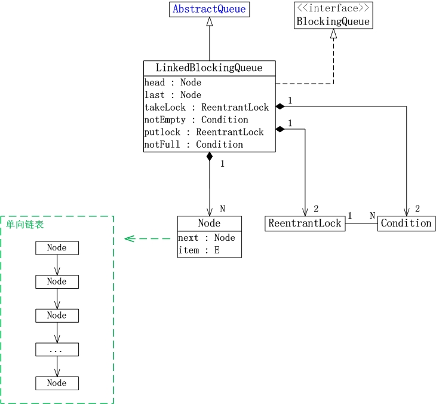

## [原文1]()
## [原文2](https://www.cnblogs.com/wanly3643/p/3904473.html)

# LinkedBlockingQueue原理


## 并发队列-无界阻塞队列LinkedBlockingQueue原理

 - 基于链表实现，线程安全的阻塞队列。
 
 - 使用锁分离方式提高并发，双锁（ReentrantLock）：takeLock、putLock，允许读写并行，
 remove(e)和contain()、clear()需要同时获取2个锁。
 
 - FIFO先进先出模式。
 
 - 在大部分并发场景下，LinkedBlockingQueue的吞吐量比ArrayBlockingQueue更好，双锁，入队和出队同时进行
 
 - 根据构造传入的容量大小决定有界还是无界，默认不传的话，大小Integer.Max
 

## LinkedBlockingQueue介绍
LinkedBlockingQueue是一个单向链表实现的阻塞队列。
该队列按 FIFO（先进先出）排序元素，新元素插入到队列的尾部，并且队列获取操作会获得位于队列头部的元素。
链接队列的吞吐量通常要高于基于数组的队列，但是在大多数并发应用程序中，其可预知的性能要低。

此外，LinkedBlockingQueue还是可选容量的(防止过度膨胀)，
即可以指定队列的容量。如果不指定，默认容量大小等于Integer.MAX_VALUE。


## 阻塞队列概要

阻塞队列与我们平常接触的普通队列(LinkedList或ArrayList等)的最大不同点，在于阻塞队列支出阻塞添加和阻塞删除方法。

 - 阻塞添加 \
所谓的阻塞添加是指当阻塞队列元素已满时，队列会阻塞加入元素的线程，直队列元素不满时才重新唤醒线程执行元素加入操作。

 - 阻塞删除 \
阻塞删除是指在队列元素为空时，删除队列元素的线程将被阻塞，直到队列不为空再执行删除操作(一般都会返回被删除的元素)
   
## LinkedBlockingQueue原理和数据结构

LinkedBlockingQueue的数据结构，如下图所示：


   
说明：
- 1 . LinkedBlockingQueue继承于AbstractQueue，它本质上是一个FIFO(先进先出)的队列。

- 2 . LinkedBlockingQueue实现了BlockingQueue接口，它支持多线程并发。
当多线程竞争同一个资源时，某线程获取到该资源之后，其它线程需要阻塞等待。

- 3 . LinkedBlockingQueue是通过单链表实现的。

  - (01) head是链表的表头。取出数据时，都是从表头head处插入。
  - (02) last是链表的表尾。新增数据时，都是从表尾last处插入。
  - (03) count是链表的实际大小，即当前链表中包含的节点个数。
  - (04) capacity是列表的容量，它是在创建链表时指定的。
  - (05) putLock是插入锁，takeLock是取出锁；notEmpty是“非空条件”，notFull是“未满条件”。
  通过它们对链表进行并发控制。
       LinkedBlockingQueue在实现“多线程对竞争资源的互斥访问”时，
       对于“插入”和“取出(删除)”操作分别使用了不同的锁。对于插入操作，
       通过“插入锁putLock”进行同步；对于取出操作，通过“取出锁takeLock”进行同步。
       此外，插入锁putLock和“非满条件notFull”相关联，
       取出锁takeLock和“非空条件notEmpty”相关联。
       通过notFull和notEmpty更细腻的控制锁。
          
          
```java
    //默认大小为Integer.MAX_VALUE
    public LinkedBlockingQueue() {
           this(Integer.MAX_VALUE);
    }
    
    //创建指定大小为capacity的阻塞队列
    public LinkedBlockingQueue(int capacity) {
         if (capacity <= 0) throw new IllegalArgumentException();
         this.capacity = capacity;
         last = head = new Node<E>(null);
     }
    
    //创建大小默认值为Integer.MAX_VALUE的阻塞队列并添加c中的元素到阻塞队列
    public LinkedBlockingQueue(Collection<? extends E> c) {
         this(Integer.MAX_VALUE);
         final ReentrantLock putLock = this.putLock;
         putLock.lock(); // Never contended, but necessary for visibility
         try {
             int n = 0;
             for (E e : c) {
                 if (e == null)
                     throw new NullPointerException();
                 if (n == capacity)
                     throw new IllegalStateException("Queue full");
                 enqueue(new Node<E>(e));
                 ++n;
             }
             count.set(n);
         } finally {
             putLock.unlock();
         }
     }
```
这篇文章来说说稍微复杂一些的LinkedBlockingQueue。LinkedBlockingQueue使用一个链表来实现，
会有一个head和tail分别指向队列的开始和队列的结尾。因此LinkedBlockingQueue会有两把锁，分别控制这两个元素，
这样在添加元素和拿走元素的时候就不会有锁的冲突，因此取走元素操作的是head，而添加元素操作的是tail。

老规矩先看offer方法和poll方法          

```java
    public boolean offer(E e) {
        if (e == null) throw new NullPointerException(); // 不允许空元素
        final AtomicInteger count = this.count;
        if (count.get() == capacity) // 如果容量满了，返回false
            return false;
        int c = -1;
        Node<E> node = new Node(e); // 容量没满，以新元素构造节点
        final ReentrantLock putLock = this.putLock;
        putLock.lock(); // 放锁加锁，保证调用offer方法的时候只有1个线程
        try {
            if (count.get() < capacity) { // 再次判断容量是否已满，因为可能拿锁在进行消费数据，没满的话继续执行
                enqueue(node); // 节点添加到链表尾部
                c = count.getAndIncrement(); // 元素个数+1
                if (c + 1 < capacity) // 如果容量还没满
                    notFull.signal(); // 在放锁的条件对象notFull上唤醒正在等待的线程，表示可以再次往队列里面加数据了，队列还没满
            }
        } finally {
            putLock.unlock(); // 释放放锁，让其他线程可以调用offer方法
        }
        if (c == 0) // 由于存在放锁和拿锁，这里可能拿锁一直在消费数据，count会变化。这里的if条件表示如果队列中还有1条数据
            signalNotEmpty(); // 在拿锁的条件对象notEmpty上唤醒正在等待的1个线程，表示队列里还有1条数据，可以进行消费
        return c >= 0; // 添加成功返回true，否则返回false
```

可以看到offer方法在添加元素时候仅仅涉及到putLock，但是还是会需要takeLock，看看signalNotEmpty代码就知道。
而poll方法拿走元素的时候涉及到takeLock，也是会需要putLock。参见signalNotFull()。
关于signalNotEmpty会在后面讲阻塞的时候讲到。

```java
    public E poll() {
        final AtomicInteger count = this.count;
        if (count.get() == 0)
            return null;
        E x = null;
        int c = -1;
        final ReentrantLock takeLock = this.takeLock;
        takeLock.lock();
        try {
            if (count.get() > 0) {
                x = dequeue();
                c = count.getAndDecrement();
                if (c > 1)
                    notEmpty.signal();
            }
        } finally {
            takeLock.unlock();
        }
        if (c == capacity)
            signalNotFull();
        return x;
    }
```

这里顺便说说队列长度的count，因为有两把锁存在，
所以如果还是像ArrayBlockingQueue一样使用基本类型的count的话会同时用到两把锁，
这样就会很复杂，因此直接使用原子数据类型AtomicInteger来操作count。

接下来谈谈阻塞的问题，一个BlockingQueue会有两个Condition：notFull和notEmpty，
LinkedBlockingQueue会有两把锁，因此这两个Condition肯定是由这两个锁分别创建的，
takeLock创建notEmpty，putLock创建notFull。

```java
    /** Lock held by take, poll, etc */
    private final ReentrantLock takeLock = new ReentrantLock();

    /** Wait queue for waiting takes */
    private final Condition notEmpty = takeLock.newCondition();

    /** Lock held by put, offer, etc */
    private final ReentrantLock putLock = new ReentrantLock();

    /** Wait queue for waiting puts */
    private final Condition notFull = putLock.newCondition();
```

 
接下来看看put方法：

```java
    public void put(E e) throws InterruptedException {
        if (e == null) throw new NullPointerException();
        // Note: convention in all put/take/etc is to preset local var
        // holding count negative to indicate failure unless set.
        int c = -1;
        Node<E> node = new Node(e);
        final ReentrantLock putLock = this.putLock;
        final AtomicInteger count = this.count;
        putLock.lockInterruptibly();
        try {
            /*
             * Note that count is used in wait guard even though it is
             * not protected by lock. This works because count can
             * only decrease at this point (all other puts are shut
             * out by lock), and we (or some other waiting put) are
             * signalled if it ever changes from capacity. Similarly
             * for all other uses of count in other wait guards.
             */
            while (count.get() == capacity) {
                notFull.await();
            }
            enqueue(node);
            c = count.getAndIncrement();
            if (c + 1 < capacity)
                notFull.signal();
        } finally {
            putLock.unlock();
        }
        if (c == 0)
            signalNotEmpty();
    }
```

其实大体逻辑和ArrayBlockingQueue差不多，也会需要通知notEmpty条件，
因为notEmpty条件属于takeLock，而调用signal方法需要获取Lock，
因此put方法也是用到了另外一个锁：takeLock。这里有一点会不同，按照道理来说put方法是不需要通知notFull条件的，
是由由拿走元素的操作来通知的，但是notFull条件属于putLock，而拿走元素时，是用了takeLock，
因此这里put方法在拥有putLock的情况通知notFull条件，会让其他添加元素的方法避免过长时间的等待。
同理对于take方法来说也通知notEmpty条件。

 
```java
    public E take() throws InterruptedException {
        E x;
        int c = -1;
        final AtomicInteger count = this.count;
        final ReentrantLock takeLock = this.takeLock;
        takeLock.lockInterruptibly();
        try {
            while (count.get() == 0) {
                notEmpty.await();
            }
            x = dequeue();
            c = count.getAndDecrement();
            if (c > 1)
                notEmpty.signal();
        } finally {
            takeLock.unlock();
        }
        if (c == capacity)
            signalNotFull();
        return x;
    }
```

最后说说remove和contains方法，因为需要操作整个链表，因此需要同时拥有两个锁才能操作。   

## 开源框架中使用
首先线程池Executors的newFixedThreadPool和newSingleThreadExecutor的工作队列就是使用的这个。

然后tomcat中任务队列TaskQueue是继承并扩展了的,
可知TaskQueue继承了LinkedBlockingQueue并且泛化类型固定了为Runnalbe.重写了offer,poll，take方法。


## LinkedBlockingQueue示例

```java
import java.util.*;
import java.util.concurrent.*;
 
 /*
  *   LinkedBlockingQueue是“线程安全”的队列，而LinkedList是非线程安全的。
  *
  *   下面是“多个线程同时操作并且遍历queue”的示例
  *   (01) 当queue是LinkedBlockingQueue对象时，程序能正常运行。
  *   (02) 当queue是LinkedList对象时，程序会产生ConcurrentModificationException异常。
  *
  * @author skywang
  */
 public class LinkedBlockingQueueDemo1 {
 
     // TODO: queue是LinkedList对象时，程序会出错。
     //private static Queue<String> queue = new LinkedList<String>();
     private static Queue<String> queue = new LinkedBlockingQueue<String>();
     public static void main(String[] args) {
     
         // 同时启动两个线程对queue进行操作！
         new MyThread("ta").start();
         new MyThread("tb").start();
     }
 
     private static void printAll() {
         String value;
         Iterator iter = queue.iterator();
         while(iter.hasNext()) {
             value = (String)iter.next();
             System.out.print(value+", ");
         }
         System.out.println();
     }
 
     private static class MyThread extends Thread {
         MyThread(String name) {
             super(name);
         }
         @Override
         public void run() {
                 int i = 0;
             while (i++ < 6) {
                 // “线程名” + "-" + "序号"
                 String val = Thread.currentThread().getName()+i;
                 queue.add(val);
                 // 通过“Iterator”遍历queue。
                 printAll();
             }
         }
     }
 }
```

#### 结果说明：
示例程序中，启动两个线程(线程ta和线程tb)分别对LinkedBlockingQueue进行操作。
以线程ta而言，它会先获取“线程名”+“序号”，然后将该字符串添加到LinkedBlockingQueue中；
接着，遍历并输出LinkedBlockingQueue中的全部元素。 线程tb的操作和线程ta一样，只不过线程tb的名字和线程ta的名字不同。

当queue是LinkedBlockingQueue对象时，程序能正常运行。如果将queue改为LinkedList时，
程序会产生ConcurrentModificationException异常。


## 总结
LinkedBlockingQueue完全是利用ReentrantLock的lockInterruptibly、
unlock、newCondition以及Condition的await和signal等接口实现的，
因此要想对它有更好的理解，需要先理解ReentrantLock的内部机制。


   