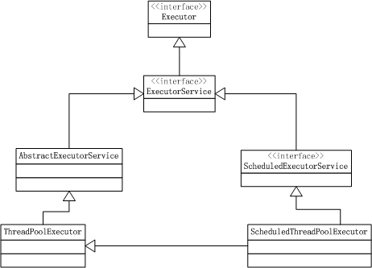

## [原文1](https://www.cnblogs.com/wanly3643/p/3909797.html)

## [原文2](https://blog.csdn.net/tuke_tuke/article/details/51353925)

# 09 线程池系列之介绍篇

## 线程池作用与基本知识
在开始之前，我们先来讨论下“线程池”这个概念。
“线程池”，顾名思义就是一个线程缓存。
它是一个或者多个线程的集合，用户可以把需要执行的任务简单地扔给线程池，而不用过多的纠结与执行的细节。
那么线程池有哪些作用？或者说与直接用Thread相比，有什么优势？我简单总结了以下几点：

- 1 减小线程创建和销毁带来的消耗
对于Java Thread的实现，我在前面的一篇blog中进行了分析。
Java Thread与内核线程是1:1（Linux）的，
再加上Thread在Java层与C++层都有不少成员数据，所以Java Thread其实是比较重的。
创建和销毁一个Java Thread需要OS和JVM都做不少工作，
因此如果将Java Thread缓存起来，可以实现一定的效率提升。

- 2 更加方便和透明的实现计算资源控制
讨论这一条，可能需要举一些例子。以非常闻名的web服务器Nginx为例，
Nginx以强大的并发能力和低资源消耗而著称。
Nginx为了实现这些严格的要求，它严格地限定了工作线程的数目（worker线程一般等于CPU数目）。
这种设计的着眼点就是降低线程切换带来的性能损失，这条优化方式对Java同样适用。
倘若，每来一个任务就新建一个Thread来运算，
那最终的结果就是程序资源难以控制（某个功能把CPU跑满了），而且整体的执行速度也比较慢。 
而Java线程池提供了FixedThreadPool，你可以使用它实现线程最大数目的控制。


###  concurrent包中Executor接口的主要类的关系图如下：





## Java的Executor框架


## Executor 接口

接口非常单一，就是执行一个Runnable的命令。

```java
public interface Executor {

    /**
     * Executes the given command at some time in the future.  The command
     * may execute in a new thread, in a pooled thread, or in the calling
     * thread, at the discretion of the {@code Executor} implementation.
     *
     * @param command the runnable task
     * @throws RejectedExecutionException if this task cannot be
     * accepted for execution
     * @throws NullPointerException if command is null
     */
    void execute(Runnable command);
}

```

## ExecutorService 接口

ExecutorService接口扩展了Executor接口，增加状态控制，执行多个任务返回Future。

关于状态控制的方法：


```java
// 发出关闭信号，不会等到现有任务执行完成再返回，但是现有任务还是会继续执行，
// 可以调用awaitTermination等待所有任务执行。不再接受新的任务。
void shutdown();

// 立刻关闭，尝试取消正在执行的任务（不保证会取消成功），返回未被执行的任务
List<Runnable> shutdownNow();

// 是否发出关闭信号
boolean isShutdown();

// 是否所有任务都执行完毕在shutdown之后，也就是如果不调用shutdownNow或者
// shutdown是不可能返回true
boolean isTerminated();

// 进行等待直到所有任务完成或者超时
boolean awaitTermination(long timeout, TimeUnit unit)
        throws InterruptedException;
```

ExecutorService接口继承自Executor接口，定义了终止、提交,执行任务、跟踪任务返回结果等方法

- 1，execute（Runnable command）：履行Ruannable类型的任务,

- 2，submit（task）：可用来提交Callable或Runnable任务，并返回代表此任务的Future对象

- 3，shutdown（）：在完成已提交的任务后封闭办事，不再接管新任务,

- 4，shutdownNow（）：停止所有正在履行的任务并封闭办事。

- 5，isTerminated（）：测试是否所有任务都履行完毕了。,

- 6，isShutdown（）：测试是否该ExecutorService已被关闭

## Future接口

提交单个任务，立刻返回一个Future存储任务执行的实时状态
```java
<T> Future<T> submit(Callable<T> task);

<T> Future<T> submit(Runnable task, T result);

Future<?> submit(Runnable task);
```

执行多个任务的方法，有两种方式，一种等到所有任务执行完成才返回：

```java
<T> List<Future<T>> invokeAll(Collection<? extends Callable<T>> tasks)
        throws InterruptedException;

<T> List<Future<T>> invokeAll(Collection<? extends Callable<T>> tasks,
                                  long timeout, TimeUnit unit)
        throws InterruptedException;
```

另外一种是等到有一个任务完成，取消其他未完成的任务，返回执行完成的任务的执行结果：

```java
<T> T invokeAny(Collection<? extends Callable<T>> tasks)
        throws InterruptedException, ExecutionException;

<T> T invokeAny(Collection<? extends Callable<T>> tasks,
                    long timeout, TimeUnit unit)
        throws InterruptedException, ExecutionException, TimeoutException;
```

通过上面的代码可以看出ExecutorService可以执行两种类型的任务：
Runnable和Callable，而Callable用的更加多。
两者区别很简单，前者不会返回执行结果而后者会返回一个执行结果

```java
public interface Callable<V> {
    V call() throws Exception;
}
```

接着说说Future，也就是执行任务的返回类型。Future可以看成是一张发票。
比如你送件衣服到洗衣店清洗，他们会开张发票给你，
你拿着发票可以去拿回你洗好的衣服或者去洗衣店问衣服是否洗好了等等。

```java
public interface Future<V> {

    //取消任务，参数mayInterruptIfRunning为true时，如果要取消的任务正在执行，
    //会把执行这个任务的线程设为中断，为false时，正在执行的任务会被允许执行完成
    boolean cancel(boolean mayInterruptIfRunning);

    boolean isCancelled();

    boolean isDone();

    //获取执行结果，如果任务执行中，会等到任务完成再返回
    V get() throws InterruptedException, ExecutionException;

    V get(long timeout, TimeUnit unit)
        throws InterruptedException, ExecutionException, TimeoutException;
}
```

## ScheduledExecutorService 接口

最后看看ScheduledExecutorService接口，该接口是ExecutorService的子接口，
增加了定时执行任务的功能：

```java
public interface ScheduledExecutorService extends ExecutorService {

    public ScheduledFuture<?> schedule(Runnable command,
                                       long delay, TimeUnit unit);

    public <V> ScheduledFuture<V> schedule(Callable<V> callable,
                                           long delay, TimeUnit unit);
    // 等待一定时间然后开始执行一个任务，每隔period参数设置的时间
    // 重复一次，（多线程执行）
    public ScheduledFuture<?> scheduleAtFixedRate(Runnable command,
                                                  long initialDelay,
                                                  long period,
                                                  TimeUnit unit);

    // 等待一定时间然后开始执行一个任务，完成后，等待delay参数设置的时间
    // 然后在执行一次任务。（单线程执行）
    public ScheduledFuture<?> scheduleWithFixedDelay(Runnable command,
                                                     long initialDelay,
                                                     long delay,
                                                     TimeUnit unit);

}
```

这篇文章主要就讲到了concurrent包关于线程池的相关接口，
接下来会讲AbstractExecutorService，
ThreadPoolExecutor和ScheduledThreadPoolExecutor。


