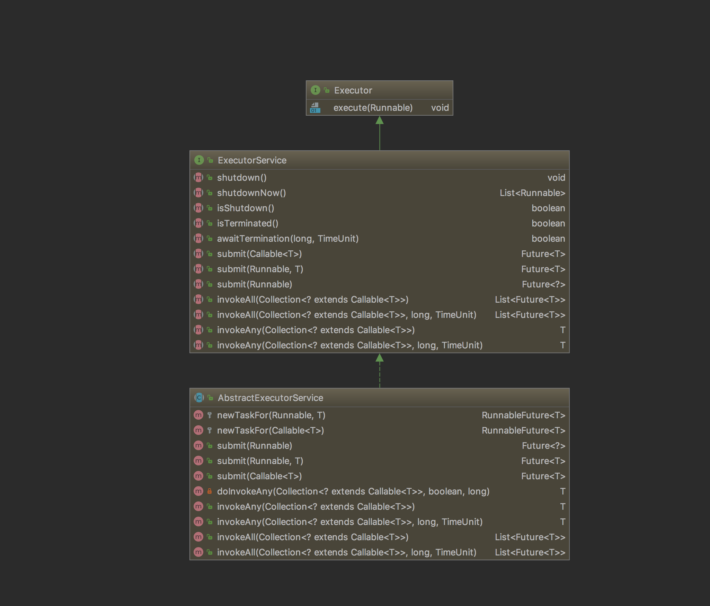

## [原文1](https://www.cnblogs.com/wanly3643/p/3910428.html)

# 线程池系列之AbstractExecutorService


AbstractExecutorService对ExecutorService的执行任务类型的方法提供了一个默认实现。
这些方法包括submit，invokeAny和InvokeAll。

注意的是来自Executor接口的execute方法是未被实现，
execute方法是整个体系的核心，所有的任务都是在这个方法里被真正执行的，
因此该方法的不同实现会带来不同的执行策略。
这个在后面分析ThreadPoolExecutor和ScheduledThreadPoolExecutor就能看出来。


AbstractExecutorService实现了ExecutorService和Executor接口的基本方法，
ThreadPoolExecute和ForkJoinPool继承AbstractExecutorService就可以减少实现的复杂度，
接口适配器模式
 

首先来看submit方法，它的基本逻辑是这样的：

1. 生成一个任务类型和Future接口的包装接口RunnableFuture的对象

2. 执行任务

3. 返回future


```java
 public Future<?> submit(Runnable task) {
        if (task == null) throw new NullPointerException();
        RunnableFuture<Void> ftask = newTaskFor(task, null);
        execute(ftask);
        return ftask;
    }

    public <T> Future<T> submit(Callable<T> task) {
        if (task == null) throw new NullPointerException();
        RunnableFuture<T> ftask = newTaskFor(task);
        execute(ftask);
        return ftask;
    }
   
```

因为submit支持Callable和Runnable两种类型的任务，因此newTaskFor方法有两个重载方法：


```java
  protected <T> RunnableFuture<T> newTaskFor(Callable<T> callable) {
        return new FutureTask<T>(callable);
    }

    protected <T> RunnableFuture<T> newTaskFor(Runnable runnable, T value) {
        return new FutureTask<T>(runnable, value);
    }


```

上一篇文章里曾经说过Callable和Runnable的区别在于前者带返回值，
也就是说Callable=Runnable+返回值。因此java中提供了一种adapter，
把Runnable+返回值转换成Callable类型。
这点可以在newTaskFor中的FutureTask类型的构造函数的代码中看到：

```java
 public FutureTask(Callable<V> callable) {
        if (callable == null)
            throw new NullPointerException();
        sync = new Sync(callable);
    }

    public FutureTask(Runnable runnable, V result) {
        sync = new Sync(Executors.callable(runnable, result));
    }
```


以下是Executors.callable方法的代码：


```java
    public static <T> Callable<T> callable(Runnable task, T result) {
        if (task == null)
            throw new NullPointerException();
        return new RunnableAdapter<T>(task, result);
    }
```

那么RunnableAdapter的代码就很好理解了，它是一个Callable的实现，
call方法的实现就是执行Runnable的run方法，然后返回那个value。

```java
    static final class RunnableAdapter<T> implements Callable<T> {
        final Runnable task;
        final T result;
        RunnableAdapter(Runnable task, T result) {
            this.task = task;
            this.result = result;
        }
        public T call() {
            task.run();
            return result;
        }
    }
```

接下来先说说较为简单的invokeAll：

1. 为每个task调用newTaskFor方法生成得到一个既是Task也是Future的包装类对象的List

2. 循环调用execute执行每个任务

3. 再次循环调用每个Future的get方法等待每个task执行完成

4. 最后返回Future的list。


```java
 public <T> List<Future<T>> invokeAll(Collection<? extends Callable<T>> tasks,
                                         long timeout, TimeUnit unit)
        throws InterruptedException {
        if (tasks == null || unit == null)
            throw new NullPointerException();
        long nanos = unit.toNanos(timeout);
        List<Future<T>> futures = new ArrayList<Future<T>>(tasks.size());
        boolean done = false;
        try {
            // 为每个task生成包装对象
            for (Callable<T> t : tasks)
                futures.add(newTaskFor(t));

            long lastTime = System.nanoTime();

            // 循环调用execute执行每个方法
            // 这里因为设置了超时时间，所以每次执行完成后
            // 检查是否超时，超时了就直接返回future集合
            Iterator<Future<T>> it = futures.iterator();
            while (it.hasNext()) {
                execute((Runnable)(it.next()));
                long now = System.nanoTime();
                nanos -= now - lastTime;
                lastTime = now;
                if (nanos <= 0)
                    return futures;
            }

            // 等待每个任务执行完成
            for (Future<T> f : futures) {
                if (!f.isDone()) {
                    if (nanos <= 0)
                        return futures;
                    try {
                        f.get(nanos, TimeUnit.NANOSECONDS);
                    } catch (CancellationException ignore) {
                    } catch (ExecutionException ignore) {
                    } catch (TimeoutException toe) {
                        return futures;
                    }
                    long now = System.nanoTime();
                    nanos -= now - lastTime;
                    lastTime = now;
                }
            }
            done = true;
            return futures;
        } finally {
            if (!done)
                for (Future<T> f : futures)
                    f.cancel(true);
        }
    }
```


最后说说invokeAny，它的难点在于只要一个任务执行成功就要返回，
并且会取消其他任务，也就是说重点在于找到第一个执行成功的任务。

这里我想到了BlockingQueue，当所有的任务被提交后，
任务执行返回的Future会被依次添加到一个BlockingQueue中，
然后找到第一个执行成功任务的方法就是从BlockingQueue取出第一个元素，
这个就是doInvokeAny方法用到的ExecutorCompletionService的基本原理。

因为两个invokeAny方法都是调用doInvokeAny方法，下面是doInvokeAny的代码分析：
```java
 private <T> T doInvokeAny(Collection<? extends Callable<T>> tasks,
                            boolean timed, long nanos)
        throws InterruptedException, ExecutionException, TimeoutException {
        if (tasks == null)
            throw new NullPointerException();
        int ntasks = tasks.size();
        if (ntasks == 0)
            throw new IllegalArgumentException();
        List<Future<T>> futures= new ArrayList<Future<T>>(ntasks);
        // ExecutorCompletionService负责执行任务，后面调用用poll返回第一个执行结果
        ExecutorCompletionService<T> ecs =
            new ExecutorCompletionService<T>(this);

        // 这里出于效率的考虑，每次提交一个任务之后，就检查一下有没有执行完成的任务

        try {
            ExecutionException ee = null;
            long lastTime = timed ? System.nanoTime() : 0;
            Iterator<? extends Callable<T>> it = tasks.iterator();

            // 先提交一个任务
            futures.add(ecs.submit(it.next()));
            --ntasks;
            int active = 1;

            for (;;) {
                // 尝试获取有没有执行结果（这个结果是立刻返回的）
                Future<T> f = ecs.poll();
                // 没有执行结果
                if (f == null) {
                    // 如果还有任务没有被提交执行的，就再提交一个任务
                    if (ntasks > 0) {
                        --ntasks;
                        futures.add(ecs.submit(it.next()));
                        ++active;
                    }
                    // 没有任务在执行了，而且没有拿到一个成功的结果。
                    else if (active == 0)
                        break;
                    // 如果设置了超时情况
                    else if (timed) {
                        // 等待执行结果直到有结果或者超时
                        f = ecs.poll(nanos, TimeUnit.NANOSECONDS);
                        if (f == null)
                            throw new TimeoutException();
                        // 这里的更新不可少，因为这个Future可能是执行失败的情况，那么还需要再次等待下一个结果，超时的设置还是需要用到。
                        long now = System.nanoTime();
                        nanos -= now - lastTime;
                        lastTime = now;
                    }
                    // 没有设置超时，并且所有任务都被提交了，则一直等到第一个执行结果出来
                    else
                        f = ecs.take();
                }
                // 有返回结果了，尝试从future中获取结果，如果失败了，那么需要接着等待下一个执行结果
                if (f != null) {
                    --active;
                    try {
                        return f.get();
                    } catch (ExecutionException eex) {
                        ee = eex;
                    } catch (RuntimeException rex) {
                        ee = new ExecutionException(rex);
                    }
                }
            }

            // ExecutorCompletionService执行时发生错误返回了全是null的future
            if (ee == null)
                ee = new ExecutionException();
            throw ee;

        } finally {
            // 尝试取消所有的任务（对于已经完成的任务没有影响）
            for (Future<T> f : futures)
                f.cancel(true);
        }
    }

```


后面接着分析ThreadPoolExecutor和ScheduledThreadPoolExecutor。


