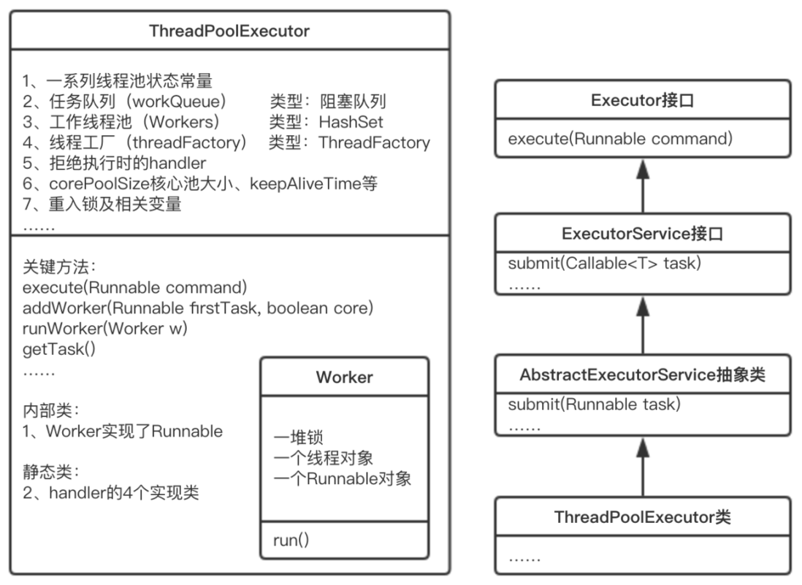
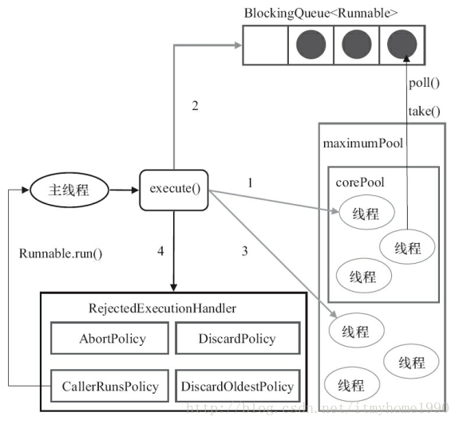
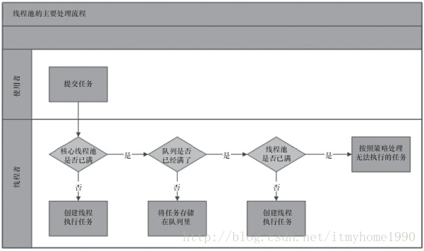
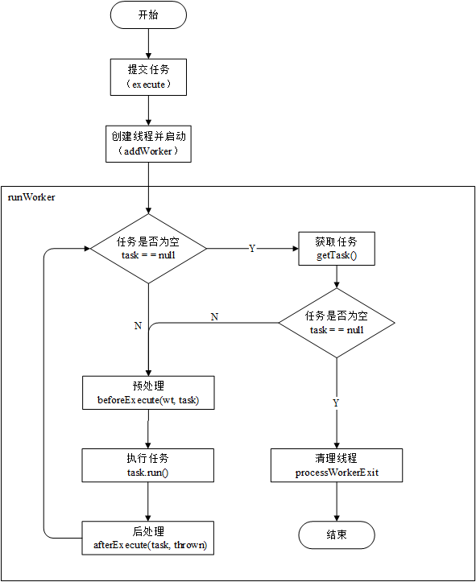

## [原文](http://blog.zhangjikai.com/2017/04/22/%E3%80%90Java-%E5%B9%B6%E5%8F%91%E3%80%91%E8%AF%A6%E8%A7%A3-ThreadPoolExecutor/)
## [原文](https://www.cnblogs.com/wanly3643/p/3911765.html)

#  详解 ThreadPoolExecutor

## 前言

线程池是并发中一项常用的优化方法，通过对线程复用，减少线程的创建，
降低资源消耗，提高程序响应速度。
在 Java 中我们一般通过 Exectuors 提供的工厂方法来创建线程池，
但是线程池的最终实现类是 ThreadPoolExecutor，
下面我们详细分析一下 ThreadPoolExecutor 的实现。

## 基本使用
我们首先看下线程池的基本使用。
在下面的代码中我们创建一个固定大小的线程池，该线程池中最多包含 5 个线程，
当任务数量超过线程的数量时，就将任务添加到任务队列，
等线程空闲之后再从任务队列中获取任务。

```java

import java.util.concurrent.ExecutorService;
import java.util.concurrent.Executors;
/**
 * Created by Jikai Zhang on 2017/4/17.
 */
public class ThreadPoolDemo {
    static class WorkThread implements Runnable {
        private String command;
        public WorkThread(String command) {
            this.command = command;
        }
        @Override
        public void run() {
            System.out.println("Thread-" + Thread.currentThread().getId() + " start. Command=" + command);
            processCommand();
            System.out.println("Thread-" + Thread.currentThread().getId() + " end.");
        }
        private void processCommand() {
            try {
                Thread.sleep(1000);
            } catch (InterruptedException e) {
                e.printStackTrace();
            }
        }
    }
    public static void main(String[] args) {
        ExecutorService executor = Executors.newFixedThreadPool(5);
        for (int i = 0; i < 10; i++) {
            Runnable work = new WorkThread("" + i);
            executor.execute(work);
        }
        executor.shutdown();
        while (!executor.isTerminated()) {
        }
        System.out.println("Finish all threads.");
    }
}
```


## 概述

在分析线程池的具体实现之前，我们首先看下线程池具体的工作流程，
只有先熟悉了流程，才能更好的理解线程池的实现。
线程池一般都会关联一个任务队列，用来缓存任务，
当线程执行完一个任务之后，会从任务队列中取下一个任务。
ThreadPoolExecutor 中使用阻塞队列作为任务队列，当任务队列为空时，就会阻塞请求任务的线程。

下面是 ThreadPoolExecutor 整体的图示：




下面我们着重看下 ThreadPoolExecutor 添加任务和关闭线程池的流程。

下图是 ThreadPoolExecutor 添加任务的流程：




我们首先看下添加任务的具体流程：

  - 如果线程池中的线程数量少于 corePoolSize，
  那么直接创建一个新的线程（不论线程池中是否有空闲线程），然后把该任务分配给新建线程，同时将线程加入到线程池中。
  
  - 如果线程池的线程数量大于等于 corePoolSize，就将任务添加到任务队列

  - 如果任务队列已经饱和（对于有边界的任务队列），
  那么就看下线程池中的线程数量是否少于 maximumPoolSize，如果少于，就创建新的线程，
  将当前任务分配给新线程，同时将线程加入到线程池中。否则就对该任务执行 reject 策略。

在 ThreadPoolExecutor 中通过两个量来控制线程池的大小：corePoolSize 和 maximumPoolSize。
 - corePoolSize 表示正常状态下线程池中应该持有的存活线程数量，
 
 - maximumPoolSize 表示线程池可以持有的最大线程数量。
 当线程池中的线程数量不超过 corePoolSize 时，位于线程池中的线程被看作 core 线程，
 默认情况下，线程池不对 core 线程进行超时控制，也就是 core 线程会一直存活在线程池中，
 直到线程池被关闭（这里忽略线程异常关闭的情况）。
 当线程池中的线程数量超过 corePoolSize 时，额外的线程被看作非 core 线程，
 线程池会对这部分线程进行超时控制，当线程空闲一段时间之后会销毁该线程。
 非 core 线程主要用来处理某段时间并发任务特别多的情况，
 即之前的线程配置无法及时处理那么多的任务量，需要额外的线程来帮助。
 而当这批任务处理完成之后，额外的线程就有些多余了（线程越多占的资源越多），因此需要及时销毁。

ThreadPoolExecutor 定义线程数量上限是 2^29 - 1 = 536870911（后面会讲到为什么是这个数），
同时用户可以自定义最大线程数量，ThreadPoolExecutor 处理时会选两者之间的较小值。
当线程池的线程数量等于 maximumPoolSize 时，说明线程池也已经饱和了，
此时对于新来的任务就要执行 reject 策略，JDK 中定义了四种拒绝策略：

 - AbortPolicy：直接抛出异常，默认策略

 - CallerRunsPolicy：使用调用者所在的线程执行任务
 
 - DiscardOldestPolicy：丢弃当前任务队列中最前面的任务，并执行 execute 方法添加新任务
 
 - DiscardPolicy：直接丢弃任务


下面再看一下线程池的关闭。线程池的关闭分为两种：平缓关闭（shutdown）和立即关闭（shutdownNow）。
当调用 shutdown 方法之后，线程池不再接受新的任务，但是仍然会将任务队列中已有的任务执行完毕。
而调用 shutdownNow 方法之后，线程池不仅不再接受新的任务，
也不会再执行任务队列中剩余的任务，
同时会通过中断的方式尝试停止正在执行任务的线程（我们知道对于中断，线程可能响应也可能不响应，所以不能保证一定停止线程）。

## 具体实现

下面我们从源码的角度分析一下 ThreadPoolExecutor 的实现。


### Worker
ThreadPoolExecutor 中每个线程都关联一个 Worker 对象，
而 ThreadPool 里实际上保存的就是线程关联的 Worker 对象。 
Worker 类对线程进行包装，它除了保存关联线程的信息，还保存一些其他的信息，
如线程创建时分配的首任务，线程已完成的任务数量。
Worker 实现了 Runnable 接口，创建线程时往 Thread 类传的参数就是该对象，
所以线程创建后会执行 Worker 的 run 方法。
同时 Worker 类还继承了 AbstractQueuedSynchronizer，
使自身成为一个不可重入的互斥锁（以下称为 Worker 锁，注意 Worker 锁是不可重入的，也就是说该锁只能被一个线程获取一次），
因此每个线程实际上也关联了一个互斥锁。
当线程执行任务时，需要首先获得关联的 Worker 锁，执行完任务之后再释放该锁。
Worker 锁的主要作用是为了平缓关闭线程池时，判断线程是否空闲（根据能否获得 Worker 锁），
后续会详细讲解。下面是 Worker 类的实现，我们只保留了一些必要的内容：

```java
private final class Worker extends AbstractQueuedSynchronizer implements Runnable {
    // 当前 Worker 对象关联的线程
    final Thread thread;
    // 线程创建后的初始任务
    Runnable firstTask;
    // 线程完成的任务数量
    volatile long completedTasks;
    /**
     * Creates with given first task and thread from ThreadFactory.
     * @param firstTask the first task (null if none)
     */
    Worker(Runnable firstTask) {
        // 只有 state 为 0，线程才能获取到 Worker 锁，这里将 state 设为 -1，
        // 表明任何线程都无法获取锁，在 shutdown 方法中，如果要中断线程，需要首先获得线程
        // 关联的 Worker 锁，而 shutdownNow 中断线程之前，会首先判断 state 是否大于等于 0
        // 所以这里将 state 设为 -1，可以防止当前线程被中断
        setState(-1); // inhibit interrupts until runWorker
        this.firstTask = firstTask;
        // 创建线程时将自身传入
        this.thread = getThreadFactory().newThread(this);
    }
    /** Delegates main run loop to outer runWorker  */
    // 线程创建之后会运行该方法
    public void run() {
        runWorker(this);
    }
    // 只要线程启动了，就中断线程，用于 shutdownNow 方法
    void interruptIfStarted() {
        Thread t;
        if (getState() >= 0 && (t = thread) != null && !t.isInterrupted()) {
            try {
                t.interrupt();
            } catch (SecurityException ignore) {}
        }
    }
}
```

我们看到在 Worker 的构造函数中将 state 设为了 -1，
注释里给出的解释是：禁止中断直到执行了 runWorker 方法。

#### 其实这里包含了两个问题：

1.为什么要等到执行了 runWorker 方法 

2.怎样禁止中断。对于第一个问题，我们知道中断是针对运行的线程，
当线程创建之后只有调用了 start 方法，线程才真正运行，
而 start 方法的调用是在 runWorker 方法中的，也就是有只有执行了 runWorker 方法，
线程才真正启动。对于第二个问题，这个主要是针对 shutdown 和 shutdownNow 方法的。
在 shutdown 方法中，中断线程之前会首先尝试获取线程的 Worker 锁，
只有获得了 Worker 锁才对线程进行中断。
而获得 Worker 锁的前提是 Worker 的锁的状态变量 state 为 0，
当 state 设为 -1 之后，任何线程都无法获得该锁，那么也就无法对线程执行中断操作。
而在 shutdownNow 方法中，会调用 Worker 的 interruptIfStarted 方法来中断线程，
而 interruptIfStarted 方法只有在 state >= 0 时才会中断线程，
所以将 state 设为 -1 可以防止线程被提前中断。当执行 runWorker 方法时，
会为传入 Worker 对象执行 unlock 操作（也就是将 state 加 1），
使 Worker 对象的 state 变为 0，这样就使线程处于可被中断的状态了。

### 状态变量

在 ThreadPoolExecutor 中定义了一个 AtomicInteger 类型的变量 ctl，
用来保存线程池的状态和线程数量信息。下面是该变量的定义：

> private final AtomicInteger ctl = new AtomicInteger(ctlOf(RUNNING, 0));

ctl 使用低 29 位保存线程的数量（这就是线程池最大线程数量为 2^29-1 的原因），
高 3 位保存线程池的状态。
为了提取出这两个信息，ThreadPoolExecutor 定义了一个低 29 位全为 1 的变量 CAPACITY，
通过和 CAPACITY 进行 & 运算可以获得线程的数量，
通过和 ~CAPACITY 进行 & 运算可以获得线程池的状态，下面是程序中的实现：

```java

// 存储线程数量的 bit 位数，这里是 29
private static final int COUNT_BITS = Integer.SIZE - 3;
// 用于提取线程池的运行状态以及线程数量，低 29 位全为 1，高 3 位为0
private static final int CAPACITY = (1 << COUNT_BITS) - 1;
// 获得线程池的运行状态
private static int runStateOf(int c) {
    return c & ~CAPACITY;
}
// 获得线程的数量
private static int workerCountOf(int c) {
    return c & CAPACITY;
}

```

#### ThreadPoolExecutor 中为线程池定义了五种状态：

- RUNNING：正常状态，接受新的任务，并处理任务队列中的任务

- SHUTDOWN：不接受新的任务，但是处理已经在任务队列中的任务

- STOP： 不接受新的任务，也不处理已经在任务队列中的任务，同时会尝试停止正在执行任务的线程

- TIDYING： 线程池和任务队列都为空，该状态下线程会执行 terminated() 方法

- TERMINATED：terminated() 方法执行完毕

#### 下面是 JDK 中关于这 5 个变量的定义：

```java


// 11100000000000000000000000000000  -536870912
private static final int RUNNING = -1 << COUNT_BITS;
// 00000000000000000000000000000000  0
private static final int SHUTDOWN = 0 << COUNT_BITS;
// 00100000000000000000000000000000  536870912
private static final int STOP = 1 << COUNT_BITS;
// 01000000000000000000000000000000  1073741824
private static final int TIDYING = 2 << COUNT_BITS;
// 01100000000000000000000000000000  1610612736
private static final int TERMINATED = 3 << COUNT_BITS;
```

#### 下面是各状态之间的转换：

- RUNNING -> SHUTDOWN：调用了 shutdown() 方法 （perhaps implicitly in finalize()）

- (RUNNING or SHUTDOWN) -> STOP：调用了shutdownNow() 方法

- SHUTDOWN -> TIDYING：线程池和任务队列都为空

- STOP -> TIDYING：线程池为空

- TIDYING -> TERMINATED：执行完 terminated() 方法


### 添加任务

通过 execute 或者 submit 方法都可以向线程池中添加一个任务，
submit 会返回一个 Future 对象来获取线程的返回值，下面是 submit 方法的实现：

```java

public Future <?> submit(Runnable task) {
    if (task == null) throw new NullPointerException();
    RunnableFuture <Void> ftask = newTaskFor(task, null);
    execute(ftask);
    return ftask;
}
```

我们看到 submit 中只是将 Runnable 对象包装了一下，最终还是调用了 execute 方法。
下面我们看下 execute 方法的实现：

```java

public void execute(Runnable command) {
    // command 不能为 null
    if (command == null)
        throw new NullPointerException();
    int c = ctl.get();
    // 线程数量少于 corePoolSize，会创建一个新的线程执行该任务
    if (workerCountOf(c) < corePoolSize) {
        // true 表示当前添加的线程为核心线程
        if (addWorker(command, true))
            return;
        c = ctl.get();
    }
    // 线程数量大于等于 corePoolSize，首先尝试将任务添加到任务队列
    // workQueue.offer 会将任务添加到队列尾部
    if (isRunning(c) && workQueue.offer(command)) {
        // 重新检查状态
        int recheck = ctl.get();
        // 如果发现当前线程池不是处于 Running 状态，就移除之前的任务
        // 移除任务过程有锁保护
        if (!isRunning(recheck) && remove(command)) {
            reject(command);
        } else if (workerCountOf(recheck) == 0) {
            // workerCountOf 用来统计当前的工作线程数量，程序执行到这里，有下面两种可能：
            //  1. 当前线程池处于 Running 状态，但是工作线程数量为 0，
            //      需要创建新的线程
            //  2. 移除任务失败，但是工作线程数量为 0，
            //      需要创建新的线程来完成移除失败的任务
            //
            //  因为前面对任务做了判断，所以正常情况下向 addWorker 里传入的任务
            //  不可能为 null，这里传入 null 是告诉 addWorker 需要创建新的线程，
            //  在 addWorker 里对 null 有专门的处理逻辑
            addWorker(null, false);
        }
    // 下面的 else 说明线程池不是 Running 状态或者任务队列满了，
    } else if (!addWorker(command, false)) {
        // 这里说明线程池不是 Running 状态或者线程池饱和了
        reject(command);
    }
}
```

在前面我们提到了线程池添加任务的流程，这里再重述一下

- 如果线程池的线程数量少于 corePoolSize，则新建一个线程，执行当前任务，并将该任务加入到线程池

- 如果线程池中的线程数量大于等于 corePoolSize，则首先将任务添加到任务队列

- 如果任务队列已满，则继续创建线程，如果线程池达到了饱和值 maximumPoolSize，则调用 reject 策略处理该任务。

addWorker 方法会创建并启动线程，当线程池不处于 Running 状态并且传入的任务不为 null，
addWorker 就无法成功创建线程。下面看下它的具体实现：

```java
private boolean addWorker(Runnable firstTask, boolean core) {
    // retry 类似于 goto，continue retry 跳转到 retry 定义，
    // 而 break retry 跳出 retry
    retry:
    for (;;) {
        int c = ctl.get();
        int rs = runStateOf(c);
        // 我们在下面详细讲解该条件
        if (rs >= SHUTDOWN && !(rs == SHUTDOWN && firstTask == null && !workQueue.isEmpty()))
            return false;
        for (;;) {
            int wc = workerCountOf(c);
            // 线程数量大于系统规定的最大线程数或者大于 corePoolSize/maximumPoolSize
            // 表明线程池中无法添加新的线程，这里 wc >= CAPACITY 为了防止 corePoolSize
            // 或者 maximumPoolSize 大于CAPACITY
            if (wc >= CAPACITY || wc >= (core ? corePoolSize : maximumPoolSize)) {
                return false;
            }
            // 使用 CAS 方式将线程数量增加，如果成功就跳出 retry
            if (compareAndIncrementWorkerCount(c)) {
                break retry;
            }
            c = ctl.get(); // Re-read ctl
            // 如果线程池运行状态发生了改变就从 retry（外层循环）处重新开始，
            if (runStateOf(c) != rs)
                continue retry;
            // 程序执行到这里说 CAS 没有成功，那么就再次执行 CAS
        }
    }
    boolean workerStarted = false;
    boolean workerAdded = false;
    Worker w = null;
    try {
        // 创建 work
        w = new Worker(firstTask);
        final Thread t = w.thread;
        // t != null 说明线程创建成功了
        if (t != null) {
            // 程序用一个 HashSet 存储线程，而 HashSet 不是线程的安全的，
            // 所以将线程加入 HashSet 的过程需要加锁。
            final ReentrantLock mainLock = this.mainLock;
            mainLock.lock();
            try {
                // Recheck while holding lock.
                // Back out on ThreadFactory failure or if
                // shut down before lock acquired.
                int rs = runStateOf(ctl.get());
                // 1. rs < SHUTDOWN 说明程序在运行状态
                // 2. rs == SHUTDOWN  说明当前线程处于平缓关闭状态，而 firstTask == null
                //    说明当前创建的线程是为了处理任务队列中剩余的任务（故意传入 null）
                if (rs < SHUTDOWN || (rs == SHUTDOWN && firstTask == null)) {
                    // 线程是存活状态说明线程提前开始了。
                    if (t.isAlive()) // precheck that t is startable
                        throw new IllegalThreadStateException();
                    workers.add(w);
                    int s = workers.size();
                    if (s > largestPoolSize)
                        largestPoolSize = s;
                    workerAdded = true;
                }
            } finally {
                mainLock.unlock();
            }
            if (workerAdded) {
                // 启动线程
                t.start();
                workerStarted = true;
            }
        }
    } finally {
        if (!workerStarted)
            addWorkerFailed(w);
    }
    return workerStarted;
}
```

这里我们着重看下返回 false 的条件：

```java

if (rs >= SHUTDOWN && !(rs == SHUTDOWN && firstTask == null && !workQueue.isEmpty()))
// 等价于
if(rs >= SHUTDOWN && (rs != SHUTDOWN || firstTask != null || workQueue.isEmpty()))
```

我们依次看下上面的条件：

- rs >= SHUTDOWN && rs != SHUTDOWN：说明线程池处于 STOP，TIDYING 或者 TERMINATED 状态下，
处于这三种状态说明线程池处理完了所有任务或者不再执行剩余的任务，可以直接返回

- rs == SHUTDOWN && firstTask != null：如果上面的条件不成立，说明当前线程池的状态一定是处于 SHUTDOWN 状态，
在 execute 方法中，我们提到了如果传入 null，说明创建线程是为了执行队列中剩余的任务（此时线程池中没有工作线程），
这时就不应该返回。而如果 firstTask != null，说明不是为了处理队列中剩余的任务，可以返回。

- rs == SHUTDOWN && workQueue.isEmpty()：说经任务队列中的任务已经全部执行完了，无需创建新的线程，可以返回。

当创建了线程并成功启动之后，会执行 Worker 的 run 方法，而该方法最终调用了 ThreadPoolExecutor 的 runWorker 方法，
并且将自身作为参数传进去了，下面是 runWorker 方法的实现：

```java

final void runWorker(Worker w) {
    Thread wt = Thread.currentThread();
    Runnable task = w.firstTask;
    w.firstTask = null;
    // 这里将 Worker 中的 state 设为 0，以便其他线程可以获得锁
    // 从而可以中断当前线程
    w.unlock(); // allow interrupts
    // 用来标记线程是正常退出循环还是异常退出
    boolean completedAbruptly = true;
    try {
        // 如果任务不为空，说明是刚创建线程，如果任务为空，则从队列中取任务
        // 如果队列没有任务，线程就会阻塞在这里
        while (task != null || (task = getTask()) != null) {
            w.lock();
            // If pool is stopping, ensure thread is interrupted;
            // if not, ensure thread is not interrupted.  This
            // requires a recheck in second case to deal with
            // shutdownNow race while clearing interrupt
            if ((runStateAtLeast(ctl.get(), STOP) ||
                (Thread.interrupted() && runStateAtLeast(ctl.get(), STOP))) && !wt.isInterrupted())
                wt.interrupt();
            try {
                // 任务执行之前做一些处理，空函数，需要用户定义处理逻辑
                beforeExecute(wt, task);
                Throwable thrown = null;
                try {
                    task.run();
                } catch (RuntimeException x) {
                    thrown = x;
                    throw x;
                } catch (Error x) {
                    thrown = x;
                    throw x;
                } catch (Throwable x) {
                    thrown = x;
                    // 因为 runnable 方法不能抛出 checkedException ，所以这里
                    // 将异常包装成 Error 抛出
                    throw new Error(x);
                } finally {
                    // 任务执行完之后做一些处理，默认空函数
                    afterExecute(task, thrown);
                }
            } finally {
                task = null;
                w.completedTasks++;
                w.unlock();
            }
        }
        completedAbruptly = false;
    } finally {
        processWorkerExit(w, completedAbruptly);
    }
}
```

在上面的代码中，第一个 if 判断的逻辑有点难理解，我们将它拿出分析一下。

```java

private static boolean runStateAtLeast(int c, int s) {
    return c >= s;
}
if ((runStateAtLeast(ctl.get(), STOP) || (Thread.interrupted() && runStateAtLeast(ctl.get(), STOP)))
    && !wt.isInterrupted())
    wt.interrupt();
```

这段 if 代码块的功能有两个：

- 如果当前线程池的状态小于 STOP，也就是处于 RUNNING 或者 SHUTDOWN 状态，要保证线程池中的线程处于非中断状态

- 如果当前线程池的状态大于等于 STOP，也就是处于 STOP，TIDYING 或者 TERMINATED 状态，要保证线程池中的线程处于中断状态

上面的 if 代码中括号比较多，我们先将其分为两个大条件：

- runStateAtLeast(ctl.get(), STOP) || (Thread.interrupted() && runStateAtLeast(ctl.get(), STOP)) &&

- !wt.isInterrupted()


我们先看第二个条件：!wt.isInterrupted()，该条件说明当前线程没有被中断，只有在线程没有被中断的前提下，
才有可能对线程执行中断操作。然后我们将第一个大条件再进行拆分，可以分为下面两个条件：

- runStateAtLeast(ctl.get(), STOP) ||

- Thread.interrupted() && runStateAtLeast(ctl.get(), STOP)


我们先看第一个条件，该条件说明线程处于 STOP 以及之后的状态，线程应该被中断。如果该条件不成立，
说明当前线程不应该被中断，那么会调用 Thread.interrupted() 方法，该方法会首返回线程的中断状态，
然后重置线程中断状态（设为 false），如果中断状态本来就为 false，那么就可以就可以跳出 if 代码块了，
但是如果中断状态是 true，说明线程被中断过了，
此时我们就要判断线程的中断是不是由 shutdownNow 方法（并发调用，该方法会中断线程池的线程，
并修改线程池状态为 STOP，后面会讲到）造成的，
所以我们需要再检查一下线程的状态，如果发现当前线程池已经变为 STOP 或者之后的状态，
说明确实是由 shutdownNow 方法造成的，需要重新对线程进行中断，如果不是那就不需要再中断线程了。

我们看到在 runWorker 里会一直循环调用 getTask 来获取任务，下面来看下 getTask 的实现

```java
/**
 * getTask 返回 null，说明当前线程需要被回收了
 */
private Runnable getTask() {
    boolean timedOut = false; // Did the last poll() time out?
    for (;;) {
        int c = ctl.get();
        int rs = runStateOf(c);
        // rs >= SHUTDOWN 说明当前线程池至少处于待关闭状态，不再接受新的任务
        //  1. rs >= STOP： 说明不需要在再处理任务了（即便有任务）
        //  2. workQueue.isEmpty(): 说明任务队列中剩余的任务已经处理完了
        if (rs >= SHUTDOWN && (rs >= STOP || workQueue.isEmpty())) {
            decrementWorkerCount();
            return null;
        }
        int wc = workerCountOf(c);
        // Are workers subject to culling?
        // timed 用于判断是否需要对线程进行超时控制
        //  1. allowCoreThreadTimeOut: 为 true 说明可以对 core 线程进行超时控制
        //  2. wc > corePoolSize: 说明线程池中有非 core 线程
        boolean timed = allowCoreThreadTimeOut || wc > corePoolSize;
        // 1. wc > maximumPoolSize || (timed && timedOut)
        //     线程数量大于 maximumPoolSize 值了 或者 允许超时控制并且超时了
        // 2. wc > 1 || workQueue.isEmpty()
        //     线程中活动线程的数量大于 1 或者 任务队列为空（不需要在留线程执行剩余的任务了）
        // 如果上面 1 和 2 都成立，就使用 CAS 将线程数量减 1 并返回 null 回收当前线程
        // 如果 CAS 失败了就重试
        if ((wc > maximumPoolSize || (timed && timedOut)) && (wc > 1 || workQueue.isEmpty())) {
            if (compareAndDecrementWorkerCount(c))
                return null;
            continue;
        }
        try {
            // 如果允许超时控制，则执行 poll 方法，该方法响应超时，当 keepAliveTime 时间内
            // 仍然没有获取到任务，就返回 null。take 方法不响应超时操作，当获取不到任务时会一直等待。
            // 另外不管 poll 还是 take 方法都会响应中断，如果没有新的任务添加到队列中
            // 会直接抛出 InterruptedException
            Runnable r = timed ? workQueue.poll(keepAliveTime, TimeUnit.NANOSECONDS) : workQueue.take();
            if (r != null)
                return r;
            // 执行到这里说明超时了
            timedOut = true;
        } catch (InterruptedException retry) {
            timedOut = false;
        }
    }
}
```

当 getTask 返回 null 的时候说明线程需要被回收了，我们总结一下在 getTask 中返回 null 的情况：

- 线程池总工作线程数量大于 maximumPoolSize（一般是由于我们调用 setMaximumPoolSize 方法重新设置了 maximumPoolSize）

- 线程池已经被停止 （状态 >= STOP）

- 线程池处于 SHUTDOWN 状态，并且任务队列为空

- 线程在等待任务时超时

我们将 runWorker 和 getTask 结合起来看，整个流程就比较明朗了：

- 通过 while 循环不断的从任务队列中获取任务，如果当前任务队列中没有任务，就阻塞线程。
如果 getTask 返回 null，表明当前线程应该被回收，执行回收线程的逻辑。

- 如果成功获取任务，首先判断线程池的状态，根据线程池状态设置当前线程的中断状态

- 在执行任务之前做一些预处理（用户实现）

- 执行任务

- 在执行任务之后做一些后处理（用户实现）

上面两个方法是整个线程池中比较核心的部分，在这两个方法中，完成了任务获取与阻塞线程的工作。
下面是线程 提交 -> 处理任务 -> 回收 的流程图：




### 下面我们再看下 processWorkerExit 方法，该方法主要用来完成线程的回收工作：

```java
private void processWorkerExit(Worker w, boolean completedAbruptly) {
    // 如果 completedAbruptly 为 true，说明线程是由于抛出异常而跳出循环的，
    // 没有正确执行 getTask 中减少线程数量的逻辑，所以这里要将线程数量减一
    if (completedAbruptly) // If abrupt, then workerCount wasn't adjusted
        decrementWorkerCount();
    final ReentrantLock mainLock = this.mainLock;
    mainLock.lock();
    try {
        // 更新已完成的任务数量，并移除工作线程
        completedTaskCount += w.completedTasks;
        workers.remove(w);
    } finally {
        mainLock.unlock();
    }
    // 尝试终止线程池
    tryTerminate();
    int c = ctl.get();
    // 如果线程状态是 SHUTDOWN 或者 RUNNING，需要保证线程中的最少线程数量
    // 1. 如果线程是由于抛出异常而结束的，直接添加一个线程
    // 2. 如果线程是正常结束的
    //    * 如果允许对 core 线程进行超时控制，并且任务队列中有任务
    //      则保证线程数量大于等于 1
    //    * 如果不允许对 core 进行超时控制，则保证线程数量大于等于 corePoolSize
    if (runStateLessThan(c, STOP)) {
        if (!completedAbruptly) {
            int min = allowCoreThreadTimeOut ? 0 : corePoolSize;
            if (min == 0 && !workQueue.isEmpty())
                min = 1;
            if (workerCountOf(c) >= min)
                return; // replacement not needed
        }
        addWorker(null, false);
    }
}
```

我们看到 processWorkerExit 中调用了 tryTerminate 方法，该方法主要用来终止线程池。
如果线程池满足终止条件，首先将线程池状态设为 TIDYING，
然后执行 terminated 方法，最后将线程池状态设为 TERMINATED。
在 shutdown 和 shutdownNow 方法中也会调用该方法 。

```java
final void tryTerminate() {
    for (;;) {
        int c = ctl.get();
        // 如果出现下面三种情况，就不执行终止线程池的逻辑，直接返回
        //  1. 当前线程池处于 RUNNING 状态，不能停止
        //  2. 当前线程池状态为 TIDYING 或者 TERMINATED，不需要停止
        //  3. 当前线程池状态为 SHUTDOWN 并且任务队列不为空
        if (isRunning(c) || runStateAtLeast(c, TIDYING) ||
            (runStateOf(c) == SHUTDOWN && !workQueue.isEmpty()))
            return;
        // 判断工作线程的数量是否为 0
        if (workerCountOf(c) != 0) { // Eligible to terminate
            // 如果工作线程数量不为 0，就尝试中断正在线程池中的空闲线程
            // ONLY_ONE 说明只尝试中断线程池中第一个线程（不管线程空不空闲）
            interruptIdleWorkers(ONLY_ONE);
            return;
        }
        final ReentrantLock mainLock = this.mainLock;
        mainLock.lock();
        try {
            // 将线程状态设为 TIDYING，如果设置不成功说明线程池的状态发生了变化，需要重试
            // 这里线程池状态从 TIDYING 到 TERMINATED 状态转换是原子的
            if (ctl.compareAndSet(c, ctlOf(TIDYING, 0))) {
                try {
                    // 执行 terminated 方法（默认空方法）
                    terminated();
                } finally {
                    // 将线程状态设为 TERMINATED
                    ctl.set(ctlOf(TERMINATED, 0));
                    termination.signalAll();
                }
                return;
            }
        } finally {
            mainLock.unlock();
        }
        // else retry on failed CAS
    }
}
```


在 tryTerminate 方法中， 如果满足下面两个条件，就将线程池状态设为 TERMINATED：

- 线程池状态为 SHUTDOWN 并且线程池和任务队列均为空

- 线程池状态为 STOP 并且线程池为空

如果线程池处于 SHUTDOWN 或者 STOP 状态，但是工作线程不为空，
那么 tryTerminate 会尝试去中断线程池中的一个线程，
这样做主要是为了防止 shutdown 的中断信号丢失（我们在 shutdown 方法处再详细讨论）。
下面看下 interruptIdleWorkers 方法，该方法主要中断 空闲 线程。

```java
private void interruptIdleWorkers(boolean onlyOne) {
    final ReentrantLock mainLock = this.mainLock;
    mainLock.lock();
    try {
        for (Worker w: workers) {
            Thread t = w.thread;
            // 首先看当前线程是否已经中断，如果没有中断，就看线程是否处于空闲状态
            // 如果能获得线程关联的 Worker 锁，说明线程处于空闲状态，可以中断
            // 否则说明线程不能中断
            if (!t.isInterrupted() && w.tryLock()) {
                try {
                    t.interrupt();
                } catch (SecurityException ignore) {} finally {
                    w.unlock();
                }
            }
            // 如果 onlyOne 为 true，只尝试中断第一个线程
            if (onlyOne)
                break;
        }
    } finally {
        mainLock.unlock();
    }
}
```


### 关闭线程池

通过 shutdown 和 shutdownNow 我们可以关闭线程池，关于两者的区别在前面已经提到了，这里不再赘述。
我们首先看下 shutdown 方法：

```java
public void shutdown() {
    final ReentrantLock mainLock = this.mainLock;
    mainLock.lock();
    try {
        // 检查当前线程是否有关闭线程池的权限
        checkShutdownAccess();
        // 将线程池状态设为 SHUTDOWN
        advanceRunState(SHUTDOWN);
        // 中断线程，这里最终调用 interruptIdleWorkers(false);
        interruptIdleWorkers();
        // hook 方法，默认为空，让用户在线程池关闭时可以做一些操作
        onShutdown(); // hook for ScheduledThreadPoolExecutor
    } finally {
        mainLock.unlock();
    }
    tryTerminate();
}
```

在前面我们知道 interruptIdleWorkers 会先检查线程是否是空闲状态，
如果发现线程不是空闲状态，才会中断线程。而这时中断线程的主要目的是让在任务队列中阻塞的线程醒过来。
考虑下面的情况，如果执行 interruptIdleWorkers 时，线程正在运行，所以没有被中断，
但是线程执行完任务之后，任务队列恰好为空，线程就会处于阻塞状态，
而此时 shutdown 已经执行完 interruptIdleWorkers 操作了（即线程错过了 shutdown 的中断信号），
如果没有额外操作，线程会一直处于阻塞状态。所以为了防止这种情况，在 tryTerminate() 中也增加了 interruptIdleWorkers 操作，
主要就是为了弥补 shutdown 中丢失的信号。

最后我们再看下 shutdownNow 方法：

```java
public List < Runnable > shutdownNow() {
    List < Runnable > tasks;
    final ReentrantLock mainLock = this.mainLock;
    mainLock.lock();
    try {
        // 检查线程是否具有关闭线程池的权限
        checkShutdownAccess();
        // 更改线程状态
        advanceRunState(STOP);
        // 中断线程
        interruptWorkers();
        // 清除任务队列，并将任务返回
        tasks = drainQueue();
    } finally {
        mainLock.unlock();
    }
    tryTerminate();
    return tasks;
}
```

然后我们看下 interruptWorkers 方法：


```java
private void interruptWorkers() {
    final ReentrantLock mainLock = this.mainLock;
    mainLock.lock();
    try {
        // 不管线程是否空闲都执行中断
        for (Worker w: workers)
            w.interruptIfStarted();
    } finally {
        mainLock.unlock();
    }
}
```


从上面的代码中我们可以看到在 interruptWorkers 方法中，只要线程开始了，
就对线程执行中断，所以 shutdownNow 的中断信号不会丢失。
最后我们再看下 drainQueue 方法，该方法主要作用是清空任务队列，并将队列中剩余的任务返回。

```java
private List <Runnable> drainQueue() {
    BlockingQueue <Runnable> q = workQueue;
    ArrayList <Runnable> taskList = new ArrayList < Runnable > ();
    // 该方法会将阻塞队列中的所有项添加到 taskList 中
    // 然后清空任务队列，该方法是线程安全的
    q.drainTo(taskList);
    if (!q.isEmpty()) {
    	// 将 List 转换为 数组，传入的 Runnable[0] 用来说明是转为 Runnable 数组
        for (Runnable r: q.toArray(new Runnable[0])) {
            if (q.remove(r))
                taskList.add(r);
        }
    }
    return taskList;
}
```

## 线程池监控

本节摘自 [深入理解Java线程池：ThreadPoolExecutor](http://ideabuffer.cn/2017/04/04/%E6%B7%B1%E5%85%A5%E7%90%86%E8%A7%A3Java%E7%BA%BF%E7%A8%8B%E6%B1%A0%EF%BC%9AThreadPoolExecutor/)

通过线程池提供的参数进行监控。线程池里有一些属性在监控线程池的时候可以使用

- getTaskCount：线程池已经执行的和未执行的任务总数；

- getCompletedTaskCount：线程池已完成的任务数量，该值小于等于taskCount；

- getLargestPoolSize：线程池曾经创建过的最大线程数量。通过这个数据可以知道线程池是否满过，也就是达到了maximumPoolSize；

- getPoolSize：线程池当前的线程数量；

- getActiveCount：当前线程池中正在执行任务的线程数量。

通过这些方法，可以对线程池进行监控，在ThreadPoolExecutor类中提供了几个空方法，
如beforeExecute方法，afterExecute方法和terminated方法，可以扩展这些方法在执行前或执行后增加一些新的操作，
例如统计线程池的执行任务的时间等，可以继承自ThreadPoolExecutor来进行扩展。


## 参考文章

- [Java线程池架构(一)原理和源码解析](http://ifeve.com/java-threadpoolexecutor/)

- [Java线程池–原理及源码分析](https://www.jianshu.com/p/117571856b28)


- [Java并发包源码学习之线程池（一）ThreadPoolExecutor源码分析](http://zhanjindong.com/2015/03/30/java-concurrent-package-ThreadPoolExecutor)

- [深入理解Java线程池：ThreadPoolExecutor](http://ideabuffer.cn/2017/04/04/%E6%B7%B1%E5%85%A5%E7%90%86%E8%A7%A3Java%E7%BA%BF%E7%A8%8B%E6%B1%A0%EF%BC%9AThreadPoolExecutor/)


