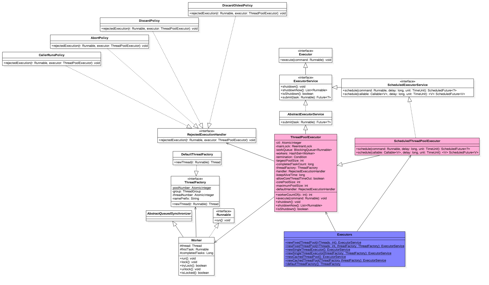

## [原文](https://www.jianshu.com/p/3cc67876375f)

# Java中线程池ThreadPoolExecutor原理探究

## 一、 前言

线程池主要解决两个问题：一方面当执行大量异步任务时候线程池能够提供较好的性能，，
这是因为使用线程池可以使每个任务的调用开销减少（因为线程池线程是可以复用的）。
另一方面线程池提供了一种资源限制和管理的手段，比如当执行一系列任务时候对线程的管理，
每个ThreadPoolExecutor也保留了一些基本的统计数据，比如当前线程池完成的任务数目。

另外，线程池提供许多可调参数和可扩展性钩子。程序员可以使用更方便
工厂方法比如newCachedThreadPool（无限线程池，线程自动回收），
newFixedThreadPool（固定大小的线程池）newSingleThreadExecutor（单个线程），
当然用户还可以自定义。
 
## 二、 类图结构


 
 
Executors其实是个工具类，里面提供了好多静态方法，根据用户选择返回不同的线程池实例。
ThreadPoolExecutor继承了AbstractExecutorService，
成员变量ctl是个Integer的原子变量用来记录线程池状态 和 线程池线程个数，
类似于ReentrantReadWriteLock使用一个变量存放两种信息。
Integer类型是32位二进制标示，其中高3位用来表示线程池状态，后面 29位用来记录线程池线程个数。

```java

//用来标记线程池状态（高3位），线程个数（低29位）
//默认是RUNNING状态，线程个数为0

private final AtomicInteger ctl = new AtomicInteger(ctlOf(RUNNING, 0));

//线程个数掩码位数
private static final int COUNT_BITS = Integer.SIZE - 3;

//线程最大个数(低29位)00011111111111111111111111111111
private static final int CAPACITY   = (1 << COUNT_BITS) - 1;

//（高3位）：11100000000000000000000000000000
private static final int RUNNING    = -1 << COUNT_BITS;

//（高3位）：00000000000000000000000000000000
private static final int SHUTDOWN   =  0 << COUNT_BITS;

//（高3位）：00100000000000000000000000000000
private static final int STOP       =  1 << COUNT_BITS;

//（高3位）：01000000000000000000000000000000
private static final int TIDYING    =  2 << COUNT_BITS;

//（高3位）：01100000000000000000000000000000
private static final int TERMINATED =  3 << COUNT_BITS;

// 获取高三位 运行状态
private static int runStateOf(int c)     { return c & ~CAPACITY; }

//获取低29位 线程个数
private static int workerCountOf(int c)  { return c & CAPACITY; }

//计算ctl新值，线程状态 与 线程个数
private static int ctlOf(int rs, int wc) { return rs | wc; }
```
<strong> 线程池状态含义：</strong>

- RUNNING：接受新任务并且处理阻塞队列里的任务

- SHUTDOWN：拒绝新任务但是处理阻塞队列里的任务

- STOP：拒绝新任务并且抛弃阻塞队列里的任务同时会中断正在处理的任务

- TIDYING：所有任务都执行完（包含阻塞队列里面任务）当前线程池活动线程为0，将要调用terminated方法

- TERMINATED：终止状态。terminated方法调用完成以后的状态

<strong> 线程池状态转换：</strong>

- RUNNING -> SHUTDOWN
显式调用shutdown()方法，或者隐式调用了finalize(),它里面调用了shutdown（）方法。

- RUNNING or SHUTDOWN)-> STOP
显式 shutdownNow()方法

- SHUTDOWN -> TIDYING
当线程池和任务队列都为空的时候

- STOP -> TIDYING
当线程池为空的时候

- TIDYING -> TERMINATED
当 terminated() hook 方法执行完成时候

<strong> 线程池参数：</strong>

- corePoolSize：线程池核心线程个数

- workQueue：用于保存等待执行的任务的阻塞队列。
比如基于数组的有界ArrayBlockingQueue、，基于链表的无界LinkedBlockingQueue，
最多只有一个元素的同步队列SynchronousQueue，优先级队列PriorityBlockingQueue，
具体可参考 <https://www.atatech.org/articles/81568>

- maximunPoolSize：线程池最大线程数量。

- ThreadFactory：创建线程的工厂

- RejectedExecutionHandler：饱和策略，
当队列满了并且线程个数达到maximunPoolSize后采取的策略，
比如AbortPolicy(抛出异常)，CallerRunsPolicy(使用调用者所在线程来运行任务)，
DiscardOldestPolicy(调用poll丢弃一个任务，执行当前任务)，
DiscardPolicy(默默丢弃,不抛出异常)

- keeyAliveTime：存活时间。如果当前线程池中的线程数量比基本数量要多，
并且是闲置状态的话，这些闲置的线程能存活的最大时间

- TimeUnit，存活时间的时间单位

<strong> 线程池类型：</strong>

- newFixedThreadPool
创建一个核心线程个数和最大线程个数都为nThreads的线程池，并且阻塞队列长度为Integer.MAX_VALUE，
keeyAliveTime=0说明只要线程个数比核心线程个数多并且当前空闲则回收。
```java
   public static ExecutorService newFixedThreadPool(int nThreads) {
       return new ThreadPoolExecutor(nThreads, nThreads,
                                     0L, TimeUnit.MILLISECONDS,
                                     new LinkedBlockingQueue<Runnable>());
   }
//使用自定义线程创建工厂
public static ExecutorService newFixedThreadPool(int nThreads, ThreadFactory threadFactory) {
       return new ThreadPoolExecutor(nThreads, nThreads,
                                     0L, TimeUnit.MILLISECONDS,
                                     new LinkedBlockingQueue<Runnable>(),
                                     threadFactory);
   }

```
   
- newSingleThreadExecutor
创建一个核心线程个数和最大线程个数都为1的线程池，
并且阻塞队列长度为Integer.MAX_VALUE，keeyAliveTime=0说明只要线程个数比核心线程个数多并且当前空闲则回收。
```java
   public static ExecutorService newSingleThreadExecutor() {
       return new FinalizableDelegatedExecutorService
           (new ThreadPoolExecutor(1, 1,
                                   0L, TimeUnit.MILLISECONDS,
                                   new LinkedBlockingQueue<Runnable>()));
   }

   //使用自己的线程工厂
   public static ExecutorService newSingleThreadExecutor(ThreadFactory threadFactory) {
       return new FinalizableDelegatedExecutorService
           (new ThreadPoolExecutor(1, 1,
                                   0L, TimeUnit.MILLISECONDS,
                                   new LinkedBlockingQueue<Runnable>(),
                                   threadFactory));
   }

```
   
- newCachedThreadPool
创建一个按需创建线程的线程池，初始线程个数为0，
最多线程个数为Integer.MAX_VALUE，并且阻塞队列为同步队列，
keeyAliveTime=60说明只要当前线程60s内空闲则回收。
这个特殊在于加入到同步队列的任务会被马上被执行，同步队列里面最多只有一个任务，
并且存在后马上会拿出执行。

```java
  public static ExecutorService newCachedThreadPool() {
       return new ThreadPoolExecutor(0, Integer.MAX_VALUE,
                                     60L, TimeUnit.SECONDS,
                                     new SynchronousQueue<Runnable>());
   }

   //使用自定义的线程工厂
   public static ExecutorService newCachedThreadPool(ThreadFactory threadFactory) {
       return new ThreadPoolExecutor(0, Integer.MAX_VALUE,
                                     60L, TimeUnit.SECONDS,
                                     new SynchronousQueue<Runnable>(),
                                     threadFactory);
   }

```
   
- newSingleThreadScheduledExecutor

创建一个最小线程个数corePoolSize为1，最大为Integer.MAX_VALUE，
阻塞队列为DelayedWorkQueue的线程池。
```java

   public static ScheduledExecutorService newSingleThreadScheduledExecutor() {
       return new DelegatedScheduledExecutorService
           (new ScheduledThreadPoolExecutor(1));
   }

```
   
- newScheduledThreadPool

创建一个最小线程个数corePoolSize，最大为Integer.MAX_VALUE，
阻塞队列为DelayedWorkQueue的线程池。
```java

   public static ScheduledExecutorService newScheduledThreadPool(int corePoolSize) {
       return new ScheduledThreadPoolExecutor(corePoolSize);
   }

```
   
其中Worker继承AQS和Runnable是具体承载任务的对象，
Worker继承了AQS自己实现了简单的不可重入独占锁，
其中status=0标示锁未被获取状态也就是未被锁住的状态，
state=1标示锁已经被获取的状态也就是锁住的状态。

DefaultThreadFactory是线程工厂，newThread方法是对线程的一个分组包裹，
其中poolNumber是个静态的原子变量，用来统计线程工厂的个数，
threadNumber用来记录每个线程工厂创建了多少线程。

## 三、 源码分析

### 3.1 添加任务到线程池exectue方法

```java

public void execute(Runnable command) {

   if (command == null)
       throw new NullPointerException();
  
   //获取当前线程池的状态+线程个数变量
   int c = ctl.get();

   //当前线程池线程个数是否小于corePoolSize,小于则开启新线程运行
   if (workerCountOf(c) < corePoolSize) {
       if (addWorker(command, true))
           return;
       c = ctl.get();
   }

   //如果线程池处于RUNNING状态，则添加任务到阻塞队列
   if (isRunning(c) && workQueue.offer(command)) {

       //二次检查
       int recheck = ctl.get();
       //如果当前线程池状态不是RUNNING则从队列删除任务，并执行拒绝策略
       if (! isRunning(recheck) && remove(command))
           reject(command);

       //否者如果当前线程池线程空，则添加一个线程
       else if (workerCountOf(recheck) == 0)
           addWorker(null, false);
   }
   //如果队列满了，则新增线程，新增失败则执行拒绝策略
   else if (!addWorker(command, false))
       reject(command);
}

```
如果当前线程池线程个数小于corePoolSize则开启新线程
否则添加任务到任务队列
如果任务队列满了，则尝试新开启线程执行任务，如果线程个数>maximumPoolSize则执行拒绝策略。
重点看addWorkder方法：

```

private boolean addWorker(Runnable firstTask, boolean core) {
   retry:
   for (;;) {
       int c = ctl.get();
       int rs = runStateOf(c);

       // 检查队列是否只在必要时为空.（1）
       if (rs >= SHUTDOWN &&
           ! (rs == SHUTDOWN &&
              firstTask == null &&
              ! workQueue.isEmpty()))
           return false;

       //循环cas增加线程个数
       for (;;) {
           int wc = workerCountOf(c);

           //如果线程个数超限则返回false
           if (wc >= CAPACITY ||
               wc >= (core ? corePoolSize : maximumPoolSize))
               return false;
           //cas增加线程个数，同时只有一个线程成功
           if (compareAndIncrementWorkerCount(c))
               break retry;
           //cas失败了，则看线程池状态是否变化了，变化则跳到外层循环重试重新获取线程池状态，否者内层循环重新cas。
           c = ctl.get();  // Re-read ctl
           if (runStateOf(c) != rs)
               continue retry;
       }
   }

   //到这里说明cas成功了，（2）
   boolean workerStarted = false;
   boolean workerAdded = false;
   Worker w = null;
   try {
       //创建worker
       final ReentrantLock mainLock = this.mainLock;
       w = new Worker(firstTask);
       final Thread t = w.thread;
       if (t != null) {

           //加独占锁，为了workers同步，因为可能多个线程调用了线程池的execute方法。
           mainLock.lock();
           try {
               
               //重新检查线程池状态，为了避免在获取锁前调用了shutdown接口(3)
               int c = ctl.get();
               int rs = runStateOf(c);

               if (rs < SHUTDOWN ||
                   (rs == SHUTDOWN && firstTask == null)) {
                   if (t.isAlive()) // precheck that t is startable
                       throw new IllegalThreadStateException();
                   //添加任务
                   workers.add(w);
                   int s = workers.size();
                   if (s > largestPoolSize)
                       largestPoolSize = s;
                   workerAdded = true;
               }
           } finally {
               mainLock.unlock();
           }
           //添加成功则启动任务
           if (workerAdded) {
               t.start();
               workerStarted = true;
           }
       }
   } finally {
       if (! workerStarted)
           addWorkerFailed(w);
   }
   return workerStarted;
}
```
代码比较长，主要分两部分，
第一部分双重循环目的是通过cas增加线程池线程个数， \
第二部分主要是并发安全的把任务添加到workers里面，并且启动任务执行。

先看第一部分的（1）
```java

rs >= SHUTDOWN &&
              ! (rs == SHUTDOWN &&
                  firstTask == null &&
                  ! workQueue.isEmpty())

```                  
展开！运算后等价于

```java
s >= SHUTDOWN &&
               (rs != SHUTDOWN ||
             firstTask != null ||
             workQueue.isEmpty())

```
             
也就是说下面几种情况下会返回false：

- 当前线程池状态为STOP，TIDYING，TERMINATED

- 当前线程池状态为SHUTDOWN并且已经有了第一个任务

- 当前线程池状态为SHUTDOWN并且任务队列为空

内层循环作用是使用cas增加线程个数，如果线程个数超限则返回false，否者进行cas，
cas成功则退出双循环，否者cas失败了，要看当前线程池的状态是否变化了，
如果变了，则重新进入外层循环重新获取线程池状态，否者进入内层循环继续进行cas尝试。

到了第二部分说明CAS成功了，也就是说线程个数加一了，但是现在任务还没开始执行，
这里使用全局的独占锁来控制workers里面添加任务，其实也可以使用并发安全的set，
但是性能没有独占锁好（这个从注释中知道的）。这里需要注意的是要在获取锁后重新检查线程池的状态，
这是因为其他线程可可能在本方法获取锁前改变了线程池的状态，比如调用了shutdown方法。
添加成功则启动任务执行。

### 3.2 工作线程Worker的执行
先看下构造函数：

```java
Worker(Runnable firstTask) {
   setState(-1); // 在调用runWorker前禁止中断
   this.firstTask = firstTask;
   this.thread = getThreadFactory().newThread(this);//创建一个线程
}

```
这里添加一个新状态-1是为了避免当前线程worker线程被中断，
比如调用了线程池的shutdownNow,如果当前worker状态>=0则会设置该线程的中断标志。
这里设置了-1所以条件不满足就不会中断该线程了。运行runWorker时候会调用unlock方法，
该方法吧status变为了0，所以这时候调用shutdownNow会中断worker线程。

```java
final void runWorker(Worker w) {
       Thread wt = Thread.currentThread();
       Runnable task = w.firstTask;
       w.firstTask = null;
       w.unlock(); // status设置为0，允许中断
       boolean completedAbruptly = true;
       try {
           while (task != null || (task = getTask()) != null) {
               
               w.lock();
               // 如果线程池当前状态至少是stop，则设置中断标志;
               // 如果线程池当前状态是RUNNININ，则重置中断标志，重置后需要重新
               //检查下线程池状态，因为当重置中断标志时候，可能调用了线程池的shutdown方法
               //改变了线程池状态。
               if ((runStateAtLeast(ctl.get(), STOP) ||
                    (Thread.interrupted() &&
                     runStateAtLeast(ctl.get(), STOP))) &&
                   !wt.isInterrupted())
                   wt.interrupt();


               try {
                   //任务执行前干一些事情
                   beforeExecute(wt, task);
                   Throwable thrown = null;
                   try {
                       task.run();//执行任务
                   } catch (RuntimeException x) {
                       thrown = x; throw x;
                   } catch (Error x) {
                       thrown = x; throw x;
                   } catch (Throwable x) {
                       thrown = x; throw new Error(x);
                   } finally {
                       //任务执行完毕后干一些事情
                       afterExecute(task, thrown);
                   }
               } finally {
                   task = null;
                   //统计当前worker完成了多少个任务
                   w.completedTasks++;
                   w.unlock();
               }
           }
           completedAbruptly = false;
       } finally {

           //执行清了工作
           processWorkerExit(w, completedAbruptly);
       }
   }
   
   
```
如果当前task为空，则直接执行，否者调用getTask从任务队列获取一个任务执行，
如果任务队列为空，则worker退出。

```java

private Runnable getTask() {
   boolean timedOut = false; // Did the last poll() time out?

   retry:
   for (;;) {
       int c = ctl.get();
       int rs = runStateOf(c);

       // 如果当前线程池状态>=STOP 或者线程池状态为shutdown并且工作队列为空则，减少工作线程个数
       if (rs >= SHUTDOWN && (rs >= STOP || workQueue.isEmpty())) {
           decrementWorkerCount();
           return null;
       }

       boolean timed;      // Are workers subject to culling?

       for (;;) {
           int wc = workerCountOf(c);
           timed = allowCoreThreadTimeOut || wc > corePoolSize;

           if (wc <= maximumPoolSize && ! (timedOut && timed))
               break;
           if (compareAndDecrementWorkerCount(c))
               return null;
           c = ctl.get();  // Re-read ctl
           if (runStateOf(c) != rs)
               continue retry;
           // else CAS failed due to workerCount change; retry inner loop
       }

       try {

           //根据timed选择调用poll还是阻塞的take
           Runnable r = timed ?
               workQueue.poll(keepAliveTime, TimeUnit.NANOSECONDS) :
               workQueue.take();
           if (r != null)
               return r;
           timedOut = true;
       } catch (InterruptedException retry) {
           timedOut = false;
       }
   }
}
private void processWorkerExit(Worker w, boolean completedAbruptly) {
   if (completedAbruptly) // If abrupt, then workerCount wasn't adjusted
       decrementWorkerCount();

   //统计整个线程池完成的任务个数
   final ReentrantLock mainLock = this.mainLock;
   mainLock.lock();
   try {
       completedTaskCount += w.completedTasks;
       workers.remove(w);
   } finally {
       mainLock.unlock();
   }

   //尝试设置线程池状态为TERMINATED，如果当前是shutdonw状态并且工作队列为空
   //或者当前是stop状态当前线程池里面没有活动线程
   tryTerminate();

   //如果当前线程个数小于核心个数，则增加
   int c = ctl.get();
   if (runStateLessThan(c, STOP)) {
       if (!completedAbruptly) {
           int min = allowCoreThreadTimeOut ? 0 : corePoolSize;
           if (min == 0 && ! workQueue.isEmpty())
               min = 1;
           if (workerCountOf(c) >= min)
               return; // replacement not needed
       }
       addWorker(null, false);
   }
}

```

### 3.3 shutdown操作
调用shutdown后，线程池就不会在接受新的任务了，但是工作队列里面的任务还是要执行的，
但是该方法立刻返回的，并不等待队列任务完成在返回。

```java
public void shutdown() {
   final ReentrantLock mainLock = this.mainLock;
   mainLock.lock();
   try {
       //权限检查
       checkShutdownAccess();

       //设置当前线程池状态为SHUTDOWN，如果已经是SHUTDOWN则直接返回
       advanceRunState(SHUTDOWN);

       //设置中断标志
       interruptIdleWorkers();
       onShutdown(); // hook for ScheduledThreadPoolExecutor
   } finally {
       mainLock.unlock();
   }
   //尝试状态变为TERMINATED
   tryTerminate();
}

```

如果当前状态>=targetState则直接返回，否者设置当前状态为targetState

```java

private void advanceRunState(int targetState) {
   for (;;) {
       int c = ctl.get();
       if (runStateAtLeast(c, targetState) ||
           ctl.compareAndSet(c, ctlOf(targetState, workerCountOf(c))))
           break;
   }
}

private void interruptIdleWorkers() {
   interruptIdleWorkers(false);
}

```

设置所有线程的中断标志，主要这里首先加了全局锁，
同时只有一个线程可以调用shutdown时候设置中断标志，然后尝试获取worker自己的锁，
获取成功则设置中断标示

```java

private void interruptIdleWorkers(boolean onlyOne) {
   final ReentrantLock mainLock = this.mainLock;
   mainLock.lock();
   try {
       for (Worker w : workers) {
           Thread t = w.thread;
           if (!t.isInterrupted() && w.tryLock()) {
               try {
                   t.interrupt();
               } catch (SecurityException ignore) {
               } finally {
                   w.unlock();
               }
           }
           if (onlyOne)
               break;
       }
   } finally {
       mainLock.unlock();
   }
}


```

### 3.4 shutdownNow操作
调用shutdown后，线程池就不会在接受新的任务了，并且丢弃工作队列里面里面的任务，
正在执行的任务会被中断，但是该方法立刻返回的，并不等待激活的任务执行完成在返回。
返回队列里面的任务列表。

调用队列的drainTo一次当前队列的元素到taskList，
可能失败，如果调用drainTo后队列海不为空，则循环删除，并添加到taskList
```java

public List<Runnable> shutdownNow() {


   List<Runnable> tasks;
   final ReentrantLock mainLock = this.mainLock;
   mainLock.lock();
   try {
       checkShutdownAccess();//权限检查
       advanceRunState(STOP);// 设置线程池状态为stop
       interruptWorkers();//中断线程
       tasks = drainQueue();//移动队列任务到tasks
   } finally {
       mainLock.unlock();
   }
   tryTerminate();
   return tasks;
}

```


调用队列的drainTo一次当前队列的元素到taskList，
可能失败，如果调用drainTo后队列海不为空，则循环删除，并添加到taskList

```java
private List<Runnable> drainQueue() {
   BlockingQueue<Runnable> q = workQueue;
   List<Runnable> taskList = new ArrayList<Runnable>();
   q.drainTo(taskList);
   if (!q.isEmpty()) {
       for (Runnable r : q.toArray(new Runnable[0])) {
           if (q.remove(r))
               taskList.add(r);
       }
   }
   return taskList;
}

```


### 3.5 awaitTermination操作
等待线程池状态变为TERMINATED则返回，或者时间超时。由于整个过程独占锁，
所以一般调用shutdown或者shutdownNow后使用。

```java
   public boolean awaitTermination(long timeout, TimeUnit unit)
       throws InterruptedException {
       long nanos = unit.toNanos(timeout);
       final ReentrantLock mainLock = this.mainLock;
       mainLock.lock();
       try {
           for (;;) {
               if (runStateAtLeast(ctl.get(), TERMINATED))
                   return true;
               if (nanos <= 0)
                   return false;
               nanos = termination.awaitNanos(nanos);
           }
       } finally {
           mainLock.unlock();
       }
   }
   
```

## 四、总结
线程池巧妙的使用一个Integer类型原子变量来记录线程池状态和线程池线程个数，
设计时候考虑到未来(2^29)-1个线程可能不够用，到时只需要把原子变量变为Long类型，
然后掩码位数变下就可以了，但是为啥现在不一劳永逸的定义为Long那，
主要是考虑到使用int类型操作时候速度上比Long类型快些。

通过线程池状态来控制任务的执行，每个worker线程可以处理多个任务，
线程池通过线程的复用减少了线程创建和销毁的开销，
通过使用任务队列避免了线程的阻塞从而避免了线程调度和线程上下文切换的开销。

另外需要注意的是调用shutdown方法作用仅仅是修改线程池状态让现在任务失败并中断当前线程，
这个中断并不是让正在运行的线程终止，而是仅仅设置下线程的中断标志，
如果线程内没有使用中断标志做一些事情，那么这个对线程没有影响。

 