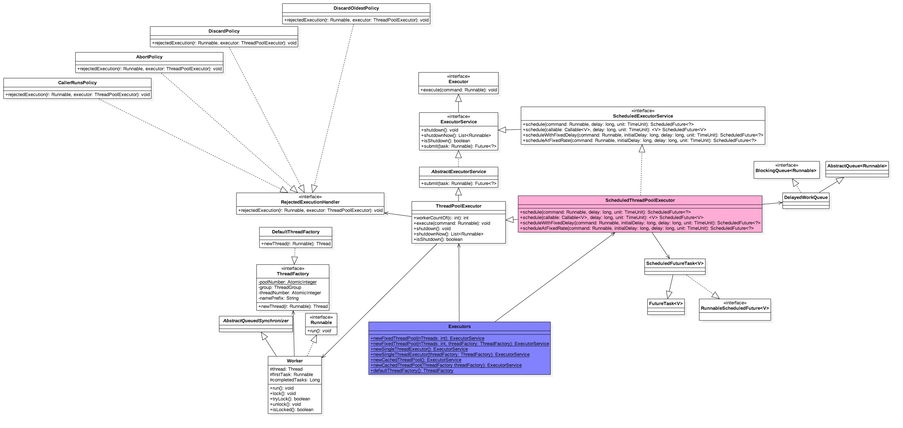

## [原文](https://www.jianshu.com/p/b47f2df9e917)

# Java中调度线程池ScheduledThreadPoolExecutor原理探究


## 一、 前言
前面讲解过Java中线程池ThreadPoolExecutor原理探究，
ThreadPoolExecutor是Executors中一部分功能，
下面来介绍另外一部分功能也就是ScheduledThreadPoolExecutor的实现，
后者是一个可以在一定延迟时候或者定时进行任务调度的线程池。


## 二、 类图结构



Executors其实是个工具类，里面提供了好多静态方法，根据用户选择返回不同的线程池实例。

ScheduledThreadPoolExecutor继承了ThreadPoolExecutor并实现ScheduledExecutorService接口，
[关于ThreadPoolExecutor的介绍可以参考](http://www.jianshu.com/p/3cc67876375f)

线程池队列是DelayedWorkQueue，它是对delayqueue的优化，
[关于delayqueue参考](http://www.jianshu.com/p/2659eb72134b)
ScheduledFutureTask是阻塞队列元素是对任务修饰。

- 构造函数：

```java
//使用改造后的delayqueue.
   public ScheduledThreadPoolExecutor(int corePoolSize) {
       super(corePoolSize, Integer.MAX_VALUE, 0, TimeUnit.NANOSECONDS,
             new DelayedWorkQueue());
   }
```
 ###三、一个例子
 
```java
// 任务间以固定时间间隔执行，延迟1s后开始执行任务，任务执行完毕后间隔2s再次执行，任务执行完毕后间隔2s再次执行，依次往复
   static void scheduleWithFixedDelay() throws InterruptedException, ExecutionException {
       ScheduledExecutorService executorService = new ScheduledThreadPoolExecutor(10);

       ScheduledFuture<?> result = executorService.scheduleWithFixedDelay(new Runnable() {
           public void run() {

               System.out.println(System.currentTimeMillis());

           }
       }, 1000, 2000, TimeUnit.MILLISECONDS);

       // 由于是定时任务，一直不会返回
       result.get();
       System.out.println("over");

   }
   // 相对开始加入任务的时间点固定频率执行：从加入任务开始算1s后开始执行任务，1+2s开始执行，1+2*2s执行，1+n*2s开始执行；
   // 但是如果执行任务时间大约2s则不会并发执行后续任务将会延迟。

   static void scheduleAtFixedRate() throws InterruptedException, ExecutionException {
       ScheduledExecutorService executorService = new ScheduledThreadPoolExecutor(10);

       ScheduledFuture<?> result = executorService.scheduleAtFixedRate(new Runnable() {
           public void run() {

               System.out.println(System.currentTimeMillis());

           }
       }, 1000, 2000, TimeUnit.MILLISECONDS);

       // 由于是定时任务，一直不会返回
       result.get();
       System.out.println("over");
   }

   // 延迟1s后开始执行，只执行一次，没有返回值
   static void scheduleRunable() throws InterruptedException, ExecutionException {
       ScheduledExecutorService executorService = new ScheduledThreadPoolExecutor(10);

       ScheduledFuture<?> result = executorService.schedule(new Runnable() {

           @Override
           public void run() {
               System.out.println("gh");
               try {
                   Thread.sleep(3000);
               } catch (InterruptedException e) {
                   // TODO Auto-generated catch block
                   e.printStackTrace();
               }

           }
       }, 1000, TimeUnit.MILLISECONDS);

       System.out.println(result.get());

   }

   // 延迟1s后开始执行，只执行一次，有返回值
   static void scheduleCaller() throws InterruptedException, ExecutionException {
       ScheduledExecutorService executorService = new ScheduledThreadPoolExecutor(10);

       ScheduledFuture<String> result = executorService.schedule(new Callable<String>() {

           @Override
           public String call() throws Exception {

               try {
                   Thread.sleep(3000);
               } catch (InterruptedException e) {
                   // TODO Auto-generated catch block
                   e.printStackTrace();
               }

               return "gh";
           }

       }, 1000, TimeUnit.MILLISECONDS);

       // 阻塞，直到任务执行完成
       System.out.print(result.get());

   }
```
   
## 三、 源码分析

### 3.1 schedule(Runnable command, long delay,TimeUnit unit)方法


```java

public ScheduledFuture<?> schedule(Runnable command,
                                  long delay,
                                  TimeUnit unit) {
   if (command == null || unit == null)
       throw new NullPointerException();

   //装饰任务，主要实现public long getDelay(TimeUnit unit)和int compareTo(Delayed other)方法
   RunnableScheduledFuture<?> t = decorateTask(command,
       new ScheduledFutureTask<Void>(command, null,
                                     triggerTime(delay, unit)));
   //添加任务到延迟队列
   delayedExecute(t);
   return t;
}

private void delayedExecute(RunnableScheduledFuture<?> task) {

   //如果线程池关闭了，则拒绝任务
   if (isShutdown())
       reject(task);
   else {
       //添加任务到队列
       super.getQueue().add(task);

       //再次检查线程池关闭
       if (isShutdown() &&
           !canRunInCurrentRunState(task.isPeriodic()) &&
           remove(task))
           task.cancel(false);
       else
           //确保至少一个线程在处理任务，即使核心线程数corePoolSize为0
           ensurePrestart();
   }
}

void ensurePrestart() {
   int wc = workerCountOf(ctl.get());
   //增加核心线程数
   if (wc < corePoolSize)
       addWorker(null, true);
   //如果初始化corePoolSize==0，则也添加一个线程。
   else if (wc == 0)
       addWorker(null, false);
   }

```   
   
上面做的首先吧runnable装饰为delay队列所需要的格式的元素，
然后把元素加入到阻塞队列，然后线程池线程会从阻塞队列获取超时的元素任务进行处理，
下面看下队列元素如何实现的。
```java

//r为被修饰任务，result=null,ns为当前时间加上delay时间后的
ScheduledFutureTask(Runnable r, V result, long ns) {
   super(r, result);
   this.time = ns;
   this.period = 0;
   this.sequenceNumber = sequencer.getAndIncrement();
}

//通过适配器把runnable转换为callable
   public FutureTask(Runnable runnable, V result) {
       this.callable = Executors.callable(runnable, result);
       this.state = NEW;       // ensure visibility of callable
   }

long triggerTime(long delay, TimeUnit unit) {
return triggerTime(unit.toNanos((delay < 0) ? 0 : delay));
}
```
关于FutureTask可以参考<http://www.jianshu.com/p/49541d720d5b>

修饰后把当前任务修饰为了delay队列所需元素，下面看下元素的两个重要方法：

- 过期时间计算
```java
//元素过期算法，装饰后时间-当前时间，就是即将过期剩余时间
public long getDelay(TimeUnit unit) {
   return unit.convert(time - now(), TimeUnit.NANOSECONDS);
}

```

- 元素比较
```java
public int compareTo(Delayed other) {
   if (other == this) // compare zero ONLY if same object
       return 0;
   if (other instanceof ScheduledFutureTask) {
       ScheduledFutureTask<?> x = (ScheduledFutureTask<?>)other;
       long diff = time - x.time;
       if (diff < 0)
           return -1;
       else if (diff > 0)
           return 1;
       else if (sequenceNumber < x.sequenceNumber)
           return -1;
       else
           return 1;
   }
   long d = (getDelay(TimeUnit.NANOSECONDS) -
             other.getDelay(TimeUnit.NANOSECONDS));
   return (d == 0) ? 0 : ((d < 0) ? -1 : 1);
}

```

schedule(Callable<V> callable,long delay,TimeUnit unit)和
schedule(Runnable command, long delay,TimeUnit unit)类似。

compareTo作用是在加入元素到dealy队列时候进行比较，需要调整堆让最快要过期的元素放到队首。
所以无论什么时候向队列里面添加元素，队首的都是最即将过期的元素。

### 3.2 scheduleWithFixedDelay(Runnable command,long initialDelay,long delay,TimeUnit unit)

- 定时调度：相邻任务间时间固定

```java
   public ScheduledFuture<?> scheduleWithFixedDelay(Runnable command,
                                                    long initialDelay,
                                                    long delay,
                                                    TimeUnit unit) {
       if (command == null || unit == null)
           throw new NullPointerException();
       if (delay <= 0)
           throw new IllegalArgumentException();

       //修饰包装,注意这里是period=-delay<0
       ScheduledFutureTask<Void> sft =
           new ScheduledFutureTask<Void>(command,
                                         null,
                                         triggerTime(initialDelay, unit),
                                         unit.toNanos(-delay));
       RunnableScheduledFuture<Void> t = decorateTask(command, sft);
       sft.outerTask = t;
       //添加任务到队列
       delayedExecute(t);
       return t;
   }
      //period为 delay时间
       ScheduledFutureTask(Runnable r, V result, long ns, long period) {
           super(r, result);
           this.time = ns;
           this.period = period;
           this.sequenceNumber = sequencer.getAndIncrement();
       }

```


我们知道任务添加到队列后，工作线程会从队列获取并移除到期的元素，
然后执行run方法，所以下面看看ScheduledFutureTask的run方法如何实现定时调度的

```java
public void run() {

   //是否只执行一次
   boolean periodic = isPeriodic();

   //取消任务
   if (!canRunInCurrentRunState(periodic))
       cancel(false);
   //只执行一次，调用schdule时候
   else if (!periodic)
       ScheduledFutureTask.super.run();

   //定时执行
   else if (ScheduledFutureTask.super.runAndReset()) {
       //设置time=time+period
       setNextRunTime();

       //重新加入该任务到delay队列
       reExecutePeriodic(outerTask);
   }
}   

       private void setNextRunTime() {
           long p = period;
           if (p > 0)
               time += p;
           else//由于period=-delay所以执行这里，设置time=now()+delay
               time = triggerTime(-p);
       }
```
       
总结：定时调度是先从队列获取任务然后执行，然后在重新设置任务时间，在把任务放入队列实现的。
如果任务执行时间大于delay时间则等任务执行完毕后的delay时间后在次调用任务，
不会同一个任务并发执行。

### 3.3 scheduleAtFixedRate(Runnable command,long initialDelay,long period,TimeUnit unit)

定时调度：相对起始时间点固定频率调用

```java
public ScheduledFuture<?> scheduleAtFixedRate(Runnable command,
                                             long initialDelay,
                                             long period,
                                             TimeUnit unit) {
   if (command == null || unit == null)
       throw new NullPointerException();
   if (period <= 0)
       throw new IllegalArgumentException();
   //装饰任务类，注意period=period>0，不是负的
   ScheduledFutureTask<Void> sft =
       new ScheduledFutureTask<Void>(command,
                                     null,
                                     triggerTime(initialDelay, unit),
                                     unit.toNanos(period));
   RunnableScheduledFuture<Void> t = decorateTask(command, sft);
   sft.outerTask = t;
   //添加任务到队列
   delayedExecute(t);
   return t;
}


       private void setNextRunTime() {
           long p = period;
          //period=delay;
           if (p > 0)
               time += p;//由于period>0所以执行这里，设置time=time+delay
           else
               time = triggerTime(-p);
       }

```
       
总结：相对于上面delay，rate方式执行规则为时间为initdelday + n*period;时候启动任务，
但是如果当前任务还没有执行完，要等到当前任务执行完毕后在执行一个任务。

## 四、 总结
调度线程池主要用于定时器或者延迟一定时间在执行任务时候使用。
内部使用优化的DelayQueue来实现，由于使用队列来实现定时器，
有出入队调整堆等操作，所以定时并不是非常非常精确。

 