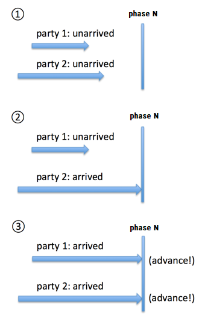
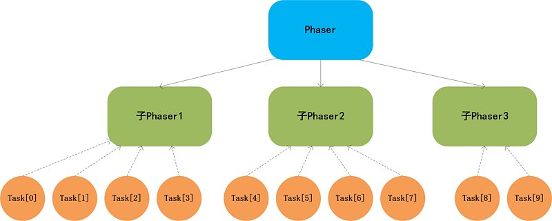
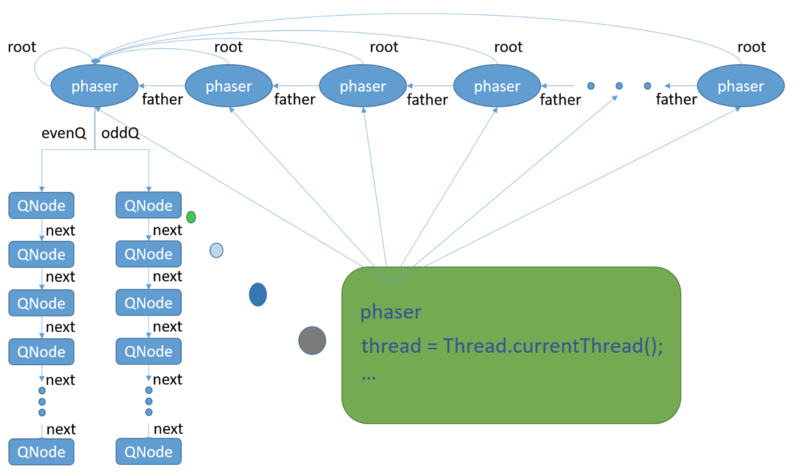
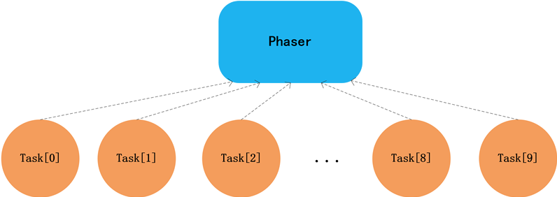
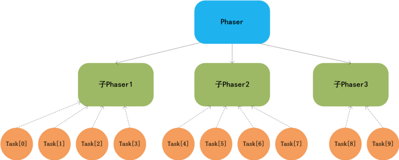
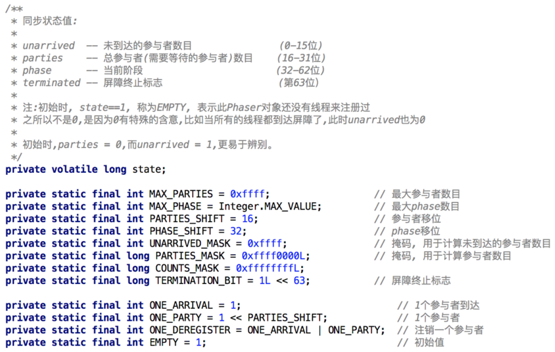

## [原文](https://segmentfault.com/a/1190000015979879)

#  Phaser 原理

## 一、Phaser简介
Phaser是JDK1.7开始引入的一个同步工具类，适用于一些需要分阶段的任务的处理。
它的功能与 CyclicBarrier和CountDownLatch有些类似，类似于一个多阶段的栅栏，并且功能更强大，
我们来比较下这三者的功能：

同步器	| 作用
|---|---
CountDownLatch	| 倒数计数器，初始时设定计数器值，线程可以在计数器上等待，当计数器值归0后，所有等待的线程继续执行
CyclicBarrier	| 循环栅栏，初始时设定参与线程数，当线程到达栅栏后，会等待其它线程的到达，当到达栅栏的总数满足指定数后，所有等待的线程继续执行
Phaser	| 多阶段栅栏，可以在初始时设定参与线程数，也可以中途注册/注销参与者，当到达的参与者数量满足栅栏设定的数量后，会进行阶段升级（advance）

Phaser中有一些比较重要的概念，理解了这些概念才能理解Phaser的功能。

### phase(阶段)
我们知道，在CyclicBarrier中，只有一个栅栏，线程在到达栅栏后会等待其它线程的到达。

Phaser也有栅栏，在Phaser中，栅栏的名称叫做phase(阶段)，
在任意时间点，Phaser只处于某一个phase(阶段)，初始阶段为0，最大达到Integerr.MAX_VALUE，
然后再次归零。当所有parties参与者都到达后，phase值会递增。

如果看过之前关于CyclicBarrier的文章，就会知道，
Phaser中的phase(阶段)这个概念其实和CyclicBarrier中的Generation很相似，
只不过Generation没有计数。

### parties(参与者)
parties(参与者)其实就是CyclicBarrier中的参与线程的概念。

CyclicBarrier中的参与者在初始构造指定后就不能变更，
而Phaser既可以在初始构造时指定参与者的数量，
也可以中途通过register、bulkRegister、arriveAndDeregister等方法注册/注销参与者。

### arrive(到达) / advance(进阶)
Phaser注册完parties（参与者）之后，参与者的初始状态是unarrived的，
当参与者到达（arrive）当前阶段（phase）后，状态就会变成arrived。
当阶段的到达参与者数满足条件后（注册的数量等于到达的数量），
阶段就会发生进阶（advance）——也就是phase值+1。



### Termination（终止）
代表当前Phaser对象达到终止状态，有点类似于CyclicBarrier中的栅栏被破坏的概念。

### Tiering（分层）
Phaser支持分层（Tiering） —— 一种树形结构，通过构造函数可以指定当前待构造的Phaser对象的父结点。
之所以引入Tiering，是因为当一个Phaser有大量参与者（parties）的时候，
内部的同步操作会使性能急剧下降，而分层可以降低竞争，从而减小因同步导致的额外开销。

在一个分层Phasers的树结构中，注册和撤销子Phaser或父Phaser是自动被管理的。
当一个Phaser的参与者（parties）数量变成0时，如果有该Phaser有父结点，
就会将它从父结点中溢移除。

关于Phaser的分层，后续我们在讲Phaser原理时会进一步讨论。

## 二、Phaser示例
为了更好的理解Phaser的功能，我们来看几个示例：

### 示例一
通过Phaser控制多个线程的执行时机：有时候我们希望所有线程到达指定点后再同时开始执行，
我们可以利用CyclicBarrier或CountDownLatch来实现，这里给出使用Phaser的版本。
```java

public class PhaserTest1 {
    public static void main(String[] args) {
        Phaser phaser = new Phaser();
        for (int i = 0; i < 10; i++) {
            phaser.register();                  // 注册各个参与者线程
       new Thread(new Task(phaser), "Thread-" + i).start();
        }
    }
}

class Task implements Runnable {
    private final Phaser phaser;

    Task(Phaser phaser) {
        this.phaser = phaser;
    }

    @Override
    public void run() {
        int i = phaser.arriveAndAwaitAdvance();     // 等待其它参与者线程到达
     // do something
        System.out.println(Thread.currentThread().getName() + ": 执行完任务，当前phase =" + i + "");
    }
}

```
- 输出：

```
Thread-8: 执行完任务，当前phase =1
Thread-4: 执行完任务，当前phase =1
Thread-3: 执行完任务，当前phase =1
Thread-0: 执行完任务，当前phase =1
Thread-5: 执行完任务，当前phase =1
Thread-6: 执行完任务，当前phase =1
Thread-7: 执行完任务，当前phase =1
Thread-9: 执行完任务，当前phase =1
Thread-1: 执行完任务，当前phase =1
Thread-2: 执行完任务，当前phase =1

```
以上示例中，创建了10个线程，并通过register方法注册Phaser的参与者数量为10。
当某个线程调用arriveAndAwaitAdvance方法后，arrive数量会加1，
如果数量没有满足总数（参与者数量10），当前线程就是一直等待，当最后一个线程到达后，
所有线程都会继续往下执行。

注意：arriveAndAwaitAdvance方法是不响应中断的，也就是说即使当前线程被中断，
arriveAndAwaitAdvance方法也不会返回或抛出异常，而是继续等待。
如果希望能够响应中断，可以参考awaitAdvanceInterruptibly方法。

### 示例二
通过Phaser实现开关。在以前讲CountDownLatch时，
我们给出过以CountDownLatch实现开关的示例，也就是说，我们希望一些外部条件得到满足后，
然后打开开关，线程才能继续执行，我们看下如何用Phaser来实现此功能。

```java
public class PhaserTest2 {

    public static void main(String[] args) throws IOException {
        Phaser phaser = new Phaser(1);       // 注册主线程,当外部条件满足时,由主线程打开开关
        for (int i = 0; i < 10; i++) {
            phaser.register();                      // 注册各个参与者线程
            new Thread(new Task2(phaser), "Thread-" + i).start();
        }

        // 外部条件:等待用户输入命令
        System.out.println("Press ENTER to continue");
        BufferedReader reader = new BufferedReader(new InputStreamReader(System.in));
        reader.readLine();

        // 打开开关
        phaser.arriveAndDeregister();
        System.out.println("主线程打开了开关");
    }
}

class Task2 implements Runnable {
    private final Phaser phaser;

    Task2(Phaser phaser) {
        this.phaser = phaser;
    }

    @Override
    public void run() {
        int i = phaser.arriveAndAwaitAdvance();     // 等待其它参与者线程到达

        // do something
        System.out.println(Thread.currentThread().getName() + ": 执行完任务，当前phase =" + i + "");
    }
}

```
- 输出：

主线程打开了开关

```
Thread-7: 执行完任务，当前phase =1
Thread-4: 执行完任务，当前phase =1
Thread-3: 执行完任务，当前phase =1
Thread-1: 执行完任务，当前phase =1
Thread-0: 执行完任务，当前phase =1
Thread-9: 执行完任务，当前phase =1
Thread-8: 执行完任务，当前phase =1
Thread-2: 执行完任务，当前phase =1
Thread-5: 执行完任务，当前phase =1
Thread-6: 执行完任务，当前phase =1

```
以上示例中，只有当用户按下回车之后，任务才真正开始执行。
这里主线程Main相当于一个协调者，用来控制开关打开的时机，
arriveAndDeregister方法不会阻塞，该方法会将到达数加1，同时减少一个参与者数量，
最终返回线程到达时的phase值。

- 示例三
通过Phaser控制任务的执行轮数

```java
public class PhaserTest3 {
    public static void main(String[] args) throws IOException {

        int repeats = 3;    // 指定任务最多执行的次数

        Phaser phaser = new Phaser() {
            @Override
            protected boolean onAdvance(int phase, int registeredParties) {
                System.out.println("---------------PHASE[" + phase + "],Parties[" + registeredParties + "] ---------------");
                return phase + 1 >= repeats  || registeredParties == 0;
            }
        };

        for (int i = 0; i < 10; i++) {
            phaser.register();                      // 注册各个参与者线程
       new Thread(new Task3(phaser), "Thread-" + i).start();
        }
    }
}

class Task3 implements Runnable {
    private final Phaser phaser;

    Task3(Phaser phaser) {
        this.phaser = phaser;
    }

    @Override
    public void run() {
        while (!phaser.isTerminated()) {   //只要Phaser没有终止, 各个线程的任务就会一直执行
            int i = phaser.arriveAndAwaitAdvance();     // 等待其它参与者线程到达
            // do something
            System.out.println(Thread.currentThread().getName() + ": 执行完任务");
        }
    }
}

```
输出：

```
---------------PHASE[0],Parties[5] ---------------
Thread-4: 执行完任务
Thread-1: 执行完任务
Thread-2: 执行完任务
Thread-3: 执行完任务
Thread-0: 执行完任务
---------------PHASE[1],Parties[5] ---------------
Thread-0: 执行完任务
Thread-3: 执行完任务
Thread-1: 执行完任务
Thread-4: 执行完任务
Thread-2: 执行完任务
---------------PHASE[2],Parties[5] ---------------
Thread-2: 执行完任务
Thread-4: 执行完任务
Thread-1: 执行完任务
Thread-0: 执行完任务
Thread-3: 执行完任务

```
以上示例中，我们在创建Phaser对象时，覆写了onAdvance方法，
这个方法类似于CyclicBarrier中的barrierAction任务。
也就是说，当最后一个参与者到达时，会触发onAdvance方法，入参phase表示到达时的phase值，
registeredParties表示到达时的参与者数量，返回true表示需要终止Phaser。

我们通过phase + 1 >= repeats ，来控制阶段（phase）数的上限为2（从0开始计），
最终控制了每个线程的执行任务次数为repeats次。

- 示例四
Phaser支持分层功能，我们先来考虑下如何用利用Phaser的分层来实现高并发时的优化，
在示例三中，我们其实创建了10个任务，然后10个线程共用一个Phaser对象，如下图：


如果任务数继续增大，那么同步产生的开销会非常大，利用Phaser分层的功能，
我们可以限定每个Phaser对象的最大使用线程（任务数），如下图：




可以看到，上述Phasers其实构成了一颗多叉树，如果任务数继续增多，
还可以将Phaser的叶子结点继续分裂，然后将分裂出的子结点供工作线程使用。

```java

public class PhaserTest4 {
    private static final int TASKS_PER_PHASER = 4;      // 每个Phaser对象对应的工作线程（任务）数

    public static void main(String[] args) throws IOException {

        int repeats = 3;    // 指定任务最多执行的次数
        Phaser phaser = new Phaser() {
            @Override
            protected boolean onAdvance(int phase, int registeredParties) {
                System.out.println("---------------PHASE[" + phase + "],Parties[" + registeredParties + "] ---------------");
                return phase + 1 >= repeats || registeredParties == 0;
            }
        };

        Tasker[] taskers = new Tasker[10];
        build(taskers, 0, taskers.length, phaser);       // 根据任务数,为每个任务分配Phaser对象

        for (int i = 0; i < taskers.length; i++) {          // 执行任务
            Thread thread = new Thread(taskers[i]);
            thread.start();
        }
    }

    private static void build(Tasker[] taskers, int lo, int hi, Phaser phaser) {
        if (hi - lo > TASKS_PER_PHASER) {
            for (int i = lo; i < hi; i += TASKS_PER_PHASER) {
                int j = Math.min(i + TASKS_PER_PHASER, hi);
                build(taskers, i, j, new Phaser(phaser));
            }
        } else {
            for (int i = lo; i < hi; ++i)
                taskers[i] = new Tasker(i, phaser);
        }

    }
}

class Task4 implements Runnable {
    private final Phaser phaser;

    Task4(Phaser phaser) {
        this.phaser = phaser;
        this.phaser.register();
    }

    @Override
    public void run() {
        while (!phaser.isTerminated()) {   //只要Phaser没有终止, 各个线程的任务就会一直执行
            int i = phaser.arriveAndAwaitAdvance();     // 等待其它参与者线程到达
            // do something
            System.out.println(Thread.currentThread().getName() + ": 执行完任务");
        }
    }
}

```

- 输出：

```
---------------PHASE[0],Parties[3] ---------------
Thread-9: 执行完任务
Thread-6: 执行完任务
Thread-5: 执行完任务
Thread-4: 执行完任务
Thread-1: 执行完任务
Thread-0: 执行完任务
Thread-7: 执行完任务
Thread-8: 执行完任务
Thread-2: 执行完任务
Thread-3: 执行完任务
---------------PHASE[1],Parties[3] ---------------
Thread-3: 执行完任务
Thread-7: 执行完任务
Thread-0: 执行完任务
Thread-1: 执行完任务
Thread-5: 执行完任务
Thread-8: 执行完任务
Thread-2: 执行完任务
Thread-9: 执行完任务
Thread-6: 执行完任务
Thread-4: 执行完任务
---------------PHASE[2],Parties[3] ---------------
Thread-4: 执行完任务
Thread-2: 执行完任务
Thread-8: 执行完任务
Thread-0: 执行完任务
Thread-3: 执行完任务
Thread-9: 执行完任务
Thread-6: 执行完任务
Thread-7: 执行完任务
Thread-1: 执行完任务
Thread-5: 执行完任务

```


## 三、Phaser原理
Phaser是本系列至今为止，内部结构最为复杂的同步器之一。
在开始深入Phaser原理之前，我们有必要先来讲讲Phaser的内部组织结构和它的设计思想。

### Phaser的内部结构
之前我们说过，Phaser支持树形结构，
在示例四中，也给出了一个通过分层提高并发性和程序执行效率的例子。
一个复杂分层结构的Phaser树的内部结构如下图所示：




上面图中的几点关键点：

1. 树的根结点root链接着两个“无锁栈”——Treiber Stack，用于保存等待线程（比如当线程等待Phaser进入下一阶段时，
会根据当前阶段的奇偶性，把自己挂到某个栈中），所有Phaser对象都共享这两个栈。

2. 当首次将某个Phaser结点链接到树中时，会同时向该结点的父结点注册一个参与者。

> 为什么需要向父结点注册参与者？

首先我们要明白对于Phaser来说，什么时候会发生跃迁（advance）进入下一阶段？

废话，当然是等它所有参与者都到达的时候。那么它所等待的参与者都包含那几类呢？

①对于一个孤立的Phaser结点（也可以看成是只有一个根结点的树）
其等待的参与者，就是显式注册的参与者，这也是最常见的情况。
比如下图，如果有10个Task共用这个Phaser，那等待的参与者数就是10，
当10个线程都到达后，Phaser就会跃迁至下一阶段。




②对于一个非孤立的Phaser叶子结点，比如下图中标绿的叶子结点
这种情况和①一样，子Phaser1和子Phaser2等待的参与者数是4，子Phaser3等待的参与者数是2。





③对于一个非孤立非叶子的Phaser结点，比如上图中标蓝色的结点
这是最特殊的一种情况，这也是Phaser同步器关于分层的主要设计思路。
这种情况，结点所等待的参与者数目包含两部分：

1. 直接显式注册的参与者（通过构造器或register方法）。——等于0

2. 子结点的数目。——等于3

也就是说在上图中，当左一的子Phaser1的4个参与者都到达后，它会通知父结点Phaser，
自己的状态已经OK了，这时Phaser会认为子Phaser1已经准备就绪，会将自己的到达者数量加1，
同理，当子Phaser2和子Phaser3的所有参与者分别到达后，它们也会依次通知Phaser，
只有当Phaser（根结点）的到达者数量为3时，才会释放“无锁栈”中等待着的线程，
并将阶段数phase增加1。

> 这是一种层层递归的设计，只要当根结点的所有参与者都到达后（也就是到达参数者数等于其子结点数），所有等待线程才会放行，栅栏才会进入下一阶段。
了解了上面这些，我们再来看Phaser的源码。

### 同步状态定义
Phaser使用一个long类型来保存同步状态值State，并按位划分不同区域的含义，
通过掩码和位运算进行赋值和操作：


### 栈结点定义
“无锁栈”——Treiber Stack，保存在Phaser树的根结点中，
其余所有Phaser子结点共享这两个栈：

```java
    /**
     * Heads of Treiber stacks for waiting threads. To eliminate
     * contention when releasing some threads while adding others, we
     * use two of them, alternating across even and odd phases.
     * Subphasers share queues with root to speed up releases.
     */
    private final AtomicReference<QNode> evenQ;
    private final AtomicReference<QNode> oddQ;
```


结点的定义非常简单，内部保存了线程信息和Phsaer对象信息：

"无锁栈" 的结点定义
```java

    /**
     * Wait nodes for Treiber stack representing wait queue
     */
    static final class QNode implements ForkJoinPool.ManagedBlocker {
        final Phaser phaser;
        final int phase;
        final boolean interruptible;
        final boolean timed;
        boolean wasInterrupted;
        long nanos;
        final long deadline;
        volatile Thread thread; // nulled to cancel wait
        QNode next;

        QNode(Phaser phaser, int phase, boolean interruptible,
              boolean timed, long nanos) {
            this.phaser = phaser;
            this.phase = phase;
            this.interruptible = interruptible;
            this.nanos = nanos;
            this.timed = timed;
            this.deadline = timed ? System.nanoTime() + nanos : 0L;
            thread = Thread.currentThread();
        }
        // 其他省略
    }

```


注意：ForkJoinPool.ManagedBlocker是当栈包含ForkJoinWorkerThread类型的QNode阻塞的时候，
ForkJoinPool内部会增加一个工作线程来保证并行度，后续讲ForkJoin框架时我们会进行分析。


### Phaser的构造器

Phaser一共有4个构造器，可以看到，
最终其实都是调用了Phaser(Phaser parent, int parties)这个构造器。

```java
 /**
     * The parent of this phaser, or null if none
     */
    private final Phaser parent;

    /**
     * The root of phaser tree. Equals this if not in a tree.
     */
    private final Phaser root;
    
 /**
     * Creates a new phaser with no initially registered parties, no
     * parent, and initial phase number 0. Any thread using this
     * phaser will need to first register for it.
     */
    public Phaser() {
        this(null, 0);
    }

    /**
     * Creates a new phaser with the given number of registered
     * unarrived parties, no parent, and initial phase number 0.
     *
     * @param parties the number of parties required to advance to the
     * next phase
     * @throws IllegalArgumentException if parties less than zero
     * or greater than the maximum number of parties supported
     */
    public Phaser(int parties) {
        this(null, parties);
    }

    /**
     * Equivalent to {@link #Phaser(Phaser, int) Phaser(parent, 0)}.
     *
     * @param parent the parent phaser
     */
    public Phaser(Phaser parent) {
        this(parent, 0);
    }

    /**
     * Creates a new phaser with the given parent and number of
     * registered unarrived parties.  When the given parent is non-null
     * and the given number of parties is greater than zero, this
     * child phaser is registered with its parent.
     *
     * @param parent the parent phaser
     * @param parties the number of parties required to advance to the
     * next phase
     * @throws IllegalArgumentException if parties less than zero
     * or greater than the maximum number of parties supported
     */
    public Phaser(Phaser parent, int parties) {
        if (parties >>> PARTIES_SHIFT != 0)
            throw new IllegalArgumentException("Illegal number of parties");
        int phase = 0;
        this.parent = parent;
        if (parent != null) {
            final Phaser root = parent.root;
            this.root = root;
            this.evenQ = root.evenQ;
            this.oddQ = root.oddQ;
            if (parties != 0)
                phase = parent.doRegister(1);
        }
        else {
            this.root = this;
            this.evenQ = new AtomicReference<QNode>();
            this.oddQ = new AtomicReference<QNode>();
        }
        this.state = (parties == 0) ? (long)EMPTY :
            ((long)phase << PHASE_SHIFT) |
            ((long)parties << PARTIES_SHIFT) |
            ((long)parties);
    }

```

Phaser(Phaser parent, int parties)的内部实现如下，
关键就是给当前的Phaser对象指定父结点时，如果当前Phaser的参与者不为0，
需要向父Phaser注册一个参与者（代表当前结点本身）：




### 注册参与者
Phaser提供了两个注册参与者的方法：

- register：注册单个参与者

- bulkRegister：批量注册参与者


```java
     public int register() {
            return doRegister(1);
        }

   
    public int bulkRegister(int parties) {
        if (parties < 0)
            throw new IllegalArgumentException();
        if (parties == 0)
            return getPhase();
        return doRegister(parties);
    }
```


这两个方法都很简单，内部调用了doRegister方法：

```java
  /**
     * Implementation of register, bulkRegister
     *
     * @param registrations number to add to both parties and
     * unarrived fields. Must be greater than zero.
     */
    private int doRegister(int registrations) {
        // adjustment to state
        long adjust = ((long)registrations << PARTIES_SHIFT) | registrations;
        final Phaser parent = this.parent;
        int phase;
        for (;;) {
            long s = (parent == null) ? state : reconcileState();
            int counts = (int)s;
            int parties = counts >>> PARTIES_SHIFT;
            int unarrived = counts & UNARRIVED_MASK;
            if (registrations > MAX_PARTIES - parties)
                throw new IllegalStateException(badRegister(s));
            phase = (int)(s >>> PHASE_SHIFT);
            if (phase < 0)
                break;
            if (counts != EMPTY) {                  // not 1st registration
                if (parent == null || reconcileState() == s) {
                    if (unarrived == 0)             // wait out advance
                        root.internalAwaitAdvance(phase, null);
                    else if (UNSAFE.compareAndSwapLong(this, stateOffset,
                                                       s, s + adjust))
                        break;
                }
            }
            else if (parent == null) {              // 1st root registration
                long next = ((long)phase << PHASE_SHIFT) | adjust;
                if (UNSAFE.compareAndSwapLong(this, stateOffset, s, next))
                    break;
            }
            else {
                synchronized (this) {               // 1st sub registration
                    if (state == s) {               // recheck under lock
                        phase = parent.doRegister(1);
                        if (phase < 0)
                            break;
                        // finish registration whenever parent registration
                        // succeeded, even when racing with termination,
                        // since these are part of the same "transaction".
                        while (!UNSAFE.compareAndSwapLong
                               (this, stateOffset, s,
                                ((long)phase << PHASE_SHIFT) | adjust)) {
                            s = state;
                            phase = (int)(root.state >>> PHASE_SHIFT);
                            // assert (int)s == EMPTY;
                        }
                        break;
                    }
                }
            }
        }
        return phase;
    }
```


doRegister方法用来给当前Phaser对象注册参与者，主要有三个分支：
①当前Phaser已经注册过参与者
如果参与者已经全部到达栅栏，则当前线程需要阻塞等待（因为此时phase正在变化，增加1到下一个phase），否则直接更新State。

②当前Phaser未注册过参与者（第一次注册），且没有父结点
这种情况最简单，直接更新当前Phaser的State值。

③当前Phaser未注册过参与者（第一次注册），且有父结点
说明当前Phaser是新加入的叶子结点，需要向父结点注册自身，同时更新自身的State值。

注意: reconcileState方法比较特殊，因为当出现树形结构时，根结点首先进行phase的更新，所以需要显式同步，使当前结点和根结点保持一致。

```java
 private long reconcileState() {
        final Phaser root = this.root;
        long s = state;
        if (root != this) {
            int phase, p;
            // CAS to root phase with current parties, tripping unarrived
            while ((phase = (int)(root.state >>> PHASE_SHIFT)) !=
                   (int)(s >>> PHASE_SHIFT) &&
                   !UNSAFE.compareAndSwapLong
                   (this, stateOffset, s,
                    s = (((long)phase << PHASE_SHIFT) |
                         ((phase < 0) ? (s & COUNTS_MASK) :
                          (((p = (int)s >>> PARTIES_SHIFT) == 0) ? EMPTY :
                           ((s & PARTIES_MASK) | p))))))
                s = state;
        }
        return s;
    }
```
另外，阻塞等待调用的是internalAwaitAdvance方法，其实就是根据当前阶段phase，
将线程包装成结点加入到root结点所指向的某个“无锁栈”中：

```java
/**
 * internalAwaitAdvance的主要逻辑就是：当前参与者线程等待Phaser进入下一个阶段(就是phase值变化).
 * @return 返回新的阶段
 */
private int internalAwaitAdvance(int phase, QNode node) {
    // assert root == this;
    releaseWaiters(phase - 1);       // 清空不用的Treiber Stack（奇偶Stack交替使用）
    boolean queued = false;                 // 入队标识
    int lastUnarrived = 0;
    int spins = SPINS_PER_ARRIVAL;
    long s;
    int p;
    while ((p = (int) ((s = state) >>> PHASE_SHIFT)) == phase) {
        if (node == null) {           // spinning in noninterruptible mode
            int unarrived = (int) s & UNARRIVED_MASK;
            if (unarrived != lastUnarrived &&
                    (lastUnarrived = unarrived) < NCPU)
                spins += SPINS_PER_ARRIVAL;
            boolean interrupted = Thread.interrupted();
            if (interrupted || --spins < 0) { // need node to record intr
                node = new QNode(this, phase, false, false, 0L);
                node.wasInterrupted = interrupted;
            }
        } else if (node.isReleasable()) // done or aborted
            break;
        else if (!queued) {           // 将结点压入栈顶
            AtomicReference<QNode> head = (phase & 1) == 0 ? evenQ : oddQ;
            QNode q = node.next = head.get();
            if ((q == null || q.phase == phase) &&
                    (int) (state >>> PHASE_SHIFT) == phase) // avoid stale enq
                queued = head.compareAndSet(q, node);
        } else {
            try {
                // 阻塞等待
                ForkJoinPool.managedBlock(node);
            } catch (InterruptedException ie) {
                node.wasInterrupted = true;
            }
        }
    }
 
    if (node != null) {
        if (node.thread != null)
            node.thread = null;       // avoid need for unpark()
        if (node.wasInterrupted && !node.interruptible)
            Thread.currentThread().interrupt();
        if (p == phase && (p = (int) (state >>> PHASE_SHIFT)) == phase)
            return abortWait(phase); // possibly clean up on abort
    }
    releaseWaiters(phase);
    return p;
}
```


### 参与者到达并等待

```java
 public int arriveAndAwaitAdvance() {
        // Specialization of doArrive+awaitAdvance eliminating some reads/paths
        final Phaser root = this.root;
        for (;;) {
            long s = (root == this) ? state : reconcileState();
            int phase = (int)(s >>> PHASE_SHIFT);
            if (phase < 0)
                return phase;
            int counts = (int)s;
            int unarrived = (counts == EMPTY) ? 0 : (counts & UNARRIVED_MASK);
            if (unarrived <= 0)
                throw new IllegalStateException(badArrive(s));
            if (UNSAFE.compareAndSwapLong(this, stateOffset, s,
                                          s -= ONE_ARRIVAL)) {
                if (unarrived > 1)
                    return root.internalAwaitAdvance(phase, null);
                if (root != this)
                    return parent.arriveAndAwaitAdvance();
                long n = s & PARTIES_MASK;  // base of next state
                int nextUnarrived = (int)n >>> PARTIES_SHIFT;
                if (onAdvance(phase, nextUnarrived))
                    n |= TERMINATION_BIT;
                else if (nextUnarrived == 0)
                    n |= EMPTY;
                else
                    n |= nextUnarrived;
                int nextPhase = (phase + 1) & MAX_PHASE;
                n |= (long)nextPhase << PHASE_SHIFT;
                if (!UNSAFE.compareAndSwapLong(this, stateOffset, s, n))
                    return (int)(state >>> PHASE_SHIFT); // terminated
                releaseWaiters(phase);
                return nextPhase;
            }
        }
    }
```

arriveAndAwaitAdvance的主要逻辑如下：
首先将同步状态值State中的未到达参与者数量减1，然后判断未到达参与者数量是否为0?

如果不为0，则阻塞当前线程，以等待其他参与者到来；

如果为0，说明当前线程是最后一个参与者，如果有父结点则对父结点递归调用该方法。
（因为只有根结点的未到达参与者数目为0时），才会进阶phase。

 