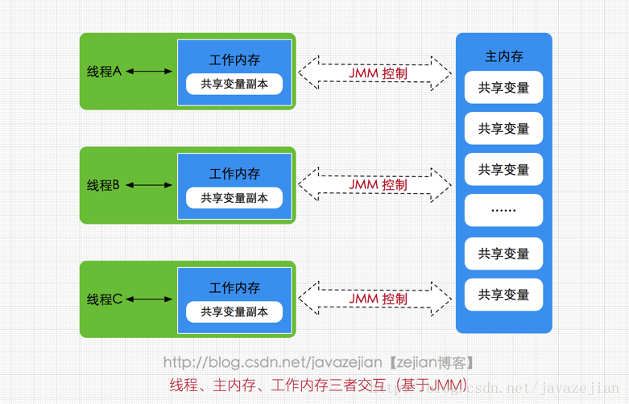
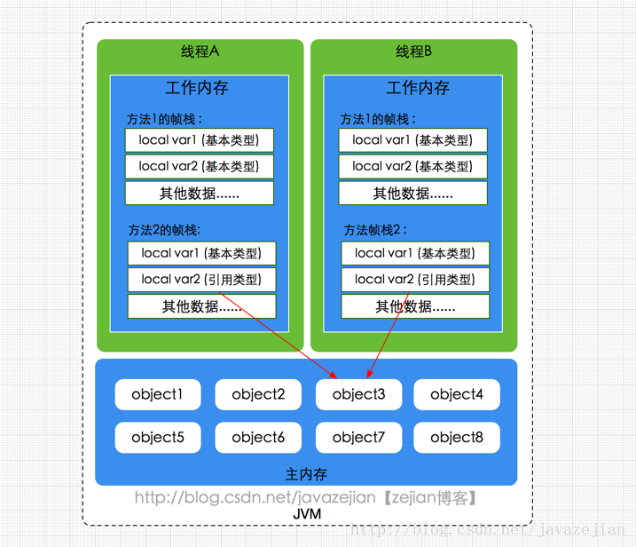
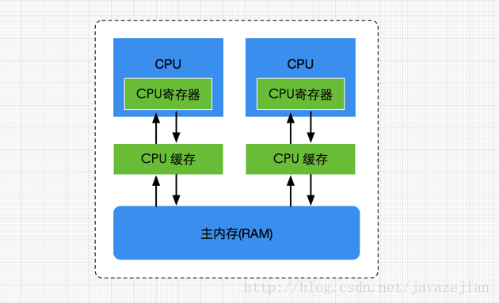
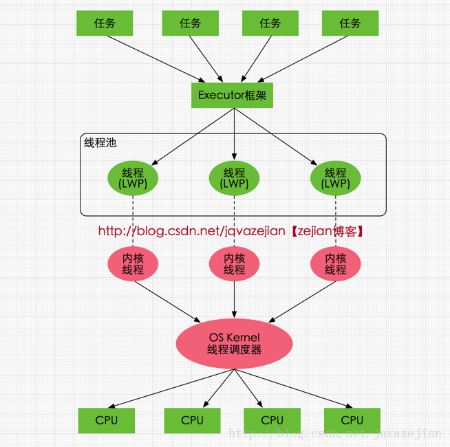
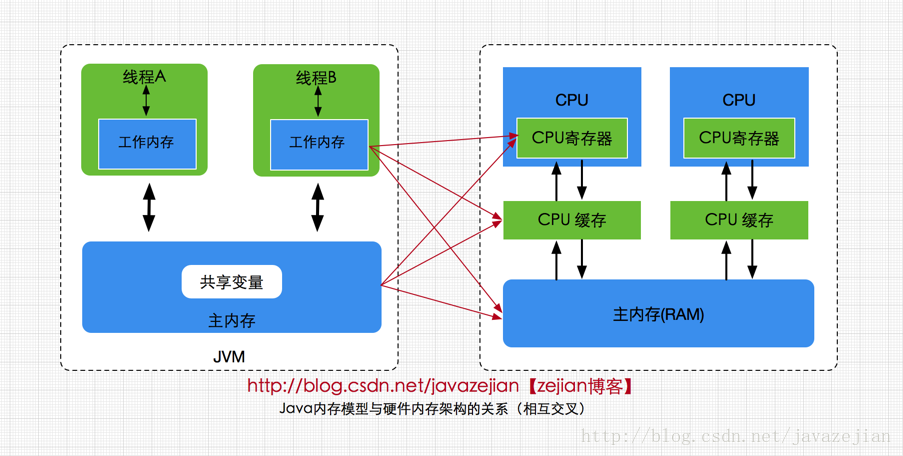
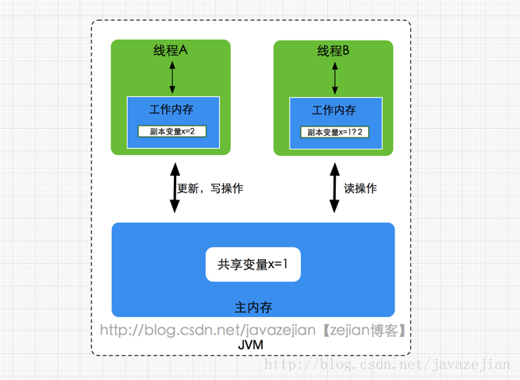
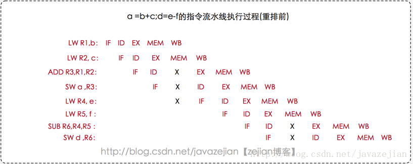
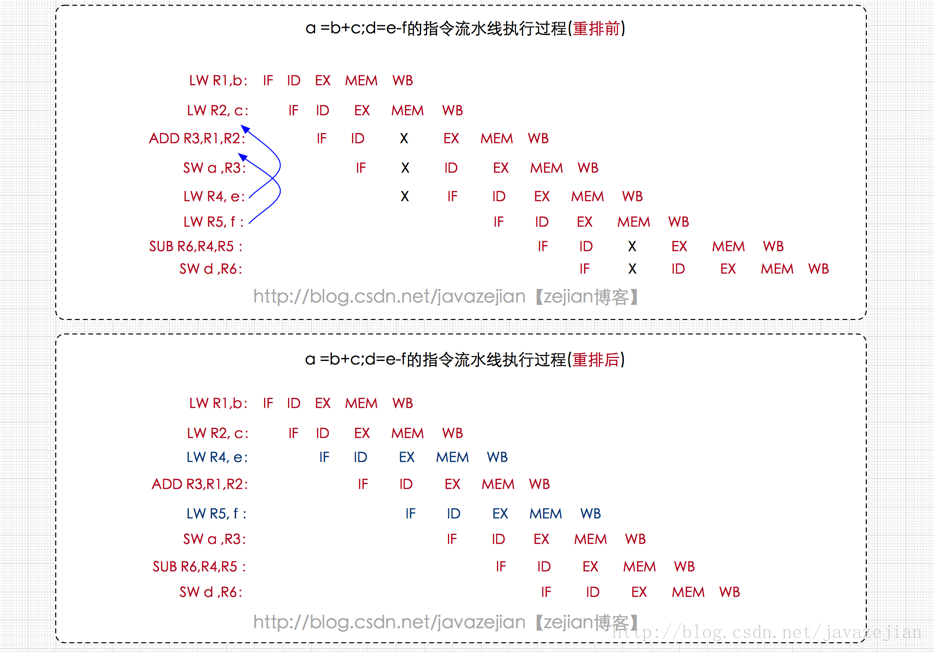
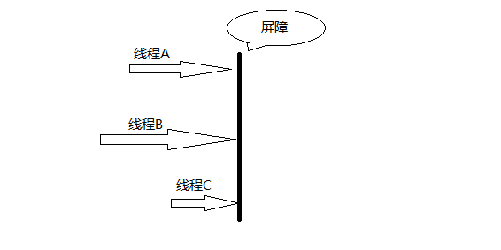
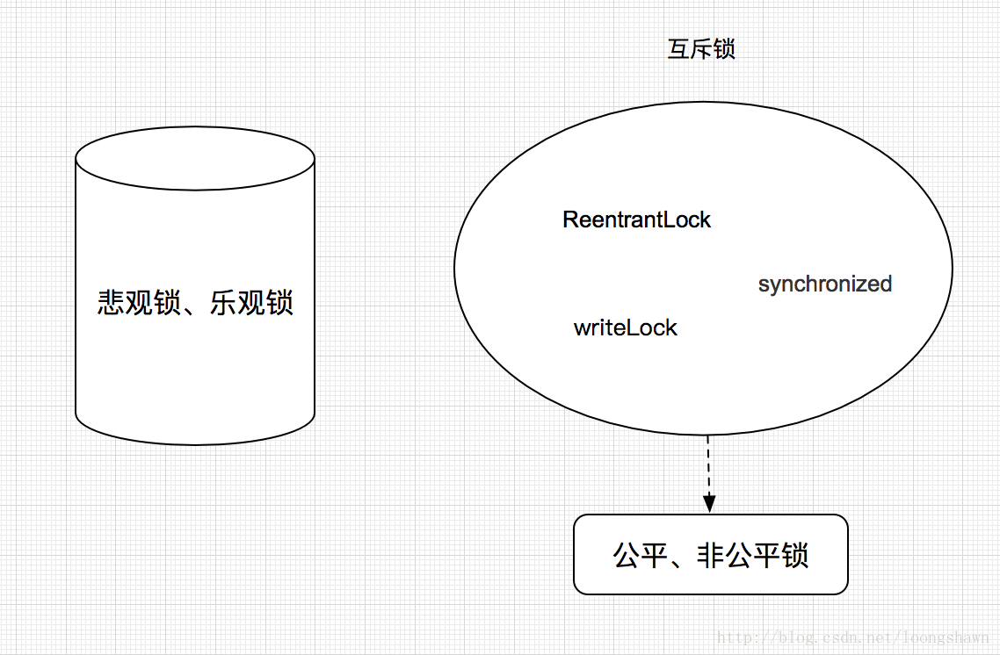

# 多线程并发知识点


# ## Java内存模型概述
 
 > Java内存模型规范了Java虚拟机与计算机内存是如何协同工作的。Java虚拟机是一个完整的计算机的一个模型，
 因此这个模型自然也包含一个内存模型——又称为Java内存模型。

- 如果你想设计表现良好的并发程序，理解Java内存模型是非常重要的。
Java内存模型规定了如何和何时可以看到由其他线程修改过后的共享变量的值，以及在必须时如何同步的访问共享变量。

- 原始的Java内存模型存在一些不足，因此Java内存模型在Java1.5时被重新修订。这个版本的Java内存模型在Java8中人在使用。

 
 Java内存模型(即Java Memory Model，简称JMM)本身是一种抽象的概念，并不真实存在，
 它描述的是一组规则或规范，通过这组规范定义了程序中各个变量（包括实例字段，静态字段和构成数组对象的元素）的访问方式。
 由于JVM运行程序的实体是线程，而每个线程创建时JVM都会为其创建一个工作内存(有些地方称为栈空间)，
 用于存储线程私有的数据，而Java内存模型中规定所有变量都存储在主内存，主内存是共享内存区域，
 所有线程都可以访问，但线程对变量的操作(读取赋值等)必须在工作内存中进行，
 首先要将变量从主内存拷贝的自己的工作内存空间，然后对变量进行操作，操作完成后再将变量写回主内存，
 不能直接操作主内存中的变量，工作内存中存储着主内存中的变量副本拷贝，
 前面说过，工作内存是每个线程的私有数据区域，因此不同的线程间无法访问对方的工作内存，
 线程间的通信(传值)必须通过主内存来完成，其简要访问过程如下图
 
 
 
 
 需要注意的是，JMM与Java内存区域的划分是不同的概念层次，更恰当说JMM描述的是一组规则，
 通过这组规则控制程序中各个变量在共享数据区域和私有数据区域的访问方式，JMM是围绕原子性，
 有序性、可见性展开的(稍后会分析)。JMM与Java内存区域唯一相似点，都存在共享数据区域和私有数据区域，
 在JMM中主内存属于共享数据区域，从某个程度上讲应该包括了堆和方法区，而工作内存数据线程私有数据区域，
 从某个程度上讲则应该包括程序计数器、虚拟机栈以及本地方法栈。或许在某些地方，
 我们可能会看见主内存被描述为堆内存，工作内存被称为线程栈，实际上他们表达的都是同一个含义。
 关于JMM中的主内存和工作内存说明如下
 
 
 ### 主内存

主要存储的是Java实例对象，所有线程创建的实例对象都存放在主内存中，
不管该实例对象是成员变量还是方法中的本地变量(也称局部变量)，
当然也包括了共享的类信息、常量、静态变量。由于是共享数据区域，
**多条线程对同一个变量进行访问可能会发现线程安全问题**。


### 工作内存

主要存储当前方法的所有本地变量信息(工作内存中存储着主内存中的变量副本拷贝)，
每个线程只能访问自己的工作内存，即线程中的本地变量对其它线程是不可见的，就算是两个线程执行的是同一段代码，
它们也会各自在自己的工作内存中创建属于当前线程的本地变量，当然也包括了字节码行号指示器、相关Native方法的信息。
注意由于工作内存是每个线程的私有数据，线程间无法相互访问工作内存，因此存储在工作内存的数据不存在线程安全问题。

弄清楚主内存和工作内存后，接了解一下主内存与工作内存的数据存储类型以及操作方式，
根据虚拟机规范，对于一个实例对象中的成员方法而言，如果方法中包含本地变量是基本数据类型
（boolean,byte,short,char,int,long,float,double），将直接存储在工作内存的帧栈结构中，
但倘若本地变量是引用类型，那么该变量的引用会存储在功能内存的帧栈中，
而对象实例将存储在主内存(共享数据区域，堆)中。但对于实例对象的成员变量，
不管它是基本数据类型或者包装类型(Integer、Double等)还是引用类型，都会被存储到堆区。
至于static变量以及类本身相关信息将会存储在主内存中。需要注意的是，
在主内存中的实例对象可以被多线程共享，倘若两个线程同时调用了同一个对象的同一个方法，
那么两条线程会将要操作的数据拷贝一份到自己的工作内存中，执行完成操作后才刷新到主内存，简单示意图如下所示： 



 

 
### 硬件内存架构与Java内存模型

#### 硬件内存架构
 
 
 
 
 正如上图所示，经过简化CPU与内存操作的简易图，实际上没有这么简单，这里为了理解方便，
 我们省去了南北桥并将三级缓存统一为CPU缓存(有些CPU只有二级缓存，有些CPU有三级缓存)。
 就目前计算机而言，一般拥有多个CPU并且每个CPU可能存在多个核心，
 多核是指在一枚处理器(CPU)中集成两个或多个完整的计算引擎(内核),这样就可以支持多任务并行执行，从多线程的调度来说，
 每个线程都会映射到各个CPU核心中并行运行。
 在CPU内部有一组CPU寄存器，寄存器是cpu直接访问和处理的数据，是一个临时放数据的空间。
 一般CPU都会从内存取数据到寄存器，然后进行处理，但由于内存的处理速度远远低于CPU，
 导致CPU在处理指令时往往花费很多时间在等待内存做准备工作，于是在寄存器和主内存间添加了CPU缓存，CPU缓存比较小，
 但访问速度比主内存快得多，如果CPU总是操作主内存中的同一址地的数据，很容易影响CPU执行速度，
 此时CPU缓存就可以把从内存提取的数据暂时保存起来，如果寄存器要取内存中同一位置的数据，直接从缓存中提取，
 无需直接从主内存取。需要注意的是，寄存器并不每次数据都可以从缓存中取得数据，万一不是同一个内存地址中的数据，
 那寄存器还必须直接绕过缓存从内存中取数据。所以并不每次都得到缓存中取数据，这种现象有个专业的名称叫做缓存的命中率，
 从缓存中取就命中，不从缓存中取从内存中取，就没命中，可见缓存命中率的高低也会影响CPU执行性能，
 这就是CPU、缓存以及主内存间的简要交互过程，总而言之当一个CPU需要访问主存时，
 会先读取一部分主存数据到CPU缓存(当然如果CPU缓存中存在需要的数据就会直接从缓存获取)，
 进而在读取CPU缓存到寄存器，当CPU需要写数据到主存时，同样会先刷新寄存器中的数据到CPU缓存，然后再把数据刷新到主内存中。


#### java线程与硬件处理器

了解完硬件的内存架构后，接着了解JVM中线程的实现原理，理解线程的实现原理，
有助于我们了解Java内存模型与硬件内存架构的关系，在Window系统和Linux系统上，
Java线程的实现是基于一对一的线程模型，所谓的一对一模型，实际上就是通过语言级别层面程序去间接调用系统内核的线程模型，
即我们在使用Java线程时，Java虚拟机内部是转而调用当前操作系统的内核线程来完成当前任务。
这里需要了解一个术语，内核线程(Kernel-Level Thread，KLT)，它是由操作系统内核(Kernel)支持的线程，
这种线程是由操作系统内核来完成线程切换，内核通过操作调度器进而对线程执行调度，并将线程的任务映射到各个处理器上。
每个内核线程可以视为内核的一个分身,这也就是操作系统可以同时处理多任务的原因。
由于我们编写的多线程程序属于语言层面的，程序一般不会直接去调用内核线程，
取而代之的是一种轻量级的进程(Light Weight Process)，也是通常意义上的线程，
由于每个轻量级进程都会映射到一个内核线程，因此我们可以通过轻量级进程调用内核线程，
进而由操作系统内核将任务映射到各个处理器，这种轻量级进程与内核线程间1对1的关系就称为一对一的线程模型。如下图




如图所示，每个线程最终都会映射到CPU中进行处理，如果CPU存在多核，那么一个CPU将可以并行执行多个线程任务。

#### Java内存模型与硬件内存架构的关系

通过对前面的硬件内存架构、Java内存模型以及Java多线程的实现原理的了解，我们应该已经意识到，
多线程的执行最终都会映射到硬件处理器上进行执行，但Java内存模型和硬件内存架构并不完全一致。
对于硬件内存来说只有寄存器、缓存内存、主内存的概念，并没有工作内存(线程私有数据区域)和主内存(堆内存)之分，
也就是说Java内存模型对内存的划分对硬件内存并没有任何影响，因为JMM只是一种抽象的概念，是一组规则，并不实际存在，
不管是工作内存的数据还是主内存的数据，对于计算机硬件来说都会存储在计算机主内存中，
当然也有可能存储到CPU缓存或者寄存器中，因此总体上来说，Java内存模型和计算机硬件内存架构是一个相互交叉的关系，
是一种抽象概念划分与真实物理硬件的交叉。(注意对于Java内存区域划分也是同样的道理)




#### JMM存在的必要性

在明白了Java内存区域划分、硬件内存架构、Java多线程的实现原理与Java内存模型的具体关系后，接着来谈谈Java内存模型存在的必要性。

由于JVM运行程序的实体是线程，而每个线程创建时JVM都会为其创建一个工作内存(有些地方称为栈空间)，
用于存储线程私有的数据，线程与主内存中的变量操作必须通过工作内存间接完成，
主要过程是将变量从主内存拷贝的每个线程各自的工作内存空间，然后对变量进行操作，操作完成后再将变量写回主内存，
如果存在两个线程同时对一个主内存中的实例对象的变量进行操作就有可能诱发线程安全问题。

如下图，主内存中存在一个共享变量x，现在有A和B两条线程分别对该变量x=1进行操作，
A/B线程各自的工作内存中存在共享变量副本x。假设现在A线程想要修改x的值为2，而B线程却想要读取x的值，
那么B线程读取到的值是A线程更新后的值2还是更新前的值1呢？答案是，不确定，即B线程有可能读取到A线程更新前的值1，
也有可能读取到A线程更新后的值2，这是因为工作内存是每个线程私有的数据区域，而线程A变量x时，
首先是将变量从主内存拷贝到A线程的工作内存中，然后对变量进行操作，操作完成后再将变量x写回主内，
而对于B线程的也是类似的，这样就有可能造成主内存与工作内存间数据存在一致性问题，假如A线程修改完后正在将数据写回主内存，
而B线程此时正在读取主内存，即将x=1拷贝到自己的工作内存中，这样B线程读取到的值就是x=1，但如果A线程已将x=2写回主内存后，
B线程才开始读取的话，那么此时B线程读取到的就是x=2，但到底是哪种情况先发生呢？这是不确定的，这也就是**所谓的线程安全问题**。





#### Java内存模型的承诺

这里我们先来了解几个概念，即原子性？可见性？有序性？最后再阐明JMM是如何保证这3个特性。

#### 原子性
原子性指的是一个操作是不可中断的，即使是在多线程环境下，一个操作一旦开始就不会被其他线程影响。
比如对于一个静态变量int x，两条线程同时对他赋值，线程A赋值为1，而线程B赋值为2，不管线程如何运行，
最终x的值要么是1，要么是2，线程A和线程B间的操作是没有干扰的，这就是原子性操作，不可被中断的特点。
有点要注意的是，对于32位系统的来说，
long类型数据和double类型数据(对于基本数据类型，byte,short,int,float,boolean,char读写是原子操作)，
它们的读写并非原子性的，也就是说如果存在两条线程同时对long类型或者double类型的数据进行读写是存在相互干扰的，
因为对于32位虚拟机来说，每次原子读写是32位的，而long和double则是64位的存储单元，这样会导致一个线程在写时，
操作完前32位的原子操作后，轮到B线程读取时，恰好只读取到了后32位的数据，
这样可能会读取到一个既非原值又不是线程修改值的变量，它可能是“半个变量”的数值，即64位数据被两个线程分成了两次读取。
但也不必太担心，因为读取到“半个变量”的情况比较少见，至少在目前的商用的虚拟机中，
几乎都把64位的数据的读写操作作为原子操作来执行，因此对于这个问题不必太在意，知道这么回事即可。

#### 理解指令重排

计算机在执行程序时，为了提高性能，编译器和处理器的常常会对指令做重排，一般分以下3种

- 编译器优化的重排

编译器在不改变单线程程序语义的前提下，可以重新安排语句的执行顺序。

- 指令并行的重排

现代处理器采用了指令级并行技术来将多条指令重叠执行。如果不存在数据依赖性(即后一个执行的语句无需依赖前面执行的语句的结果)，
处理器可以改变语句对应的机器指令的执行顺序

- 内存系统的重排

由于处理器使用缓存和读写缓存冲区，这使得加载(load)和存储(store)操作看上去可能是在乱序执行，
因为三级缓存的存在，导致内存与缓存的数据同步存在时间差。

其中编译器优化的重排属于编译期重排，指令并行的重排和内存系统的重排属于处理器重排，
在多线程环境中，这些重排优化可能会导致程序出现内存可见性问题，下面分别阐明这两种重排优化可能带来的问题

#### 编译器重排

下面我们简单看一个编译器重排的例子：

```
线程 1             线程 2
1： x2 = a ;      3: x1 = b ;
2: b = 1;         4: a = 2 ;
``` 
两个线程同时执行，分别有1、2、3、4四段执行代码，其中1、2属于线程1 ，
 3、4属于线程2 ，从程序的执行顺序上看，似乎不太可能出现x1 = 1 和x2 = 2 的情况，
 但实际上这种情况是有可能发现的，因为如果编译器对这段程序代码执行重排优化后，可能出现下列情况

```
线程 1              线程 2
2: b = 1;          4: a = 2 ; 
1：x2 = a ;        3: x1 = b ;
```

这种执行顺序下就有可能出现x1 = 1 和x2 = 2 的情况，这也就说明在多线程环境下，由于编译器优化重排的存在，
两个线程中使用的变量能否保证一致性是无法确定的。

处理器指令重排

先了解一下指令重排的概念，处理器指令重排是对CPU的性能优化，从指令的执行角度来说一条指令可以分为多个步骤完成，如下

- 取指 IF
- 译码和取寄存器操作数 ID
- 执行或者有效地址计算 EX
- 存储器访问 MEM
- 写回 WB

CPU在工作时，需要将上述指令分为多个步骤依次执行(注意硬件不同有可能不一样),由于每一个步会使用到不同的硬件操作，
比如取指时会只有PC寄存器和存储器，译码时会执行到指令寄存器组，执行时会执行ALU(算术逻辑单元)、写回时使用到寄存器组。
为了提高硬件利用率，CPU指令是按流水线技术来执行的，如下：


从图中可以看出当指令1还未执行完成时，第2条指令便利用空闲的硬件开始执行，这样做是有好处的，
如果每个步骤花费1ms，那么如果第2条指令需要等待第1条指令执行完成后再执行的话，则需要等待5ms，
但如果使用流水线技术的话，指令2只需等待1ms就可以开始执行了，这样就能大大提升CPU的执行性能。
虽然流水线技术可以大大提升CPU的性能，但不幸的是一旦出现流水中断，所有硬件设备将会进入一轮停顿期，
当再次弥补中断点可能需要几个周期，这样性能损失也会很大，就好比工厂组装手机的流水线，一旦某个零件组装中断，
那么该零件往后的工人都有可能进入一轮或者几轮等待组装零件的过程。因此我们需要尽量阻止指令中断的情况，
指令重排就是其中一种优化中断的手段，我们通过一个例子来阐明指令重排是如何阻止流水线技术中断的

```
a = b + c ;
d = e - f ;
```

下面通过汇编指令展示了上述代码在CPU执行的处理过程




- LW指令 表示 load，其中LW R1,b表示把b的值加载到寄存器R1中
- LW R2,c 表示把c的值加载到寄存器R2中
- ADD 指令表示加法，把R1 、R2的值相加，并存入R3寄存器中。
- SW 表示 store 即将 R3寄存器的值保持到变量a中
- LW R4,e 表示把e的值加载到寄存器R4中
- LW R5,f 表示把f的值加载到寄存器R5中
- SUB 指令表示减法，把R4 、R5的值相减，并存入R6寄存器中。
- SW d,R6 表示将R6寄存器的值保持到变量d中

上述便是汇编指令的执行过程，在某些指令上存在X的标志，X代表中断的含义，
也就是只要有X的地方就会导致指令流水线技术停顿，同时也会影响后续指令的执行，
可能需要经过1个或几个指令周期才可能恢复正常，那为什么停顿呢？这是因为部分数据还没准备好，
如执行ADD指令时，需要使用到前面指令的数据R1，R2，而此时R2的MEM操作没有完成，即未拷贝到存储器中，
这样加法计算就无法进行，必须等到MEM操作完成后才能执行，也就因此而停顿了，其他指令也是类似的情况。
前面阐述过，停顿会造成CPU性能下降，因此我们应该想办法消除这些停顿，这时就需要使用到指令重排了，
如下图，既然ADD指令需要等待，那我们就利用等待的时间做些别的事情，
如把LW R4,e 和 LW R5,f 移动到前面执行，毕竟LW R4,e 和 LW R5,f执行并没有数据依赖关系，
对他们有数据依赖关系的SUB R6,R5,R4指令在R4,R5加载完成后才执行的，没有影响，过程如下：




正如上图所示，所有的停顿都完美消除了，指令流水线也无需中断了，这样CPU的性能也能带来很好的提升，
这就是处理器指令重排的作用。关于编译器重排以及指令重排(这两种重排我们后面统一称为指令重排)相关内容已阐述清晰了，
我们必须意识到对于单线程而已指令重排几乎不会带来任何影响，比竟重排的前提是保证串行语义执行的一致性，
但对于多线程环境而已，指令重排就可能导致严重的程序乱序执行问题，如下

```
class MixedOrder{
    int a = 0;
    boolean flag = false;
    public void writer(){
        a = 1;
        flag = true;
    }

    public void read(){
        if(flag){
            int i = a + 1；
        }
    }
}
```

如上述代码，同时存在线程A和线程B对该实例对象进行操作，其中A线程调用写入方法，而B线程调用读取方法，
由于指令重排等原因，可能导致程序执行顺序变为如下：
```
 线程A                    线程B
 writer：                 read：
 1:flag = true;           1:flag = true;
 2:a = 1;                 2: a = 0 ; //误读
                          3: i = 1 ;
```
 
由于指令重排的原因，线程A的flag置为true被提前执行了，而a赋值为1的程序还未执行完，
此时线程B，恰好读取flag的值为true，直接获取a的值（此时B线程并不知道a为0）并执行i赋值操作，
结果i的值为1，而不是预期的2，这就是多线程环境下，指令重排导致的程序乱序执行的结果。
因此，请记住，指令重排只会保证单线程中串行语义的执行的一致性，但并不会关心多线程间的语义一致性。

##### 可见性

理解了指令重排现象后，可见性容易了，可见性指的是当一个线程修改了某个共享变量的值，
其他线程是否能够马上得知这个修改的值。对于串行程序来说，可见性是不存在的，因为我们在任何一个操作中修改了某个变量的值，
后续的操作中都能读取这个变量值，并且是修改过的新值。但在多线程环境中可就不一定了，前面我们分析过，
由于线程对共享变量的操作都是线程拷贝到各自的工作内存进行操作后才写回到主内存中的，
这就可能存在一个线程A修改了共享变量x的值，还未写回主内存时，另外一个线程B又对主内存中同一个共享变量x进行操作，
但此时A线程工作内存中共享变量x对线程B来说并不可见，这种工作内存与主内存同步延迟现象就造成了可见性问题，
另外指令重排以及编译器优化也可能导致可见性问题，通过前面的分析，我们知道无论是编译器优化还是处理器优化的重排现象，
在多线程环境下，确实会导致程序乱序执行的问题，从而也就导致可见性问题。

##### 有序性

有序性是指对于单线程的执行代码，我们总是认为代码的执行是按顺序依次执行的，
这样的理解并没有毛病，毕竟对于单线程而言确实如此，但对于多线程环境，则可能出现乱序现象，
因为程序编译成机器码指令后可能会出现指令重排现象，重排后的指令与原指令的顺序未必一致，
要明白的是，在Java程序中，倘若在本线程内，所有操作都视为有序行为，如果是多线程环境下，
一个线程中观察另外一个线程，所有操作都是无序的，前半句指的是单线程内保证串行语义执行的一致性，
后半句则指指令重排现象和工作内存与主内存同步延迟现象。

##### JMM提供的解决方案

在理解了原子性，可见性以及有序性问题后，看看JMM是如何保证的，
在Java内存模型中都提供一套解决方案供Java工程师在开发过程使用，
如原子性问题，除了JVM自身提供的对基本数据类型读写操作的原子性外，
对于方法级别或者代码块级别的原子性操作，可以使用synchronized关键字或者重入锁(ReentrantLock)保证程序执行的原子性，
关于synchronized的详解，看博主另外一篇文章( 深入理解Java并发之synchronized实现原理)。
而工作内存与主内存同步延迟现象导致的可见性问题，可以使用synchronized关键字或者volatile关键字解决，
它们都可以使一个线程修改后的变量立即对其他线程可见。对于指令重排导致的可见性问题和有序性问题，
则可以利用volatile关键字解决，因为volatile的另外一个作用就是禁止重排序优化，
关于volatile稍后会进一步分析。除了靠sychronized和volatile关键字来保证原子性、
可见性以及有序性外，JMM内部还定义一套happens-before 原则来保证多线程环境下两个操作间的原子性、可见性以及有序性。

##### 理解JMM中的happens-before 原则

倘若在程序开发中，仅靠sychronized和volatile关键字来保证原子性、可见性以及有序性，那么编写并发程序可能会显得十分麻烦，
幸运的是，在Java内存模型中，还提供了happens-before 原则来辅助保证程序执行的原子性、可见性以及有序性的问题，
它是判断数据是否存在竞争、线程是否安全的依据，happens-before 原则内容如下

程序顺序原则，即在一个线程内必须保证语义串行性，也就是说按照代码顺序执行。

锁规则 解锁(unlock)操作必然发生在后续的同一个锁的加锁(lock)之前，也就是说，如果对于一个锁解锁后，再加锁，
那么加锁的动作必须在解锁动作之后(同一个锁)。

volatile规则 volatile变量的写，先发生于读，这保证了volatile变量的可见性，简单的理解就是，
volatile变量在每次被线程访问时，都强迫从主内存中读该变量的值，而当该变量发生变化时，又会强迫将最新的值刷新到主内存，
任何时刻，不同的线程总是能够看到该变量的最新值。

线程启动规则 线程的start()方法先于它的每一个动作，即如果线程A在执行线程B的start方法之前修改了共享变量的值，
那么当线程B执行start方法时，线程A对共享变量的修改对线程B可见

传递性 A先于B ，B先于C 那么A必然先于C

线程终止规则 线程的所有操作先于线程的终结，Thread.join()方法的作用是等待当前执行的线程终止。
假设在线程B终止之前，修改了共享变量，线程A从线程B的join方法成功返回后，线程B对共享变量的修改将对线程A可见。

线程中断规则 对线程 interrupt()方法的调用先行发生于被中断线程的代码检测到中断事件的发生，
可以通过Thread.interrupted()方法检测线程是否中断。

对象终结规则 对象的构造函数执行，结束先于finalize()方法

上述8条原则无需手动添加任何同步手段(synchronized|volatile)即可达到效果，
下面我们结合前面的案例演示这8条原则如何判断线程是否安全，如下：

```
class MixedOrder{
    int a = 0;
    boolean flag = false;
    public void writer(){
        a = 1;
        flag = true;
    }

    public void read(){
        if(flag){
            int i = a + 1；
        }
    }
}
```

同样的道理，存在两条线程A和B，线程A调用实例对象的writer()方法，
而线程B调用实例对象的read()方法，线程A先启动而线程B后启动，那么线程B读取到的i值是多少呢？现在依据8条原则，
由于存在两条线程同时调用，因此程序次序原则不合适。writer()方法和read()方法都没有使用同步手段，
锁规则也不合适。没有使用volatile关键字，volatile变量原则不适应。线程启动规则、线程终止规则、
线程中断规则、对象终结规则、传递性和本次测试案例也不合适。线程A和线程B的启动时间虽然有先后，
但线程B执行结果却是不确定，也是说上述代码没有适合8条原则中的任意一条，也没有使用任何同步手段，
所以上述的操作是线程不安全的，因此线程B读取的值自然也是不确定的。修复这个问题的方式很简单，
要么给writer()方法和read()方法添加同步手段，如synchronized或者给变量flag添加volatile关键字，
确保线程A修改的值对线程B总是可见。


##### happens-before

从jdk5开始，java使用新的JSR-133内存模型，基于happens-before的概念来阐述操作之间的内存可见性。

在JMM中，如果一个操作的执行结果需要对另一个操作可见，那么这两个操作之间必须要存在happens-before关系，
这个的两个操作既可以在同一个线程，也可以在不同的两个线程中。

与程序员密切相关的happens-before规则如下：

程序顺序规则：一个线程中的每个操作，happens-before于该线程中任意的后续操作。

监视器锁规则：对一个锁的解锁操作，happens-before于随后对这个锁的加锁操作。
volatile域规则：对一个volatile域的写操作，happens-before于任意线程后续对这个volatile域的读。

传递性规则：如果 A happens-before B，且 B happens-before C，那么A happens-before C。
注意：两个操作之间具有happens-before关系，并不意味前一个操作必须要在后一个操作之前执行！
仅仅要求前一个操作的执行结果，对于后一个操作是可见的，且前一个操作按顺序排在后一个操作之前。


##### volatile内存语义

volatile在并发编程中很常见，但也容易被滥用，现在我们就进一步分析volatile关键字的语义。
volatile是Java虚拟机提供的轻量级的同步机制。volatile关键字有如下两个作用

保证被volatile修饰的共享gong’x变量对所有线程总数可见的，也就是当一个线程修改了一个被volatile修饰共享变量的值，
新值总数可以被其他线程立即得知。

禁止指令重排序优化。

volatile的可见性
关于volatile的可见性作用，我们必须意识到被volatile修饰的变量对所有线程总数立即可见的，
对volatile变量的所有写操作总是能立刻反应到其他线程中，但是对于volatile变量运算操作在多线程环境并不保证安全性，如下

```
public class VolatileVisibility {
    public static volatile int i =0;

    public static void increase(){
        i++;
    }
}
```
正如上述代码所示，i变量的任何改变都会立马反应到其他线程中，但是如此存在多条线程同时调用increase()方法的话，
就会出现线程安全问题，毕竟i++;操作并不具备原子性，该操作是先读取值，然后写回一个新值，
相当于原来的值加上1，分两步完成，如果第二个线程在第一个线程读取旧值和写回新值期间读取i的域值，
那么第二个线程就会与第一个线程一起看到同一个值，并执行相同值的加1操作，这也就造成了线程安全失败，
因此对于increase方法必须使用synchronized修饰，以便保证线程安全，
需要注意的是一旦使用synchronized修饰方法后，由于synchronized本身也具备与volatile相同的特性，
即可见性，因此在这样种情况下就完全可以省去volatile修饰变量。

```
public class VolatileVisibility {
    public static int i =0;

    public synchronized static void increase(){
        i++;
    }
}
```

现在来看另外一种场景，可以使用volatile修饰变量达到线程安全的目的，如下

```
public class VolatileSafe {

    volatile boolean close;

    public void close(){
        close=true;
    }

    public void doWork(){
        while (!close){
            System.out.println("safe....");
        }
    }
}
```

由于对于boolean变量close值的修改属于原子性操作，因此可以通过使用volatile修饰变量close，
使用该变量对其他线程立即可见，从而达到线程安全的目的。那么JMM是如何实现让volatile变量对其他线程立即可见的呢？
实际上，当写一个volatile变量时，JMM会把该线程对应的工作内存中的共享变量值刷新到主内存中，
当读取一个volatile变量时，JMM会把该线程对应的工作内存置为无效，那么该线程将只能从主内存中重新读取共享变量。
volatile变量正是通过这种写-读方式实现对其他线程可见（但其内存语义实现则是通过内存屏障，稍后会说明）。

##### volatile禁止重排优化
volatile关键字另一个作用就是禁止指令重排优化，从而避免多线程环境下程序出现乱序执行的现象，
关于指令重排优化前面已详细分析过，这里主要简单说明一下volatile是如何实现禁止指令重排优化的。
先了解一个概念，内存屏障(Memory Barrier）。 

内存屏障，又称内存栅栏，是一个CPU指令，它的作用有两个，**一是保证特定操作的执行顺序，
二是保证某些变量的内存可见性**（利用该特性实现volatile的内存可见性）。

由于编译器和处理器都能执行指令重排优化。如果在指令间插入一条Memory Barrier则会告诉编译器和CPU，
不管什么指令都不能和这条Memory Barrier指令重排序，也就是说通过插入内存屏障禁止在内存屏障前后的指令执行重排序优化。

Memory Barrier的另外一个作用是强制刷出各种CPU的缓存数据，因此任何CPU上的线程都能读取到这些数据的最新版本。

总之，volatile变量正是通过内存屏障实现其在内存中的语义，即可见性和禁止重排优化。
下面看一个非常典型的禁止重排优化的例子DCL，如下：

```
/**
 * Created by zejian on 2017/6/11.
 * Blog : http://blog.csdn.net/javazejian [原文地址,请尊重原创]
 */
public class DoubleCheckLock {

    private static DoubleCheckLock instance;

    private DoubleCheckLock(){}

    public static DoubleCheckLock getInstance(){

        //第一次检测
        if (instance==null){
            //同步
            synchronized (DoubleCheckLock.class){
                if (instance == null){
                    //多线程环境下可能会出现问题的地方
                    instance = new DoubleCheckLock();
                }
            }
        }
        return instance;
    }
}
```
 
上述代码一个经典的单例的双重检测的代码，这段代码在单线程环境下并没有什么问题，
但如果在多线程环境下就可以出现线程安全问题。原因在于某一个线程执行到第一次检测，
读取到的instance不为null时，instance的引用对象可能没有完成初始化。
因为instance = new DoubleCheckLock();可以分为以下3步完成(伪代码)

```
memory = allocate(); //1.分配对象内存空间
instance(memory);    //2.初始化对象
instance = memory;   //3.设置instance指向刚分配的内存地址，此时instance！=null
```
由于步骤1和步骤2间可能会重排序，如下：
```
memory = allocate(); //1.分配对象内存空间
instance = memory;   //3.设置instance指向刚分配的内存地址，此时instance！=null，但是对象还没有初始化完成！
instance(memory);    //2.初始化对象
```

由于步骤2和步骤3不存在数据依赖关系，而且无论重排前还是重排后程序的执行结果在单线程中并没有改变，
因此这种重排优化是允许的。但是指令重排只会保证串行语义的执行的一致性(单线程)，但并不会关心多线程间的语义一致性。
所以当一条线程访问instance不为null时，由于instance实例未必已初始化完成，也就造成了线程安全问题。
那么该如何解决呢，很简单，我们使用volatile禁止instance变量被执行指令重排优化即可。

```
  //禁止指令重排优化
  private volatile static DoubleCheckLock instance;
```

- ok~，到此相信我们对Java内存模型和volatile应该都有了比较全面的认识，总而言之，
我们应该清楚知道，**JMM就是一组规则**，**这组规则意在解决在并发编程可能出现的线程安全问题**，
并提供了内置解决方案（happen-before原则）及其外部可使用的同步手段(synchronized/volatile等)，
确保了程序执行在多线程环境中的应有的原子性，可视性及其有序性。

<https://blog.csdn.net/javazejian/article/details/72772461>


例如你让一个volatile的integer自增（i++），其实要分成3步：

 1）读取volatile变量值到local、 \
 2）增加变量的值； \
 3）把local的值写回，让其它的线程可见。这3步的jvm指令为 \

```
mov   
0xc(%r10),%r8d
 ; Load
inc   
 %r8d           ; Increment
mov   
 %r8d,0xc(%r10)
 ; Store
lock
 addl $0x0,(%rsp)
 ; StoreLoad Barrier
```

内存屏障（memory barrier）是一个CPU指令。基本上，它是这样一条指令： 


- a) 确保一些特定操作执行的顺序； 
- b) 影响一些数据的可见性(可能是某些指令执行后的结果)。
编译器和CPU可以在保证输出结果一样的情况下对指令重排序，使性能得到优化。插入一个内存屏障，
相当于告诉CPU和编译器先于这个命令的必须先执行，
后于这个命令的必须后执行。
内存屏障另一个作用是强制更新一次不同CPU的缓存。
例如，一个写屏障会把这个屏障前写入的数据刷新到缓存，
这样任何试图读取该数据的线程将得到最新值，而不用考虑到底是被哪个cpu核心或者哪颗CPU执行的。


##### 内存屏障和volatile什么关系？

上面的虚拟机指令里面有提到，如果你的字段是volatile，Java内存模型将在写操作后插入一个写屏障指令，
在读操作前插入一个读屏障指令。这意味着如果你对一个volatile字段进行写操作，你必须知道：

1、一旦你完成写入，任何访问这个字段的线程将会得到最新的值。

2、在你写入前，会保证所有之前发生的事已经发生，并且任何更新过的数据值也是可见的，因为内存屏障会把之前的写入值都刷新到缓存。 

明白了内存屏障这个CPU指令，回到前面的JVM指令：从Load到store到内存屏障，一共4步，
其中最后一步jvm让这个最新的变量的值在所有线程可见，也就是最后一步让所有的CPU内核都获得了最新的值，
但中间的几步（从Load到Store）是不安全的，中间如果其他的CPU修改了值将会丢失。

所以volatile不能保证i++操作的原子性


## CyclicBarrier

### CyclicBarrier是什么？

CyclicBarrier也叫同步屏障，在JDK1.5被引入，可以让一组线程达到一个屏障时被阻塞，
直到最后一个线程达到屏障时，所以被阻塞的线程才能继续执行。
CyclicBarrier好比一扇门，默认情况下关闭状态，堵住了线程执行的道路，
直到所有线程都就位，门才打开，让所有线程一起通过。


简介： CyclicBarrier是一个同步辅助类，允许一组线程互相等待，直到到达某个公共屏障点 (common barrier point)。
因为该 barrier 在释放等待线程后可以重用，所以称它为循环 的 barrier。



### 应用场景
1. 想象一个场景，运动会男子100米决赛，8名选手。
每个运动员都就位后才开始。

2. 想实现所有的线程一起等待某个事件的发生，当某个事件发生时，所有线程一起开始往下执行。

### CyclicBarrier 原理

CyclicBarrier是通过ReentrantLock(独占锁)和Condition来实现的

- 构造函数

CyclicBarrier的构造函数共2个：CyclicBarrier 和 CyclicBarrier(int parties, Runnable barrierAction)。
第1个构造函数是调用第2个构造函数来实现的，下面第2个构造函数的源码。

```
public CyclicBarrier(int parties, Runnable barrierAction) {
    if (parties <= 0) throw new IllegalArgumentException();
    // parties表示“必须同时到达barrier的线程个数”。
    this.parties = parties;
    // count表示“处在等待状态的线程个数”。
    this.count = parties;
    // barrierCommand表示“parties个线程到达barrier时，会执行的动作”。
    this.barrierCommand = barrierAction;
}
```
- 等待函数

CyclicBarrier.java中await()方法如下：

```
public int await() throws InterruptedException, BrokenBarrierException {
    try {
        return dowait(false, 0L);
    } catch (TimeoutException toe) {
        throw new Error(toe); // cannot happen;
    }
}

```
说明：await()是通过dowait()实现的。

```
private int dowait(boolean timed, long nanos)
    throws InterruptedException, BrokenBarrierException,
           TimeoutException {
    final ReentrantLock lock = this.lock;
    // 获取“独占锁(lock)”
    lock.lock();
    try {
        // 保存“当前的generation”
        final Generation g = generation;

        // 若“当前generation已损坏”，则抛出异常。
        if (g.broken)
            throw new BrokenBarrierException();

        // 如果当前线程被中断，则通过breakBarrier()终止CyclicBarrier，唤醒CyclicBarrier中所有等待线程。
        if (Thread.interrupted()) {
            breakBarrier();
            throw new InterruptedException();
        }

       // 将“count计数器”-1
       int index = --count;
       // 如果index=0，则意味着“有parties个线程到达barrier”。
       if (index == 0) {  // tripped
           boolean ranAction = false;
           try {
               // 如果barrierCommand不为null，则执行该动作。
               final Runnable command = barrierCommand;
               if (command != null)
                   command.run();
               ranAction = true;
               // 唤醒所有等待线程，并更新generation。
               nextGeneration();
               return 0;
           } finally {
               if (!ranAction)
                   breakBarrier();
           }
       }

        // 当前线程一直阻塞，直到“有parties个线程到达barrier” 或 “当前线程被中断” 或 “超时”这3者之一发生，
        // 当前线程才继续执行。
        for (;;) {
            try {
                // 如果不是“超时等待”，则调用awati()进行等待；否则，调用awaitNanos()进行等待。
                if (!timed)
                    trip.await();
                else if (nanos > 0L)
                    nanos = trip.awaitNanos(nanos);
            } catch (InterruptedException ie) {
                // 如果等待过程中，线程被中断，则执行下面的函数。
                if (g == generation && ! g.broken) {
                    breakBarrier();
                    throw ie;
                } else {
                    Thread.currentThread().interrupt();
                }
            }

            // 如果“当前generation已经损坏”，则抛出异常。
            if (g.broken)
                throw new BrokenBarrierException();

            // 如果“generation已经换代”，则返回index。
            if (g != generation)
                return index;

            // 如果是“超时等待”，并且时间已到，则通过breakBarrier()终止CyclicBarrier，
            // 唤醒CyclicBarrier中所有等待线程。
            if (timed && nanos <= 0L) {
                breakBarrier();
                throw new TimeoutException();
            }
        }
    } finally {
        // 释放“独占锁(lock)”
        lock.unlock();
    }
}
```
dowait()的作用就是让当前线程阻塞，直到“有parties个线程到达barrier” 或 “当前线程被中断” 
或 “超时”这3者之一发生，当前线程才继续执行。 

1. 每当线程执行await，内部变量count减1，如果count！= 0，说明有线程还未到屏障处，则在锁条件变量trip上等待。
2. 当count == 0时，说明所有线程都已经到屏障处，执行条件变量的signalAll方法唤醒等待的线程。
其中 nextGeneration方法可以实现屏障的循环使用：

- 重新生成Generation对象
- 恢复count值

 
(01) generation是CyclicBarrier的一个成员遍历，它的定义如下：
```
public class CyclicBarrier {

  //  在CyclicBarrier中，同一批的线程属于同一代，即同一个Generation；
  //  CyclicBarrier中通过generation对象，记录属于哪一代。
  //  当有parties个线程到达barrier，generation就会被更新换代。
  
    private static class Generation {
        boolean broken = false;
    }
    /** The lock for guarding barrier entry */
    private final ReentrantLock lock = new ReentrantLock();
    /** Condition to wait on until tripped */
    private final Condition trip = lock.newCondition();
    /** The number of parties */
    private final int parties;
    /* The command to run when tripped */
    private final Runnable barrierCommand;
    /** The current generation */
    private Generation generation = new Generation();
    ...省略后面代码
}
```
其中Generation用来控制屏障的循环使用，如果generation.broken为true的话，
说明这个屏障已经损坏，当某个线程await的时候，直接抛出异常


(02) 如果当前线程被中断，即Thread.interrupted()为true；
则通过breakBarrier()终止CyclicBarrier。breakBarrier()的源码如下：
``` 
private void breakBarrier() {
    generation.broken = true;
    count = parties;
    trip.signalAll();
}
```
breakBarrier()会设置当前中断标记broken为true，意味着“将该Generation中断”；
同时，设置count=parties，即重新初始化count；最后，通过signalAll()唤醒CyclicBarrier上所有的等待线程。

(03) 将“count计数器”-1，即 --count；然后判断是不是“有parties个线程到达barrier”，即index是不是为0。
当index=0时，如果barrierCommand不为null，则执行该barrierCommand，
barrierCommand就是我们创建CyclicBarrier时，传入的Runnable对象。
然后，调用nextGeneration()进行换代工作，nextGeneration()的源码如下

``` 
/**
 * Updates state on barrier trip and wakes up everyone.
 * Called only while holding lock.
 */
private void nextGeneration() {
    // signal completion of last generation
    trip.signalAll();
    // set up next generation
    count = parties;
    generation = new Generation();
}
``` 

首先，它会调用signalAll()唤醒CyclicBarrier上所有的等待线程；接着，重新初始化count；最后，更新generation的值。

(04) 在for(;;)循环中。timed是用来表示当前是不是“超时等待”线程。
如果不是，则通过trip.await()进行等待；否则，调用awaitNanos()进行超时等待。

 
注意比较CountDownLatch和CyclicBarrier：

(01) CountDownLatch的作用是允许1或N个线程等待其他线程完成执行；而CyclicBarrier则是允许N个线程相互等待。\
(02) CountDownLatch的计数器无法被重置；CyclicBarrier的计数器可以被重置后使用，因此它被称为是循环的barrier。

### CountDownLatch的区别

1. CountDownLatch 允许一个或多个线程等待一些特定的操作完成，而这些操作是在其它的线程中进行的，
也就是说会出现 等待的线程 和 被等的线程 这样分明的角色；

2. CountDownLatch 构造函数中有一个 count 参数，表示有多少个线程需要被等待，
对这个变量的修改是在其它线程中调用 countDown 方法，每一个不同的线程调用一次 countDown 方法就表示有一个被等待的线程到达，
count 变为 0 时，latch（门闩）就会被打开，处于等待状态的那些线程接着可以执行；

3. CountDownLatch 是一次性使用的，也就是说latch门闩只能只用一次，一旦latch门闩被打开就不能再次关闭，
将会一直保持打开状态，因此 CountDownLatch 类也没有为 count 变量提供 set 的方法；


<https://www.cnblogs.com/skywang12345/p/3533995.html> 
<https://www.jianshu.com/p/424374d71b67>
 


## Java中常见的锁，互斥锁，读写锁，信号量

### java 中常见的锁



#### 1、自旋锁

自旋锁是采用让当前线程不停地的在循环体内执行实现的，当循环的条件被其他线程改变时 才能进入临界区。如下

```
public class SpinLock {
  private AtomicReference<Thread> sign =new AtomicReference<>();
  public void lock(){
    Thread current = Thread.currentThread();
    while(!sign .compareAndSet(null, current)){
    }
  }
  public void unlock (){
    Thread current = Thread.currentThread();
    sign .compareAndSet(current, null);
  }
}
```
使用了CAS原子操作，lock函数将owner设置为当前线程，并且预测原来的值为空。unlock函数将owner设置为null，并且预测值为当前线程。

当有第二个线程调用lock操作时由于owner值不为空，导致循环一直被执行，直至第一个线程调用unlock函数将owner设置为null，
第二个线程才能进入临界区。

由于自旋锁只是将当前线程不停地执行循环体，不进行线程状态的改变，所以响应速度更快。但当线程数不停增加时，
性能下降明显，因为每个线程都需要执行，占用CPU时间。如果线程竞争不激烈，并且保持锁的时间段。适合使用自旋锁。

注：该例子为非公平锁，获得锁的先后顺序，不会按照进入lock的先后顺序进行。

--- 

自旋锁可以使线程在没有取得锁的时候，不被挂起，而转去执行一个空循环，（即所谓的自旋，就是自己执行空循环），
若在若干个空循环后，线程如果可以获得锁，则继续执行。若线程依然不能获得锁，才会被挂起。

使用自旋锁后，线程被挂起的几率相对减少，线程执行的连贯性相对加强。因此，对于那些锁竞争不是很激烈，
锁占用时间很短的并发线程，具有一定的积极意义，但对于锁竞争激烈，单线程锁占用很长时间的并发程序，
自旋锁在自旋等待后，往往毅然无法获得对应的锁，不仅仅白白浪费了CPU时间，最终还是免不了被挂起的操作 ，反而浪费了系统的资源。

在JDK1.6中，Java虚拟机提供-XX:+UseSpinning参数来开启自旋锁，使用-XX:PreBlockSpin参数来设置自旋锁等待的次数。

在JDK1.7开始，自旋锁的参数被取消，虚拟机不再支持由用户配置自旋锁，自旋锁总是会执行，自旋锁次数也由虚拟机自动调整。


#### 2、自旋锁的其他种类

在自旋锁中 另有三种常见的锁形式:TicketLock ，CLHLock 和MCSLock

Ticket锁主要解决的是访问顺序的问题，主要的问题是在多核cpu上

CLHLock 和MCSLock 则是两种类型相似的公平锁，采用链表的形式进行排序，

CLHLock是不停的查询前驱变量， 导致不适合在NUMA 架构下使用（在这种结构下，每个线程分布在不同的物理内存区域）

MCSLock则是对本地变量的节点进行循环。不存在CLHLock 的问题。

CLH 要比 MCS 更简单，

CLH 的队列是隐式的队列，没有真实的后继结点属性。

MCS 的队列是显式的队列，有真实的后继结点属性。

JUC ReentrantLock 默认内部使用的锁 即是 CLH锁（有很多改进的地方，将自旋锁换成了阻塞锁等等）。


#### 3、阻塞锁

阻塞锁，与自旋锁不同，改变了线程的运行状态。
在JAVA环境中，线程Thread有如下几个状态：

1，新建状态

2，就绪状态

3，运行状态

4，阻塞状态

5，死亡状态

阻塞锁，可以说是让线程进入阻塞状态进行等待，当获得相应的信号（唤醒，时间） 时，
才可以进入线程的准备就绪状态，准备就绪状态的所有线程，通过竞争，进入运行状态。
JAVA中，能够进入\退出、阻塞状态或包含阻塞锁的方法有 ，synchronized 关键字（其中的重量锁），
ReentrantLock，Object.wait()\notify(),LockSupport.park()/unpart()(j.u.c经常使用)

阻塞锁的优势在于，阻塞的线程不会占用cpu时间， 不会导致 CPu占用率过高，但进入时间以及恢复时间都要比自旋锁略慢。

在竞争激烈的情况下 阻塞锁的性能要明显高于 自旋锁。

理想的情况则是; 在线程竞争不激烈的情况下，使用自旋锁，竞争激烈的情况下使用，阻塞锁。


#### 4、可重入锁

本文里面讲的是广义上的可重入锁，而不是单指JAVA下的ReentrantLock。

可重入锁，也叫做递归锁，指的是同一线程 外层函数获得锁之后 ，内层递归函数仍然有获取该锁的代码，但不受影响。
在JAVA环境下 ReentrantLock 和synchronized 都是 可重入锁

可重入锁最大的作用是避免死锁


#### 5、读写锁

linux内核的rwlock是读写锁的最简单的参考实现。它用一个整数counter代表一个rwlock。
0代表没有人占有锁，-1代表有一个线程持有着写锁， 正整数n代表有n个线程持有读锁。要拿读锁时，如果counter小于0， 
则继续循环测试，直到counter非负。然后给counter加1，拿锁成功。(当然，得保证“在counter非负的情况下加1”这个操作的原子性，
一般通过spinlock或者bit spinlock实现)。可见，如果已经有一个线程拿着读锁还未释放，另一个线程获取读锁会立即成功。

这个实现很简单，但是存在公平性的问题：写者可能会被饿死。 如果有很多线程相续拿到读锁然后释放读锁，
保持counter的值始终大于0，那写者就一直拿不到写锁。 

一个办法是在rwlock元数据中增加一个标记，代表是否有写者在等待读者。读者要拿读锁时，
先要等待这个标记的清除。笔者曾经在嵌入式环境中，使用和修改过这样的读写锁。更加先进的方法，
是让等待者排一个FIFO队列，比较著名的是MCS lock和CLH lock。

Java的ReentrantReadWriteLock，就是基于CLH算法。
正是由于这个排队算法，由于Thread2在Thread3之前，因此Thread2必须等Thread3拿到锁，做完事情，并且释放，才能获得读锁

--- 

读写锁的主要特性：

公平性：支持公平性和非公平性。
重入性：支持重入。读写锁最多支持65535个递归写入锁和65535个递归读取锁。
锁降级：遵循获取写锁、获取读锁在释放写锁的次序，写锁能够降级成为读锁
读写锁ReentrantReadWriteLock实现接口ReadWriteLock，该接口维护了一对相关的锁，一个用于只读操作，
另一个用于写入操作。只要没有 writer，读取锁可以由多个 reader 线程同时保持。写入锁是独占的。

---- 

ReentrantLock虽然具有完全互斥排他的效果（即同一时间只有一个线程正在执行lock后面的任务），
但是效率非常低。所以在JDK中提供了一种读写锁ReentrantReadWriteLock，使用它可以加快运行效率。

读写锁表示两个锁，一个是读操作相关的锁，称为共享锁；另一个是写操作相关的锁，称为排他锁。我把这两个操作理解为三句话：

1、读和读之间不互斥，因为读操作不会有线程安全问题

2、写和写之间互斥，避免一个写操作影响另外一个写操作，引发线程安全问题

3、读和写之间互斥，避免读操作的时候写操作修改了内容，引发线程安全问题

总结起来就是，多个Thread可以同时进行读取操作，但是同一时刻只允许一个Thread进行写入操作。


 
#### 6、互斥锁

ReentrantLock是一个可重入的互斥锁，又被称为“独占锁”。
也就是说ReentrantLock在同一个时间点只能被一个线程获取。

Java的synchronized块并不保证尝试进入它们的线程的顺序。因此，如果多个线程不断竞争访问相同的synchronized同步块，
就存在一种风险，其中一个或多个线程永远也得不到访问权 —— 也就是说访问权总是分配给了其它线程。这种情况被称作线程饥饿。
为了避免这种问题，锁需要实现公平性。

ReentrantLock分为“公平锁”和“非公平锁”。它们的区别体现在获取锁的机制上是否公平。
ReentrantLock是通过一个FIFO的等待队列来管理获取该锁所有线程的。

在“公平锁”的机制下，线程依次排队获取锁；
“非公平锁”在锁是可获取状态时，不管自己是不是在队列的开头都会获取锁。


-互斥锁 和 读写锁 

互斥锁：指的是一次最多只能有一个线程持有的锁。在jdk1.5之前, 我们通常使用synchronized机制控制多个线程对共享资源的访问。 
而现在, Lock提供了比synchronized机制更广泛的锁定操作, Lock和synchronized机制的主要区别: 
synchronized机制提供了对与每个对象相关的隐式监视器锁的访问，并强制所有锁获取和释放均要出现在一个块结构中，
当获取了多个锁时, 它们必须以相反的顺序释放。synchronized机制对锁的释放是隐式的，
只要线程运行的代码超出了synchronized语句块范围，锁就会被释放。
而Lock机制必须显式的调用Lock对象的unlock()方法才能释放锁，这为获取锁和释放锁不出现在同一个块结构中，
以及以更自由的顺序释放锁提供了可能。

读写锁：ReadWriteLock接口及其实现类ReentrantReadWriteLock，默认情况下也是非公平锁。

ReentrantReadWriteLock中定义了2个内部类，ReentrantReadWriteLock.ReadLock和ReentrantReadWriteLock.WriteLock，
分别用来代表读取锁和写入锁，ReentrantReadWriteLock对象提供了readLock()和writeLock()方法，用于获取读取锁和写入锁。

java.util.concurrent.locks.ReadWriteLock接口允许一次读取多个线程，但一次只能写入一个线程：

读锁 - 如果没有线程锁定ReadWriteLock进行写入，则多线程可以访问读锁。

写锁 - 如果没有线程正在读或写，那么一个线程可以访问写锁。

其中：

读取锁允许多个reader线程同时持有，而写入锁最多只能有一个writer线程持有。
读写锁的使用场合是：读取数据的频率远大于修改共享数据的频率。在上述场合下使用读写锁控制共享资源的访问，可以提高并发性能。
如果一个线程已经持有了写入锁，则可以再持有读锁。相反，如果一个线程已经持有了读取锁，则在释放该读取锁之前，不能再持有写入锁。
可以调用写入锁的newCondition()方法获取与该写入锁绑定的Condition对象，此时与普通的互斥锁并没有什么区别，但是调用读取锁的newCondition()方法将抛出异常。


#### 7、悲观锁 8、乐观锁

悲观锁、乐观锁使用场景是针对数据库操作来说的，是一种锁机制。

悲观锁(Pessimistic Lock)：顾名思义，就是很悲观，每次去拿数据的时候都认为别人会修改，所以每次在拿数据的时候都会上锁，
这样别人想拿这个数据就会block直到它拿到锁。传统的关系型数据库里边就用到了很多这种锁机制，
比如行锁，表锁等，读锁，写锁等，都是在做操作之前先上锁。

乐观锁(Optimistic Lock)：顾名思义，就是很乐观，每次去拿数据的时候都认为别人不会修改，所以不会上锁，
但是在更新的时候会判断一下在此期间别人有没有去更新这个数据，可以使用版本号等机制，即对数据做版本控制。
乐观锁适用于多读的应用类型，这样可以提高吞吐量，像数据库如果提供类似于write_condition机制的其实都是提供的乐观锁


#### 9、公平锁  10、非公平锁

公平锁(Fair)：加锁前检查是否有排队等待的线程，优先排队等待的线程，先来先得。

非公平锁(NonFair)：加锁时不考虑排队等待问题，直接尝试获取锁，获取不到自动到队尾等待。

ReentrantLock锁内部提供了公平锁与分公平锁内部类之分，默认是非公平锁，如：

```
public ReentrantLock() {
    sync = new NonfairSync();
}
public ReentrantLock(boolean fair) {
    sync = fair ? new FairSync() : new NonfairSync();
}
```    

#### 11、偏向锁

偏向锁是JDK1.6提出来的一种锁优化的机制。其核心的思想是，如果程序没有竞争，则取消之前已经取得锁的线程同步操作。
也就是说，若某一锁被线程获取后，便进入偏向模式，当线程再次请求这个锁时，就无需再进行相关的同步操作了，
从而节约了操作时间，如果在此之间有其他的线程进行了锁请求，则锁退出偏向模式。在JVM中使用-XX:+UseBiasedLocking


大多数情况下锁不仅不存在多线程竞争，而且总是由同一线程多次获得。偏向锁的目的是在某个线程获得锁之后，
消除这个线程锁重入（CAS）的开销，看起来让这个线程得到了偏护。
另外，JVM对那种会有多线程加锁，但不存在锁竞争的情况也做了优化，听起来比较拗口，但在现实应用中确实是可能出现这种情况，
因为线程之前除了互斥之外也可能发生同步关系，被同步的两个线程（一前一后）对共享对象锁的竞争很可能是没有冲突的。
对这种情况，JVM用一个epoch表示一个偏向锁的时间戳（真实地生成一个时间戳代价还是蛮大的，因此这里应当理解为一种类似时间戳的identifier）


#### 12、对象锁


1. 类锁：在代码中的方法上加了static和synchronized的锁，或者synchronized(xxx.class）的代码段，如下文中的increament()；

2.对象锁：在代码中的方法上加了synchronized的锁，或者synchronized(this）的代码段，如下文中的synOnMethod()和synInMethod()；

3.私有锁：在类内部声明一个私有属性如private Object lock，在需要加锁的代码段synchronized(lock），如下文中的synMethodWithObj()。


synchronized直接加在方法上和synchronized(this)都是对当前对象加锁，二者的加锁方法够成了竞争关系，同一时刻只能有一个方法能执行。


上面的几个实验都是为了引出两个概念，类锁/对象锁。
对象锁：JVM 在创建对象的时候，默认会给每个对象一把唯一的对象锁，一把钥匙
类锁：每一个类都是一个对象，每个对象都拥有一个对象锁。

总结：
1.对象锁钥匙只能有一把才能互斥，才能保证共享变量的唯一性
2.在静态方法上的锁，和实例方法上的锁，默认不是同样的，如果同步需要制定两把锁一样。
3.关于同一个类的方法上的锁，来自于调用该方法的对象，如果调用该方法的对象是相同的，那么锁必然相同，否则就不相同。比如 new A().x() 和 new A().x(),对象不同，锁不同，如果A的单利的，就能互斥。
4.静态方法加锁，能和所有其他静态方法加锁的进行互斥
5.静态方法加锁，和xxx.class 锁效果一样，直接属于类的

延伸一下：既然有了synchronized修饰方法的同步方式，为什么还需要synchronized修饰同步代码块的方式呢？
当某个线程进入同步方法获得对象锁，那么其他线程访问这里对象的同步方法时，必须等待或者阻塞，这对高并发的系统是致命的。
如果某个线程在同步方法里面发生了死循环，那么它就永远不会释放这个对象锁，那么其他线程就要永远的等待。当然同步方法和同步代码块都会有这样的缺陷，只要用了synchronized关键字就会有这样的风险和缺陷。既然避免不了这种缺陷，那么就应该将风险降到最低。这也是同步代码块在某种情况下要优于同步方法的方面。

 
<http://ifeve.com/java-locks/>

#### 13、线程锁

#### 14、锁粗化

大部分情况下我们是要让锁的粒度最小化，锁的粗化则是要增大锁的粒度; 
在以下场景下需要粗化锁的粒度： 
假如有一个循环，循环内的操作需要加锁，我们应该把锁放到循环外面，否则每次进出循环，都进出一次临界区，效率是非常差的


<https://blog.csdn.net/zqz_zqz/article/details/70233767>

#### 15、轻量级锁 、重量级锁

- 重量级锁

Synchronized是通过对象内部的一个叫做监视器锁（monitor）来实现的。
但是监视器锁本质又是依赖于底层的操作系统的Mutex Lock来实现的。
而操作系统实现线程之间的切换这就需要从用户态转换到核心态，这个成本非常高，
状态之间的转换需要相对比较长的时间，这就是为什么Synchronized效率低的原因。
因此，这种依赖于操作系统Mutex Lock所实现的锁我们称之为“重量级锁”。
JDK中对Synchronized做的种种优化，其核心都是为了减少这种重量级锁的使用。
JDK1.6以后，为了减少获得锁和释放锁所带来的性能消耗，提高性能，引入了“轻量级锁”和“偏向锁”。


重量锁在JVM中又叫对象监视器（Monitor），它很像C中的Mutex，除了具备Mutex(0|1)互斥的功能，它还负责实现了Semaphore(信号量)的功能，
也就是说它至少包含一个竞争锁的队列，和一个信号阻塞队列（wait队列），前者负责做互斥，后一个用于做线程同步

- 轻量级锁

加锁

线程在执行同步块之前，JVM会先在当前线程的栈桢中创建用于存储锁记录的空间，并将对象头中的Mark Word复制到锁记录中，
官方称为Displaced Mark Word。然后线程尝试使用CAS将对象头中的Mark Word替换为指向锁记录的指针。
如果成功，当前线程获得锁，如果失败，则自旋获取锁，当自旋获取锁仍然失败时，
表示存在其他线程竞争锁(两条或两条以上的线程竞争同一个锁)，则轻量级锁会膨胀成重量级锁。

解锁

轻量级解锁时，会使用原子的CAS操作来将Displaced Mark Word替换回到对象头，如果成功，
则表示同步过程已完成。如果失败，表示有其他线程尝试过获取该锁，则要在释放锁的同时唤醒被挂起的线程。


#### 16、锁消除

锁消除是Java虚拟机在JIT编译是，通过对运行上下文的扫描，去除不可能存在共享资源竞争的锁，通过锁消除，可以节省毫无意义的请求锁时间。

<https://blog.csdn.net/winwill2012/article/details/46376679>

#### 17、锁膨胀

如果一系列的连续操作都对同一个对象反复加锁和解锁，甚至加锁操作是出现在循环体中的，那即使没有线程竞争，
频繁地进行互斥同步操作也会导致不必要的性能损耗。 如果虚拟机探测到有这样一串零碎的操作都对同一个对象加锁，
将会把加锁同步的范围扩展（膨胀）到整个操作序列的外部（由多次加锁编程只加锁一次）。


<https://yq.aliyun.com/articles/49051#3>


#### 18、信号量


Semaphore（信号量） 是一个线程同步结构，用于在线程间传递信号，以避免出现信号丢失（译者注：下文会具体介绍），
或者像锁一样用于保护一个关键区域。自从5.0开始，jdk在java.util.concurrent包里提供了Semaphore 的官方实现，
因此大家不需要自己去实现Semaphore。但是还是很有必要去熟悉如何使用Semaphore及其背后的原理

本文的涉及的主题如下：

简单的Semaphore实现
使用Semaphore来发出信号
可计数的Semaphore
有上限的Semaphore
把Semaphore当锁来使用


<http://ifeve.com/semaphore/>

--- 


公平锁(Fair)：加锁前检查是否有排队等待的线程，优先排队等待的线程，先来先得。

非公平锁(NonFair)：加锁时不考虑排队等待问题，直接尝试获取锁，获取不到自动到队尾等待。

ReentrantLock锁内部提供了公平锁与分公平锁内部类之分，默认是非公平锁，如：


锁的优缺点对比

锁	| 优点 | 缺点	 | 适用场景 
---|---|---|---
偏向锁	| 加锁和解锁不需要额外的消耗，和执行非同步方法比仅存在纳秒级的差距  |	如果线程间存在锁竞争，会带来额外的锁撤销的消耗	| 适用于只有一个线程访问同步块场景 
轻量级锁	| 竞争的线程不会阻塞，提高了程序的响应速度	| 如果始终得不到锁竞争的线程使用自旋会消耗CPU |	追求响应时间,锁占用时间很短 
重量级锁	| 线程竞争不使用自旋，不会消耗CPU	| 线程阻塞，响应时间缓慢	| 追求吞吐量,锁占用时间较长 


<http://ifeve.com/java_lock_see1/>

<https://blog.csdn.net/mazhimazh/article/details/19161593>


--- 

## 原子Atomic类，如何保证原子性，CAS硬件指令


AtomicInteger，首先有volatile value保证变量的可见性，再借助了CPU级指令CAS保证了原子性。

因为CAS是基于乐观锁的，也就是说当写入的时候，如果寄存器旧值已经不等于现值，说明有其他CPU在修改，那就继续尝试。所以这就保证了操作的原子性。


### 下面以AtomicInteger的实现为例，分析一下CAS是如何实现的。

```
public class AtomicInteger extends Number implements java.io.Serializable {
    // setup to use Unsafe.compareAndSwapInt for updates
    private static final Unsafe unsafe = Unsafe.getUnsafe();
    private static final long valueOffset;

    static {
        try {
            valueOffset = unsafe.objectFieldOffset
                (AtomicInteger.class.getDeclaredField("value"));
        } catch (Exception ex) { throw new Error(ex); }
    }

    private volatile int value;
    public final int get() {return value;}
}
```
Unsafe，是CAS的核心类，由于Java方法无法直接访问底层系统，需要通过本地（native）方法来访问，
Unsafe相当于一个后门，基于该类可以直接操作特定内存的数据。
变量valueOffset，表示该变量值在内存中的偏移地址，因为Unsafe就是根据内存偏移地址获取数据的。
变量value用volatile修饰，保证了多线程之间的内存可见性。
看看AtomicInteger如何实现并发下的累加操作：

```
public final int getAndAdd(int delta) {    
    return unsafe.getAndAddInt(this, valueOffset, delta);
}

//unsafe.getAndAddInt
public final int getAndAddInt(Object var1, long var2, int var4) {
    int var5;
    do {
        var5 = this.getIntVolatile(var1, var2);
    } while(!this.compareAndSwapInt(var1, var2, var5, var5 + var4));
    return var5;
}

```

假设线程A和线程B同时执行getAndAdd操作（分别跑在不同CPU上）：

AtomicInteger里面的value原始值为3，即主内存中AtomicInteger的value为3，根据Java内存模型，
线程A和线程B各自持有一份value的副本，值为3。
线程A通过getIntVolatile(var1, var2)拿到value值3，这时线程A被挂起。
线程B也通过getIntVolatile(var1, var2)方法获取到value值3，运气好，线程B没有被挂起，
并执行compareAndSwapInt方法比较内存值也为3，成功修改内存值为2。
这时线程A恢复，执行compareAndSwapInt方法比较，发现自己手里的值(3)和内存的值(2)不一致，
说明该值已经被其它线程提前修改过了，那只能重新来一遍了。
重新获取value值，因为变量value被volatile修饰，所以其它线程对它的修改，线程A总是能够看到，
线程A继续执行compareAndSwapInt进行比较替换，直到成功。
整个过程中，利用CAS保证了对于value的修改的并发安全，继续深入看看Unsafe类中的compareAndSwapInt方法实现。

```
public final native boolean compareAndSwapInt(Object paramObject, long paramLong, int paramInt1, int paramInt2);
```

Unsafe类中的compareAndSwapInt，是一个本地方法，该方法的实现位于unsafe.cpp中

```
UNSAFE_ENTRY(jboolean, Unsafe_CompareAndSwapInt(JNIEnv *env, jobject unsafe, jobject obj, jlong offset, jint e, jint x))
  UnsafeWrapper("Unsafe_CompareAndSwapInt");
  oop p = JNIHandles::resolve(obj);
  jint* addr = (jint *) index_oop_from_field_offset_long(p, offset);
  return (jint)(Atomic::cmpxchg(x, addr, e)) == e;
UNSAFE_END
```

先想办法拿到变量value在内存中的地址。
通过Atomic::cmpxchg实现比较替换，其中参数x是即将更新的值，参数e是原内存的值。


一句话总结：首先有volatile value保证变量的可见性，再借助了CPU级指令CAS保证了原子性。


<https://www.jianshu.com/p/fb6e91b013cc>

<http://www.cnblogs.com/Mainz/p/3556430.html>


### CAS硬件指令

CAS指令需要3个操作数，分别是-内存位置 V（在Java中可以简单理解为变量的内存地址）、 
旧的预期值 A（进行运算前从内存中读取的值）、拟写入的值 B（运算得到的值）
当且仅当 V==A 时， 才执行V = B （将B赋给V）,否则将不做任何操作。


- intel手册对lock前缀的说明如下：

确保后续指令执行的原子性。

在Pentium及之前的处理器中，带有lock前缀的指令在执行期间会锁住总线，使得其它处理器暂时无法通过总线访问内存，很显然，这个开销很大。
在新的处理器中，Intel使用缓存锁定来保证指令执行的原子性，缓存锁定将大大降低lock前缀指令的执行开销。

禁止该指令与前面和后面的读写指令重排序。

把写缓冲区的所有数据刷新到内存中。


## [volatile，可见性问题的原因，硬件架构，L3 Cache，QPI，乐观锁](Java volatile 关键字底层实现原理解析.md)


## 如何实现一个线程安全的数据结构

Vector是通过synchronized关键字来实现线程安全的.

借助CAS,和 内存屏障。


 
## HashMap在多线程环境下使用需要注意什么？为什么？

HashMap 不是现场安全

## Java程序中启动一个线程是用run()还是start()？

 启动一个线程是start() 方法

## 什么是守护线程？有什么用？

在Java中有两类线程：User Thread(用户线程)、Daemon Thread(守护线程) 

用个比较通俗的比如，任何一个守护线程都是整个JVM中所有非守护线程的保姆：

只要当前JVM实例中尚存在任何一个非守护线程没有结束，守护线程就全部工作；只有当最后一个非守护线程结束时，
守护线程随着JVM一同结束工作。

Daemon的作用是为其他线程的运行提供便利服务，守护线程最典型的应用就是 GC (垃圾回收器)，它就是一个很称职的守护者。

User和Daemon两者几乎没有区别，唯一的不同之处就在于虚拟机的离开：如果 User Thread已经全部退出运行了，
只剩下Daemon Thread存在了，虚拟机也就退出了。 因为没有了被守护者，Daemon也就没有工作可做了，也就没有继续运行程序的必要了。


值得一提的是，守护线程并非只有虚拟机内部提供，用户在编写程序时也可以自己设置守护线程。下面的方法就是用来设置守护线程的。 

``` 
Thread daemonTread = new Thread();  
   
  // 设定 daemonThread 为 守护线程，default false(非守护线程)  
 daemonThread.setDaemon(true);  
   
 // 验证当前线程是否为守护线程，返回 true 则为守护线程  
 daemonThread.isDaemon(); 
```

这里有几点需要注意： 

(1) thread.setDaemon(true)必须在thread.start()之前设置，否则会跑出一个IllegalThreadStateException异常。
你不能把正在运行的常规线程设置为守护线程。

(2) 在Daemon线程中产生的新线程也是Daemon的。 

(3) 不要认为所有的应用都可以分配给Daemon来进行服务，比如读写操作或者计算逻辑。 

因为你不可能知道在所有的User完成之前，Daemon是否已经完成了预期的服务任务。一旦User退出了，
可能大量数据还没有来得及读入或写出，计算任务也可能多次运行结果不一样。这对程序是毁灭性的。
造成这个结果理由已经说过了：一旦所有User Thread离开了，虚拟机也就退出运行了。 ```

### 为什么要用守护线程？

我们知道静态变量是ClassLoader级别的，如果Web应用程序停止，
这些静态变量也会从JVM中清除。但是线程则是JVM级别的，如果你在Web 应用中启动一个线程，
这个线程的生命周期并不会和Web应用程序保持同步。也就是说，即使你停止了Web应用，这个线程依旧是活跃的。
正是因为这个很隐晦 的问题，所以很多有经验的开发者不太赞成在Web应用中私自启动线程。

如果我们手工使用JDK Timer（Quartz的Scheduler），在Web容器启动时启动Timer，
当Web容器关闭时，除非你手工关闭这个Timer，否则Timer中的任务还会继续运行！

###使用它需要注意些什么？ 

thread.setDaemon(true)必须在thread.start()之前设置，否则会跑出一个IllegalThreadStateException异常。
你不能把正在运行的常规线程设置为守护线程。

在Daemon线程中产生的新线程也是Daemon的。

守护线程不能用于去访问固有资源，比如读写操作或者计算逻辑。因为它会在任何时候甚至在一个操作的中间发生中断。

Java自带的多线程框架，比如ExecutorService，会将守护线程转换为用户线程，所以如果要使用后台线程就不能用Java的线程池。

### 意义及应用场景

当主线程结束时，结束其余的子线程（守护线程）自动关闭，就免去了还要继续关闭子线程的麻烦。
如：Java垃圾回收线程就是一个典型的守护线程；内存资源或者线程的管理，但是非守护线程也可以。

它的存在，必定有它的意义，只需在乎我们怎么把它用到恰到好处。

<https://zhuanlan.zhihu.com/p/28049750>
<https://blog.csdn.net/shimiso/article/details/8964414>


## 什么是死锁？如何避免死锁

所谓死锁就是一个进程集合中的多个进程因为竞争资源，而造成的互相等待现象。很显然，如果没有外力的作用，
那么死锁涉及到的各个进程都将永远处于封锁状态。

产生死锁的原因主要是：
（1） 因为系统资源不足。
（2） 进程运行推进的顺序不合适。
（3） 资源分配不当等。

死锁的必要条件：

互斥条件（Mutual exclusion）：资源不能被共享，只能由一个进程使用。

请求与保持条件（Hold and wait）：已经得到资源的进程可以再次申请新的资源。

非剥夺条件（No pre-emption）：已经分配的资源不能从相应的进程中被强制地剥夺。

循环等待条件（Circular wait）：系统中若干进程组成环路，改环路中每个进程都在等待相邻进程正占用的资源。


这四个条件是死锁的必要条件，只要系统发生死锁，这些条件必然成立，而只要上述条件之一不满足，就不会发生死锁。

  前面介绍了死锁发生时的四个必要条件，只要破坏这四个必要条件中的任意一个条件，死锁就不会发生。
  这就为我们解决死锁问题提供了可能。一般地，解决死锁的方法分为死锁的预防，避免，检测与恢复三种，
  当然还一种是忽略该问题，例如鸵鸟算法，该算法可以应用在极少发生死锁的情况下。
  
 
 
 ### 死锁的预防  
 
  
 
   死锁的预防是保证系统不进入死锁状态的一种策略。它的基本思想是要求进程申请资源时遵循某种协议，
   从而打破产生死锁的四个必要条件中的一个或几个，保证系统不会进入死锁状态。
 
  
 
 〈1〉破坏互斥条件。即允许进程同时访问某些资源。但是，有的资源是不允许被同时访问的，像打印机等等，
 这是由资源本身的属性所决定的。所以，这种办法并无实用价值。
 
  
 
 〈2〉破坏不可剥夺条件。即允许进程强行从占有者那里夺取某些资源。就是说，当一个进程已占有了某些资源，
 它又申请新的资源，但不能立即被满足时，它必须释放所占有的全部资源，以后再重新申请。它所释放的资源可以分配给其它进程。
 这就相当于该进程占有的资源被隐蔽地强占了。这种预防死锁的方法实现起来困难，会降低系统性能。    
 
 
 〈3〉破坏请求与保持条件。可以实行资源预先分配策略。即进程在运行前一次性地向系统申请它所需要的全部资源。
 如果某个进程所需的全部资源得不到满足，则不分配任何资源，此进程暂不运行。只有当系统能够满足当前进程的全部资源需求时，
 才一次性地将所申请的资源全部分配给该进程。由于运行的进程已占有了它所需的全部资源，所以不会发生占有资源又申请资源的现象，
 因此不会发生死锁。但是，这种策略也有如下缺点：
 
  
 
 （1）在许多情况下，一个进程在执行之前不可能知道它所需要的全部资源。这是由于进程在执行时是动态的，不可预测的；
 
  
 （2）资源利用率低。无论所分资源何时用到，一个进程只有在占有所需的全部资源后才能执行。
 即使有些资源最后才被该进程用到一次，但该进程在生存期间却一直占有它们，造成长期占着不用的状况。这显然是一种极大的资源浪费；
 
 
 （3）降低了进程的并发性。因为资源有限，又加上存在浪费，能分配到所需全部资源的进程个数就必然少了。    
 

< 4 >破坏循环等待条件，实行资源有序分配策略。采用这种策略，即把资源事先分类编号，按号分配，使进程在申请，
占用资源时不会形成环路。所有进程对资源的请求必须严格按资源序号递增的顺序提出。
进程占用了小号资源，才能申请大号资源，就不会产生环路，从而预防了死锁。这种策略与前面的策略相比，
资源的利用率和系统吞吐量都有很大提高，但是也存在以下缺点：

（1）限制了进程对资源的请求，同时给系统中所有资源合理编号也是件困难事，并增加了系统开销；

（2）为了遵循按编号申请的次序，暂不使用的资源也需要提前申请，从而增加了进程对资源的占用时间。

### 死锁的避免  

上面我们讲到的死锁预防是排除死锁的静态策略，它使产生死锁的四个必要条件不能同时具备，
从而对进程申请资源的活动加以限制，以保证死锁不会发生。下面我们介绍排除死锁的动态策略--死锁的避免，
它不限制进程有关申请资源的命令，而是对进程所发出的每一个申请资源命令加以动态地检查，
并根据检查结果决定是否进行资源分配。就是说，在资源分配过程中若预测有发生死锁的可能性，则加以避免。
这种方法的关键是确定资源分配的安全性。

 1.安全序列
 
 
我们首先引入安全序列的定义：所谓系统是安全的，是指系统中的所有进程能够按照某一种次序分配资源，
并且依次地运行完毕，这种进程序列{P1，P2，...，Pn}就是安全序列。如果存在这样一个安全序列，则系统是安全的；
如果系统不存在这样一个安全序列，则系统是不安全的。

安全序列{P1，P2，...，Pn}是这样组成的：若对于每一个进程Pi，
它需要的附加资源可以被系统中当前可用资源加上所有进程Pj当前占有资源之和所满足，则{P1，P2，...，Pn}为一个安全序列，
这时系统处于安全状态，不会进入死锁状态。 　

虽然存在安全序列时一定不会有死锁发生，但是系统进入不安全状态（四个死锁的必要条件同时发生）也未必会产生死锁。
当然，产生死锁后，系统一定处于不安全状态。 


 2.银行家算法

这是一个著名的避免死锁的算法，是由Dijstra首先提出来并加以解决的。　

[背景知识] 

一个银行家如何将一定数目的资金安全地借给若干个客户，使这些客户既能借到钱完成要干的事，
同时银行家又能收回全部资金而不至于破产，这就是银行家问题。
这个问题同操作系统中资源分配问题十分相似：银行家就像一个操作系统，客户就像运行的进程，银行家的资金就是系统的资源。

   [问题的描述]
 
一个银行家拥有一定数量的资金，有若干个客户要贷款。每个客户须在一开始就声明他所需贷款的总额。
若该客户贷款总额不超过银行家的资金总数，银行家可以接收客户的要求。
客户贷款是以每次一个资金单位（如1万RMB等）的方式进行的，客户在借满所需的全部单位款额之前可能会等待，
但银行家须保证这种等待是有限的，可完成的。


银行家算法允许死锁必要条件中的互斥条件，占有且申请条件，不可抢占条件的存在，这样，
它与预防死锁的几种方法相比较，限制条件少了，资源利用程度提高了。


 
 这是该算法的优点。其缺点是：
 
 
〈1〉这个算法要求客户数保持固定不变，这在多道程序系统中是难以做到的。   

〈2〉这个算法保证所有客户在有限的时间内得到满足，但实时客户要求快速响应，所以要考虑这个因素。  

〈3〉由于要寻找一个安全序列，实际上增加了系统的开销。

 
### 死锁的检测与恢复  

一般来说，由于操作系统有并发，共享以及随机性等特点，通过预防和避免的手段达到排除死锁的目的是很困难的。
这需要较大的系统开销，而且不能充分利用资源。为此，一种简便的方法是系统为进程分配资源时，不采取任何限制性措施，
但是提供了检测和解脱死锁的手段：能发现死锁并从死锁状态中恢复出来。
因此，在实际的操作系统中往往采用死锁的检测与恢复方法来排除死锁。常利用资源分配图、进程等待图来协助这种检测。

死锁检测与恢复是指系统设有专门的机构，当死锁发生时，该机构能够检测到死锁发生的位置和原因，
并能通过外力破坏死锁发生的必要条件，从而使得并发进程从死锁状态中恢复出来。
一旦在死锁检测时发现了死锁，就要消除死锁，使系统从死锁状态中恢复过来。  

 （1）最简单，最常用的方法就是进行系统的重新启动，不过这种方法代价很大，
 它意味着在这之前所有的进程已经完成的计算工作都将付之东流，包括参与死锁的那些进程，以及未参与死锁的进程。

 （2）撤消进程，剥夺资源。终止参与死锁的进程，收回它们占有的资源，从而解除死锁。
 这时又分两种情况：一次性撤消参与死锁的全部进程，剥夺全部资源；或者逐步撤消参与死锁的进程，逐步收回死锁进程占有的资源。
 一般来说，选择逐步撤消的进程时要按照一定的原则进行，目的是撤消那些代价最小的进程，比如按进程的优先级确定进程的代价；
 考虑进程运行时的代价和与此进程相关的外部作业的代价等因素。 

此外，还有进程回退策略，即让参与死锁的进程回退到没有发生死锁前某一点处，并由此点处继续执行，以求再次执行时不再发生死锁。
虽然这是个较理想的办法，但是操作起来系统开销极大，要有堆栈这样的机构记录进程的每一步变化，以便今后的回退，有时这是无法做到的。


<http://www.cnblogs.com/balingybj/p/4782032.html> 


## 线程和进程的差别是什么？

简而言之,一个程序至少有一个进程,一个进程至少有一个线程. 

进程是cpu资源分配的最小单位，线程是cpu调度的最小单位

进程和线程的主要差别在于它们是不同的操作系统资源管理方式。进程有独立的地址空间，一个进程崩溃后，
在保护模式下不会对其它进程产生影响，而线程只是一个进程中的不同执行路径。线程有自己的堆栈和局部变量，
但线程之间没有单独的地址空间，一个线程死掉就等于整个进程死掉，所以多进程的程序要比多线程的程序健壮，
但在进程切换时，耗费资源较大，效率要差一些。但对于一些要求同时进行并且又要共享某些变量的并发操作，只能用线程，不能用进程。

1) 简而言之,一个程序至少有一个进程,一个进程至少有一个线程.

2) 线程的划分尺度小于进程，使得多线程程序的并发性高。

3) 另外，进程在执行过程中拥有独立的内存单元，而多个线程共享内存，从而极大地提高了程序的运行效率。

4) 线程在执行过程中与进程还是有区别的。每个独立的线程有一个程序运行的入口、顺序执行序列和程序的出口。
但是线程不能够独立执行，必须依存在应用程序中，由应用程序提供多个线程执行控制。

5) 从逻辑角度来看，多线程的意义在于一个应用程序中，有多个执行部分可以同时执行。
但操作系统并没有将多个线程看做多个独立的应用，来实现进程的调度和管理以及资源分配。这就是进程和线程的重要区别。


<https://blog.csdn.net/mxsgoden/article/details/8821936>


## Java里面的ThreadLocal是怎样实现的？

## ConcurrentHashMap的实现原理是？

## sleep和wait区别

sleep()不释放同步锁,wait()释放同步缩.   
    
还有用法的上的不同是:sleep(milliseconds)可以用时间指定来使他自动醒过来,
如果时间不到你只能调用interreput()来强行打断;wait()可以用notify()直接唤起.


1）第一个很重要的区别就是，wait方法必须正在同步环境下使用，比如synchronized方法或者同步代码块。如果你不在同步条件下使用，会抛出IllegalMonitorStateException异常。另外，sleep方法不需要再同步条件下调用，你可以任意正常的使用。

2）第二个区别是，wait方法用于和定义于Object类的，而sleep方法操作于当前线程，定义在java.lang.Thread类里面。

3）第三个区别是，调用wait()的时候方法会释放当前持有的锁，而sleep方法不会释放任何锁。

4）wait方法最好在循环里面调用，是为了处理错误的通告，比如说，即使线程唤醒了，等待状态仍然适用。(看不懂？大概是循环里面再判断一次线程是否真的醒来)，然而sleep方法没这样的限制。最好别在循环里面调用sleep方法。


<https://www.jianshu.com/p/a67ad7ba89a5>


## notify和notifyAll区别

notify表示唤醒一个线程，，notifyAll也表示唤醒一个线程，
但它会notify所有的线程，具体唤醒哪一个线程，由jvm来决定

## ThreadLocal的作用与实现

spring默认bean的注册形式是单例模式。那spring是如何解决并发安全问题的呢？就是通过ThreadLocal。
到底ThreadLocal有和“魔力”能让普通类变成线程安全的类呢？

这个类提供线程局部变量。这种在多线程环境下访问（通过get或set方法）时，
能保证各个线程里的变量相对独立于其他线程内的变量。
ThreadLocal实例通常是private static类型的，用于管理线程上下文。


也就是说，ThreadLocal提供了作用范围为线程的局部变量，这种变量只在线程生命周期内起作用。

减少了线程内多个方法之间公共变量传递的复杂度。
 
 这里关于线程安全的类有一个普遍适用的原则：如果一个类没有实例私有属性，或者实例私有属性也是无状态的类，
 那么这个类就是无状态的类。而一个无状态的类肯定是线程安全的类。

 而用ThreadLocal包装类的所有实例私有属性后，这个类就没有实例私有属性了，那么这个类就是一个无状态类，
 因此也是一个线程安全的类。这也是spring使用ThreadLocal处理bean的默认方式。
 
 ### ThreadLocal基本使用

 先来看看ThreadLocal几个常用方法。
 
 构造函数
 
 ```
 /**
  * Creates a thread local variable.
  * @see #withInitial(java.util.function.Supplier)
  */
 public ThreadLocal() {
 }
 ```
 内部没有任何实现。
 ```
 initialValue方法
 protected T initialValue() {
     return null;
 }
 ```
 initialValue()用来设置ThreadLocal的初始值。方法是protected的，建议在子类中被重载，以指定初始值。
 通常使用匿名内部类的形式。例如以下代码所示：
 
 ```
 /**
     * ThreadLocal测试类
     *
     * @author zacard
     * @since 2016-05-23 16:36
     */
    public class ThreadLocalTest {
    
        private static final AtomicInteger nextId = new AtomicInteger(0);
    
        ThreadLocal<Integer> threadLocal = new ThreadLocal<Integer>() {
            @Override
            protected Integer initialValue() {
                return nextId.getAndIncrement();
            }
        };
    }
```    
 withInitial
 withInitial（）也是用来初始化的，但是是lamda风格的初始化方法。构造方法中也是推荐使用此方法。例如以下代码所示：
 
 ```
 /**
 	 * ThreadLocal测试类
 	 *
 	 * @author zacard
 	 * @since 2016-05-23 16:36
 	 */
 public class ThreadLocalTest {
    	private static final AtomicInteger nextId = new AtomicInteger(0);
    	ThreadLocal<Integer> threadLocal = ThreadLocal.withInitial(nextId::getAndIncrement);
 }
 ```
 
 使用测试代码
 ```
 /**
  * ThreadLocal测试类
  *
  * @author zacard
  * @since 2016-05-23 16:36
  */
 public class ThreadLocalTest {
     private static final AtomicInteger nextId = new AtomicInteger(0);
     private static final ThreadLocal<Integer> threadLocal = ThreadLocal.withInitial(nextId::getAndIncrement);
     public static void main(String[] args) {
         for (int i = 0; i < 3; i++) {
             new Thread(new Runnable() {
                 @Override
                 public void run() {
                     System.out.println("线程{" + Thread.currentThread().getId() + "}的初始值为:" + threadLocal.get());
                     threadLocal.set(threadLocal.get() + 100);
                     System.out.println("线程{" + Thread.currentThread().getId() + "}的累加值为:" + threadLocal.get());
                 }
             }).start();
         }
     }
 }
 
 ```
 测试结果
 ```
 线程{10}的初始值为:0
 线程{12}的初始值为:2
 线程{11}的初始值为:1
 线程{11}的累加值为:101
 线程{12}的累加值为:102
 线程{10}的累加值为:100
 
 ```
 
 由此可以看到，各个线程的ThreadLocal值是独立的。本线程对ThreadLocal中值的改动并没有影响到其他线程。
 
 
 ### ThreadLocal的实现原理
 
 先查看ThreadLocal的源码：
 
 set函数:
 
 ```
 /**
      *设置此线程局部变量的当前线程的副本
       *到指定值。 大多数子类将不需要
       *覆盖此方法，只依靠initialValue
       *方法设置线程局部变量的值。
 **/ 
  public void set(T value) {
         Thread t = Thread.currentThread();
 
         ThreadLocalMap map = getMap(t);
 
         if (map != null)
             map.set(this, value);
         else
             createMap(t, value);
     }
```
 通过set函数可以发现，先获取当前线程，然后调用一个getMap函数，得到一个ThreadLocalMap对象，
 判断该对象是否为null，如果不为null，则直接赋值，如果为null，则调用createMap。


getMap()函数是获取当前线程的相关连的ThreadLocalMap对象
 
 ```
 ThreadLocalMap getMap(Thread t) {
     return t.threadLocals;
 }
 ```

 Thread类里的threadLocals 变量：
 
 //与当前线程有关的ThreadLocal值，由ThreadLocal类维护。
>  ThreadLocal.ThreadLocalMap threadLocals = null


createMap 函数：

```
//创建与ThreadLoca关联的ThreadLocalMap
void createMap(Thread t, T firstValue) {
    t.threadLocals = new ThreadLocalMap(this, firstValue);
}
```
通过上面的源码可以知道，每个Thread维护一个ThreadLocalMap映射表，
这个映射表的key是ThreadLocal实例本身，value是真正需要存储的Object


 get() 方法
 
 1.首先获取当前线程
 
 2.获取当前线程中的一个类型为ThreadLocalMap 的成员变量：threadLocals
 
 3.如果threadLocalMap不为null，这通过当前ThreadLocal的引用作为key获取对应的value e。同时如果e不为null，返回e.value
 
 4.如果threadLocalMap为null或者e为null，通过``setInitialValue``方法返回初始值。
 并且使用当前ThreadLocal的引用和value作为初始key与value创建一个新的threadLocalMap

 ```
 public T get() {
     Thread t = Thread.currentThread();
     ThreadLocalMap map = getMap(t);
     if (map != null) {
         ThreadLocalMap.Entry e = map.getEntry(this);
         if (e != null) {
             @SuppressWarnings("unchecked")
             T result = (T)e.value;
             return result;
         }
     }
     return setInitialValue();
 }
 ```
 
 setInitialValue的源码： 方法返回初始值 
 ```
 private T setInitialValue() {
     T value = initialValue();
     Thread t = Thread.currentThread();
     ThreadLocalMap map = getMap(t);
     if (map != null)
         map.set(this, value);
     else
         createMap(t, value);
     return value;
 }
 ```
  
 
 总体设计思路：Thread维护了一个Map，key为ThreadLocal实例本身，value为真正需要存储的Object。
 
 这样设计的好处：Map的Entry数量变小，性能提升。并且会随Thread一起销毁。
 
 ThreadLocalMap解析
 先查看源码：
 
 ```
 /**
  * ThreadLocalMap is a customized hash map suitable only for
  * maintaining thread local values. No operations are exported
  * outside of the ThreadLocal class. The class is package private to
  * allow declaration of fields in class Thread.  To help deal with
  * very large and long-lived usages, the hash table entries use
  * WeakReferences for keys. However, since reference queues are not
  * used, stale entries are guaranteed to be removed only when
  * the table starts running out of space.
  */
 static class ThreadLocalMap {
     /**
      * The entries in this hash map extend WeakReference, using
      * its main ref field as the key (which is always a
      * ThreadLocal object).  Note that null keys (i.e. entry.get()
      * == null) mean that the key is no longer referenced, so the
      * entry can be expunged from table.  Such entries are referred to
      * as "stale entries" in the code that follows.
      */
     static class Entry extends WeakReference<ThreadLocal<?>> {
         /** The value associated with this ThreadLocal. */
         Object value;
         Entry(ThreadLocal<?> k, Object v) {
             super(k);
             value = v;
         }
     }
 }
 ```
 
 ThreadLocalMap的Entry继承了WeakReference，使用ThreadLocal对象作为key。 
 注意，null键（即entry.get（）  == null）意味着该键不再被引用，所以entry可以从表中删除。 
 这些entries在随后的代码中被称为“陈旧entry”。
      
下图是本文介绍到的一些对象之间的引用关系图，实线表示强引用，虚线表示弱引用：           
 
 
 
 
 ThreadLocalMap是ThreadLocal的一个静态内部类。类上注释也解释了其基本实现方式：
 
 ThreadLocalMap是一个自定义的hash map，只适合用来维护现场局部变量。并且是包级私有。
 hash表中的key是一个ThreadLocal的弱引用。当没有对ThreadLocal的强引用，并且发生GC时，该Entry必然会被回收。
 
 这里的弱引用也保证了不会因为线程迟迟没有结束，而ThreadLocal的强引用不存在了，
 保存在ThreadLocalMap中的Entry却还依然存在。
 
 
既然ThreadLocalMap使用ThreadLocal的弱引用作为key，如果一个ThreadLocal没有外部强引用引用他，
那么系统gc的时候，这个ThreadLocal势必会被回收，这样一来，ThreadLocalMap中就会出现key为null的Entry，
就没有办法访问这些key为null的Entry的value，如果当前线程再迟迟不结束的话，这
些key为null的Entry的value就会一直存在一条强引用链： 

> Thread Ref -> Thread -> ThreadLocalMap -> Entry -> value 

永远无法回收，造成内存泄露。 
我们来看看到底会不会出现这种情况。 
其实，在JDK的ThreadLocalMap的设计中已经考虑到这种情况，也加上了一些防护措施. 
下面是ThreadLocalMap的getEntry方法的源码：

```
 /**
  *获取与key相关联的entry。 这个方法
  *本身只处理快速路径：直接命中现有的
  *键。 否则它将继承getEntryAfterMiss。 这是
  *旨在最大程度地提高直接命中的性能
  *通过使此方法容易内联。
  **/
private Entry getEntry(ThreadLocal<?> key) {
    int i = key.threadLocalHashCode & (table.length - 1);
    Entry e = table[i];
    if (e != null && e.get() == key)
        return e;
    else
        return getEntryAfterMiss(key, i, e);
}

```

当getEntry在其直接哈希槽中找不到键时，则要调用getEntryAfterMiss函数。
遍历entry，获取entry的key，判断当前key是否等于参数ThreadLocal，
如果相等则直接返回，如果key为null，则直接调用expungeStaleEntry，清除掉这个entry其实现如下：

```
        / **
          * 
          * @param key是ThreadLocal
          * @param i是key在hash表中的索引，table[i]
          * @param e 哈希表中的entry，通过table[i]
          * @返回与键相关联的条目，如果没有则返回null
          * /
        private Entry getEntryAfterMiss(ThreadLocal<?> key, int i, Entry e) {
            Entry[] tab = table;
            int len = tab.length;

            while (e != null) {
                ThreadLocal<?> k = e.get();
                if (k == key)
                    return e;
                if (k == null)
                    expungeStaleEntry(i);
                else
                    i = nextIndex(i, len);
                e = tab[i];
            }
            return null;
        }
```

expungeStaleEntry函数在staleSlot和下一个空槽之间，通过rehash任何可能的冲突条目来清除失效的条目。
这也避免了在尾随null之前遇到的任何其他旧的entry。 
expungeStaleEntry函数的源码：

```
 private int expungeStaleEntry(int staleSlot) {
            Entry[] tab = table;
            int len = tab.length;

            // 在staleSlot删除条目
            tab[staleSlot].value = null;
            tab[staleSlot] = null;
            size--;

            // rehash直到返回null
            Entry e;
            int i;
            for (i = nextIndex(staleSlot, len);
                 (e = tab[i]) != null;
                 i = nextIndex(i, len)) {
                ThreadLocal<?> k = e.get();
                if (k == null) {
                    e.value = null;
                    tab[i] = null;
                    size--;
                } else {
                    int h = k.threadLocalHashCode & (len - 1);
                    if (h != i) {
                        tab[i] = null;

                        // 与Knuth 6.4算法R不同，我们必须扫描到null，因为多个条目可能已失效。
                        while (tab[h] != null)
                            h = nextIndex(h, len);
                        tab[h] = e;
                    }
                }
            }
            return i;
        }
```
整理一下ThreadLocalMap的getEntry函数的流程： 

> 首先从ThreadLocal的直接索引位置(通过ThreadLocal.threadLocalHashCode & (len-1)运算得到)获取Entry e，
如果e不为null并且key相同则返回e；

如果e为null或者key不一致则向下一个位置查询，如果下一个位置的key和当前需要查询的key相等，则返回对应的Entry，
否则，如果key值为null，则擦除该位置的Entry，否则继续向下一个位置查询

在这个过程中遇到的key为null的Entry都会被擦除，那么Entry内的value也就没有强引用链，自然会被回收。
仔细研究代码可以发现，set操作也有类似的思想，将key为null的这些Entry都删除，防止内存泄露。 
但是光这样还是不够的，上面的设计思路依赖一个前提条件：要调用ThreadLocalMap的getEntry函数或者set函数。
这当然是不可能任何情况都成立的，所以很多情况下需要使用者手动调用ThreadLocal的remove函数，
手动删除不再需要的ThreadLocal，防止内存泄露。所以JDK建议将ThreadLocal变量定义成private static的，
这样的话ThreadLocal的生命周期就更长，由于一直存在ThreadLocal的强引用，所以ThreadLocal也就不会被回收，
也就能保证任何时候都能根据ThreadLocal的弱引用访问到Entry的value值，然后remove它，防止内存泄露


 <https://zacard.net/2016/05/23/java-threadlocal/>
 <https://blog.csdn.net/fjse51/article/details/54632999>
 
 
---


## 深入分析 ThreadLocal 内存泄漏问题

#### 前言

ThreadLocal 的作用是提供线程内的局部变量，这种变量在线程的生命周期内起作用，
减少同一个线程内多个函数或者组件之间一些公共变量的传递的复杂度。但是如果滥用 ThreadLocal，就可能会导致内存泄漏。

下面，我们将围绕三个方面来分析 ThreadLocal 内存泄漏的问题

- ThreadLocal 实现原理
- ThreadLocal为什么会内存泄漏
- ThreadLocal 最佳实践
- ThreadLocal 实现原理


ThreadLocal的实现是这样的：
> 每个Thread 维护一个 ThreadLocalMap 映射表，这个映射表的 key 是 ThreadLocal 实例本身，value 是真正需要存储的 Object。

也就是说 ThreadLocal 本身并不存储值，它只是作为一个 key 来让线程从 ThreadLocalMap 获取 value。
值得注意的是图中的虚线，表示ThreadLocalMap 是使用 ThreadLocal 的弱引用作为 Key 的，弱引用的对象在 GC 时会被回收。

### ThreadLocal为什么会内存泄漏

ThreadLocalMap使用ThreadLocal的弱引用作为key，如果一个ThreadLocal没有外部强引用来引用它，
那么系统 GC 的时候，这个ThreadLocal势必会被回收，这样一来，ThreadLocalMap中就会出现key为null的Entry，
就没有办法访问这些key为null的Entry的value，如果当前线程再迟迟不结束的话，
这些key为null的Entry的value就会一直存在一条强引用链：T
> hread Ref -> Thread -> ThreadLocalMap -> Entry -> value永远无法回收，造成内存泄漏。


其实，ThreadLocalMap的设计中已经考虑到这种情况，也加上了一些防护措施：在ThreadLocal的get(),set(),
remove()的时候都会清除线程ThreadLocalMap里所有key为null的value。

但是这些被动的预防措施并不能保证不会内存泄漏：

使用线程池的时候，这个线程执行任务结束，ThreadLocal对象被回收了，线程放回线程池中不销毁，这个线程一直不被使用，导致内存泄漏。

分配使用了ThreadLocal又不再调用get(),set(),remove()方法，那么这个期间就会发生内存泄漏。

### 为什么使用弱引用

从表面上看内存泄漏的根源在于使用了弱引用。网上的文章大多着重分析为什么会内存泄漏，
但是另一个问题也同样值得思考：为什么使用弱引用？为什么不用强引用？

我们先来看看官方文档的说法：
```
To help deal with very large and long-lived usages, the hash table entries use WeakReferences for keys.
为了应对非常大和长时间的用途，哈希表使用弱引用的 key。
```

### 下面我们分两种情况讨论：

- key 使用强引用：引用的ThreadLocal的对象被回收了，但是ThreadLocalMap还持有ThreadLocal的强引用
，如果没有手动删除，ThreadLocal不会被回收，导致Entry内存泄漏。

- key 使用弱引用：引用的ThreadLocal的对象被回收了，由于ThreadLocalMap持有ThreadLocal的弱引用，
即使没有手动删除，ThreadLocal也会被回收。value在下一次ThreadLocalMap调用set,get的时候会被清除。

比较两种情况，我们可以发现：由于ThreadLocalMap的生命周期跟Thread一样长，如果都没有手动删除对应key，
都会导致内存泄漏，但是使用弱引用可以多一层保障：弱引用ThreadLocal不会内存泄漏，
对应的value在下一次ThreadLocalMap调用set,get,remove的时候会被清除。

因此，ThreadLocal内存泄漏的根源是：由于ThreadLocalMap的生命周期跟Thread一样长，
如果没有手动删除对应key就会导致内存泄漏，而不是因为弱引用。

### ThreadLocal 最佳实践

综合上面的分析，我们可以理解ThreadLocal内存泄漏的前因后果，那么怎么避免内存泄漏呢？

每次使用完ThreadLocal，都调用它的remove()方法，清除数据。
在使用线程池的情况下，没有及时清理ThreadLocal，不仅是内存泄漏的问题，更严重的是可能导致业务逻辑出现问题。
所以，使用ThreadLocal就跟加锁完要解锁一样，用完就清理。

原文地址：http://blog.xiaohansong.com/2016/08/06/ThreadLocal-memory-leak/?hmsr=toutiao.io&utm_medium=toutiao.i

```
ThreadLocalMap的Entry继承了WeakReference，自己增加了一个value字段，
而key使用WeakReference的构造函数初始化，
使用的是Reference的referent字段。

也就是说，这个map的key是弱引用，而value是强引用。
当我们在使用一个ThreadLocal对象时,例如mythreadLocal.get()，
此时这个ThreadLocal对象同时存在强引用和ThreadLocalMap的Entry的弱引用，
不会被gc。当mythreadLocal的强引用没有之后，只存在弱引用，
mythreadLocal （即key）就可以被gc了，此时对应的Entry的referent变为null，而value仍然存在。
当cleanSomeSlots()或expungeStaleEntry()被调用时，
被显式的使用value=null消除强引用后，才会被gc。

当然，如果Thread本身都被gc了，ThreadLocalMap也会被gc，一切都gc了，包括value。


```

<http://blog.xiaohansong.com/2016/08/06/ThreadLocal-memory-leak/?hmsr=toutiao.io&utm_medium=toutiao.i>

 
 
 
## 两个线程如何串行执行

为了控制线程执行的顺序，如ThreadA->ThreadB->ThreadC->ThreadA循环执行三个线程，

我们需要确定唤醒、等待的顺序。这时我们可以同时使用 Obj.wait()、Obj.notify()与synchronized(Obj)来实现这个目标。


通常情况下，wait是线程在获取对象锁后，主动释放对象锁，同时本线程休眠，直到有其它线程调用对象的notify()唤醒该线程，
才能继续获取对象锁，并继续执行。而notify()则是对等待对象锁的线程的唤醒操作。
但值得注意的是notify()调用后，并不是马上就释放对象锁，
而是在相应的synchronized(){}语句块执行结束。释放对象锁后，
JVM会在执行wait()等待对象锁的线程中随机选取一线程，赋予其对象锁，唤醒线程，继续执行。

``` 
public class ThreadSerialize {

    public static void main(String[] args){
        ThreadA threadA = new ThreadA();
        ThreadB threadB = new ThreadB();
        ThreadC threadC = new ThreadC();

        threadA.setThreadC(threadC);
        threadB.setThreadA(threadA);
        threadC.setThreadB(threadB);

        threadA.start();
        threadB.start();
        threadC.start();

        while (true){
            try {
                Thread.currentThread().sleep(1000);
            } catch (InterruptedException e) {
                e.printStackTrace();
            }
        }
    }
}

  class ThreadA extends Thread{
    private ThreadC threadC;
    @Override
    public void run() {
        while (true){
            synchronized (threadC){
                synchronized (this){
                    System.out.println("I am ThreadA。。。");
                    this.notify();
                }
                try {
                    threadC.wait();
                } catch (InterruptedException e) {
                    e.printStackTrace();
                }
            }
        }

    }

    public void setThreadC(ThreadC threadC) {
        this.threadC = threadC;
    }
}
  class ThreadB extends Thread{
    private ThreadA threadA;
    @Override
    public void run() {
        while (true){
            synchronized (threadA){
                synchronized (this){
                    System.out.println("I am ThreadB。。。");
                    this.notify();
                }
                try {
                    threadA.wait();
                } catch (InterruptedException e) {
                    e.printStackTrace();
                }
            }
        }

    }

    public void setThreadA(ThreadA threadA) {
        this.threadA = threadA;
    }
}
  class ThreadC extends Thread{
    private ThreadB threadB;
    @Override
    public void run() {
        while (true){
            synchronized (threadB){
                synchronized (this){
                    System.out.println("I am ThreadC。。。");
                    this.notify();
                }
                try {
                    threadB.wait();
                } catch (InterruptedException e) {
                    e.printStackTrace();
                }
            }
        }

    }

    public void setThreadB(ThreadB threadB) {
        this.threadB = threadB;
    }
}

```

<https://my.oschina.net/mingyuanwang/blog/493281?p=1> \
 


## 可以运行时kill掉一个线程吗？

 最好不要用Thread.stop, 在这个线程中使用Thread.interrupted来监视是否有中断信号，
 如果有中断信号，关闭线程中的资源然后自杀。
 
 
## java程序中，如何安全的结束一个正在运行的线程？  


如何停止java的线程一直是一个开发多线程程序常遇到的一个问题。也有好多人问过我，
所以今天在这里总结一下希望可以让更多的人知道在java中如何安全的结束一个正在运行的线程。
在Java的多线程编程中，java.lang.Thread类型包含了一些列的方法start(), stop(), 
stop(Throwable) and suspend(), destroy() and resume()。
通过这些方法，我们可以对线程进行方便的操作，但是这些方法中，只有start()方法得到了保留。
在JDK帮助文档以及Sun公司的一篇文章《Why are Thread.stop, Thread.suspend and Thread.resume Deprecated? 》
中都讲解了舍弃这些方法的原因。
那么，我们究竟应该如何停止线程呢？这里我们介绍两种方法：

1. 使用共享变量的方式

在这种方式中，之所以引入共享变量，是因为该变量可以被多个执行相同任务的线程用来作为是否中断的信号，通知中断线程的执行。
 
``` 
 public class ThreadFlag extends Thread 
 { 
     public volatile boolean exit = false; 
 
     public void run() 
     { 
         while (!exit); 
     } 
     public static void main(String[] args) throws Exception 
     { 
         ThreadFlag thread = new ThreadFlag(); 
         thread.start(); 
         sleep(3000); // 主线程延迟3秒 
         thread.exit = true;  // 终止线程thread 
         thread.join(); 
         System.out.println("线程退出!"); 
     } 
 } 
``` 
 
 	在上面代码中定义了一个退出标志exit，当exit为true时，while循环退出，exit的默认值为false。
 	在定义exit时，使用了一个Java关键字volatile，这个关键字的目的是使exit同步，
 	也就是说在同一时刻只能由一个线程来修改exit的值。
 
 在《Why Are Thread.stop, Thread.suspend,Thread.resume and Runtime.runFinalizersOnExit Deprecated?》中，
 建议使用如下的方法来停止线程：
 
 ```
   private volatile Thread blinker; 
     public void stop() { 
         blinker = null; 
     } 
     public void run() { 
         Thread thisThread = Thread.currentThread(); 
         while (blinker == thisThread) { 
             try { 
                 thisThread.sleep(interval); 
             } catch (InterruptedException e){ 
             } 
             repaint(); 
         } 
     }
```
 
 2.  使用interrupt方法终止线程 
 
 如果一个线程由于等待某些事件的发生而被阻塞，又该怎样停止该线程呢？这种情况经常会发生，
 比如当一个线程由于需要等候键盘输入而被阻塞，或者调用Thread.join()方法，或者Thread.sleep()方法，
 在网络中调用ServerSocket.accept()方法，或者调用了DatagramSocket.receive()方法时，
 都有可能导致线程阻塞，使线程处于处于不可运行状态时，即使主程序中将该线程的共享变量设置为true，
 但该线程此时根本无法检查循环标志，当然也就无法立即中断。这里我们给出的建议是，不要使用stop()方法，
 而是使用Thread提供的interrupt()方法，因为该方法虽然不会中断一个正在运行的线程，
 但是它可以使一个被阻塞的线程抛出一个中断异常，从而使线程提前结束阻塞状态，退出堵塞代码。
 
 ```
 class MyThread extends Thread {
 	volatile boolean stop = false;
 
 	public void run() {
 		while (!stop) {
 			System.out.println(getName() + " is running");
 			try {
 				sleep(1000);
 			} catch (InterruptedException e) {
 				System.out.println("week up from blcok...");
 				stop = true; // 在异常处理代码中修改共享变量的状态
 			}
 		}
 		System.out.println(getName() + " is exiting...");
 	}
 }
 ```
 
 ```
 class InterruptThreadDemo3 {
 	public static void main(String[] args) throws InterruptedException {
 		MyThread m1 = new MyThread();
 		System.out.println("Starting thread...");
 		m1.start();
 		Thread.sleep(3000);
 		System.out.println("Interrupt thread...: " + m1.getName());
 		m1.stop = true; // 设置共享变量为true
 		m1.interrupt(); // 阻塞时退出阻塞状态
 		Thread.sleep(3000); // 主线程休眠3秒以便观察线程m1的中断情况
 		System.out.println("Stopping application...");
 	}
 }
```  
 注意：在Thread类中有两个方法可以判断线程是否通过interrupt方法被终止。
 一个是静态的方法interrupted（），一个是非静态的方法isInterrupted（），
 这两个方法的区别是interrupted用来判断当前线是否被中断，而isInterrupted可以用来判断其他线程是否被中断
 

<http://blog.163.com/xh_ding/blog/static/193903289201341685931689> 


## 什么是协程（用户态线程，减少数据拷贝，降低CPU开销，无callback函数）？

协程是一种用户态的轻量级线程，协程的调度完全由用户控制。

协程拥有自己的寄存器上下文和栈。

协程调度切换时，将寄存器上下文和栈保存到其他地方，在切回来的时候，恢复先前保存的寄存器上下文和栈，
直接操作栈则基本没有内核切换的开销，可以不加锁的访问全局变量，所以上下文的切换非常快。


## 线程池ThreadPoolExecutor的实现原理？


### 一、概述 

1、ThreadPoolExecutor作为java.util.concurrent包对外提供基础实现，
以内部线程池的形式对外提供管理任务执行，线程调度，线程池管理等等服务； 

2、Executors方法提供的线程服务，都是通过参数设置来实现不同的线程池机制。 

3、先来了解其线程池管理的机制，有助于正确使用，避免错误使用导致严重故障。同时可以根据自己的需求实现自己的线程池 

### 二、核心构造方法讲解 

- 下面是ThreadPoolExecutor最核心的构造方法 

``` 
    public ThreadPoolExecutor(int corePoolSize,
                              int maximumPoolSize,
                              long keepAliveTime,
                              TimeUnit unit,
                              BlockingQueue<Runnable> workQueue,
                              ThreadFactory threadFactory,
                              RejectedExecutionHandler handler) {
        if (corePoolSize < 0 ||
            maximumPoolSize <= 0 ||
            maximumPoolSize < corePoolSize ||
            keepAliveTime < 0)
            throw new IllegalArgumentException();
        if (workQueue == null || threadFactory == null || handler == null)
            throw new NullPointerException();
        this.acc = System.getSecurityManager() == null ?
                null :
                AccessController.getContext();
        this.corePoolSize = corePoolSize;
        this.maximumPoolSize = maximumPoolSize;
        this.workQueue = workQueue;
        this.keepAliveTime = unit.toNanos(keepAliveTime);
        this.threadFactory = threadFactory;
        this.handler = handler;
    } 
```

- 构造方法参数讲解 

参数名 |	作用
---|---
corePoolSize	| 核心线程池大小
maximumPoolSize	| 最大线程池大小
keepAliveTime	| 线程池中超过corePoolSize数目的空闲线程最大存活时间；可以allowCoreThreadTimeOut(true)使得核心线程有效时间
TimeUnit	    | keepAliveTime时间单位
workQueue	    | 阻塞任务队列
threadFactory	| 新建线程工厂
RejectedExecutionHandler	|  当提交任务数超过maxmumPoolSize+workQueue之和时，任务会交给RejectedExecutionHandler来处理


重点讲解： 
其中比较容易让人误解的是：corePoolSize，maximumPoolSize，workQueue之间关系。 

1.当线程池小于corePoolSize时，新提交任务将创建一个新线程执行任务，即使此时线程池中存在空闲线程。 

2.当线程池达到corePoolSize时，新提交任务将被放入workQueue中，等待线程池中任务调度执行 

3.当workQueue已满，且maximumPoolSize>corePoolSize时，新提交任务会创建新线程执行任务 

4.当提交任务数超过maximumPoolSize时，新提交任务由RejectedExecutionHandler处理 

5.当线程池中超过corePoolSize线程，空闲时间达到keepAliveTime时，关闭空闲线程 

6.当设置allowCoreThreadTimeOut(true)时，线程池中corePoolSize线程空闲时间达到keepAliveTime也将关闭 

线程管理机制图示：


三、Executors提供的线程池配置方案 

1、构造一个固定线程数目的线程池，配置的corePoolSize与maximumPoolSize大小相同，
同时使用了一个无界LinkedBlockingQueue存放阻塞任务，
因此多余的任务将存在再阻塞队列，不会由RejectedExecutionHandler处理 

```
public static ExecutorService newFixedThreadPool(int nThreads) {  
        return new ThreadPoolExecutor(nThreads, nThreads,  
                                      0L, TimeUnit.MILLISECONDS,  
                                      new LinkedBlockingQueue<Runnable>());  
    }  
```

2、构造一个缓冲功能的线程池，配置corePoolSize=0，maximumPoolSize=Integer.MAX_VALUE，keepAliveTime=60s,
以及一个无容量的阻塞队列 SynchronousQueue，因此任务提交之后，将会创建新的线程执行；
线程空闲超过60s将会销毁 

```
public static ExecutorService newCachedThreadPool() {  
        return new ThreadPoolExecutor(0, Integer.MAX_VALUE,  
                                      60L, TimeUnit.SECONDS,  
                                      new SynchronousQueue<Runnable>());  
    }  

```

3、构造一个只支持一个线程的线程池，配置corePoolSize=maximumPoolSize=1，
无界阻塞队列LinkedBlockingQueue；保证任务由一个线程串行执行 

``` 
public static ExecutorService newSingleThreadExecutor() {  
        return new FinalizableDelegatedExecutorService  
            (new ThreadPoolExecutor(1, 1,  
                                    0L, TimeUnit.MILLISECONDS,  
                                    new LinkedBlockingQueue<Runnable>()));  
    }  
```
4、构造有定时功能的线程池，配置corePoolSize，无界延迟阻塞队列DelayedWorkQueue；
有意思的是：maximumPoolSize=Integer.MAX_VALUE，
由于DelayedWorkQueue是无界队列，所以这个值是没有意义的 

``` 
public static ScheduledExecutorService newScheduledThreadPool(int corePoolSize) {  
        return new ScheduledThreadPoolExecutor(corePoolSize);  
    }  
  
public static ScheduledExecutorService newScheduledThreadPool(  
            int corePoolSize, ThreadFactory threadFactory) {  
        return new ScheduledThreadPoolExecutor(corePoolSize, threadFactory);  
    }  
  
public ScheduledThreadPoolExecutor(int corePoolSize,  
                             ThreadFactory threadFactory) {  
        super(corePoolSize, Integer.MAX_VALUE, 0, TimeUnit.NANOSECONDS,  
              new DelayedWorkQueue(), threadFactory);  
    }  

```


### 总结：
 
1、用ThreadPoolExecutor自定义线程池，看线程是的用途，如果任务量不大，可以用无界队列，如果任务量非常大，要用有界队列，防止OOM 

2、如果任务量很大，还要求每个任务都处理成功，要对提交的任务进行阻塞提交，重写拒绝机制，改为阻塞提交。保证不抛弃一个任务 

3、最大线程数一般设为2N+1最好，N是CPU核数 

4、核心线程数，看应用，如果是任务，一天跑一次，设置为0，合适，因为跑完就停掉了，如果是常用线程池，
看任务量，是保留一个核心还是几个核心线程数 

5、如果要获取任务执行结果，用CompletionService，但是注意，获取任务的结果的要重新开一个线程获取，
如果在主线程获取，就要等任务都提交后才获取，就会阻塞大量任务结果，队列过大OOM，所以最好异步开个线程获取结果


<http://825635381.iteye.com/blog/2184680>


    
## J.U.C下的常见类的使用。lock, synchronized， ThreadPool的深入考察；


## BlockingQueue的使用。（take，poll的区别，put，offer的区别；

本例介绍一个特殊的队列:BlockingQueue,如果BlockQueue是空的,从BlockingQueue取东西的操作将会被阻断进入等待状态,
直到BlockingQueue进了东西才会被唤醒.同样,如果BlockingQueue是满的,
任何试图往里存东西的操作也会被阻断进入等待状态,直到BlockingQueue里有空间才会被唤醒继续操作. 

使用BlockingQueue的关键技术点如下: 

- 1.BlockingQueue定义的常用方法如下: 

1)add(anObject):把anObject加到BlockingQueue里,即如果BlockingQueue可以容纳,则返回true,否则报异常  

2)offer(anObject):表示如果可能的话,将anObject加到BlockingQueue里,即如果BlockingQueue可以容纳,  
则返回true,否则返回false. 

3)put(anObject):把anObject加到BlockingQueue里,如果BlockQueue没有空间,  
则调用此方法的线程被阻断直到BlockingQueue里面有空间再继续. 

4)poll(time):取走BlockingQueue里排在首位的对象,若不能立即取出,则可以等time参数规定的时间,取不到时返回null 

5)take():取走BlockingQueue里排在首位的对象,若BlockingQueue为空,阻断进入等待状态直到Blocking有新的对象被加入为止  

- 2.BlockingQueue有四个具体的实现类,根据不同需求,选择不同的实现类 

1)ArrayBlockingQueue:规定大小的BlockingQueue,  
其构造函数必须带一个int参数来指明其大小.其所含的对象是以FIFO(先入先出)顺序排序的. 

2)LinkedBlockingQueue:大小不定的BlockingQueue,若其构造函数带一个规定大小的参数,生成的BlockingQueue有大小限制,
若不带大小参数,所生成的BlockingQueue的大小由Integer.MAX_VALUE来决定.其所含的对象是以FIFO(先入先出)顺序排序的 

3)PriorityBlockingQueue:类似于LinkedBlockQueue,但其所含对象的排序不是FIFO,
而是依据对象的自然排序顺序或者是构造函数的Comparator决定的顺序.  

4)SynchronousQueue:特殊的BlockingQueue,对其的操作必须是放和取交替完成的. 

- 3.LinkedBlockingQueue和ArrayBlockingQueue比较起来,它们背后所用的数据结构不一样,
导致LinkedBlockingQueue的数据吞吐量要大于ArrayBlockingQueue,但在线程数量很大时其性能的可预见性低于ArrayBlockingQueue.      


### 使用Java的BlockingQueue实现生产者-消费者

BlockingQueue也是java.util.concurrent下的主要用来控制线程同步的工具。

BlockingQueue有四个具体的实现类,根据不同需求,选择不同的实现类
1、ArrayBlockingQueue：一个由数组支持的有界阻塞队列，规定大小的BlockingQueue,
其构造函数必须带一个int参数来指明其大小.其所含的对象是以FIFO(先入先出)顺序排序的。


2、LinkedBlockingQueue：大小不定的BlockingQueue,若其构造函数带一个规定大小的参数,
生成的BlockingQueue有大小限制,若不带大小参数,所生成的BlockingQueue的大小由Integer.MAX_VALUE来决定.
其所含的对象是以FIFO(先入先出)顺序排序的。


3、PriorityBlockingQueue：类似于LinkedBlockQueue,但其所含对象的排序不是FIFO,
而是依据对象的自然排序顺序或者是构造函数的Comparator决定的顺序。


4、SynchronousQueue：特殊的BlockingQueue,对其的操作必须是放和取交替完成的。

LinkedBlockingQueue 可以指定容量，也可以不指定，不指定的话，默认最大是Integer.MAX_VALUE,其中主要用到put和take方法，
put方法在队列满的时候会阻塞直到有队列成员被消费，take方法在队列空的时候会阻塞，直到有队列成员被放进来。

生产者消费者的示例代码：

生产者：

```
import java.util.concurrent.BlockingQueue;  
  
public class Producer implements Runnable {  
    BlockingQueue<String> queue;  
  
    public Producer(BlockingQueue<String> queue) {  
        this.queue = queue;  
    }  
  
    @Override  
    public void run() {  
        try {  
            String temp = "A Product, 生产线程："  
                    + Thread.currentThread().getName();  
            System.out.println("I have made a product:"  
                    + Thread.currentThread().getName());  
            queue.put(temp);//如果队列是满的话，会阻塞当前线程  
        } catch (InterruptedException e) {  
            e.printStackTrace();  
        }  
    }  
  
}  
``` 

 消费者：

```
import java.util.concurrent.BlockingQueue;  
  
public class Consumer implements Runnable{  
    BlockingQueue<String> queue;  
      
    public Consumer(BlockingQueue<String> queue){  
        this.queue = queue;  
    }  
      
    @Override  
    public void run() {  
        try {  
            String temp = queue.take();//如果队列为空，会阻塞当前线程  
            System.out.println(temp);  
        } catch (InterruptedException e) {  
            e.printStackTrace();  
        }  
    }  
}
```
  
 测试类：

```
import java.util.concurrent.ArrayBlockingQueue;  
import java.util.concurrent.BlockingQueue;  
import java.util.concurrent.LinkedBlockingQueue;  
  
public class Test3 {  
  
    public static void main(String[] args) {  
        BlockingQueue<String> queue = new LinkedBlockingQueue<String>(2);  
        // BlockingQueue<String> queue = new LinkedBlockingQueue<String>();  
        //不设置的话，LinkedBlockingQueue默认大小为Integer.MAX_VALUE  
          
        // BlockingQueue<String> queue = new ArrayBlockingQueue<String>(2);  
  
        Consumer consumer = new Consumer(queue);  
        Producer producer = new Producer(queue);  
        for (int i = 0; i < 5; i++) {  
            new Thread(producer, "Producer" + (i + 1)).start();  
  
            new Thread(consumer, "Consumer" + (i + 1)).start();  
        }  
    }  
}  
```

 打印结果：
 
```
Text代码  收藏代码
I have made a product:Producer1  
I have made a product:Producer2  
A Product, 生产线程：Producer1  
A Product, 生产线程：Producer2  
I have made a product:Producer3  
A Product, 生产线程：Producer3  
I have made a product:Producer5  
I have made a product:Producer4  
A Product, 生产线程：Producer5  
A Product, 生产线程：Producer4  
```

由于队列的大小限定成了2，所以最多只有两个产品被加入到队列当中，
而且消费者取到产品的顺序也是按照生产的先后顺序，
原因就是LinkedBlockingQueue和ArrayBlockingQueue都是按照FIFO的顺序存取元素的。

<http://tonl.iteye.com/blog/1936391>

<https://blog.csdn.net/tomcat_2014/article/details/60135152>

--- 

## 原子类的实现

 在JDK中提供了一些原子操作类： java.util.concurrent.atomic原子操作。


实现线程安全的常见两种机制：

加锁机制（常见synchronized和ReentrantLock等），特点：阻塞
无锁机制（常见无锁算法有：CAS算法），特点：非阻塞
原子量底层的实现均是采用CAS非阻塞算法实现的，

是无锁（lock-free）算法中最有名的一种（无锁算法：不使用锁机制来实现线程安全的算法，
采用锁机制都会存在线程为请求锁而产生阻塞的情况）,CAS不会阻塞线程从而不会带来CPU上下文切换的性能开销。


 CAS的全称为Compare-And-Swap，直译就是对比交换。是一条CPU的原子指令，其作用是让CPU先进行比较两个值是否相等，
然后原子地更新某个位置的值，经过调查发现，其实现方式是基于硬件平台的汇编指令，就是说CAS是靠硬件实现的，
JVM只是封装了汇编调用，那些AtomicInteger类便是使用了这些封装后的接口。 


<http://pandan-xyz.iteye.com/blog/2265694>


<https://blog.csdn.net/jijianshuai/article/details/70853776>

    
## 各种常见锁使用如果上面这些掌握很好，还可以看看更深一点的 False Sharing，Cache Line，可见性与原子性等；


## 锁实现（加锁）

   简单说来，AbstractQueuedSynchronizer会把所有的请求线程构成一个CLH队列，
   当一个线程执行完毕（lock.unlock()）时会激活自己的后继节点，
   但正在执行的线程并不在队列中，而那些等待执行的线程全部处于阻塞状态，
   经过调查线程的显式阻塞是通过调用LockSupport.park()完成，
   而LockSupport.park()则调用sun.misc.Unsafe.park()本地方法，
   再进一步，HotSpot在Linux中中通过调用pthread_mutex_lock函数把线程交给系统内核进行阻塞。
   

