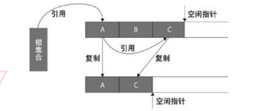

[toc]

# 一、Java基础

## 实例方法和静态方法有什么不一样？

静态方法只能访问静态成员，实例方法可以访问静态和实例成员。之所以不允许静态方法访问实例成员变量，
是因为实例成员变量是属于某个对象的，而静态方法在执行时，并不一定存在对象。
同样，因为实例方法可以访问实例成员变量，如果允许静态方法调用实例方法，将间接地允许它使用实例成员变量，
所以它也不能调用实例方法。
基于同样的道理，静态方法中也不能使用关键字this

--- 

## Java中的异常有哪几类？分别怎么使用？

Throwable是所有异常的根，java.lang.Throwable
> Error是错误，java.lang.Error

> Exception是异常，java.lang.Exception

Throwable包含了**错误**(Error)和**异常**(Exception两类)


Exception又包含了运行时异常(RuntimeException, 又叫非检查异常)和非运行时异常(又叫检查异常)

(1) Error是程序无法处理了, 如果OutOfMemoryError、OutOfMemoryError等等, 这些异常发生时, 
java虚拟机一般会终止线程 .

(2) 运行时异常都是RuntimeException类及其子类,如 NullPointerException、IndexOutOfBoundsException等, 
这些异常是不检查的异常, 是在程序运行的时候可能会发生的, 所以程序可以捕捉, 也可以不捕捉. 
这些错误一般是由程序的逻辑错误引起的, 程序应该从逻辑角度去尽量避免.

(3) 检查异常是运行时异常以外的异常, 也是Exception及其子类, 这些异常从程序的角度来说是必须经过捕捉检查处理的, 
否则不能通过编译. 如IOException、SQLException等


两者的区别

非检查异常表示无法让程序恢复运行的异常，导致这种异常的原因通常是由于执行了错误的操作。
一旦出现错误，建议让程序终止。

受检查异常表示程序可以处理的异常。如果抛出异常的方法本身不处理或者不能处理它，那么方法的调用者就必须去处理该异常，
否则调用会出错，连编译也无法通过。

对于运行异常，建议不要用 try...catch...捕获处理，应该在程序开发调试的过程中尽量的避免，
当然有一些必须要处理的，自己知道了那个部分会出现异常，而这种异常你要把它处理的你想要的结果，例如：空值处理。

java方法抛出的可查异常将依据调用栈、沿着方法调用的层次结构一直传递到具备处理能力的调用方法，
最高层次到main方法为止。如果异常传递到main方法，而main不具备处理能力，也没有通过throws声明抛出该异常，
将可能出现编译错误。

 **Java异常的实现原理**

异常的捕获原理
> 首先介绍下java的异常表（Exception table），异常表是JVM处理异常的关键点，
在java类中的每个方法中，会为所有的try-catch语句，生成一张异常表，存放在字节码的最后，
该表记录了该方法内每个异常发生的起止指令和处理指令。


异常的处理机制
> 检查栈顶异常对象类型（只检查是不是null，是否reference类型，
是否Throwable的子类一般在类验证阶段的数据流分析中做，或者索性不做靠编译器保证了，
编译时写到Code属性的StackMapTable中，在加载时仅做类型验证）

把异常对象的引用出栈
搜索异常表，找到匹配的异常handler
重置PC寄存器状态
清理操作栈
把异常对象的引用入栈
把异常方法的栈帧逐个出栈（这里的栈是VM栈）

<https://segmentfault.com/a/1190000009708014>


--- 
## 常用的集合类有哪些？比如List如何排序？

List Set Map 等会

对象数组或list排序及Collections排序原理

> 查看源码可以发现Collections.sort的实现是Arrays.sort，
而Arrays.sort的实现是ComparableTimSort.sort,然后才到sort方法和它的定义，
查看排序的主体部分也可以发现一个binarySort的方法，这是排序方法的实现，
是通过调用Object的CompareTo进行比较的。

binarySort方法中调用的是Comparable的compareTo方法，以此可知只要继承自Comparable，
并实现compareTo即可调用Collections.sort对自定义对象进行排序

以上两种排序性能的比较

binarySort需要进行nlg(n)次的比较，最坏情况下n^2次的移动

mergeSort是不断进行二分，二分到很小部分后进行插入排序。所以会比较nlg(n)次，移动nlg(n)次。
但它需要先复制一份源数据，所以会多占用一倍的空间

所以实际情况可以根据需要选择
<http://trinea.iteye.com/blog/1248517>


## ArrayList和LinkedList内部的实现大致是怎样的？他们之间的区别和各自适应的场景是什么？

ArrayList：内部使用数组的形式实现了存储，实现了RandomAccess接口，利用数组的下面进行元素的访问，
因此对元素的随机访问速度非常快。

因为是数组，所以ArrayList在初始化的时候，有初始大小10，插入新元素的时候，会判断是否需要扩容，
**扩容的步长是0.5倍原容量，扩容方式是利用数组的复制**，因此有一定的开销；

另外，ArrayList在进行元素插入的时候，需要移动插入位置之后的所有元素，位置越靠前，需要位移的元素越多，
开销越大，相反，插入位置越靠后的话，开销就越小了，如果在最后面进行插入，那就不需要进行位移；

LinkedList：内部使用双向链表的结构实现存储，LinkedList有一个内部类作为存放元素的单元，
里面有三个属性，用来存放元素本身以及前后2个单元的引用，另外LinkedList内部还有一个header属性，
用来标识起始位置，LinkedList的第一个单元和最后一个单元都会指向header，因此形成了一个双向的链表结构。

LinkedList的元素并不需要连续存放，但是每个存放元素的单元比元素本身需要更大的空间，
因为LinkedList对空间的要求比较大，但是扩容的时候不需要进行数组复制，因此没有这一环节的开销。

但是，是的，就是但是，也正因为这样，LinkedList的随机访问速度惨不忍睹，
因为无论你要访问哪一个元素，都需要从header起步正向或反向(根据元素的位置进行的优化)的进行元素遍历；

由此可见，ArrayList适合需要大量进行随机访问的场景；而LinkedList则适合需要在集合首尾进行增删的场景。

 1、ArrayList是实现了基于动态数组的数据结构,LinkedList基于链表的数据结构。
 
 2、由于数组的结构允许程序通过索引的方式来访问元素,因此,对于随机访问get和set,
 ArrayList优于LinkedList,ArrayList可以随机定位,而LinkedList要移动指针一步一步到节点处。 
 
 3、对于add和remove,LinkedList就比较占优势,只需要对指针进行修改即可,而ArrayList要移动数据来填补被删除的空间。
 
 
**其实ArrayList也有适合做增删的场景——那就是越靠近尾部的元素进行增删时，其实效率比LinkedList要高**
<https://www.jianshu.com/p/5b3aa50aa388>
指定位置从头部开始逐步后移，可以明显的看到，ArrayList消耗的时间越来越短成线形越来越短(符合前面提到的，
插入位置越靠后，开销越小)；

而LinkedList则是成正态分布，当位置处于集合中部的时候，最慢。究其原因，
因为LinkedList插入元素是需要先进行元素的查找定位，然后才能进行首尾链接的拆分、
重新指向新元素的，然而LinkedList的遍历有多低效，大家也是清楚明白的。

ArrayList ,LinkedList实现源码

--- 
## 内存溢出是怎么回事?
为什么会内存溢出？

因为装满了，装不下了...

好吧，其实提到内存溢出，不得不再提到另一个概念。

内存泄露。

内存泄露
什么是内存泄露，因为执行程序指令，引入数据，装载数据等等，都是需要内存空间的，内存空间也是有限的。
正常的程序执行，肯定是开辟内存空间，运行程序指令(输入、输出)，程序结束，释放空间。这样可以保证内存的往复利用。

但是，有时候程序设计有漏洞或是不够严谨的话，导致占用的内存没有得到释放，那么这一块内存就没办法再利用了，这就是内存泄露。

当不断出现内存泄露的时候，被占用的内存空间越来越多，最终到下一次需要使用内存空间的时候就会这样——空间不够了，溢出了。

Java的内存溢出
对于Java，内存溢出分三种情况。

1、OutOfMemoryError： PermGen space
Permanent Generation space 这个区域主要用来保存加来的Class的一些信息，在程序运行期间属于永久占用的，
Java的GC不会对他进行释放，所以如果启动的程序加载的信息比较大，超出了这个空间的大小，就会发生溢出错误；

解决的办法无非就是增加空间分配了——增加java虚拟机中的XX:PermSize和XX:MaxPermSize参数的大小，
其中XX:PermSize是初始永久保存区域大小，XX:MaxPermSize是最大永久保存区域大小。

2、OutOfMemoryError：Java heap space
heap 是Java内存中的堆区，主要用来存放对象，当对象太多超出了空间大小，GC又来不及释放的时候，就会发生溢出错误。

Java中对象的创建是可控的，但是对象的回收是由GC自动的，一般来说，当已存在对象没有引用(即不可达)的时候，
GC就会定时的来回收对象，释放空间。但是因为程序的设计问题，导致对象可达但是又没有用(即前文提到的内存泄露)，
当这种情况越来越多的时候，问题就来了。

针对这个问题，我们需要做一下两点：
1、检查程序，减少大量重复创建对象的死循环，减少内存泄露。
2、增加Java虚拟机中Xms（初始堆大小）和Xmx（最大堆大小）参数的大小。

3、StackOverFlowError
stack是Java内存中的栈空间，主要用来存放方法中的变量，参数等临时性的数据的，
发生溢出一般是因为分配空间太小，或是执行的方法递归层数太多创建了占用了太多栈帧导致溢出。

针对这个问题，除了修改配置参数-Xss参数增加线程栈大小之外，优化程序是尤其重要。

<https://www.jianshu.com/p/8c31ef19983a>


导致OutOfMemoryError异常的常见原因有以下几种：

内存中加载的数据量过于庞大，如一次从数据库取出过多数据；
集合类中有对对象的引用，使用完后未清空，使得JVM不能回收；
代码中存在死循环或循环产生过多重复的对象实体；
使用的第三方软件中的BUG；
启动参数内存值设定的过小

此错误常见的错误提示：

```
tomcat:java.lang.OutOfMemoryError: PermGen space
tomcat:java.lang.OutOfMemoryError: Java heap space
weblogic:Root cause of ServletException java.lang.OutOfMemoryError
resin:java.lang.OutOfMemoryError
java:java.lang.OutOfMemoryError
```
Java代码导致OutOfMemoryError错误的解决：
需要重点排查以下几点：

检查代码中是否有死循环或递归调用。
检查是否有大循环重复产生新对象实体。
检查对数据库查询中，是否有一次获得全部数据的查询。一般来说，如果一次取十万条记录到内存，
就可能引起内存溢出。这个问题比较隐蔽，在上线前，数据库中数据较少，不容易出问题，
上线后，数据库中数据多了，一次查询就有可能引起内存溢出。因此对于数据库查询尽量采用分页的方式查询。
检查List、MAP等集合对象是否有使用完后，未清除的问题。List、MAP等集合对象会始终存有对对象的引用，
使得这些对象不能被GC回收。


---

## 类加载器可分为两类
一是启动类加载器(Bootstrap ClassLoader)，是C++实现的，是JVM的一部分；

另一种是其它的类加载器，是Java实现的，独立于JVM，全部都继承自抽象类java.lang.ClassLoader


jdk自带了三种类加载器，分别是启动类加载器（Bootstrap ClassLoader），扩展类加载器（Extension ClassLoader），
应用程序类加载器（Application ClassLoader）。
后两种加载器是继承自抽象类java.lang.ClassLoader


## ClassLoader有什么用？

### 什么是类加载器?
简单说，类加载器就是根据指定全限定名称将class文件加载到JVM内存，转为Class对象。

如果站在JVM的角度来看，只存在两种类加载器:

- 启动类加载器（Bootstrap ClassLoader）
> 由C++语言实现（针对HotSpot）,负责将存放在<JAVA_HOME>\lib目录或-Xbootclasspath参数指定的路径中的类库加载到内存中。

- 其他类加载器：
>由Java语言实现，继承自抽象类ClassLoader。如：
扩展类加载器（Extension ClassLoader）：负责加载<JAVA_HOME>\lib\ext目录或java.ext.dirs系统变量指定的路径中的所有类库。
应用程序类加载器（Application ClassLoader）。负责加载用户类路径（classpath）上的指定类库，
我们可以直接使用这个类加载器。一般情况，如果我们没有自定义类加载器默认就是用这个加载器


ClassLoader用来加载class文件的。
系统内置的ClassLoader通过双亲委托来加载指定路径下的class和资源。
可以自定义ClassLoader一般覆盖findClass()方法
(如果自定义类加载器，就必须重写findClass方法！),
ContextClassLoader与线程相关，可以获取和设置，可以绕过双亲委托的机制。

<https://blog.csdn.net/briblue/article/details/54973413>


Bootstrap ClassLoader是由C/C++编写的，它本身是虚拟机的一部分，所以它并不是一个JAVA类，

也就是无法在java代码中获取它的引用，JVM启动时通过Bootstrap类加载器加载rt.jar等核心jar包中的class文件，
之前的int.class,String.class都是由它加载。

然后呢，我们前面已经分析了，
JVM初始化sun.misc.Launcher并创建Extension ClassLoader和AppClassLoader实例。
并将ExtClassLoader设置为AppClassLoader的父加载器。Bootstrap没有父加载器，
但是它却可以作用一个ClassLoader的父加载器。

比如ExtClassLoader。
这也可以解释之前通过ExtClassLoader的getParent方法获取为Null的现象。具体是什么原因，很快就知道答案了。

### 双亲委托 
  
一个类加载器查找class和resource时，是通过“委托模式”进行的，它首先判断这个class是不是已经加载成功，
如果没有的话它并不是自己进行查找，而是先通过父加载器，然后递归下去，直到Bootstrap ClassLoader，
如果Bootstrap classloader找到了，直接返回，如果没有找到，则一级一级返回，最后到达自身去查找这些对象。
这种机制就叫做双亲委托。 


### 为什么需要双亲委派模型？

为什么需要双亲委派模型呢？假设没有双亲委派模型，试想一个场景：

黑客自定义一个java.lang.String类，该String类具有系统的String类一样的功能，只是在某个函数稍作修改。
比如equals函数，这个函数经常使用，如果在这这个函数中，黑客加入一些“病毒代码”。
并且通过自定义类加载器加入到JVM中。此时，如果没有双亲委派模型，
那么JVM就可能误以为黑客自定义的java.lang.String类是系统的String类，导致“病毒代码”被执行。

而有了双亲委派模型，黑客自定义的java.lang.String类永远都不会被加载进内存。
因为首先是最顶端的类加载器加载系统的java.lang.String类，最终自定义的类加载器无法加载java.lang.String类。

或许你会想，我在自定义的类加载器里面强制加载自定义的java.lang.String类，
不去通过调用父加载器不就好了吗?确实，这样是可行。
但是，在JVM中，判断一个对象是否是某个类型时，如果该对象的实际类型与待比较的类型的类加载器不同，那么会返回false。

举个简单例子：

ClassLoader1、ClassLoader2都加载java.lang.String类，对应Class1、Class2对象。
那么Class1对象不属于ClassLoad2对象加载的java.lang.String类型。


<http://www.importnew.com/24036.html>
<https://liuzhengyang.github.io/2016/09/28/classloader/>


## 为什么不能自定义java.lang.String

Java类加载机制为代理模式，先交给其父加载器去加载，如果父加载器加载不了，则由自己加载。
我们自定义的类是由系统类加载器进行加载，而它的父加载器为扩展类加载器，扩展类加载器为引导类加载器。

我们定义的java.lang.String最先由引导加载器加载，而它负责加载Java核心库，
但java.lang.String正是系统中的类，已经被引导加载器记载过了，
所以不再加载自定义的java.lang.String。
但是系统的java.lang.String没有main方法，所以出现了上面的这个异常。

另外，自定义包不能以java.xxx.xxx开头，这是一种安全机制，，
如果以java开头，ClassLoader 类里面preDefineClass 方法判断如果是java. 开头系统直接抛异常。

---

## Java中equals和==的区别
java中的数据类型，可分为两类：

1.基本数据类型，也称原始数据类型。
byte,short,char,int,long,float,double,boolean 
 他们之间的比较，应用双等号（==）,**比较的是他们的值**。 
 
2.复合数据类型(类) 
  当他们用（ == ）进行比较的时候，比较的是他们在**内存中的存放地址**，所以，除非是同一个new出来的对象，
  他们的比较后的结果为true，否则比较后结果为false。 JAVA当中所有的类都是继承于Object这个基类的，
  在Object中的基类中定义了一个equals的方法，这个方法的初始行为是比较对象的内存地 址，
  但在一些类库当中这个方法被覆盖掉了，如String,Integer,Date在这些类当中equals有其自身的实现，
  而不再是比较类在堆内存中的存放地址了。
  
  对于复合数据类型之间进行equals比较，**在没有覆写equals方法的情况下，
  他们之间的比较还是基于他们在内存中的存放位置的地址值的**，
  因为Object的equals方法也是用双等号（ == ）进行比较的，所以比较后的结果跟双等号（==）的结果相同。


---

## hashCode方法的作用

Java采用了哈希表的原理。哈希算法也称为散列算法，是将数据依特定算法直接指定到一个地址上。
这样一来，当集合要添加新的元素时，先调用这个元素的hashCode方法，就一下子能定位到它应该放置的物理位置上。
如果这个位置上没有元素，它就可以 直接存储在这个位置上，不用再进行任何比较了；
如果这个位置上已经有元素了，就调用它的equals方法与新元素进行比较，相同的话就不存了；
不相同，也就是发生了Hash key相同导致冲突的情况,那么就在这个Hash key的地方产生一个链表,
将所有产生相同hashcode的对象放到这个单链表上去,串在一起。所以这里存在一个冲突解决的问题（很少出现）。
这样一来实际调用equals方法的次数就大大降低了，几乎只需要一两次。 
   
所以，Java对于equals方法和hashCode方法是这样规定的： 
   
1、如果两个对象相等，那么它们的hashCode值一定要相等； 
 
2、如果两个对象的hashCode相等，它们并不一定相等。


### 如何理解hashCode的作用: 

以java.lang.Object来理解,JVM每new一个Object,它都会将这个Object丢到一个Hash哈希表中去,
这样的话,下次做Object的比较或者取这个对象的时候,它会根据对象的hashcode再从Hash表中取这个对象。
这样做的目的是提高取对象的效率。具体过程是这样: 

1.new Object(),JVM根据这个对象的Hashcode值,放入到对应的Hash表对应的Key上,
如果不同的对象确产生了相同的hash值,也就是发生了Hash key相同导致冲突的情况,那么就在这个Hash key的地方产生一个链表,
将所有产生相同hashcode的对象放到这个单链表上去,串在一起。 

2.比较两个对象的时候,首先根据他们的hashcode去hash表中找他的对象,当两个对象的hashcode相同,
那么就是说他们这两个对象放在Hash表中的同一个key上,那么他们一定在这个key上的链表上。
那么此时就只能根据Object的equal方法来比较这个对象是否equal。当两个对象的hashcode不同的话，肯定他们不能equal. 
   
改写equals时总是要改写hashCode 
 
java.lang.Object中对hashCode的约定： 

   1. 在一个应用程序执行期间，如果一个对象的equals方法做比较所用到的信息没有被修改的话，
   则对该对象调用hashCode方法多次，它必须始终如一地返回同一个整数。 
   
   2. 如果两个对象根据equals(Object o)方法是相等的，则调用这两个对象中任一对象的hashCode方法必须产生相同的整数结果。 
   3. 如果两个对象根据equals(Object o)方法是不相等的，则调用这两个对象中任一个对象的hashCode方法，
   不要求产生不同的整数结果。但如果能不同，则可能提高散列表的性能。 


**可以把列表修改成 数组，这样查询速度就快**

---
## Object类中有哪些方法？列举3个以上


```
public final native Class<?> getClass()
public native int hashCode()
public boolean equals(Object obj)
protected native Object clone() throws CloneNotSupportedException
public String toString()
public final native void notify()
public final native void notifyAll()
public final native void wait(long timeout) throws InterruptedException
public final void wait(long timeout, int nanos) throws InterruptedException
public final void wait() throws InterruptedException
protected void finalize() throws Throwable { }
```

#### getClass方法
getClass方法是一个final方法，不允许子类重写，并且也是一个native方法。

返回当前运行时对象的Class对象，注意这里是运行时，比如以下代码中n是一个Number类型的实例，
但是java中数值默认是Integer类型，所以getClass方法返回的是java.lang.Integer：
```
"str".getClass() // class java.lang.String
"str".getClass == String.class // true
Number n = 0;
Class<? extends Number> c = n.getClass(); // class java.lang.Integer
```
#### hashCode方法
hashCode方法也是一个native方法。

该方法返回对象的哈希码，主要使用在哈希表中，比如JDK中的HashMap。

哈希码的通用约定如下：

在java程序执行过程中，在一个对象没有被改变的前提下，无论这个对象被调用多少次，
hashCode方法都会返回相同的整数值。对象的哈希码没有必要在不同的程序中保持相同的值。
如果2个对象使用equals方法进行比较并且相同的话，那么这2个对象的hashCode方法的值也必须相等。
如果根据equals方法，得到两个对象不相等，那么这2个对象的hashCode值不需要必须不相同。
但是，不相等的对象的hashCode值不同的话可以提高哈希表的性能。
通常情况下，不同的对象产生的哈希码是不同的。默认情况下，
对象的哈希码是通过将该对象的内部地址转换成一个整数来实现的。

String的hashCode方法实现如下， 计算方法是
```
s[0]31^(n-1) + s[1]31^(n-2) + … + s[n-1]，
```
其中s[0]表示字符串的第一个字符，n表示字符串长度：

```
public int hashCode() {
    int h = hash;
    if (h == 0 && value.length > 0) {
        char val[] = value;

        for (int i = 0; i < value.length; i++) {
            h = 31 * h + val[i];
        }
        hash = h;
    }
    return h;
}
``` 
比如”fo”的hashCode = 102 31^1 + 111 = 3273， 
“foo”的hashCode = 102 31^2 + 111 * 31^1 + 111 = 101574 (‘f’的ascii码为102, ‘o’的ascii码为111)

hashCode在哈希表HashMap中的应用：

// Student类，只重写了hashCode方法
```
public static class Student {

    private String name;
    private int age;

    public Student(String name, int age) {
        this.name = name;
        this.age = age;
    }

    @Override
    public int hashCode() {
        return name.hashCode();
    }
}

Map<Student, String> map = new HashMap<Student, String>();
Student stu1 = new Student("fo", 11);
Student stu2 = new Student("fo", 22);
map.put(stu1, "fo");
map.put(stu2, "fo");
```
上面这段代码中，map中有2个元素stu1和stu2。但是这2个元素是在哈希表中的同一个数组项中的位置，
也就是在同一串链表中。 但是为什么stu1和stu2的hashCode相同，但是两条元素都插到map里了，
这是因为map判断重复数据的条件是 两个对象的哈希码相同并且(两个对象是同一个对象或者两个对象相等[equals为true])。 
所以再给Student重写equals方法，并且只比较name的话，这样map就只有1个元素了。
```
@Override
public boolean equals(Object o) {
    if (this == o) return true;
    if (o == null || getClass() != o.getClass()) return false;
    Student student = (Student) o;
    return this.name.equals(student.name);
}
```
这个例子直接说明了hashCode中通用约定的第三点：

第三点：如果根据equals方法，得到两个对象不相等，
那么这2个对象的hashCode值不需要必须不相同。但是，不相等的对象的hashCode值不同的话可以提高哈希表的性能。 
–> 上面例子一开始没有重写equals方法，导致两个对象不相等，但是这两个对象的hashCode值一样，
所以导致这两个对象在同一串链表中，影响性能。

当然，还有第三种情况，那就是equals方法相等，但是hashCode的值不相等。

这种情况也就是违反了通用约定的第二点：

第二点：如果2个对象使用equals方法进行比较并且相同的话，那么这2个对象的hashCode方法的值也必须相等。
违反这一点产生的后果就是如果一个stu1实例是Student(“fo”, 11)，stu2实例是Student(“fo”, 11)，
那么这2个实例是相等的，但是他们的hashCode不一样，这样是导致哈希表中都会存入stu1实例和stu2实例，
但是实际情况下，stu1和stu2是重复数据，只允许存在一条数据在哈希表中。所以这一点是非常重点的，
再强调一下：如果2个对象的equals方法相等，那么他们的hashCode值也必须相等，
反之，如果2个对象hashCode值相等，但是equals不相等，这样会影响性能，所以还是建议2个方法都一起重写。

equals方法
比较两个对象是否相等。Object类的默认实现，即比较2个对象的内存地址是否相等：
```
public boolean equals(Object obj) {
    return (this == obj);
}
```
equals方法在非空对象引用上的特性：

reflexive，自反性。任何非空引用值x，对于x.equals(x)必须返回true
symmetric，对称性。任何非空引用值x和y，如果x.equals(y)为true，那么y.equals(x)也必须为true
transitive，传递性。任何非空引用值x、y和z，
如果x.equals(y)为true并且y.equals(z)为true，那么x.equals(z)也必定为true
consistent，一致性。任何非空引用值x和y，多次调用 x.equals(y) 始终返回 true 或始终返回 false，
前提是对象上 equals 比较中所用的信息没有被修改
对于任何非空引用值 x，x.equals(null) 都应返回 false
Object类的equals方法对于任何非空引用值x和y，当x和y引用同一个对象时，此方法才返回true。这个也就是我们常说的地址相等。

注意点：如果重写了equals方法，通常有必要重写hashCode方法，这点已经在hashCode方法中说明了。

#### clone方法
创建并返回当前对象的一份拷贝。一般情况下，对于任何对象 x，
达式 x.clone() != x 为true，x.clone().getClass() == x.getClass() 也为true。

Object类的clone方法是一个protected的native方法。

由于Object本身没有实现Cloneable接口，所以不重写clone方法并且进行调用的话会发生CloneNotSupportedException异常。

#### toString方法
Object对象的默认实现，即输出类的名字@实例的哈希码的16进制：
```java
public String toString() {
    return getClass().getName() + "@" + Integer.toHexString(hashCode());
}
```
toString方法的结果应该是一个简明但易于读懂的字符串。建议Object所有的子类都重写这个方法。

#### notify方法
notify方法是一个native方法，并且也是final的，不允许子类重写。

唤醒一个在此对象监视器上等待的线程(监视器相当于就是锁的概念)。如果所有的线程都在此对象上等待，
那么只会选择一个线程。选择是任意性的，并在对实现做出决定时发生。一个线程在对象监视器上等待可以调用wait方法。

直到当前线程放弃对象上的锁之后，被唤醒的线程才可以继续处理。
被唤醒的线程将以常规方式与在该对象上主动同步的其他所有线程进行竞争。
例如，唤醒的线程在作为锁定此对象的下一个线程方面没有可靠的特权或劣势。

notify方法只能被作为此对象监视器的所有者的线程来调用。一个线程要想成为对象监视器的所有者，可以使用以下3种方法：

执行对象的同步实例方法
使用synchronized内置锁
对于Class类型的对象，执行同步静态方法
一次只能有一个线程拥有对象的监视器。

如果当前线程不是此对象监视器的所有者的话会抛出IllegalMonitorStateException异常

注意点：

因为notify只能在拥有对象监视器的所有者线程中调用，否则会抛出IllegalMonitorStateException异常

#### notifyAll方法
跟notify一样，唯一的区别就是会唤醒在此对象监视器上等待的所有线程，而不是一个线程。

同样，如果当前线程不是对象监视器的所有者，那么调用notifyAll同样会发生IllegalMonitorStateException异常。

以下这段代码直接调用notify或者notifyAll方法会发生IllegalMonitorStateException异常，
这是因为调用这两个方法需要当前线程是对象监视器的所有者：

```
Factory factory = new Factory();
factory.notify();
factory.notifyAll();
wait(long timeout) throws InterruptedException方法
wait(long timeout)方法同样是一个native方法，并且也是final的，不允许子类重写。
```
wait方法会让当前线程等待直到另外一个线程调用对象的notify或notifyAll方法，
或者超过参数设置的timeout超时时间。

跟notify和notifyAll方法一样，当前线程必须是此对象的监视器所有者，
否则还是会发生IllegalMonitorStateException异常。

wait方法会让当前线程(我们先叫做线程T)将其自身放置在对象的等待集中，
并且放弃该对象上的所有同步要求。出于线程调度目的，线程T是不可用并处于休眠状态，直到发生以下四件事中的任意一件：

其他某个线程调用此对象的notify方法，并且线程T碰巧被任选为被唤醒的线程
其他某个线程调用此对象的notifyAll方法
其他某个线程调用Thread.interrupt方法中断线程T
时间到了参数设置的超时时间。如果timeout参数为0，则不会超时，会一直进行等待
所以可以理解wait方法相当于放弃了当前线程对对象监视器的所有者(也就是说释放了对象的锁)

之后，线程T会被等待集中被移除，并且重新进行线程调度。然后，该线程以常规方式与其他线程竞争，
以获得在该对象上同步的权利；一旦获得对该对象的控制权，该对象上的所有其同步声明都将被恢复到以前的状态，
这就是调用wait方法时的情况。然后，线程T从wait方法的调用中返回。所以，从wait方法返回时，
该对象和线程T的同步状态与调用wait方法时的情况完全相同。

在没有被通知、中断或超时的情况下，线程还可以唤醒一个所谓的虚假唤醒 (spurious wakeup)。
虽然这种情况在实践中很少发生，但是应用程序必须通过以下方式防止其发生，
即对应该导致该线程被提醒的条件进行测试，如果不满足该条件，则继续等待。
换句话说，等待应总是发生在循环中，如下面的示例：
```
synchronized (obj) {
    while (<condition does not hold>)
        obj.wait(timeout);
        ... // Perform action appropriate to condition
}
```
如果当前线程在等待之前或在等待时被任何线程中断，则会抛出InterruptedException异常。
在按上述形式恢复此对象的锁定状态时才会抛出此异常。
```
wait(long timeout, int nanos) throws InterruptedException方法
```
跟wait(long timeout)方法类似，多了一个nanos参数，这个参数表示额外时间（以毫微秒为单位，范围是 0-999999）。
 所以超时的时间还需要加上nanos毫秒。

需要注意的是 wait(0, 0)和wait(0)效果是一样的，即一直等待。

wait() throws InterruptedException方法
跟之前的2个wait方法一样，只不过该方法一直等待，没有超时时间这个概念。

以下这段代码直接调用wait方法会发生IllegalMonitorStateException异常，
这是因为调用wait方法需要当前线程是对象监视器的所有者：

Factory factory = new Factory();
factory.wait();
一般情况下，wait方法和notify方法会一起使用的，wait方法阻塞当前线程，notify方法唤醒当前线程，
一个使用wait和notify方法的生产者消费者例子代码如下：
```
public class WaitNotifyTest {

    public static void main(String[] args) {
        Factory factory = new Factory();
        new Thread(new Producer(factory, 5)).start();
        new Thread(new Producer(factory, 5)).start();
        new Thread(new Producer(factory, 20)).start();
        new Thread(new Producer(factory, 30)).start();
        new Thread(new Consumer(factory, 10)).start();
        new Thread(new Consumer(factory, 20)).start();
        new Thread(new Consumer(factory, 5)).start();
        new Thread(new Consumer(factory, 5)).start();
        new Thread(new Consumer(factory, 20)).start();
    }

}

class Factory {

    public static final Integer MAX_NUM = 50;

    private int currentNum = 0;

    public void consume(int num) throws InterruptedException {
        synchronized (this) {
            while(currentNum - num < 0) {
                this.wait();
            }
            currentNum -= num;
            System.out.println("consume " + num + ", left: " + currentNum);
            this.notifyAll();
        }
    }

    public void produce(int num) throws InterruptedException {
        synchronized (this) {
            while(currentNum + num > MAX_NUM) {
                this.wait();
            }
            currentNum += num;
            System.out.println("produce " + num + ", left: " + currentNum);
            this.notifyAll();
        }
    }

}

class Producer implements Runnable {
    private Factory factory;
    private int num;
    public Producer(Factory factory, int num) {
        this.factory = factory;
        this.num = num;
    }
    @Override
    public void run() {
        try {
            factory.produce(num);
        } catch (InterruptedException e) {
            e.printStackTrace();
        }
    }
}


class Consumer implements Runnable {
    private Factory factory;
    private int num;
    public Consumer(Factory factory, int num) {
        this.factory = factory;
        this.num = num;
    }
    @Override
    public void run() {
        try {
            factory.consume(num);
        } catch (InterruptedException e) {
            e.printStackTrace();
        }
    }
}
```

注意的是Factory类的produce和consume方法都将Factory实例锁住了，
锁住之后线程就成为了对象监视器的所有者，然后才能调用wait和notify方法。

输出：
```
produce 5, left: 5
produce 20, left: 25
produce 5, left: 30
consume 10, left: 20
produce 30, left: 50
consume 20, left: 30
consume 5, left: 25
consume 5, left: 20
consume 20, left: 0
```

#### finalize方法
finalize方法是一个protected方法，Object类的默认实现是不进行任何操作。

该方法的作用是实例被垃圾回收器回收的时候触发的操作，就好比 “死前的最后一波挣扎”。

直接写个弱引用例子：
```
Car car = new Car(9999, "black");
WeakReference<Car> carWeakReference = new WeakReference<Car>(car);

int i = 0;
while(true) {
    if(carWeakReference.get() != null) {
        i++;
        System.out.println("Object is alive for "+i+" loops - "+carWeakReference);
    } else {
        System.out.println("Object has been collected.");
        break;
    }
}

class Car {
    private double price;
    private String colour;

    public Car(double price, String colour){
        this.price = price;
        this.colour = colour;
    }

    // get set method

    @Override
    protected void finalize() throws Throwable {
        System.out.println("i will be destroyed");
    }
}
```
输出：

```
....
Object is alive for 26417 loops - java.lang.ref.WeakReference@7c2f1622
Object is alive for 26418 loops - java.lang.ref.WeakReference@7c2f1622
Object is alive for 26419 loops - java.lang.ref.WeakReference@7c2f1622
Object is alive for 26420 loops - java.lang.ref.WeakReference@7c2f1622
Object is alive for 26421 loops - java.lang.ref.WeakReference@7c2f1622
Object is alive for 26422 loops - java.lang.ref.WeakReference@7c2f1622
Object has been collected.
i will be destroyed
```
<https://fangjian0423.github.io/2016/03/12/java-Object-method/>

--- 

## Java中的异常有哪几类？分别怎么使用？

Throwable是所有异常的根，java.lang.Throwable

Error是错误，java.lang.Error

Exception是异常，java.lang.Exception

Throwable包含了错误(Error)和异常(Exception两类)

Exception又包含了运行时异常(RuntimeException, 又叫非检查异常)和非运行时异常(又叫检查异常)

(1) Error是程序无法处理了, 如果OutOfMemoryError、OutOfMemoryError等等, 
这些异常发生时, java虚拟机一般会终止线程 .

(2) 运行时异常都是RuntimeException类及其子类,如 NullPointerException、IndexOutOfBoundsException等, 
这些异常是不检查的异常, 是在程序运行的时候可能会发生的, 所以程序可以捕捉, 也可以不捕捉.

这些错误一般是由程序的逻辑错误引起的, 程序应该从逻辑角度去尽量避免.

(3) 检查异常是运行时异常以外的异常, 也是Exception及其子类, 
这些异常从程序的角度来说是必须经过捕捉检查处理的, 否则不能通过编译. 如IOException、SQLException等

 

两者的区别

非检查异常表示无法让程序恢复运行的异常，导致这种异常的原因通常是由于执行了错误的操作。
一旦出现错误，建议让程序终止。
受检查异常表示程序可以处理的异常。如果抛出异常的方法本身不处理或者不能处理它，
那么方法的调用者就必须去处理该异常，否则调用会出错，连编译也无法通过。

对于运行异常，建议不要用 try...catch...捕获处理，应该在程序开发调试的过程中尽量的避免，
当然有一些必须要处理的，自己知道了那个部分会出现异常，而这种异常你要把它处理的你想要的结果，例如：空值处理。

java方法抛出的可查异常将依据调用栈、沿着方法调用的层次结构一直传递到具备处理能力的调用方法，
最高层次到main方法为止。如果异常传递到main方法，而main不具备处理能力，
也没有通过throws声明抛出该异常，将可能出现编译错误。

Java异常的实现原理

异常的捕获原理

首先介绍下java的异常表（Exception table），异常表是JVM处理异常的关键点，
在java类中的每个方法中，会为所有的try-catch语句，生成一张异常表，存放在字节码的最后，
该表记录了该方法内每个异常发生的起止指令和处理指令。

异常的处理机制

检查栈顶异常对象类型（只检查是不是null，是否referance类型，
是否Throwable的子类一般在类验证阶段的数据流分析中做，或者索性不做靠编译器保证了，
编译时写到Code属性的StackMapTable中，在加载时仅做类型验证）

把异常对象的引用出栈 搜索异常表，找到匹配的异常handler 
重置PC寄存器状态 清理操作栈 把异常对象的引用入栈 把异常方法的栈帧逐个出栈（这里的栈是VM栈）


<https://segmentfault.com/a/1190000009708014>

--- 

## 异常影响性能吗？

会影响性能(如果你对系统相应时间有很高要求，当然影响).

处理异常的几个步骤里，对性能的耗费从大到小依次为：
输出到日志、获取异常堆栈、创建并 catch 异常。


<https://www.jianshu.com/p/6bfa54c50401>


---

## NIO是什么？适用于何种场景


IO      |    NIO
---|---
面向流   |    面向缓冲
阻塞IO   |    非阻塞IO
无      |    选择器


NIO（Non-blocking I/O，在Java领域，也称为New I/O），是一种同步非阻塞的I/O模型，
也是I/O多路复用的基础，已经被越来越多地应用到大型应用服务器，成为解决高并发与大量连接、I/O处理问题的有效方式。

那么NIO的本质是什么样的呢？它是怎样与事件模型结合来解放线程、提高系统吞吐的呢？

本文会从传统的阻塞I/O和线程池模型面临的问题讲起，然后对比几种常见I/O模型，
一步步分析NIO怎么利用事件模型处理I/O，解决线程池瓶颈处理海量连接，
包括利用面向事件的方式编写服务端/客户端程序。最后延展到一些高级主题，
如Reactor与Proactor模型的对比、Selector的唤醒、Buffer的选择等。


java NIO:从一个通道里读数据，直到所有的数据都读到缓冲区里.

3) 用来处理数据的线程数

NIO可让您只使用一个（或几个）单线程管理多个通道（网络连接或文件），
但付出的代价是解析数据可能会比从一个阻塞流中读取数据更复杂。

如果需要管理同时打开的成千上万个连接，这些连接每次只是发送少量的数据，
例如聊天服务器，实现NIO的服务器可能是一个优势。同样，如果你需要维持许多打开的连接到其他计算机上，
如P2P网络中，使用一个单独的线程来管理你所有出站连接，可能是一个优势。一个线程多个连接的设计方案如下图所示：


Java NIO: 单线程管理多个连接

如果你有少量的连接使用非常高的带宽，一次发送大量的数据，也许典型的IO服务器实现可能非常契合。
下图说明了一个典型的IO服务器设计：


Java IO: 一个典型的IO服务器设计- 一个连接通过一个线程处理
无论您选择IO或NIO工具箱，可能会影响您应用程序设计的以下几个方面：

> 对NIO或IO类的API调用。

> 数据处理。

> 用来处理数据的线程数。


总结一下到底NIO给我们带来了些什么：

事件驱动模型
避免多线程
单线程处理多任务
非阻塞I/O，I/O读写不再阻塞，而是返回0
基于block的传输，通常比基于流的传输更高效
更高级的IO函数，zero-copy
IO多路复用大大提高了Java网络应用的可伸缩性和实用性


<http://ifeve.com/java-nio-vs-io/>

<https://tech.meituan.com/nio.html>

--- 
## HashMap数据结构、扩展策略，Hash冲突攻击如何防范，如何实现线程安全的HashMap？

```
结构: 数组加链表(java8 中链表长度超过8 时, 会改成平衡树实现)
扩展: resize , 当超过loadfactor 因子时,默认 0.75 , 触发扩展,rehash , 将旧的元素迁移到新的
hash collision attack : 修改hash 非随机算法, 限制post 参数个数,大小 , 防火前检测异常请求
使用 ConcurrentHashMap : CHM 实现采用了 segment 锁 , 8 之后采用的CAS 技术
哈希冲突解决方法: 链表法(java 当前实现),建立公共溢出区 , 开发定址法。


```

<http://liuxiang.github.io/2017/07/19/%E9%9D%A2%E8%AF%95%E7%AC%AC%E4%B8%80%E9%A2%98%20-%20HashMap/>


 ### HashMap概述：
 
HashMap是基于哈希表的Map接口的非同步实现。此实现提供所有可选的映射操作，
并允许使用null值和null键。此类不保证映射的顺序，特别是它不保证该顺序恒久不变。
HashMap允许使用null作为key或者value，并且HashMap不是线程安全的，
除了这两点外，HashMap与HashTable大致相同。


#### HashMap的数据结构：

在java编程语言中，最基本的结构就是两种，一个是数组，另外一个是模拟指针（引用），
所有的数据结构都可以用这两个基本结构来构造的，HashMap也不例外。
HashMap实际上是一个“链表散列”的数据结构，**即数组和链表的结合体**。


从上图中可以看出，HashMap底层就是一个数组结构，数组中的每一项又是一个链表。
当新建一个HashMap的时候，就会初始化一个数组。

   ```
   ```
   
 ####  扩展策略
 
HashMap的resize（rehash）：

当HashMap中的元素越来越多的时候，hash冲突的几率也就越来越高，因为数组的长度是固定的。
所以为了提高查询的效率，就要对HashMap的数组进行扩容，数组扩容这个操作也会出现在ArrayList中，
这是一个常用的操作，而在HashMap数组扩容之后，最消耗性能的点就出现了：
原数组中的数据必须重新计算其在新数组中的位置，并放进去，这就是resize。

那么HashMap什么时候进行扩容呢？当HashMap中的元素个数超过数组大小 * loadFactor时，
就会进行数组扩容，loadFactor的默认值为0.75，这是一个折中的取值。也就是说，默认情况下，
数组大小为16，那么当HashMap中元素个数超过16 * 0.75=12的时候，就把数组的大小扩展为 2 * 16=32，
即扩大一倍，然后重新计算每个元素在数组中的位置，而这是一个非常消耗性能的操作，
所以如果我们已经预知HashMap中元素的个数，那么预设元素的个数能够有效的提高HashMap的性能。


负载因子衡量的是一个散列表的空间的使用程度，负载因子越大表示散列表的装填程度越高，反之愈小。
对于使用链表法的散列表来说，查找一个元素的平均时间是O(1+a)，因此如果负载因子越大，对空间的利用更充分，
然而后果是查找效率的降低；如果负载因子太小，那么散列表的数据将过于稀疏，对空间造成严重浪费。

  
### 并发 CurrentHashMap  

线程不安全的HashMap
    因为多线程环境下，使用HashMap进行put操作会引起死循环，导致CPU利用率接近100%，所以在并发情况下不能使用HashMap。
 
效率低下的HashTable容器

HashTable容器使用synchronized来保证线程安全，
但在线程竞争激烈的情况下HashTable的效率非常低下。因为当一个线程访问HashTable的同步方法时，
其他线程访问HashTable的同步方法时，可能会进入阻塞或轮询状态。如线程1使用put进行添加元素，
线程2不但不能使用put方法添加元素，并且也不能使用get方法来获取元素，所以竞争越激烈效率越低。


锁分段技术

HashTable容器在竞争激烈的并发环境下表现出效率低下的原因，
是因为所有访问HashTable的线程都必须竞争同一把锁，那假如容器里有多把锁，
每一把锁用于锁容器其中一部分数据，那么当多线程访问容器里不同数据段的数据时，
线程间就不会存在锁竞争，从而可以有效的提高并发访问效率，这就是ConcurrentHashMap所使用的锁分段技术，
首先将数据分成一段一段的存储，然后给每一段数据配一把锁，当一个线程占用锁访问其中一个段数据的时候，
其他段的数据也能被其他线程访问。有些方法需要跨段，比如size()和containsValue()，
它们可能需要锁定整个表而而不仅仅是某个段，这需要按顺序锁定所有段，操作完毕后，又按顺序释放所有段的锁。
这里“按顺序”是很重要的，否则极有可能出现死锁，在ConcurrentHashMap内部，段数组是final的，
并且其成员变量实际上也是final的，但是，仅仅是将数组声明为final的并不保证数组成员也是final的，
这需要实现上的保证。这可以确保不会出现死锁，因为获得锁的顺序是固定的。

ConcurrentHashMap是由Segment数组结构和HashEntry数组结构组成。
Segment是一种可重入锁ReentrantLock，在ConcurrentHashMap里扮演锁的角色，
HashEntry则用于存储键值对数据。一个ConcurrentHashMap里包含一个Segment数组，S
egment的结构和HashMap类似，是一种数组和链表结构， 一个Segment里包含一个HashEntry数组，
每个HashEntry是一个链表结构的元素， 每个Segment守护者一个HashEntry数组里的元素,
当对HashEntry数组的数据进行修改时，必须首先获得它对应的Segment锁。
 
 
 
 从图中可以看出，HashTable的锁加在整个Hash表上，而ConcurrentHashMap将锁加在segment上（每个段上），
 这样我们在对segment1操作的时候，同时也可以对segment2中的数据操作，这样效率就会高很多。
 
 <https://blog.csdn.net/dingji_ping/article/details/51005799>
 <https://www.cnblogs.com/ITtangtang/p/3948786.html>
 
 
 ---
 
 ## JVM内存结构，GC算法，CMS、G1的原理
 
1.方法区（Method Area）
2.堆区（Heap）
3.虚拟机栈（VM Stack）
4.本地方法栈（Native Method Stack）
5.程序计数器（Program Counter Register）

 #### Java中的内存分配：

Java程序在运行时，需要在内存中的分配空间。为了提高运算效率，就对数据进行了不同空间的划分，
因为每一片区域都有特定的处理数据方式和内存管理方式。

具体划分为如下5个内存空间：（非常重要）

栈：存放局部变量 
 
堆：存放所有new出来的东西

方法区：被虚拟机加载的类信息、常量、静态常量等。

程序计数器(和系统相关)

本地方法栈
 
 
 
 其中，方法区和堆所有线程共享。
 
##### 2.1 方法区（Method Area）
方法区存放了要加载的类的信息（如类名、修饰符等）、静态变量、构造函数、final定义的常量、类中的字段和方法等信息。
方法区是全局共享的，在一定条件下也会被GC。当方法区超过它允许的大小时，就会抛出OutOfMemory：PermGen Space异常。

在Hotspot虚拟机中，这块区域对应持久代（Permanent Generation），
一般来说，方法区上执行GC的情况很少，因此方法区被称为持久代的原因之一，
但这并不代表方法区上完全没有GC，其上的GC主要针对常量池的回收和已加载类的卸载。
在方法区上进行GC，条件相当苛刻而且困难。

运行时常量池（Runtime Constant Pool）是方法区的一部分，用于存储编译器生成的常量和引用。
一般来说，常量的分配在编译时就能确定，但也不全是，也可以存储在运行时期产生的常量。
比如String类的intern（）方法，作用是String类维护了一个常量池，
如果调用的字符"hello"已经在常量池中，则直接返回常量池中的地址，否则新建一个常量加入池中，并返回地址。

##### 2.2 堆区（Heap）
堆区是GC最频繁的，也是理解GC机制最重要的区域。堆区由所有线程共享，在虚拟机启动时创建。
堆区主要用于存放对象实例及数组，所有new出来的对象都存储在该区域。

##### 2.3 虚拟机栈（VM Stack）
虚拟机栈占用的是操作系统内存，每个线程对应一个虚拟机栈，它是线程私有的，
生命周期和线程一样，每个方法被执行时产生一个栈帧（Stack Frame），
栈帧用于存储局部变量表、动态链接、操作数和方法出口等信息，当方法被调用时，栈帧入栈，当方法调用结束时，栈帧出栈。

局部变量表中存储着方法相关的局部变量，包括各种基本数据类型及对象的引用地址等，
因此他有个特点：内存空间可以在编译期间就确定，运行时不再改变。

虚拟机栈定义了两种异常类型：StackOverFlowError(栈溢出)和OutOfMemoryError（内存溢出）。
如果线程调用的栈深度大于虚拟机允许的最大深度，则抛出StackOverFlowError；
不过大多数虚拟机都允许动态扩展虚拟机栈的大小，所以线程可以一直申请栈，直到内存不足时，抛出OutOfMemoryError。

##### 2.4 本地方法栈（Native Method Stack）
本地方法栈用于支持native方法的执行，存储了每个native方法的执行状态。
本地方法栈和虚拟机栈他们的运行机制一致，唯一的区别是，虚拟机栈执行Java方法，
本地方法栈执行native方法。在很多虚拟机中（如Sun的JDK默认的HotSpot虚拟机），会将虚拟机栈和本地方法栈一起使用。

##### 2.5 程序计数器（Program Counter Register）
程序计数器是一个很小的内存区域，不在RAM上，而是直接划分在CPU上，程序猿无法操作它，
它的作用是：JVM在解释字节码（.class）文件时，存储当前线程执行的字节码行号，只是一种概念模型，
各种JVM所采用的方式不一样。字节码解释器工作时，就是通过改变程序计数器的值来取下一条要执行的指令，
分支、循环、跳转等基础功能都是依赖此技术区完成的。

每个程序计数器只能记录一个线程的行号，因此它是线程私有的。

如果程序当前正在执行的是一个java方法，则程序计数器记录的是正在执行的虚拟机字节码指令地址，
如果执行的是native方法，则计数器的值为空，此内存区是唯一不会抛出OutOfMemoryError的区域。

 ### 内存分区
> 内存主要被分为三块：新生代（Youn Generation）、旧生代（Old Generation）、
持久代（Permanent Generation）（java8 之后 元数据）


新生代（Youn Generation）：大致分为Eden区和Survivor区，Survivor区又分为大小相同的两部分：
FromSpace和ToSpace。新建的对象都是从新生代分配内存，Eden区不足的时候，会把存活的对象转移到Survivor区。
当新生代进行垃圾回收时会出发Minor GC（也称作Youn GC）。

旧生代（Old Generation）：旧生代用于存放新生代多次回收依然存活的对象，如缓存对象。
当旧生代满了的时候就需要对旧生代进行回收，旧生代的垃圾回收称作Major GC（也称作Full GC）。

持久代（Permanent Generation）：在Sun 的JVM中就是方法区的意思，尽管大多数JVM没有这一代


### 三 GC算法
常见的GC算法：复制、标记-清除和标记-压缩
       

复制：复制算法采用的方式为从根集合进行扫描，将存活的对象移动到一块空闲的区域，如图所示：
 
 
当存活的对象较少时，复制算法会比较高效（新生代的Eden区就是采用这种算法），
其带来的成本是需要一块额外的空闲空间和对象的移动。

标记-清除：该算法采用的方式是从跟集合开始扫描，对存活的对象进行标记，标记完毕后，
再扫描整个空间中未被标记的对象，并进行清除。标记和清除的过程如下：
 
 
 
上图中蓝色部分是有被引用的对象，褐色部分是没有被引用的对象。在Marking阶段，需要进行全盘扫描，这个过程是比较耗时的。


 
清除阶段清理的是没有被引用的对象，存活的对象被保留。

标记-清除动作不需要移动对象，且仅对不存活的对象进行清理，在空间中存活对象较多的时候，效率较高，
但由于只是清除，没有重新整理，因此会造成内存碎片。

标记-压缩：该算法与标记-清除算法类似，都是先对存活的对象进行标记，
但是在清除后会把活的对象向左端空闲空间移动，然后再更新其引用对象的指针，如下图所示
 
 
由于进行了移动规整动作，该算法避免了标记-清除的碎片问题，但由于需要进行移动，
因此成本也增加了。（该算法适用于旧生代）


#### 分代收集算法
GC分代的基本假设：绝大部分对象的生命周期都非常短暂，存活时间短。

“分代收集”（Generational Collection）算法，把Java堆分为新生代和老年代，
这样就可以根据各个年代的特点采用最适当的收集算法。在新生代中，每次垃圾收集时都发现有大批对象死去，
只有少量存活，那就选用复制算法，只需要付出少量存活对象的复制成本就可以完成收集。而老年代中因为对象存活率高、
没有额外空间对它进行分配担保，就必须使用“标记-清理”或“标记-整理”算法来进行回收。


> 如果说收集算法是内存回收的方法论，垃圾收集器就是内存回收的具体实现

#### 四、垃圾收集器
在JVM中，GC是由垃圾回收器来执行，所以，在实际应用场景中，我们需要选择合适的垃圾收集器，下面我们介绍一下垃圾收集器。

 
4.1 串行收集器（Serial GC）
Serial GC是最古老也是最基本的收集器，但是现在依然广泛使用，JAVA SE5和JAVA SE6中客户端虚拟机采用的默认配置。
比较适合于只有一个处理器的系统。在串行处理器中minor和major GC过程都是用一个线程进行回收的。
它的最大特点是在进行垃圾回收时，需要对所有正在执行的线程暂停（stop the world），
对于有些应用是难以接受的，但是如果应用的实时性要求不是那么高，只要停顿的时间控制在N毫秒之内，
大多数应用还是可以接受的，而且事实上，它并没有让我们失望，几十毫秒的停顿，对于我们客户机是完全可以接受的，
该收集器适用于单CPU、新生代空间较小且对暂停时间要求不是特别高的应用上，是client级别的默认GC方式。

4.2 ParNew GC
基本和Serial GC一样，但本质区别是加入了多线程机制，提高了效率，这样它就可以被用于服务端上（server），
同时它可以与CMS GC配合，所以，更加有理由将他用于server端。

4.3 Parallel Scavenge GC
在整个扫描和复制过程采用多线程的方式进行，适用于多CPU、对暂停时间要求较短的应用，是server级别的默认GC方式。

4.4 CMS (Concurrent Mark Sweep)收集器
该收集器的目标是解决Serial GC停顿的问题，以达到最短回收时间。常见的B/S架构的应用就适合这种收集器，
因为其高并发、高响应的特点，CMS是基于标记-清楚算法实现的。

CMS收集器的优点：并发收集、低停顿，但远没有达到完美；

CMS收集器的缺点：

a.CMS收集器对CPU资源非常敏感，在并发阶段虽然不会导致用户停顿，但是会占用CPU资源而导致应用程序变慢，总吞吐量下降。\
b.CMS收集器无法处理浮动垃圾，可能出现“Concurrent Mode Failure”，失败而导致另一次的Full GC。\
c.CMS收集器是基于标记-清除算法的实现，因此也会产生碎片。

4.5 G1收集器
相比CMS收集器有不少改进，首先，基于标记-压缩算法，不会产生内存碎片，其次可以比较精确的控制停顿。

4.6 Serial Old收集器
Serial Old是Serial收集器的老年代版本，它同样使用一个单线程执行收集，使用“标记-整理”算法。主要使用在Client模式下的虚拟机。

4.7 Parallel Old收集器
Parallel Old是Parallel Scavenge收集器的老年代版本，使用多线程和“标记-整理”算法。

4.8 RTSJ垃圾收集器
RTSJ垃圾收集器，用于Java实时编程。

### 五、总结
深入理解JVM的内存模型和GC机制有助于帮助我们编写高性能代码和提供代码优化的思路与方向。


<https://www.jianshu.com/p/e53dd878e325>


> TODO 需要去看
 
<https://liuzhengyang.github.io/2017/06/07/garbage-first-collector/>


<http://gityuan.com/2016/01/09/java-memory/>

<http://www.importnew.com/23752.x>
<https://my.oschina.net/hosee/blog/644618>

<https://tech.meituan.com/g1.html>

--- 

## NIO模型，select、poll、epoll的区别，多路复用的原理

Java NIO的核心类库多路复用器Selector就是基于epoll的多路复用技术实现的。

Java NIO 由以下几个核心部分组成：
- 1、Buffer
- 2、Channel
- 3、Selector

> 描述符(FD)

#### select poll epoll 区别

阻塞？

什么是程序的阻塞呢？想象这种情形，比如你等快递，但快递一直没来，你会怎么做？有两种方式：

快递没来，我可以先去睡觉，然后快递来了给我打电话叫我去取就行了。
快递没来，我就不停的给快递打电话说：擦，怎么还没来，给老子快点，直到快递来。
很显然，你无法忍受第二种方式，不仅耽搁自己的时间，也会让快递很想打你。
而在计算机世界，这两种情形就对应阻塞和非阻塞忙轮询。

非阻塞忙轮询：数据没来，进程就不停的去检测数据，直到数据来。
阻塞：数据没来，啥都不做，直到数据来了，才进行下一步的处理。
先说说阻塞，因为一个线程只能处理一个套接字的I/O事件，如果想同时处理多个，可以利用非阻塞忙轮询的方式,伪代码如下：
```

while true  
{  
    for i in stream[]  
    {  
        if i has data  
        read until unavailable  
    }  
}  

```

我们只要把所有流从头到尾查询一遍，就可以处理多个流了，但这样做很不好，
因为如果所有的流都没有I/O事件,**白白浪费CPU时间片**。正如有一位科学家所说，
计算机所有的问题都可以增加一个中间层来解决，同样，为了避免这里cpu的空转，
我们不让这个线程亲自去检查流中是否有事件，而是引进了一个代理(一开始是select,后来是poll)，
这个代理很牛，它可以同时观察许多流的I/O事件，如果没有事件，代理就阻塞，线程就不会挨个挨个去轮询了，伪代码如下：

```

while true  
{  
    select(streams[]) //这一步死在这里，知道有一个流有I/O事件时，才往下执行  
    for i in streams[]  
    {  
        if i has data  
        read until unavailable  
    }  
}  

```

我们从select那里仅仅知道了，有I/O事件发生了，却并不知道是哪那几个流（可能有一个，多个，甚至全部），
我们只能无差别轮询所有流，找出能读出数据，或者写入数据的流，对他们进行操作。
**所以select具有O(n)的无差别轮询复杂度**，同时处理的流越多，无差别轮询时间就越长。


epoll可以理解为event poll，不同于忙轮询和无差别轮询，
epoll会把哪个流发生了怎样的I/O事件通知我们。所以我们说epoll实际上是事件驱动（每个事件关联上fd）的，
此时我们对这些流的操作都是有意义的。（复杂度降低到了O(1)）伪代码如下：

```
while true  
{  
    active_stream[] = epoll_wait(epollfd)  
    for i in active_stream[]  
    {  
        read or write till  
    }  
}  
```

select和epoll最大的区别就是：select只是告诉你一定数目的流有事件了，至于哪个流有事件，
还得你一个一个地去轮询，而epoll会把发生的事件告诉你，通过发生的事件，就自然而然定位到哪个流了。
不能不说epoll跟select相比，是质的飞跃，我觉得这也是一种牺牲空间，换取时间的思想，毕竟现在硬件越来越便宜了。


相比select、poll系统调用，epoll有如下优点：

1.支持一个进程打开的socket描述符(FD)不受限制，仅受限于操作系统的最大文件句柄数。 
select最大的缺陷是单个进程所打开的FD是有一定限制的，它由FD_SETSIZE设置，默认值是1024。
可以选择修改这个宏后重新编译内核，但这对带来网络效率的下降。
也可以选择多进程的方案（传统的Apache方案）来解决这个问题，但进程的创建成本，以及进程间的数据交换需要进行考虑。 
epoll具体支持的FD上线值可以通过cat /proc/sys/fs/file-max查看，这个值和系统的内存关系比较大。

2.I/O效率不会随着FD数目的增加而线性下降。 
当拥有一个很大的socket集合时，由于网络延时或者链路空闲，任一时刻只有少部分的socket是“活跃”的，
但select/poll每次调用都会线性扫描全部的集合，导致效率线性下降。
而epoll只会对活跃的socket进行操作-只有活跃的socket才会主动调用callback函数，
所以只需要遍历那些被内核I/O事件异步唤醒而加入Ready队列的FD集合。

3.使用mmap加速内核与用户空间的消息传递 
epoll通过内核和用户空间mmap同一块内存来实现的。
mmap()系统调用允许存放在块设备上的文件或信息的一部分映射到进程的部分地址空间


#### poll epoll select 区别及其比较  另外一篇

<https://www.jianshu.com/p/dfd940e7fca2>

IO多路复用是指内核一旦发现进程指定的一个或者多个IO条件准备读取，它就通知该进程。

IO多路复用适用如下场合：
```
当客户处理多个描述符时（一般是交互式输入和网络套接口），必须使用I/O复用。

当一个客户同时处理多个套接口时，而这种情况是可能的，但很少出现。

如果一个TCP服务器既要处理监听套接口，又要处理已连接套接口，一般也要用到I/O复用。

如果一个服务器即要处理TCP，又要处理UDP，一般要使用I/O复用。

如果一个服务器要处理多个服务或多个协议，一般要使用I/O复用。

与多进程和多线程技术相比，I/O多路复用技术的最大优势是系统开销小，系统不必创建进程/线程，
也不必维护这些进程/线程，从而大大减小了系统的开销。
```
与多进程和多线程技术相比，I/O多路复用技术的最大优势是系统开销小，

系统不必创建进程/线程，也不必维护这些进程/线程，从而大大减小了系统的开销。

目前支持I/O多路复用的系统调用有 select，pselect，poll，epoll，I/O多路复用就是通过一种机制，
一个进程可以监视多个描述符，一旦某个描述符就绪（一般是读就绪或者写就绪），
能够通知程序进行相应的读写操作。

但select，pselect，poll，epoll本质上都是同步I/O，
因为他们都需要在读写事件就绪后自己负责进行读写，也就是说这个读写过程是阻塞的，
而异步I/O则无需自己负责进行读写，异步I/O的实现会负责把数据从内核拷贝到用户空间

---


##### select
基本原理：
```
select 函数监视的文件描述符分3类，分别是writefds、readfds、和exceptfds。
调用后select函数会阻塞，直到有描述符就绪（有数据 可读、可写、或者有except），
或者超时（timeout指定等待时间，如果立即返回设为null即可），函数返回。
当select函数返回后，可以通过遍历fdset，来找到就绪的描述符.

```
缺点：
> 1、 select最大的缺陷就是单个进程所打开的FD是有一定限制的，它由FD_SETSIZE设置，默认值是1024。

> 2、对socket进行扫描时是线性扫描，即采用轮询的方法，效率较低。

```
当套接字比较多的时候，每次select()都要通过遍历FD_SETSIZE个Socket来完成调度，
不管哪个Socket是活跃的，都遍历一遍。这会浪费很多CPU时间。
如果能给套接字注册某个回调函数，当他们活跃时，
自动完成相关操作，那就避免了轮询，这正是epoll与kqueue做的。

```
> 3、需要维护一个用来存放大量fd的数据结构，这样会使得用户空间和内核空间在传递该结构时复制开销大。

```
”当select函数返回后，可以通过遍历fdset，来找到就绪的描述符“，
你确定这句话是对的？select什么情况下回返回？
我的理解是，select调用后，线程阻塞，此时select函数遍历FD_set，如果有就绪的fd就会等待内核拷贝数据到用户空间。
如果没有就绪的fd，select就会立刻返回给用户线程一个error，这就是不阻塞的地方。
如果按你说的select都返回了，那是谁在遍历fd_set?
欢迎指正


 select有timeout时间，如果timeout时间内没有描述符准备好，返回0；如果将timeout设为NULL，
 select会一直阻塞，直到有描述符就绪，返回就绪描述符的个数；
select是IO多路复用，本质上也是阻塞的，不过它可以检测多个描述符，这是他优于阻塞IO的地方；
遍历fd_set是内核在做，你看他的源码，第一步就是copy_from_user,将描述符集合拷贝到核心态，
内核再对它进行检测，最后从内核将fd_set拷贝到用户态；
```

#### poll

```
poll本质上和select没有区别，它将用户传入的数组拷贝到内核空间，
然后查询每个fd对应的设备状态，如果设备就绪则在设备等待队列中加入一项并继续遍历，
如果遍历完所有fd后没有发现就绪设备，则挂起当前进程，
直到设备就绪或者主动超时，被唤醒后它又要再次遍历fd。
这个过程经历了多次无谓的遍历.

```

它没有最大连接数的限制，原因是它是基于链表来存储的，但是同样有一个缺点：

大量的fd的数组被整体复制于用户态和内核地址空间之间，而不管这样的复制是不是有意义。

poll还有一个特点是“水平触发”，如果报告了fd后，没有被处理，那么下次poll时会再次报告该fd。

注意：

从上面看，select和poll都需要在返回后，通过遍历文件描述符来获取已经就绪的socket。
事实上，同时连接的大量客户端在一时刻可能只有很少的处于就绪状态，因此随着监视的描述符数量的增长，其效率也会线性下降。
 
#### epoll
epoll是在2.6内核中提出的，是之前的select和poll的增强版本。
相对于select和poll来说，epoll更加灵活，没有描述符限制。
epoll使用一个文件描述符管理多个描述符，
将用户关系的文件描述符的事件存放到内核的一个事件表中，
这样在用户空间和内核空间的copy只需一次。

基本原理

```
epoll支持水平触发和边缘触发，最大的特点在于边缘触发，
它只告诉进程哪些fd刚刚变为就绪态，并且只会通知一次。
还有一个特点是，epoll使用“事件”的就绪通知方式，
通过epoll_ctl注册fd，一旦该fd就绪，
内核就会采用类似callback的回调机制来激活该fd，epoll_wait便可以收到通知

```
epoll的优点：

没有最大并发连接的限制，能打开的FD的上限远大于1024（1G的内存上能监听约10万个端口）。

效率提升，不是轮询的方式，不会随着FD数目的增加效率下降。
只有活跃可用的FD才会调用callback函数；即Epoll最大的优点就在于它只管你“活跃”的连接，
而跟连接总数无关，因此在实际的网络环境中，Epoll的效率就会远远高于select和poll。

内存拷贝，利用mmap()文件映射内存加速与内核空间的消息传递；
即epoll使用mmap减少复制开销。
 


 
### IO多路复用原理：

其实就是整个函数对外表现为阻塞式的，也就是我们调用这个函数，如果条件达不到一定 
会被阻塞；但是其实内部并不是阻塞的，而是以一种非阻塞的方式工作的，内部能够实现 
自动轮询，如果有任何一个IO设备达到条件即可返回到应用层


此模型用到select和poll函数，这两个函数也会使进程阻塞，select先阻塞，有活动套接字才返回，
但是和阻塞I/O不同的是，这两个函数可以同时阻塞多个I/O操作，而且可以同时对多个读操作，
多个写操作的I/O函数进行检测，直到有数据可读或可写（就是监听多个socket）。
select被调用后，进程会被阻塞，内核监视所有select负责的socket，当有任何一个socket的数据准备好了，
select就会返回套接字可读，我们就可以调用recvfrom处理数据。

**正因为阻塞I/O只能阻塞一个I/O操作，而I/O复用模型能够阻塞多个I/O操作，所以才叫做多路复用**.

### 总结

表面上看epoll的性能最好，但是在连接数少并且连接都十分活跃的情况下，select和poll的性能可能比epoll好，
毕竟epoll的通知机制需要很多函数回调。

select低效是因为每次它都需要轮询。但低效也是相对的，视情况而定，也可通过良好的设计改善。


<https://blog.csdn.net/wjtyy/article/details/46373089>

<http://www.importnew.com/24794.html>

<https://www.jianshu.com/p/0d497fe5484a>


<https://www.jianshu.com/p/3cf951d46c35>


## Java中一个字符占多少个字节，扩展再问int, long, double占多少字节


在Java中一共有8种基本数据类型，其中有4种整型，2种浮点类型，

1种用于表示Unicode编码的字符单元的字符类型和1种用于表示真值的boolean类型。（一个字节等于8个bit）


1、bit --位：位是计算机中存储数据的最小单位，指二进制数中的一个位数，其值为“0”或“1”。

2、byte --字节：字节是计算机存储容量的基本单位，一个字节由8位二进制数组成。
在计算机内部，一个字节可以表示一个数据，也可以表示一个英文字母，两个字节可以表示一个汉字。

4个字节（32位的寻址空间是2^32, 即32个bit，也就是4个字节。同理64位编译器 64 bit.

一个字符占一个字节
一个汉字可能占2字节或者3个字节
GBK编码就是2个字节，UTF-8就是三个，iso8859-1就是一个


1.整型
```
类型              存储需求     bit数    取值范围      备注
int               4字节           4*8 
short             2字节           2*8    －32768～32767
long              8字节           8*8
byte              1字节           1*8     －128～127
```

2.浮点型
```
类型              存储需求     bit数    取值范围      备注
float              4字节        4*8                  
float类型的数值有一个后缀F(例如：3.14F)

double          8字节           8*8     
```
没有后缀F的浮点数值(如3.14)默认为double类型

3.char类型
```
类型              存储需求     bit数     取值范围      备注
char              2字节          2*8

4.boolean类型
类型              存储需求    bit数    取值范围      备注
boolean        1字节          1*8      false、true
```


## 创建一个类的实例都有哪些办法?

一.用new语句创建对象，这是最常用的创建对象的方式。

 Dog dog = new Dog();

二：通过反射的方式创建对象
Java的反射技术是java程序的特征之一，它允许运行中的Java程序对自身进行检查，或者说“自审”，并能直接操作程序的内部属性。

反射的作用：
1）可以通过反射机制发现对象的类型，找到类中包含的方法、属性和构造器
2）可以通过反射创建对象并访问任意对象方法和属性

第二种创建java对象的方式就是通过反射来创建了。

还是我们之前用过的Dog类，首先JVM利用ClassLoader(类加载器)先将Dog类加载到内存，
然后马上产生了一个Class类型的对象，该对象可以看成是一个模型，
以后无论创建多少个Dog类的实例都是利用该模型来生成(一个类所对应的Class类型的对象只有一个)。

通过反射创建对象第一步：需要获得class对象

Class clazz = Dog.class;  

这样获取到类对象之后就可以通过newInstance()这个方法来获取具体的对象了，
需要注意的是这个方法的返回值是Object类型，我们需要进行转型操作
Class clazz = Dog.class;
Dog dog = (Dog)clazz.newInstance();

这样我们就通过反射的方式创建好了java对象,newInstance()和new的区别如下：
newInstance: 弱类型。低效率。只能调用无参构造。
new: 强类型。相对高效。能调用任何public构造。

在这里需要注意的是，newInstance()这个方法只能够调用无参的构造函数(其实这也符合javabean规范，
一个类必须拥有一个无参构造函数)，现在我们在Dog类中写有参构造函数(默认覆盖无参构造函数)，
值得注意的是，当我们写了有参构造函数之后，系统将不再提供默认的无参构造函数，如果需要的话，需要你自己写

```
public class Dog {
    String name;
    int age;
    public Dog(String name,int age){
        this.name=name;
        this.age=age;
    }
}
```

现在再去调用newInstance()方法
Class clazz=Dog.class;
Dog dog=(Dog) clazz.newInstance();  

现在程序运行结果为java.lang.InstantiationException，
着就是程序没有无参构造函数而使用newInstance()方法引发的错误了
当然如果你需要调用有参构造函数的话，可以通过以下的办法：

```
Class clazz=Dog.class;
Constructor constructor=clazz.getConstructor(String.class,int.class});
Dog dog=(Dog) constructor.newInstance("xiaohei",3});
System.out.println(dog.name+" "+dog.age);  
```

程序的第二行我们调用Class对象的getConstructor方法，然后在参数列表中传入String和int，
因为我们的有参构造函数的参数列表就是这样规定的，现在我们就获取到了前边定义好的Dog类的有参构造函数了
第三行我们通过获取的Constructor对象调用newInstance方法，
然后在方法中传入Object类型的参数列表，因为我们的有参构造函数需要这些值，
这样就可以通过反射的方式创建只有有参构造函数的对象了

三：通过对象反序列化的方式来创建

当我们使用反序列化一个对象的时候，JVM会给我们创建一个对象。
但是，反序列化的时候JVM并不会去调用类的构造函数(前边两种方式都会去调用构造函数)来创建对象，
而是通过之前序列化对象的字节序列来创建的。

序列化对象必须实现Serializable这个接口
把对象转为字节序列的过程称为对象的序列化
把字节序列恢复为对象的过程称为对象的反序列化

```
public class Dog implements Serializable{
    String name;
    int age;
    public void show(){
        System.out.println("我叫"+this.name+"今年"+this.age+"岁了");
    }
}
```

需要注意的是：Dog类需要实现Serializable这个接口才可以被序列化/反序列化，
否则会出现java.io.NotSerializableException异常

对象序列化通常有两种用途：

1）将对象的字节序列永久的保存到硬盘上
例如web服务器把某些对象保存到硬盘让他们离开内存空间，节约内存，当需要的时候再从硬盘上取回到内存中使用

2）在网络上传递字节序列
当两个进程进行远程通讯的时候，发送方将java对象转换成字节序列发送(序列化)，
接受方再把这些字节序列转换成java对象(反序列化)

当Dog类实现了Serializable接口后，我们现在将Dog对象序列化
```
Dog dog=new Dog();
dog.name="xiaohei";
dog.age=3;
FileOutputStream fos = new FileOutputStream("dog.txt");
ObjectOutputStream ops = new ObjectOutputStream(fos);
ops.writeObject(dog);
System.out.println("dog对象序列化完成");
```
通过ObjectOutputStream的writeObject方法，我们就将一个对象完成了序列化
现在我们再次将刚才序列化后的对象反序列化回来，这次用到的是ObjectInputStream的readObject方法：
```
FileOutputStream fos=new FileOutputStream("dog.txt");
ObjectInputStream ois=new ObjectInputStream(fos);
Dog dog=(Dog) ois.readObject();
System.out.println("我叫"+dog.name+"今年"+dog.age+"岁了");
System.out.println("对象反序列化完成");  
```
这样我们就使用了对象的序列化完成了java对象的创建

四：通过clone的方式来创建
clone方法来源于java中object类，在jdk中的解释为：该方法返回一个此对象的副本。
clone顾名思义就是复制的意思。所谓复制对象就是在内存中分配一个和原一模一样的空间，在此创建新的对象。

我们现在就来完成clone的实验，首先我们需要在需要clone的类中实现Cloneable接口，
否则会出现java.lang.CloneNotSupportedException异常,由于Object类中clone方法是protected 修饰的，
所以我们必须在需要克隆的类中重写克隆方法

```
public class Dog implements Cloneable{
    String name;
    int age;
    @Override
    protected Object clone() throws CloneNotSupportedException {
        //TODO Auto-generated method stub
        return super.clone();
    }
}
```

现在进入实验1：
Dog d1=new Dog();
Dog d2=d1;
System.out.println(d1==d2);

返回值为true，因为在这个地方只有d1是真实创建了对象，d2来源于d1的赋值，
引用地址值一样(代表是同一个对象)，所以==判断结果为true
现在进入实验2：

``` 
Dog d1=new Dog();
Dog d2=(Dog) d1.clone();
System.out.println(d1==d2);  
```

实验结果为false，因为clone是真实在内存中重新划分一块区域来存储新的对象，d1和d2是两个不同的对象所以返回结果值为false
这样我们就使用了对象的克隆的方式完成了java对象的创建

<https://lovojava.github.io/2017/06/22/20170622/>

---


##  final/finally/finalize的区别？

final 用于声明属性,方法和类, 分别表示属性不可变, 方法不可覆盖, 类不可继承.

finally 是异常处理语句结构的一部分，表示总是执行.

finalize 是Object类的一个方法，在垃圾收集器执行的时候会调用被回收对象的此方法，
可以覆盖此方法提供垃圾收集时的其他资源回收，例如关闭文件等. JVM不保证此方法总被调用.


## LinkingBlockingQueue与ArrayBlockingQueue的区别，他们的适用场景？

常用的阻塞队列具体类有ArrayBlockingQueue、LinkedBlockingQueue、
PriorityBlockingQueue、LinkedBlockingDeque等。

LinkedBlockingQueue是一个使用链表完成队列操作的阻塞队列。链表是单向链表，而不是双向链表。

内部使用放锁和拿锁，这两个锁实现阻塞(“two lock queue” algorithm)。


BlockingQueue成员详细介绍
1. ArrayBlockingQueue

基于数组的阻塞队列实现，在ArrayBlockingQueue内部，维护了一个定长数组，以便缓存队列中的数据对象，
这是一个常用的阻塞队列，除了一个定长数组外，ArrayBlockingQueue内部还保存着两个整形变量，
分别标识着队列的头部和尾部在数组中的位置。

ArrayBlockingQueue在生产者放入数据和消费者获取数据，都是共用同一个锁对象，
由此也意味着两者无法真正并行运行，这点尤其不同于LinkedBlockingQueue；按照实现原理来分析，
ArrayBlockingQueue完全可以采用分离锁，从而实现生产者和消费者操作的完全并行运行。
Doug Lea之所以没这样去做，也许是因为ArrayBlockingQueue的数据写入和获取操作已经足够轻巧，
以至于引入独立的锁机制，除了给代码带来额外的复杂性外，其在性能上完全占不到任何便宜。 
ArrayBlockingQueue和LinkedBlockingQueue间还有一个明显的不同之处在于，
前者在插入或删除元素时不会产生或销毁任何额外的对象实例，而后者则会生成一个额外的Node对象。
这在长时间内需要高效并发地处理大批量数据的系统中，其对于GC的影响还是存在一定的区别。
而在创建ArrayBlockingQueue时，我们还可以控制对象的内部锁是否采用公平锁，默认采用非公平锁。

2. LinkedBlockingQueue

基于链表的阻塞队列，同ArrayListBlockingQueue类似，其内部也维持着一个数据缓冲队列（该队列由一个链表构成），
当生产者往队列中放入一个数据时，队列会从生产者手中获取数据，并缓存在队列内部，而生产者立即返回；
只有当队列缓冲区达到最大值缓存容量时（LinkedBlockingQueue可以通过构造函数指定该值），
才会阻塞生产者队列，直到消费者从队列中消费掉一份数据，生产者线程会被唤醒，
反之对于消费者这端的处理也基于同样的原理。而LinkedBlockingQueue之所以能够高效的处理并发数据，
还因为其对于生产者端和消费者端分别采用了独立的锁来控制数据同步，
这也意味着在高并发的情况下生产者和消费者可以并行地操作队列中的数据，以此来提高整个队列的并发性能。

作为开发者，我们需要注意的是，如果构造一个LinkedBlockingQueue对象，而没有指定其容量大小，
LinkedBlockingQueue会默认一个类似无限大小的容量（Integer.MAX_VALUE），
这样的话，如果生产者的速度一旦大于消费者的速度，也许还没有等到队列满阻塞产生，系统内存就有可能已被消耗殆尽了。

DelayQueue
      DelayQueue中的元素只有当其指定的延迟时间到了，才能够从队列中获取到该元素。
      DelayQueue是一个没有大小限制的队列，因此往队列中插入数据的操作（生产者）永远不会被阻塞，
      而只有获取数据的操作（消费者）才会被阻塞。
      
使用场景：
　　DelayQueue使用场景较少，但都相当巧妙，常见的例子比如使用一个DelayQueue来管理一个超时未响应的连接队列。

4. PriorityBlockingQueue
基于优先级的阻塞队列（优先级的判断通过构造函数传入的Compator对象来决定），
但需要注意的是PriorityBlockingQueue并不会阻塞数据生产者，而只会在没有可消费的数据时，
阻塞数据的消费者。因此使用的时候要特别注意，生产者生产数据的速度绝对不能快于消费者消费数据的速度，
否则时间一长，会最终耗尽所有的可用堆内存空间。在实现PriorityBlockingQueue时，内部控制线程同步的锁采用的是公平锁。

5. SynchronousQueue

一种无缓冲的等待队列，类似于无中介的直接交易，有点像原始社会中的生产者和消费者，
生产者拿着产品去集市销售给产品的最终消费者，而消费者必须亲自去集市找到所要商品的直接生产者，
如果一方没有找到合适的目标，那么对不起，大家都在集市等待。相对于有缓冲的BlockingQueue来说，
少了一个中间经销商的环节（缓冲区），如果有经销商，生产者直接把产品批发给经销商，
而无需在意经销商最终会将这些产品卖给那些消费者，由于经销商可以库存一部分商品，
因此相对于直接交易模式，总体来说采用中间经销商的模式会吞吐量高一些（可以批量买卖）；
但另一方面，又因为经销商的引入，使得产品从生产者到消费者中间增加了额外的交易环节，单个产品的及时响应性能可能会降低。

声明一个SynchronousQueue有两种不同的方式，它们之间有着不太一样的行为。公平模式和非公平模式的区别:
如果采用公平模式：SynchronousQueue会采用公平锁，
并配合一个FIFO队列来阻塞多余的生产者和消费者，从而体系整体的公平策略；
但如果是非公平模式（SynchronousQueue默认）：SynchronousQueue采用非公平锁，
同时配合一个LIFO队列来管理多余的生产者和消费者，而后一种模式，如果生产者和消费者的处理速度有差距，
则很容易出现饥渴的情况，即可能有某些生产者或者是消费者的数据永远都得不到处理。

小结
　　BlockingQueue不光实现了一个完整队列所具有的基本功能，同时在多线程环境下，
他还自动管理了多线间的自动等待于唤醒功能，从而使得程序员可以忽略这些细节，关注更高级的功能。 


在使用LinkedBlockingQueue时，若用默认大小且当生产速度大于消费速度时候，有可能会内存溢出。
在使用ArrayBlockingQueue和LinkedBlockingQueue分别对1000000个简单字符做入队操作时，
       LinkedBlockingQueue的消耗是ArrayBlockingQueue消耗的10倍左右，

       即LinkedBlockingQueue消耗在1500毫秒左右，而ArrayBlockingQueue只需150毫秒左右。

按照实现原理来分析，ArrayBlockingQueue完全可以采用分离锁，从而实现生产者和消费者操作的完全并行运行。
Doug Lea之所以没这样去做，也许是因为ArrayBlockingQueue的数据写入和获取操作已经足够轻巧，
以至于引入独立的锁机制，除了给代码带来额外的复杂性外，其在性能上完全占不到任何便宜.


<http://jag522.iteye.com/blog/2116638>
<http://www.cnblogs.com/jackyuj/archive/2010/11/24/1886553.html>


消费者速度跟不上的问题不在于你选择那个队列，大部分场景两个队列的功能都类似，细微的区别在于，
linkedqueue可以不设定大小，有默认值。但这很危险。另外内部容量动态伸缩，
对于array则无法精确动态伸缩。大多数场景两者差别不大。

由于速度跟不上，会产生内存紧张，而产生死机问题。我觉得可以使用信号量机制，
产生有界队列，当达到一个限定范围，就停止生产.

#### 区别

LinkedBlockingQueue是一个链表实现的阻塞队列，在链表一头加入元素，如果队列满，就会阻塞，
另一头取出元素，如果队列为空，就会阻塞。


LinkedBlockingQueue内部使用ReentrantLock实现插入锁(putLock)和取出锁(takeLock)。
putLock上的条件变量是notFull，即可以用notFull唤醒阻塞在putLock上的线程。
takeLock上的条件变量是notEmtpy，即可用notEmpty唤醒阻塞在takeLock上的线程。


知道了LinkedBlockingQueue，再来理解ArrayBlockingQueue就比较好理解了。类似LinkList和ArrayList的区别。
如果知道队列的大小，那么使用ArrayBlockIngQueue就比较合适了，因为它使用循环数组实现，
但是如果不知道队列未来的大小，那么使用ArrayBlockingQueue就必然会导致数组的来回复制，降低效率。


## Session/Cookie的区别？书里有

什么cookie

cookie分为二种

1，以文件方式存在硬盘空间上的长期性的cookie

2，停留在浏览器所占内存中的临时性的cookie

浏览网站时，你会经常发现网站登录的地方，会有提示，问你是不是要记住自己的登录状态，
像这种情况，登录时填写的一些信息会被以文件的方式存放在客户端的硬盘上。

当用户登录后，session会在cookie端产生一个session_id，这个session_id是存于浏览器所占用的内存当中。
当你关闭浏览器后，session_id也要消失了。

cookie采用的是在客户端保持状态的方案，它是客户端的会话状态的一种储存机制。
它是服务器在本地机器上存储的小段文本或者是内存中的一段数据，并随每一个请求发送至同一个服务器。
IETF RFC 2965 HTTP State Management Mechanism 是通用cookie规范。
网络服务器用HTTP头信息向客户端发送cookies，在客户终端，
浏览器解析这些cookies并将它们保存为一个本地文件，或者本地内存中数据，
它会自动将同一服务器的任何请求缚上这些cookies，
由于采用服务器端保持状态的方案在客户端也需要保存一个标识，
所以session机制借助于cookie机制来达到保存标识的目的，这样就可以解决HTTP协议无状态的缺陷。

三，什么是session

session是一种服务器端的信息管理机制，它把这些文件信息以文件的形势存放在服务器的硬盘空间上，
这种情况是默认的，可以用memcache把这种数据放到内存里面。请参考web集群时利用memcache来同步session

当客户端向服务器发出请求时，要求服务器端产生一个session时，服务器端会先检查一下，
客户端的cookie里面有没有session_id，是否已经过期。如果有这样的session_id的话，
服务器端会根据cookie里的session_id把服务器的session检索出来。如果没有这样的session_id的话，
服务器端会重新建立一个。PHPSESSID是一串加了密的字符串，它的生成按照一定的规则来执行。
同一客户端启动二次session_start的话，session_id是不一样的。


1.cookie 是一种发送到客户浏览器的文本串句柄，并保存在客户机硬盘上，可以用来在某个WEB站点会话间持久的保持数据。


 

2.session其实指的就是访问者从到达某个特定主页到离开为止的那段时间。 
Session其实是利用Cookie进行信息处理的，当用户首先进行了请求后，服务端就在用户浏览器上创建了一个Cookie，
当这个Session结束时，其实就是意味着这个Cookie就过期了。
注：为这个用户创建的Cookie的名称是aspsessionid。这个Cookie的唯一目的就是为每一个用户提供不同的身份认证。


3.cookie和session的共同之处在于：cookie和session都是用来跟踪浏览器用户身份的会话方式。


4.cookie 和session的区别是：cookie数据保存在客户端，session数据保存在服务器端。


## String/StringBuffer/StringBuilder的区别，扩展再问他们的实现?

### 区别

String 字符串常量
StringBuffer 字符串变量（线程安全）
StringBuilder 字符串变量（非线程安全)


查看 API 会发现，String、StringBuffer、StringBuilder 都实现了 CharSequence 接口，
内部都是用一个char数组实现，虽然它们都与字符串相关，但是其处理机制不同。

String：是不可改变的量，也就是创建后就不能在修改了。

StringBuffer：是一个可变字符串序列，它与 String 一样，
在内存中保存的都是一个有序的字符串序列（char 类型的数组），不同点是 StringBuffer 对象的值都是可变的。

StringBuilder：与 StringBuffer 类基本相同，都是可变字符换字符串序列，
不同点是 StringBuffer 是线程安全的，StringBuilder 是线程不安全的。


<https://segmentfault.com/a/1190000002683782>

总的来说，三者在执行速度方面的比较：StringBuilder > StringBuffer > String。  

但由于 StringBuffer 需要执行同步, 因此性能上会比 StringBuilder 差一些。

String s = "abcd";  
s = s+"ab";  
System.out.print(s);// result : abcdab  

JVM执行上边的代码的时候，第一行代码在栈创建了一个s对象引用指向在堆区创建的字符对象"abcd"，
在执行第二行代码时候，会在堆区再创建一个字符对象"abcdab"，s的引用指向了这个新创建的对象实例。

原来的字符对象依然存在，所以说它不能改变。在堆区的无用的字符对象会等待JVM的GC，所以其执行速度会很慢。

一个特殊的例子
```
String str = "This is only a" + "simple" + "test";  
StringBuffer builder = new StringBuilder("This is only a").append("simple").append("test"); 
```
上边的例子会发现str的生成速度很快，这其实是JVM把戏。
 
 ```
String str = "This is only a" + "simple" + "test";  
    其实就是：
 
String str = "This is only a simple test"  
```
所以不需要太多的时间了。但如果你的字符串是来自另外的String对象的话，JVM就会像上边一样执行了。
 
StringBuffer和StringBuilder的区别:

jdk的实现中StringBuffer与StringBuilder都继承自AbstractStringBuilder。

AbstractStringBuilder的实现原理：我们知道使用StringBuffer等无非就是为了提高java中字符串连接的效率，
因为直接使用+进行字符串连接的话，jvm会创建多个String对象，因此造成一定的开销。

AbstractStringBuilder中采用一个char数组来保存需要append的字符串，char数组有一个初始大小（16），
当append的字符串长度超过当前char数组容量时，则对char数组进行动态扩展，也即重新申请一段更大的内存空间，
然后将当前char数组拷贝到新的位置，因为重新分配内存并拷贝的开销比较大，
所以每次重新申请内存空间都是采用申请大于当前需要的内存空间的方式，这里是2倍。
   

java7 之后  String 对 “+” 的重载
 其实 String 对 “+” 的支持其实就是使用了 StringBuilder 以及他的 append、toString 两个方法。
 
 <https://my.oschina.net/xiaohui249/blog/170013>


## Servlet的生命周期?

Servlet 生命周期定义了 Servlet 从创建到毁灭的整个过程，总共分为四个步骤。
```
调用 init() 方法初始化
调用 service() 方法来处理客户端的请求
调用 destroy() 方法释放资源，标记自身为可回收
被垃圾回收器回收
```

#### Servlet工作原理：

首先简单解释一下Servlet接收和响应客户请求的过程，首先客户发送一个请求，
Servlet是调用service()方法对请求进行响应的，通过源代码可见，service()方法中对请求的方式进行了匹配，
选择调用doGet,doPost等这些方法，然后再进入对应的方法中调用逻辑层的方法，实现对客户的响应。
在Servlet接口和GenericServlet中是没有doGet,doPost等等这些方法的，HttpServlet中定义了这些方法，
但是都是返回error信息，所以，我们每次定义一个Servlet的时候，都必须实现doGet或doPost等这些方法。

　　每一个自定义的Servlet都必须实现Servlet的接口，Servlet接口中定义了五个方法，
其中比较重要的三个方法涉及到Servlet的生命周期，分别是上文提到的init(),service(),destroy()方法。
GenericServlet是一个通用的，不特定于任何协议的Servlet,它实现了Servlet接口。
而HttpServlet继承于GenericServlet，因此HttpServlet也实现了Servlet接口。
所以我们定义Servlet的时候只需要继承HttpServlet即可。
　　
　　
#### Servlet何时被创建：

　　1，默认情况下，当WEB客户第一次请求访问某个Servlet的时候，WEB容器将创建这个Servlet的实例。

　　2，当web.xml文件中如果<servlet>元素中指定了<load-on-startup>子元素时，
Servlet容器在启动web服务器时，将按照顺序创建并初始化Servlet对象。

　　注意：在web.xml文件中，某些Servlet只有<serlvet>元素，没有<servlet-mapping>元素，
这样我们无法通过url的方式访问这些Servlet，
这种Servlet通常会在<servlet>元素中配置一个<load-on-startup>子元素，

让容器在启动的时候自动加载这些Servlet并调用init()方法，完成一些全局性的初始化工作。

Web应用何时被启动：

　　1，当Servlet容器启动的时候，所有的Web应用都会被启动

　　2，控制器启动web应用

-----------------------------------------------------------------------------------------------------------------------------------------------

Servlet与JSP的比较：

　　有许多相似之处，都可以生成动态网页。

　　JSP的优点是擅长于网页制作，生成动态页面比较直观，缺点是不容易跟踪与排错。

　　Servlet是纯Java语言，擅长于处理流程和业务逻辑，缺点是生成动态网页不直观。
　　
　　
---

## 如何用Java分配一段连续的1G的内存空间？需要注意些什么?

ByteBuffer.allocateDirect(1024*1024*1024);

JVM可以使用的内存分外2种：
堆内存和堆外内存，堆内存完全由JVM负责分配和释放，如果程序没有缺陷代码导致内存泄露，
那么就不会遇到java.lang.OutOfMemoryError这个错误。

使用堆外内存，就是为了能直接分配和释放内存，
提高效率。

JDK5.0之后，代码中能直接操作本地内存的方式有2种：使用未公开的Unsafe和NIO包下ByteBuffer。

使用ByteBuffer分配本地内存则非常简单，直接ByteBuffer.allocateDirect(10 * 1024 * 1024)即可。

我们将最大堆外内存设置成40M，运行这段代码会发现：程序可以一直运行下去，不会报OutOfMemoryError。

如果使用了-verbose:gc -XX:+PrintGCDetails，会发现程序频繁的进行垃圾回收活动。
于是我们可以得出结论：ByteBuffer.allocateDirect分配的堆外内存不需要我们手动释放，
而且ByteBuffer中也没有提供手动释放的API。也即是说，使用ByteBuffer不用担心堆外内存的释放问题，
除非堆内存中的ByteBuffer对象由于错误编码而出现内存泄露。

使用Unsafe获取的堆外内存，必须由程序显示的释放，JVM不会帮助我们做这件事情。
由此可见，使用Unsafe是有风险的，很容易导致内存泄露。


***ByteBuff#directByteBuffer是通过System.gc触发fullgc来回收对外内存。见源码Bits#reserveMemory***

<https://blog.csdn.net/aitangyong/article/details/39323125>

1、堆内内存（on-heap memory）回顾
堆外内存和堆内内存是相对的二个概念，其中堆内内存是我们平常工作中接触比较多的，
我们在jvm参数中只要使用-Xms，-Xmx等参数就可以设置堆的大小和最大值，理解jvm的堆还需要知道下面这个公式：

堆内内存 = 新生代+老年代+持久代
如下面的图所示：

在使用堆内内存（on-heap memory）的时候，完全遵守JVM虚拟机的内存管理机制，
采用垃圾回收器（GC）统一进行内存管理，GC会在某些特定的时间点进行一次彻底回收，
也就是Full GC，GC会对所有分配的堆内内存进行扫描，在这个过程中会对JAVA应用程序的性能造成一定影响，
还可能会产生Stop The World。

常见的垃圾回收算法主要有：

- 引用计数器法（Reference Counting）
- 标记清除法（Mark-Sweep）
- 复制算法（Coping）
- 标记压缩法（Mark-Compact）
- 分代算法（Generational Collecting）
- 分区算法（Region）
 
2、堆外内存（off-heap memory）介绍
和堆内内存相对应，堆外内存就是把内存对象分配在Java虚拟机的堆以外的内存，
这些内存直接受操作系统管理（而不是虚拟机），这样做的结果就是能够在一定程度上减少垃圾回收对应用程序造成的影响。

作为JAVA开发者我们经常用java.nio.DirectByteBuffer对象进行堆外内存的管理和使用，它会在对象创建的时候就分配堆外内存。

DirectByteBuffer类是在Java Heap外分配内存，对堆外内存的申请主要是通过成员变量unsafe来操作，下面介绍构造方法
```
    DirectByteBuffer(int cap) {                 
    super(-1, 0, cap, cap);
    //内存是否按页分配对齐
    boolean pa = VM.isDirectMemoryPageAligned();
    //获取每页内存大小
    int ps = Bits.pageSize();
    //分配内存的大小，如果是按页对齐方式，需要再加一页内存的容量
    long size = Math.max(1L, (long)cap + (pa ? ps : 0));
    //用Bits类保存总分配内存(按页分配)的大小和实际内存的大小
    Bits.reserveMemory(size, cap);

    long base = 0;
    try {
       //在堆外内存的基地址，指定内存大小
        base = unsafe.allocateMemory(size);
    } catch (OutOfMemoryError x) {
        Bits.unreserveMemory(size, cap);
        throw x;
    }
    unsafe.setMemory(base, size, (byte) 0);
    //计算堆外内存的基地址
    if (pa && (base % ps != 0)) {
        // Round up to page boundary
        address = base + ps - (base & (ps - 1));
    } else {
        address = base;
    }
    cleaner = Cleaner.create(this, new Deallocator(base, size, cap));
    att = null;
}
```

注：在Cleaner 内部中通过一个列表，维护了一个针对每一个 directBuffer 的一个回收堆外内存的 线程对象(Runnable)，
回收操作是发生在 Cleaner 的 clean() 方法中。

```
private static class Deallocator implements Runnable  {
    private static Unsafe unsafe = Unsafe.getUnsafe();
    private long address;
    private long size;
    private int capacity;
    private Deallocator(long address, long size, int capacity) {
        assert (address != 0);
        this.address = address;
        this.size = size;
        this.capacity = capacity;
    }

    public void run() {
        if (address == 0) {
            // Paranoia
            return;
        }
        unsafe.freeMemory(address);
        address = 0;
        Bits.unreserveMemory(size, capacity);
    }
}
```

二、使用堆外内存的优点

1、减少了垃圾回收

因为垃圾回收会暂停其他的工作。

2、加快了复制的速度

堆内在flush到远程时，会先复制到直接内存（非堆内存），然后在发送；而堆外内存相当于省略掉了这个工作。

同样任何一个事物使用起来有优点就会有缺点，堆外内存的缺点就是内存难以控制，使用了堆外内存就间接失去了JVM管理内存的可行性，
改由自己来管理，当发生内存溢出时排查起来非常困难。

三、使用DirectByteBuffer的注意事项

java.nio.DirectByteBuffer对象在创建过程中会先通过Unsafe接口直接通过os::malloc来分配内存，
然后将内存的起始地址和大小存到java.nio.DirectByteBuffer对象里，这样就可以直接操作这些内存。

这些内存只有在DirectByteBuffer回收掉之后才有机会被回收，因此如果这些对象大部分都移到了old，
但是一直没有触发CMS GC或者Full GC，那么悲剧将会发生，因为你的物理内存被他们耗尽了，
因此为了避免这种悲剧的发生，通过-XX:MaxDirectMemorySize来指定最大的堆外内存大小，
当使用达到了阈值的时候将调用System.gc来做一次full gc，以此来回收掉没有被使用的堆外内存。

四、DirectByteBuffer使用测试

我们在写NIO程序经常使用ByteBuffer来读取或者写入数据，
那么使用ByteBuffer.allocate(capability)还是使用ByteBuffer.allocateDirect(capability)来分配缓存了？

第一种方式是分配JVM堆内存，属于GC管辖范围，由于需要拷贝所以速度相对较慢；

第二种方式是分配OS本地内存，不属于GC管辖范围，由于不需要内存拷贝所以速度相对较快。

代码如下：

```
package com.demo.app.nio;

import java.nio.ByteBuffer;
import java.util.concurrent.TimeUnit;

public class DirectByteBufferTest {
    public static void main(String[] args) throws InterruptedException{
            //分配128MB直接内存
        ByteBuffer bb = ByteBuffer.allocateDirect(1024*1024*128);

        TimeUnit.SECONDS.sleep(10);
        System.out.println("ok");
    }
}
```

测试用例1：设置JVM参数-Xmx100m，运行异常，因为如果没设置-XX:MaxDirectMemorySize，
则默认与-Xmx参数值相同，分配128M直接内存超出限制范围。

```
Exception in thread "main" java.lang.OutOfMemoryError: Direct buffer memory
    at java.nio.Bits.reserveMemory(Bits.java:658)
    at java.nio.DirectByteBuffer.<init>(DirectByteBuffer.java:123)
    at java.nio.ByteBuffer.allocateDirect(ByteBuffer.java:306)
    at com.stevex.app.nio.DirectByteBufferTest.main(DirectByteBufferTest.java:8)
```

测试用例2：设置JVM参数-Xmx256m，运行正常，因为128M小于256M，属于范围内分配。

测试用例3：设置JVM参数-Xmx256m -XX:MaxDirectMemorySize=100M，运行异常，分配的直接内存128M超过限定的100M。

```
Exception in thread "main" java.lang.OutOfMemoryError: Direct buffer memory
    at java.nio.Bits.reserveMemory(Bits.java:658)
    at java.nio.DirectByteBuffer.<init>(DirectByteBuffer.java:123)
    at java.nio.ByteBuffer.allocateDirect(ByteBuffer.java:306)
    at com.stevex.app.nio.DirectByteBufferTest.main(DirectByteBufferTest.java:8)
```
    
测试用例4：设置JVM参数-Xmx768m，运行程序观察内存使用变化，会发现clean()后内存马上下降，
说明使用clean()方法能有效及时回收直接缓存。 代码如下：

```
package com.stevex.app.nio;

import java.nio.ByteBuffer;
import java.util.concurrent.TimeUnit;
import sun.nio.ch.DirectBuffer;

public class DirectByteBufferTest {
    public static void main(String[] args) throws InterruptedException{
        //分配512MB直接缓存
        ByteBuffer bb = ByteBuffer.allocateDirect(1024*1024*512);

        TimeUnit.SECONDS.sleep(10);

        //清除直接缓存
        ((DirectBuffer)bb).cleaner().clean();

        TimeUnit.SECONDS.sleep(10);

        System.out.println("ok");
    }
}
```
五、细说System.gc方法

1、JDK里的System.gc的实现
```
/**
 * Runs the garbage collector.
 * <p>
 * Calling the <code>gc</code> method suggests that the Java Virtual
 * Machine expend effort toward recycling unused objects in order to
 * make the memory they currently occupy available for quick reuse.
 * When control returns from the method call, the Java Virtual
 * Machine has made a best effort to reclaim space from all discarded
 * objects.
 * <p>
 * The call <code>System.gc()</code> is effectively equivalent to the
 * call:
 * <blockquote><pre>
 * Runtime.getRuntime().gc()
 * </pre></blockquote>
 *
 * @see     java.lang.Runtime#gc()
 */
public static void gc() {
    Runtime.getRuntime().gc();
}
```

其实发现System.gc方法其实是调用的Runtime.getRuntime.gc()，我们再接着看。

```
/*
  运行垃圾收集器。
调用此方法表明，java虚拟机扩展
努力回收未使用的对象，以便内存可以快速复用，
当控制从方法调用返回的时候，虚拟机尽力回收被丢弃的对象
*/
public native void gc();
```

这里看到gc方法是native的，在java层面只能到此结束了，代码只有这么多，要了解更多，
可以看方法上面的注释，不过我们需要更深层次地来了解其实现，那还是准备好进入到jvm里去看看。

2、System.gc的作用有哪些

说起堆外内存免不了要提及System.gc方法，下面就是使用了System.gc的作用是什么？

做一次full gc
执行后会暂停整个进程。
System.gc我们可以禁掉，使用-XX:+DisableExplicitGC，
其实一般在cms gc下我们通过-XX:+ExplicitGCInvokesConcurrent也可以做稍微高效一点的gc，也就是并行gc。
最常见的场景是RMI/NIO下的堆外内存分配等
注：

如果我们使用了堆外内存，并且用了DisableExplicitGC设置为true，那么就是禁止使用System.gc，
这样堆外内存将无从触发极有可能造成内存溢出错误，在这种情况下可以考虑使用ExplicitGCInvokesConcurrent参数。

说起Full gc我们最先想到的就是stop thd world，这里要先提到VMThread，在jvm里有这么一个线程不断轮询它的队列，
这个队列里主要是存一些VM_operation的动作，比如最常见的就是内存分配失败要求做GC操作的请求等，
在对gc这些操作执行的时候会先将其他业务线程都进入到安全点，也就是这些线程从此不再执行任何字节码指令，只
有当出了安全点的时候才让他们继续执行原来的指令，因此这其实就是我们说的stop the world(STW)，整个进程相当于静止了。

六、开源堆外缓存框架

关于堆外缓存的开源实现。查询了一些资料后了解到的主要有：

Ehcache 3.0：3.0基于其商业公司一个非开源的堆外组件的实现。
Chronical Map：OpenHFT包括很多类库，使用这些类库很少产生垃圾，
并且应用程序使用这些类库后也很少发生Minor GC。类库主要包括：Chronicle Map，Chronicle Queue等等。
OHC：来源于Cassandra 3.0， Apache v2。
Ignite: 一个规模宏大的内存计算框架，属于Apache项目。

<https://ymgd.github.io/codereader/2016/10/17/%E4%BB%8E0%E5%88%B01%E8%B5%B7%E6%AD%A5-%E8%B7%9F%E6%88
%91%E8%BF%9B%E5%85%A5%E5%A0%86%E5%A4%96%E5%86%85%E5%AD%98%E7%9A%84%E5%A5%87%E5%A6%99%E4%B8%96%E7%95%8C/>


---

## Java有自己的内存回收机制，但为什么还存在内存泄露的问题呢？

1.既然 Java 的垃圾回收机制能够自动的回收内存，怎么还会出现内存泄漏的情况呢？
这个问题，我们需要知道 GC 在什么时候回收内存对象，什么样的内存对象会被 GC 认为是“不再使用”的。

Java中对内存对象的访问，使用的是引用的方式。
在 Java 代码中我们维护一个内存对象的引用变量，通过这个引用变量的值，我
们可以访问到对应的内存地址中的内存对象空间。在 Java 程序中，这个引用变量本身既可以存放堆内存中，
又可以放在代码栈的内存中（与基本数据类型相同）。 GC 线程会从代码栈中的引用变量开始跟踪，
从而判定哪些内存是正在使用的。如果 GC 线程通过这种方式，无法跟踪到某一块堆内存，
那么 GC 就认为这块内存将不再使用了（因为代码中已经无法访问这块内存了）。

通过这种有向图的内存管理方式，当一个内存对象失去了所有的引用之后，GC 就可以将其回收。
反过来说，如果这个对象还存在引用，那么它将不会被 GC 回收，哪怕是 Java 虚拟机抛出 OutOfMemoryError 。

2.java内存泄漏的根本原因是？

答：内存对象明明已经不需要的时候，还仍然保留着这块内存和它的访问方式（引用）。

3.堆溢出:静态集合类中存储对象

> java.lang.OutOfMemoryError: Java heap space

4.栈溢出

> java.lang.StackOverflowError

5.代码栈是什么？

答：
```
Vector v = new  Vector( 10 );  
 for  ( int  i = 1 ;i < 100 ; i ++ ){  
 Object o = new  Object();  
 v.add(o);  
 o = null ;  
 }
 ```
在这个例子中，代码栈中存在Vector 对象的引用 v 和 Object 对象的引用 o 。
在 For 循环中，我们不断的生成新的对象，然后将其添加到 Vector 对象中，之后将 o 引用置空。问题是当 o 引用被置空后，
如果发生 GC ，
我们创建的 Object 对象是否能够被 GC 回收呢？
答案是否定的。

因为， GC 在跟踪代码栈中的引用时，
会发现 v 引用，而继续往下跟踪，就会发现 v 引用指向的内存空间中又存在指向 Object 对象的引用。
也就是说尽管 o 引用已经被置空，
但是 Object 对象仍然存在其他的引用，是可以被访问到的，所以 GC 无法将其释放掉。
如果在此循环之后， Object 对象对程序已经没有任何作用，
那么我们就认为此 Java 程序发生了内存泄漏。

7.内存泄漏在哪个领域比较常见？
答：在移动设备对于内存和 CPU都有较严格的限制的情况下， Java 的内存溢出会导致程序效率低下、
占用大量不需要的内存等问题。这将导致整个机器性能变差，
严重的也会引起抛出 OutOfMemoryError ，导致程序崩溃。

 8.如何避免内存泄漏？

答：明确引用变量的生命周期，是方法内部的局部变量，还是类实例变量，与类实例生命周期相同的要声明为实例变量。

要避免这种情况下的内存泄露，要求我们以C/C++ 的内存管理思维来管理自己分配的内存。

第一，是在声明对象引用之前，明确内存对象的有效作用域。
在一个函数内有效的内存对象，应该声明为 local 变量，与类实例生命周期相同的要声明为实例变量……以此类推。

第二，在内存对象不再需要时，记得手动将其引用置空。

<https://www.cnblogs.com/panxuejun/p/5888817.html>


## Java里面用对象作为Key需要注意些什么？ 如何实现hashcode？

对象放进去了hash值不能变。hashCode的值尽量不等。

#### 重写hashCode方法的原则如下：

在程序执行期间，只要equals方法的比较操作用到的信息没有被修改，
那么对这同一个对象调用多次，hashCode方法必须始终如一地返回同一个整数

如果两个对象通过equals方法比较得到的结果是相等的，
那么对这两个对象进行hashCode得到的值应该相同
两个不同的对象，hashCode的结果可能是相同的，这就是哈希表中的冲突。
为了保证哈希表的效率，哈希算法应尽可能的避免冲突


关于相应的哈希算法，一个简单的算法如下:

```
永远不要让哈希算法返回一个常值，这时哈希表将退化成链表，查找时间复杂度也从 O(1) 退化到 O(N)
如果参数是boolean型，计算(f ? 1 : 0)
如果参数是byte, char, short或者int型，计算(int) f
如果参数是long型，计算(int) (f ^ (f >>> 32))
如果参数是float型，计算Float.floatToIntBits(f)
如果参数是double型，计算Double.doubleToLongBits(f)得到long类型的值，再根据公式计算出相应的hash值
如果参数是Object型，那么应计算其有用的成员变量的hash值，并按照下面的公式计算最终的hash值
如果参数是个数组，那么把数组中的每个值都当做单独的值，分别按照上面的方法单独计算hash值，
最后按照下面的公式计算最终的hash值
组合公式：result = 31 * result + c
```
 
## HashSet的内部结构
HashSet类继承AbstractSet，实现Set接口、实现了Cloneable接口以及序列化Serializable接口~如：

```
public class HashSet<E>
    extends AbstractSet<E>
    implements Set<E>, Cloneable, java.io.Serializable {
    
    ...
}
```

所以，其具备Set的基本特性之外，也支持克隆以及序列化相关能力。

```
static final long serialVersionUID = -5024744406713321676L;

private transient HashMap<E,Object> map;

// Dummy value to associate with an Object in the backing Map
private static final Object PRESENT = new Object();

```
从上述代码可以看出，HashSet内部使用了HashMap，
还有一个static final定义的对象 PRESENT~  
具体map和PRESENT是如何使用的？ 我们在接下来的代码实现分析中介绍~


##### 构造函数的实现
默认构造函数源代码
```
/**
 * Constructs a new, empty set; the backing {@code HashMap} instance has
 * default initial capacity (16) and load factor (0.75).
 */
public HashSet() {
    map = new HashMap<>();
}

```

HashSet默认构造函数将构建一个容量为16，加载因子为0.75的HashMap。

包含容量和加载因子的构造函数
```
    /**
     * Constructs a new, empty set; the backing <tt>HashMap</tt> instance has
     * the specified initial capacity and the specified load factor.
     *
     * @param      initialCapacity   the initial capacity of the hash map
     * @param      loadFactor        the load factor of the hash map
     * @throws     IllegalArgumentException if the initial capacity is less
     *             than zero, or if the load factor is nonpositive
     */
    public HashSet(int initialCapacity, float loadFactor) {
        map = new HashMap<>(initialCapacity, loadFactor);
    }
```    
包含集合参数的构造函数
```

    /**
     * Constructs a new set containing the elements in the specified
     * collection.  The <tt>HashMap</tt> is created with default load factor
     * (0.75) and an initial capacity sufficient to contain the elements in
     * the specified collection.
     *
     * @param c the collection whose elements are to be placed into this set
     * @throws NullPointerException if the specified collection is null
     */
    public HashSet(Collection<? extends E> c) {
        map = new HashMap<>(Math.max((int) (c.size()/.75f) + 1, 16));
        addAll(c);
    }
```    
方法iterator的实现
源代码
```
    /**
     * Returns an iterator over the elements in this set.  The elements
     * are returned in no particular order.
     *
     * @return an Iterator over the elements in this set
     * @see ConcurrentModificationException
     */
    public Iterator<E> iterator() {
        return map.keySet().iterator();
    }
```
从构造函数可以看出，HashSet内部封装使用了HashMap，\
其iterator、size、isEmpty的方法都是通过调用HashMap来实现的。

就像上述的iterator方法~， 其就是使用了map.keySet()的iterator方法~

方法size的实现
源代码
```
    /**
     * Returns the number of elements in this set (its cardinality).
     *
     * @return the number of elements in this set (its cardinality)
     */
    public int size() {
        return map.size();
    }
```

同样，个数size()方法也是调用map.size()方法~

方法isEmpty的实现
源代码
```
    /**
     * Returns <tt>true</tt> if this set contains no elements.
     *
     * @return <tt>true</tt> if this set contains no elements
     */
    public boolean isEmpty() {
        return map.isEmpty();
    }
```

HashSet的isEmpty（）方法也是直接调用了 map.isEmpty()实现~

方法contains的实现
源代码
```
    /**
     * Returns <tt>true</tt> if this set contains the specified element.
     * More formally, returns <tt>true</tt> if and only if this set
     * contains an element <tt>e</tt> such that
     * <tt>(o==null&nbsp;?&nbsp;e==null&nbsp;:&nbsp;o.equals(e))</tt>.
     *
     * @param o element whose presence in this set is to be tested
     * @return <tt>true</tt> if this set contains the specified element
     */
    public boolean contains(Object o) {
        return map.containsKey(o);
    }
```    
HashSet的contains方法直接调用了map的containsKey(o)方法实现~

方法add的实现
源代码
```
    /**
     * Adds the specified element to this set if it is not already present.
     * More formally, adds the specified element <tt>e</tt> to this set if
     * this set contains no element <tt>e2</tt> such that
     * <tt>(e==null&nbsp;?&nbsp;e2==null&nbsp;:&nbsp;e.equals(e2))</tt>.
     * If this set already contains the element, the call leaves the set
     * unchanged and returns <tt>false</tt>.
     *
     * @param e element to be added to this set
     * @return <tt>true</tt> if this set did not already contain the specified
     * element
     */
    public boolean add(E e) {
        return map.put(e, PRESENT)==null;
    }
```

从上述代码可以看出，HashSet的add方法，
其实也是调用了map的put方法，
只是，这里map使用的值是static final定义的Object对象，也即PRESENT~

```
import java.util.HashSet;
import java.util.Set;

public class HashSetExample {

    public static void main(String[] args) {

        Set<String> nums = new HashSet<>();
        nums.add("hello");
        nums.add("java");
        nums.add("Eric");
        nums.add("John");
        nums.add("LiLei");
        nums.add("Wang");
        nums.add("Zhang");
        
        System.out.println(nums);
        
    }
}

```

 方法remove的实现
源代码
```
    /**
     * Removes the specified element from this set if it is present.
     * More formally, removes an element <tt>e</tt> such that
     * <tt>(o==null&nbsp;?&nbsp;e==null&nbsp;:&nbsp;o.equals(e))</tt>,
     * if this set contains such an element.  Returns <tt>true</tt> if
     * this set contained the element (or equivalently, if this set
     * changed as a result of the call).  (This set will not contain the
     * element once the call returns.)
     *
     * @param o object to be removed from this set, if present
     * @return <tt>true</tt> if the set contained the specified element
     */
    public boolean remove(Object o) {
        return map.remove(o)==PRESENT;
    }
```    
HashSet的remove(o)也是调用了map的remove(o)方法。

一起再来看下map的remove（o）方法的内容：

```
    /**
     * Removes the mapping for the specified key from this map if present.
     *
     * @param  key key whose mapping is to be removed from the map
     * @return the previous value associated with <tt>key</tt>, or
     *         <tt>null</tt> if there was no mapping for <tt>key</tt>.
     *         (A <tt>null</tt> return can also indicate that the map
     *         previously associated <tt>null</tt> with <tt>key</tt>.)
     */
    public V remove(Object key) {
        Entry<K,V> e = removeEntryForKey(key);
        return (e == null ? null : e.value);
    }
```    
可以看到如果找到元素，则删除后返回元素的值。因为HashSet使用map的key，存的值都是PRESENT。

所以，map.remove(o)==PRESENT就表示是否找到并删除元素`

方法clear的实现
源代码
```
    /**
     * Removes all of the elements from this set.
     * The set will be empty after this call returns.
     */
    public void clear() {
        map.clear();
    }
```    
HashSet直接使用map.clear()来移除所有元素~

方法clone的实现
源代码
```
    /**
     * Returns a shallow copy of this <tt>HashSet</tt> instance: the elements
     * themselves are not cloned.
     *
     * @return a shallow copy of this set
     */
    public Object clone() {
        try {
            HashSet<E> newSet = (HashSet<E>) super.clone();
            newSet.map = (HashMap<E, Object>) map.clone();
            return newSet;
        } catch (CloneNotSupportedException e) {
            throw new InternalError();
        }
    }
```    
 返回此HashSet实例的浅表副本：并没有复制这些元素本身
 。底层实际调用HashMap的clone()方法，获取HashMap的浅表副本，
 并设置到HashSet中。

序列化&反序列化的实现
源代码
```
    /**
     * Save the state of this <tt>HashSet</tt> instance to a stream (that is,
     * serialize it).
     *
     * @serialData The capacity of the backing <tt>HashMap</tt> instance
     *             (int), and its load factor (float) are emitted, followed by
     *             the size of the set (the number of elements it contains)
     *             (int), followed by all of its elements (each an Object) in
     *             no particular order.
     */
    private void writeObject(java.io.ObjectOutputStream s)
        throws java.io.IOException {
        // Write out any hidden serialization magic
        s.defaultWriteObject();

        // Write out HashMap capacity and load factor
        s.writeInt(map.capacity());
        s.writeFloat(map.loadFactor());

        // Write out size
        s.writeInt(map.size());

        // Write out all elements in the proper order.
        for (E e : map.keySet())
            s.writeObject(e);
    }

    /**
     * Reconstitute the <tt>HashSet</tt> instance from a stream (that is,
     * deserialize it).
     */
    private void readObject(java.io.ObjectInputStream s)
        throws java.io.IOException, ClassNotFoundException {
        // Read in any hidden serialization magic
        s.defaultReadObject();

        // Read in HashMap capacity and load factor and create backing HashMap
        int capacity = s.readInt();
        float loadFactor = s.readFloat();
        map = (((HashSet)this) instanceof LinkedHashSet ?
               new LinkedHashMap<E,Object>(capacity, loadFactor) :
               new HashMap<E,Object>(capacity, loadFactor));

        // Read in size
        int size = s.readInt();

        // Read in all elements in the proper order.
        for (int i=0; i<size; i++) {
            E e = (E) s.readObject();
            map.put(e, PRESENT);
        }
    }
```

#### 小结
从上述代码的观察可以看出：

- HashSet底层由HashMap实现
- HashSet的值存放于HashMap的key上
- HashMap的value统一为PRESENT

HashSet的实现原理总结如下：

①是基于HashMap实现的，默认构造函数是构建一个初始容量为16，负载因子为0.75 的HashMap。
封装了一个 HashMap 对象来存储所有的集合元素，
所有放入 HashSet 中的集合元素实际上由 HashMap 的 key 来保存，而 HashMap 的 value 则存储了一个 PRESENT，
它是一个静态的 Object 对象。

②当我们试图把某个类的对象当成 HashMap的 key，或试图将这个类的对象放入 HashSet 中保存时，
重写该类的equals(Object obj)方法和 hashCode() 方法很重要，
而且这两个方法的返回值必须保持一致：当该类的两个的 hashCode() 返回值相同时，
它们通过 equals() 方法比较也应该返回 true。通常来说，所有参与计算 hashCode() 返回值的关键属性，
都应该用于作为 equals() 比较的标准。

③HashSet的其他操作都是基于HashMap的。


<https://my.oschina.net/wangmengjun/blog/1527300>


--- 

## HashMap 的实现方式

JDK 1.8 HashMap调整
HashMap在JDK1.8中，相比JDK 1.7做了较多的改动。

HashMap的数据结构（数组+链表+红黑树），桶中的结构可能是链表，
也可能是红黑树，红黑树的引入是为了提高效率.

HashMap 它是基于哈希表的 Map 接口的实现，以key-value的形式存在。 

HashMap是基于哈希表的Map接口的非同步实现。此实现提供所有可选的映射操作，并允许使用null值和null键。
此类不保证映射的顺序，特别是它不保证该顺序恒久不变。

本文使用的是JDK1.7的HashMap源码，

如果hashCode本身比较小，有效的1都出现在低16位里，(h = key.hashCode()) ^ (h >>> 16) 的结果就0，
再通过(n-1) & hash计算桶位置时，就是必然碰撞了。抓住这点可以制造无限碰撞的HashMap来测试性能下限。


### 总结
我们现在可以回答开始的几个问题，加深对HashMap的理解：

1. 什么时候会使用HashMap？他有什么特点？
> 是基于Map接口的实现，存储键值对时，它可以接收null的键值，是非同步的，
HashMap存储着Entry(hash, key, value, next)对象。

2. 你知道HashMap的工作原理吗？
> 通过hash的方法，通过put和get存储和获取对象。
存储对象时，我们将K/V传给put方法时，
它调用hashCode计算hash从而得到bucket位置，进一步存储，
HashMap会根据当前bucket的占用情况自动调整容量(超过Load Factor则resize为原来的2倍)。
获取对象时，我们将K传给get，它调用hashCode计算hash从而得到bucket位置，并进一步调用equals()方法确定键值对。
如果发生碰撞的时候，HashMap通过链表将产生碰撞冲突的元素组织起来，
在Java 8中，如果一个bucket中碰撞冲突的元素超过某个限制(默认是8)，则使用红黑树来替换链表，从而提高速度。

3. 你知道get和put的原理吗？equals()和hashCode()的都有什么作用？
> 通过对key的hashCode()进行hashing，并计算下标( n-1 & hash)，从而获得buckets的位置。
如果产生碰撞，则利用key.equals()方法去链表或树中去查找对应的节点

4. 你知道hash的实现吗？为什么要这样实现？
> 在Java 1.8的实现中，是通过hashCode()的高16位异或低16位实现的：(h = k.hashCode()) ^ (h >>> 16)，
主要是从速度、功效、质量来考虑的，
这么做可以在bucket的n比较小的时候，也能保证考虑到高低bit都参与到hash的计算中，同时不会有太大的开销。

5. 如果HashMap的大小超过了负载因子(load factor)定义的容量，怎么办？
> 如果超过了负载因子(默认0.75)，则会重新resize一个原来长度两倍的HashMap，并且重新调用hash方法。

关于Java集合的小抄中是这样描述的：

```
以Entry[]数组实现的哈希桶数组，用Key的哈希值取模桶数组的大小可得到数组下标。

插入元素时，如果两条Key落在同一个桶（比如哈希值1和17取模16后都属于第一个哈希桶），我们称之为哈希冲突。

JDK的做法是链表法，Entry用一个next属性实现多个Entry以单向链表存放。查找哈希值为17的key时，
先定位到哈希桶，然后链表遍历桶里所有元素，逐个比较其Hash值然后key值。

在JDK8里，新增默认为8的阈值，当一个桶里的Entry超过閥值，就不以单向链表而以红黑树来存放以加快Key的查找速度。

当然，最好还是桶里只有一个元素，不用去比较。所以默认当Entry数量达到桶数量的75%时，
哈希冲突已比较严重，就会成倍扩容桶数组，并重新分配所有原来的Entry。扩容成本不低，所以也最好有个预估值。

取模用与操作（hash & （arrayLength-1））会比较快，所以数组的大小永远是2的N次方， 
你随便给一个初始值比如17会转为32。默认第一次放入元素时的初始值是16。

iterator（）时顺着哈希桶数组来遍历，看起来是个乱序
```
<https://yikun.github.io/2015/04/01/Java-HashMap%E5%B7%A5%E4%BD%9C%E5%8E%9F%E
7%90%86%E5%8F%8A%E5%AE%9E%E7%8E%B0/>


--- 

### 1.List
 

#### 1.1 ArrayList

以数组实现。节约空间，但数组有容量限制。超出限制时会增加50%容量，用System.arraycopy（）复制到新的数组。
因此最好能给出数组大小的预估值。默认第一次插入元素时创建大小为10的数组。


按数组下标访问元素－get（i）、set（i,e） 的性能很高，这是数组的基本优势。

如果按下标插入元素、删除元素－add（i,e）、 remove（i）、remove（e），
则要用System.arraycopy（）来复制移动部分受影响的元素，性能就变差了。

越是前面的元素，修改时要移动的元素越多。直接在数组末尾加入元素－常用的add（e），删除最后一个元素则无影响。

 

#### 1.2 LinkedList
以双向链表实现。链表无容量限制，但双向链表本身使用了更多空间，每插入一个元素都要构造一个额外的Node对象，
也需要额外的链表指针操作。


按下标访问元素－get（i）、set（i,e） 要悲剧的部分遍历链表将指针移动到位 （如果i>数组大小的一半，会从末尾移起）。

插入、删除元素时修改前后节点的指针即可，不再需要复制移动。但还是要部分遍历链表的指针才能移动到下标所指的位置。

只有在链表两头的操作－add（）、addFirst（）、removeLast（）或用iterator（）上的remove（）倒能省掉指针的移动。

Apache Commons 有个TreeNodeList，里面是棵二叉树，可以快速移动指针到位。

 

#### 1.3 CopyOnWriteArrayList
并发优化的ArrayList。基于不可变对象策略，在修改时先复制出一个数组快照来修改，改好了，再让内部指针指向新数组。

因为对快照的修改对读操作来说不可见，所以读读之间不互斥，读写之间也不互斥，只有写写之间要加锁互斥。
但复制快照的成本昂贵，典型的适合读多写少的场景。

虽然增加了addIfAbsent（e）方法，会遍历数组来检查元素是否已存在，性能可想像的不会太好。

 

#### 1.4 遗憾
无论哪种实现，按值返回下标contains（e）, indexOf（e）, remove（e） 都需遍历所有元素进行比较，性能可想像的不会太好。

没有按元素值排序的SortedList。

除了CopyOnWriteArrayList，再没有其他线程安全又并发优化的实现如ConcurrentLinkedList。
凑合着用Set与Queue中的等价类时，会缺少一些List特有的方法如get（i）。
如果更新频率较高，或数组较大时，还是得用Collections.synchronizedList（list），对所有操作用同一把锁来保证线程安全。

### 2.Map

#### 2.1 HashMap
 

以Entry[]数组实现的哈希桶数组，用Key的哈希值取模桶数组的大小可得到数组下标。

插入元素时，如果两条Key落在同一个桶（比如哈希值1和17取模16后都属于第一个哈希桶），我们称之为哈希冲突。

JDK的做法是链表法，Entry用一个next属性实现多个Entry以单向链表存放。查找哈希值为17的key时，
先定位到哈希桶，然后链表遍历桶里所有元素，逐个比较其Hash值然后key值。

在JDK8里，新增默认为8的阈值，当一个桶里的Entry超过閥值，就不以单向链表而以红黑树来存放以加快Key的查找速度。

当然，最好还是桶里只有一个元素，不用去比较。所以默认当Entry数量达到桶数量的75%时，
哈希冲突已比较严重，就会成倍扩容桶数组，并重新分配所有原来的Entry。扩容成本不低，所以也最好有个预估值。

取模用与操作（hash & （arrayLength-1））会比较快，所以数组的大小永远是2的N次方， 
你随便给一个初始值比如17会转为32。默认第一次放入元素时的初始值是16。

iterator（）时顺着哈希桶数组来遍历，看起来是个乱序。

 

##### 2.2 LinkedHashMap
扩展HashMap，每个Entry增加双向链表，号称是最占内存的数据结构。

支持iterator（）时按Entry的插入顺序来排序（如果设置accessOrder属性为true，则所有读写访问都排序）。

插入时，Entry把自己加到Header Entry的前面去。如果所有读写访问都要排序，
还要把前后Entry的before/after拼接起来以在链表中删除掉自己，所以此时读操作也是线程不安全的了。

 

#### 2.3 TreeMap

以红黑树实现，红黑树又叫自平衡二叉树：

对于任一节点而言，其到叶节点的每一条路径都包含相同数目的黑结点。
上面的规定，使得树的层数不会差的太远，使得所有操作的复杂度不超过 O（lgn），
但也使得插入，修改时要复杂的左旋右旋来保持树的平衡。

支持iterator（）时按Key值排序，可按实现了Comparable接口的Key的升序排序，
或由传入的Comparator控制。可想象的，在树上插入/删除元素的代价一定比HashMap的大。

支持SortedMap接口，如firstKey（），lastKey（）取得最大最小的key，
或sub（fromKey, toKey）, tailMap（fromKey）剪取Map的某一段。


#### TreeMap和LinkedHashMap是如何保证它的顺序的？
 
TreeMap默认按键的自然顺序升序进行排序，如果有需求要按键的倒序排序，或者按值类型进行排序呢？ 
 
- 用的最多的HashMap，不保证映射的顺序，特别是它不保证该顺序恒久不变。

- LinkedHashMap,维持元素的插入顺序(LinkedHashMap是按照先进先出的顺序).

- TreeMap中有一个传入比较器的构造函数， Map中的元素可按此比较器进行排序。
<http://yikun.github.io/2015/04/06/Java-TreeMap%E5%B7%A5%E4%BD%9C%E5%8E%9F%E7%90%86%E5%8F%8A%E5%AE%9E%E7%8E%B0/>

> 红黑树是一种自平衡二叉查找树，树中每个节点的值，都大于或等于在它的左子树中的所有节点的值，
并且小于或等于在它的右子树中的所有节点的值，这确保红黑树运行时可以快速地在树中查找和定位的所需节点。

- TreeMap基于红黑树（Red-Black tree）实现, 映射根据其键的自然顺序进行排序，或者根据创建映射时提供的 Comparator 进行排序,
具体取决于使用的构造方法.

##### TreeMap的构造器

2.2.1、默认构造器
 
使用默认构造器构造TreeMap时，使用java的默认的比较器比较Key的大小，从而对TreeMap进行排序

```
/**
 * Constructs a new, empty tree map, using the natural ordering of its keys. 
 * 默认构造器
 */
 public TreeMap() {
    comparator = null;
 }
```    
2.2.2、带比较器的构造函数
```    
/**
 * Constructs a new, empty tree map, ordered according to the given comparator. 
 * 给定比较器的构造函数
 */
 public TreeMap(Comparator<? super K> comparator) {
   this.comparator = comparator;
 }
    
``` 

```
TreeMap的put()方法实现原理
/**
 * Associates the specified value with the specified key in this map.
 * If the map previously contained a mapping for the key, the old
 * value is replaced.
 */
public V put(K key, V value) {
//用t表示二叉树的当前节点
    Entry<K,V> t = root;
    //t为null表示一个空树，即TreeMap中没有任何元素，直接插入
    if (t == null) {
    //将新的key-value键值对创建为一个Entry节点，并将该节点赋予给root
        root = new Entry<K,V>(key, value, null);
        size = 1;
        //修改次数加1
        modCount++;
        return null;
    }
    //cmp表示key排序的返回结果
    int cmp;
    Entry<K,V> parent;
    // 指定的排序算法
    Comparator<? super K> cpr = comparator;
    //如果cpr不为空，则采用给定的排序算法创建TreeMap集合
    if (cpr != null) {
        do {
            parent = t;//parent指向上次循环后的t
            cmp = cpr.compare(key, t.key);
            //cmp返回值小于0，表示新增节点的key小于当前key的值，则以当前节点的左孩子作为新的当前节点
            //否则，以当前节点的右孩子作为新的当前节点
            if (cmp < 0)
                t = t.left;
            else if (cmp > 0)
                t = t.right;
            else
                return t.setValue(value);
        } while (t != null);
    }
    //如果cpr为空，则采用默认的排序算法进行创建TreeMap集合
    else {
        if (key == null)
            throw new NullPointerException();
        Comparable<? super K> k = (Comparable<? super K>) key;
        do {
            parent = t;
            cmp = k.compareTo(t.key);
            if (cmp < 0)
                t = t.left;
            else if (cmp > 0)
                t = t.right;
            else
                return t.setValue(value);
        } while (t != null);
    }
    Entry<K,V> e = new Entry<K,V>(key, value, parent);
    if (cmp < 0)
        parent.left = e;
    else
        parent.right = e;
    //上面已经完成了排序二叉树的构建，将新增节点插入该树中的合适位置，下面fixAfterInsertion方法就是对这棵树进行调整、平衡
    fixAfterInsertion(e);
    size++;
    modCount++;
    return null;
} 
 
```

上述代码中do代码块实现排序二叉树的核心算法，通过该算法我们可以确认新增节点在该树的正确位置。
找到该位置后将插入即可，这样做其实还没有完成，因为我们知道TreeMap的底层实现是红黑树，
红黑树是一个平衡排序二叉树，普通的排序二叉树可能会出现失衡的情况，所以下一步就是要进行调整。

fixAfterInsertion(e); 调整的过程务必会涉及到红黑树的左旋、右旋、着色三个基本操作。


对于红黑二叉树而言它主要包括三大基本操作：左旋、右旋、着色。

你觉得还有没有比它更好或者更高效的实现方式？？

HashMap里面存入的键值对在取出的时候是随机的，它根据键的HashCode值存储数据,根据键可以直接获取它的值，
具有很快的访问速度。在Map 中插入、删除和定位元素，HashMap是最好的选择。

<https://my.oschina.net/mrku/blog/737279>
   

#### 2.4 EnumMap
EnumMap的原理是，在构造函数里要传入枚举类，那它就构建一个与枚举的所有值等大的数组，
按Enum. ordinal（）下标来访问数组。性能与内存占用俱佳。

美中不足的是，因为要实现Map接口，而 V get（Object key）中key是Object而不是泛型K，
所以安全起见，EnumMap每次访问都要先对Key进行类型判断，在JMC里录得不低的采样命中频率。


#### 2.5 ConcurrentHashMap

并发优化的HashMap。

在JDK5里的经典设计，默认16把写锁（可以设置更多），有效分散了阻塞的概率。
数据结构为Segment[]，每个Segment一把锁。Segment里面才是哈希桶数组。
Key先算出它在哪个Segment里，再去算它在哪个哈希桶里。

也没有读锁，因为put/remove动作是个原子动作（比如put的整个过程是一个对数组元素/Entry 指针的赋值操作），
读操作不会看到一个更新动作的中间状态。

但在JDK8里，Segment[]的设计被抛弃了，改为精心设计的，只在需要锁的时候加锁。

支持ConcurrentMap接口，
如putIfAbsent（key，value）与相反的replace（key，value）与以及实现CAS的replace（key, oldValue, newValue）。

 

#### 2.6 ConcurrentSkipListMap
JDK6新增的并发优化的SortedMap，以SkipList结构实现。
Concurrent包选用它是因为它支持基于CAS的无锁算法，而红黑树则没有好的无锁算法。

原理上，可以想象为多个链表组成的N层楼，其中的元素从稀疏到密集，每个元素有往右与往下的指针。
从第一层楼开始遍历，如果右端的值比期望的大，那就往下走一层，继续往前走。

 
典型的空间换时间。每次插入，都要决定在哪几层插入，同时，要决定要不要多盖一层楼。

它的size（）同样不能随便调，会遍历来统计。

 

### 3.Set
 

所有Set几乎都是内部用一个Map来实现, 因为Map里的KeySet就是一个Set，而value是假值，全部使用同一个Object即可。

Set的特征也继承了那些内部的Map实现的特征。

#### HashSet：内部是HashMap。

#### LinkedHashSet：内部是LinkedHashMap。

#### TreeSet：内部是TreeMap的SortedSet。

#### ConcurrentSkipListSet：内部是ConcurrentSkipListMap的并发优化的SortedSet。

#### CopyOnWriteArraySet：内部是CopyOnWriteArrayList的并发优化的Set，
利用其addIfAbsent（）方法实现元素去重，如前所述该方法的性能很一般。

好像少了个ConcurrentHashSet，本来也该有一个内部用ConcurrentHashMap的简单实现，但JDK偏偏没提供。
Jetty就自己简单封了一个，
Guava则直接用java.util.Collections.newSetFromMap（new ConcurrentHashMap（）） 实现。

 

 
### 4.Queue
Queue是在两端出入的List，所以也可以用数组或链表来实现。

#### 4.1 普通队列
##### 4.1.1 LinkedList
是的，以双向链表实现的LinkedList既是List，也是Queue。

##### 4.1.2 ArrayDeque
以循环数组实现的双向Queue。大小是2的倍数，默认是16。

为了支持FIFO，即从数组尾压入元素（快），从数组头取出元素（超慢），就不能再使用普通ArrayList的实现了，改为使用循环数组。

有队头队尾两个下标：弹出元素时，队头下标递增；加入元素时，队尾下标递增。
如果加入元素时已到数组空间的末尾，则将元素赋值到数组[0]，
同时队尾下标指向0，再插入下一个元素则赋值到数组[1]，队尾下标指向1。
如果队尾的下标追上队头，说明数组所有空间已用完，进行双倍的数组扩容。

##### 4.1.3 PriorityQueue
用平衡二叉最小堆实现的优先级队列，不再是FIFO，
而是按元素实现的Comparable接口或传入Comparator的比较结果来出队，
数值越小，优先级越高，越先出队。但是注意其iterator（）的返回不会排序。

平衡最小二叉堆，用一个简单的数组即可表达，可以快速寻址，没有指针什么的。
最小的在queue[0] ，比如queue[4]的两个孩子，会在queue[2*4+1] 和 queue[2*（4+1）]，即queue[9]和queue[10]。

入队时，插入queue[size]，然后二叉地往上比较调整堆。

出队时，弹出queue[0]，然后把queue[size]拿出来二叉地往下比较调整堆。

初始大小为11，空间不够时自动50%扩容。

 

### 4.2 线程安全的队列
##### 4.2.1 ConcurrentLinkedQueue/Deque
无界的并发优化的Queue，基于链表，实现了依赖于CAS的无锁算法。

ConcurrentLinkedQueue的结构是单向链表和head/tail两个指针，
因为入队时需要修改队尾元素的next指针，以及修改tail指向新入队的元素两个CAS动作无法原子，所以需要的特殊的算法。

### 4.3 线程安全的阻塞队列
BlockingQueue，一来如果队列已空不用重复的查看是否有新数据而会阻塞在那里，
二来队列的长度受限，用以保证生产者与消费者的速度不会相差太远。当入队时队列已满，或出队时队列已空，不同函数的效果见下表：

```
立刻报异常	立刻返回布尔	阻塞等待	可设定等待时间
入队	add（e）	offer（e）	put（e）	offer（e, timeout, unit）
出队	remove（）	poll（）	take（）	poll（timeout, unit）
查看	element（）	peek（）	无	无
```

#### 4.3.1 ArrayBlockingQueue
定长的并发优化的BlockingQueue，也是基于循环数组实现。
有一把公共的锁与notFull、notEmpty两个Condition管理队列满或空时的阻塞状态。

#### 4.3.2 LinkedBlockingQueue/Deque
可选定长的并发优化的BlockingQueue，基于链表实现，所以可以把长度设为Integer.MAX_VALUE成为无界无等待的。

利用链表的特征，分离了takeLock与putLock两把锁，继续用notEmpty、notFull管理队列满或空时的阻塞状态。

#### 4.3.3 PriorityBlockingQueue
无界的PriorityQueue，也是基于数组存储的二叉堆（见前）。
一把公共的锁实现线程安全。因为无界，空间不够时会自动扩容，所以入列时不会锁，出列为空时才会锁。

 

#### 4.3.4 DelayQueue
内部包含一个PriorityQueue，同样是无界的，同样是出列时才会锁。一把公共的锁实现线程安全。
元素需实现Delayed接口，每次调用时需返回当前离触发时间还有多久，小于0表示该触发了。

pull（）时会用peek（）查看队头的元素，检查是否到达触发时间。ScheduledThreadPoolExecutor用了类似的结构。

​

### 4.4 同步队列
SynchronousQueue同步队列本身无容量，放入元素时，比如等待元素被另一条线程的消费者取走再返回。JDK线程池里用它。

JDK7还有个LinkedTransferQueue，在普通线程安全的BlockingQueue的基础上，
增加一个transfer（e） 函数，效果与SynchronousQueue一样。


转载
<https://yikun.github.io/2015/04/01/Java-HashMap%E5%B7%A5%E4%BD%9C%E5%8E%9F
%E7%90%86%E5%8F%8A%E5%AE%9E%E7%8E%B0/> \
<https://my.oschina.net/wangmengjun/blog/1527300>\
<http://calvin1978.blogcn.com/articles/collection.html>


 

---
## 2. AOP 原理区别

AOP代理主要分为静态代理和动态代理，静态代理的代表为AspectJ；

而动态代理则以Spring AOP为代表（JDK动态代理和CGLIB动态代理）


AspectJ是静态代理的增强，所谓的静态代理就是AOP框架会在**编译阶段生成AOP代理类**，因此也称为编译时增强。

Spring AOP使用的动态代理，所谓的动态代理就是说AOP框架不会去修改字节码，

而是**在内存中临时为方法生成一个AOP对象**，这个AOP对象包含了目标对象的全部方法，
并且在特定的切点做了增强处理，并回调原对象的方法。

Spring AOP中的动态代理主要有两种方式，JDK动态代理和CGLIB动态代理。

**JDK动态代理通过反射来接收被代理的类**，并且要求被代理的类必须实现一个接口。
**JDK动态代理的核心是InvocationHandler接口和Proxy类**。

如果目标类没有实现接口，那么Spring AOP会选择使用CGLIB来动态代理目标类。
CGLIB（Code Generation Library），是一个代码生成的类库，可以在运行时动态的生成某个类的子类，
注意，**CGLIB是通过继承的方式做的动态代理**，因此如果某个类被标记为final，那么它是无法使用CGLIB做动态代理的。


CGLIB原理：动态生成一个要代理类的子类，子类重写要代理的类的所有不是final的方法。
在子类中采用方法拦截的技术拦截所有父类方法的调用，顺势织入横切逻辑。它比使用java反射的JDK动态代理要快。

CGLIB底层：使用字节码处理框架ASM，来转换字节码并生成新的类。不鼓励直接使用ASM，
因为它要求你必须对JVM内部结构包括class文件的格式和指令集都很熟悉。

CGLIB缺点：对于final方法，无法进行代理。


Proxy.newProxyInstance 创建的代理对象是在jvm运行时动态生成的一个对象，
它并不是我们的InvocationHandler类型，也不是我们定义的那组接口的类型，
而是在运行是动态生成的一个对象，并且命名方式都是这样的形式，以$开头，proxy为中，最后一个数字表示对象的标号。

Proxy这个类的作用就是用来动态创建一个代理对象。


首先实现一个InvocationHandler，方法调用会被转发到该类的invoke()方法。
然后在需要使用Hello的时候，通过JDK动态代理获取Hello的代理对象。

CGLIB(Code Generation Library)是一个基于ASM的字节码生成库，
它允许我们在运行时对字节码进行修改和动态生成。CGLIB通过继承方式实现代理。

首先实现一个MethodInterceptor，方法调用会被转发到该类的intercept()方法。
然后在需要使用HelloConcrete的时候，通过CGLIB动态代理获取代理对象


## 如何快速对一个2亿数据的List进行排序？


<http://shukuiyan.iteye.com/blog/1043202>

<https://blog.csdn.net/ztkhhhhhd/article/details/53138631>