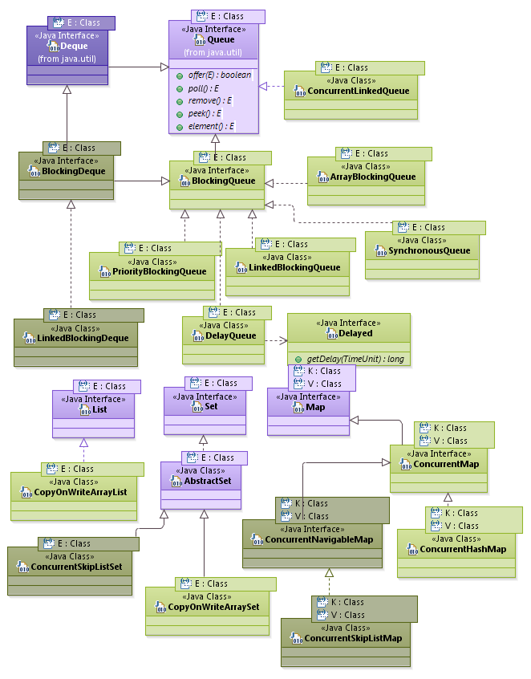
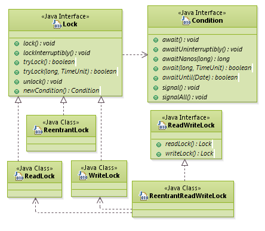
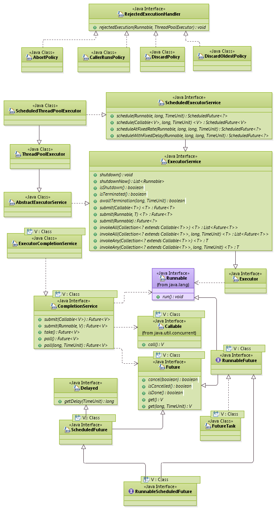

# Java5新特性及使用

## 新特性列表

以下是Java5中的引入的部分新特性，关于更详细的新特性了解，[可参考这里](https://docs.oracle.com/javase/1.5.0/docs/relnotes/features.html)。

- 泛型(Generics)
- 增强for循环(Enhanced for Loop)
- 自动装箱拆箱(Autoboxing/Unboxing)
- 枚举(Enums)
- 可变参数(Varargs)
- 静态导入(Static Import)
- 注解(Annotations)
- 值得关注
  - 进程构建器(ProcessBuilder)
  - 格式化(Formatter)
  - 扫描器(Scanner)
  - 反射(Reflection)
  - 集合框架(Collections Framework)
  - 并发工具类(Concurrency Utilities)
  - StringBuilder
- 其它(others)


### 一、泛型(Generics)
#### 1. 概述
Java语言引入泛型的好处是安全简单。
可以将运行时错误提前到编译时错误。
在Java5之前，没有泛型的情况的下，通过对类型Object的引用来实现参数的任意化，
任意化带来的缺点是要做显式的强制类型转换，
而这种转换是要求开发者对实际参数类型可以预知的情况下进行的。
对于强制类型转换错误的情况，编译器可能不提示错误，在运行的时候才出现异常，这是一个安全隐患。
泛型的好处是在编译的时候检查类型安全，并且所有的强制转换都是自动和隐式的，提高代码的重用率。

泛型的本质是参数化类型，也就是说所操作的数据类型被指定为一个参数。
这种参数类型可以用在类、接口和方法中，分别称为泛型类、泛型接口、泛型方法。

#### 2. 泛型类、泛型接口
泛型类中的类型参数几乎可以用于任何可以使用接口名、类名的地方。以下是Jdk中Map接口的定义：

```java
public interface Map<K,V> {

    V get(Object key);

    V put(K key, V value);

}
```

当声明或者实例化一个泛型的对象时，必须指定类型参数的值：

```java
Map<Integer, String> map = new HashMap<Integer, String>(); 
```

对于常见的泛型模式，推荐的名称是：

- K: 键
- V: 值
- E: 异常类
- T: 泛型

#### 3. 泛型方法

##### (1). 定义泛型方法
泛型方法使得该方法能独立于类而产生变化。
以下是一个基本的指导原则：无论何时，只要你能做到，你就应该尽量使用泛型方法。
也就是说，如果使用泛型方法可以取代将整个类泛型化，那么就应该只使用泛型方法，因为它可以使事情更清楚明白。
要定义泛型方法，只需将泛型参数列表置于返回值之前，就像下面这样：

```java
public class GenericMethods {

    //当方法操作的引用数据类型不确定的时候，可以将泛型定义在方法上
    public <T> void f(T x){
        System.out.println(x.getClass().getName());
    }

    public static void main(String[] args) {
        GenericMethods gm = new GenericMethods();
        gm.f(99);
        gm.f("abc");
    }

}
```

##### (2). 可变参数泛型方法

泛型方法与可变参数列表能很好地共存。

```java
public class GenericVarargs {

    public static <T> List<T> makeList(T... args) {
        List<T> result = new ArrayList<T>();
        for(T item:args) {
            result.add(item);
        }
        return result;
    }

    public static void main(String[] args) {
        List ls = makeList("A");
        System.out.println(ls);
        ls = makeList("A","B","C");
        System.out.println(ls);
        ls = makeList("ABCDEFGHIJKLMNOPQRSTUVWXYZ".split(""));
        System.out.println(ls);
    }

}
```

> 注：静态方法无法访问类上定义的泛型。如果静态方法操作的引用数据类型不确定的时候，必须要将泛型定义在方法上。

#### 4. 泛型擦除

看以下一段代码：

```java
public class ErasedTypeEquivalence {

    public static void main(String[] args) {
        Class c1 = new ArrayList<String>().getClass();
        Class c2 = new ArrayList<Integer>().getClass();
        System.out.println(c1 == c2); // 输出true.
    }

}
```

从以上代码的执行结果可以知道，ArrayList<String>和ArrayList<Integer>是相同的类型。
Java中的泛型，只在编译阶段有效。在编译过程中，正确检验泛型结果后，会将泛型的相关信息擦出，
并且在对象进入和离开方法的边界处添加类型检查和类型转换的方法。
也就是说，成功编译过后的class文件中是不包含任何泛型信息的。
泛型信息不会进入到运行时阶段。

要想在表达式中使用类型，需要显式地传递类型的class对象。

```java
class Building {
}
```

```java
class House extends Building {

}
```

```java
public class ClassTypeCapture<T> {

    Class<T> kind;

    public ClassTypeCapture(Class<T> kind) {
        this.kind = kind;
    }

    public boolean f(Object arg) {
        return kind.isInstance(arg);
    }

    public static void main(String[] args) {
        ClassTypeCapture<Building> ctt1 = new ClassTypeCapture<Building>(Building.class);
        System.out.println(ctt1.f(new Building())); // true
        System.out.println(ctt1.f(new House())); // true
        ClassTypeCapture<House> ctt2 = new ClassTypeCapture<House>(House.class);
        System.out.println(ctt2.f(new Building())); // false
        System.out.println(ctt2.f(new House())); // true
    }
}
```

#### 5. 通配符及泛型边界
- 通配符(?): 当操作类型时，不需要使用类型的具体功能时，只使用Object类中的功能。
那么可以用?通配符来表未知类型。例如：Class<?> classType = Class.forName("java.lang.String");。

- 上界(? extends T): 可以接收T类型或者其子类型的对象。
- 下界(? super E): 可以接收T类型或者其父类型的对象。

```java
public static void addNumbers( List<? super Integer> list ) {
    // list的实参可以是Integer，或者Number，或者Object，但是必然能容纳int类型
    for ( int i = 1; i <= 10; i++ ) {
        list.add( i );
    }
}
```

```java
public static void process( List<? extends Number> list ) {
    // list的实参可以是Integer，或者Number，或者Double，但是都可以针对其调用Number的接口
    for ( Number n : list ) {
        n.intValue();
    }
}
```

上面的两条，就是所谓的PECS原则：当泛型对象作为生产者（对外提供对象）时，将其泛型形参声明为上限通配符（extends）；
当泛型对象作为消费者时，将其泛型形参声明为下限通配符（super） ，
下面的例子有助于进一步理解PECS

```java
Value<? extends Number> valueExtend = new Value<Integer>( 1 );
//有了这个变量声明，我知道类型参数必然是Number的子类型：
Number num = valueExtend.get();
//但是，具体是Integer，还是Double，我不知道，因此我无法提供参数类型的实例
valueExtend.set( 1 ); //无法编译
 
Value<? super Number> valueSuper = new Value<Number>( 1 );
//有了这个变量声明，我知道类型参数必然是Number的超类型：
valueSuper.set( new Integer( 1 ) ); //那么，我当然可以提供Number的子类型给你
//但是，我却不知道类型参数的真实类型
Object obj = valueSuper.get(); //所以此变量提供的参数类型未知 
```


#### 6. 泛型总结

- 泛型的类型参数只能是类类型，不能是基本数据类型。
- 泛型的类型参数可以有多个。
- 所有泛型类的类型参数在编译时都会被擦除。
- 创建泛型对象时请指明类型，让编译器尽早的做参数检查。
- 不能创建泛型数组。如果想要创建泛型数组，建议使用ArrayList。
- 使用带泛型的类创建对象时，等式两边指定的泛型必须一致。
- 泛型的好处：
  - 类型安全。
  - 消除强制类型转换。
  - 提高性能。
  
  

### 二、增强for循环(Enhanced for Loop)

在Java5中，引入了另一种形式的for循环来对集合、数组、Map等进行遍历。如以下示例：

```java
int[] integers = {1, 2, 3, 4};  
/* 开始遍历 */
for (int i : integers) {  
    System.out.println(i);/* 依次输出“1”、“2”、“3”、“4” */
}
```

借助增强for循环，可以用一种更简单地方式来完成遍历。
能用这种方法遍历的对象的类型，可以是数组、Collection、Map或者任何其它实现了java.lang.Iterable接口的类。
通过跟同样是在Java5中引入的泛型机制配合使用，可以精确的控制能采用的循环变量的类型。
而且，因为这么编写的代码，会在编译期间被自动当成是和传统写法相同的形式，
所以不必担心要额外付出性能方面的代价。


> 注：Java采用for（而不是意义更明确的foreach）来引导这种一般被叫做for-each循环的循环，
并使用:（而不是意义更明确的in）来分割循环变量名称和要被遍历的对象。
这样做的主要原因，是为了避免因为引入新的关键字，造成兼容性方面的问题——在Java语言中，
不允许把关键字当作变量名来使用，虽然使用foreach这名字的情况并不是非常多，
但是in却是一个经常用来表示输入流的名字（例如java.lang.System类里，
就有一个名字叫做in的static属性，表示标准输入流）。


### 三、自动装箱拆箱(Autoboxing/Unboxing)


#### 1. 概述

自动装箱就是Java自动将原始类型值转换成对应的对象，比如将int的变量转换成Integer对象，这个过程叫做装箱，
反之将Integer对象转换成int类型值，这个过程叫做拆箱。

因为这里的装箱和拆箱是自动进行的非人为转换，所以就称作为自动装箱和拆箱。
原始类型byte, short, char, int, long, float, double和boolean对应的封装类分别为Byte, 
Short, Character, Integer, Long, Float, Double, Boolean。

自动装箱时编译器调用valueOf将原始类型值转换成对象，同时自动拆箱时，
编译器通过调用类似intValue(), doubleValue()这类的方法将对象转换成原始类型值。
自动装箱和拆箱在Java中很常见，比如我们有一个方法，接受一个对象类型的参数，
如果我们传递一个原始类型值，那么Java会自动将这个原始类型值转换成与之对应的对象。
最经典的一个场景就是当我们向ArrayList这样的容器中增加原始类型数据时，就会发生自动装箱。代码示例如下：

```java
ArrayList<Integer> intList = new ArrayList<Integer>();  
intList.add(1); //自动装箱  
intList.add(2); // 自动装箱

int number = intList.get(0); // 自动拆箱  
```

#### 2. 对象相等的比较
这是一个比较容易出错的地方，==可以用于原始值进行比较，也可以用于对象进行比较，
当用于对象与对象之间比较时，比较的不是对象代表的值，而是检查两个对象是否是同一对象，
这个比较过程中没有自动装箱发生。进行对象值比较不应该使用==，
而应该使用对象对应的equals方法。看一个能说明问题的例子。

```java
public class AutoboxingTest {

    public static void main(String args[]) {
        // 示例 1: 使用'=='号进行原始类型的比较(没有自动装箱)
        int i1 = 1;
        int i2 = 1;
        System.out.println("i1==i2 : " + (i1 == i2)); // true

        // 示例 2: 使用'=='号进行原始类型和对象类型混合的比较(自动装箱)
        Integer num1 = 1;
        int num2 = 1;
        System.out.println("num1 == num2 : " + (num1 == num2)); // true

        // 示例 3: 使用'=='号进行Integer对象类型的比较(会有缓存的特殊情况)
        Integer obj1 = 127; // 自动装箱将调用`Integer.valueOf()`且缓存该对象，以便重用
        Integer obj2 = 127; // 获取已经缓存过的对象
        System.out.println("obj1 == obj2 : " + (obj1 == obj2)); // true

       // 示例 4: 使用'=='号进行Integer对象类型的比较(不会缓存)
        Integer obj3 = 128; // 自动装箱将调用`Integer.valueOf()`不缓存该对象
        Integer obj4 = 128; // 同样是自动装箱将调用`Integer.valueOf()`
        System.out.println("obj3 == obj4 : " + (obj3 == obj4)); // false

        // 示例 5: 使用'=='号进行`new`出来的新`Integer`对象类型的比较
        Integer one = new Integer(1); // no autoboxing
        Integer anotherOne = new Integer(1);
        System.out.println("one == anotherOne : " + (one == anotherOne)); // false
    }

}
```

#### 3. 缓存部分对象

输出结果：

``` 
i1==i2 : true  
num1 == num2 : true  
obj1 == obj2 : true  
obj3 == obj4 : false  
one == anotherOne : false  
```  

在 Java5 中，为Integer的操作引入了一个新的特性，
会对-128到127的Integer对象进行缓存，当创建新的Integer对象时，
如果符合这个这个范围，并且已有存在的相同值的对象，则返回这个对象，
否则创建新的Integer对象。这种Integer缓存策略仅在自动装箱（autoboxing）的时候有用，
使用构造器创建的Integer对象不能被缓存。

Integer类中有一个专门的私有静态内部类IntegerCache来负责Integer的缓存。代码如下：
  
```java
/**
 * Cache to support the object identity semantics of autoboxing for values between
 * -128 and 127 (inclusive) as required by JLS.
 *
 * The cache is initialized on first usage.  The size of the cache
 * may be controlled by the {@code -XX:AutoBoxCacheMax=<size>} option.
 * During VM initialization, java.lang.Integer.IntegerCache.high property
 * may be set and saved in the private system properties in the
 * sun.misc.VM class.
 */
private static class IntegerCache {  
    static final int low = -128;
    static final int high;
    static final Integer cache[];

    static {
        // high value may be configured by property
        int h = 127;
        String integerCacheHighPropValue =
            sun.misc.VM.getSavedProperty("java.lang.Integer.IntegerCache.high");
        if (integerCacheHighPropValue != null) {
            try {
                int i = parseInt(integerCacheHighPropValue);
                i = Math.max(i, 127);
                // Maximum array size is Integer.MAX_VALUE
                h = Math.min(i, Integer.MAX_VALUE - (-low) -1);
            } catch( NumberFormatException nfe) {
                // If the property cannot be parsed into an int, ignore it.
            }
        }
        high = h;

        cache = new Integer[(high - low) + 1];
        int j = low;
        for(int k = 0; k < cache.length; k++)
            cache[k] = new Integer(j++);

        // range [-128, 127] must be interned (JLS7 5.1.7)
        assert IntegerCache.high >= 127;
    }

    private IntegerCache() {}
}
```  
  
Javadoc详细的说明这个类是用来实现缓存支持，并支持-128到127之间的自动装箱过程。
最大值127可以通过JVM的启动参数-XX:AutoBoxCacheMax=size修改。 
缓存通过一个for循环实现。从小到大的创建尽可能多的整数并存储在一个名为cache的整数数组中。
这个缓存会在Integer类第一次被使用的时候被初始化出来。
以后，就可以使用缓存中包含的实例对象，而不是创建一个新的实例(在自动装箱的情况下)。

这种缓存行为不仅适用于Integer对象。我们针对所有整数类型的类都有类似的缓存机制。

- ByteCache用于缓存Byte对象
- ShortCache用于缓存Short对象
- LongCache用于缓存Long对象
- CharacterCache用于缓存Character对象
- Byte，Short，Long有固定范围:-128到127。对于Character, 范围是0到127。
除了Integer可以通过参数改变范围外，其它的都不行。


> 注：在Java中另一个节省内存的例子就是字符串常量池。


#### 4. 自动装箱拆箱的隐患

另一个需要避免的问题就是混乱使用对象和原始数据值，
一个具体的例子就是当我们在一个原始数据值与一个对象进行比较时，
如果这个对象没有进行初始化或者为null，在自动拆箱过程中obj.xxxValue，
会抛出NullPointerException，如下面的代码:

```java
private static Integer count;

//NullPointerException on unboxing
if (count <= 0) {  
    System.out.println("Count is not started yet");
}
```

因为自动装箱会隐式地创建对象，像前面提到的那样，如果在一个循环体中，
会创建无用的中间对象，这样会增加GC压力，拉低程序的性能。
所以在写循环时一定要注意代码，避免引入不必要的自动装箱操作。


### 四、枚举(Enums)
枚举（enum全称为enumeration）类型是 Java5 新增的类型，
存放在java.lang包中，允许用常量来表示特定的数据片断，而且全部都以类型安全的形式来表示。

关于枚举的介绍，这里就不再细讲了，请参考我以前所整理的Java 枚举知识整理一文。


### 五、可变参数(Varargs)

#### 1. 基本使用
在 Java5 中提供了可变参数（Varargs），也就是在方法定义中可以使用个数不确定的参数，
对于同一方法可以使用不同个数的参数调用，
例如print("hello");、print("hello","lisi");等。
下面介绍如何定义可变长参数以及如何使用可变长参数。

使用...表示可变长参数，例如：

```java
print(String... args) {  
   // 方法代码
}
```

在具有可变长参数的方法中可以把参数当成数组使用，例如可以循环输出所有的参数值。

```java
print(String... args) {  
    for(String temp:args) {
        System.out.println(temp);
    }
}
```

调用的时候可以给出任意多个参数也可不给参数，例如：

```java
print();  
print("hello");  
print("hello","lisi"); 
```

#### 2. 可变参数的使用规则
- 拥有可变参数的方法可以被重载，在调用方法的时候，如果能够和固定参数的方法匹配，
也能够与可变参数的方法匹配，则执行时会选择固定参数的方法。
- 如果要调用的方法可以和两个可变参数匹配，则编译不会通过。
- 一个方法只能有一个可变参数，并且这个可变参数必须是该方法的最后一个参数。
- 可变参数可以兼容数组参数，但数组参数无法兼容可变参数。即在方法中定义可变参数后，我们可以像操作数组一样操作该参数；

#### 3. 可变参数的使用规范
- 避免带有可变参数的方法重载，容易让人陷入调用的陷阱及误区。
- 别让null值和空值威胁到可变参数的方法。
- 覆写可变参数方法也要满足以下的条件:
  - 重写方法不能缩小访问权限。
  - 参数列表必须与被重写方法相同（包括显示形式）。
  - 返回类型必须与被重写方法的相同或是其子类。
  - 重写方法不能抛出新的异常，或者超过了父类范围的异常，但是可以抛出更少、更有限的异常，或者不抛出异常。


### 六、静态导入(Static Import)
import static，即静态导入是JDK5中的新特性。
一般我们导入一个类都用import com.xxx.ClassName;
而静态导入是这样的：import static com.xxx.ClassName.*;
这里多了个static，还有就是类名ClassName后面多了个.*，意思是导入这个类里的所有静态方法。
当然，也可以只导入某个静态方法，只要把.*换成具体的静态方法名就行了。
然后在这个类中，就可以直接用方法名调用静态方法，而不必用ClassName.方法名的方式来调用。

静态导入之前的代码：  

```java
double r = Math.cos(Math.PI * theta);  
```  
使用静态导入之后的代码：

```java
import static java.lang.Math.*;

double r = cos(PI * theta);  
```

当你需要频繁访问一个或两个类的静态成员、静态方法时才使用静态导入。
如果您过度的使用了静态导入功能，则可能导致您的程序无法读取且无法维护，
从而导致您导入的所有静态成员和方法污染其名称空间。
你的代码读者（包括你，在你写了几个月后）不会知道静态成员来自哪个类。
从类中导入所有静态成员对可读性尤其有害，如果您只需要一个或两个成员，请单独导入它们。
使用适当的，静态导入可以使您的程序更具可读性，通过删除重复的类名称，来减少样板代码。
  
 
### 七、注解(Annotations)

Annotation是一种应用于类、方法、参数、变量、构造器及包声明中的特殊修饰符。
它是一种由JSR-175标准选择用来描述元数据的一种工具。

java 的注解是 java1.5 引入的新特性，他与类、接口、枚举是在同一个层次，
可以声明在包、类、字段、方法、局部变量、方法参数等的前面，用来对这些元素进行说明，注释或者进行某些操作
 
除 @Override 注解显式声明覆盖方法、@SuppressWarnings 注解触发警告等 jdk 定义的注解外，用户也可以自定义注解，
在很多框架中，自定义注解可以通过参数化配置复杂的功能，让代码简洁而通用化、模块化，是一种十分实用的特性


[annotation 注解使用](https://blog.csdn.net/longestory/article/details/46316825)
[Java中的注解是如何工作的？](http://www.importnew.com/10294.html)

### 八、值得关注

#### 1. 新增ProcessBuilder类
ProcessBuilder类是Java5在java.lang包中新添加的一个新类，
此类用于创建操作系统进程，它提供一种启动和管理进程（也就是应用程序）的方法。
在此之前，都是由Process类处来实现进程的控制管理。
每个ProcessBuilder实例管理一个进程属性集。它的start()方法利用这些属性创建一个新的Process实例。
start()方法可以从同一实例重复调用，以利用相同的或相关的属性创建新的子进程。

ProcessBuilder是一个final类，有两个带参数的构造方法，你可以通过构造方法来直接创建ProcessBuilder的对象。
而Process是一个抽象类，一般都通过Runtime.exec()和ProcessBuilder.start()来间接创建其实例。
ProcessBuilder为进程提供了更多的控制，例如，可以设置当前工作目录，还可以改变环境参数。
而Process类的功能相对来说简单的多。ProcessBuilder类不是同步的。
如果多个线程同时访问一个ProcessBuilder，而其中至少一个线程从结构上修改了其中一个属性，它必须保持外部同步。

若要使用ProcessBuilder创建一个进程，只需要创建ProcessBuilder的一个实例，指定该进程的名称和所需参数。
要执行此程序，调用该实例上的start()即可。下面是一个执行打开Windows记事本的例子。注意它将要编辑的文件名指定为一个参数。
 

```java
public class PBDemo {

    public static void main(String args[]) {
        try {
            ProcessBuilder proc = new ProcessBuilder("notepad.exe", "testfile");
            proc.start();
        } catch (Exception e) {
            System.out.println("Error executing notepad.");
        }
    }

}
```  
  
  
#### 2. 新增Formatter格式化器(Formatter)
Formatter类是Java5中新增的printf-style格式化字符串的解释器，
它提供对布局和对齐的支持，提供了对数字，字符串和日期/时间数据的常用格式以及特定于语言环境的输出。
常见的Java类型，如byte，java.math.BigDecimal和java.util.Calendar都支持。 
通过java.util.Formattable接口提供了针对任意用户类型的有限格式定制。

更详细的介绍见[这里](https://docs.oracle.com/javase/1.5.0/docs/api/java/util/Formatter.html)。
主要使用方法的代码示例如下：

```java
public class FormatTester {

    /**
     * 格式化.
     */
    private static void formatter() {
        StringBuilder sb = new StringBuilder();
        Formatter formatter = new Formatter(sb, Locale.US);

        // 可重新排序输出.
        // -> " d  c  b  a"
        formatter.format("%n%4$2s %3$2s %2$2s %1$2s %n", "a", "b", "c", "d");
        // -> "e =    +2,7183"
        formatter.format(Locale.FRANCE, "e = %+10.4f", Math.E); 
        
        formatter.format("%nAmount gained or lost since last statement: $ %(,.2f", 6217.58);
        // -> "Amount gained or lost since last statement: $ 6,217.58"

        System.out.println("打印出格式化后的字符串:"+ formatter);
        formatter.close();
    }

    /**
     * printf打印.
     */
    private static void printf() {
        String filename = "testfile";
        try (FileReader fileReader = new FileReader(filename)) {
            BufferedReader reader = new BufferedReader(fileReader);
            String line;
            int i = 1;
            while ((line = reader.readLine()) != null) {
                System.out.printf("Line %d: %s%n", i++, line);
            }
        } catch (Exception e) {
            System.err.printf("Unable to open file named '%s': %s", filename, e.getMessage());
        }
    }

    /**
     * stringFormat使用.
     */
    private static void stringFormat() {
        // 格式化日期.
        Calendar c = new GregorianCalendar(1995, Calendar.MAY, 23);
        String s = String.format("Duke's Birthday: %1$tm %1$te,%1$tY", c);
        // -> s == "Duke's Birthday: May 23, 1995"
        System.out.println(s);
    }

    /**
     * Formatter 格式化消息.
     */
    private static void messageFormat() {
        String msg = "欢迎光临，当前（{0}）等待的业务受理的顾客有{1}位，请排号办理业务！ {2}";
        MessageFormat mf = new MessageFormat(msg);
        String fmsg = mf.format(new Object[]{new Date(), 35,"good day"});
        System.out.println(fmsg);
    }

    /**
     * 格式化日期.
     * Format
     */
    private static void dateFormat() {
        String str = "2010-1-10 17:39:21";
        SimpleDateFormat format = new SimpleDateFormat("yyyyMMddHHmmss");
        try {
            System.out.println("格式化后的日期:"+ format.format(format.parse(str)));
        } catch (Exception e) {
            System.out.println("日期格式化出错！"+ e);
        }
    }

    public static void main(String[] args) {
        formatter();
        stringFormat();
        messageFormat();
        dateFormat();
        printf();
    }

}
```

#### 3. 新增Scanner类(Scanner)
java.util.Scanner是Java5的新特征，主要功能是简化文本扫描，但这个类最实用的地方还是在获取控制台输入。

##### (1). Scanner概述
可以从字符串(Readable)、输入流、文件、Channel等来直接构造Scanner对象，
有了Scanner了，就可以逐段（根据正则分隔式）来扫描整个文本，并对扫描后的结果做想要的处理。

Scanner默认使用空格作为分割符来分隔文本，
但允许你使用useDelimiter(Pattern pattern)或useDelimiter(String pattern)方法来指定新的分隔符。

主要API如下：

- delimiter(): 返回此Scanner当前正在用于匹配分隔符的Pattern。
- hasNext(): 判断扫描器中当前扫描位置后是否还存在下一段。
- hasNextLine(): 如果在此扫描器的输入中存在另一行，则返回true。
- next(): 查找并返回来自此扫描器的下一个完整标记。
- nextLine(): 此扫描器执行当前行，并返回跳过的输入信息。

##### (2). 扫描控制台输入
当通过new Scanner(System.in)创建了一个Scanner实例时，
控制台会一直等待输入，直到敲回车键结束，把所输入的内容传给Scanner，作为扫描对象。
如果要获取输入的内容，则只需要调用Scanner的nextLine()方法即可。


```java
/**
* 扫描控制台输入.
*/
public class ScannerTest {

    public static void main(String[] args) {
        Scanner s = new Scanner(System.in);
        System.out.println("请输入字符串：");
        while (true) {
            String line = s.nextLine();
            if (line.equals("exit")) break;
            System.out.println(">>>" + line);
        }
    }

}
```

##### (3).其它示例
该示例中会从myNumbers文件中读取长整型long的数据。
```java
Scanner sc = new Scanner(new File("myNumbers"));  
while (sc.hasNextLong()) {  
    long aLong = sc.nextLong();
}
```


以下示例可以使用除空格之外的分隔符来从一个字符串中读取几个条目：

```java
String input = "1 fish 2 fish red fish blue fish";  
Scanner s = new Scanner(input).useDelimiter("\\s*fish\\s*");  
System.out.println(s.nextInt());  
System.out.println(s.nextInt());  
System.out.println(s.next());  
System.out.println(s.next());  
s.close();    
```
将输出：

``` 
1  
2  
red  
blue
```

#### 4. 增强反射功能(Reflection)
Java5反射功能方面的增强主要在java.lang.Class和java.lang.reflect类中。

主要有以下内容增强：

- 支持泛型: 可以检查类型、方法、构造方法或字段的声明并获取泛型所对应的类型信息。
- 支持注解: 通过使用getAnnotation()方法获取已经在运行时标记为可用的方法和构造方法的类型，方法，字段，
  构造方法和形式参数的注释。人们还可以确定一个接口是否是一个注解类型。
  
- 支持枚举: 可以确定一个类是否是一个枚举，以及一个字段是否代表一个枚举常量。
- 支持可变参数: 可以确定一个方法或构造方法是否是可变参数方法。
- 便利的方法: 用于确定一个类是否是本地的、匿名的还是成员类，以及一个类型的简单名称是什么。
- java.lang.Class类型标记: 允许使用java.lang.Class的实例作为类型标记。


#### 5. 增强集合框架(Collections Framework)

在Java5中集合框架的增强主要在以下几个方面：

- 三种新语言特性都有针对集合，包括泛型，增强for循环和自动装箱。

- 三个新的接口已被添加到集合框架中，分别是：Queue，BlockingQueue和ConcurrentMap（后两个位于java.util.concurrent包中）。

- 提供了两个新的具体队列实现(PriorityQueue、ConcurrentLinkedQueue)，
一个现有的列表实现已经被改造来实现队列(LinkedList)，并且提供了一个抽象队列实现(AbstractQueue)。

- 已经添加了五个阻塞队列实现，以及一个ConcurrentMap实现，分别是：ArrayBlockingQueue, LinkedBlockingQueue, 
  PriorityBlockingQueue, DelayQueue, SynchronousQueue、ConcurrentHashMap。

- 为类型安全的枚举提供了特殊用途的Map和Set实现。(EnumMap和EnumSet)

- 添加了特殊用途的copy-on-writeList和Set实现，分别是：CopyOnWriteArrayList和CopyOnWriteArraySet。

- 提供了包装器的实现来对大多数Collection接口添加动态类型安全性的检查(Collections.checkedInterface)。
  检查要添加的元素的类型并返回结果。
  任何尝试添加非法类型的变量都会抛出一个ClassCastException异常。这个功能可以防止在运行的时候出错。

  - 提供了几个新的算法来处理集合。
  - frequency(Collection<?> c, Object o) - 计算指定集合中指定元素出现的次数。
  - disjoint(Collection<?> c1, Collection<?> c2) - 判断两个集合是否不相交，换句话说，是否它们不包含任何共同的元素。
  - addAll(Collection<? super T> c, T... a) - 将指定数组中的所有元素添加到指定的集合中。
  - Comparator<T> reverseOrder(Comparator<T> cmp) - 返回一个比较器，表示指定比较器的反向排序。
  - 提供了计算哈希代码和字符串表示的方法。Arrays工具类已经为所有类型的数组提供了基于内容的hashCode和toString方法。 
    这些方法补充了现有的equals方法。现在可以打印任何数组的内容。


#### 6. 并发工具类(Concurrency Utilities)
java.util.concurrent，java.util.concurrent.atomic和java.util.concurrent.locks包为开发并发类应用程序提供了一个强大的，
可扩展的高性能，可伸缩，线程安全构建框架，包括 线程池，线程安全集合，信号量，任务调度框架，任务同步实用程序，原子变量和锁。
将这些软件包添加到核心类库可以使程序员免去手工制作这些工具的需要，这与集合框架用于数据结构的方式大致相同。
关于并发相关的的介绍会在以后更详细的来讲解。

##### java.util.concurrent包
这是一个Java5引入的专门用于并发编程的新包，该包主要有以下组件：

- 支持并发的集合类型，位于java.util.concurrent包

- 原子操作类，这些原子操作类受益于JVM引入了CAS（Compare-And-Set）机制，位于java.util.concurrent.atomic包

- 新的同步原语，主要是一些锁类，位于java.util.concurrent.locks包

- 并发相关工具，例如线程池、信号量等

- 异步相关类，例如Future、Executor

- concurrent中的集合类图如下（深色表示JDK 1.6追加）




可以看到类很多，因此不一一描述，仅将类名中单词的含义列在下表：

单词	 | 含义 
---|---|
Queue	| 提供先进先出的操作接口  |
Deque	| 不但支持在列表的尾部操作，还支持在头部操作
Concurrent	| 表示支持线程安全的并发访问
Linked	| 表示链表结构
Array	| 表示数组结构（连续内存，高速随机访问）
Blocking	| 当集合为空，取数据操作将阻塞；当集合为满，存数据操作将阻塞
Synchronous | 一个存操作的完成，必须依赖有一个取操作的执行
Priority	| 允许元素被优先取出
Delay	| 元素只有在超时后，才能从集合中取出
CopyOnWrite | 一旦执行写操作，就复制底层的数据结构（例如数组），复制的成本较高，但是CopyOnWrite避免了同步开销，适用于大量读、很少写的应用场景
Navigable	| 可以导航，即根据给定的元素，寻找其最近的元素


concurrent.atomic包中的原子操作类包括：Boolean、Integer、Long、引用的原子类及其数组类型。

concurrent.locks包引入了一些用于支持锁定的类和接口，
改变了Java只能依靠 synchronized 关键字进行粗粒度同步控制的现状



该包主要有三个接口：


##### Lock
用于代替 synchronized 关键字的功能，可以关联多个 Condition) ，一般锁都是独占的进行共享资源的访问。
该接口提供了比 synchronized 更灵活的功能：

- 1.tryLock()  允许尝试性的获得锁，如果失败，立即返回而不是必须陷入等待
- 2.lockInterruptibly() 进行锁定，如果其它线程持有锁，那么让当前线程陷入等待。但是这种等待是可中断的。
其它线程可以调用该线程的 interrupt() 中断该线程的等待
- 3.tryLock(long, TimeUnit) 允许尝试性的获得锁，如果在指定时间内还没有得到锁，则返回

##### Condition 
用于代替 java.lang.Object 定义的监视器方法：wait、notify和notifyAll。
该接口可以把前面几个监视器方法的职责分解为多个完全不同的“条件”对象，条件对象总是和一个锁关联。

- 1.当前持有锁的线程，可以等待一个条件的达成： Condition.await() ，从而放弃锁，并陷入等待
- 2.当前持有锁的线程，可以声明一个条件已经达成： Condition.signal() ，从而唤醒一个线程，或者调用 Condition.signalAll() 唤醒所有线程
- .3被唤醒的线程将立即尝试获得锁，因为它放弃锁时，处于同步区中


##### ReadWriteLock	
维护一对相关的锁：一个用于只读操作，另外一个用于写入操作，规则如下：

- 1.如果当前没有线程持有写锁，那么多个线程可以依次获得读锁
- 2.如果当前没有线程持有锁，那么某个线程可以持有写锁
- 3.如果当前有线程持有写锁，那么其它线程不能获得任何锁
- 4.如果当前有线程持有读锁，那么其它线程可以获取读锁，单不能获取写锁


##### 和异步编程有关的接口主要有四个：

- 1.Future接口表示一个“在未来某个时间点可用的结果”
- 2.Callable表示一个可调用对象
- 3.Executor接口可以用来执行一个Runnable
- 4.CompletionService则可用来调用Callable并（异步）获得结果
这些类的层次结构如下：




concurrent包包含的其它工具类有：

类	| 说明
---|--- 
Semaphore	    | 信号量，线程可以释放信号量，亦可尝试获取信号量，信号量相当于维护了一个固定数量的许可
CountDownLatch  | 计数器，可以让某个线程在计数完毕前等待。其它线程则可以降低计数值
CyclicBarrier	| 屏障，允许多个线程相互等待（await），直到所有线程都调用了await()，所有线程才会继续运行
TimeUnit	    | 这是一个枚举，可以用来进行时间单位的转换，或者让当前线程睡眠一段时间


#### 7. StringBuilder
StringBuilder也是Java5中新增的类，主要用来代替+号和StringBuffer来更加高效的拼接字符串。
StringBuffer与StringBuilder都是继承于AbstractStringBuilder，
主要的区别就是StringBuffer的函数上都有synchronized关键字，保证线程安全。

关于StringBuilder的使用这里就不再详细介绍了，网上文章也有很多。
总之，对于动态字符串的拼接推荐使用StringBuilder。
静态字符串的拼接直接使用+号或者字符串的concat(String str)方法，甚至也使用StringBuilder亦可。


#### 九、其它(others)

- Instrumentation: 使用java.lang.instrument，开发者可以构建一个代理，用来监测运行在JVM上的程序。
它类似一种更低级，更松耦合的AOP，可以从底层来改变一个类的行为。

- Networking: 网络编程功能增强。

- Internationalization: 国际化是设计一个应用程序的过程，以便它可以适应各种语言和地区而无需改变工程。
国际化这个术语缩写为i18n，因为在第一个i和最后一个n之间有18个字母。

- 改善了环境变量的支持: System.getenv(String)方法不再被弃用。新的System.getenv()方法允许作为Map <String，String>访问进程环境。

- JAXP: 用于XML处理的Java API(JAXP)包括通过标准化的Java平台API来处理XML文档的基本设施。

- Serialization: 已经添加了支持来处理5.0版本中新增的枚举类型。
序列化枚举实例的规则与序列化普通可序列化对象的规则不同：枚举实例的序列化形式仅由其枚举常量名以及标识其基本枚举类型的信息组成。
反序列化行为也不相同 - 类信息用于查找适当的枚举类，并且Enum.valueOf方法与该类和所接收的常量名称一起被调用，以便获取返回的枚举常量。

- 监控和管理: Java5为Java平台的监视和管理提供了显着的增强。

- ...


[原文](http://blinkfox.com/java5xin-te-xing-ji-shi-yong/)

[原文](https://blog.gmem.cc/java5-new-features)


