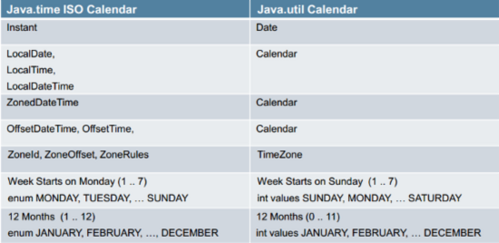

## [原文](https://www.jianshu.com/p/19bd58b30660)

# java 8的java.time包

## 前言:

用过java1.8之前原生的日期处理api,你就会知道用起来非常麻烦,
而且要注意的地方有点多(例如月份是由0开始,而且api使用有的不统一,线程不安全等等...),
所以在java1.8之前的日期api都不值得去使用,虽然说现在都有强大的日期处理的第三方库,
但是会有兼容性问题,那么现在jdk8有了新的时间处理类,为何不去尝试一下呢


## java.time包下有5个包组成(大部分人用到基础包和format包就足够了)
```
java.time – 包含值对象的基础包
java.time.chrono – 提供对不同的日历系统的访问
java.time.format – 格式化和解析时间和日期
java.time.temporal – 包括底层框架和扩展特性
java.time.zone – 包含时区支持的类
```

## 先看看对这个包的概述:
```
java.time 包是在JDK8新引入的，提供了用于日期、时间、实例和周期的主要API。
```

```
java.time包定义的类表示了日期-时间概念的规则，
包括instants, durations, dates, times, time-zones and periods。
这些都是基于ISO日历系统，它又是遵循 Gregorian规则的。
```
所有类都是不可变的、线程安全的。

## 再看看对这些类的介绍:
```
LocalDateTime：只存储了日期和时间，如：2017-03-21T14:02:43.455。(后面的.455表示毫秒值的最后三位,使用.withNano(0)可把毫秒值设为0)

LocalDate：只存储了日期，如：2017-03-21。

LocalTime：只存储了时间，如：14:02:43.455。(后面的.455表示毫秒值的最后三位,使用.withNano(0)可把毫秒值设为0)

Year：只表示年份。

Month：只表示月份。

YearMonth：只表示年月。

MonthDay：只表示月日。

DayOfWeek：只存储星期的一天。

Instant 相当于java.util的Date

Clock 它通过指定一个时区，然后就可以获取到当前的时刻，日期与时间。Clock可以替换System.currentTimeMillis()与TimeZone.getDefault()。

ZonedDateTime 可以得到特定时区的日期/时间

Duration 是用来计算两个日期的时间差
```

然后再看看它与java.util.Calendar的api比较:


可以看到在java.time当中,星期一的值为1,星期日的值为7,而在Calendar当中星期日的值为1,而且java.time中一月份的值为1,Calendar一月份的值为0(多么反人类的设计,多多少少让人不自在),如果你会使用Calendar的话,那么你要上手java.time包也是很快的.

还有一些方法前缀的含义,统一了api:
```
of：静态工厂方法(用类名去调用)。

parse：静态工厂方法，关注于解析(用类名去调用)。

now： 静态工厂方法，用当前时间创建实例(用类名去调用)

get：获取某些东西的值。

is：检查某些东西的是否是true。

with：返回一个部分状态改变了的时间日期对象拷贝(单独一个with方法,参数为TemporalAdjusters类型)

plus：返回一个时间增加了的、时间日期对象拷贝(如果参数是负数也能够有minus方法的效果)

minus：返回一个时间减少了的、时间日期对象拷贝

to：把当前时间日期对象转换成另外一个，可能会损失部分状态.

at：把这个对象与另一个对象组合起来，例如： date.atTime(time)。

format :根据某一个DateTimeFormatter格式化为字符串
```
新时间API类都实现了一系列方法用以完成通用的任务，如：加、减、格式化、解析、从日期/时间中提取单独部分，等等

time包里面的类实例如果用了上面的方法而被修改了,
那么会返回一个新的实例过来,而不像Calendar那样可以在同一个实例进行不同的修改,体现了不可变

## java.time.temporal.ChronoField枚举类

此枚举类是作为get方法的参数获取时间的值
它里面的属性含义有的跟Calendar的成员变量含义差不多,
想要了解一下可以看我的关于Calendar类详解的文章 ,如果要看很详细的讲解可以去查看ChronoField类的官方api文档

演示一下判断当前时间是属于上午还是下午:
```java

        LocalDateTime now = LocalDateTime.now();
        switch (now.get(ChronoField.AMPM_OF_DAY)) {
        case 0:
            System.out.println("上午");
        case 1:
            System.out.println("下午");
        }
```
        //打印 下午
## java.time.temporal.TemporalAdjusters类

此类配合java.time基础包中类的with方法:
```java
LocalDate now = LocalDate.now();

        //当前月份的第一天的日期,2017-03-01
        System.out.println(now.with(TemporalAdjusters.firstDayOfMonth())); 
        
        //下一个月的第一天的日期,2017-04-01
        System.out.println(now.with(TemporalAdjusters.firstDayOfNextMonth())); 
        
        //当前月份的最后一天,2017-03-31 --再也不用计算是28，29，30还是31
        System.out.println(now.with(TemporalAdjusters.lastDayOfMonth())); 
```
        
java.time.format.DateTimeFormatter
此类的功能与SimpleDateFormat类的功能类似,此类也是线程安全的,在写成时间处理工具类时,可作为静态成员变量,
而不用每次都new一个SimpleDateFormat实例,此类是用来创建日期显示的模板,
然后对于日期的格式化和解析还是使用LocalDateTime等类的parse静态方法和format方法,
其模板属性格式是和SimpleDateFormat一样的,

请看:

```java
G 年代标志符
y 年
M 月
d 日
h 时 (12小时制)
H 时 (24小时制)
m 分
s 秒
S 毫秒
E 星期几
D 一年中的第几天
F 一月中第几个星期(以每个月1号为第一周,8号为第二周为标准计算)
w 一年中第几个星期
W 一月中第几个星期(不同于F的计算标准,是以星期为标准计算星期数,例如1号是星期三,是当月的第一周,那么5号为星期日就已经是当月的第二周了)
a 上午 / 下午 标记符
k 时 (24小时制,其值与H的不同点在于,当数值小于10时,前面不会有0)
K 时 (12小时值,其值与h的不同点在于,当数值小于10时,前面不会有0)
z 时区
```
对于此类使用先来个简单的新旧api对比演示:

### 1 .Date转String
```java
        //使用Date和SimpleDateFormat
        SimpleDateFormat simpleDateFormat = 
                        new SimpleDateFormat("G yyyy年MM月dd号 E a hh时mm分ss秒");
        
        String format = simpleDateFormat.format(new Date());
        
        System.out.println(format); 
        //打印: 公元 2017年03月21号 星期二 下午 06时38分20秒
        
        //使用jdk1.8 LocalDateTime和DateTimeFormatter
        LocalDateTime now = LocalDateTime.now();
        DateTimeFormatter pattern = 
                   DateTimeFormatter.ofPattern("G yyyy年MM月dd号 E a hh时mm分ss秒");
        String format = now.format(pattern);
        System.out.println(format);
      //打印: 公元 2017年03月21号 星期二 下午 06时38分20秒
```

### 2 .String转Date
```java
         //使用Date和SimpleDateFormat
        SimpleDateFormat simpleDateFormat = 
                  new SimpleDateFormat("yyyy-MM-dd hh:mm:ss");
        
        Date date = simpleDateFormat.parse("2017-12-03 10:15:30");
        
        System.out.println(simpleDateFormat.format(date));
        //打印 2017-12-03 10:15:30
        //使用jdk1.8 LocalDateTime和DateTimeFormatter
        DateTimeFormatter pattern = 
                    DateTimeFormatter.ofPattern("yyyy-MM-dd HH:mm:ss");

        //严格按照ISO yyyy-MM-dd验证，03写成3都不行
        LocalDateTime dt = LocalDateTime.parse("2017-12-03 10:15:30",pattern); 
        
        System.out.println(dt.format(pattern));
```
下面演示一次java.time基础包中的类的使用:

### 1. java.time.LocalDateTime
此类显示的是年月日时分秒(默认的格式为:2017-01-01T01:01:01.555)
```java
LocalDateTime now = LocalDateTime.now();
        System.out.println(now.toString());
        System.out.println(now.getYear());
        System.out.println(now.getMonthValue());
        System.out.println(now.getDayOfMonth());
        System.out.println(now.getHour()); //24小时制
        System.out.println(now.getMinute());
        System.out.println(now.getSecond());
        System.out.println(now.getNano()); //毫秒值的后三位作为前三位后面补6个零
```
打印的结果为:  
```
2017-03-21T20:26:18.317
2017
3
21
20
26
18
317000000
```
//能够自定义时间
```java
        LocalDateTime time = LocalDateTime.of(2017, 1, 1, 1, 1,1);
        System.out.println(time); //2017-01-01T01:01:01
        
        //使用plus方法增加年份
        LocalDateTime time = LocalDateTime.of(2017, 1, 1, 1, 1,1);

        //改变时间后会返回一个新的实例nextYearTime
        LocalDateTime nextYearTime = time.plusYears(1); 

        System.out.println(nextYearTime); //2018-01-01T01:01:01
        
        //使用minus方法减年份
        LocalDateTime time = LocalDateTime.of(2017, 1, 1, 1, 1,1);
        LocalDateTime lastYearTime = time.minusYears(1);
        System.out.println(lastYearTime); //2016-01-01T01:01:01
        
        //使用with方法设置月份
        LocalDateTime time = LocalDateTime.of(2017, 1, 1, 1, 1,1);
        LocalDateTime changeTime = time.withMonth(12);
        System.out.println(changeTime); //2017-12-01T01:01:01
        
        //判断当前年份是否闰年
        System.out.println("isLeapYear :" + time.isLeapYear());
        
        //判断当前日期属于星期几
        LocalDateTime time = LocalDateTime.now();
        DayOfWeek dayOfWeek = time.getDayOfWeek();
        System.out.println(dayOfWeek); //WEDNESDAY
```
2. java.time.LocalDate

此类显示的是年月日(默认的格式为:2017-01-01)

用法与LocalDateTime类大致一样

3. java.time.LocalTime

此类显示的是时分秒和毫秒值的后三位(21:26:35.693)

用法与LocalDateTime类大致一样

3. java.time.Instant

此类功能和java.util.Date类类似
```java
Instant now = Instant.now();
        System.out.println(now.toEpochMilli());//获取当前时间的毫秒值
        System.out.println(now.isAfter(now)); //当前时间是否在参数中的时间之后
        System.out.println(now.isBefore(now));//当前时间是否在参数中的时间之前

        //当前时间与参数中的时间进行对比,在参数的时间之前,相同,之后的值分别是(-1,0,1)
        System.out.println(now.compareTo(now));
        

        //用一个时间戳去创建一个Instance实例,用法和new Date(时间戳)创建一个Date实例是一样的
        Instant ofEpochMilli = Instant.ofEpochMilli(System.currentTimeMillis()); 

       System.out.println(now.getEpochSecond());//获取当前时间的秒
```
4.java.time.Instant和java.time.LocalDateTime互转

4.1 Instance转LocalDateTime
```java
Instant instant = Instant.ofEpochMilli(System.currentTimeMillis());
        
        ZoneId systemDefault = ZoneId.systemDefault();
        
        LocalDateTime now = LocalDateTime.ofInstant(instant, systemDefault);
        
        System.out.println(now); //2017-03-22T13:44:34.979
```
4.2 LocalDateTime转Instance
```java
LocalDateTime now = LocalDateTime.now();

        ZoneId systemDefault = ZoneId.systemDefault();
        
        Instant instant = now.atZone(systemDefault).toInstant();
        
        System.out.println(instant.toEpochMilli()); //1490163685578
```
4. java.time.Duration

此类用来计算两同类型日期的时间差,看演示:
```java
LocalDateTime start = LocalDateTime.of(2017, 1, 1, 1, 1);
LocalDateTime end = LocalDateTime.of(2017, 2, 1, 1, 1);

        Duration result = Duration.between(start, end);
        System.out.println(result.toDays()); //31
        System.out.println(result.toHours()); //744
        System.out.println(result.toMinutes()); //44640
        System.out.println(result.toMillis()); //2678400000
        System.out.println(result.toNanos()); //2678400000000000
```
其中between方法计算两日期时间差,两参数都是Temporal接口类型的日期,来看看Temporal的实现类:

HijrahDate, Instant, JapaneseDate, LocalDate, LocalDateTime, LocalTime, MinguoDate, 
OffsetDateTime, OffsetTime, ThaiBuddhistDate, Year, YearMonth, ZonedDateTime

java.util.Date或java.util.Calendar到新库类的转换
转换可通过下面的方法进行。
```
Date.toInstant()
Date.from(Instant)
Calendar.toInstant()
```

## JDBC
最新JDBC映射将把数据库的日期类型和Java 8的新类型关联起来：
```
date -> LocalDate
time -> LocalTime
timestamp -> LocalDateTime
```
