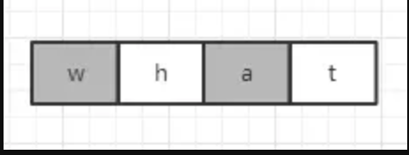
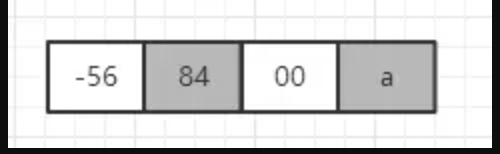

## [原文](https://juejin.im/post/5aff7f10518825426e0233ea)

# Java9后String的空间优化

## 前言
据我所知 Java 开发人员几乎任何时候都会想到 String，字符串确实已经成为最常用的类了，而且是大量使用。
我们都知道，String 其实是封装了字符，里面必须由字符或字节数组来存放，
从 Java9 开始 Java 语言开发者对 String 做了一些空间的优化。

## 从char到byte
JDK9 之前的库的 String 类的实现使用了 char 数组来存放字符串，char 占用16位，即两字节。
```java

private final char value[];

```
这种情况下，如果我们要存储字符A，则为0x00 0x41，此时前面的一个字节空间浪费了。
但如果保存中文字符则不存在浪费的情况，也就是说如果保存 ISO-8859-1 编码内的字符则浪费，
之外的字符则不会浪费。

而 JDK9 后 String 类的实现使用了 byte 数组存放字符串，每个 byte 占用8位，即1字节。
```java

private final byte[] value

```

## 编码

String 支持多种编码，但如果不指定编码的话，它可能使用两种编码，分别为 LATIN1 和 UTF16。
LATIN1 可能比较陌生，其实就是 ISO-8859-1 编码，属于单字节编码。
而 UTF16 为双字节编码，它使用1个或2个16位长的空间存储。

## 压缩空间
压缩的字符对象主要是在 ISO-8859-1 编码内的字符，比如英语字母数字还有其他常见符号。
为了更好理解我们看下图，假如我们有一个“what”字符串，那么如果在 Java9 之前，
它的存储是按如下队列排列的，可以看到每个字符都需要16位来存储，
而高字节位都为0，这个其实就是浪费了。


而在 Java9 后，它的存储的排列则很紧凑了，如下图，只需四个字节即可。



但如果是“哈a”，则布局为下图，所以如果字符串中的字符一旦包含了不在 ISO-8859-1 编码内的字符，
则同样还是统一使用16位长度来保存。



Java9 的 String 默认是使用了上述紧凑的空间布局的，看如下代码，
默认将 COMPACT_STRINGS 设置为 true。
而如果要取消紧凑的布局可以通过配置 VM 参数-XX:-CompactStrings实现。
```java
static final boolean COMPACT_STRINGS;
static {
    COMPACT_STRINGS = true;
}

```
## 字符串长度
因为改变了 String 的实现，使用了 UTF-16 或 LATIN-1 编码，
所以内部需要一个标识coder来表示使用了哪种编码，LATIN1 值为0，UTF16 值为1。

```java
private final byte coder;
static final byte LATIN1 = 0;
static final byte UTF16  = 1;

```
而字符串的长度也与编码相关，计算时通过右移来实现。
如果是 LATIN-1 编码，则右移0位，数组长度即为字符串长度。
而如果是 UTF16 编码，则右移1位，数组长度的二分之一为字符串长度。

```java
public int length() {
    return value.length >> coder();
}

```
## 总结
字符串对象是 Java 中大量使用的对象，而且我们会轻易大量使用它而从不考虑它的代价，
所以对其的空间优化是有必要的，Java9 开始对 这能帮助我们减少字符串在堆中占用的空间，
而且还能减轻GC压力。同时也能看到该空间优化对中文来说意义不大。

 
