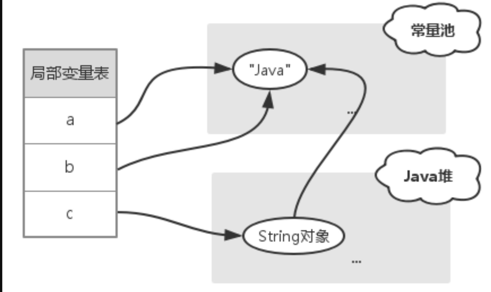

## [原文](https://www.jianshu.com/p/2f209af80f84)

# 浅谈Java String内幕

## 前言
String字符串在Java应用中使用非常频繁，
只有理解了它在虚拟机中的实现机制，才能写出健壮的应用，
本文使用的JDK11

## 常量池
Java代码被编译成class文件时，
会生成一个常量池（Constant pool）的数据结构，
用以保存字面常量和符号引用（类名、方法名、接口名和字段名等）。

```java
public class StringDemo01 {

    public static void main(String[] args) {
        String test = "test";
    }
}
```
很简单的一段代码，通过命令 javap -verbose 查看class文件中 Constant pool 实现：

```java
Constant pool:
   #1 = Methodref          #4.#20         // java/lang/Object."<init>":()V
   #2 = String             #16            // test
   #3 = Class              #21            // space/pankui/basic/StringDemo01
   #4 = Class              #22            // java/lang/Object
   #5 = Utf8               <init>
   #6 = Utf8               ()V
   #7 = Utf8               Code
   #8 = Utf8               LineNumberTable
   #9 = Utf8               LocalVariableTable
  #10 = Utf8               this
  #11 = Utf8               Lspace/pankui/basic/StringDemo01;
  #12 = Utf8               main
  #13 = Utf8               ([Ljava/lang/String;)V
  #14 = Utf8               args
  #15 = Utf8               [Ljava/lang/String;
  #16 = Utf8               test
  #17 = Utf8               Ljava/lang/String;
  #18 = Utf8               SourceFile
  #19 = Utf8               StringDemo01.java
  #20 = NameAndType        #5:#6          // "<init>":()V
  #21 = Utf8               space/pankui/basic/StringDemo01
  #22 = Utf8               java/lang/Object

```
通过反编译出来的字节码可以看出字符串 "test" 在常量池中的定义方式：

```java
   #2 = String             #16            // test
   #16 = Utf8               test
```
在main方法字节码指令中，0 ~ 2行对应代码 String test = "test"; 

由两部分组成：ldc #2 和 astore_1。

```java

 // main方法字节码指令
  public static void main(java.lang.String[]);
    descriptor: ([Ljava/lang/String;)V
    flags: (0x0009) ACC_PUBLIC, ACC_STATIC
    Code:
      stack=1, locals=2, args_size=1
         0: ldc           #2                  // String test
         2: astore_1
         3: return
```
1、StringDemo01类加载到虚拟机时，"test"字符串在Constant pool中使用符号引用symbol表示，
当调用 ldc #2 指令时，如果Constant pool中索引 #2 的symbol还未解析，
则调用C++底层的 StringTable::intern 方法生成char数组，
并将引用保存在StringTable和常量池中，当下次调用 ldc #2 时，
可以直接从Constant pool根据索引 #2获取 "test" 字符串的引用，避免再次到StringTable中查找。

2、astore_1指令将"test"字符串的引用保存在局部变量表中。

### 常量池的内存分配 在 JDK6、7、8中有不同的实现：

- 1、JDK6及之前版本中，常量池的内存在永久代PermGen进行分配，所以常量池会受到PermGen内存大小的限制。

- 2、JDK7中，常量池的内存在Java堆上进行分配，意味着常量池不受固定大小的限制了。

- 3、JDK8中，虚拟机团队移除了永久代PermGen。

## 字符串初始化
字符串可以通过两种方式进行初始化：字面常量和String对象。

### 字面常量
```java

public class StringDemo02 {

    public static void main(String[] args) {
        String a = "java";
        String b = "java";
        String c = "ja" + "va";
    }
}

```
通过 "javap -c" 命令查看字节码指令实现：
```java
  public static void main(java.lang.String[]);
    descriptor: ([Ljava/lang/String;)V
    flags: (0x0009) ACC_PUBLIC, ACC_STATIC
    Code:
      stack=1, locals=4, args_size=1
         0: ldc           #2                  // String java
         2: astore_1
         3: ldc           #2                  // String java
         5: astore_2
         6: ldc           #2                  // String java
         8: astore_3
         9: return
```


其中ldc指令将int、float和String类型的常量值从常量池中推送到栈顶，
所以a和b都指向常量池的"java"字符串。

通过指令实现可以发现：变量a、b和c都指向常量池的 "java" 字符串，
表达式 "ja" + "va" 在编译期间会把结果值"java"直接赋值给c。

### String对象

```java
public class StringDemo03 {

    public static void main(String[] args) {
        String a = "java";
        String c = new String("java");
    }
}

```
这种情况下，a == c 成立么？字节码实现如下：

```java
public static void main(java.lang.String[]);
    descriptor: ([Ljava/lang/String;)V
    flags: (0x0009) ACC_PUBLIC, ACC_STATIC
    Code:
      stack=3, locals=3, args_size=1
         0: ldc           #2                  // String java
         2: astore_1
         3: new           #3                  // class java/lang/String
         6: dup
         7: ldc           #2                  // String java
         9: invokespecial #4                  // Method java/lang/String."<init>":(Ljava/lang/String;)V
        12: astore_2
        13: return
```

其中3 ~ 9行指令对应代码 String c = new String("java"); 实现：
- 1、第3行new指令，在Java堆上为String对象申请内存；

- 2、第7行ldc指令，尝试从常量池中获取"java"字符串，如果常量池中不存在，则在常量池中新建"java"字符串，并返回；

- 3、第9行invokespecial指令，调用构造方法，初始化String对象。

其中String对象中使用char数组存储字符串，变量a指向常量池的"java"字符串，
变量c指向Java堆的String对象，且该对象的char数组指向常量池的"java"字符串，
所以很显然 a != c，如下图所示：



** 通过 "字面量 + String对象" 进行赋值会发生什么？ **

```java

public class StringTest {
    public static void main(String[] args) {
        String a = "hello ";
        String b = "world";
        String c = a + b;
        String d = "hello world";
    }
}

```

这种情况下，c == d成立么？字节码实现如下：

```java
public static void main(java.lang.String[]);
    descriptor: ([Ljava/lang/String;)V
    flags: (0x0009) ACC_PUBLIC, ACC_STATIC
    Code:
      stack=2, locals=5, args_size=1
         0: ldc           #2                  // String hello
         2: astore_1
         3: ldc           #3                  // String world
         5: astore_2
         6: aload_1
         7: aload_2
         8: invokedynamic #4,  0              // InvokeDynamic #0:makeConcatWithConstants:(Ljava/lang/String;Ljava/lang/String;)Ljava/lang/String;
        13: astore_3
        14: ldc           #5                  // String hello world
        16: astore        4
        18: return
```

其中6 ~ 21行指令对应代码 String c = a + b; 实现：

1、第8行invokespecial指令，调用makeConcatWithConstants方法【StringConcatFactory类】，创建string 对象；

3、第14、18行invokespecial指令，调用append方法，添加a和b字符串；

通过指令实现可以发现，字符串变量的连接动作，在编译阶段会 通过 makeConcatWithConstants来操作，
变量c最终指向Java堆上新建String对象，变量d指向常量池的"hello world"字符串，所以 c != d。

不过有种特殊情况，当final修饰的变量发生连接动作时，虚拟机会进行优化，将表达式结果直接赋值给目标变量：

```java
public class StringDemo05 {

    public static void main(String[] args) {
        final String a = "hello ";
        final String b = "world";
        String c = a + b;
        String d = "hello world";
    }
}

```
指令实现如下：

```java
public static void main(java.lang.String[]);
    descriptor: ([Ljava/lang/String;)V
    flags: (0x0009) ACC_PUBLIC, ACC_STATIC
    Code:
      stack=1, locals=5, args_size=1
         0: ldc           #2                  // String hello
         2: astore_1
         3: ldc           #3                  // String world
         5: astore_2
         6: ldc           #4                  // String hello world
         8: astore_3
         9: ldc           #4                  // String hello world
        11: astore        4
        13: return
```
