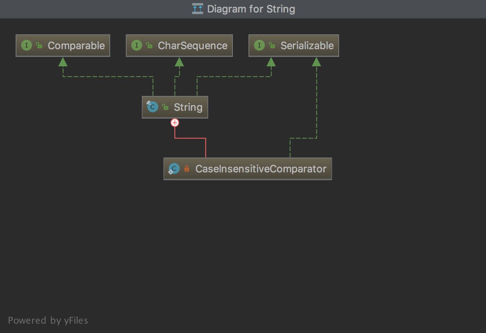

## [原文](https://juejin.im/post/5b6825bb6fb9a04f9963ca49)

# String源码分析

> 基于 JDK11  

## 概况

Java 语言使用 String 类用来代表字符串，实际上 String 对象的值是一个常量，一旦创建后不能被改变。
正式因为其不可变，所以它是线程安全地，可以多个线程共享。
相信对于 String 的使用大家都再熟悉不过的了，这里就了解下 JDK 中怎么实现 String 类的。

## String类的定义


- String类被定义为final类，意味着它不能被继承，它是个不可变类，并发程序最喜欢不可变量了。

- String类实现了Serializable, Comparable<String>, CharSequence接口。

- Comparable接口有compareTo(String s)方法，CharSequence接口有length()，
charAt(int index)，subSequence(int start,int end)方法。

```java
public final class String
    implements java.io.Serializable, Comparable<String>, CharSequence {
    
    }
```

## String的属性

```java
    @Stable
    private final byte[] value;

    private final byte coder;
 
    private int hash; 

    static final boolean COMPACT_STRINGS;

    static {
        COMPACT_STRINGS = true;
    }

 
    public static final Comparator<String> CASE_INSENSITIVE_ORDER = new CaseInsensitiveComparator();

    @Native static final byte LATIN1 = 0;
    
    @Native static final byte UTF16  = 1;
    
    private static final long serialVersionUID = -6849794470754667710L;
    
```

String类中包含一个不可变的[byte数组和coder](01、JDK9的String类内部实现变更了.md)用来存放字符串，
 
- value 用于存储字符串对象的值。

- coder 表示字符串对象所用的编码器，为LATIN1或UTF16。

- hash 为字符串对象的哈希值，默认值为0。

- COMPACT_STRINGS 表示是否使用紧凑的字符数组布局，默认使用。

- CASE_INSENSITIVE_ORDER 表示用于排序的比较器

  

## 内部类

该内部类主要是提供排序的比较器，实现了Comparator接口和compare方法，
另外一个readResolve方法用于替换反序列化时的对象。
compare核心方法的逻辑是，根据两者编码是否相同做处理，如果相同则分 Latin1 或 UTF16 两种情况比较，
类似地，如果两者编码不同，则需要用 Latin1 编码与 UTF16 编码比较，而 UTF16 则要与 Latin1 比较。

```java
    private static class CaseInsensitiveComparator
            implements Comparator<String>, java.io.Serializable {
        // use serialVersionUID from JDK 1.2.2 for interoperability
        private static final long serialVersionUID = 8575799808933029326L;

        public int compare(String s1, String s2) {
            byte v1[] = s1.value;
            byte v2[] = s2.value;
            if (s1.coder() == s2.coder()) {
                return s1.isLatin1() ? StringLatin1.compareToCI(v1, v2)
                                     : StringUTF16.compareToCI(v1, v2);
            }
            return s1.isLatin1() ? StringLatin1.compareToCI_UTF16(v1, v2)
                                 : StringUTF16.compareToCI_Latin1(v1, v2);
        }

        /** Replaces the de-serialized object. */
        private Object readResolve() { return CASE_INSENSITIVE_ORDER; }
    }

```

## 构造方法

有很多种构造方法，看主要的几个。
没有参数的构造方法直接将空字符串的 value 和 coder 进行赋值。
```java
  public String() {
        this.value = "".value;
        this.coder = "".coder;
    }
```
类似的，传入 String 对象的构造方法则将该对象对应的 value 、coder 和 hash 进行赋值。
```java
   @HotSpotIntrinsicCandidate
    public String(String original) {
        this.value = original.value;
        this.coder = original.coder;
        this.hash = original.hash;
    }

```

构造方法传入 char 数组时，主要逻辑就是如果 COMPACT_STRINGS 为 true，
即使用紧凑布局的话，则尝试将其转换成为 LATIN1 编码（即ISO-8859-1编码），
这里说尝试是因为 char 数组中可能包含了非 LATIN1 编码，此时是压缩失败的，
只有数组中全部都为 LATIN1 编码时才能压缩成功。
类似的还有传入 int 数组的，int 类型占用4个字节，只有全部符合转换才能转成 LATIN1 编码。
```java
 public String(char value[]) {
        this(value, 0, value.length, null);
    }
```

```java
    String(char[] value, int off, int len, Void sig) {
        if (len == 0) {
            this.value = "".value;
            this.coder = "".coder;
            return;
        }
        // 默认初始值为true
        if (COMPACT_STRINGS) {
            // 这里调用 StringUTF16 ,请查看另外一篇文章
            // JDK9的String类内部实现更变了
            byte[] val = StringUTF16.compress(value, off, len);
            if (val != null) {
                this.value = val;
                this.coder = LATIN1;
                return;
            }
        }
        this.coder = UTF16;
        this.value = StringUTF16.toBytes(value, off, len);
    }
```
 构造方法传入 byte 数组时，同时会传入 charsetName，即编码。
 核心操作为StringCoding.decode，它会先根据编码对 byte 数组进行解码，
 解码过程会判断是否全部都在 LATIN1 编码内，如果是则使用 LATIN1 编码，否则使用 UTF16 编码，
 并且将解码后对应的 byte 数组赋值给 String 对象的 value。
 ```java
   public String(byte bytes[], int offset, int length, String charsetName)
            throws UnsupportedEncodingException {
        if (charsetName == null)
            throw new NullPointerException("charsetName");
        checkBoundsOffCount(offset, length, bytes.length);
        //核心操作为StringCoding.decode，它会先根据编码对 byte 数组进行解码，
        StringCoding.Result ret = StringCoding.decode(charsetName, bytes, offset, length);
        this.value = ret.value;
        this.coder = ret.coder;
    }
```

## 主要方法

### length方法
字符串的长度应该是字符的长度，而不是字节数组的长度，所以这里做了右移操作，
LATIN1 编码时coder()为0，字符串长度等于字节数组长度。
UTF16 编码时coder()为1，字符串等于字节数组长度一半。

String类中获取字符串的长度通过length()方法，
其实调用的是数组的length属性，所以String没有length属性。
 
```java
public int length() {
        // 字符串的长度也与编码相关，计算时通过右移来实现。
        // 如果是 LATIN-1 编码，则右移0位，数组长度即为字符串长度。
        // 而如果是 UTF16 编码，则右移1位，数组长度的二分之一为字符串长度。
        return value.length >> coder();
    }
    
```
### isEmpty方法
通过判断 byte 数组长度是否为0来判断字符串对象是否为空。
```java

public boolean isEmpty() {
        return value.length == 0;
    }
    
```
### charAt方法

方法用于返回指定索引处的字符。索引范围为从0 到length() - 1

取字符需要根据编码来操作，如果是 LATIN1 编码，则直接取 byte 数组中对应索引的元素，并转成 char 类型即可。

如果是 UTF16 编码，因为它每个 UTF16 编码占用两个字节，所以需要将索引乘以2后作为最终索引取得两个字节并转换成 char 类型，
具体实现逻辑如getChar方法所示。
```java
/**
* 参数
  index -- 字符的索引。
  
  返回值
  返回指定索引处的字符。
*/
public char charAt(int index) {
        if (isLatin1()) {
            // 参考 StringLatin1源码分析
            return StringLatin1.charAt(value, index);
        } else {
            return StringUTF16.charAt(value, index);
        }
    }
    
static char getChar(byte[] val, int index) {
        index <<= 1;
        return (char)(((val[index++] & 0xff) << HI_BYTE_SHIFT) |
                      ((val[index]   & 0xff) << LO_BYTE_SHIFT));
    }
    
```
### codePointAt方法

获取字符串对应索引的 Unicode 代码点，根据编码做不同处理。

如果是 LATIN1 编码，直接将 byte 数组对应索引的元素与0xff做&操作并转成 int 类型。
相应的，UTF16 编码也需要对应做转换，它包含了两个字节。
```java

public int codePointAt(int index) {
        if (isLatin1()) {
            checkIndex(index, value.length);
            return value[index] & 0xff;
        }
        int length = value.length >> 1;
        checkIndex(index, length);
        return StringUTF16.codePointAt(value, index, length);
    }
    
```
### codePointBefore方法

用于返回指定索引值前一个字符的代码点，实现与codePointAt方法类似，只是索引值要减1。


```java
public int codePointBefore(int index) {
        int i = index - 1;
        if (i < 0 || i >= length()) {
            throw new StringIndexOutOfBoundsException(index);
        }
        if (isLatin1()) {
            return (value[i] & 0xff);
        }
        return StringUTF16.codePointBefore(value, index);
    }

```

### codePointCount方法

用于得到指定索引范围内代码点的个数，

- 如果是 Latin1 编码则直接索引值相减，因为每个字节肯定都属于一个代码点。

- 如果是 UTF16 编码则要检查是否存在 High-surrogate 代码和 Low-surrogate 代码，

- 如果存在则说明需要4个字节来表示一个字符，此时要把 count 减1。

```java
public int codePointCount(int beginIndex, int endIndex) {
        if (beginIndex < 0 || beginIndex > endIndex ||
            endIndex > length()) {
            throw new IndexOutOfBoundsException();
        }
        if (isLatin1()) {
            return endIndex - beginIndex;
        }
        return StringUTF16.codePointCount(value, beginIndex, endIndex);
    }
    
private static int codePointCount(byte[] value, int beginIndex, int endIndex, boolean checked) {
        assert beginIndex <= endIndex;
        int count = endIndex - beginIndex;
        int i = beginIndex;
        if (checked && i < endIndex) {
            checkBoundsBeginEnd(i, endIndex, value);
        }
        for (; i < endIndex - 1; ) {
            if (Character.isHighSurrogate(getChar(value, i++)) &&
                Character.isLowSurrogate(getChar(value, i))) {
                count--;
                i++;
            }
        }
        return count;
    }

public static int codePointCount(byte[] value, int beginIndex, int endIndex) {
        return codePointCount(value, beginIndex, endIndex, false /* unchecked */);
    }
    
```
### offsetByCodePoints方法

该方法用于返回 String 中从给定的 index 处偏移 codePointOffset 个 Unicode 代码点的索引，
要注意 Unicode 代码可能两个字节也可能四个字节。逻辑为：

index 不能小于0且不能超过。

- 当 codePointOffset 大于0时，通过 for 循环递增索引值，判断如果存在 High-surrogate 代码和 Low-surrogate 代码则索引值还需额外加1。

- 当 codePointOffset 小于0时，通过 for 循环递减索引值，判断如果存在 High-surrogate 代码和 Low-surrogate 代码则索引值还需额外减1。


```java
public int offsetByCodePoints(int index, int codePointOffset) {
        if (index < 0 || index > length()) {
            throw new IndexOutOfBoundsException();
        }
        return Character.offsetByCodePoints(this, index, codePointOffset);
    }

```

```java
public static int offsetByCodePoints(CharSequence seq, int index,
                                         int codePointOffset) {
        int length = seq.length();
        if (index < 0 || index > length) {
            throw new IndexOutOfBoundsException();
        }

        int x = index;
        if (codePointOffset >= 0) {
            int i;
            for (i = 0; x < length && i < codePointOffset; i++) {
                if (isHighSurrogate(seq.charAt(x++)) && x < length &&
                    isLowSurrogate(seq.charAt(x))) {
                    x++;
                }
            }
            if (i < codePointOffset) {
                throw new IndexOutOfBoundsException();
            }
        } else {
            int i;
            for (i = codePointOffset; x > 0 && i < 0; i++) {
                if (isLowSurrogate(seq.charAt(--x)) && x > 0 &&
                    isHighSurrogate(seq.charAt(x-1))) {
                    x--;
                }
            }
            if (i < 0) {
                throw new IndexOutOfBoundsException();
            }
        }
        return x;
    }
    
```

### getChars方法

用于获取字符串对象指定范围内的字符到目标 char 数组中，主要是根据两种编码做不同处理，
如果是 LATIN1 编码则直接将 byte 数组对应索引的元素与0xff做&操作并转成 char 类型。

而如果是 UTF16 编码则需要两个字节一起转为 char 类型。

```java
public void getChars(int srcBegin, int srcEnd, char dst[], int dstBegin) {
        checkBoundsBeginEnd(srcBegin, srcEnd, length());
        checkBoundsOffCount(dstBegin, srcEnd - srcBegin, dst.length);
        if (isLatin1()) {
            StringLatin1.getChars(value, srcBegin, srcEnd, dst, dstBegin);
        } else {
            StringUTF16.getChars(value, srcBegin, srcEnd, dst, dstBegin);
        }
    }
    
```
### getBytes方法

获取字符串指定编码的字节数组，比如 charsetName 为 utf8，则将字符串转为 utf8 编码后对应的字节数组。
如果不传参数则使用 JVM 默认编码，即Charset.defaultCharset()。

```java
public byte[] getBytes(String charsetName)
            throws UnsupportedEncodingException {
        if (charsetName == null) throw new NullPointerException();
        return StringCoding.encode(charsetName, coder(), value);
    }
public byte[] getBytes() {
        return StringCoding.encode(coder(), value);
    }
    
```

### equals方法
用于比较两字符串对象是否相等，如果引用相同则返回 true。
否则判断比较对象是否为 String 类的实例，是的话转成 String 类型，
接着比较编码是否相同，分别以 LATIN1 编码和 UTF16 编码进行比较。


```java
public boolean equals(Object anObject) {
        if (this == anObject) {
            return true;
        }
        if (anObject instanceof String) {
            String aString = (String)anObject;
            if (coder() == aString.coder()) {
                return isLatin1() ? StringLatin1.equals(value, aString.value)
                                  : StringUTF16.equals(value, aString.value);
            }
        }
        return false;
    }
    
```

### contentEquals方法
该方法用于比较字符串之间内容是否相等，逻辑为：

- 是否由 AbstractStringBuilder 实例化出来，是的话表示它为 StringBuilder 或 StringBuffer 对象。

- 如果为 StringBuffer 对象，说明它是线程安全的，需要做同步处理，调用nonSyncContentEquals方法。

- 如果为 StringBuilder 对象，它是非线程安全的，直接调用nonSyncContentEquals方法。

- 如果为 String 对象，则调用equals方法比较。

- 接下去的逻辑属于 CharSequence 对象时的逻辑。如果长度不相等直接返回 false。

- 如果为 Latin1 编码，则只比较一个字节。

- 如果为 UTF16 编码，则要两个字节地比较。

```java

public boolean contentEquals(CharSequence cs) {
        if (cs instanceof AbstractStringBuilder) {
            if (cs instanceof StringBuffer) {
                synchronized(cs) {
                   return nonSyncContentEquals((AbstractStringBuilder)cs);
                }
            } else {
                return nonSyncContentEquals((AbstractStringBuilder)cs);
            }
        }
        if (cs instanceof String) {
            return equals(cs);
        }
        int n = cs.length();
        if (n != length()) {
            return false;
        }
        byte[] val = this.value;
        if (isLatin1()) {
            for (int i = 0; i < n; i++) {
                if ((val[i] & 0xff) != cs.charAt(i)) {
                    return false;
                }
            }
        } else {
            if (!StringUTF16.contentEquals(val, cs, n)) {
                return false;
            }
        }
        return true;
    }
    
```
### nonSyncContentEquals方法逻辑为：

判断两个长度不相等则返回 false。

如果两者的编码相同，则一个个字节比较。

两者编码不同时，如果本身编码为 Latin1 编码，那就直接返回 false，而如果本身为 UTF16 编码，则两个字节地比较。


```java
private boolean nonSyncContentEquals(AbstractStringBuilder sb) {
        int len = length();
        if (len != sb.length()) {
            return false;
        }
        byte v1[] = value;
        byte v2[] = sb.getValue();
        if (coder() == sb.getCoder()) {
            int n = v1.length;
            for (int i = 0; i < n; i++) {
                if (v1[i] != v2[i]) {
                    return false;
                }
            }
        } else {
            if (!isLatin1()) { 
                return false;
            }
            return StringUTF16.contentEquals(v1, v2, len);
        }
        return true;
    }
    
```

### equalsIgnoreCase方法

该方法用于对比字符串是否相等，而且是忽略大小写。
如果是自己与自己对比则不为空则为true，否则需要两者长度相等且regionMatches方法返回true才为true。

```java
public boolean equalsIgnoreCase(String anotherString) {
        return (this == anotherString) ? true
                : (anotherString != null)
                && (anotherString.length() == length())
                && regionMatches(true, 0, anotherString, 0, length());
    }
    
```
### regionMatches方法逻辑为：

ignoreCase 如果为 false，即不忽略大小写，则需要调另外一个regionMatches方法，这里为 true，忽略此方法。
校验 offset 不能小于0且不能大于待比较长度。
coder() == other.coder()为 true，即两者编码一样时，

如果为 Latin1 编码，则以 Latin1 方式比较，
否则以 UTF16 方式比较。

如果两者编码不同，则以 Latin1 编码与 UTF16 编码比较，主要就是将 Latin1 转为 UTF16。

而如果是 UTF16 编码的话则将另外一个的 Latin1 转为 UTF16 后比较。

```java
public boolean regionMatches(boolean ignoreCase, int toffset,
            String other, int ooffset, int len) {
        if (!ignoreCase) {
            return regionMatches(toffset, other, ooffset, len);
        }
        if ((ooffset < 0) || (toffset < 0)
                || (toffset > (long)length() - len)
                || (ooffset > (long)other.length() - len)) {
            return false;
        }
        byte tv[] = value;
        byte ov[] = other.value;
        if (coder() == other.coder()) {
            return isLatin1()
              ? StringLatin1.regionMatchesCI(tv, toffset, ov, ooffset, len)
              : StringUTF16.regionMatchesCI(tv, toffset, ov, ooffset, len);
        }
        return isLatin1()
              ? StringLatin1.regionMatchesCI_UTF16(tv, toffset, ov, ooffset, len)
              : StringUTF16.regionMatchesCI_Latin1(tv, toffset, ov, ooffset, len);
    }
    
```
### compareTo方法

该方法用于比较两个字符串，主要的逻辑为：

coder() == anotherString.coder()，即两者编码相同时，

如果为 Latin1 编码则以 Latin1 的方式进行比较。
否则以 UTF16 方式进行比较，具体如何比较下面以 Latin1 编码为例子。

两者编码不同时，则将 Latin1 编码转成 UTF16 后进行比较。


```java
public int compareTo(String anotherString) {
        byte v1[] = value;
        byte v2[] = anotherString.value;
        if (coder() == anotherString.coder()) {
            return isLatin1() ? StringLatin1.compareTo(v1, v2)
                              : StringUTF16.compareTo(v1, v2);
        }
        return isLatin1() ? StringLatin1.compareToUTF16(v1, v2)
                          : StringUTF16.compareToLatin1(v1, v2);
     }
     
```

Latin1 编码的比较逻辑为：

- 首先分别获取两者的长度。

- 选取两者最小的长度。

- 开始遍历寻找两者不相同的字符，分别获取对应的 char 值并相减，大于0则说明第一个字符串大。

- 如果遍历完都相等，那么就看谁的长度长，第一个字符串长度较长就返回大于0。


```java
public static int compareTo(byte[] value, byte[] other) {
        int len1 = value.length;
        int len2 = other.length;
        int lim = Math.min(len1, len2);
        for (int k = 0; k < lim; k++) {
            if (value[k] != other[k]) {
                return getChar(value, k) - getChar(other, k);
            }
        }
        return len1 - len2;
    }
    
```

### compareToIgnoreCase方法

该方法类似 compareTo 方法，只是忽略大小写。实现通过CaseInsensitiveComparator内部类来实现。

```java
public int compareToIgnoreCase(String str) {
        return CASE_INSENSITIVE_ORDER.compare(this, str);
    }
    
```

### regionMatches方法

该方法用于检测指定区域字符串是否相等，其逻辑为：

- ignoreCase 如果为 false，即不忽略大小写，则需要调另外一个regionMatches方法。

- 校验 offset 不能小于0且不能大于待比较长度。

- coder() == other.coder()为 true，即两者编码一样时，如果为 Latin1 编码，则以 Latin1 方式比较，否则以 UTF16 方式比较。

- 如果两者编码不同，则以 Latin1 编码与 UTF16 编码比较，主要就是将 Latin1 转为 UTF16。
而如果是 UTF16 编码的话则将另外一个的 Latin1 转为 UTF16 后比较。


```java
public boolean regionMatches(boolean ignoreCase, int toffset,
            String other, int ooffset, int len) {
        if (!ignoreCase) {
            return regionMatches(toffset, other, ooffset, len);
        }
        if ((ooffset < 0) || (toffset < 0)
                || (toffset > (long)length() - len)
                || (ooffset > (long)other.length() - len)) {
            return false;
        }
        byte tv[] = value;
        byte ov[] = other.value;
        if (coder() == other.coder()) {
            return isLatin1()
              ? StringLatin1.regionMatchesCI(tv, toffset, ov, ooffset, len)
              : StringUTF16.regionMatchesCI(tv, toffset, ov, ooffset, len);
        }
        return isLatin1()
              ? StringLatin1.regionMatchesCI_UTF16(tv, toffset, ov, ooffset, len)
              : StringUTF16.regionMatchesCI_Latin1(tv, toffset, ov, ooffset, len);
    }
    
```
 大小写敏感的比较逻辑：

- 检验两者的偏移的合法性，不能小于0，也不能超出特定长度。

- 如果coder() == other.coder()，即两者编码相同时，如果为 Latin1 编码则直接比较每个字节，
而如果为 UTF16 编码则需要将位移和长度都扩大一倍，因为 UTF16 占用的空间是 Latin1 的两倍，然后再比较每个字节是否相等。

- 如果两者编码不相同时，不管两者谁是 Latin1 还是 UTF16 编码，都将它们转换成 char 类型再比较。


```java
public boolean regionMatches(int toffset, String other, int ooffset, int len) {
        byte tv[] = value;
        byte ov[] = other.value;
        if ((ooffset < 0) || (toffset < 0) ||
             (toffset > (long)length() - len) ||
             (ooffset > (long)other.length() - len)) {
            return false;
        }
        if (coder() == other.coder()) {
            if (!isLatin1() && (len > 0)) {
                toffset = toffset << 1;
                ooffset = ooffset << 1;
                len = len << 1;
            }
            while (len-- > 0) {
                if (tv[toffset++] != ov[ooffset++]) {
                    return false;
                }
            }
        } else {
            if (coder() == LATIN1) {
                while (len-- > 0) {
                    if (StringLatin1.getChar(tv, toffset++) !=
                        StringUTF16.getChar(ov, ooffset++)) {
                        return false;
                    }
                }
            } else {
                while (len-- > 0) {
                    if (StringUTF16.getChar(tv, toffset++) !=
                        StringLatin1.getChar(ov, ooffset++)) {
                        return false;
                    }
                }
            }
        }
        return true;
    }
    
```
### startsWith方法

该方法用于检测字符串是否以某个前缀开始，并且可以指定偏移。逻辑为：

- 检查偏移和长度的合法性。

- 如果coder() == prefix.coder()，即两者编码相同时，
如果为 Latin1 编码则直接比较每个字节是否相等，
如果为 UTF16 编码则要将位移扩大一倍，再比较每个字节。

- 如果两者编码不相同，如果字符串为 Latin1 编码而前缀字符串为 UTF16 编码则无法比较直接返回 false。
如果字符串为 UTF16 而前缀字符串为 Latin1，则转为 UTF16 进行比较。


```java
public boolean startsWith(String prefix) {
        return startsWith(prefix, 0);
    }
    
public boolean startsWith(String prefix, int toffset) {
        if (toffset < 0 || toffset > length() - prefix.length()) {
            return false;
        }
        byte ta[] = value;
        byte pa[] = prefix.value;
        int po = 0;
        int pc = pa.length;
        if (coder() == prefix.coder()) {
            int to = isLatin1() ? toffset : toffset << 1;
            while (po < pc) {
                if (ta[to++] != pa[po++]) {
                    return false;
                }
            }
        } else {
            if (isLatin1()) {  
                return false;
            }
            while (po < pc) {
                if (StringUTF16.getChar(ta, toffset++) != (pa[po++] & 0xff)) {
                    return false;
               }
            }
        }
        return true;
    }
    
```
### endsWith方法

该方法用于检查是否以某个字符串结尾，间接调用startsWith方法即可实现。

```java
public boolean endsWith(String suffix) {
        return startsWith(suffix, length() - suffix.length());
    }
    
```
### hashCode方法
该方法返回字符串对象的哈希值，如果已经有缓存了则直接返回，否则根据不同编码分别计算哈希值。

```java
public int hashCode() {
        int h = hash;
        if (h == 0 && value.length > 0) {
            hash = h = isLatin1() ? StringLatin1.hashCode(value)
                                  : StringUTF16.hashCode(value);
        }
        return h;
    }
    
```

下面分别是 Latin1 编码和 UTF16 编码的哈希值计算逻辑，
遍历地执行h = 31 * h + (v & 0xff) 和 h = 31 * h + getChar(value, i)运算。


```java
public static int hashCode(byte[] value) {
        int h = 0;
        for (byte v : value) {
            h = 31 * h + (v & 0xff);
        }
        return h;
    }
    
public static int hashCode(byte[] value) {
        int h = 0;
        int length = value.length >> 1;
        for (int i = 0; i < length; i++) {
            h = 31 * h + getChar(value, i);
        }
        return h;
    }
    
```

### indexOf方法

该方法用于查找字符串中第一个出现某字符或字符串的位置，有多种方法参数。
可传入 int 类型，也可传入 String 类型，另外还能传入开始位置。
根据编码的不同分别调用 StringLatin1 和 StringUTF16 的indexOf方法。

```java
public int indexOf(int ch) {
        return indexOf(ch, 0);
    }
    
```


```java
public int indexOf(int ch, int fromIndex) {
        return isLatin1() ? StringLatin1.indexOf(value, ch, fromIndex)
                          : StringUTF16.indexOf(value, ch, fromIndex);
    }

```

```java    
public int indexOf(String str) {
        if (coder() == str.coder()) {
            return isLatin1() ? StringLatin1.indexOf(value, str.value)
                              : StringUTF16.indexOf(value, str.value);
        }
        if (coder() == LATIN1) {  
            return -1;
        }
        return StringUTF16.indexOfLatin1(value, str.value);
    }
    
```


```java
public int indexOf(String str, int fromIndex) {
        return indexOf(value, coder(), length(), str, fromIndex);
    }
    
```

Latin1 编码查找逻辑，

- 判断 int 值是否能转成 byte，方法是看右移8位是否为0，为0即说明除了低8位其他都为0。

- 判断索引值的合法性并修正。

- int 值转成 byte 类型。

- 遍历检查数组中哪个值相等并返回对应索引值。

- 查找不到就返回-1。

```java
public static int indexOf(byte[] value, int ch, int fromIndex) {
        if (!canEncode(ch)) {
            return -1;
        }
        int max = value.length;
        if (fromIndex < 0) {
            fromIndex = 0;
        } else if (fromIndex >= max) {
            return -1;
        }
        byte c = (byte)ch;
        for (int i = fromIndex; i < max; i++) {
            if (value[i] == c) {
               return i;
            }
        }
        return -1;
    }

```


```java
public static boolean canEncode(int cp) {
        return cp >>> 8 == 0;
    }

```

类似地，对于 UTF16 编码也做类似处理，
但因为 unicode 包含了基本多语言平面（Basic Multilingual Plane，BMP）外，还存在补充平面。
而传入的值为 int 类型（4字节），所以如果超出 BMP 平面，此时需要4个字节，
分别用来保存 High-surrogate 和 Low-surrogate，此时就需要对比4个字节。
另外，如果查找子字符串则是从子字符串第一个字符开始匹配直到子字符串完全被匹配成功。

### lastIndexOf方法
该方法用于返回指定字符在此字符串中最后一次出现处的索引，有多种方法参数。
可传入 int 类型，也可传入 String 类型，另外还能传入开始位置。
根据编码的不同分别用 Latin1 和 UTF16 两种方式处理。
```java

public int lastIndexOf(int ch) {
        return lastIndexOf(ch, length() - 1);
    }
    
public int lastIndexOf(int ch, int fromIndex) {
        return isLatin1() ? StringLatin1.lastIndexOf(value, ch, fromIndex)
                          : StringUTF16.lastIndexOf(value, ch, fromIndex);
    }
    
public int lastIndexOf(String str) {
        return lastIndexOf(str, length());
    }
    
public int lastIndexOf(String str, int fromIndex) {
        return lastIndexOf(value, coder(), length(), str, fromIndex);
    }
    
static int lastIndexOf(byte[] src, byte srcCoder, int srcCount,
                           String tgtStr, int fromIndex) {
        byte[] tgt = tgtStr.value;
        byte tgtCoder = tgtStr.coder();
        int tgtCount = tgtStr.length();
        int rightIndex = srcCount - tgtCount;
        if (fromIndex > rightIndex) {
            fromIndex = rightIndex;
        }
        if (fromIndex < 0) {
            return -1;
        }
        if (tgtCount == 0) {
            return fromIndex;
        }
        if (srcCoder == tgtCoder) {
            return srcCoder == LATIN1
                ? StringLatin1.lastIndexOf(src, srcCount, tgt, tgtCount, fromIndex)
                : StringUTF16.lastIndexOf(src, srcCount, tgt, tgtCount, fromIndex);
        }
        if (srcCoder == LATIN1) {   
            return -1;
        }
        return StringUTF16.lastIndexOfLatin1(src, srcCount, tgt, tgtCount, fromIndex);
    }
    
```
Latin1 编码的逻辑为，

- 判断 int 值是否能转成 byte，方法是看右移8位是否为0，为0即说明除了低8位其他都为0。

- 通过Math.min(fromIndex, value.length - 1)取偏移值。

- 从偏移处开始往前遍历查找，找到即返回索引值。

- 找不到返回-1。


```java
public static int lastIndexOf(final byte[] value, int ch, int fromIndex) {
        if (!canEncode(ch)) {
            return -1;
        }
        int off  = Math.min(fromIndex, value.length - 1);
        for (; off >= 0; off--) {
            if (value[off] == (byte)ch) {
                return off;
            }
        }
        return -1;
    }
    
```
类似地，对于 UTF16 编码也做类似处理，但因为 unicode 包含了基本多语言平面（Basic Multilingual Plane，BMP）外，
还存在补充平面。而传入的值为 int 类型（4字节），所以如果超出 BMP 平面，此时需要4个字节，
分别用来保存 High-surrogate 和 Low-surrogate，此时就需要对比4个字节。

另外，如果查找子字符串则是从子字符串第一个字符开始匹配直到子字符串完全被匹配成功。

### substring方法

该方法用于获取字符串的指定子字符串。有两个方法，一个是只传入开始索引，第二个是出传入开始索引和结束索引。
逻辑通过源码已经很清晰了，先计算截取的子字符串长度，然后分别根据 Latin1 和 UTF16 两种方式生成新的 String 对象。

```java
public String substring(int beginIndex) {
        if (beginIndex < 0) {
            throw new StringIndexOutOfBoundsException(beginIndex);
        }
        int subLen = length() - beginIndex;
        if (subLen < 0) {
            throw new StringIndexOutOfBoundsException(subLen);
        }
        if (beginIndex == 0) {
            return this;
        }
        return isLatin1() ? StringLatin1.newString(value, beginIndex, subLen)
                          : StringUTF16.newString(value, beginIndex, subLen);
    }
    
public String substring(int beginIndex, int endIndex) {
        int length = length();
        checkBoundsBeginEnd(beginIndex, endIndex, length);
        int subLen = endIndex - beginIndex;
        if (beginIndex == 0 && endIndex == length) {
            return this;
        }
        return isLatin1() ? StringLatin1.newString(value, beginIndex, subLen)
                          : StringUTF16.newString(value, beginIndex, subLen);
    }
    
public static String newString(byte[] val, int index, int len) {
        return new String(Arrays.copyOfRange(val, index, index + len),
                          LATIN1);
    }
    
public static String newString(byte[] val, int index, int len) {
        if (String.COMPACT_STRINGS) {
            byte[] buf = compress(val, index, len);
            if (buf != null) {
                return new String(buf, LATIN1);
            }
        }
        int last = index + len;
        return new String(Arrays.copyOfRange(val, index << 1, last << 1), UTF16);
    }
    
```
###  subSequence 方法
等同substring方法。

```java
public CharSequence subSequence(int beginIndex, int endIndex) {
        return this.substring(beginIndex, endIndex);
    }
    
```
###  concat方法
该方法用于将指定的字符串参数连接到字符串上。逻辑为，

获取待连接字符串长度，如果长度为0则直接返回本身。
两者编码如果相同，则直接通过System.arraycopy进行拷贝并返回新的 String 对象。
如果编码不同，则使用 UTF16 编码分别将二者的值拷贝到字节数组上并返回新的 String 对象。

```java
public String concat(String str) {
        int olen = str.length();
        if (olen == 0) {
            return this;
        }
        if (coder() == str.coder()) {
            byte[] val = this.value;
            byte[] oval = str.value;
            int len = val.length + oval.length;
            byte[] buf = Arrays.copyOf(val, len);
            System.arraycopy(oval, 0, buf, val.length, oval.length);
            return new String(buf, coder);
        }
        int len = length();
        byte[] buf = StringUTF16.newBytesFor(len + olen);
        getBytes(buf, 0, UTF16);
        str.getBytes(buf, len, UTF16);
        return new String(buf, UTF16);
    }
    
```
###  replace方法
该方法用于替换字符串中指定的字符，分两种编码处理。

```java
public String replace(char oldChar, char newChar) {
        if (oldChar != newChar) {
            String ret = isLatin1() ? StringLatin1.replace(value, oldChar, newChar)
                                    : StringUTF16.replace(value, oldChar, newChar);
            if (ret != null) {
                return ret;
            }
        }
        return this;
    }
    
```


```java
 public static String replace(byte[] value, char oldChar, char newChar) {
        if (canEncode(oldChar)) {
            int len = value.length;
            int i = -1;
            while (++i < len) {
                if (value[i] == (byte)oldChar) {
                    break;
                }
            }
            if (i < len) {
                if (canEncode(newChar)) {
                    byte buf[] = new byte[len];
                    for (int j = 0; j < i; j++) {   
                        buf[j] = value[j];
                    }
                    while (i < len) {
                        byte c = value[i];
                        buf[i] = (c == (byte)oldChar) ? (byte)newChar : c;
                        i++;
                    }
                    return new String(buf, LATIN1);
                } else {
                    byte[] buf = StringUTF16.newBytesFor(len);
                    inflate(value, 0, buf, 0, i);
                    while (i < len) {
                        char c = (char)(value[i] & 0xff);
                        StringUTF16.putChar(buf, i, (c == oldChar) ? newChar : c);
                        i++;
                    }
                    return new String(buf, UTF16);
                }
            }
        }
        return null; 
    }

```


```java
 public String replace(CharSequence target, CharSequence replacement) {
        String tgtStr = target.toString();
        String replStr = replacement.toString();
        int j = indexOf(tgtStr);
        if (j < 0) {
            return this;
        }
        int tgtLen = tgtStr.length();
        int tgtLen1 = Math.max(tgtLen, 1);
        int thisLen = length();

        int newLenHint = thisLen - tgtLen + replStr.length();
        if (newLenHint < 0) {
            throw new OutOfMemoryError();
        }
        StringBuilder sb = new StringBuilder(newLenHint);
        int i = 0;
        do {
            sb.append(this, i, j).append(replStr);
            i = j + tgtLen;
        } while (j < thisLen && (j = indexOf(tgtStr, j + tgtLen1)) > 0);
        return sb.append(this, i, thisLen).toString();
    }
    
    
```
###  replaceFirst和replaceAll
都是用正则去实现。

```java
public String replaceFirst(String regex, String replacement) {
        return Pattern.compile(regex).matcher(this).replaceFirst(replacement);
    }
    
public String replaceAll(String regex, String replacement) {
        return Pattern.compile(regex).matcher(this).replaceAll(replacement);
    }
    
```
###  split方法
该方式用于切分字符串，实现中首先会判断能不能不用正则引擎，如果可以则直接切分，否则采用正则引擎切分。

```java
public String[] split(String regex) {
        return split(regex, 0);
    }
    
public String[] split(String regex, int limit) {
        char ch = 0;
        if (((regex.length() == 1 &&
             ".$|()[{^?*+\\".indexOf(ch = regex.charAt(0)) == -1) ||
             (regex.length() == 2 &&
              regex.charAt(0) == '\\' &&
              (((ch = regex.charAt(1))-'0')|('9'-ch)) < 0 &&
              ((ch-'a')|('z'-ch)) < 0 &&
              ((ch-'A')|('Z'-ch)) < 0)) &&
            (ch < Character.MIN_HIGH_SURROGATE ||
             ch > Character.MAX_LOW_SURROGATE))
        {
            int off = 0;
            int next = 0;
            boolean limited = limit > 0;
            ArrayList<String> list = new ArrayList<>();
            while ((next = indexOf(ch, off)) != -1) {
                if (!limited || list.size() < limit - 1) {
                    list.add(substring(off, next));
                    off = next + 1;
                } else {    
                    int last = length();
                    list.add(substring(off, last));
                    off = last;
                    break;
                }
            }
            if (off == 0)
                return new String[]{this};

            if (!limited || list.size() < limit)
                list.add(substring(off, length()));

            int resultSize = list.size();
            if (limit == 0) {
                while (resultSize > 0 && list.get(resultSize - 1).length() == 0) {
                    resultSize--;
                }
            }
            String[] result = new String[resultSize];
            return list.subList(0, resultSize).toArray(result);
        }
        return Pattern.compile(regex).split(this, limit);
    }
    
```
###  join方法
用某个分隔符将字符串数组连接起来。主要是通过 StringJoiner 类来实现。


```java
public static String join(CharSequence delimiter, CharSequence... elements) {
        Objects.requireNonNull(delimiter);
        Objects.requireNonNull(elements);
        StringJoiner joiner = new StringJoiner(delimiter);
        for (CharSequence cs: elements) {
            joiner.add(cs);
        }
        return joiner.toString();
    }
    
public static String join(CharSequence delimiter,
            Iterable<? extends CharSequence> elements) {
        Objects.requireNonNull(delimiter);
        Objects.requireNonNull(elements);
        StringJoiner joiner = new StringJoiner(delimiter);
        for (CharSequence cs: elements) {
            joiner.add(cs);
        }
        return joiner.toString();
    }
    
```
###  StringJoiner 的 add 方法和 toString 方法如下。
add 方法主要逻辑就是将每个字符串赋值到字符串数组，并且要将分隔符的长度累加起来。
toString 方法主要是将字符串数组和分隔符连接起来并返回最终的字符串。

```java
public StringJoiner add(CharSequence newElement) {
        final String elt = String.valueOf(newElement);
        if (elts == null) {
            elts = new String[8];
        } else {
            if (size == elts.length)
                elts = Arrays.copyOf(elts, 2 * size);
            len += delimiter.length();
        }
        len += elt.length();
        elts[size++] = elt;
        return this;
    }
    
```

```java
        public String toString() {
        final String[] elts = this.elts;
        if (elts == null && emptyValue != null) {
            return emptyValue;
        }
        final int size = this.size;
        final int addLen = prefix.length() + suffix.length();
        if (addLen == 0) {
            compactElts();
            return size == 0 ? "" : elts[0];
        }
        final String delimiter = this.delimiter;
        final char[] chars = new char[len + addLen];
        int k = getChars(prefix, chars, 0);
        if (size > 0) {
            k += getChars(elts[0], chars, k);
            for (int i = 1; i < size; i++) {
                k += getChars(delimiter, chars, k);
                k += getChars(elts[i], chars, k);
            }
        }
        k += getChars(suffix, chars, k);
        return jla.newStringUnsafe(chars);
    }
    
```


```java
private void compactElts() {
        if (size > 1) {
            final char[] chars = new char[len];
            int i = 1, k = getChars(elts[0], chars, 0);
            do {
                k += getChars(delimiter, chars, k);
                k += getChars(elts[i], chars, k);
                elts[i] = null;
            } while (++i < size);
            size = 1;
            elts[0] = jla.newStringUnsafe(chars);
        }
    }
    
```

###  toLowerCase方法

用于转成小写，需要分两种编码处理，下面看 Latin1 编码的处理逻辑，


```java
public String toLowerCase(Locale locale) {
        return isLatin1() ? StringLatin1.toLowerCase(this, value, locale)
                          : StringUTF16.toLowerCase(this, value, locale);
    }
    
public String toLowerCase() {
        return toLowerCase(Locale.getDefault());
    }
    
```

遍历字节数组，分别转成 int 类型值，然后通过Character.toLowerCase检查是否全部为小写，如果是则直接返回字符串本身。
如果为(lang == "tr" || lang == "az" || lang == "lt")三者语言，则额外处理，因为不在 Latin1 编码中。
正常情况下先用System.arraycopy赋值一个新数组，然后通过遍历源数组，将一个个字符转成小写再赋给新数组。
根据新数组创建新 String 对象并返回。


```java
public static String toLowerCase(String str, byte[] value, Locale locale) {
        if (locale == null) {
            throw new NullPointerException();
        }
        int first;
        final int len = value.length;
        for (first = 0 ; first < len; first++) {
            int cp = value[first] & 0xff;
            if (cp != Character.toLowerCase(cp)) { 
                break;
            }
        }
        if (first == len)
            return str;
        String lang = locale.getLanguage();
        if (lang == "tr" || lang == "az" || lang == "lt") {
            return toLowerCaseEx(str, value, first, locale, true);
        }
        byte[] result = new byte[len];
        System.arraycopy(value, 0, result, 0, first);  
        for (int i = first; i < len; i++) {
            int cp = value[i] & 0xff;
            cp = Character.toLowerCase(cp);
            if (!canEncode(cp)) {                      
                return toLowerCaseEx(str, value, first, locale, false);
            }
            result[i] = (byte)cp;
        }
        return new String(result, LATIN1);
    }
    
```
###  toUpperCase方法
用于将字符串成转成大写，实现逻辑与上面的转小写一样。

```java
public String toUpperCase(Locale locale) {
        return isLatin1() ? StringLatin1.toUpperCase(this, value, locale)
                          : StringUTF16.toUpperCase(this, value, locale);
    }
    
public String toUpperCase() {
        return toUpperCase(Locale.getDefault());
    }
    
```
###  trim方法
用于删除字符串的头尾空白符，分两种编码处理，以 Latin1 为例，

```java
public String trim() {
        String ret = isLatin1() ? StringLatin1.trim(value)
                                : StringUTF16.trim(value);
        return ret == null ? this : ret;
    }

```

- 获取字节数组长度。

- 遍历看需要在字符串开头跳过多少个字符，小于等于空格 ASCII 值的都算在内。

- 遍历看需要在字符串尾部跳过多少个字符。

- 根据开头结尾跳过的空格数来创建新的 String 对象。


```java
public static String trim(byte[] value) {
        int len = value.length;
        int st = 0;
        while ((st < len) && ((value[st] & 0xff) <= ' ')) {
            st++;
        }
        while ((st < len) && ((value[len - 1] & 0xff) <= ' ')) {
            len--;
        }
        return ((st > 0) || (len < value.length)) ?
            newString(value, st, len - st) : null;
    }
    
```
###  toString方法

直接返回 this。

```java
public String toString() {
        return this;
    }
    
```
###  toCharArray方法

将字符串转成 char 数组，分两种编码处理，以 Latin1 为例，核心就在(char)(src\[srcOff++] & 0xff)。

```java
public char[] toCharArray() {
        return isLatin1() ? StringLatin1.toChars(value)
                          : StringUTF16.toChars(value);
    }


```


```java
 public static char[] toChars(byte[] value) {
        char[] dst = new char[value.length];
        inflate(value, 0, dst, 0, value.length);
        return dst;
    }
    
```

```java
public static void inflate(byte[] src, int srcOff, char[] dst, int dstOff, int len) {
        for (int i = 0; i < len; i++) {
            dst[dstOff++] = (char)(src[srcOff++] & 0xff);
        }
    }

```
    
###  format方法
格式化字符串，通过 Formatter 来实现。


```java
public static String format(String format, Object... args) {
        return new Formatter().format(format, args).toString();
    }

public static String format(Locale l, String format, Object... args) {
        return new Formatter(l).format(format, args).toString();
    }
    
```

###  valueOf方法

用于将传入的对象转成 String 对象，可传入多种类型参数。

- Objet 时，为空则返回"null"字符串，否则obj.toString()。

- char 数组时，直接new 一个 String 对象。

- boolean 时，返回"true" 或 "false"字符串。

- char 时，优先尝试转成 Latin1 编码的 String 读，否则用 UTF16。

- int 时，Integer.toString(i)。

- long 时，Long.toString(l)。

- float 时，Float.toString(f)。

- double 时，Double.toString(d)。

```java
public static String valueOf(Object obj) {
        return (obj == null) ? "null" : obj.toString();
    }
    
public static String valueOf(char data[]) {
        return new String(data);
    }
    
public static String valueOf(char data[], int offset, int count) {
        return new String(data, offset, count);
    }
    
public static String valueOf(boolean b) {
        return b ? "true" : "false";
    }
    
public static String valueOf(char c) {
        if (COMPACT_STRINGS && StringLatin1.canEncode(c)) {
            return new String(StringLatin1.toBytes(c), LATIN1);
        }
        return new String(StringUTF16.toBytes(c), UTF16);
    }
    
public static String valueOf(int i) {
        return Integer.toString(i);
    }
    
public static String valueOf(long l) {
        return Long.toString(l);
    }
    
public static String valueOf(float f) {
        return Float.toString(f);
    }
    
public static String valueOf(double d) {
        return Double.toString(d);
    }
    
```
###  intern方法
一个 native 方法，具体实现可看前面的文章《深入谈谈String.intern()在JVM的实现》
```java
public native String intern();

```

###  getBytes方法

用于复制指定的字节数组，主要是通过System.arraycopy来实现。
但如果目标数组为 UTF16 编码，则需将高位和低位都赋值到字节数组。

```java
void getBytes(byte dst[], int dstBegin, byte coder) {
        if (coder() == coder) {
            System.arraycopy(value, 0, dst, dstBegin << coder, value.length);
        } else {
            StringLatin1.inflate(value, 0, dst, dstBegin, value.length);
        }
    }
    
public static void inflate(byte[] src, int srcOff, byte[] dst, int dstOff, int len) {
        checkBoundsOffCount(dstOff, len, dst);
        for (int i = 0; i < len; i++) {
            putChar(dst, dstOff++, src[srcOff++] & 0xff);
        }
    }
    
static void putChar(byte[] val, int index, int c) {
        index <<= 1;
        val[index++] = (byte)(c >> HI_BYTE_SHIFT);
        val[index]   = (byte)(c >> LO_BYTE_SHIFT);
    }
    
```
###  coder方法
获取字符串的编码，如果使用非紧凑布局则一定为 UTF16，否则可能为 Latin1 或 UTF16。

```java
byte coder() {
        return COMPACT_STRINGS ? coder : UTF16;
    }
    
```
###  isLatin1方法
判断是否为 Latin1 编码。必须是紧凑布局且为 LATIN1 才属于 Latin1 编码。

```java
private boolean isLatin1() {
        return COMPACT_STRINGS && coder == LATIN1;
    }
 
    
```


## 总结

- [原文](https://juejin.im/post/59fffddc5188253d6816f9c1)

- String被final修饰，一旦被创建，无法更改

- String类的所有方法都没有改变字符串本身的值，都是返回了一个新的对象。

- 如果你需要一个可修改的字符串，应该使用StringBuilder或者 StringBuffer。

-  如果你只需要创建一个字符串，你可以使用双引号的方式，如果你需要在堆中创建一个新的对象，你可以选择构造函数的方式。

-  在使用StringBuilder时尽量指定大小这样会减少扩容的次数，有助于提升效率。
 
  

