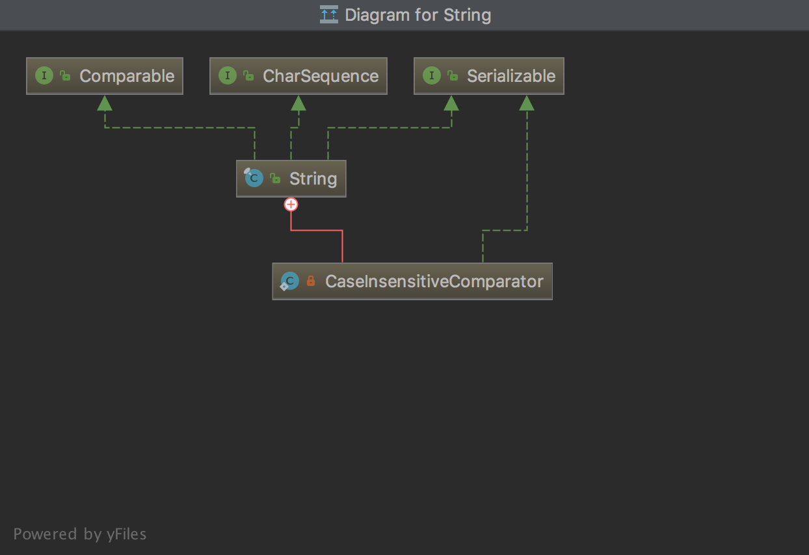

## [原文](https://www.jianshu.com/p/74b2d0246cf2)

#  String源码阅读(一：类定义及其字段说明)

## 概述

查阅String的源码时，首先需要阅读一下它的顶部注释，它里面说明了一些String在Java中的一些基本情况，
了解它们有助于对后续源码的深入了解。这里我的java版本是 jdk 11。

## 注释部分
下面大致描述一下String源码中的注释上到底说了那些内容：

> String是Java中用于表示字符串的类，所有在Java程序中表示成形如："abc"这种双引号括起来的形式都是String的实例。
> 
> String是常量，一旦创建之后不可更改，但是可以通过其他的方式来创建可变的字符串，
> 如：StringBuffer等。正因为String的不可变特性，所以它可以共享。另外：String str = "abc"；它等价于
> ```java
> 
> char[] data = {'a','b','c'}; 
> String str = new String(data);
> 
> ```
> String类中提供了很多不同用处的方法，可以校验字符串中每一个字符，
> 如：比较字符串，查找字符串，提取子串，拷贝字符串中的内容将其转换成大写或者小写的形式，
> 这些操作都是基于Character类指定的Unicode标准版本。
> 
> String类中也提供了一些特殊的方法用于字符串连接，以及将其他类型转换成String类型，
如果需要了解更多的关于字符串连接和类型转换的内容，可以查阅The Java Language Specification。
> 
> 在构造String对象的时候，如果构造函数中没有参数传入，在此对象上调用方法会导致NullPointerException异常。
> 
> Java中的字符串采用的是UTF-16的格式来展示的，多余的部分会通过一种叫做“surrogate pairs”来填充。
这个概念在Unicode Representations中有介绍。补充字符在String中会占用两个字符位置。String中提供了一些方法来处理Unicode字符单元。
> 
> 如果没有特别指明，String对象的比较不需要进行区域设置。在java.text.Collator类中提供了更细粒度的，基于区域敏感的字符串比较。
> 
> Java中字符串的连接操作取决于Java的编译器，编译器中可能使用StringBuffer、StringBuilder，
甚至是StringConcatFactory来进行字符串的连接，它取决于JDK的版本。
将其他类型转换成String可以通过toString方法，该方法是定义在Object类中的，所以Java中所有的类都继承了这个方法。

## 定义
首先看String类的定义：
```java

public final class String
 implements java.io.Serializable, Comparable<String>, CharSequence
 
```


       首先它实现了Serializable接口，说明String的对象是可以进行传输和持久化的。
这个很好理解，毕竟现在很多的远端调用，数据传输之类的操作，字符串在其中起到了很大的作用。

       它实现了Comparable接口，说明String对象是可比的，该接口中就定义了一个compareTo方法，
后面会说道String中重写的这个compareTo。说道Comparable，这里就稍微提一下Comparator，
它是Java中的一个比较器，在Java中如果类本身是具有可比较的，可以实现Comparable接口并重写比较方法即可，
但是有些情况下，可能类中没有实现该接口，但是在一些特殊业务场景下它们之间需要进行比较，就可以自己写一个比较器实现此接口，
将需要比较的类型传入进去，手动实现内部的比较逻辑。

       最后它实现了CharSequence接口，这个接口其实就是就是一个规范约定，这个接口本身就是表示一种可读的字符序列值，
对于不同的字符序列，它提供了一个统一且只读的方式来处理。但是它本身不会细化关于equals和hashCode方法的处理，
因此不同的类可以有不同的equals和hashCode方法实现，所以将任意的CharSequence实例用作集合中的元素映射或map中的key是不合适的，
因为很明显它无法保证唯一性。

       另外：该类是用final修饰，所以无法继承，其实不仅String类如此，Java中的八种基本类型对应的包装类都是final修饰，都无法继承。

## String的属性

```java
    @Stable
    private final byte[] value;

    private final byte coder;
 
    private int hash; 

    static final boolean COMPACT_STRINGS;

    static {
        COMPACT_STRINGS = true;
    }

 
    public static final Comparator<String> CASE_INSENSITIVE_ORDER = new CaseInsensitiveComparator();

    @Native static final byte LATIN1 = 0;
    
    @Native static final byte UTF16  = 1;
    
    private static final long serialVersionUID = -6849794470754667710L;
    
```

String类中包含一个不可变的[byte数组和coder](01、JDK9的String类内部实现变更了.md)用来存放字符串，
 
- value 用于存储字符串对象的值。

- coder 表示字符串对象所用的编码器，为LATIN1或UTF16。

- hash 为字符串对象的哈希值，默认值为0。

- COMPACT_STRINGS 表示是否使用紧凑的字符数组布局，默认使用。

- CASE_INSENSITIVE_ORDER 表示用于排序的比较器


### value

```java
@Stable
private final byte[] value;

```
       这个一个byte数组，字符串的值都存储在这个数组中，
这个该字段可以看到是final修饰，所以一旦赋值之后不可改变，
这也印证了上面说的String是不可变的这一观点。

       另外这里使用了Stable注解，这个注解只有用在被根加载器加载的类中才有作用，否则加载器会忽略它。
它用在这里的目的表示当前value中的值是可信任的，Stable用在这里很安全，因为value的值不会为null。这里看一个例子：
```java

String str = new String();
Field field = str.getClass().getDeclaredField("value");
field.setAccessible(true);
System.out.println(field.get(str)); // 结果为：[B@4157f54e

```
       这里我声明了一个空字符串，通过反射，拿到此时的value的值，但是从结果可以看到，value不是null。

### coder和hash

```java
private final byte coder;
private int hash;

```
       该字段用于区分value中内容的编码格式，它受虚拟机信任， 
如果在构造对象之后重写该字段的内容会导致错误。
后面介绍一些String方法的时候会使用到它，不同的编码方式，解析和比较都会有不同。

       hash默认是0，它用于存储String对象对应的hashCode值。

### serialVersionUID

```java
private static final long serialVersionUID = -6849794470754667710L;

```
       这个就是序列号，用于序列化和反序列化的操作标识，不用多说，这里的值使用的是从JDK1.0.2版本中的序列号值，
很明显就是为了和之前版本的String对象反序列化的时候能够兼容。
```java

COMPACT_STRINGS
static final boolean COMPACT_STRINGS;
static {
 COMPACT_STRINGS = true;
}

```
       可以看到它在类加载的时候就默认赋值为true了，这个字段的字面意思就是压缩字符串，
其实它的作用主要体现在编译器的优化上面，如果该字段设置为false，那么value中内容就永远使用UTF-16编码，
在有些情况下对于JIT编译器的的执行有一定的优化作用，这里源码的注释中提供了一个示例：

```java
//有代码如下
if (coder == LATIN1) { ... }
//它可以被改写成如下方式：
if (COMPACT_STRINGS && coder == LATIN1) { ... }
//JIT优化的时候，就可以将上面的代码进行压缩处理，等价于：
//如果COMPACT_STRINGS == true 可以优化成
if (coder == LATIN1) { ... }
//如果COMPACT_STRINGS == false
if (false) { ... }

```
### serialPersistentFields

该字段主要是跟序列化的协议有关，这里暂时就不做深入考虑。
后面的讨论中更多的会以value字段来讨论，其他字段不在讨论范围，在某些特殊情况下可能会用到，真正使用到的时候再讨论。


