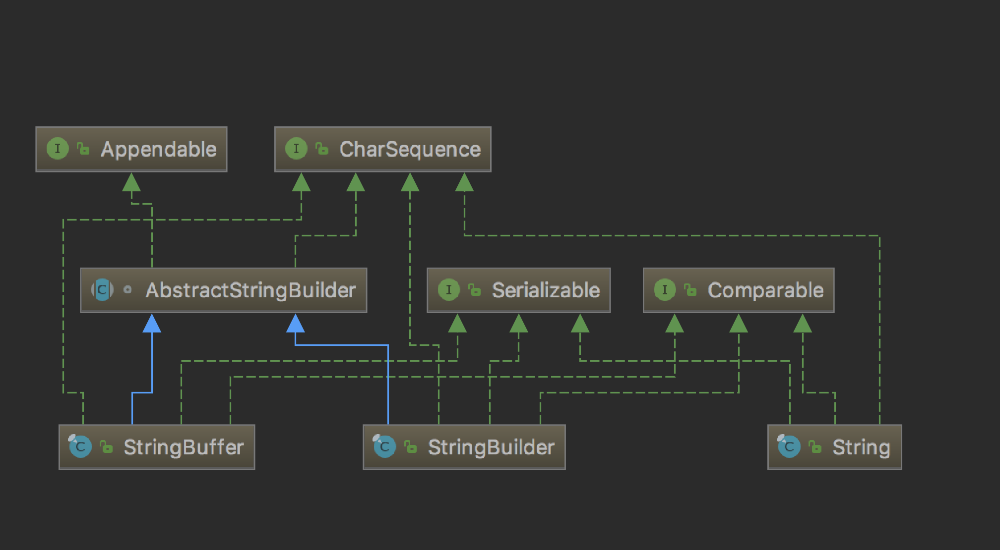

## [原文](https://juejin.im/post/5b13a6dc6fb9a01e6949a981)

# StringBuffer 源码分析


## 概况

Java 中处理字符串时经常使用的 String 是一个常量，一旦创建后不能被改变。
为了提供可修改的操作，引入了 StringBuilder 类，可看前面的文章[《StringBuilder源码分析》](06、StringBuilder源码分析.md)。
但它不是线程安全的，只用在单线程场景下。所以引入了线程安全的 StringBuffer 类，用于多线程场景。
总的来说主要是通过在必要的方法上加 synchronized 来实现线程安全。



## 类定义
```java
 public final class StringBuffer
    extends AbstractStringBuilder
    implements java.io.Serializable, Comparable<StringBuffer>, CharSequence {
    
}
```

StringBuffer 类被声明为 final，说明它不能再被继承。
同时它继承了 AbstractStringBuilder 类，并实现了 Serializable 和 CharSequence 两个接口。

其中 Serializable 接口表明其可以序列化。
CharSequence 接口用来实现获取字符序列的相关信息，接口定义如下：

- length()获取字符序列长度。

- charAt(int index)获取某个索引对应字符。

- subSequence(int start, int end)获取指定范围子字符串。

- toString()转成字符串对象。

- chars()用于获取字符序列的字符的 int 类型值的流，该接口提供了默认的实现。

- codePoints()用于获取字符序列的代码点的 int 类型的值的流，提供了默认的实现。


```java
public interface CharSequence {

    int length();

    char charAt(int index);

    CharSequence subSequence(int start, int end);
    
    public String toString();

    /**
     * @since 1.8
     */
    public default IntStream chars() {
        class CharIterator implements PrimitiveIterator.OfInt {
            int cur = 0;

            public boolean hasNext() {
                return cur < length();
            }

            public int nextInt() {
                if (hasNext()) {
                    return charAt(cur++);
                } else {
                    throw new NoSuchElementException();
                }
            }

            @Override
            public void forEachRemaining(IntConsumer block) {
                for (; cur < length(); cur++) {
                    block.accept(charAt(cur));
                }
            }
        }

        return StreamSupport.intStream(() ->
                Spliterators.spliterator(
                        new CharIterator(),
                        length(),
                        Spliterator.ORDERED),
                Spliterator.SUBSIZED | Spliterator.SIZED | Spliterator.ORDERED,
                false);
    }

    /**
     * @since 1.8
     */
    public default IntStream codePoints() {
        class CodePointIterator implements PrimitiveIterator.OfInt {
            int cur = 0;

            @Override
            public void forEachRemaining(IntConsumer block) {
                final int length = length();
                int i = cur;
                try {
                    while (i < length) {
                        char c1 = charAt(i++);
                        if (!Character.isHighSurrogate(c1) || i >= length) {
                            block.accept(c1);
                        } else {
                            char c2 = charAt(i);
                            if (Character.isLowSurrogate(c2)) {
                                i++;
                                block.accept(Character.toCodePoint(c1, c2));
                            } else {
                                block.accept(c1);
                            }
                        }
                    }
                } finally {
                    cur = i;
                }
            }

            public boolean hasNext() {
                return cur < length();
            }

            public int nextInt() {
                final int length = length();

                if (cur >= length) {
                    throw new NoSuchElementException();
                }
                char c1 = charAt(cur++);
                if (Character.isHighSurrogate(c1) && cur < length) {
                    char c2 = charAt(cur);
                    if (Character.isLowSurrogate(c2)) {
                        cur++;
                        return Character.toCodePoint(c1, c2);
                    }
                }
                return c1;
            }
        }

        return StreamSupport.intStream(() ->
                Spliterators.spliteratorUnknownSize(
                        new CodePointIterator(),
                        Spliterator.ORDERED),
                Spliterator.ORDERED,
                false);
    }

    /**
     * @since 11
     */
    @SuppressWarnings("unchecked")
    public static int compare(CharSequence cs1, CharSequence cs2) {
        if (Objects.requireNonNull(cs1) == Objects.requireNonNull(cs2)) {
            return 0;
        }

        if (cs1.getClass() == cs2.getClass() && cs1 instanceof Comparable) {
            return ((Comparable<Object>) cs1).compareTo(cs2);
        }

        for (int i = 0, len = Math.min(cs1.length(), cs2.length()); i < len; i++) {
            char a = cs1.charAt(i);
            char b = cs2.charAt(i);
            if (a != b) {
                return a - b;
            }
        }

        return cs1.length() - cs2.length();
    }

}

```

## 主要属性

```java
private transient String toStringCache;

byte[] value;

byte coder;

int count;

```
 
- toStringCache 用于缓存调用toString方法生成的 String 对象，避免每次都要根据编码生成 String 对象。

- value 该数组用于存储字符串值。

- coder 表示该字符串对象所用的编码器。

- count 表示该字符串对象中已使用的字符数。

## 构造方法

有若干种构造方法，可以指定容量大小参数，如果没有指定则构造方法默认创建容量为16的字符串对象。
如果 COMPACT_STRINGS 为 true，即使用紧凑布局则使用 LATIN1 编码（ISO-8859-1编码），
则开辟长度为16的 byte 数组。而如果是 UTF16 编码则开辟长度为32的 byte 数组。

```java
public StringBuffer() {
        super(16);
    }

```


```java    
AbstractStringBuilder(int capacity) {
        if (COMPACT_STRINGS) {
            value = new byte[capacity];
            coder = LATIN1;
        } else {
            value = StringUTF16.newBytesFor(capacity);
            coder = UTF16;
        }
    }

```


```java    
public StringBuffer(int capacity) {
        super(capacity);
    }

```    
如果构造函数传入的参数为 String 类型，则会开辟长度为str.length() + 16的 byte 数组，
并通过append方法将字符串对象添加到 byte 数组中。

```java
public StringBuffer(String str) {
        super(str.length() + 16);
        append(str);
    }
    
```

类似地，传入参数为 CharSequence 类型时也做相同处理。

```java
public StringBuffer(CharSequence seq) {
        this(seq.length() + 16);
        append(seq);
    }
    
```
## 主要方法

> 为了实现线程安全，其实最简单也可能是最没效率的方法就是通过对某些方法进行同步，以此允许并发操作。
所以 StringBuffer 和 StringBuilder 其实实现逻辑几乎都一样，
并且抽象到 AbstractStringBuilder 抽象类中来实现，只是 StringBuffer 将一些必要的方法进行同步处理了。

StringBuffer 中大多数方法都只是加了 synchronized。
比如下面该方法加了同步来保证计数的准确性。
此外还包含很多其他方法，比如
codePointCount、capacity、ensureCapacity、codePointAt、codePointBefore、
charAt、getChars、setCharAt、substring、subSequence、indexOf、lastIndexOf、getBytes。

```java
@Override
public synchronized int length() {
        return count;
    }
    
@Override
public synchronized void setLength(int newLength) {
        toStringCache = null;
        super.setLength(newLength);
    }
```

### trimToSize方法
该方法用于将该 StringBuffer 对象的容量压缩到与字符串长度大小相等。
重写了该方法，主要是添加了同步，保证了数组复制过程的准确性。

```
@Override
public synchronized void trimToSize() {
        super.trimToSize();
    }

public void trimToSize() {
        int length = count << coder;
        if (length < value.length) {
            value = Arrays.copyOf(value, length);
        }
    }
```

### append方法

有多个append方法，都只是传入的参数不同而已，同样是使用了 synchronized，
另外它还会清理缓存 toStringCache，这是因为 append 后的字符串的值已经变了，所以需要重置缓存。
重置缓存的方法还包括：appendCodePoint、delete、deleteCharAt、replace、insert、reverse。
```
@Override
public synchronized StringBuffer append(String str) {
        toStringCache = null;
        super.append(str);
        return this;
    }
```
    
### toString方法
使用同步操作，先判断缓存是否为空，如果为空则先根据编码（Latin1 或 UTF16）创建对应编码占位的 String 对象，
然后创建新 String 对象并返回。
```java
@Override
public synchronized String toString() {
        if (toStringCache == null) {
            return toStringCache =
                    isLatin1() ? StringLatin1.newString(value, 0, count)
                               : StringUTF16.newString(value, 0, count);
        }
        return new String(toStringCache);
    }
```    

### writeObject方法
该方法是序列化方法，分别将 value、count、shared 字段的值写入。
```java
private synchronized void writeObject(java.io.ObjectOutputStream s)
        throws java.io.IOException {
        java.io.ObjectOutputStream.PutField fields = s.putFields();
        char[] val = new char[capacity()];
        if (isLatin1()) {
            StringLatin1.getChars(value, 0, count, val, 0);
        } else {
            StringUTF16.getChars(value, 0, count, val, 0);
        }
        fields.put("value", val);
        fields.put("count", count);
        fields.put("shared", false);
        s.writeFields();
    }
```    

### readObject方法
该方法是反序列方法，分别读取 value 和 count，并且初始化对象内的字节数组和编码标识。

```java
private void readObject(java.io.ObjectInputStream s)
        throws java.io.IOException, ClassNotFoundException {
        java.io.ObjectInputStream.GetField fields = s.readFields();
        char[] val = (char[])fields.get("value", null);
        initBytes(val, 0, val.length);
        count = fields.get("count", 0);
    }
    
void initBytes(char[] value, int off, int len) {
        if (String.COMPACT_STRINGS) {
            this.value = StringUTF16.compress(value, off, len);
            if (this.value != null) {
                this.coder = LATIN1;
                return;
            }
        }
        this.coder = UTF16;
        this.value = StringUTF16.toBytes(value, off, len);
    }

```


 
