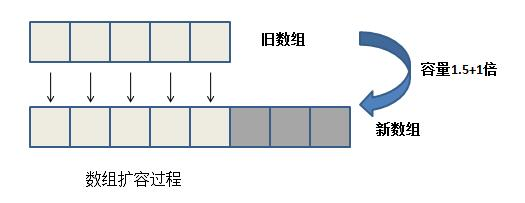

## [原文](https://www.jianshu.com/p/2cd7be850540)

## [原文](https://blog.csdn.net/fighterandknight/article/details/61240861)


# ArrayList 源码分析

## 前言
今天来介绍下ArrayList，在集合框架整体框架一章中，我们介绍了List接口，
ArrayList继承了AbstractList，实现了List。
ArrayList在工作中经常用到，所以要弄懂这个类是极其重要的。

构造图如下:
- 蓝色线条：继承
- 绿色线条：接口实现


## ArrayList简介

ArrayList 是一个数组队列，相当于 动态数组。与Java中的数组相比，它的容量能动态增长。它继承于AbstractList，
实现了List, RandomAccess, Cloneable, java.io.Serializable这些接口。

ArrayList 继承了AbstractList，实现了List。它是一个数组队列，提供了相关的添加、删除、修改、遍历等功能。
ArrayList 实现了RandmoAccess接口，即提供了随机访问功能。RandmoAccess是java中用来被List实现，为List提供快速访问功能的。
在ArrayList中，我们即可以通过元素的序号快速获取元素对象；这就是快速随机访问。
稍后，我们会比较List的“快速随机访问”和“通过Iterator迭代器访问”的效率。

ArrayList 实现了Cloneable接口，即覆盖了函数clone()，能被克隆。

ArrayList 实现java.io.Serializable接口，这意味着ArrayList支持序列化，能通过序列化去传输。

和Vector不同，ArrayList中的操作不是线程安全的！
所以，建议在单线程中才使用ArrayList，而在多线程中可以选择Vector或者CopyOnWriteArrayList。


## ArrayList定义

```java
/**
 * @param <E> the type of elements in this list
 *
 * @author  Josh Bloch
 * @author  Neal Gafter
 * @see     Collection
 * @see     List
 * @see     LinkedList
 * @see     Vector
 * @since   1.2
 */
public class ArrayList<E> extends AbstractList<E>
        implements List<E>, RandomAccess, Cloneable, java.io.Serializable
{
    
}
```

## ArrayList属性

顾名思义哈，ArrayList就是用数组实现的List容器，既然是用数组实现，当然底层用数组来保存数据啦

```java
//如果是无参构造方法创建对象的话，ArrayList的初始化长度为10，这是一个静态常量
private static final int DEFAULT_CAPACITY = 10;

//在这里可以看到我们不解的EMPTY_ELEMENTDATA实际上是一个空的对象数组
    private static final Object[] EMPTY_ELEMENTDATA = {};

// 保存ArrayList数据的对象数组缓冲区 空的ArrayList的elementData = EMPTY_ELEMENTDATA 
// 这就是为什么说ArrayList底层是数组实现的了。
// elementData的初始容量为10，大小会根据ArrayList容量的增长而动态的增长。
//存储集合元素的底层实现：真正存放元素的数组
    private transient Object[] elementData;
//集合的长度
    private int size;

``` 
ArrayList包含了两个重要的对象：elementData 和 size。

(1) elementData 是"Object[]类型的数组"，它保存了添加到ArrayList中的元素。
实际上，elementData是个动态数组，我们能通过构造函数 ArrayList(int initialCapacity)来执行它的初始容量为initialCapacity；
如果通过不含参数的构造函数ArrayList()来创建ArrayList，则elementData的容量默认是10。
elementData数组的大小会根据ArrayList容量的增长而动态的增长，具体的增长方式，请参考源码分析中的ensureCapacity()函数。

(2) size 则是动态数组的实际大小。

 

## 构造方法

### 无参构造函数
如果不传入参数，则使用默认无参构建方法创建ArrayList对象，如下：
```java
 //默认构造方法
    public ArrayList() {
        //默认构造方法只是简单的将 空数组赋值给了elementData
        this.elementData = DEFAULTCAPACITY_EMPTY_ELEMENTDATA;
    }

```
注意：此时我们创建的ArrayList对象中的elementData中的长度是1，size是0,
当进行第一次add的时候，elementData将会变成默认的长度：10.

### 带int类型的构造函数

如果传入参数，则代表指定ArrayList的初始数组长度，传入参数如果是大于等于0，
则使用用户的参数初始化，如果用户传入的参数小于0，则抛出异常，构造方法如下

```java

    //带初始容量的构造方法
    public ArrayList(int initialCapacity) {
        //如果初始容量大于0，则新建一个长度为initialCapacity的Object数组.
        //注意这里并没有修改size(对比第三个构造函数)
        if (initialCapacity > 0) {
            this.elementData = new Object[initialCapacity];
        } else if (initialCapacity == 0) {//如果容量为0，直接将EMPTY_ELEMENTDATA赋值给elementData
            this.elementData = EMPTY_ELEMENTDATA;
        } else {//容量小于0，直接抛出异常
            throw new IllegalArgumentException("Illegal Capacity: "+
                                               initialCapacity);
        }
    }
```
### 带Collection对象的构造函数

- 1）将collection对象转换成数组，然后将数组的地址的赋给elementData。

- 2）更新size的值，同时判断size的大小，如果是size等于0，直接将空对象EMPTY_ELEMENTDATA的地址赋给elementData

- 3）如果size的值大于0，则执行Arrays.copy方法，把collection对象的内容（可以理解为深拷贝）copy到elementData中。

注意：this.elementData = arg0.toArray(); 这里执行的简单赋值时浅拷贝，所以要执行Arrays.copy 做深拷贝

 
```java
 public ArrayList(Collection<? extends E> c) {
        elementData = c.toArray();
        if ((size = elementData.length) != 0) {
            // defend against c.toArray (incorrectly) not returning Object[]
            // (see e.g. https://bugs.openjdk.java.net/browse/JDK-6260652)
            if (elementData.getClass() != Object[].class)
                elementData = Arrays.copyOf(elementData, size, Object[].class);
        } else {
            // replace with empty array.
            this.elementData = EMPTY_ELEMENTDATA;
        }
    }
    
```
## 方法




上面两张图分别是数组扩容和数组复制的过程，需要注意的是，
数组扩容伴随着开辟新建的内存空间以创建新数组然后进行数据复制，
而数组复制不需要开辟新内存空间，只需将数据进行复制。

### add方法

add的方法有两个，一个是带一个参数的，一个是带两个参数的，下面我们一个个讲解。

#### add(E e) 方法
add主要的执行逻辑如下：

- 1）确保数组已使用长度（size）加1之后足够存下 下一个数据

- 2）修改次数modCount 标识自增1，如果当前数组已使用长度（size）加1后的大于当前的数组长度，则调用grow方法，增长数组，
grow方法会将当前数组的长度变为原来容量的1.5倍。

- 3）确保新增的数据有地方存储之后，则将新元素添加到位于size的位置上。

- 4）返回添加成功布尔值。

添加元素方法入口：
```java
    public boolean add(E e) {
        ensureCapacityInternal(size + 1);  // Increments modCount!!
        elementData[size++] = e;
        return true;
    }

```
确保添加的元素有地方存储，当第一次添加元素的时候this.size+1 的值是1，所以第一次添加的时候会将当前elementData数组的长度变为10：

```java
    private void ensureCapacityInternal(int minCapacity) {
        // 当进行第一次add的时候，elementData将会变成默认的长度：10.
        if (elementData == DEFAULTCAPACITY_EMPTY_ELEMENTDATA) {
            minCapacity = Math.max(DEFAULT_CAPACITY, minCapacity);
        }
 
        ensureExplicitCapacity(minCapacity);
    }

```

将修改次数（modCount）自增1，判断是否需要扩充数组长度,判断条件就是用当前所需的数组最小长度与数组的长度对比，如果大于0，则增长数组长度。
```java
    private void ensureExplicitCapacity(int minCapacity) {
        modCount++;
 
        // overflow-conscious code
        if (minCapacity - elementData.length > 0)
            grow(minCapacity);
    }

```

如果当前的数组已使用空间（size）加1之后 大于数组长度，则增大数组容量，扩大为原来的1.5倍。

```java
	private void grow(int arg0) {
		int arg1 = this.elementData.length;
		int arg2 = arg1 + (arg1 >> 1);
		if (arg2 - arg0 < 0) {
			arg2 = arg0;
		}
 
		if (arg2 - 2147483639 > 0) {
			arg2 = hugeCapacity(arg0);
		}
 
		this.elementData = Arrays.copyOf(this.elementData, arg2);
	}

```

#### add(int index, E element)方法


这个方法其实和上面的add类似，该方法可以按照元素的位置，指定位置插入元素，具体的执行逻辑如下：

- 1）确保数插入的位置小于等于当前数组长度，并且不小于0，否则抛出异常

- 2）确保数组已使用长度（size）加1之后足够存下 下一个数据

- 3）修改次数（modCount）标识自增1，如果当前数组已使用长度（size）加1后的大于当前的数组长度，则调用grow方法，增长数组

- 4）grow方法会将当前数组的长度变为原来容量的1.5倍。

- 5）确保有足够的容量之后，使用System.arraycopy 将需要插入的位置（index）后面的元素统统往后移动一位。

- 6）将新的数据内容存放到数组的指定位置（index）上
```java
    public void add(int index, E element) {
        rangeCheckForAdd(index);
 
        ensureCapacityInternal(size + 1);  // Increments modCount!!
        System.arraycopy(elementData, index, elementData, index + 1,
                         size - index);
        elementData[index] = element;
        size++;
    }

```
注意：使用该方法的话将导致指定位置后面的数组元素全部重新移动，即往后移动一位。

### get方法
返回指定位置上的元素，

```java
        public E get(int index) {
            rangeCheck(index);
            checkForComodification();
            return ArrayList.this.elementData(offset + index);
        }

```

### set方法
确保set的位置小于当前数组的长度（size）并且大于0，获取指定位置（index）元素，然后放到oldValue存放，
将需要设置的元素放到指定的位置（index）上，然后将原来位置上的元素oldValue返回给用户。

```java
    public E set(int index, E element) {
        rangeCheck(index);
 
        E oldValue = elementData(index);
        elementData[index] = element;
        return oldValue;
    }

```
### contains方法
调用indexOf方法，遍历数组中的每一个元素作对比，如果找到对于的元素，则返回true，没有找到则返回false。

```java
    public boolean contains(Object o) {
        return indexOf(o) >= 0;
    }

    public int indexOf(Object o) {
        if (o == null) {
            for (int i = 0; i < size; i++)
                if (elementData[i]==null)
                    return i;
        } else {
            for (int i = 0; i < size; i++)
                if (o.equals(elementData[i]))
                    return i;
        }
        return -1;
    }

```

### remove方法

根据索引remove

1）判断索引有没有越界

2）自增修改次数

3）将指定位置（index）上的元素保存到oldValue

4）将指定位置（index）上的元素都往前移动一位

5）将最后面的一个元素置空，好让垃圾回收器回收

6）将原来的值oldValue返回

```java
    public E remove(int index) {
        rangeCheck(index);
 
        modCount++;
        E oldValue = elementData(index);
 
        int numMoved = size - index - 1;
        if (numMoved > 0)
            System.arraycopy(elementData, index+1, elementData, index,
                             numMoved);
        elementData[--size] = null; // clear to let GC do its work
 
        return oldValue;
    }

```
注意：调用这个方法不会缩减数组的长度，只是将最后一个数组元素置空而已。


根据对象remove

循环遍历所有对象，得到对象所在索引位置，然后调用fastRemove方法，执行remove操作

```java
    public boolean remove(Object o) {
        if (o == null) {
            for (int index = 0; index < size; index++)
                if (elementData[index] == null) {
                    fastRemove(index);
                    return true;
                }
        } else {
            for (int index = 0; index < size; index++)
                if (o.equals(elementData[index])) {
                    fastRemove(index);
                    return true;
                }
        }
        return false;
    }

```
定位到需要remove的元素索引，先将index后面的元素往前面移动一位（调用System.arraycooy实现），然后将最后一个元素置空。

```java
    private void fastRemove(int index) {
        modCount++;
        int numMoved = size - index - 1;
        if (numMoved > 0)
            System.arraycopy(elementData, index+1, elementData, index,
                             numMoved);
        elementData[--size] = null; // clear to let GC do its work
    }


```

### clear方法
添加操作次数（modCount），将数组内的元素都置空，等待垃圾收集器收集，不减小数组容量。

```java
    public void clear() {
        modCount++;
 
        // clear to let GC do its work
        for (int i = 0; i < size; i++)
            elementData[i] = null;
 
        size = 0;
    }
    
```

### sublist方法
我们看到代码中是创建了一个ArrayList 类里面的一个内部类SubList对象，传入的值中第一个参数时this参数，
其实可以理解为返回当前list的部分视图，真实指向的存放数据内容的地方还是同一个地方，如果修改了sublist返回的内容的话，那么原来的list也会变动。

```java
	public List<E> subList(int arg0, int arg1) {
		subListRangeCheck(arg0, arg1, this.size);
		return new ArrayList.SubList(this, 0, arg0, arg1);
	}

```
### trimToSize方法

- 1）修改次数加1

- 2）将elementData中空余的空间（包括null值）去除，例如：数组长度为10，
其中只有前三个元素有值，其他为空，那么调用该方法之后，数组的长度变为3.

```java
    public void trimToSize() {
        modCount++;
        if (size < elementData.length) {
            elementData = (size == 0)
              ? EMPTY_ELEMENTDATA
              : Arrays.copyOf(elementData, size);
        }
    }

```

### iterator方法
interator方法返回的是一个内部类，由于内部类的创建默认含有外部的this指针，所以这个内部类可以调用到外部类的属性。

```java
    public Iterator<E> iterator() {
        return new Itr();
    }


```
一般的话，调用完iterator之后，我们会使用iterator做遍历，这里使用next做遍历的时候有个需要注意的地方，
就是调用next的时候，可能会引发ConcurrentModificationException，当修改次数，
与期望的修改次数（调用iterator方法时候的修改次数）不一致的时候，会发生该异常，详细我们看一下代码实现：

```java
        @SuppressWarnings("unchecked")
        public E next() {
            checkForComodification();
            int i = cursor;
            if (i >= size)
                throw new NoSuchElementException();
            Object[] elementData = ArrayList.this.elementData;
            if (i >= elementData.length)
                throw new ConcurrentModificationException();
            cursor = i + 1;
            return (E) elementData[lastRet = i];
        }

```
expectedModCount这个值是在用户调用ArrayList的iterator方法时候确定的，
但是在这之后用户add，或者remove了ArrayList的元素，那么modCount就会改变，那么这个值就会不相等，
将会引发ConcurrentModificationException异常，这个是在多线程使用情况下，比较常见的一个异常。

```java
        final void checkForComodification() {
            if (modCount != expectedModCount)
                throw new ConcurrentModificationException();
        }

```

### System.arraycopy 方法

参数 | 说明
|---|---
src	| 原数组
srcPos|	原数组
dest  | 目标数组
destPos	| 目标数组的起始位置
length	| 要复制的数组元素的数目

### Arrays.copyOf方法

original - 要复制的数组 

newLength - 要返回的副本的长度 

newType - 要返回的副本的类型

其实Arrays.copyOf底层也是调用System.arraycopy实现的源码如下：

//基本数据类型（其他类似byte，short···）
```java

public static int[] copyOf(int[] original, int newLength) {
        int[] copy = new int[newLength];
        System.arraycopy(original, 0, copy, 0,
                         Math.min(original.length, newLength));
        return copy;
    }

```

## 小结
ArrayList总体来说比较简单，不过ArrayList还有以下一些特点：

- ArrayList自己实现了序列化和反序列化的方法，因为它自己实现了 private void writeObject(java.io.ObjectOutputStream s)和 
private void readObject(java.io.ObjectInputStream s) 方法

- ArrayList基于数组方式实现，无容量的限制（会扩容）

- 添加元素时可能要扩容（所以最好预判一下），删除元素时不会减少容量（若希望减少容量，trimToSize()），
删除元素时，将删除掉的位置元素置为null，下次gc就会回收这些元素所占的内存空间。

- 线程不安全

- add(int index, E element)：添加元素到数组中指定位置的时候，需要将该位置及其后边所有的元素都整块向后复制一位

- get(int index)：获取指定位置上的元素时，可以通过索引直接获取（O(1)）

- remove(Object o)需要遍历数组

- remove(int index)不需要遍历数组，只需判断index是否符合条件即可，效率比remove(Object o)高

- contains(E)需要遍历数组

- 使用iterator遍历可能会引发多线程异常

 