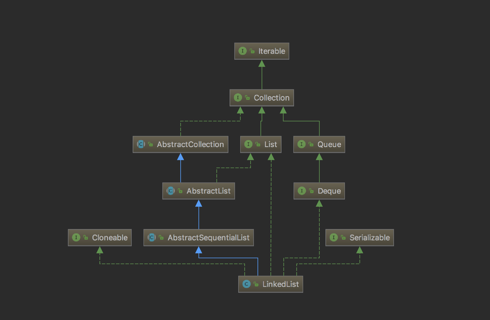

## [原文](https://blog.csdn.net/fighterandknight/article/details/61476335)

# LinkedList源码分析

## 前言
今天来介绍下LinkedList，在集合框架整体框架一章中，我们介绍了List接口，
LinkedList与ArrayList一样实现List接口，只是ArrayList是List接口的大小可变数组的实现，
LinkedList是List接口链表的实现。

基于链表实现的方式使得LinkedList在插入和删除时更优于ArrayList，而随机访问则比ArrayList逊色些。

构造图如下:

蓝色线条：继承

绿色线条：接口实现
 



## LinkedList简介

- LinkedList 是一个继承于AbstractSequentialList的双向链表。它也可以被当作堆栈、队列或双端队列进行操作。

- LinkedList 实现 List 接口，能对它进行队列操作。

- LinkedList 实现 Deque 接口，即能将LinkedList当作双端队列使用。

- LinkedList 实现了Cloneable接口，即覆盖了函数clone()，能克隆。

- LinkedList 实现java.io.Serializable接口，这意味着LinkedList支持序列化，能通过序列化去传输。

- LinkedList 是非同步的。

LinkedList相对于ArrayList来说，是可以快速添加，删除元素，
ArrayList添加删除元素的话需移动数组元素，可能还需要考虑到扩容数组长度。

ArrayList 和LinkedList它们两可以说是List接口的两种不同的实现，ArrayList的增删效率低，但是改查效率高。 
而LinkedList正好相反，增删由于不需要移动底层数组数据，其底层是链表实现的，只需要修改链表节点指针，所以效率较高。 
而改和查，都需要先定位到目标节点，所以效率较低。

开篇前，再说一遍Collection.toArray();  
这个方法很重要，不管是ArrayList、LinkedList 在批量add的时候，都会先转化成数组去做。 
因为数组可以用for循环直接花式遍历。比较方便 高效

## [链表介绍](04、链表介绍.md)

## LinkedList属性

LinkedList本身的 的属性比较少，主要有三个，一个是size，表名当前有多少个节点；
一个是first代表第一个节点；一个是last代表最后一个节点。
```java

public class LinkedList<E>
    extends AbstractSequentialList<E>
    implements List<E>, Deque<E>, Cloneable, java.io.Serializable{   
	//当前有多少个节点
    transient int size = 0;
    //第一个节点
    transient Node<E> first;
    //最后一个节点
    transient Node<E> last;
	//省略内部类和方法。。
}

```

## LinkedList构造方法
默认构造方法是空的，什么都没做，表示初始化的时候size为0，first和last的节点都为空：

```java
    public LinkedList() {
    }
    
```
另一个构造方法是带Collection值得对象作为入参的构造函数的，下面是执行逻辑：

1）使用this（）调用默认的无参构造函数。

2）调用addAll（）方法，传入当前的节点个数size，此时size为0，并将collection对象传递进去

3）检查index有没有数组越界的嫌疑

4）将collection转换成数组对象a

5）循环遍历a数组，然后将a数组里面的元素创建成拥有前后连接的节点，然后一个个按照顺序连起来。

6）修改当前的节点个数size的值

7）操作次数modCount自增1.


下面是实现的源代码：

### 默认构造函数

```java
    public LinkedList(Collection<? extends E> c) {
        this();
        addAll(c);
    }

```    

### 调用带参数的addAll方法

```java
    public boolean addAll(Collection<? extends E> c) {
        return addAll(size, c);
    }
    
```

### 将collection对象转换成数组链表

```java
    public boolean addAll(int index, Collection<? extends E> c) {
        checkPositionIndex(index);
 
        Object[] a = c.toArray();
        int numNew = a.length;
        if (numNew == 0)
            return false;
 
        Node<E> pred, succ;
        if (index == size) {
            succ = null;
            pred = last;
        } else {
            succ = node(index);
            pred = succ.prev;
        }
 
        for (Object o : a) {
            @SuppressWarnings("unchecked") E e = (E) o;
            Node<E> newNode = new Node<>(pred, e, null);
            if (pred == null)
                first = newNode;
            else
                pred.next = newNode;
            pred = newNode;
        }
 
        if (succ == null) {
            last = pred;
        } else {
            pred.next = succ;
            succ.prev = pred;
        }
 
        size += numNew;
        modCount++;
        return true;
    }

```

### add方法
 
#### add(E e)方法
该方法直接将新增的元素放置链表的最后面，然后链表的长度（size）加1，修改的次数（modCount）加1

```java
    public boolean add(E e) {
        linkLast(e);
        return true;
    }

    void linkLast(E e) {
        final Node<E> l = last;
        final Node<E> newNode = new Node<>(l, e, null);
        last = newNode;
        if (l == null)
            first = newNode;
        else
            l.next = newNode;
        size++;
        modCount++;
    }
    
```

#### add(int index, E element)方法
指定位置往数组链表中添加元素

1）检查添加的位置index 有没有小于等于当前的长度链表size，并且要求大于0

2）如果是index是等于size，那么直接往链表的最后面添加元素，相当于调用add(E e)方法

3）如果index不等于size，则先是索引到处于index位置的元素，然后在index的位置前面添加新增的元素。

```java
    public void add(int index, E element) {
        checkPositionIndex(index);
 
        if (index == size)
            linkLast(element);
        else
            linkBefore(element, node(index));
    }
    
```
把索引到的元素添加到新增的元素之后

```java
    void linkBefore(E e, Node<E> succ) {
        // assert succ != null;
        final Node<E> pred = succ.prev;
        final Node<E> newNode = new Node<>(pred, e, succ);
        succ.prev = newNode;
        if (pred == null)
            first = newNode;
        else
            pred.next = newNode;
        size++;
        modCount++;
    }
    
```

### get方法

首先是判断索引位置有没有越界，确定完成之后开始遍历链表的元素，
那么从头开始遍历还是从结尾开始遍历呢，这里其实是要索引的位置与当前链表长度的一半去做对比，
如果索引位置小于当前链表长度的一半，否则从结尾开始遍历

```java
    public E get(int index) {
        checkElementIndex(index);
        return node(index).item;
    }
    
```

### 遍历链表元素

```java
    Node<E> node(int index) {
        // assert isElementIndex(index);
 
        if (index < (size >> 1)) {
            Node<E> x = first;
            for (int i = 0; i < index; i++)
                x = x.next;
            return x;
        } else {
            Node<E> x = last;
            for (int i = size - 1; i > index; i--)
                x = x.prev;
            return x;
        }
    }
    
```

### getfirst方法
直接将第一个元素返回

```java
    public E getFirst() {
        final Node<E> f = first;
        if (f == null)
            throw new NoSuchElementException();
        return f.item;
    }
    
```
### getlast方法
直接将最后一个元素返回

```java
    public E getLast() {
        final Node<E> l = last;
        if (l == null)
            throw new NoSuchElementException();
        return l.item;
    }
    
```

### remove方法
remove（）方法
remove方法本质调用的还是removeFirst方法

```java
    public E remove() {
        return removeFirst();
    }
    
```

### removeFirst（）方法
移除第一个节点，将第一个节点置空，让下一个节点变成第一个节点，链表长度减1，修改次数加1，返回移除的第一个节点。

```java
    public E removeFirst() {
        final Node<E> f = first;
        if (f == null)
            throw new NoSuchElementException();
        return unlinkFirst(f);
    }

    private E unlinkFirst(Node<E> f) {
        // assert f == first && f != null;
        final E element = f.item;
        final Node<E> next = f.next;
        f.item = null;
        f.next = null; // help GC
        first = next;
        if (next == null)
            last = null;
        else
            next.prev = null;
        size--;
        modCount++;
        return element;
    }

```
### removeLast（）方法
移除最后一个节点，将最后一个节点置空，最后一个节点的上一个节点变成last节点，，
链表长度减1，修改次数加1，返回移除的最后一个节点。

```java
    public E removeLast() {
        final Node<E> l = last;
        if (l == null)
            throw new NoSuchElementException();
        return unlinkLast(l);
    }

    private E unlinkLast(Node<E> l) {
        // assert l == last && l != null;
        final E element = l.item;
        final Node<E> prev = l.prev;
        l.item = null;
        l.prev = null; // help GC
        last = prev;
        if (prev == null)
            first = null;
        else
            prev.next = null;
        size--;
        modCount++;
        return element;
    }
    
```

### remove（int index）方法
先是检查移除的位置是否在链表长度的范围内，如果不在则抛出异常，
根据索引index获取需要移除的节点，将移除的节点置空，让其上一个节点和下一个节点对接起来。

```java
    public E remove(int index) {
        checkElementIndex(index);
        return unlink(node(index));
    }
    
```

### set方法
检查设置元素位然后置是否越界，如果没有，则索引到index位置的节点，
将index位置的节点内容替换成新的内容element，同时返回旧值。

```java
    public E set(int index, E element) {
        checkElementIndex(index);
        Node<E> x = node(index);
        E oldVal = x.item;
        x.item = element;
        return oldVal;
    }
    
```

### clear方法
将所有链表元素置空，然后将链表长度修改成0，修改次数加1

```java
    public void clear() {
        // Clearing all of the links between nodes is "unnecessary", but:
        // - helps a generational GC if the discarded nodes inhabit
        //   more than one generation
        // - is sure to free memory even if there is a reachable Iterator
        for (Node<E> x = first; x != null; ) {
            Node<E> next = x.next;
            x.item = null;
            x.next = null;
            x.prev = null;
            x = next;
        }
        first = last = null;
        size = 0;
        modCount++;
    }

```

### push和pop方法
push其实就是调用addFirst(e)方法，pop调用的就是removeFirst()方法。


### toArray方法
创建一个Object的数组对象，然后将所有的节点都添加到Object对象中，返回Object数组对象。

```java
    public Object[] toArray() {
        Object[] result = new Object[size];
        int i = 0;
        for (Node<E> x = first; x != null; x = x.next)
            result[i++] = x.item;
        return result;
    }
```
### listIterator方法
这个方法返回的是一个内部类ListIterator，用户可以使用这个内部类变量当前的链表元素，
但是由于LinkedList也是非线程安全的类，所以和上一篇文章中的ArrayList源码分析(基于JDK8)  Iterator一样，
多线程下面使用，也可能会产生多线程修改的异常。

```java
    public ListIterator<E> listIterator(int index) {
        checkPositionIndex(index);
        return new ListItr(index);
    }

```


## 总结
ArrayList和LinkedList的比较

1、顺序插入速度ArrayList会比较快，因为ArrayList是基于数组实现的，数组是事先new好的，
只要往指定位置塞一个数据就好了；LinkedList则不同，每次顺序插入的时候LinkedList将new一个对象出来，
如果对象比较大，那么new的时间势必会长一点，再加上一些引用赋值的操作，所以顺序插入LinkedList必然慢于ArrayList

2、基于上一点，因为LinkedList里面不仅维护了待插入的元素，还维护了Entry的前置Entry和后继Entry，
如果一个LinkedList中的Entry非常多，那么LinkedList将比ArrayList更耗费一些内存

3、数据遍历的速度，看最后一部分，这里就不细讲了，
结论是：使用各自遍历效率最高的方式，ArrayList的遍历效率会比LinkedList的遍历效率高一些

4、有些说法认为LinkedList做插入和删除更快，这种说法其实是不准确的：

（1）LinkedList做插入、删除的时候，慢在寻址，快在只需要改变前后Entry的引用地址

（2）ArrayList做插入、删除的时候，慢在数组元素的批量copy，快在寻址

所以，如果待插入、删除的元素是在数据结构的前半段尤其是非常靠前的位置的时候，
LinkedList的效率将大大快过ArrayList，因为ArrayList将批量copy大量的元素；越往后，对于LinkedList来说，
因为它是双向链表，所以在第2个元素后面插入一个数据和在倒数第2个元素后面插入一个元素在效率上基本没有差别，
但是ArrayList由于要批量copy的元素越来越少，操作速度必然追上乃至超过LinkedList。

从这个分析看出，如果你十分确定你插入、删除的元素是在前半段，那么就使用LinkedList；
如果你十分确定你删除、删除的元素在比较靠后的位置，那么可以考虑使用ArrayList。
如果你不能确定你要做的插入、删除是在哪儿呢？那还是建议你使用LinkedList吧，
因为一来LinkedList整体插入、删除的执行效率比较稳定，没有ArrayList这种越往后越快的情况；
二来插入元素的时候，弄得不好ArrayList就要进行一次扩容，
记住，ArrayList底层数组扩容是一个既消耗时间又消耗空间的操作。

 