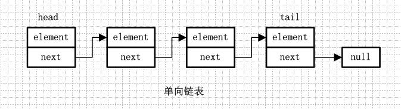
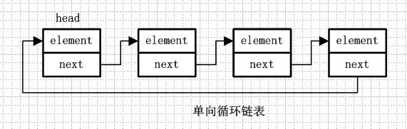
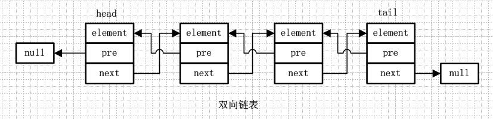
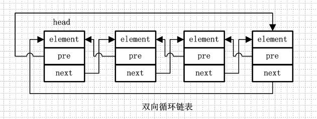
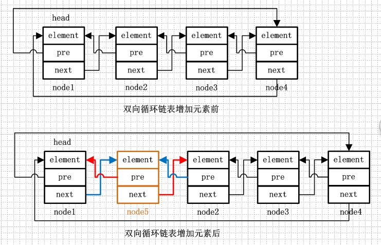

## [原文](https://www.jianshu.com/p/d5ec2ff72b33)

# 链表介绍

LinkedList是基于链表结构的一种List，在分析LinkedList源码前有必要对链表结构进行说明。

## 1.链表的概念
链表是由一系列非连续的节点组成的存储结构，简单分下类的话，链表又分为单向链表和双向链表，
而单向/双向链表又可以分为循环链表和非循环链表，下面简单就这四种链表进行图解说明。

### 1.1.单向链表
单向链表就是通过每个结点的指针指向下一个结点从而链接起来的结构，最后一个节点的next指向null。

### 1.2.单向循环链表
单向循环链表和单向列表的不同是，最后一个节点的next不是指向null，而是指向head节点，形成一个“环”。

### 1.3.双向链表
从名字就可以看出，双向链表是包含两个指针的，pre指向前一个节点，next指向后一个节点，
但是第一个节点head的pre指向null，最后一个节点的tail指向null。

### 1.4.双向循环链表
双向循环链表和双向链表的不同在于，第一个节点的pre指向最后一个节点，
最后一个节点的next指向第一个节点，也形成一个“环”。而LinkedList就是基于双向循环链表设计的。

更形象的解释下就是：双向循环链表就像一群小孩手牵手围成一个圈，
第一个小孩的右手拉着第二个小孩的左手，第二个小孩的左手拉着第一个小孩的右手。。。最后一个小孩的右手拉着第一个小孩的左手。

#### 双向循环链表添加元素

ok，链表的概念介绍完了，下面进入写注释和源码分析部分，但是在这之前还是要提醒一句，
不是啰嗦哦，链表操作理解起来比数组困难了不少，所以务必要理解上面的图解，
如果源码解析过程中遇到理解困难，请返回来照图理解。

 