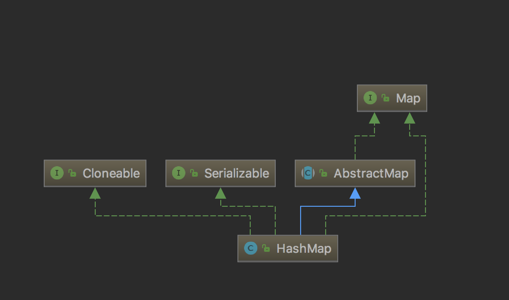
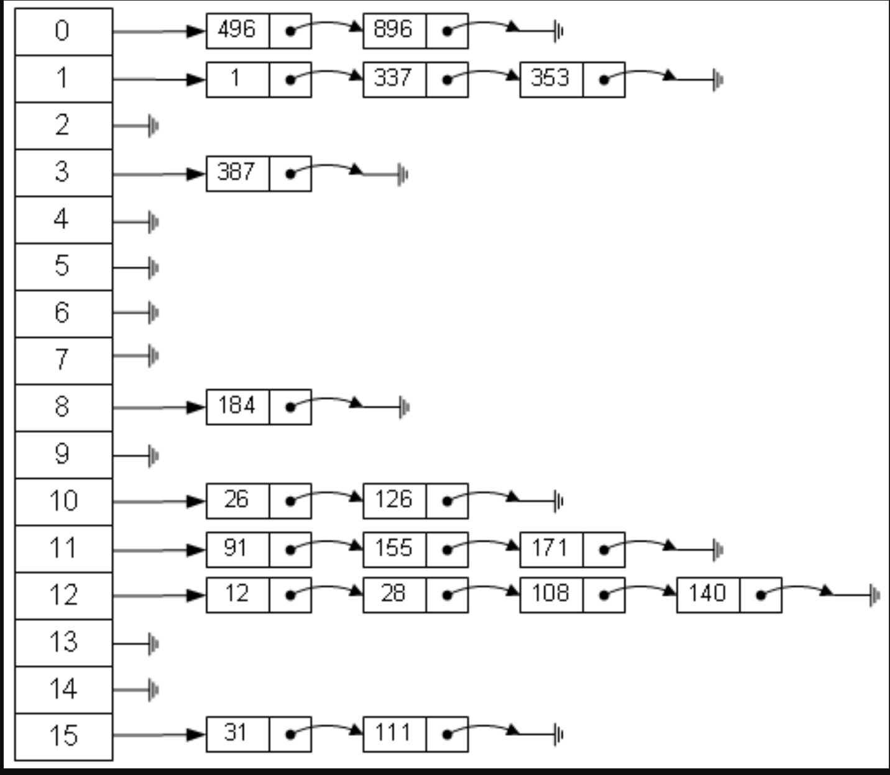
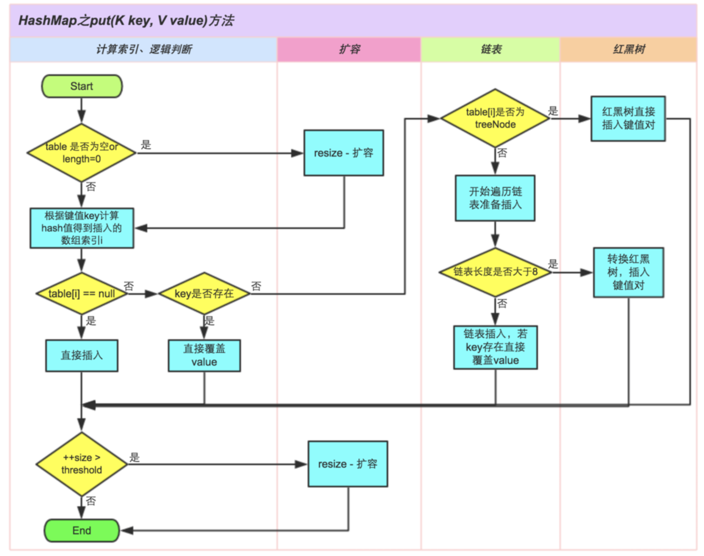

## [原文](https://www.jianshu.com/p/e6536af1018f)

## [原文](https://blog.csdn.net/fighterandknight/article/details/61624150)

# HashMap源码解析

## 前言

今天来介绍下HashMap，之前的List，讲了ArrayList、LinkedList，就前两者而言，反映的是两种思想：

- ArrayList以数组形式实现，顺序插入、查找快，插入、删除较慢

- LinkedList以链表形式实现，顺序插入、查找较慢，插入、删除方便

那么是否有一种数据结构能够结合上面两种的优点呢？
有，答案就是HashMap。它是基于哈希表的 Map 接口的实现，以key-value的形式存在。

构造图如下:

- 蓝色线条：继承
- 绿色线条：接口实现




## 正文
要理解HashMap， 就必须要知道了解其底层的实现， 而底层实现里最重要的就是它的数据结构了，
HashMap实际上是一个“链表散列”的数据结构，即数组和链表的结合体。

在分析要理解HashMap源码前有必要对hashcode进行说明。
以下是关于HashCode的官方文档定义：

> hashcode方法返回该对象的哈希码值。支持该方法是为哈希表提供一些优点，
例如，java.util.Hashtable 提供的哈希表。
hashCode 的常规协定是：
在 Java 应用程序执行期间，在同一对象上多次调用 hashCode 方法时，
必须一致地返回相同的整数，前提是对象上 equals 比较中所用的信息没有被修改。
从某一应用程序的一次执行到同一应用程序的另一次执行，该整数无需保持一致。


> 如果根据 equals(Object) 方法，两个对象是相等的，
那么在两个对象中的每个对象上调用 hashCode 方法都必须生成相同的整数结果。

> 以下情况不 是必需的：如果根据 equals(java.lang.Object) 方法，两个对象不相等，
那么在两个对象中的任一对象上调用 hashCode 方法必定会生成不同的整数结果。
但是，程序员应该知道，为不相等的对象生成不同整数结果可以提高哈希表的性能。

> 实际上，由 Object 类定义的 hashCode 方法确实会针对不同的对象返回不同的整数。
（这一般是通过将该对象的内部地址转换成一个整数来实现的，但是 JavaTM 编程语言不需要这种实现技巧。）

> 当equals方法被重写时，通常有必要重写 hashCode 方法，
以维护 hashCode 方法的常规协定，该协定声明相等对象必须具有相等的哈希码。

以上这段官方文档的定义，我们可以抽出成以下几个关键点：

1. hashCode的存在主要是用于查找的快捷性，如Hashtable，HashMap等，
hashCode是用来在散列存储结构中确定对象的存储地址的；

2. 如果两个对象相同，就是适用于equals(java.lang.Object) 方法，
那么这两个对象的hashCode一定要相同；

3. 如果对象的equals方法被重写，那么对象的hashCode也尽量重写，
并且产生hashCode使用的对象，一定要和equals方法中使用的一致，否则就会违反上面提到的第2点；

4. 两个对象的hashCode相同，并不一定表示两个对象就相同，
也就是不一定适用于equals(java.lang.Object) 方法，只能够说明这两个对象在散列存储结构中，
如Hashtable，他们“存放在同一个篮子里”。

再归纳一下就是hashCode是用于查找使用的，而equals是用于比较两个对象的是否相等的。
以下这段话是从别人帖子回复拷贝过来的：

> 1.hashcode是用来查找的，如果你学过数据结构就应该知道，在查找和排序这一章有
> 例如内存中有这样的位置
>
> 0 1 2 3 4 5 6 7
>
>而我有个类，这个类有个字段叫ID,我要把这个类存放在以上8个位置之一，
如果不用hashcode而任意存放，那么当查找时就需要到这八个位置里挨个去找，或者用二分法一类的算法。
但如果用hashcode那就会使效率提高很多。
我们这个类中有个字段叫ID,那么我们就定义我们的hashcode为ID％8，
然后把我们的类存放在取得得余数那个位置。比如我们的ID为9，9除8的余数为1，
那么我们就把该类存在1这个位置，如果ID是13，求得的余数是5，那么我们就把该类放在5这个位置。
这样，以后在查找该类时就可以通过ID除 8求余数直接找到存放的位置了。

> 2.但是如果两个类有相同的hashcode怎么办那（我们假设上面的类的ID不是唯一的），
例如9除以8和17除以8的余数都是1，那么这是不是合法的，回答是：可以这样。那么如何判断呢？
在这个时候就需要定义 equals了。
也就是说，我们先通过 hashcode来判断两个类是否存放某个桶里，但这个桶里可能有很多类，
那么我们就需要再通过 equals 来在这个桶里找到我们要的类。
那么。重写了equals()，为什么还要重写hashCode()呢？
想想，你要在一个桶里找东西，你必须先要找到这个桶啊，你不通过重写hashcode()来找到桶，
光重写equals()有什么用啊

## HashMap简介

### HashMap定义

```java
public class HashMap<K,V> extends AbstractMap<K,V>
    implements Map<K,V>, Cloneable, Serializable {
}
```

- HashMap 是一个散列表，它存储的内容是键值对(key-value)映射。

- HashMap继承于AbstractMap，实现了Map、Cloneable、java.io.Serializable接口。

- HashMap 的实现不是同步的，这意味着它不是线程安全的。
它的key、value都可以为null。此外，HashMap中的映射不是有序的。
 
 
### HashMap属性

```java
//树化链表节点的阈值，当某个链表的长度大于或者等于这个长度，则扩大数组容量，或者数化链表
	static final int TREEIFY_THRESHOLD = 8;
    //初始容量，必须是2的倍数，默认是16
    static final int DEFAULT_INITIAL_CAPACITY = 1 << 4; // aka 16
 
    //最大所能容纳的key-value 个数
    static final int MAXIMUM_CAPACITY = 1 << 30;
    //默认的加载因子
    static final float DEFAULT_LOAD_FACTOR = 0.75f;
 
	
	//存储数据的Node数组，长度是2的幂。
    transient Node<K,V>[] table;
 
    //keyset 方法要返回的结果
    transient Set<Map.Entry<K,V>> entrySet;
 
     //map中保存的键值对的数量
    transient int size;
 
    //hashmap 对象被修改的次数
    transient int modCount;
 
    // 容量乘以装在因子所得结果，如果key-value的 数量等于该值，则调用resize方法，扩大容量，同时修改threshold的值。
    int threshold;
 
    //装载因子
    final float loadFactor;
    
```


HashMap是通过"拉链法"实现的哈希表。它包括几个重要的成员变量：table, size, threshold,loadFactor, modCount。

- table是一个Node[]数组类型，而Node实际上就是一个单向链表。哈希表的"key-value键值对"都是存储在Node数组中的。

- size是HashMap的大小，它是HashMap保存的键值对的数量。

- threshold是HashMap的阈值，用于判断是否需要调整HashMap的容量。
threshold的值="容量*加载因子"，当HashMap中存储数据的数量达到threshold时，就需要将HashMap的容量加倍。

- loadFactor就是加载因子。

- modCount是用来实现fail-fast机制的。

可以看出HashMap底层是用Entry数组存储数据，同时定义了初始容量，最大容量，加载因子等参数，
至于为什么容量必须是2的幂，加载因子又是什么，下面再说，先来看一下Node的定义。

```java
static class Node<K,V> implements Map.Entry<K,V> {
        final int hash;
        final K key;
        V value;
        Node<K,V> next;

        Node(int hash, K key, V value, Node<K,V> next) {
            this.hash = hash;
            this.key = key;
            this.value = value;
            this.next = next;
        }

        public final K getKey()        { return key; }
        public final V getValue()      { return value; }
        public final String toString() { return key + "=" + value; }

        public final int hashCode() {
            return Objects.hashCode(key) ^ Objects.hashCode(value);
        }

        public final V setValue(V newValue) {
            V oldValue = value;
            value = newValue;
            return oldValue;
        }

        public final boolean equals(Object o) {
            if (o == this)
                return true;
            if (o instanceof Map.Entry) {
                Map.Entry<?,?> e = (Map.Entry<?,?>)o;
                if (Objects.equals(key, e.getKey()) &&
                    Objects.equals(value, e.getValue()))
                    return true;
            }
            return false;
        }
    }
```

Node 是HashMap的内部类，它继承了Map中的Entry接口，它定义了键(key)，值(value)，和下一个节点的引用(next)，
以及hash值。很明确的可以看出Node是什么结构，它是单线链表的一个节点。
也就是说HashMap的底层结构是一个数组，而数组的元素是一个单向链表。


### HashMap的数据结构

HashMap的底层主要是基于数组和链表来实现的，它之所以有相当快的查询速度主要是因为它是通过计算散列码来决定存储的位置。
HashMap中主要是通过key的hashCode来计算hash值的，只要hashCode相同，计算出来的hash值就一样。
如果存储的对象对多了，就有可能不同的对象所算出来的hash值是相同的，这就出现了所谓的hash冲突。
学过数据结构的同学都知道，解决hash冲突的方法有很多，HashMap底层是通过链表来解决hash冲突的。

下面一幅图，形象的反映出HashMap的数据结构：数组加链表实现

 
 
 
为什么会有这样的设计？之前介绍的List中查询时需要遍历所有的数组，为了解决这个问题HashMap采用hash算法将key散列为一个int值，
这个int值对应到数组的下标，再做查询操作的时候，拿到key的散列值，根据数组下标就能直接找到存储在数组的元素。

但是由于hash可能会出现相同的散列值，为了解决冲突，HashMap采用将相同的散列值存储到一个链表中，
也就是说在一个链表中的元素他们的散列值绝对是相同的。
找到数组下标取出链表，再遍历链表是不是比遍历整个数组效率好的多呢？

我们来看一下HashMap的具体实现。

## HashMap构造函数

### 默认构造方法

默认构造方法将使用默认的加载因子（0.75）初始化。
 
```java
  public HashMap() {
        this.loadFactor = DEFAULT_LOAD_FACTOR; // all other fields defaulted
    }
```

### HashMap(int initialCapacity, float loadFactor)  

使用指定的初始容量和默认的加载因子初始化HashMap，
这里需要注意的是，并不是你指定的初始容量是多少那么初始化之后的HashMap的容量就是多大，
例如new HashMap(20,0.8); 那么实际的初始化容量是32，
因为tableSizeFor（）方法会严格要求把初始化的容量是以2的次方数成长只能是16、32、64、128...

```java
    public HashMap(int initialCapacity, float loadFactor) {
        if (initialCapacity < 0)
            throw new IllegalArgumentException("Illegal initial capacity: " +
                                               initialCapacity);
        if (initialCapacity > MAXIMUM_CAPACITY)
            initialCapacity = MAXIMUM_CAPACITY;
        if (loadFactor <= 0 || Float.isNaN(loadFactor))
            throw new IllegalArgumentException("Illegal load factor: " +
                                               loadFactor);
        this.loadFactor = loadFactor;
        this.threshold = tableSizeFor(initialCapacity);
    }
```

在这里提到了两个参数：初始容量，加载因子。这两个参数是影响HashMap性能的重要参数，
其中容量表示哈希表中桶的数量，初始容量是创建哈希表时的容量，加载因子是哈希表在其容量自动增加之前可以达到多满的一种尺度，
它衡量的是一个散列表的空间的使用程度，负载因子越大表示散列表的装填程度越高，反之愈小。
对于使用链表法的散列表来说，查找一个元素的平均时间是O(1+a)，因此如果负载因子越大，
对空间的利用更充分，然而后果是查找效率的降低；如果负载因子太小，那么散列表的数据将过于稀疏，
对空间造成严重浪费。系统默认负载因子为0.75，一般情况下我们是无需修改的。


### 下面我们来看看tableSizeFor方法的实现

根据入参 返回2的指数 容量值
```java
    static final int tableSizeFor(int cap) {
        int n = -1 >>> Integer.numberOfLeadingZeros(cap - 1);
        return (n < 0) ? 1 : (n >= MAXIMUM_CAPACITY) ? MAXIMUM_CAPACITY : n + 1;
    }

```

其实这个方法也是调用HashMap(int initialCapacity, float loadFactor)方法实现的
```java
   public HashMap(int initialCapacity) {
        this(initialCapacity, DEFAULT_LOAD_FACTOR);
    }
```

### HashMap(Map<? extends K, ? extends V> m)
该方法是按照之前的hashMap的对象，重新深拷贝一份HashMap对象，使用的加载因子是默认的加载因子：0.75。
```java
  public HashMap(Map<? extends K, ? extends V> m) {
        this.loadFactor = DEFAULT_LOAD_FACTOR;
        putMapEntries(m, false);
    }
```
## 方法

# ## put方法

执行逻辑：

- 1）根据key计算当前Node的hash值，用于定位对象在HashMap数组的哪个节点。

- 2）判断table有没有初始化，如果没有初始化，则调用resize（）方法为table初始化容量，以及threshold的值。

- 3）根据hash值定位该key 对应的数组索引，如果对应的数组索引位置无值，则调用newNode（）方法，为该索引创建Node节点

- 4）如果根据hash值定位的数组索引有Node，并且Node中的key和需要新增的key相等，则将对应的value值更新。

- 5）如果在已有的table中根据hash找到Node，其中Node中的hash值和新增的hash相等，
但是key值不相等的，那么创建新的Node，放到当前已存在的Node的链表尾部。
      如果当前Node的长度大于8,则调用treeifyBin（）方法扩大table数组的容量，
或者将当前索引的所有Node节点变成TreeNode节点，变成TreeNode节点的原因是由于TreeNode节点组成的链表索引元素会快很多。

- 6）将当前的key-value 数量标识size自增，然后和threshold对比，
如果大于threshold的值，则调用resize（）方法，扩大当前HashMap对象的存储容量。

- 7）返回oldValue或者null。
put 方法比较经常使用的方法，主要功能是为HashMap对象添加一个Node 节点，如果Node存在则更新Node里面的内容。
```java
    public V put(K key, V value) {
        return putVal(hash(key), key, value, false, true);
    }
    
```
put的主要的实现逻辑还是在putVal 实现的.下面我们来看看put主要实现逻辑：

```java
    /**
     * Implements Map.put and related methods
     *
     * @param key的hash值
     * @param key值
     * @param value值
     * @param onlyIfAbsent如果是true，则不修改已存在的value值
     * @param evict if false, the table is in creation mode.
     * @return 返回被修改的value，或者返回null。
     */
    final V putVal(int hash, K key, V value, boolean onlyIfAbsent,
                   boolean evict) {
        Node<K,V>[] tab; Node<K,V> p; int n, i;
        if ((tab = table) == null || (n = tab.length) == 0)
	  //如果是第一次调用，则会调用resize 初始化table 以及threshold
            n = (tab = resize()).length;
        if ((p = tab[i = (n - 1) & hash]) == null)
	   //如果对应的索引没有Node，则新建Node放到table里面。
            tab[i] = newNode(hash, key, value, null);
        else {
            Node<K,V> e; K k;
            if (p.hash == hash &&
                ((k = p.key) == key || (key != null && key.equals(k))))
		//如果hash值与已存在的hash相等，并且key相等，则准备更新对应Node的value
                e = p;
            else if (p instanceof TreeNode)
                e = ((TreeNode<K,V>)p).putTreeVal(this, tab, hash, key, value);
            else {
		//如果hash值一致，但是key不一致，那么将新的key-value添加到已有的Node的最后面
                for (int binCount = 0; ; ++binCount) {
                    if ((e = p.next) == null) {
                        p.next = newNode(hash, key, value, null);
                        if (binCount >= TREEIFY_THRESHOLD - 1) // 当某个节点的链表长度大于8，则扩大table 数组的长度或者将当前节点链表变成树节点链表
                            treeifyBin(tab, hash);
                        break;
                    }
                    if (e.hash == hash &&
                        ((k = e.key) == key || (key != null && key.equals(k))))
                        break;
                    p = e;
                }
            }
            if (e != null) { // existing mapping for key
                V oldValue = e.value;
                if (!onlyIfAbsent || oldValue == null)
		   //hash值和key值相等的情况下，更新value值
                    e.value = value;
		//留给LinkedHashMap实现
                afterNodeAccess(e);
		//返回旧的value
                return oldValue;
            }
        }
	//修改次数加1
        ++modCount;
	//判断table的容量是否需要扩展
        if (++size > threshold)
            resize();
	//留给LinkedHashMap扩展
        afterNodeInsertion(evict);
        return null;
    }

```



上面调用到了一个resize方法， 我们来看看这个方法里面做了什么，实现逻辑如下：

1）如果当前数组为空，则初始化当前数组

2）如果当前table数组不为空，则将当前的table数组扩大两倍，同时将阈值（threshold）扩大两倍

      数组长度和阈值扩大成两倍之后，将之前table数组中的值全部放到新的table中去

```java
        /**
         * 初始化，或者是扩展table 的容量。
         * table的容量是按照2的指数增长的。
	 * 当扩大table 的容量的时候，元素的hash值以及位置可能发生变化。
	 */
	 final Node<K,V>[] resize() {
        Node<K,V>[] oldTab = table;
	//当前table 数组的长度
        int oldCap = (oldTab == null) ? 0 : oldTab.length;
	//当前的阈值
        int oldThr = threshold;
        int newCap, newThr = 0;
	//如果table数组已有值，则将其容量（size）和阈值（threshold）扩大两倍
        if (oldCap > 0) {
            if (oldCap >= MAXIMUM_CAPACITY) {
                threshold = Integer.MAX_VALUE;
                return oldTab;
            }
            else if ((newCap = oldCap << 1) < MAXIMUM_CAPACITY &&
                     oldCap >= DEFAULT_INITIAL_CAPACITY)
                newThr = oldThr << 1; // double threshold
        }
        else if (oldThr > 0) // initial capacity was placed in threshold
            newCap = oldThr;
        else {  // 当第一次调用resize的时候会执行这个代码，初始化table容量以及阈值
            newCap = DEFAULT_INITIAL_CAPACITY;
            newThr = (int)(DEFAULT_LOAD_FACTOR * DEFAULT_INITIAL_CAPACITY);
        }
        if (newThr == 0) {
            float ft = (float)newCap * loadFactor;
            newThr = (newCap < MAXIMUM_CAPACITY && ft < (float)MAXIMUM_CAPACITY ?
                      (int)ft : Integer.MAX_VALUE);
        }
	//将新的阈值存储起来
        threshold = newThr;
	//重新分配table 的容量
        @SuppressWarnings({"rawtypes","unchecked"})
            Node<K,V>[] newTab = (Node<K,V>[])new Node[newCap];
        table = newTab;
	//将以前table中的值copy到新的table中去
        if (oldTab != null) {
            for (int j = 0; j < oldCap; ++j) {
                Node<K,V> e;
                if ((e = oldTab[j]) != null) {
                    oldTab[j] = null;
                    if (e.next == null)
                        newTab[e.hash & (newCap - 1)] = e;
                    else if (e instanceof TreeNode)
                        ((TreeNode<K,V>)e).split(this, newTab, j, oldCap);
                    else { // preserve order
                        Node<K,V> loHead = null, loTail = null;
                        Node<K,V> hiHead = null, hiTail = null;
                        Node<K,V> next;
                        do {
                            next = e.next;
                            if ((e.hash & oldCap) == 0) {
                                if (loTail == null)
                                    loHead = e;
                                else
                                    loTail.next = e;
                                loTail = e;
                            }
                            else {
                                if (hiTail == null)
                                    hiHead = e;
                                else
                                    hiTail.next = e;
                                hiTail = e;
                            }
                        } while ((e = next) != null);
                        if (loTail != null) {
                            loTail.next = null;
                            newTab[j] = loHead;
                        }
                        if (hiTail != null) {
                            hiTail.next = null;
                            newTab[j + oldCap] = hiHead;
                        }
                    }
                }
            }
        }
        return newTab;
    }	

```

下面我们来看看treeifyBin方法的具体实现

```java
    /**
     * 如果table长度太小，则扩大table 的数组长度
     * 否则，将所有链表节点变成TreeNode，提高索引效率
     */
    final void treeifyBin(Node<K,V>[] tab, int hash) {
        int n, index; Node<K,V> e;
        if (tab == null || (n = tab.length) < MIN_TREEIFY_CAPACITY)
            resize();
        else if ((e = tab[index = (n - 1) & hash]) != null) {
            TreeNode<K,V> hd = null, tl = null;
            do {
                TreeNode<K,V> p = replacementTreeNode(e, null);
                if (tl == null)
                    hd = p;
                else {
                    p.prev = tl;
                    tl.next = p;
                }
                tl = p;
            } while ((e = e.next) != null);
            if ((tab[index] = hd) != null)
                hd.treeify(tab);
        }
    }

```

### get方法
根据key的hash值和key，可以唯一确定一个value，下面我们来看看get方法执行的逻辑

1）根据key计算hash值

2）根据hash值和key  确定所需要返回的结果，如果不存在，则返回空。

```java
    public V get(Object key) {
        Node<K,V> e;
        return (e = getNode(hash(key), key)) == null ? null : e.value;
    }
    
```
具体的实现在getNode方法实现

```java
    /**
     * Implements Map.get and related methods
     *
     * @param key 的hash值
     * @param key的值
     * @return 返回由key和hash定位的Node，或者null
     */
    final Node<K,V> getNode(int hash, Object key) {
        Node<K,V>[] tab; Node<K,V> first, e; int n; K k;
        if ((tab = table) != null && (n = tab.length) > 0 &&
            (first = tab[(n - 1) & hash]) != null) {
            if (first.hash == hash && // 如果索引到的第一个Node，key 和 hash值都和传递进来的参数相等，则返回该Node
                ((k = first.key) == key || (key != null && key.equals(k))))
                return first;
            if ((e = first.next) != null) { //如果索引到的第一个Node 不符合要求，循环变量它的下一个节点。
                if (first instanceof TreeNode)
                    return ((TreeNode<K,V>)first).getTreeNode(hash, key);
                do {
                    if (e.hash == hash &&
                        ((k = e.key) == key || (key != null && key.equals(k))))
                        return e;
                } while ((e = e.next) != null);
            }
        }
        return null;
    }
    
```
### containsKey方法
containsKey方法实际也是调用getNode方法实现的，如果key对应的value不存在则返回false

```java
    public boolean containsKey(Object key) {
        return getNode(hash(key), key) != null;
    }
    
```
### containsValue方法
containsValue方法的话需要遍历对象所有的value，遇到value相等的，则返回true，具体实现如下

```java
    public boolean containsValue(Object value) {
        Node<K,V>[] tab; V v;
        if ((tab = table) != null && size > 0) {
            for (int i = 0; i < tab.length; ++i) {
                for (Node<K,V> e = tab[i]; e != null; e = e.next) {
                    if ((v = e.value) == value ||
                        (value != null && value.equals(v)))
                        return true;
                }
            }
        }
        return false;
    }
    
```

### remove方法
执行逻辑：
- 1）根据key得到key的hash值

- 2）根据key 和hash值定位需要remove的Node

- 3)  将Node从对应的链表移除，然后再将Node 前后的节点对接起来

- 4）返回被移除 的Node

- 5）key-value的数量减一，修改次数加一
```java
    /**
     * Implements Map.remove and related methods
     *
     * @param key的hash值
     * @param key值
     * @param 需要remove 的value，
     * @param 为true时候，当value相等的时候才remove
     * @param 如果为false 的时候，不会移动其他节点。
     * @return 返回被移除的Node，或者返回null
     */
    final Node<K,V> removeNode(int hash, Object key, Object value,
                               boolean matchValue, boolean movable) {
        Node<K,V>[] tab; Node<K,V> p; int n, index;
        if ((tab = table) != null && (n = tab.length) > 0 &&
            (p = tab[index = (n - 1) & hash]) != null) {
            Node<K,V> node = null, e; K k; V v;
            if (p.hash == hash &&  //如果定位到的第一个元素符合条件，则跳出if else
                ((k = p.key) == key || (key != null && key.equals(k))))
                node = p;
            else if ((e = p.next) != null) {
                if (p instanceof TreeNode)
                    node = ((TreeNode<K,V>)p).getTreeNode(hash, key);
                else {
                    do {//定位到的第一个Node元素不符合条件，则遍历其链表
                        if (e.hash == hash &&
                            ((k = e.key) == key ||
                             (key != null && key.equals(k)))) {
                            node = e;
                            break;
                        }
                        p = e;
                    } while ((e = e.next) != null);
                }
            }
	   //移除符合要求的节点，将链表重新连接起来
            if (node != null && (!matchValue || (v = node.value) == value ||
                                 (value != null && value.equals(v)))) {
                if (node instanceof TreeNode)
                    ((TreeNode<K,V>)node).removeTreeNode(this, tab, movable);
                else if (node == p)
                    tab[index] = node.next;
                else
                    p.next = node.next;
		//修改次数加1
                ++modCount;
		//当前的key-value 对数减一
                --size;
                afterNodeRemoval(node);
                return node;
            }
        }
        return null;

```

### replace方法

```java
replace(K key, V oldValue, V newValue)

```
根据key和value定位到Node，然后将Node中的value用新value 替换，返回旧的value，否则返回空。

```java
    public boolean replace(K key, V oldValue, V newValue) {
        Node<K,V> e; V v;
        if ((e = getNode(hash(key), key)) != null &&
            ((v = e.value) == oldValue || (v != null && v.equals(oldValue)))) {
            e.value = newValue;
            afterNodeAccess(e);
            return true;
        }
        return false;
    }

```

```java
replace(K key, V value)

```
根据key定位到Node，然后将Node中的value 替换，返回旧的value，否则返回空

```java
    public V replace(K key, V value) {
        Node<K,V> e;
        if ((e = getNode(hash(key), key)) != null) {
            V oldValue = e.value;
            e.value = value;
            afterNodeAccess(e);
            return oldValue;
        }
        return null;
    }

```

### clear方法
clear 方法将每个数组元素置空

```java
 public void clear() {
        Node<K,V>[] tab;
        modCount++;
        if ((tab = table) != null && size > 0) {
            size = 0;
            for (int i = 0; i < tab.length; ++i)
                tab[i] = null;
        }
    }
    
```


 