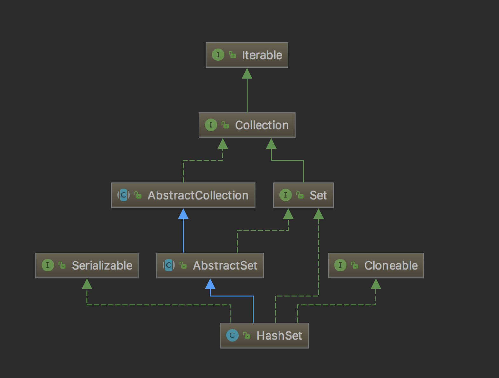

## [原文](https://www.jianshu.com/p/1f7a8dda341b)

## [原文](https://blog.csdn.net/fighterandknight/article/details/66585997)

# HashSet源码解析

## HashSet概述

对于HashSet而言，它是基于HashMap实现的，HashSet底层使用HashMap来保存所有元素，
因此HashSet 的实现比较简单，相关HashSet的操作，基本上都是直接调用底层HashMap的相关方法来完成，
其实看过了HashMap源码的同学，就会发现HashSet的实现好简单
 
构造图如下:
 
- 蓝色线条：继承
 
- 绿色线条：接口实现
 


## HashSet特点
- 非线程安全

- 允许null值

添加值得时候会先获取对象的hashCode方法，如果hashCode 方法返回的值一致，
则再调用equals方法判断是否一致，如果不一致才add元素。

> 注意： 对于HashSet中保存的对象，请注意正确重写其equals和hashCode方法，以保证放入的对象的唯一性。

## HashSet源码


```java
public class HashSet<E>  
   extends AbstractSet<E>  
   implements Set<E>, Cloneable, java.io.Serializable  
{  
   static final long serialVersionUID = -5024744406713321676L;  
 
   // 底层使用HashMap来保存HashSet中所有元素。  
   private transient HashMap<E,Object> map;  
     
   // 定义一个虚拟的Object对象作为HashMap的value，将此对象定义为static final。  
   private static final Object PRESENT = new Object();  
 
   /** 
    * 默认的无参构造器，构造一个空的HashSet。 
    *  
    * 实际底层会初始化一个空的HashMap，并使用默认初始容量为16和加载因子0.75。 
    */  
   public HashSet() {  
   map = new HashMap<E,Object>();  
   }  
 
   /** 
    * 构造一个包含指定collection中的元素的新set。 
    * 
    * 实际底层使用默认的加载因子0.75和足以包含指定 
    * collection中所有元素的初始容量来创建一个HashMap。 
    * @param c 其中的元素将存放在此set中的collection。 
    */  
   public HashSet(Collection<? extends E> c) {  
   map = new HashMap<E,Object>(Math.max((int) (c.size()/.75f) + 1, 16));  
   addAll(c);  
   }  
 
   /** 
    * 以指定的initialCapacity和loadFactor构造一个空的HashSet。 
    * 
    * 实际底层以相应的参数构造一个空的HashMap。 
    * @param initialCapacity 初始容量。 
    * @param loadFactor 加载因子。 
    */  
   public HashSet(int initialCapacity, float loadFactor) {  
   map = new HashMap<E,Object>(initialCapacity, loadFactor);  
   }  
 
   /** 
    * 以指定的initialCapacity构造一个空的HashSet。 
    * 
    * 实际底层以相应的参数及加载因子loadFactor为0.75构造一个空的HashMap。 
    * @param initialCapacity 初始容量。 
    */  
   public HashSet(int initialCapacity) {  
   map = new HashMap<E,Object>(initialCapacity);  
   }  
 
   /** 
    * 以指定的initialCapacity和loadFactor构造一个新的空链接哈希集合。 
    * 此构造函数为包访问权限，不对外公开，实际只是是对LinkedHashSet的支持。 
    * 
    * 实际底层会以指定的参数构造一个空LinkedHashMap实例来实现。 
    * @param initialCapacity 初始容量。 
    * @param loadFactor 加载因子。 
    * @param dummy 标记。 
    */  
   HashSet(int initialCapacity, float loadFactor, boolean dummy) {  
   map = new LinkedHashMap<E,Object>(initialCapacity, loadFactor);  
   }  
 
   /** 
    * 返回对此set中元素进行迭代的迭代器。返回元素的顺序并不是特定的。 
    *  
    * 底层实际调用底层HashMap的keySet来返回所有的key。 
    * 可见HashSet中的元素，只是存放在了底层HashMap的key上， 
    * value使用一个static final的Object对象标识。 
    * @return 对此set中元素进行迭代的Iterator。 
    */  
   public Iterator<E> iterator() {  
   return map.keySet().iterator();  
   }  
 
   /** 
    * 返回此set中的元素的数量（set的容量）。 
    * 
    * 底层实际调用HashMap的size()方法返回Entry的数量，就得到该Set中元素的个数。 
    * @return 此set中的元素的数量（set的容量）。 
    */  
   public int size() {  
   return map.size();  
   }  
 
   /** 
    * 如果此set不包含任何元素，则返回true。 
    * 
    * 底层实际调用HashMap的isEmpty()判断该HashSet是否为空。 
    * @return 如果此set不包含任何元素，则返回true。 
    */  
   public boolean isEmpty() {  
   return map.isEmpty();  
   }  
 
   /** 
    * 如果此set包含指定元素，则返回true。 
    * 更确切地讲，当且仅当此set包含一个满足(o==null ? e==null : o.equals(e)) 
    * 的e元素时，返回true。 
    * 
    * 底层实际调用HashMap的containsKey判断是否包含指定key。 
    * @param o 在此set中的存在已得到测试的元素。 
    * @return 如果此set包含指定元素，则返回true。 
    */  
   public boolean contains(Object o) {  
   return map.containsKey(o);  
   }  
 
   /** 
    * 如果此set中尚未包含指定元素，则添加指定元素。 
    * 更确切地讲，如果此 set 没有包含满足(e==null ? e2==null : e.equals(e2)) 
    * 的元素e2，则向此set 添加指定的元素e。 
    * 如果此set已包含该元素，则该调用不更改set并返回false。 
    * 
    * 底层实际将将该元素作为key放入HashMap。 
    * 由于HashMap的put()方法添加key-value对时，当新放入HashMap的Entry中key 
    * 与集合中原有Entry的key相同（hashCode()返回值相等，通过equals比较也返回true）， 
    * 新添加的Entry的value会将覆盖原来Entry的value，但key不会有任何改变， 
    * 因此如果向HashSet中添加一个已经存在的元素时，新添加的集合元素将不会被放入HashMap中， 
    * 原来的元素也不会有任何改变，这也就满足了Set中元素不重复的特性。 
    * @param e 将添加到此set中的元素。 
    * @return 如果此set尚未包含指定元素，则返回true。 
    */  
   public boolean add(E e) {  
   return map.put(e, PRESENT)==null;  
   }  
 
   /** 
    * 如果指定元素存在于此set中，则将其移除。 
    * 更确切地讲，如果此set包含一个满足(o==null ? e==null : o.equals(e))的元素e， 
    * 则将其移除。如果此set已包含该元素，则返回true 
    * （或者：如果此set因调用而发生更改，则返回true）。（一旦调用返回，则此set不再包含该元素）。 
    * 
    * 底层实际调用HashMap的remove方法删除指定Entry。 
    * @param o 如果存在于此set中则需要将其移除的对象。 
    * @return 如果set包含指定元素，则返回true。 
    */  
   public boolean remove(Object o) {  
   return map.remove(o)==PRESENT;  
   }  
 
   /** 
    * 从此set中移除所有元素。此调用返回后，该set将为空。 
    * 
    * 底层实际调用HashMap的clear方法清空Entry中所有元素。 
    */  
   public void clear() {  
   map.clear();  
   }  
 
   /** 
    * 返回此HashSet实例的浅表副本：并没有复制这些元素本身。 
    * 
    * 底层实际调用HashMap的clone()方法，获取HashMap的浅表副本，并设置到  HashSet中。 
    */  
   public Object clone() {  
       try {  
           HashSet<E> newSet = (HashSet<E>) super.clone();  
           newSet.map = (HashMap<E, Object>) map.clone();  
           return newSet;  
       } catch (CloneNotSupportedException e) {  
           throw new InternalError();  
       }  
   }  
}
```
